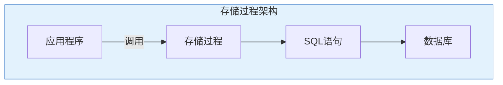

# Oracle存储过程开发

## 一、概述

### 1.1 一句话定义

Oracle存储过程是存储在数据库中的PL/SQL程序单元，可接收参数、执行业务逻辑并返回结果，是封装复杂业务逻辑的核心手段。
它在应用开发中出现和使用，解决业务逻辑封装、性能优化和安全控制的问题。

### 1.2 为什么重要

- **不掌握的后果：** 业务逻辑散落在应用层，难以维护和优化
- **掌握的价值：** 封装业务逻辑，提高性能和安全性

### 1.3 适用场景

| 场景 | 说明 |
|------|------|
| 业务逻辑封装 | 复杂业务规则 |
| 批量处理 | 大批量数据操作 |
| 事务控制 | 保证数据一致性 |
| 安全控制 | 权限隔离 |

## 二、术语与概念

### 2.1 核心术语表

| 术语 | 含义 | 类比 |
|------|------|------|
| Procedure | 存储过程 | 程序模块 |
| IN Parameter | 输入参数 | 传入值 |
| OUT Parameter | 输出参数 | 返回值 |
| IN OUT | 输入输出 | 双向参数 |
| Exception | 异常 | 错误处理 |

## 三、核心原理

### 3.1 基本语法

```sql
-- 创建存储过程
CREATE OR REPLACE PROCEDURE update_salary(
    p_employee_id IN NUMBER,
    p_raise_pct   IN NUMBER,
    p_new_salary  OUT NUMBER
) AS
    v_current_salary NUMBER;
BEGIN
    -- 获取当前工资
    SELECT salary INTO v_current_salary
    FROM employees WHERE employee_id = p_employee_id;
    
    -- 计算新工资
    p_new_salary := v_current_salary * (1 + p_raise_pct / 100);
    
    -- 更新工资
    UPDATE employees
    SET salary = p_new_salary
    WHERE employee_id = p_employee_id;
    
    -- 记录日志
    INSERT INTO salary_log(employee_id, old_salary, new_salary, change_date)
    VALUES(p_employee_id, v_current_salary, p_new_salary, SYSDATE);
    
    COMMIT;
EXCEPTION
    WHEN NO_DATA_FOUND THEN
        RAISE_APPLICATION_ERROR(-20001, '员工不存在');
    WHEN OTHERS THEN
        ROLLBACK;
        RAISE;
END update_salary;
/

-- 调用存储过程
DECLARE
    v_new_sal NUMBER;
BEGIN
    update_salary(100, 10, v_new_sal);
    DBMS_OUTPUT.PUT_LINE('新工资: ' || v_new_sal);
END;
/

-- 或直接调用
EXEC update_salary(100, 10, :new_sal);
```

### 3.2 参数模式

```sql
-- IN参数：只读
CREATE PROCEDURE proc_in(p_val IN NUMBER) AS
BEGIN
    DBMS_OUTPUT.PUT_LINE(p_val);
    -- p_val := 100;  -- 错误：不能修改
END;

-- OUT参数：只写
CREATE PROCEDURE proc_out(p_val OUT NUMBER) AS
BEGIN
    p_val := 100;  -- 必须赋值
END;

-- IN OUT参数：读写
CREATE PROCEDURE proc_inout(p_val IN OUT NUMBER) AS
BEGIN
    p_val := p_val * 2;
END;

-- 默认值
CREATE PROCEDURE proc_default(
    p_id IN NUMBER,
    p_pct IN NUMBER DEFAULT 10
) AS
BEGIN
    NULL;
END;
```

### 3.3 异常处理

```sql
CREATE OR REPLACE PROCEDURE safe_transfer(
    p_from_id IN NUMBER,
    p_to_id   IN NUMBER,
    p_amount  IN NUMBER
) AS
    e_insufficient_funds EXCEPTION;
    v_balance NUMBER;
BEGIN
    -- 检查余额
    SELECT balance INTO v_balance FROM accounts WHERE id = p_from_id;
    
    IF v_balance < p_amount THEN
        RAISE e_insufficient_funds;
    END IF;
    
    -- 执行转账
    UPDATE accounts SET balance = balance - p_amount WHERE id = p_from_id;
    UPDATE accounts SET balance = balance + p_amount WHERE id = p_to_id;
    
    COMMIT;
EXCEPTION
    WHEN e_insufficient_funds THEN
        ROLLBACK;
        RAISE_APPLICATION_ERROR(-20001, '余额不足');
    WHEN NO_DATA_FOUND THEN
        ROLLBACK;
        RAISE_APPLICATION_ERROR(-20002, '账户不存在');
    WHEN OTHERS THEN
        ROLLBACK;
        RAISE_APPLICATION_ERROR(-20099, '未知错误: ' || SQLERRM);
END;
```

### 3.4 批量处理

```sql
-- 批量更新
CREATE OR REPLACE PROCEDURE batch_update_salary(
    p_department_id IN NUMBER,
    p_raise_pct     IN NUMBER,
    p_updated_count OUT NUMBER
) AS
    TYPE emp_array IS TABLE OF employees.employee_id%TYPE;
    v_emp_ids emp_array;
BEGIN
    -- 批量获取
    SELECT employee_id BULK COLLECT INTO v_emp_ids
    FROM employees
    WHERE department_id = p_department_id;
    
    -- 批量更新
    FORALL i IN 1..v_emp_ids.COUNT
        UPDATE employees
        SET salary = salary * (1 + p_raise_pct / 100)
        WHERE employee_id = v_emp_ids(i);
    
    p_updated_count := SQL%ROWCOUNT;
    COMMIT;
END;
```

### 3.5 动态SQL

```sql
-- 动态执行SQL
CREATE OR REPLACE PROCEDURE dynamic_query(
    p_table    IN VARCHAR2,
    p_column   IN VARCHAR2,
    p_value    IN VARCHAR2,
    p_result   OUT SYS_REFCURSOR
) AS
    v_sql VARCHAR2(1000);
BEGIN
    v_sql := 'SELECT * FROM ' || p_table || 
             ' WHERE ' || p_column || ' = :1';
    OPEN p_result FOR v_sql USING p_value;
END;
```

## 四、架构与组件

### 4.1 存储过程架构



## 五、配置与调优

### 5.1 性能优化

| 技巧 | 说明 |
|------|------|
| FORALL | 批量操作 |
| BULK COLLECT | 批量查询 |
| 避免上下文切换 | 减少SQL调用 |
| 使用绑定变量 | 防止硬解析 |

## 六、监控与诊断

### 6.1 调试方法

```sql
-- DBMS_OUTPUT调试
SET SERVEROUTPUT ON;
BEGIN
    DBMS_OUTPUT.PUT_LINE('调试信息');
END;

-- 查看存储过程源码
SELECT text FROM all_source
WHERE name = 'UPDATE_SALARY'
ORDER BY line;

-- 查看错误
SELECT * FROM user_errors WHERE name = 'UPDATE_SALARY';
```

## 七、实战案例

### 7.1 案例：月度结算存储过程

```sql
CREATE OR REPLACE PROCEDURE monthly_settlement(
    p_month     IN VARCHAR2,
    p_status    OUT VARCHAR2
) AS
    v_count NUMBER;
BEGIN
    -- 1. 计算利息
    FOR rec IN (SELECT account_id, balance FROM accounts) LOOP
        UPDATE accounts
        SET balance = balance * (1 + interest_rate/12)
        WHERE account_id = rec.account_id;
    END LOOP;
    
    -- 2. 生成报表
    INSERT INTO monthly_report(month, total_balance)
    SELECT p_month, SUM(balance) FROM accounts;
    
    -- 3. 清理临时数据
    DELETE FROM temp_transactions WHERE trans_date < ADD_MONTHS(SYSDATE, -1);
    
    p_status := 'SUCCESS';
    COMMIT;
EXCEPTION
    WHEN OTHERS THEN
        p_status := 'FAILED: ' || SQLERRM;
        ROLLBACK;
END;
```

## 八、常见错误与排查

| 错误 | 问题 | 解决方法 |
|------|------|---------|
| PLS-00201 | 标识符未声明 | 检查变量名 |
| ORA-06502 | 数值或值错误 | 检查数据类型 |
| ORA-01403 | 未找到数据 | 处理NO_DATA_FOUND |

## 九、最佳实践

### 9.1 官方推荐

- 使用异常处理
- 参数使用明确模式
- 批量操作使用FORALL
- 记录执行日志

## 十、命令与视图汇总

| 命令/视图 | 用途 |
|-----------|------|
| CREATE PROCEDURE | 创建过程 |
| EXEC/CALL | 调用过程 |
| ALL_SOURCE | 源码查看 |
| ALL_ERRORS | 编译错误 |

## 十一、总结速查

### 11.1 黄金法则

1. **异常处理** - 必须捕获
2. **参数模式** - 明确IN/OUT
3. **批量操作** - FORALL/BULK
4. **日志记录** - 便于追踪

## 附录

### A. 官方参考

- [Oracle Database PL/SQL Language Reference](https://docs.oracle.com/en/database/oracle/oracle-database/19c/lnpls/)

### B. 修订记录

| 日期 | 版本 | 修改内容 | 修改人 |
|------|------|---------|--------|
| 2026-07-02 | v1.0 | 初始版本 | YashanDB知识库生成器 |

## 七、高级存储过程

### 7.1 过程重载

```sql
-- 创建同名不同参数的过程
CREATE OR REPLACE PACKAGE emp_pkg IS
    PROCEDURE get_employee(p_id NUMBER, o_name OUT VARCHAR2);
    PROCEDURE get_employee(p_name VARCHAR2, o_ids OUT SYS_REFCURSOR);
END;
/

CREATE OR REPLACE PACKAGE BODY emp_pkg IS
    PROCEDURE get_employee(p_id NUMBER, o_name OUT VARCHAR2) IS
    BEGIN
        SELECT first_name || ' ' || last_name INTO o_name
        FROM employees WHERE employee_id = p_id;
    END;
    
    PROCEDURE get_employee(p_name VARCHAR2, o_ids OUT SYS_REFCURSOR) IS
    BEGIN
        OPEN o_ids FOR
            SELECT employee_id FROM employees
            WHERE first_name LIKE p_name || '%';
    END;
END;
/
```

### 7.2 自治事务

```sql
-- 独立事务（不受主事务回滚影响）
CREATE OR REPLACE PROCEDURE audit_log(
    p_action VARCHAR2, p_details VARCHAR2
) IS
    PRAGMA AUTONOMOUS_TRANSACTION;
BEGIN
    INSERT INTO audit_table(action, details, log_time)
    VALUES (p_action, p_details, SYSDATE);
    COMMIT;  -- 必须COMMIT或ROLLBACK
END;
/

-- 使用：即使主事务回滚，审计日志仍然保留
BEGIN
    -- 主事务
    UPDATE accounts SET balance = balance - 1000 WHERE id = 1;
    audit_log('WITHDRAW', 'Account 1 withdrew 1000');
    
    -- 如果出错回滚
    -- 审计日志仍然保留
END;
```

### 7.3 过程调试

```sql
-- 使用DBMS_OUTPUT调试
CREATE OR REPLACE PROCEDURE debug_example IS
BEGIN
    DBMS_OUTPUT.PUT_LINE('Step 1: Starting');
    -- 业务逻辑
    DBMS_OUTPUT.PUT_LINE('Step 2: Processing');
    DBMS_OUTPUT.PUT_LINE('Step 3: Done');
EXCEPTION
    WHEN OTHERS THEN
        DBMS_OUTPUT.PUT_LINE('Error: ' || SQLERRM);
        DBMS_OUTPUT.PUT_LINE('Backtrace: ' || DBMS_UTILITY.FORMAT_ERROR_BACKTRACE);
END;
/

-- 启用DBMS_OUTPUT
SET SERVEROUTPUT ON SIZE UNLIMITED;
```

## 八、性能优化

### 8.1 优化建议

| 建议 | 说明 |
|------|------|
| 使用绑定变量 | 避免硬解析 |
| BULK COLLECT | 批量获取数据 |
| FORALL | 批量DML |
| NOCOPY | 大参数传递优化 |
| 结果缓存 | DETERMINISTIC函数 |

```sql
-- NOCOPY优化大参数传递
CREATE OR REPLACE PROCEDURE process_large_data(
    p_data IN OUT NOCOPY large_table_type
) IS
BEGIN
    -- 直接修改，不需要拷贝
    FOR i IN 1 .. p_data.COUNT LOOP
        p_data(i).processed := 'Y';
    END LOOP;
END;
/
```

## 九、常见错误

| 错误 | 原因 | 解决方案 |
|------|------|---------|
| ORA-06550 | PL/SQL语法错误 | 检查语法 |
| ORA-00942 | 表不存在 | 检查权限 |
| ORA-01403 | 无数据 | 处理NO_DATA_FOUND |
| ORA-01422 | 多行返回 | 使用游标 |

## 十、总结速查

| 特性 | 语法 | 说明 |
|------|------|------|
| 创建 | CREATE PROCEDURE | 定义过程 |
| 参数 | IN/OUT/IN OUT | 参数模式 |
| 重载 | 同名不同参 | 包内支持 |
| 自治事务 | PRAGMA AUTONOMOUS | 独立提交 |
| 调试 | DBMS_OUTPUT | 输出调试 |
