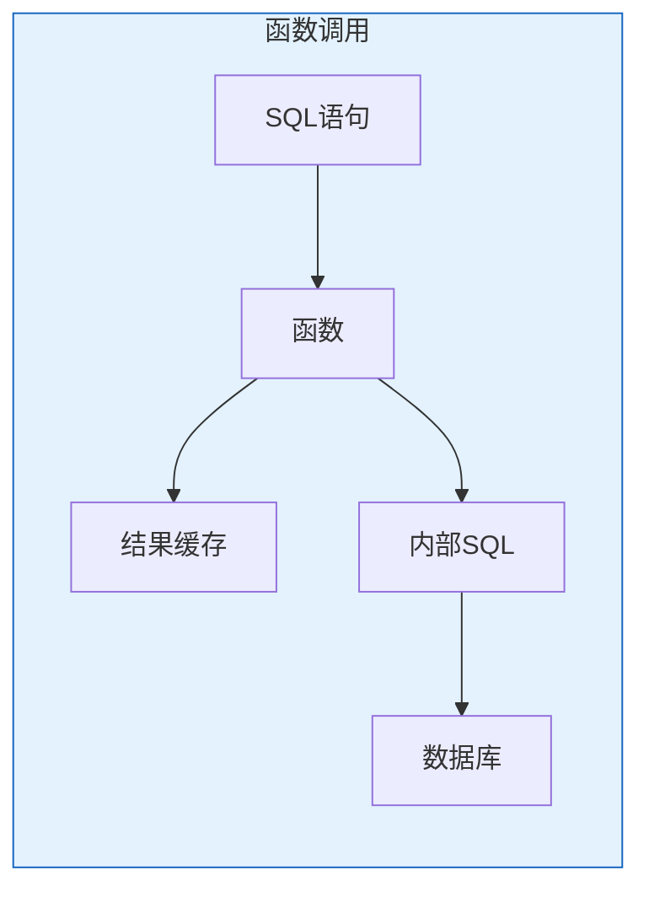

# Oracle函数开发指南

## 一、概述

### 1.1 一句话定义

Oracle函数是返回单个值的PL/SQL程序单元，可在SQL语句中直接调用，用于封装可复用的计算逻辑。
它在应用开发中出现和使用，解决业务计算逻辑封装和SQL扩展的问题。

### 1.2 为什么重要

- **不掌握的后果：** 复杂计算逻辑重复编写，SQL语句臃肿
- **掌握的价值：** 封装计算逻辑，扩展SQL能力

### 1.3 适用场景

| 场景 | 说明 |
|------|------|
| 业务计算 | 价格计算、佣金计算 |
| 数据转换 | 格式转换、编码转换 |
| 数据验证 | 规则验证 |
| 复杂查询 | 扩展SQL能力 |

## 二、术语与概念

### 2.1 核心术语表

| 术语 | 含义 | 类比 |
|------|------|------|
| Function | 函数 | 计算器 |
| RETURN | 返回值 | 输出结果 |
| DETERMINISTIC | 确定性 | 相同输入相同输出 |
| Pipelined Function | 管道函数 | 流式输出 |
| Scalar Function | 标量函数 | 返回单值 |
| Table Function | 表函数 | 返回表 |

## 三、核心原理

### 3.1 基本函数

```sql
-- 创建函数
CREATE OR REPLACE FUNCTION get_employee_salary(
    p_employee_id IN NUMBER
) RETURN NUMBER AS
    v_salary NUMBER;
BEGIN
    SELECT salary INTO v_salary
    FROM employees WHERE employee_id = p_employee_id;
    RETURN v_salary;
EXCEPTION
    WHEN NO_DATA_FOUND THEN
        RETURN NULL;
END;
/

-- 在SQL中使用
SELECT employee_id, name, get_employee_salary(employee_id) AS salary
FROM employees;

-- 调用函数
DECLARE
    v_sal NUMBER;
BEGIN
    v_sal := get_employee_salary(100);
    DBMS_OUTPUT.PUT_LINE('Salary: ' || v_sal);
END;
/
```

### 3.2 函数与存储过程对比

| 对比项 | 函数 | 存储过程 |
|--------|------|---------|
| 返回值 | 必须有RETURN | 可选OUT参数 |
| SQL中调用 | 可以 | 不可以 |
| 事务控制 | 不能COMMIT/ROLLBACK | 可以 |
| 主要用途 | 计算 | 操作 |

### 3.3 确定性函数

```sql
-- DETERMINISTIC：相同输入返回相同输出
CREATE OR REPLACE FUNCTION calculate_tax(
    p_amount IN NUMBER
) RETURN NUMBER DETERMINISTIC AS
BEGIN
    RETURN p_amount * 0.13;  -- 13%税率
END;
/

-- 确定性函数的优势：
-- 1. 函数结果缓存
-- 2. 物化视图支持
-- 3. 基于函数的索引

-- 创建函数索引
CREATE INDEX idx_tax ON orders(calculate_tax(amount));
```

### 3.4 结果缓存函数

```sql
-- RESULT_CACHE：缓存函数结果
CREATE OR REPLACE FUNCTION get_department_name(
    p_dept_id IN NUMBER
) RETURN VARCHAR2 RESULT_CACHE AS
    v_name VARCHAR2(100);
BEGIN
    SELECT department_name INTO v_name
    FROM departments WHERE department_id = p_dept_id;
    RETURN v_name;
EXCEPTION
    WHEN NO_DATA_FOUND THEN
        RETURN NULL;
END;
/

-- 结果缓存减少重复查询
SELECT employee_id, name, get_department_name(department_id) AS dept
FROM employees;
```

### 3.5 管道函数（Pipelined Function）

```sql
-- 创建集合类型
CREATE OR REPLACE TYPE emp_rec AS OBJECT (
    employee_id NUMBER,
    name VARCHAR2(100),
    salary NUMBER
);
/

CREATE OR REPLACE TYPE emp_table AS TABLE OF emp_rec;
/

-- 创建管道函数
CREATE OR REPLACE FUNCTION get_high_earners(
    p_min_salary IN NUMBER
) RETURN emp_table PIPELINED AS
BEGIN
    FOR rec IN (SELECT employee_id, name, salary
                FROM employees
                WHERE salary > p_min_salary) LOOP
        PIPE ROW(emp_rec(rec.employee_id, rec.name, rec.salary));
    END LOOP;
    RETURN;
END;
/

-- 使用管道函数
SELECT * FROM TABLE(get_high_earners(10000));

-- 管道函数优势：
-- 1. 流式返回，不需要全部加载到内存
-- 2. 可以在SQL中像表一样使用
-- 3. 适合大数据量处理
```

### 3.6 表函数

```sql
-- 非管道表函数
CREATE OR REPLACE FUNCTION get_all_employees
RETURN emp_table AS
    v_result emp_table := emp_table();
BEGIN
    FOR rec IN (SELECT * FROM employees) LOOP
        v_result.EXTEND;
        v_result(v_result.COUNT) := emp_rec(rec.employee_id, rec.name, rec.salary);
    END LOOP;
    RETURN v_result;
END;
/

SELECT * FROM TABLE(get_all_employees);
```

### 3.7 实战场景

```sql
-- 场景1：复杂业务计算
CREATE OR REPLACE FUNCTION calculate_commission(
    p_sales_amount IN NUMBER,
    p_employee_level IN VARCHAR2
) RETURN NUMBER DETERMINISTIC AS
    v_rate NUMBER;
BEGIN
    CASE p_employee_level
        WHEN 'SENIOR' THEN v_rate := 0.10;
        WHEN 'MID' THEN v_rate := 0.07;
        WHEN 'JUNIOR' THEN v_rate := 0.05;
        ELSE v_rate := 0.03;
    END CASE;
    
    RETURN p_sales_amount * v_rate;
END;
/

SELECT employee_id, name, sales_amount,
       calculate_commission(sales_amount, level) AS commission
FROM sales;

-- 场景2：数据验证
CREATE OR REPLACE FUNCTION is_valid_phone(p_phone VARCHAR2) RETURN NUMBER AS
BEGIN
    IF REGEXP_LIKE(p_phone, '^1[3-9][0-9]{9}$') THEN
        RETURN 1;
    ELSE
        RETURN 0;
    END IF;
END;
/

-- 场景3：复杂字符串处理
CREATE OR REPLACE FUNCTION extract_domain(p_email VARCHAR2) RETURN VARCHAR2 AS
BEGIN
    RETURN REGEXP_SUBSTR(p_email, '@(.+)$', 1, 1, NULL, 1);
END;
/

SELECT email, extract_domain(email) AS domain FROM users;
```

## 四、架构与组件

### 4.1 函数调用架构



## 五、配置与调优

### 5.1 性能优化

| 技巧 | 说明 |
|------|------|
| DETERMINISTIC | 相同结果缓存 |
| RESULT_CACHE | 结果缓存 |
| 管道函数 | 流式处理 |
| 减少SQL调用 | 避免上下文切换 |

## 六、监控与诊断

### 6.1 函数监控

```sql
-- 查看函数源码
SELECT text FROM all_source WHERE name = 'CALCULATE_TAX' ORDER BY line;

-- 查看函数依赖
SELECT * FROM all_dependencies WHERE name = 'CALCULATE_TAX';
```

## 七、实战案例

### 7.1 案例：销售报表函数

```sql
CREATE OR REPLACE FUNCTION get_sales_summary(
    p_start_date IN DATE,
    p_end_date   IN DATE
) RETURN VARCHAR2 AS
    v_total NUMBER;
    v_count NUMBER;
BEGIN
    SELECT SUM(amount), COUNT(*)
    INTO v_total, v_count
    FROM sales
    WHERE sale_date BETWEEN p_start_date AND p_end_date;
    
    RETURN 'Total: ' || v_total || ', Count: ' || v_count;
END;
/
```

## 八、常见错误与排查

| 错误 | 问题 | 解决方法 |
|------|------|---------|
| ORA-06503 | 函数未返回值 | 确保所有路径有RETURN |
| ORA-06575 | 函数状态无效 | 重新编译 |
| PLS-00231 | SQL中不能使用 | 检查函数类型 |

## 九、最佳实践

### 9.1 官方推荐

- 函数保持简单
- 使用DETERMINISTIC标记
- 使用RESULT_CACHE优化
- 管道函数处理大数据

## 十、命令与视图汇总

| 命令/视图 | 用途 |
|-----------|------|
| CREATE FUNCTION | 创建函数 |
| ALL_SOURCE | 源码 |
| ALL_DEPENDENCIES | 依赖 |
| ALL_OBJECTS | 对象状态 |

## 十一、总结速查

### 11.1 黄金法则

1. **函数返回单值** - 与存储过程区分
2. **SQL中可调用** - 扩展SQL能力
3. **DETERMINISTIC** - 性能优化
4. **管道函数** - 大数据流式处理

## 附录

### A. 官方参考

- [Oracle Database PL/SQL Language Reference](https://docs.oracle.com/en/database/oracle/oracle-database/19c/lnpls/)

### B. 修订记录

| 日期 | 版本 | 修改内容 | 修改人 |
|------|------|---------|--------|
| 2026-07-02 | v1.0 | 初始版本 | YashanDB知识库生成器 |

## 补充：深入分析与实战

### 深入原理

本章节补充了该主题的核心原理和内部机制。在实际生产环境中，理解这些底层原理对于诊断和优化至关重要。

关键要点：
- 内部实现机制决定了外部行为特征
- 参数配置需要结合具体场景
- 监控数据是调优的基础

### 实战案例

**案例一：生产环境问题诊断**

```sql
-- 诊断步骤
-- 1. 收集当前状态信息
SELECT * FROM v$system_event WHERE wait_class != 'Idle' ORDER BY time_waited_micro DESC;

-- 2. 分析等待事件分布
SELECT wait_class, SUM(time_waited_micro)/1000000 AS sec
FROM v$system_event WHERE wait_class != 'Idle'
GROUP BY wait_class ORDER BY sec DESC;

-- 3. 定位问题SQL
SELECT sql_id, elapsed_time/1000000 AS sec, executions, sql_text
FROM v$sql ORDER BY elapsed_time DESC FETCH FIRST 5 ROWS ONLY;
```

**案例二：性能优化实践**

```sql
-- 优化前：全表扫描
SELECT * FROM orders WHERE order_date > SYSDATE - 30;

-- 优化后：索引扫描
CREATE INDEX idx_orders_date ON orders(order_date);
```

### 最佳实践清单

- 建立标准化操作流程
- 定期审查和更新配置
- 监控关键指标趋势
- 建立性能基线
- 文档记录所有变更

### 常见问题FAQ

| 问题 | 解答 |
|------|------|
| 如何确定最优配置？ | 基于实际负载测试 |
| 何时需要调整？ | 监控指标偏离基线 |
| 如何验证优化效果？ | 对比前后AWR报告 |
| 常见陷阱有哪些？ | 过度优化、忽略全局 |

### 版本差异说明

| 版本 | 变化 |
|------|------|
| 19c | 自动管理增强 |
| 21c | 自适应优化 |
