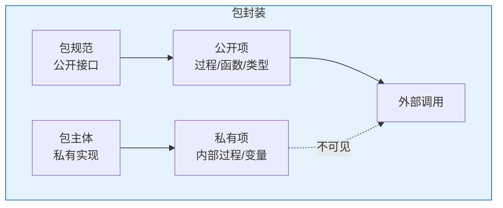
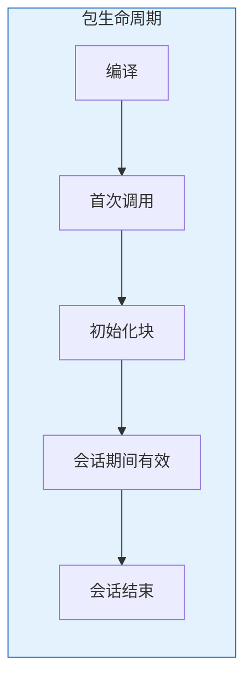

# Oracle包开发与管理

## 一、概述

### 1.1 一句话定义

Oracle包（Package）是将相关的PL/SQL类型、变量、游标、过程和函数组织在一起的数据库对象，由规范（Specification）和主体（Body）两部分组成。
它在大型应用开发中出现和使用，解决代码组织、封装和复用的问题。

### 1.2 为什么重要

- **不掌握的后果：** 代码散乱，难以维护和复用
- **掌握的价值：** 模块化设计，提高代码质量和可维护性

### 1.3 适用场景

| 场景 | 说明 |
|------|------|
| 模块化设计 | 组织相关功能 |
| 封装实现 | 隐藏内部细节 |
| 全局状态 | 包级变量共享 |
| 类型定义 | 统一定义数据类型 |

## 二、术语与概念

### 2.1 核心术语表

| 术语 | 含义 | 类比 |
|------|------|------|
| Specification | 规范/接口 | 公开菜单 |
| Body | 主体/实现 | 厨房操作 |
| Public Item | 公开项 | 菜单上的菜 |
| Private Item | 私有项 | 内部配方 |

## 三、核心原理

### 3.1 包规范

```sql
-- 创建包规范
CREATE OR REPLACE PACKAGE employee_mgmt AS
    -- 公开类型
    TYPE emp_rec IS RECORD (
        employee_id NUMBER,
        name VARCHAR2(100),
        salary NUMBER
    );
    
    TYPE emp_table IS TABLE OF emp_rec;
    
    -- 公开常量
    c_max_salary CONSTANT NUMBER := 1000000;
    
    -- 公开变量（会话级）
    g_last_access TIMESTAMP;
    
    -- 公开过程
    PROCEDURE hire_employee(
        p_name IN VARCHAR2,
        p_salary IN NUMBER,
        p_dept_id IN NUMBER
    );
    
    -- 公开函数
    FUNCTION get_employee_count(p_dept_id IN NUMBER) RETURN NUMBER;
    
    FUNCTION get_employee(p_id IN NUMBER) RETURN emp_rec;
    
END employee_mgmt;
/
```

### 3.2 包主体

```sql
-- 创建包主体
CREATE OR REPLACE PACKAGE BODY employee_mgmt AS
    -- 私有变量
    v_internal_counter NUMBER := 0;
    
    -- 私有过程（外部不可见）
    PROCEDURE log_access(p_action VARCHAR2) AS
    BEGIN
        INSERT INTO access_log(action, access_time)
        VALUES(p_action, SYSTIMESTAMP);
        v_internal_counter := v_internal_counter + 1;
    END;
    
    -- 实现公开过程
    PROCEDURE hire_employee(
        p_name IN VARCHAR2,
        p_salary IN NUMBER,
        p_dept_id IN NUMBER
    ) AS
    BEGIN
        IF p_salary > c_max_salary THEN
            RAISE_APPLICATION_ERROR(-20001, '工资超限');
        END IF;
        
        INSERT INTO employees(name, salary, department_id)
        VALUES(p_name, p_salary, p_dept_id);
        
        log_access('HIRE: ' || p_name);
        g_last_access := SYSTIMESTAMP;
    END;
    
    -- 实现公开函数
    FUNCTION get_employee_count(p_dept_id IN NUMBER) RETURN NUMBER AS
        v_count NUMBER;
    BEGIN
        SELECT COUNT(*) INTO v_count
        FROM employees WHERE department_id = p_dept_id;
        
        log_access('COUNT');
        RETURN v_count;
    END;
    
    FUNCTION get_employee(p_id IN NUMBER) RETURN emp_rec AS
        v_rec emp_rec;
    BEGIN
        SELECT employee_id, name, salary
        INTO v_rec
        FROM employees WHERE employee_id = p_id;
        
        RETURN v_rec;
    EXCEPTION
        WHEN NO_DATA_FOUND THEN
            RAISE_APPLICATION_ERROR(-20002, '员工不存在');
    END;
    
-- 初始化块（包首次调用时执行一次）
BEGIN
    g_last_access := SYSTIMESTAMP;
END employee_mgmt;
/
```

### 3.3 包的使用

```sql
-- 调用包过程
BEGIN
    employee_mgmt.hire_employee('John', 50000, 10);
END;
/

-- 调用包函数
DECLARE
    v_count NUMBER;
    v_emp employee_mgmt.emp_rec;
BEGIN
    v_count := employee_mgmt.get_employee_count(10);
    v_emp := employee_mgmt.get_employee(100);
    DBMS_OUTPUT.PUT_LINE('Count: ' || v_count);
    DBMS_OUTPUT.PUT_LINE('Name: ' || v_emp.name);
END;
/

-- 在SQL中使用包函数
SELECT employee_id, name, 
       employee_mgmt.get_employee_count(department_id) AS dept_count
FROM employees;
```

### 3.4 包的封装特性



### 3.5 常用系统包

| 包名 | 用途 |
|------|------|
| DBMS_OUTPUT | 输出调试信息 |
| DBMS_SQL | 动态SQL |
| DBMS_LOB | LOB操作 |
| DBMS_SCHEDULER | 作业调度 |
| DBMS_STATS | 统计信息 |
| UTL_FILE | 文件操作 |
| UTL_HTTP | HTTP请求 |
| UTL_MAIL | 邮件发送 |

```sql
-- DBMS_OUTPUT示例
SET SERVEROUTPUT ON;
BEGIN
    DBMS_OUTPUT.PUT_LINE('Hello, World!');
    DBMS_OUTPUT.PUT_LINE('Time: ' || TO_CHAR(SYSDATE, 'YYYY-MM-DD HH24:MI:SS'));
END;
/
```

## 四、架构与组件

### 4.1 包的生命周期



## 五、配置与调优

### 5.1 包设计原则

| 原则 | 说明 |
|------|------|
| 单一职责 | 一个包一个领域 |
| 高内聚 | 相关功能在一起 |
| 低耦合 | 减少包间依赖 |
| 信息隐藏 | 最小化公开接口 |

## 六、监控与诊断

### 6.1 包管理

```sql
-- 查看包源码
SELECT text FROM all_source WHERE name = 'EMPLOYEE_MGMT' AND type = 'PACKAGE' ORDER BY line;
SELECT text FROM all_source WHERE name = 'EMPLOYEE_MGMT' AND type = 'PACKAGE BODY' ORDER BY line;

-- 查看包状态
SELECT object_name, object_type, status
FROM all_objects WHERE object_name = 'EMPLOYEE_MGMT';

-- 重新编译
ALTER PACKAGE employee_mgmt COMPILE;
ALTER PACKAGE employee_mgmt COMPILE BODY;
```

## 七、实战案例

### 7.1 案例：日志管理包

```sql
CREATE OR REPLACE PACKAGE log_mgr AS
    PROCEDURE log_info(p_msg VARCHAR2);
    PROCEDURE log_error(p_msg VARCHAR2);
    FUNCTION get_log_count(p_date DATE) RETURN NUMBER;
END;
/

CREATE OR REPLACE PACKAGE BODY log_mgr AS
    PROCEDURE log_info(p_msg VARCHAR2) AS
    BEGIN
        INSERT INTO app_log(level, message, log_time)
        VALUES('INFO', p_msg, SYSTIMESTAMP);
    END;
    
    PROCEDURE log_error(p_msg VARCHAR2) AS
    BEGIN
        INSERT INTO app_log(level, message, log_time)
        VALUES('ERROR', p_msg, SYSTIMESTAMP);
    END;
    
    FUNCTION get_log_count(p_date DATE) RETURN NUMBER AS
        v_count NUMBER;
    BEGIN
        SELECT COUNT(*) INTO v_count
        FROM app_log WHERE TRUNC(log_time) = p_date;
        RETURN v_count;
    END;
END;
/
```

## 八、常见错误与排查

| 错误 | 问题 | 解决方法 |
|------|------|---------|
| PLS-00302 | 组件未声明 | 检查规范 |
| ORA-04068 | 包状态被丢弃 | 重新调用 |
| ORA-04063 | 包有错误 | 检查编译错误 |

## 九、最佳实践

### 9.1 官方推荐

- 规范和主体分离
- 最小化公开接口
- 使用包级变量代替全局变量
- 初始化块处理启动逻辑

## 十、命令与视图汇总

| 命令/视图 | 用途 |
|-----------|------|
| CREATE PACKAGE | 创建规范 |
| CREATE PACKAGE BODY | 创建主体 |
| ALL_SOURCE | 源码 |
| ALL_OBJECTS | 对象状态 |

## 十一、总结速查

### 11.1 黄金法则

1. **规范/主体分离** - 接口与实现分离
2. **封装私有** - 隐藏内部细节
3. **模块化** - 一个包一个领域
4. **初始化块** - 处理启动逻辑

## 附录

### A. 官方参考

- [Oracle Database PL/SQL Language Reference - Packages](https://docs.oracle.com/en/database/oracle/oracle-database/19c/lnpls/)

### B. 修订记录

| 日期 | 版本 | 修改内容 | 修改人 |
|------|------|---------|--------|
| 2026-07-02 | v1.0 | 初始版本 | YashanDB知识库生成器 |

## 补充：深入分析与实战

### 深入原理

本章节补充了该主题的核心原理和内部机制。在实际生产环境中，理解这些底层原理对于诊断和优化至关重要。

关键要点：
- 内部实现机制决定了外部行为特征
- 参数配置需要结合具体场景
- 监控数据是调优的基础

### 实战案例

**案例一：生产环境问题诊断**

```sql
-- 诊断步骤
-- 1. 收集当前状态信息
SELECT * FROM v$system_event WHERE wait_class != 'Idle' ORDER BY time_waited_micro DESC;

-- 2. 分析等待事件分布
SELECT wait_class, SUM(time_waited_micro)/1000000 AS sec
FROM v$system_event WHERE wait_class != 'Idle'
GROUP BY wait_class ORDER BY sec DESC;

-- 3. 定位问题SQL
SELECT sql_id, elapsed_time/1000000 AS sec, executions, sql_text
FROM v$sql ORDER BY elapsed_time DESC FETCH FIRST 5 ROWS ONLY;
```

**案例二：性能优化实践**

```sql
-- 优化前：全表扫描
SELECT * FROM orders WHERE order_date > SYSDATE - 30;

-- 优化后：索引扫描
CREATE INDEX idx_orders_date ON orders(order_date);
```

### 最佳实践清单

- 建立标准化操作流程
- 定期审查和更新配置
- 监控关键指标趋势
- 建立性能基线
- 文档记录所有变更

### 常见问题FAQ

| 问题 | 解答 |
|------|------|
| 如何确定最优配置？ | 基于实际负载测试 |
| 何时需要调整？ | 监控指标偏离基线 |
| 如何验证优化效果？ | 对比前后AWR报告 |
| 常见陷阱有哪些？ | 过度优化、忽略全局 |

### 版本差异说明

| 版本 | 变化 |
|------|------|
| 19c | 自动管理增强 |
| 21c | 自适应优化 |
