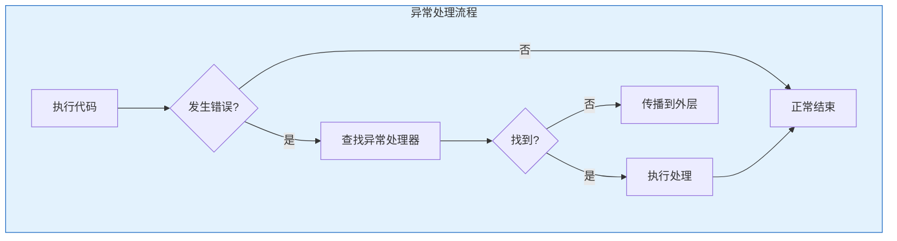

# Oracle PL/SQL异常处理

## 一、概述

### 1.1 一句话定义

Oracle PL/SQL异常处理是通过EXCEPTION块捕获和处理运行时错误的机制，包括预定义异常、自定义异常和异常传播。
它在PL/SQL编程中出现和使用，解决程序健壮性和错误恢复的问题。

### 1.2 为什么重要

- **不掌握的后果：** 程序崩溃，数据不一致，难以诊断问题
- **掌握的价值：** 提高程序健壮性，优雅处理错误

### 1.3 适用场景

| 场景 | 说明 |
|------|------|
| 数据验证 | 检查数据有效性 |
| 错误恢复 | 从错误中恢复 |
| 日志记录 | 记录错误信息 |
| 事务控制 | 保证数据一致性 |

## 二、术语与概念

### 2.1 核心术语表

| 术语 | 含义 | 类比 |
|------|------|------|
| Exception | 异常 | 错误事件 |
| Predefined | 预定义异常 | 标准错误 |
| User-defined | 自定义异常 | 业务错误 |
| RAISE | 抛出异常 | 触发错误 |
| PRAGMA | 编译指令 | 编译提示 |

## 三、核心原理

### 3.1 异常处理结构

```sql
BEGIN
    -- 可能出错的代码
    SELECT ... INTO ...;
    UPDATE ...;
EXCEPTION
    WHEN NO_DATA_FOUND THEN
        -- 处理未找到数据
        DBMS_OUTPUT.PUT_LINE('No data found');
    WHEN TOO_MANY_ROWS THEN
        -- 处理返回多行
        DBMS_OUTPUT.PUT_LINE('Too many rows');
    WHEN OTHERS THEN
        -- 处理其他所有异常
        DBMS_OUTPUT.PUT_LINE('Error: ' || SQLERRM);
END;
```

### 3.2 预定义异常

| 异常名 | ORA代码 | 说明 |
|--------|---------|------|
| NO_DATA_FOUND | ORA-01403 | SELECT INTO无数据 |
| TOO_MANY_ROWS | ORA-01422 | SELECT INTO多行 |
| DUP_VAL_ON_INDEX | ORA-00001 | 唯一约束违反 |
| VALUE_ERROR | ORA-06502 | 数值或值错误 |
| INVALID_NUMBER | ORA-01722 | 无效数字 |
| ZERO_DIVIDE | ORA-01476 | 除零错误 |
| LOGIN_DENIED | ORA-01017 | 登录失败 |
| TIMEOUT_ON_RESOURCE | ORA-00051 | 资源超时 |

### 3.3 自定义异常

```sql
DECLARE
    e_invalid_salary EXCEPTION;
    e_employee_not_found EXCEPTION;
    v_salary NUMBER;
BEGIN
    SELECT salary INTO v_salary FROM employees WHERE employee_id = 100;
    
    IF v_salary < 0 THEN
        RAISE e_invalid_salary;
    END IF;
EXCEPTION
    WHEN e_invalid_salary THEN
        RAISE_APPLICATION_ERROR(-20001, '工资不能为负数');
    WHEN NO_DATA_FOUND THEN
        RAISE e_employee_not_found;
    WHEN e_employee_not_found THEN
        RAISE_APPLICATION_ERROR(-20002, '员工不存在');
END;
```

### 3.4 异常关联错误代码

```sql
DECLARE
    e_deadlock EXCEPTION;
    PRAGMA EXCEPTION_INIT(e_deadlock, -60);  -- 关联ORA-00060
BEGIN
    -- 可能死锁的操作
    UPDATE ...;
EXCEPTION
    WHEN e_deadlock THEN
        -- 处理死锁
        ROLLBACK;
        DBMS_OUTPUT.PUT_LINE('Deadlock detected, transaction rolled back');
END;
```

### 3.5 异常传播

```sql
-- 嵌套块中的异常传播
BEGIN  -- 外层块
    BEGIN  -- 内层块
        -- 出错
        RAISE NO_DATA_FOUND;
    EXCEPTION
        WHEN NO_DATA_FOUND THEN
            -- 内层处理
            DBMS_OUTPUT.PUT_LINE('Handled in inner block');
            -- 不重新抛出，外层不会看到
    END;
    
    -- 继续执行
EXCEPTION
    WHEN OTHERS THEN
        -- 外层处理
        DBMS_OUTPUT.PUT_LINE('Handled in outer block');
END;

-- 重新抛出异常
BEGIN
    BEGIN
        -- 出错
        UPDATE ...;
    EXCEPTION
        WHEN OTHERS THEN
            -- 记录日志
            log_error(SQLERRM);
            -- 重新抛出给外层
            RAISE;
    END;
EXCEPTION
    WHEN OTHERS THEN
        -- 外层处理
        ROLLBACK;
END;
```

### 3.6 异常处理框架

```sql
-- 统一的异常处理包
CREATE OR REPLACE PACKAGE error_handler AS
    PROCEDURE log_error(p_module VARCHAR2, p_error VARCHAR2);
    FUNCTION get_error_message(p_code NUMBER) RETURN VARCHAR2;
END;
/

CREATE OR REPLACE PACKAGE BODY error_handler AS
    PROCEDURE log_error(p_module VARCHAR2, p_error VARCHAR2) AS
    BEGIN
        INSERT INTO error_log(module, error_msg, error_time, session_user)
        VALUES(p_module, p_error, SYSTIMESTAMP, SYS_CONTEXT('USERENV','SESSION_USER'));
    END;
    
    FUNCTION get_error_message(p_code NUMBER) RETURN VARCHAR2 AS
    BEGIN
        RETURN SQLERRM(p_code);
    END;
END;
/

-- 使用统一框架
CREATE OR REPLACE PROCEDURE update_salary(p_id NUMBER, p_salary NUMBER) AS
BEGIN
    UPDATE employees SET salary = p_salary WHERE employee_id = p_id;
    IF SQL%NOTFOUND THEN
        RAISE_APPLICATION_ERROR(-20001, '员工不存在');
    END IF;
EXCEPTION
    WHEN OTHERS THEN
        error_handler.log_error('UPDATE_SALARY', SQLERRM);
        RAISE;
END;
```

## 四、架构与组件

### 4.1 异常处理流程



## 五、配置与调优

### 5.1 最佳实践

| 实践 | 说明 |
|------|------|
| 具体异常优先 | 先处理具体异常 |
| 记录日志 | 记录错误上下文 |
| 不吞没异常 | 必要时重新抛出 |
| 事务一致性 | 错误时回滚 |

## 六、监控与诊断

### 6.1 错误追踪

```sql
-- 查看错误日志
SELECT * FROM error_log ORDER BY error_time DESC FETCH FIRST 10 ROWS ONLY;

-- DBMS_UTILITY格式化错误
BEGIN
    DBMS_OUTPUT.PUT_LINE(DBMS_UTILITY.FORMAT_ERROR_BACKTRACE);
END;
```

## 七、实战案例

### 7.1 案例：健壮的数据处理

```sql
CREATE OR REPLACE PROCEDURE process_order(p_order_id NUMBER) AS
    e_insufficient_stock EXCEPTION;
    v_stock NUMBER;
BEGIN
    -- 检查库存
    SELECT stock INTO v_stock FROM products WHERE product_id = (
        SELECT product_id FROM orders WHERE order_id = p_order_id
    );
    
    IF v_stock <= 0 THEN
        RAISE e_insufficient_stock;
    END IF;
    
    -- 更新库存
    UPDATE products SET stock = stock - 1 WHERE product_id = (
        SELECT product_id FROM orders WHERE order_id = p_order_id
    );
    
    COMMIT;
EXCEPTION
    WHEN e_insufficient_stock THEN
        error_handler.log_error('PROCESS_ORDER', 'Insufficient stock for order ' || p_order_id);
        RAISE_APPLICATION_ERROR(-20001, '库存不足');
    WHEN NO_DATA_FOUND THEN
        error_handler.log_error('PROCESS_ORDER', 'Order not found: ' || p_order_id);
        RAISE_APPLICATION_ERROR(-20002, '订单不存在');
    WHEN OTHERS THEN
        ROLLBACK;
        error_handler.log_error('PROCESS_ORDER', SQLERRM);
        RAISE;
END;
```

## 八、常见错误与排查

| 错误 | 问题 | 解决方法 |
|------|------|---------|
| ORA-06510 | 未处理的异常 | 添加异常处理 |
| ORA-06512 | 错误位置 | 查看堆栈 |
| ORA-20001 | 自定义错误 | 检查业务逻辑 |

## 九、最佳实践

### 9.1 官方推荐

- 处理所有可能的异常
- 使用RAISE_APPLICATION_ERROR
- 记录错误上下文
- 必要时回滚事务

## 十、命令与视图汇总

| 命令/视图 | 用途 |
|-----------|------|
| EXCEPTION | 异常处理块 |
| RAISE | 抛出异常 |
| RAISE_APPLICATION_ERROR | 自定义错误 |
| PRAGMA EXCEPTION_INIT | 关联错误代码 |
| SQLERRM | 错误消息 |
| SQLCODE | 错误代码 |

## 十一、总结速查

### 11.1 黄金法则

1. **具体异常优先** - 先处理已知
2. **记录日志** - 便于追踪
3. **事务一致** - 错误时回滚
4. **统一框架** - 标准化处理

## 附录

### A. 官方参考

- [Oracle Database PL/SQL Language Reference - Error Handling](https://docs.oracle.com/en/database/oracle/oracle-database/19c/lnpls/)

### B. 修订记录

| 日期 | 版本 | 修改内容 | 修改人 |
|------|------|---------|--------|
| 2026-07-02 | v1.0 | 初始版本 | YashanDB知识库生成器 |

## 七、高级异常处理

### 7.1 自定义异常

```sql
-- 用户定义异常
DECLARE
    e_balance_too_low EXCEPTION;
    PRAGMA EXCEPTION_INIT(e_balance_too_low, -20001);
    v_balance NUMBER;
BEGIN
    SELECT balance INTO v_balance FROM accounts WHERE account_id = 100;
    IF v_balance < 1000 THEN
        RAISE_APPLICATION_ERROR(-20001, 'Balance too low for transaction');
    END IF;
EXCEPTION
    WHEN e_balance_too_low THEN
        DBMS_OUTPUT.PUT_LINE('Transaction rejected: ' || SQLERRM);
    WHEN NO_DATA_FOUND THEN
        DBMS_OUTPUT.PUT_LINE('Account not found');
    WHEN OTHERS THEN
        DBMS_OUTPUT.PUT_LINE('Error: ' || SQLCODE || ' - ' || SQLERRM);
END;
/

-- 异常层次结构
-- 1. 用户定义异常（DECLARE块中声明）
-- 2. 预定义异常（NO_DATA_FOUND, TOO_MANY_ROWS等）
-- 3. 非预定义Oracle异常（PRAGMA EXCEPTION_INIT）
-- 4. OTHERS（兜底处理）
```

### 7.2 异常传播规则

```sql
-- 异常在嵌套块中的传播
BEGIN  -- 外层块
    BEGIN  -- 内层块1
        SELECT ... INTO ... ;  -- 可能抛出NO_DATA_FOUND
    EXCEPTION
        WHEN NO_DATA_FOUND THEN
            -- 内层处理
            DBMS_OUTPUT.PUT_LINE('Inner: No data found');
    END;
    
    BEGIN  -- 内层块2
        INSERT INTO ...;  -- 可能抛出DUP_VAL_ON_INDEX
    EXCEPTION
        WHEN DUP_VAL_ON_INDEX THEN
            -- 内层处理
            NULL;
    END;
EXCEPTION
    WHEN OTHERS THEN
        -- 外层只捕获未在内层处理的异常
        DBMS_OUTPUT.PUT_LINE('Outer: ' || SQLERRM);
END;
/

-- 异常重新抛出
BEGIN
    BEGIN
        -- 可能出错的操作
        NULL;
    EXCEPTION
        WHEN OTHERS THEN
            -- 记录日志
            INSERT INTO error_log(error_msg, error_time)
            VALUES (SQLERRM, SYSDATE);
            -- 重新抛出给外层
            RAISE;
    END;
EXCEPTION
    WHEN OTHERS THEN
        -- 外层处理
        DBMS_OUTPUT.PUT_LINE('Final handler: ' || SQLERRM);
END;
/
```

### 7.3 事务中的异常处理

```sql
-- 异常与事务回滚
CREATE OR REPLACE PROCEDURE transfer_funds(
    p_from_id NUMBER, p_to_id NUMBER, p_amount NUMBER
) IS
    v_balance NUMBER;
BEGIN
    -- 检查余额
    SELECT balance INTO v_balance FROM accounts WHERE id = p_from_id
    FOR UPDATE;
    
    IF v_balance < p_amount THEN
        RAISE_APPLICATION_ERROR(-20001, 'Insufficient funds');
    END IF;
    
    -- 扣款
    UPDATE accounts SET balance = balance - p_amount WHERE id = p_from_id;
    
    -- 入账
    UPDATE accounts SET balance = balance + p_amount WHERE id = p_to_id;
    
    -- 记录日志
    INSERT INTO transfer_log(from_id, to_id, amount, transfer_time)
    VALUES (p_from_id, p_to_id, p_amount, SYSDATE);
    
    COMMIT;
EXCEPTION
    WHEN OTHERS THEN
        ROLLBACK;  -- 异常时回滚
        RAISE;     -- 重新抛出
END;
/
```

## 八、异常处理最佳实践

### 8.1 错误日志表

```sql
-- 创建错误日志表
CREATE TABLE error_log (
    log_id      NUMBER GENERATED ALWAYS AS IDENTITY PRIMARY KEY,
    error_time  TIMESTAMP DEFAULT SYSTIMESTAMP,
    module      VARCHAR2(100),
    error_code  NUMBER,
    error_msg   VARCHAR2(4000),
    stack_trace VARCHAR2(4000),
    username    VARCHAR2(30) DEFAULT SYS_CONTEXT('USERENV', 'SESSION_USER')
);

-- 通用错误记录过程
CREATE OR REPLACE PROCEDURE log_error(
    p_module VARCHAR2,
    p_code NUMBER DEFAULT SQLCODE,
    p_msg VARCHAR2 DEFAULT SQLERRM
) IS
BEGIN
    INSERT INTO error_log(module, error_code, error_msg, stack_trace)
    VALUES (p_module, p_code, p_msg, DBMS_UTILITY.FORMAT_ERROR_BACKTRACE);
    COMMIT;
END;
/

-- 使用
BEGIN
    -- 业务逻辑
    NULL;
EXCEPTION
    WHEN OTHERS THEN
        log_error('transfer_funds');
        RAISE;
END;
/
```

### 8.2 异常处理检查清单

| 检查项 | 说明 |
|--------|------|
| 处理所有已知异常 | 不要遗漏 |
| 记录错误信息 | 使用日志表 |
| 事务一致性 | 异常时回滚 |
| 不要吞掉异常 | 至少记录日志 |
| 使用RAISE重新抛出 | 让调用者知道 |
| 格式化错误栈 | DBMS_UTILITY |

## 九、常用异常函数

| 函数 | 用途 |
|------|------|
| `SQLCODE` | 错误代码 |
| `SQLERRM` | 错误消息 |
| `DBMS_UTILITY.FORMAT_ERROR_STACK` | 完整错误栈 |
| `DBMS_UTILITY.FORMAT_ERROR_BACKTRACE` | 错误回溯 |
| `DBMS_UTILITY.FORMAT_CALL_STACK` | 调用栈 |

## 十、总结速查

| 异常类型 | 声明方式 | 示例 |
|---------|---------|------|
| 预定义 | 直接使用 | NO_DATA_FOUND |
| 非预定义 | PRAGMA EXCEPTION_INIT | ORA-00001 |
| 用户定义 | DECLARE + RAISE | 业务异常 |
| OTHERS | 兜底 | 未知错误 |
