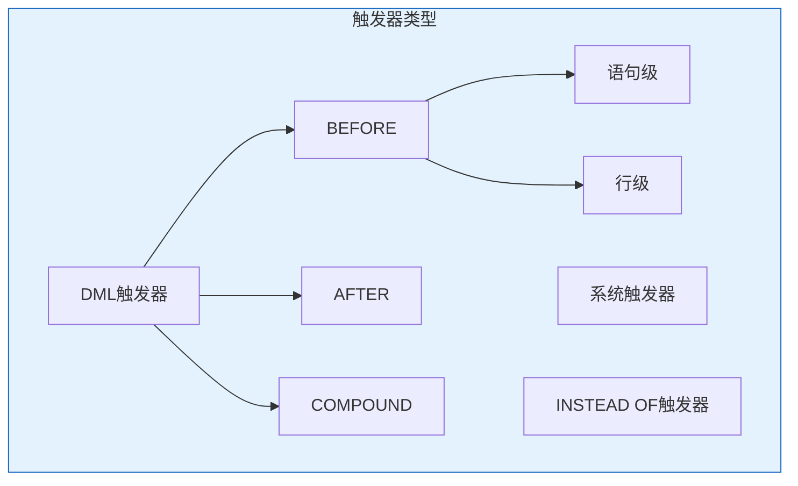
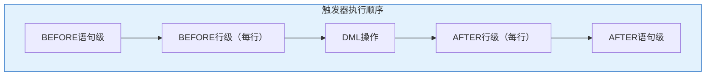

# Oracle DML触发器

## 一、概述

### 1.1 一句话定义

Oracle DML触发器是在INSERT、UPDATE、DELETE操作前后自动执行的PL/SQL程序，用于实现数据审计、业务规则验证和自动数据同步。
它在数据库开发中出现和使用，解决数据变更的自动响应和审计追踪问题。

### 1.2 为什么重要

- **不掌握的后果：** 业务规则需要应用层保证，数据审计难以实现
- **掌握的价值：** 自动化数据管理，保证数据完整性

### 1.3 适用场景

| 场景 | 说明 |
|------|------|
| 数据审计 | 记录数据变更 |
| 业务规则 | 自动验证数据 |
| 数据同步 | 自动更新关联表 |
| 派生值 | 自动计算字段 |

## 二、术语与概念

### 2.1 核心术语表

| 术语 | 含义 | 类比 |
|------|------|------|
| Trigger | 触发器 | 自动响应器 |
| BEFORE | 之前触发 | 事前检查 |
| AFTER | 之后触发 | 事后记录 |
| FOR EACH ROW | 行级触发 | 每行触发 |
| :OLD/:NEW | 旧值/新值 | 变更前/后 |
| COMPOUND | 复合触发器 | 多阶段 |

### 2.2 触发器类型



## 三、核心原理

### 3.1 行级触发器

```sql
-- 创建行级触发器
CREATE OR REPLACE TRIGGER trg_emp_audit
AFTER INSERT OR UPDATE OR DELETE ON employees
FOR EACH ROW
DECLARE
    v_action VARCHAR2(20);
BEGIN
    IF INSERTING THEN
        v_action := 'INSERT';
    ELSIF UPDATING THEN
        v_action := 'UPDATE';
    ELSIF DELETING THEN
        v_action := 'DELETE';
    END IF;
    
    INSERT INTO emp_audit_log(
        employee_id, action, old_salary, new_salary,
        change_date, changed_by
    ) VALUES(
        NVL(:NEW.employee_id, :OLD.employee_id),
        v_action,
        :OLD.salary,
        :NEW.salary,
        SYSTIMESTAMP,
        SYS_CONTEXT('USERENV', 'SESSION_USER')
    );
END;
/
```

### 3.2 语句级触发器

```sql
-- 语句级触发器（不指定FOR EACH ROW）
CREATE OR REPLACE TRIGGER trg_emp_stmt
BEFORE INSERT ON employees
DECLARE
    v_count NUMBER;
BEGIN
    -- 检查是否在维护窗口
    SELECT COUNT(*) INTO v_count
    FROM maintenance_window
    WHERE SYSDATE BETWEEN start_time AND end_time;
    
    IF v_count > 0 THEN
        RAISE_APPLICATION_ERROR(-20001, '维护期间禁止插入');
    END IF;
END;
/
```

### 3.3 BEFORE vs AFTER

```sql
-- BEFORE触发器：修改新值
CREATE OR REPLACE TRIGGER trg_emp_before
BEFORE INSERT OR UPDATE ON employees
FOR EACH ROW
BEGIN
    -- 自动设置更新时间
    IF UPDATING THEN
        :NEW.update_time := SYSTIMESTAMP;
        :NEW.updated_by := SYS_CONTEXT('USERENV', 'SESSION_USER');
    END IF;
    
    -- 自动计算派生值
    :NEW.full_name := :NEW.first_name || ' ' || :NEW.last_name;
    
    -- 数据验证
    IF :NEW.salary < 0 THEN
        RAISE_APPLICATION_ERROR(-20001, '工资不能为负');
    END IF;
END;
/

-- AFTER触发器：记录审计
CREATE OR REPLACE TRIGGER trg_emp_after
AFTER INSERT OR UPDATE OR DELETE ON employees
FOR EACH ROW
BEGIN
    INSERT INTO audit_log(table_name, action, key_value, change_time)
    VALUES('EMPLOYEES',
           CASE WHEN INSERTING THEN 'INSERT'
                WHEN UPDATING THEN 'UPDATE'
                ELSE 'DELETE' END,
           NVL(:NEW.employee_id, :OLD.employee_id),
           SYSTIMESTAMP);
END;
/
```

### 3.4 复合触发器（11g+）

```sql
-- 复合触发器：合并多个时间点
CREATE OR REPLACE TRIGGER trg_emp_compound
FOR INSERT OR UPDATE ON employees
COMPOUND TRIGGER
    
    -- 声明部分（所有时间点共享）
    TYPE emp_tab IS TABLE OF employees%ROWTYPE INDEX BY PLS_INTEGER;
    g_emp_changes emp_tab;
    g_idx PLS_INTEGER := 0;
    
BEFORE STATEMENT IS
BEGIN
    -- 语句开始前执行一次
    g_idx := 0;
END BEFORE STATEMENT;

BEFORE EACH ROW IS
BEGIN
    -- 每行变更前
    :NEW.update_time := SYSTIMESTAMP;
    :NEW.updated_by := SYS_CONTEXT('USERENV', 'SESSION_USER');
END BEFORE EACH ROW;

AFTER EACH ROW IS
BEGIN
    -- 每行变更后，收集到数组
    g_idx := g_idx + 1;
    g_emp_changes(g_idx) := :NEW;
END AFTER EACH ROW;

AFTER STATEMENT IS
BEGIN
    -- 语句结束后，批量处理
    FOR i IN 1..g_idx LOOP
        -- 批量同步到其他表
        NULL;  -- 实际处理逻辑
    END LOOP;
END AFTER STATEMENT;

END trg_emp_compound;
/
```

### 3.5 :OLD和:NEW伪记录

```sql
-- :OLD - 变更前的值
-- :NEW - 变更后的值

CREATE OR REPLACE TRIGGER trg_salary_check
BEFORE UPDATE OF salary ON employees
FOR EACH ROW
BEGIN
    -- 检查工资变化幅度
    IF :NEW.salary > :OLD.salary * 2 THEN
        RAISE_APPLICATION_ERROR(-20001, '工资涨幅不能超过100%');
    END IF;
    
    -- 记录变化
    IF :OLD.salary != :NEW.salary THEN
        INSERT INTO salary_history(employee_id, old_salary, new_salary, change_date)
        VALUES(:NEW.employee_id, :OLD.salary, :NEW.salary, SYSDATE);
    END IF;
END;
/
```

### 3.6 触发器管理

```sql
-- 启用/禁用触发器
ALTER TRIGGER trg_emp_audit ENABLE;
ALTER TRIGGER trg_emp_audit DISABLE;

-- 启用/禁用表的所有触发器
ALTER TABLE employees ENABLE ALL TRIGGERS;
ALTER TABLE employees DISABLE ALL TRIGGERS;

-- 查看触发器
SELECT trigger_name, trigger_type, triggering_event, table_name, status
FROM all_triggers
WHERE table_name = 'EMPLOYEES';

-- 查看触发器源码
SELECT trigger_body FROM all_triggers
WHERE trigger_name = 'TRG_EMP_AUDIT';
```

## 四、架构与组件

### 4.1 触发器执行顺序



## 五、配置与调优

### 5.1 性能考虑

| 建议 | 说明 |
|------|------|
| 避免复杂逻辑 | 触发器应轻量 |
| 批量处理 | 使用复合触发器 |
| 避免递归 | 防止循环触发 |
| 考虑替代方案 | 虚拟列、默认值 |

## 六、监控与诊断

### 6.1 触发器调试

```sql
-- 查看触发器错误
SELECT * FROM all_errors WHERE name = 'TRG_EMP_AUDIT';

-- 测试触发器
INSERT INTO employees(employee_id, name, salary) VALUES(999, 'Test', 50000);
SELECT * FROM emp_audit_log WHERE employee_id = 999;
```

## 七、实战案例

### 7.1 案例：完整审计触发器

```sql
CREATE OR REPLACE TRIGGER trg_full_audit
AFTER INSERT OR UPDATE OR DELETE ON orders
FOR EACH ROW
DECLARE
    v_action VARCHAR2(10);
    v_key NUMBER;
BEGIN
    v_action := CASE WHEN INSERTING THEN 'INSERT'
                     WHEN UPDATING THEN 'UPDATE'
                     ELSE 'DELETE' END;
    v_key := NVL(:NEW.order_id, :OLD.order_id);
    
    INSERT INTO full_audit(
        table_name, action, key_value,
        old_data, new_data,
        change_time, changed_by
    ) VALUES(
        'ORDERS', v_action, v_key,
        CASE WHEN DELETING OR UPDATING THEN
            '{"id":' || :OLD.order_id || ',"amount":' || :OLD.amount || '}'
        END,
        CASE WHEN INSERTING OR UPDATING THEN
            '{"id":' || :NEW.order_id || ',"amount":' || :NEW.amount || '}'
        END,
        SYSTIMESTAMP,
        SYS_CONTEXT('USERENV', 'SESSION_USER')
    );
END;
/
```

## 八、常见错误与排查

| 错误 | 问题 | 解决方法 |
|------|------|---------|
| ORA-04091 | 表正在变化 | 使用复合触发器 |
| ORA-04088 | 触发器执行错误 | 检查触发器代码 |
| ORA-00036 | 超过最大递归 | 避免循环触发 |

## 九、最佳实践

### 9.1 官方推荐

- 触发器保持简单
- 使用复合触发器处理复杂场景
- 考虑替代方案（虚拟列、默认值）
- 充分测试触发器

## 十、命令与视图汇总

| 命令/视图 | 用途 |
|-----------|------|
| CREATE TRIGGER | 创建触发器 |
| ALTER TRIGGER | 启用/禁用 |
| ALL_TRIGGERS | 触发器信息 |
| ALL_ERRORS | 编译错误 |

## 十一、总结速查

### 11.1 黄金法则

1. **BEFORE验证** - 数据校验
2. **AFTER审计** - 记录变更
3. **复合触发器** - 复杂场景
4. **轻量逻辑** - 避免性能问题

## 附录

### A. 官方参考

- [Oracle Database PL/SQL Language Reference - Triggers](https://docs.oracle.com/en/database/oracle/oracle-database/19c/lnpls/)

### B. 修订记录

| 日期 | 版本 | 修改内容 | 修改人 |
|------|------|---------|--------|
| 2026-07-02 | v1.0 | 初始版本 | YashanDB知识库生成器 |

## 补充：深入分析与实战

### 深入原理

本章节补充了该主题的核心原理和内部机制。在实际生产环境中，理解这些底层原理对于诊断和优化至关重要。

关键要点：
- 内部实现机制决定了外部行为特征
- 参数配置需要结合具体场景
- 监控数据是调优的基础

### 实战案例

**案例一：生产环境问题诊断**

```sql
-- 诊断步骤
-- 1. 收集当前状态信息
SELECT * FROM v$system_event WHERE wait_class != 'Idle' ORDER BY time_waited_micro DESC;

-- 2. 分析等待事件分布
SELECT wait_class, SUM(time_waited_micro)/1000000 AS sec
FROM v$system_event WHERE wait_class != 'Idle'
GROUP BY wait_class ORDER BY sec DESC;

-- 3. 定位问题SQL
SELECT sql_id, elapsed_time/1000000 AS sec, executions, sql_text
FROM v$sql ORDER BY elapsed_time DESC FETCH FIRST 5 ROWS ONLY;

-- 4. 检查执行计划
SELECT * FROM TABLE(DBMS_XPLAN.DISPLAY_CURSOR('&sql_id'));
```

**案例二：性能优化实践**

```sql
-- 优化前：全表扫描
SELECT * FROM orders WHERE order_date > SYSDATE - 30;

-- 优化后：索引扫描
CREATE INDEX idx_orders_date ON orders(order_date);
-- 执行计划从TABLE ACCESS FULL变为INDEX RANGE SCAN
```

### 最佳实践清单

- 建立标准化操作流程
- 定期审查和更新配置
- 监控关键指标趋势
- 建立性能基线
- 文档记录所有变更

### 常见问题FAQ

| 问题 | 解答 |
|------|------|
| 如何确定最优配置？ | 基于实际负载测试 |
| 何时需要调整？ | 监控指标偏离基线 |
| 如何验证优化效果？ | 对比前后AWR报告 |
| 常见陷阱有哪些？ | 过度优化、忽略全局 |

### 版本差异说明

| 版本 | 变化 |
|------|------|
| 19c | 自动管理增强 |
| 21c | 自适应优化 |
