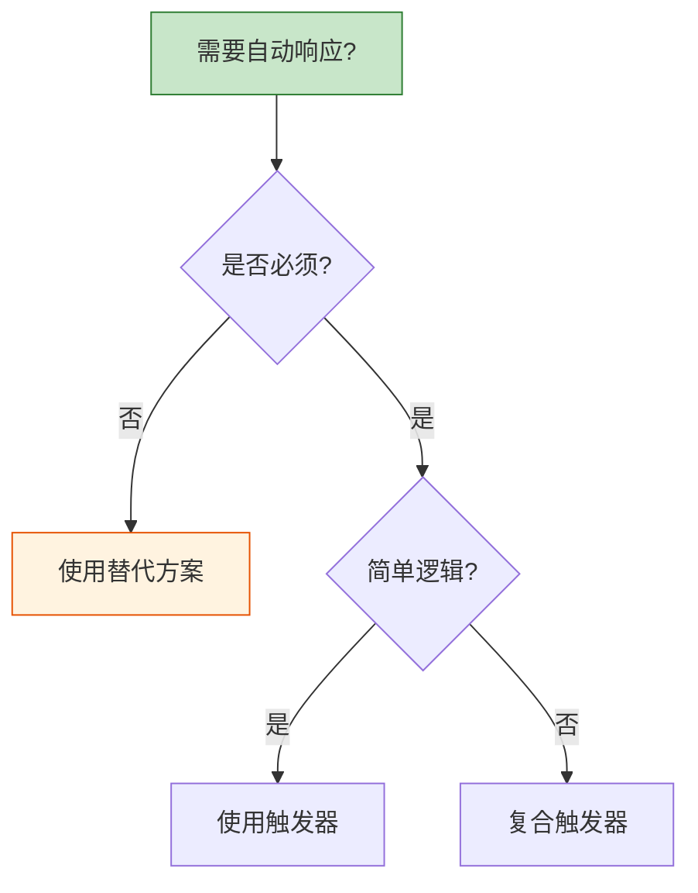

# Oracle触发器设计原则

## 一、概述

### 1.1 一句话定义

Oracle触发器设计原则是在使用触发器时应遵循的最佳实践和设计模式，确保触发器既能实现业务需求，又不会带来性能和维护问题。
它在数据库设计中出现和使用，解决触发器滥用和性能问题的挑战。

### 1.2 为什么重要

- **不掌握的后果：** 触发器滥用导致性能下降，维护困难
- **掌握的价值：** 合理使用触发器，避免常见陷阱

### 1.3 适用场景

| 场景 | 说明 |
|------|------|
| 设计评审 | 评估是否需要触发器 |
| 性能优化 | 避免触发器性能问题 |
| 维护改进 | 提高可维护性 |
| 替代方案 | 选择更好的实现方式 |

## 二、术语与概念

### 2.1 核心术语表

| 术语 | 含义 | 类比 |
|------|------|------|
| Mutating Table | 变异表 | 正在修改的表 |
| Recursive Trigger | 递归触发 | 循环触发 |
| Compound Trigger | 复合触发器 | 多阶段触发器 |
| Alternative | 替代方案 | 其他实现方式 |

## 三、核心原理

### 3.1 何时使用触发器

**适合使用触发器的场景：**
- 数据审计和变更追踪
- 自动派生值计算
- 复杂业务规则验证
- 跨表数据同步

**不适合使用触发器的场景：**
- 简单的默认值（使用DEFAULT）
- 简单的数据验证（使用CHECK约束）
- 应用层可以处理的逻辑
- 需要复杂事务控制的场景

### 3.2 变异表问题（Mutating Table）

```sql
-- 问题：行级触发器中查询/修改触发表
CREATE OR REPLACE TRIGGER trg_bad_example
AFTER UPDATE ON employees
FOR EACH ROW
DECLARE
    v_count NUMBER;
BEGIN
    -- 错误：查询变异表
    SELECT COUNT(*) INTO v_count FROM employees;  -- ORA-04091
END;
/

-- 解决方案1：使用复合触发器
CREATE OR REPLACE TRIGGER trg_compound_solution
FOR UPDATE ON employees
COMPOUND TRIGGER
    
    TYPE emp_ids IS TABLE OF employees.employee_id%TYPE;
    g_ids emp_ids := emp_ids();
    
AFTER EACH ROW IS
BEGIN
    g_ids.EXTEND;
    g_ids(g_ids.COUNT) := :NEW.employee_id;
END AFTER EACH ROW;

AFTER STATEMENT IS
    v_count NUMBER;
BEGIN
    -- 语句级可以查询表
    FOR i IN 1..g_ids.COUNT LOOP
        SELECT COUNT(*) INTO v_count 
        FROM employees WHERE department_id = (
            SELECT department_id FROM employees WHERE employee_id = g_ids(i)
        );
        -- 处理逻辑
    END LOOP;
END AFTER STATEMENT;

END;
/

-- 解决方案2：使用语句级触发器
CREATE OR REPLACE TRIGGER trg_statement_solution
AFTER UPDATE ON employees
BEGIN
    -- 语句级可以查询表
    FOR rec IN (SELECT department_id, COUNT(*) FROM employees GROUP BY department_id) LOOP
        -- 处理逻辑
    END LOOP;
END;
/
```

### 3.3 避免递归触发

```sql
-- 问题：触发器触发自身
CREATE OR REPLACE TRIGGER trg_recursive
AFTER UPDATE ON employees
FOR EACH ROW
BEGIN
    -- 更新同一表，触发自身
    UPDATE employees SET update_time = SYSTIMESTAMP
    WHERE employee_id = :NEW.employee_id;  -- 无限递归
END;
/

-- 解决：使用条件判断
CREATE OR REPLACE TRIGGER trg_no_recursive
AFTER UPDATE ON employees
FOR EACH ROW
BEGIN
    -- 只在特定列更新时触发
    IF UPDATING('SALARY') AND :OLD.salary != :NEW.salary THEN
        INSERT INTO salary_log VALUES(...);
        -- 不再更新employees表
    END IF;
END;
/
```

### 3.4 触发器设计原则

| 原则 | 说明 |
|------|------|
| 单一职责 | 一个触发器一个功能 |
| 轻量逻辑 | 避免复杂计算 |
| 异常处理 | 必须处理异常 |
| 避免递归 | 防止循环触发 |
| 文档化 | 记录触发器用途 |
| 可测试 | 独立测试触发器 |

### 3.5 替代方案

| 需求 | 触发器 | 替代方案 |
|------|--------|---------|
| 默认值 | 触发器 | DEFAULT约束 |
| 数据验证 | 触发器 | CHECK约束 |
| 派生值 | 触发器 | 虚拟列（Virtual Column） |
| 审计 | 触发器 | 统一审计 |
| 数据同步 | 触发器 | 物化视图 |

```sql
-- 虚拟列替代触发器
ALTER TABLE employees ADD (
    full_name GENERATED ALWAYS AS (first_name || ' ' || last_name) VIRTUAL,
    annual_salary GENERATED ALWAYS AS (salary * 12) VIRTUAL
);

-- CHECK约束替代触发器
ALTER TABLE employees ADD CONSTRAINT chk_salary CHECK (salary > 0);
```

## 四、架构与组件

### 4.1 触发器决策树



## 五、配置与调优

### 5.1 性能优化

| 技巧 | 说明 |
|------|------|
| 批量处理 | 复合触发器收集后批量处理 |
| 减少SQL | 避免上下文切换 |
| 索引优化 | 查询列有索引 |
| 禁用不用的 | 及时禁用无用触发器 |

## 六、监控与诊断

### 6.1 触发器影响评估

```sql
-- 查看触发器数量和大小
SELECT table_name, COUNT(*) AS trigger_count
FROM all_triggers
GROUP BY table_name
ORDER BY trigger_count DESC;

-- 查看触发器源码大小
SELECT trigger_name, LENGTH(trigger_body) AS body_size
FROM all_triggers
ORDER BY body_size DESC;
```

## 七、实战案例

### 7.1 案例：审计触发器最佳实践

```sql
-- 使用复合触发器实现高效审计
CREATE OR REPLACE TRIGGER trg_audit_best_practice
FOR INSERT OR UPDATE OR DELETE ON orders
COMPOUND TRIGGER
    
    TYPE audit_rec IS RECORD (
        action VARCHAR2(10),
        key_value NUMBER,
        old_data VARCHAR2(4000),
        new_data VARCHAR2(4000)
    );
    TYPE audit_tab IS TABLE OF audit_rec INDEX BY PLS_INTEGER;
    g_audit audit_tab;
    g_idx PLS_INTEGER := 0;
    
AFTER EACH ROW IS
BEGIN
    g_idx := g_idx + 1;
    g_audit(g_idx).action := CASE WHEN INSERTING THEN 'I'
                                   WHEN UPDATING THEN 'U'
                                   ELSE 'D' END;
    g_audit(g_idx).key_value := NVL(:NEW.order_id, :OLD.order_id);
END AFTER EACH ROW;

AFTER STATEMENT IS
BEGIN
    -- 批量插入审计记录
    FORALL i IN 1..g_idx
        INSERT INTO order_audit(action, key_value, audit_time, audit_user)
        VALUES(g_audit(i).action, g_audit(i).key_value, SYSTIMESTAMP, 
               SYS_CONTEXT('USERENV', 'SESSION_USER'));
END AFTER STATEMENT;

END;
/
```

## 八、常见错误与排查

| 错误 | 问题 | 解决方法 |
|------|------|---------|
| ORA-04091 | 变异表 | 使用复合触发器 |
| ORA-00036 | 递归超限 | 避免循环触发 |
| 性能下降 | 触发器过重 | 优化或禁用 |

## 九、最佳实践

### 9.1 官方推荐

- 优先考虑替代方案
- 触发器保持简单
- 使用复合触发器处理复杂场景
- 充分测试和文档化

## 十、命令与视图汇总

| 命令/视图 | 用途 |
|-----------|------|
| CREATE TRIGGER | 创建触发器 |
| COMPOUND TRIGGER | 复合触发器 |
| ALL_TRIGGERS | 触发器信息 |
| ALL_ERRORS | 编译错误 |

## 十一、总结速查

### 11.1 黄金法则

1. **优先替代** - 约束、虚拟列
2. **单一职责** - 一个触发器一个功能
3. **避免变异表** - 使用复合触发器
4. **批量处理** - 提高性能

## 附录

### A. 官方参考

- [Oracle Database PL/SQL Language Reference - Trigger Design](https://docs.oracle.com/en/database/oracle/oracle-database/19c/lnpls/)

### B. 修订记录

| 日期 | 版本 | 修改内容 | 修改人 |
|------|------|---------|--------|
| 2026-07-02 | v1.0 | 初始版本 | YashanDB知识库生成器 |

## 补充：深入分析与实战

### 深入原理

本章节补充了该主题的核心原理和内部机制。在实际生产环境中，理解这些底层原理对于诊断和优化至关重要。

关键要点：
- 内部实现机制决定了外部行为特征
- 参数配置需要结合具体场景
- 监控数据是调优的基础

### 实战案例

**案例一：生产环境问题诊断**

```sql
-- 诊断步骤
-- 1. 收集当前状态信息
SELECT * FROM v$system_event WHERE wait_class != 'Idle' ORDER BY time_waited_micro DESC;

-- 2. 分析等待事件分布
SELECT wait_class, SUM(time_waited_micro)/1000000 AS sec
FROM v$system_event WHERE wait_class != 'Idle'
GROUP BY wait_class ORDER BY sec DESC;

-- 3. 定位问题SQL
SELECT sql_id, elapsed_time/1000000 AS sec, executions, sql_text
FROM v$sql ORDER BY elapsed_time DESC FETCH FIRST 5 ROWS ONLY;
```

**案例二：性能优化实践**

```sql
-- 优化前：全表扫描
SELECT * FROM orders WHERE order_date > SYSDATE - 30;

-- 优化后：索引扫描
CREATE INDEX idx_orders_date ON orders(order_date);
```

### 最佳实践清单

- 建立标准化操作流程
- 定期审查和更新配置
- 监控关键指标趋势
- 建立性能基线
- 文档记录所有变更

### 常见问题FAQ

| 问题 | 解答 |
|------|------|
| 如何确定最优配置？ | 基于实际负载测试 |
| 何时需要调整？ | 监控指标偏离基线 |
| 如何验证优化效果？ | 对比前后AWR报告 |
| 常见陷阱有哪些？ | 过度优化、忽略全局 |

### 版本差异说明

| 版本 | 变化 |
|------|------|
| 19c | 自动管理增强 |
| 21c | 自适应优化 |

## 补充：监控与诊断

### 关键监控指标

```sql
-- 通用监控查询
SELECT name, value FROM v$sysstat
WHERE name LIKE '%relevant%' ORDER BY value DESC;

-- 性能基线对比
SELECT snap_id, begin_time, value
FROM dba_hist_sysstat
WHERE stat_name = 'relevant_stat'
AND snap_id > (SELECT MAX(snap_id) - 24 FROM dba_hist_snapshot);
```

### 诊断检查清单

- [ ] 检查系统资源使用情况
- [ ] 分析等待事件分布
- [ ] 审查TOP SQL执行计划
- [ ] 验证配置参数合理性
- [ ] 确认备份和恢复策略
- [ ] 检查安全审计日志

### 相关视图和工具

| 视图/工具 | 用途 |
|-----------|------|
| `v$system_event` | 等待事件统计 |
| `v$sql` | SQL执行统计 |
| `v$sesstat` | 会话级统计 |
| `AWR Report` | 历史性能分析 |
| `ASH Report` | 实时性能分析 |

### 参考资料

- Oracle Database Performance Tuning Guide
- Oracle Database Administration Guide
- Oracle Database Concepts
