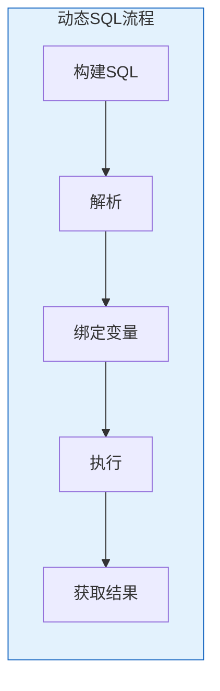

# Oracle动态SQL概念与方法

## 一、概述

### 1.1 一句话定义

Oracle动态SQL是在运行时构建和执行SQL语句的技术，包括EXECUTE IMMEDIATE和DBMS_SQL包两种实现方式。
它在需要灵活SQL的场景中出现和使用，解决编译时无法确定SQL结构的问题。

### 1.2 为什么重要

- **不掌握的后果：** 无法实现灵活的查询和动态表操作
- **掌握的价值：** 构建灵活的数据库应用

### 1.3 适用场景

| 场景 | 说明 |
|------|------|
| 动态查询 | 运行时确定查询条件 |
| 动态DDL | 运行时创建表结构 |
| 通用工具 | 报表生成器、ETL工具 |
| 动态维护 | 自动化维护脚本 |

## 二、术语与概念

### 2.1 核心术语表

| 术语 | 含义 | 类比 |
|------|------|------|
| Dynamic SQL | 动态SQL | 运行时构建 |
| EXECUTE IMMEDIATE | 立即执行 | 简单方式 |
| DBMS_SQL | SQL包 | 高级方式 |
| Bind Variable | 绑定变量 | 参数化 |
| Cursor Variable | 游标变量 | 动态游标 |

## 三、核心原理

### 3.1 EXECUTE IMMEDIATE

```sql
-- 基本语法
EXECUTE IMMEDIATE sql_string [INTO variables] [USING bind_variables];

-- 动态DDL
DECLARE
    v_sql VARCHAR2(1000);
BEGIN
    v_sql := 'CREATE TABLE temp_test (id NUMBER, name VARCHAR2(100))';
    EXECUTE IMMEDIATE v_sql;
END;
/

-- 动态DML带绑定变量
DECLARE
    v_sql VARCHAR2(1000);
    v_salary NUMBER := 50000;
    v_dept_id NUMBER := 10;
BEGIN
    v_sql := 'UPDATE employees SET salary = :1 WHERE department_id = :2';
    EXECUTE IMMEDIATE v_sql USING v_salary, v_dept_id;
    DBMS_OUTPUT.PUT_LINE('Updated: ' || SQL%ROWCOUNT);
END;
/

-- 动态SELECT INTO
DECLARE
    v_sql VARCHAR2(1000);
    v_count NUMBER;
BEGIN
    v_sql := 'SELECT COUNT(*) FROM employees WHERE department_id = :1';
    EXECUTE IMMEDIATE v_sql INTO v_count USING 10;
    DBMS_OUTPUT.PUT_LINE('Count: ' || v_count);
END;
/

-- 动态返回游标
DECLARE
    v_sql VARCHAR2(1000);
    v_cur SYS_REFCURSOR;
    v_rec employees%ROWTYPE;
BEGIN
    v_sql := 'SELECT * FROM employees WHERE department_id = :1';
    OPEN v_cur FOR v_sql USING 10;
    LOOP
        FETCH v_cur INTO v_rec;
        EXIT WHEN v_cur%NOTFOUND;
        DBMS_OUTPUT.PUT_LINE(v_rec.name);
    END LOOP;
    CLOSE v_cur;
END;
/
```

### 3.2 DBMS_SQL包

```sql
-- DBMS_SQL提供更细粒度的控制
DECLARE
    v_cursor NUMBER;
    v_sql VARCHAR2(1000);
    v_result NUMBER;
BEGIN
    -- 1. 打开游标
    v_cursor := DBMS_SQL.OPEN_CURSOR;
    
    -- 2. 解析SQL
    v_sql := 'SELECT COUNT(*) FROM employees WHERE department_id = :dept_id';
    DBMS_SQL.PARSE(v_cursor, v_sql, DBMS_SQL.NATIVE);
    
    -- 3. 绑定变量
    DBMS_SQL.BIND_VARIABLE(v_cursor, ':dept_id', 10);
    
    -- 4. 定义列
    DBMS_SQL.DEFINE_COLUMN(v_cursor, 1, v_result);
    
    -- 5. 执行
    v_result := DBMS_SQL.EXECUTE(v_cursor);
    
    -- 6. 获取结果
    DBMS_SQL.COLUMN_VALUE(v_cursor, 1, v_result);
    DBMS_OUTPUT.PUT_LINE('Count: ' || v_result);
    
    -- 7. 关闭游标
    DBMS_SQL.CLOSE_CURSOR(v_cursor);
END;
/
```

### 3.3 绑定变量 vs 字符串拼接

```sql
-- 错误：字符串拼接（SQL注入风险）
DECLARE
    v_name VARCHAR2(100) := 'John';
    v_sql VARCHAR2(1000);
BEGIN
    v_sql := 'SELECT * FROM employees WHERE name = ''' || v_name || '''';
    -- 危险！可能被SQL注入
    EXECUTE IMMEDIATE v_sql;
END;
/

-- 正确：使用绑定变量
DECLARE
    v_name VARCHAR2(100) := 'John';
    v_sql VARCHAR2(1000);
    v_cur SYS_REFCURSOR;
BEGIN
    v_sql := 'SELECT * FROM employees WHERE name = :1';
    OPEN v_cur FOR v_sql USING v_name;
    -- 安全，防止SQL注入
END;
/
```

### 3.4 动态SQL返回多行

```sql
-- 使用游标变量
CREATE OR REPLACE FUNCTION get_employees(
    p_dept_id IN NUMBER DEFAULT NULL
) RETURN SYS_REFCURSOR AS
    v_cur SYS_REFCURSOR;
    v_sql VARCHAR2(1000);
BEGIN
    v_sql := 'SELECT employee_id, name, salary FROM employees';
    
    IF p_dept_id IS NOT NULL THEN
        v_sql := v_sql || ' WHERE department_id = :1';
        OPEN v_cur FOR v_sql USING p_dept_id;
    ELSE
        OPEN v_cur FOR v_sql;
    END IF;
    
    RETURN v_cur;
END;
/

-- 调用
DECLARE
    v_cur SYS_REFCURSOR;
    v_id NUMBER;
    v_name VARCHAR2(100);
    v_salary NUMBER;
BEGIN
    v_cur := get_employees(10);
    LOOP
        FETCH v_cur INTO v_id, v_name, v_salary;
        EXIT WHEN v_cur%NOTFOUND;
        DBMS_OUTPUT.PUT_LINE(v_id || ': ' || v_name);
    END LOOP;
    CLOSE v_cur;
END;
/
```

### 3.5 动态DDL操作

```sql
-- 动态创建表
CREATE OR REPLACE PROCEDURE create_temp_table(p_table_name VARCHAR2) AS
    v_sql VARCHAR2(1000);
BEGIN
    v_sql := 'CREATE TABLE ' || p_table_name || ' (
        id NUMBER PRIMARY KEY,
        data VARCHAR2(1000),
        created_date DATE DEFAULT SYSDATE
    )';
    EXECUTE IMMEDIATE v_sql;
END;
/

-- 动态修改表
CREATE OR REPLACE PROCEDURE add_column(
    p_table_name VARCHAR2,
    p_column_name VARCHAR2,
    p_data_type VARCHAR2
) AS
    v_sql VARCHAR2(1000);
BEGIN
    v_sql := 'ALTER TABLE ' || p_table_name || 
             ' ADD (' || p_column_name || ' ' || p_data_type || ')';
    EXECUTE IMMEDIATE v_sql;
END;
/
```

## 四、架构与组件

### 4.1 动态SQL执行流程



## 五、配置与调优

### 5.1 性能优化

| 技巧 | 说明 |
|------|------|
| 绑定变量 | 防止硬解析 |
| 共享SQL | 相同SQL复用 |
| 避免频繁DDL | DDL开销大 |
| 批量操作 | FORALL批量 |

## 六、监控与诊断

### 6.1 SQL注入防护

```sql
-- 使用DBMS_ASSERT验证输入
DECLARE
    v_table VARCHAR2(30);
BEGIN
    -- 验证对象名
    v_table := DBMS_ASSERT.SIMPLE_SQL_NAME('employees');
    
    -- 验证字符串
    v_table := DBMS_ASSERT.ENQUOTE_LITERAL('John');
END;
/
```

## 七、实战案例

### 7.1 案例：通用报表生成器

```sql
CREATE OR REPLACE FUNCTION generate_report(
    p_table VARCHAR2,
    p_columns VARCHAR2,
    p_where VARCHAR2 DEFAULT NULL
) RETURN SYS_REFCURSOR AS
    v_cur SYS_REFCURSOR;
    v_sql VARCHAR2(4000);
BEGIN
    -- 验证输入
    v_sql := 'SELECT ' || DBMS_ASSERT.SIMPLE_SQL_NAME(p_columns) ||
             ' FROM ' || DBMS_ASSERT.SIMPLE_SQL_NAME(p_table);
    
    IF p_where IS NOT NULL THEN
        v_sql := v_sql || ' WHERE ' || p_where;
    END IF;
    
    OPEN v_cur FOR v_sql;
    RETURN v_cur;
END;
/
```

## 八、常见错误与排查

| 错误 | 问题 | 解决方法 |
|------|------|---------|
| ORA-00911 | 无效字符 | 检查SQL语法 |
| ORA-01006 | 绑定变量不存在 | 检查USING |
| ORA-01008 | 未绑定所有变量 | 提供所有绑定 |
| ORA-00904 | 无效标识符 | 检查列名 |

## 九、最佳实践

### 9.1 官方推荐

- 使用绑定变量
- 优先EXECUTE IMMEDIATE
- 验证用户输入
- 处理异常

## 十、命令与视图汇总

| 命令/视图 | 用途 |
|-----------|------|
| EXECUTE IMMEDIATE | 简单动态SQL |
| DBMS_SQL | 高级动态SQL |
| SYS_REFCURSOR | 游标变量 |
| DBMS_ASSERT | 输入验证 |

## 十一、总结速查

### 11.1 黄金法则

1. **绑定变量** - 防止SQL注入
2. **输入验证** - DBMS_ASSERT
3. **异常处理** - 必须捕获
4. **性能意识** - 避免硬解析

## 附录

### A. 官方参考

- [Oracle Database PL/SQL Language Reference - Dynamic SQL](https://docs.oracle.com/en/database/oracle/oracle-database/19c/lnpls/)

### B. 修订记录

| 日期 | 版本 | 修改内容 | 修改人 |
|------|------|---------|--------|
| 2026-07-02 | v1.0 | 初始版本 | YashanDB知识库生成器 |

## 补充：深入分析与实战

### 深入原理

本章节补充了该主题的核心原理和内部机制。在实际生产环境中，理解这些底层原理对于诊断和优化至关重要。

关键要点：
- 内部实现机制决定了外部行为特征
- 参数配置需要结合具体场景
- 监控数据是调优的基础

### 实战案例

**案例一：生产环境问题诊断**

```sql
-- 诊断步骤
-- 1. 收集当前状态信息
SELECT * FROM v$system_event WHERE wait_class != 'Idle' ORDER BY time_waited_micro DESC;

-- 2. 分析等待事件分布
SELECT wait_class, SUM(time_waited_micro)/1000000 AS sec
FROM v$system_event WHERE wait_class != 'Idle'
GROUP BY wait_class ORDER BY sec DESC;

-- 3. 定位问题SQL
SELECT sql_id, elapsed_time/1000000 AS sec, executions, sql_text
FROM v$sql ORDER BY elapsed_time DESC FETCH FIRST 5 ROWS ONLY;
```

**案例二：性能优化实践**

```sql
-- 优化前：全表扫描
SELECT * FROM orders WHERE order_date > SYSDATE - 30;

-- 优化后：索引扫描
CREATE INDEX idx_orders_date ON orders(order_date);
```

### 最佳实践清单

- 建立标准化操作流程
- 定期审查和更新配置
- 监控关键指标趋势
- 建立性能基线
- 文档记录所有变更

### 常见问题FAQ

| 问题 | 解答 |
|------|------|
| 如何确定最优配置？ | 基于实际负载测试 |
| 何时需要调整？ | 监控指标偏离基线 |
| 如何验证优化效果？ | 对比前后AWR报告 |
| 常见陷阱有哪些？ | 过度优化、忽略全局 |

### 版本差异说明

| 版本 | 变化 |
|------|------|
| 19c | 自动管理增强 |
| 21c | 自适应优化 |
