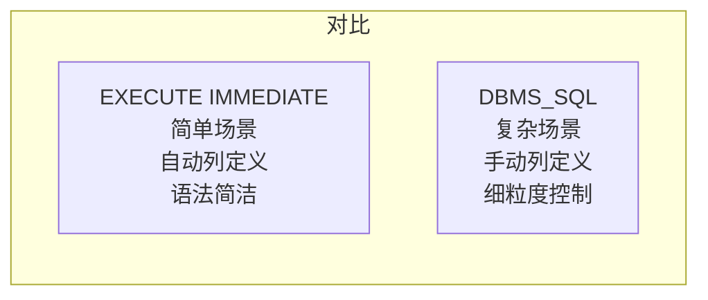
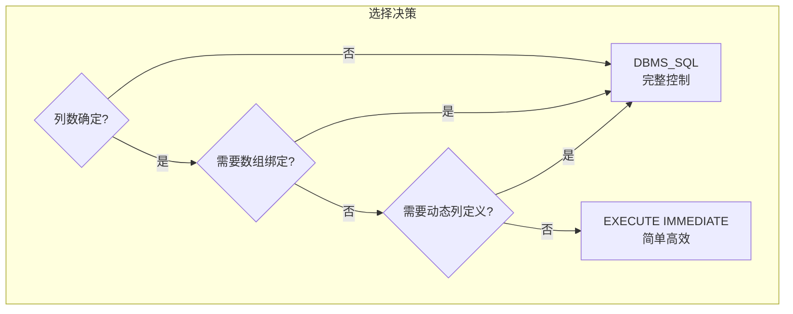

# Oracle DBMS_SQL包使用指南

## 一、概述

### 1.1 一句话定义

DBMS_SQL是Oracle提供的用于执行动态SQL的系统包，提供比EXECUTE IMMEDIATE更细粒度的控制能力，支持动态列定义、数组绑定和未知结果集处理。
它在需要高级动态SQL控制的场景中出现和使用，解决EXECUTE IMMEDIATE无法处理的复杂动态SQL需求。

### 1.2 为什么重要

- **不掌握的后果：** 无法实现动态列数查询、数组绑定等高级动态SQL功能
- **掌握的价值：** 构建通用查询工具、动态DDL管理、批量数据处理等高级应用

### 1.3 适用场景

| 场景 | 说明 |
|------|------|
| 通用查询工具 | 列数不确定的动态查询 |
| 动态DDL | 动态创建表、索引等 |
| 数组绑定 | 批量绑定变量 |
| 元数据操作 | 动态操作数据字典 |
| 跨Schema操作 | 动态切换Schema |

### 1.4 版本演进

| 版本 | 变化说明 |
|------|---------|
| 11gR2 | TO_REFCURSOR函数支持 |
| 12cR1 | 数组绑定增强 |
| 12cR2 | 性能优化 |
| 19c | 与EXECUTE IMMEDIATE互操作增强 |
| 21c | 安全性增强 |

## 二、术语与概念

### 2.1 核心术语表

| 术语 | 含义 | 类比 |
|------|------|------|
| 动态游标 | DBMS_SQL管理的游标 | 可重编程的遥控器 |
| PARSE | 解析SQL语句 | 遥控器学习指令 |
| BIND_VARIABLE | 绑定变量值 | 设置遥控器参数 |
| DEFINE_COLUMN | 定义输出列 | 设置显示格式 |
| DESCRIBE_COLUMNS | 描述列信息 | 查询遥控器功能 |
| 游标号 | DBMS_SQL.OPEN_CURSOR返回值 | 遥控器编号 |

### 2.2 DBMS_SQL工作流程


## 三、架构与原理

### 3.1 DBMS_SQL vs EXECUTE IMMEDIATE



### 3.2 工作原理

1. **打开游标：** 分配游标资源
2. **解析SQL：** 语法检查和优化
3. **绑定变量：** 设置输入参数
4. **定义列：** 指定输出列的数据类型
5. **执行SQL：** 运行SQL语句
6. **获取结果：** 逐行读取结果
7. **关闭游标：** 释放资源

**一句话总结：** DBMS_SQL通过"打开→解析→绑定→定义→执行→获取→关闭"的流程，提供完整的动态SQL控制。

### 3.3 选择决策



## 四、功能详解

### 4.1 基本API使用

#### 功能说明

DBMS_SQL的核心API及使用方法。

#### 操作步骤

```sql
-- 步骤1：简单查询
DECLARE
    v_cursor NUMBER;
    v_result NUMBER;
    v_ret    NUMBER;
BEGIN
    v_cursor := DBMS_SQL.OPEN_CURSOR;
    DBMS_SQL.PARSE(v_cursor,
        'SELECT COUNT(*) FROM employees WHERE department_id = :dept_id',
        DBMS_SQL.NATIVE);
    DBMS_SQL.BIND_VARIABLE(v_cursor, ':dept_id', 10);
    DBMS_SQL.DEFINE_COLUMN(v_cursor, 1, v_result);
    v_ret := DBMS_SQL.EXECUTE(v_cursor);

    IF DBMS_SQL.FETCH_ROWS(v_cursor) > 0 THEN
        DBMS_SQL.COLUMN_VALUE(v_cursor, 1, v_result);
        DBMS_OUTPUT.PUT_LINE('Count: ' || v_result);
    END IF;

    DBMS_SQL.CLOSE_CURSOR(v_cursor);
END;
/

-- 步骤2：DML操作
DECLARE
    v_cursor NUMBER;
    v_rows   NUMBER;
BEGIN
    v_cursor := DBMS_SQL.OPEN_CURSOR;
    DBMS_SQL.PARSE(v_cursor,
        'UPDATE employees SET salary = salary * :factor WHERE department_id = :dept',
        DBMS_SQL.NATIVE);
    DBMS_SQL.BIND_VARIABLE(v_cursor, ':factor', 1.1);
    DBMS_SQL.BIND_VARIABLE(v_cursor, ':dept', 10);
    v_rows := DBMS_SQL.EXECUTE(v_cursor);
    DBMS_OUTPUT.PUT_LINE('Rows updated: ' || v_rows);
    DBMS_SQL.CLOSE_CURSOR(v_cursor);
END;
/
```

### 4.2 动态列数查询

```sql
-- 处理列数不确定的查询
DECLARE
    v_cursor   NUMBER;
    v_col_cnt  NUMBER;
    v_desc_tab DBMS_SQL.DESC_TAB;
    v_value    VARCHAR2(4000);
    v_ret      NUMBER;
BEGIN
    v_cursor := DBMS_SQL.OPEN_CURSOR;
    DBMS_SQL.PARSE(v_cursor,
        'SELECT * FROM employees WHERE department_id = 10',
        DBMS_SQL.NATIVE);

    -- 描述列
    DBMS_SQL.DESCRIBE_COLUMNS(v_cursor, v_col_cnt, v_desc_tab);

    -- 定义所有列为VARCHAR2
    FOR i IN 1..v_col_cnt LOOP
        DBMS_SQL.DEFINE_COLUMN(v_cursor, i, v_value, 4000);
    END LOOP;

    v_ret := DBMS_SQL.EXECUTE(v_cursor);

    -- 输出列名
    FOR i IN 1..v_col_cnt LOOP
        DBMS_OUTPUT.PUT(v_desc_tab(i).col_name || ' | ');
    END LOOP;
    DBMS_OUTPUT.NEW_LINE;
    DBMS_OUTPUT.PUT_LINE(RPAD('-', v_col_cnt * 20, '-'));

    -- 获取数据
    WHILE DBMS_SQL.FETCH_ROWS(v_cursor) > 0 LOOP
        FOR i IN 1..v_col_cnt LOOP
            DBMS_SQL.COLUMN_VALUE(v_cursor, i, v_value);
            DBMS_OUTPUT.PUT(v_value || ' | ');
        END LOOP;
        DBMS_OUTPUT.NEW_LINE;
    END LOOP;

    DBMS_SQL.CLOSE_CURSOR(v_cursor);
END;
/
```

### 4.3 数组绑定

```sql
-- 批量绑定变量（高性能）
DECLARE
    v_cursor NUMBER;
    v_ids    DBMS_SQL.NUMBER_TABLE;
    v_names  DBMS_SQL.VARCHAR2_TABLE;
    v_ret    NUMBER;
BEGIN
    v_cursor := DBMS_SQL.OPEN_CURSOR;
    DBMS_SQL.PARSE(v_cursor,
        'INSERT INTO temp_table (id, name) VALUES (:id, :name)',
        DBMS_SQL.NATIVE);

    -- 准备数组
    v_ids(1) := 1; v_names(1) := 'Alice';
    v_ids(2) := 2; v_names(2) := 'Bob';
    v_ids(3) := 3; v_names(3) := 'Charlie';

    -- 数组绑定
    DBMS_SQL.BIND_ARRAY(v_cursor, ':id', v_ids);
    DBMS_SQL.BIND_ARRAY(v_cursor, ':name', v_names);

    v_ret := DBMS_SQL.EXECUTE(v_cursor);
    DBMS_OUTPUT.PUT_LINE('Rows inserted: ' || v_ret);

    DBMS_SQL.CLOSE_CURSOR(v_cursor);
END;
/
```

### 4.4 异常处理与资源管理

```sql
-- 正确的异常处理模式
DECLARE
    v_cursor NUMBER;
    v_ret    NUMBER;
BEGIN
    v_cursor := DBMS_SQL.OPEN_CURSOR;
    BEGIN
        DBMS_SQL.PARSE(v_cursor, 'SELECT * FROM employees', DBMS_SQL.NATIVE);
        -- ... 其他操作
        v_ret := DBMS_SQL.EXECUTE(v_cursor);
    EXCEPTION
        WHEN OTHERS THEN
            -- 确保游标关闭
            IF DBMS_SQL.IS_OPEN(v_cursor) THEN
                DBMS_SQL.CLOSE_CURSOR(v_cursor);
            END IF;
            RAISE;
    END;
    DBMS_SQL.CLOSE_CURSOR(v_cursor);
END;
/
```

### 4.5 与EXECUTE IMMEDIATE互操作

```sql
-- 12c+ 可以在DBMS_SQL和EXECUTE IMMEDIATE之间转换
DECLARE
    v_cursor NUMBER;
    v_refcur SYS_REFCURSOR;
    v_rec    employees%ROWTYPE;
BEGIN
    -- DBMS_SQL游标转为REF CURSOR
    v_cursor := DBMS_SQL.OPEN_CURSOR;
    DBMS_SQL.PARSE(v_cursor, 'SELECT * FROM employees WHERE department_id = 10',
                   DBMS_SQL.NATIVE);
    v_refcur := DBMS_SQL.TO_REFCURSOR(v_cursor);

    -- 使用FETCH读取
    LOOP
        FETCH v_refcur INTO v_rec;
        EXIT WHEN v_refcur%NOTFOUND;
        DBMS_OUTPUT.PUT_LINE(v_rec.last_name);
    END LOOP;
    CLOSE v_refcur;
END;
/
```

## 五、性能与调优

### 5.1 性能考虑

| 因素 | 建议 | 原因 |
|------|------|------|
| 游标打开次数 | 复用游标 | 减少开销 |
| 数组绑定 | 使用BIND_ARRAY | 批量操作更快 |
| 字符串拼接 | 使用绑定变量 | 避免硬解析 |
| 异常处理 | 确保关闭游标 | 防止资源泄漏 |

### 5.2 性能基线

| 指标 | 正常范围 | 告警阈值 | 说明 |
|------|---------|---------|------|
| 游标打开数 | < 100 | > 300 | 未关闭游标 |
| PARSE时间 | < 10ms | > 100ms | 解析开销 |

## 六、DFX能力

### 6.1 动态性能视图

| 视图名 | 用途 | 关键字段 |
|--------|------|---------|
| V$OPEN_CURSOR | 打开的游标 | SQL_TEXT, CURSOR_TYPE |
| V$SQL | SQL信息 | SQL_ID, EXECUTIONS |

### 6.2 监控脚本

```sql
-- 检查未关闭的游标
SELECT sid, sql_text, cursor_type, status
FROM v$open_cursor
WHERE cursor_type = 'DBMS_SQL'
AND status != 'CLOSED';
```

## 七、实战案例

### 7.1 案例背景

- **场景**：某系统需要构建通用查询工具，支持任意表查询
- **时间**：数据迁移项目
- **现象**：需要动态处理不同表的列结构

### 7.2 诊断过程

**步骤1：设计通用查询过程**

```sql
CREATE OR REPLACE PROCEDURE universal_query(p_table_name VARCHAR2) AS
    v_cursor   NUMBER;
    v_col_cnt  NUMBER;
    v_desc_tab DBMS_SQL.DESC_TAB;
    v_value    VARCHAR2(4000);
    v_ret      NUMBER;
BEGIN
    v_cursor := DBMS_SQL.OPEN_CURSOR;
    DBMS_SQL.PARSE(v_cursor, 'SELECT * FROM ' || p_table_name, DBMS_SQL.NATIVE);
    DBMS_SQL.DESCRIBE_COLUMNS(v_cursor, v_col_cnt, v_desc_tab);

    FOR i IN 1..v_col_cnt LOOP
        DBMS_SQL.DEFINE_COLUMN(v_cursor, i, v_value, 4000);
    END LOOP;

    v_ret := DBMS_SQL.EXECUTE(v_cursor);

    -- 输出表头
    FOR i IN 1..v_col_cnt LOOP
        DBMS_OUTPUT.PUT(RPAD(v_desc_tab(i).col_name, 20) || '| ');
    END LOOP;
    DBMS_OUTPUT.NEW_LINE;

    -- 输出数据
    WHILE DBMS_SQL.FETCH_ROWS(v_cursor) > 0 LOOP
        FOR i IN 1..v_col_cnt LOOP
            DBMS_SQL.COLUMN_VALUE(v_cursor, i, v_value);
            DBMS_OUTPUT.PUT(RPAD(NVL(v_value, 'NULL'), 20) || '| ');
        END LOOP;
        DBMS_OUTPUT.NEW_LINE;
    END LOOP;

    DBMS_SQL.CLOSE_CURSOR(v_cursor);
END;
/
```

### 7.3 解决结果

| 指标 | 解决前 | 解决后 |
|------|--------|--------|
| 查询任意表 | 需要为每张表写代码 | 一个过程通用 |
| 开发时间 | 数小时/表 | 一次性开发 |

### 7.4 复盘总结

- **根因：** EXECUTE IMMEDIATE无法处理列数不确定的情况
- **教训：** DBMS_SQL的DESCRIBE_COLUMNS是处理动态列的关键API

## 八、常见错误与排查

### 8.1 常见错误列表

| 错误代码 | 错误信息 | 原因 | 解决方法 |
|---------|---------|------|---------|
| ORA-01001 | invalid cursor | 游标未打开或已关闭 | 检查OPEN_CURSOR |
| ORA-01009 | missing mandatory parameter | 未绑定变量 | 检查BIND_VARIABLE |
| ORA-01480 | trailing null missing | 字符串绑定问题 | 检查长度 |
| ORA-01403 | no data found | FETCH无数据 | 检查FETCH_ROWS返回值 |

### 8.2 排查步骤

1. **检查游标状态：** `DBMS_SQL.IS_OPEN(cursor)`
2. **检查绑定变量：** 确认所有变量已绑定
3. **检查列定义：** 确认所有列已定义
4. **检查异常处理：** 确保游标在异常时关闭

## 九、最佳实践

### 9.1 官方推荐

- 简单场景优先使用EXECUTE IMMEDIATE
- 必须确保游标在异常时关闭
- 使用绑定变量防止SQL注入
- 大数组使用BIND_ARRAY

### 9.2 社区经验

- 通用查询工具使用DBMS_SQL
- 批量操作使用数组绑定
- 始终检查IS_OPEN再关闭游标
- 复杂场景考虑使用动态SQL包

### 9.3 反模式

| 反模式 | 问题 | 正确做法 |
|--------|------|---------|
| 不关闭游标 | 资源泄漏 | 异常处理中关闭 |
| 字符串拼接SQL | SQL注入风险 | 使用绑定变量 |
| 简单场景用DBMS_SQL | 代码复杂 | 用EXECUTE IMMEDIATE |
| 不使用异常处理 | 游标泄漏 | 始终包裹异常处理 |

## 十、命令与视图汇总

### 10.1 主要API

| API | 适用场景 | 说明 |
|-----|---------|------|
| `OPEN_CURSOR` | 打开游标 | 返回游标号 |
| `PARSE` | 解析SQL | 语法检查 |
| `BIND_VARIABLE` | 绑定变量 | 设置输入 |
| `DEFINE_COLUMN` | 定义列 | 设置输出 |
| `EXECUTE` | 执行SQL | 运行 |
| `FETCH_ROWS` | 获取行 | 读取结果 |
| `COLUMN_VALUE` | 获取列值 | 读取列 |
| `DESCRIBE_COLUMNS` | 描述列 | 获取列信息 |
| `CLOSE_CURSOR` | 关闭游标 | 释放资源 |

### 10.2 视图列表

| 视图名 | 类型 | 用途 | 关键字段 |
|--------|------|------|---------|
| V$OPEN_CURSOR | 动态 | 打开的游标 | SQL_TEXT, STATUS |
| V$SQL | 动态 | SQL信息 | SQL_ID |

## 十一、总结速查

### 11.1 黄金法则

1. **必须关闭游标** - 异常处理中也要关闭
2. **简单用EXECUTE IMMEDIATE** - 代码更简洁
3. **动态列用DBMS_SQL** - DESCRIBE_COLUMNS
4. **批量用数组绑定** - BIND_ARRAY
5. **绑定变量防注入** - 不使用字符串拼接

### 11.2 一页纸检查清单

| 现象/场景 | 原因 | 处理方案 |
|-----------|------|----------|
| ORA-01001 | 游标未打开 | 检查OPEN_CURSOR |
| ORA-01009 | 未绑定变量 | 检查BIND_VARIABLE |
| 资源泄漏 | 游标未关闭 | 异常处理中关闭 |
| 列数不确定 | EXECUTE IMMEDIATE无法处理 | 使用DBMS_SQL |
| 批量操作慢 | 逐行绑定 | 使用BIND_ARRAY |

### 11.3 关键数字

| 指标 | 正常范围 | 告警阈值 | 说明 |
|------|---------|---------|------|
| 打开游标数 | < 100 | > 300 | 未关闭游标 |
| PARSE时间 | < 10ms | > 100ms | 解析开销 |

## 附录

### A. 官方参考

- [Oracle Database PL/SQL Packages and Types Reference - DBMS_SQL](https://docs.oracle.com/en/database/oracle/oracle-database/19c/arpls/)
- MOS Note: 1187372.1 - "DBMS_SQL Best Practices"

### B. 数据字典

| 对象名 | 类型 | 说明 |
|--------|------|------|
| V$OPEN_CURSOR | 动态视图 | 打开的游标 |
| V$SQL | 动态视图 | SQL信息 |

### C. 修订记录

| 日期 | 版本 | 修改内容 | 修改人 |
|------|------|---------|--------|
| 2026-07-02 | v1.0 | 初始版本 | YashanDB知识库生成器 |
| 2026-07-02 | v1.1 | 补充完整模板章节 | YashanDB知识库生成器 |
