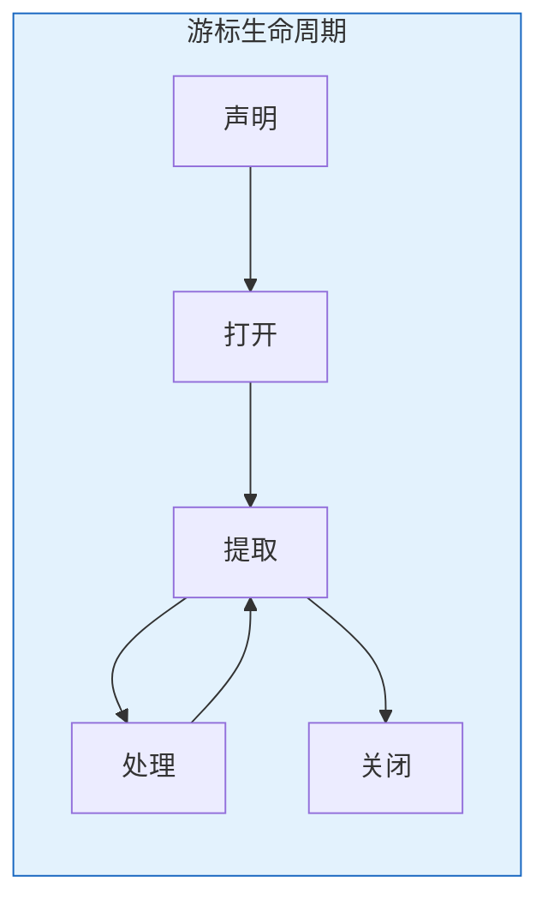

# Oracle显式游标

## 一、概述

### 1.1 一句话定义

Oracle显式游标是PL/SQL中用于处理多行查询结果的命名工作区，通过OPEN、FETCH、CLOSE操作逐行处理数据。
它在需要逐行处理查询结果的场景中出现和使用，解决多行数据的精细控制问题。

### 1.2 为什么重要

- **不掌握的后果：** 无法逐行处理查询结果，复杂数据处理困难
- **掌握的价值：** 精细控制数据处理流程

## 二、核心原理

### 2.1 游标生命周期



### 2.2 基本语法

```sql
-- 声明游标
DECLARE
    CURSOR emp_cursor IS
        SELECT employee_id, name, salary FROM employees;
    
    v_id NUMBER;
    v_name VARCHAR2(100);
    v_salary NUMBER;
BEGIN
    -- 打开游标
    OPEN emp_cursor;
    
    LOOP
        -- 提取数据
        FETCH emp_cursor INTO v_id, v_name, v_salary;
        EXIT WHEN emp_cursor%NOTFOUND;
        
        -- 处理数据
        DBMS_OUTPUT.PUT_LINE(v_id || ': ' || v_name || ' - ' || v_salary);
    END LOOP;
    
    -- 关闭游标
    CLOSE emp_cursor;
END;
/
```

### 2.3 游标属性

| 属性 | 说明 |
|------|------|
| %ISOPEN | 是否打开 |
| %FOUND | 最近FETCH成功 |
| %NOTFOUND | 最近FETCH失败 |
| %ROWCOUNT | 已提取行数 |

```sql
DECLARE
    CURSOR emp_cur IS SELECT * FROM employees;
BEGIN
    OPEN emp_cur;
    DBMS_OUTPUT.PUT_LINE('Is Open: ' || emp_cur%ISOPEN);
    
    FETCH emp_cur INTO ...;
    DBMS_OUTPUT.PUT_LINE('Found: ' || emp_cur%FOUND);
    DBMS_OUTPUT.PUT_LINE('Rowcount: ' || emp_cur%ROWCOUNT);
    
    CLOSE emp_cur;
END;
```

### 2.4 游标FOR循环（推荐）

```sql
-- 隐式OPEN/FETCH/CLOSE
BEGIN
    FOR rec IN (SELECT employee_id, name, salary FROM employees) LOOP
        DBMS_OUTPUT.PUT_LINE(rec.employee_id || ': ' || rec.name);
    END LOOP;
END;
/

-- 带参数的游标FOR循环
DECLARE
    CURSOR emp_cur(p_dept_id NUMBER) IS
        SELECT * FROM employees WHERE department_id = p_dept_id;
BEGIN
    FOR rec IN emp_cur(10) LOOP
        DBMS_OUTPUT.PUT_LINE(rec.name);
    END LOOP;
END;
/
```

### 2.5 带参数的游标

```sql
DECLARE
    CURSOR emp_cur(p_dept_id NUMBER, p_min_salary NUMBER) IS
        SELECT employee_id, name, salary
        FROM employees
        WHERE department_id = p_dept_id
          AND salary > p_min_salary;
BEGIN
    FOR rec IN emp_cur(10, 50000) LOOP
        DBMS_OUTPUT.PUT_LINE(rec.name || ': ' || rec.salary);
    END LOOP;
END;
/
```

### 2.6 FOR UPDATE游标

```sql
-- 锁定行进行更新
DECLARE
    CURSOR emp_cur IS
        SELECT employee_id, salary FROM employees
        WHERE department_id = 10
        FOR UPDATE OF salary NOWAIT;
BEGIN
    FOR rec IN emp_cur LOOP
        UPDATE employees
        SET salary = rec.salary * 1.1
        WHERE CURRENT OF emp_cur;
    END LOOP;
END;
/
```

### 2.7 游标变量（REF CURSOR）

```sql
-- 弱类型游标变量
DECLARE
    TYPE emp_cur_type IS REF CURSOR;
    v_cur emp_cur_type;
    v_rec employees%ROWTYPE;
BEGIN
    OPEN v_cur FOR SELECT * FROM employees WHERE department_id = 10;
    LOOP
        FETCH v_cur INTO v_rec;
        EXIT WHEN v_cur%NOTFOUND;
        DBMS_OUTPUT.PUT_LINE(v_rec.name);
    END LOOP;
    CLOSE v_cur;
END;
/

-- 强类型游标变量
CREATE OR REPLACE PACKAGE emp_pkg AS
    TYPE emp_cur_type IS REF CURSOR RETURN employees%ROWTYPE;
    FUNCTION get_employees RETURN emp_cur_type;
END;
/
```

### 2.8 BULK COLLECT批量提取

```sql
DECLARE
    CURSOR emp_cur IS SELECT employee_id, name FROM employees;
    
    TYPE id_tab IS TABLE OF NUMBER;
    TYPE name_tab IS TABLE OF VARCHAR2(100);
    
    v_ids id_tab;
    v_names name_tab;
BEGIN
    OPEN emp_cur;
    FETCH emp_cur BULK COLLECT INTO v_ids, v_names;
    CLOSE emp_cur;
    
    FOR i IN 1..v_ids.COUNT LOOP
        DBMS_OUTPUT.PUT_LINE(v_ids(i) || ': ' || v_names(i));
    END LOOP;
END;
/

-- 限制行数
FETCH emp_cur BULK COLLECT INTO v_ids, v_names LIMIT 100;
```

## 三、实战案例

### 3.1 批量数据处理

```sql
CREATE OR REPLACE PROCEDURE process_department(
    p_dept_id IN NUMBER,
    p_raise_pct IN NUMBER
) AS
    CURSOR emp_cur IS
        SELECT employee_id, salary
        FROM employees
        WHERE department_id = p_dept_id
        FOR UPDATE;
    
    TYPE id_tab IS TABLE OF NUMBER;
    TYPE sal_tab IS TABLE OF NUMBER;
    v_ids id_tab;
    v_sals sal_tab;
BEGIN
    OPEN emp_cur;
    FETCH emp_cur BULK COLLECT INTO v_ids, v_sals;
    CLOSE emp_cur;
    
    FORALL i IN 1..v_ids.COUNT
        UPDATE employees
        SET salary = v_sals(i) * (1 + p_raise_pct / 100)
        WHERE employee_id = v_ids(i);
    
    DBMS_OUTPUT.PUT_LINE('Processed: ' || v_ids.COUNT);
END;
/
```

## 四、最佳实践

### 4.1 注意事项

| 要点 | 说明 |
|------|------|
| 及时关闭 | 防止资源泄漏 |
| FOR循环 | 推荐隐式管理 |
| BULK COLLECT | 批量处理提高性能 |
| FOR UPDATE | 锁定行更新 |

## 五、常见错误

| 错误 | 问题 | 解决方法 |
|------|------|---------|
| ORA-01001 | 无效游标 | 检查游标状态 |
| ORA-01002 | fetch超出 | 检查%NOTFOUND |
| ORA-01000 | 超出游标数 | 关闭不用的游标 |

## 六、总结速查

### 6.1 黄金法则

1. **FOR循环** - 推荐隐式管理
2. **BULK COLLECT** - 批量提高性能
3. **及时关闭** - 防止资源泄漏
4. **FOR UPDATE** - 锁定行更新

## 附录

### A. 官方参考

- [Oracle Database PL/SQL Language Reference - Cursors](https://docs.oracle.com/en/database/oracle/oracle-database/19c/lnpls/)

### B. 修订记录

| 日期 | 版本 | 修改内容 | 修改人 |
|------|------|---------|--------|
| 2026-07-02 | v1.0 | 初始版本 | YashanDB知识库生成器 |

## 七、游标高级用法

### 7.1 游标变量与参数化

```sql
-- 参数化游标
DECLARE
    CURSOR c_emp(p_dept_id NUMBER, p_min_salary NUMBER DEFAULT 5000) IS
        SELECT employee_id, first_name, salary
        FROM employees
        WHERE department_id = p_dept_id AND salary >= p_min_salary;
BEGIN
    FOR r IN c_emp(10, 8000) LOOP
        DBMS_OUTPUT.PUT_LINE(r.first_name || ': ' || r.salary);
    END LOOP;
    
    -- 使用默认参数
    FOR r IN c_emp(20) LOOP
        DBMS_OUTPUT.PUT_LINE(r.first_name || ': ' || r.salary);
    END LOOP;
END;
/

-- 游标表达式（Cursor Expression）
SELECT department_name,
    CURSOR(SELECT first_name, salary 
           FROM employees e 
           WHERE e.department_id = d.department_id) AS emp_cursor
FROM departments d WHERE department_id = 10;
```

### 7.2 游标属性详解

```sql
-- 游标属性
-- %ISOPEN: 游标是否打开
-- %FOUND: 最近FETCH是否成功
-- %NOTFOUND: 最近FETCH是否失败
-- %ROWCOUNT: 已获取的行数

DECLARE
    CURSOR c IS SELECT * FROM employees;
    v_emp employees%ROWTYPE;
BEGIN
    OPEN c;
    DBMS_OUTPUT.PUT_LINE('Is Open: ' || CASE WHEN c%ISOPEN THEN 'YES' ELSE 'NO' END);
    
    LOOP
        FETCH c INTO v_emp;
        EXIT WHEN c%NOTFOUND;
        DBMS_OUTPUT.PUT_LINE('Row ' || c%ROWCOUNT || ': ' || v_emp.first_name);
    END LOOP;
    
    DBMS_OUTPUT.PUT_LINE('Total rows: ' || c%ROWCOUNT);
    CLOSE c;
    DBMS_OUTPUT.PUT_LINE('Is Open: ' || CASE WHEN c%ISOPEN THEN 'YES' ELSE 'NO' END);
END;
/
```

### 7.3 游标与BULK COLLECT

```sql
-- 批量获取优化
DECLARE
    CURSOR c IS SELECT employee_id, first_name, salary FROM employees;
    TYPE t_ids IS TABLE OF NUMBER;
    TYPE t_names IS TABLE OF VARCHAR2(100);
    TYPE t_sals IS TABLE OF NUMBER;
    v_ids t_ids;
    v_names t_names;
    v_sals t_sals;
BEGIN
    OPEN c;
    FETCH c BULK COLLECT INTO v_ids, v_names, v_sals;
    CLOSE c;
    
    FOR i IN 1 .. v_ids.COUNT LOOP
        DBMS_OUTPUT.PUT_LINE(v_ids(i) || ': ' || v_names(i) || ' - ' || v_sals(i));
    END LOOP;
END;
/

-- 分批获取（LIMIT）
DECLARE
    CURSOR c IS SELECT * FROM big_table;
    TYPE t_data IS TABLE OF big_table%ROWTYPE;
    v_data t_data;
BEGIN
    OPEN c;
    LOOP
        FETCH c BULK COLLECT INTO v_data LIMIT 500;
        EXIT WHEN v_data.COUNT = 0;
        -- 处理500行
        FORALL i IN 1 .. v_data.COUNT
            UPDATE target SET col = v_data(i).col WHERE id = v_data(i).id;
        COMMIT;
    END LOOP;
    CLOSE c;
END;
/
```

## 八、游标性能优化

### 8.1 优化建议

| 建议 | 说明 |
|------|------|
| 使用FOR循环 | 自动管理打开/关闭 |
| BULK COLLECT | 减少上下文切换 |
| 避免SELECT * | 只选需要的列 |
| WHERE条件 | 减少返回行数 |
| 及时关闭 | 释放资源 |

### 8.2 游标 vs 集合操作

```sql
-- 不推荐：使用游标逐行处理
DECLARE
    CURSOR c IS SELECT * FROM employees;
BEGIN
    FOR r IN c LOOP
        UPDATE employees SET salary = salary * 1.1 WHERE employee_id = r.employee_id;
    END LOOP;
END;
/

-- 推荐：使用SQL集合操作
UPDATE employees SET salary = salary * 1.1;
-- 一条SQL替代游标循环
```

## 九、常见错误

| 错误 | 原因 | 解决方案 |
|------|------|---------|
| ORA-01001 | 无效游标 | 检查游标状态 |
| ORA-01002 | 获取违规 | 检查%NOTFOUND |
| ORA-01000 | 超出游标数 | 及时关闭游标 |
| ORA-01006 | 绑定变量不存在 | 检查INTO变量 |

## 十、总结速查

| 操作 | 语法 | 说明 |
|------|------|------|
| 声明 | CURSOR c IS SELECT... | 定义游标 |
| 打开 | OPEN c | 执行查询 |
| 获取 | FETCH c INTO... | 读取数据 |
| 关闭 | CLOSE c | 释放资源 |
| 属性 | c%ROWCOUNT等 | 状态信息 |
| 参数 | CURSOR c(p) IS... | 参数化 |
