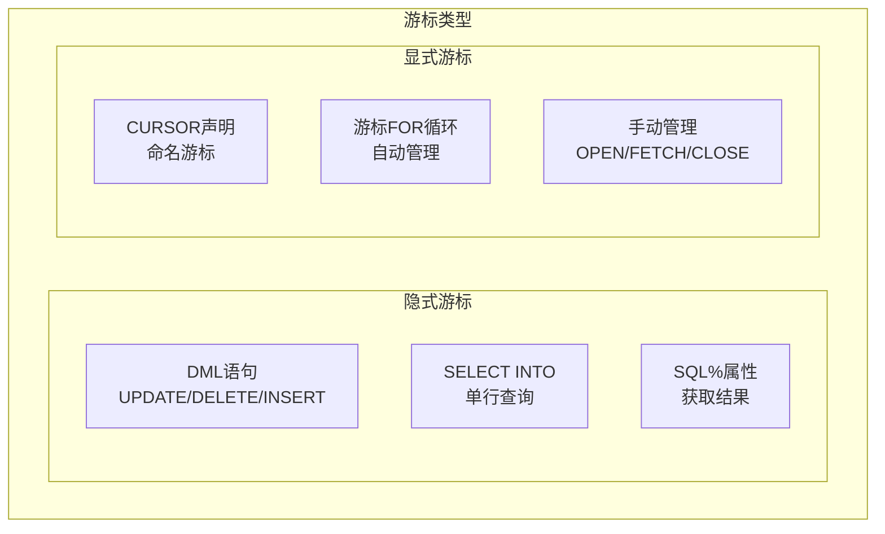
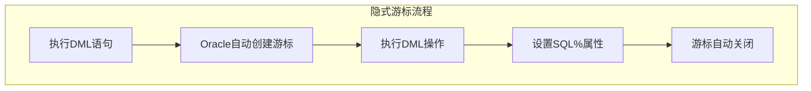
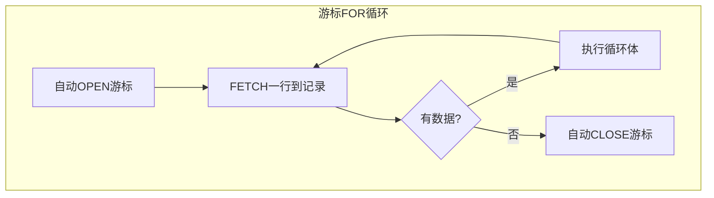

# Oracle隐式游标与游标FOR循环

## 一、概述

### 1.1 一句话定义

Oracle隐式游标是PL/SQL自动为每条DML语句和SELECT INTO语句创建的游标，通过SQL%属性获取执行结果；游标FOR循环是简化游标遍历的语法结构，自动处理打开、获取和关闭操作。
它们在PL/SQL编程中出现和使用，解决简化游标操作和获取DML执行结果的问题。

### 1.2 为什么重要

- **不掌握的后果：** 代码冗长、游标资源泄漏、无法获取DML影响行数
- **掌握的价值：** 代码简洁易读，自动管理游标资源，高效处理批量数据

### 1.3 适用场景

| 场景 | 说明 |
|------|------|
| DML结果检查 | 获取UPDATE/DELETE影响行数 |
| 批量数据遍历 | 使用FOR循环遍历查询结果 |
| 嵌套查询处理 | 多层循环处理关联数据 |
| 简单报表生成 | 遍历数据生成报表 |
| 数据迁移 | 逐行处理数据转换 |

### 1.4 版本演进

| 版本 | 变化说明 |
|------|---------|
| 11gR2 | 游标表达式（CURSOR表达式）增强 |
| 12cR1 | 结果缓存与游标交互 |
| 12cR2 | PL/SQL性能优化 |
| 19c | 游标FOR循环性能改进 |
| 21c | 迭代控制语法增强 |

## 二、术语与概念

### 2.1 核心术语表

| 术语 | 含义 | 类比 |
|------|------|------|
| 隐式游标 | PL/SQL自动为DML创建的游标 | 自动开门 |
| SQL%ROWCOUNT | DML影响的行数 | 处理了多少文件 |
| SQL%FOUND | DML是否影响了行 | 有没有处理到 |
| SQL%NOTFOUND | DML是否未影响行 | 没处理到 |
| 游标FOR循环 | 自动管理游标的循环 | 自动翻页看书 |
| 记录变量 | FOR循环中的行数据 | 当前页的内容 |
| 参数化游标 | 带参数的命名游标 | 带条件的搜索 |

### 2.2 游标类型对比



## 三、架构与原理

### 3.1 隐式游标工作流程



### 3.2 工作原理

1. **隐式游标：** 每条DML语句执行时，Oracle自动创建隐式游标
2. **属性设置：** 执行完成后设置SQL%ROWCOUNT、SQL%FOUND等属性
3. **属性访问：** 通过SQL%属性获取DML执行结果
4. **游标FOR循环：** 自动OPEN、FETCH、CLOSE游标
5. **记录变量：** 每次循环自动填充行数据到记录变量

**一句话总结：** 隐式游标和游标FOR循环是PL/SQL的"自动化助手"——让开发者专注于业务逻辑而非游标管理。

### 3.3 游标FOR循环流程



## 四、功能详解

### 4.1 隐式游标属性

#### 功能说明

通过SQL%属性获取最近一条DML语句的执行结果。

#### 操作步骤

```sql
-- SQL%ROWCOUNT：影响的行数
BEGIN
    UPDATE employees SET salary = salary * 1.1
    WHERE department_id = 10;

    DBMS_OUTPUT.PUT_LINE('Rows updated: ' || SQL%ROWCOUNT);

    IF SQL%ROWCOUNT = 0 THEN
        DBMS_OUTPUT.PUT_LINE('No rows updated');
    END IF;
END;
/

-- SQL%FOUND / SQL%NOTFOUND：是否影响行
BEGIN
    DELETE FROM employees WHERE employee_id = 9999;

    IF SQL%NOTFOUND THEN
        DBMS_OUTPUT.PUT_LINE('Employee not found');
    ELSE
        DBMS_OUTPUT.PUT_LINE('Deleted ' || SQL%ROWCOUNT || ' rows');
    END IF;
END;
/

-- SQL%ISOPEN：始终为FALSE（隐式游标自动关闭）
BEGIN
    UPDATE employees SET salary = salary * 1.1 WHERE department_id = 10;
    DBMS_OUTPUT.PUT_LINE('Is open: ' || SQL%ISOPEN);  -- 始终FALSE
END;
/

-- 实际应用：检查UPDATE是否成功
CREATE OR REPLACE PROCEDURE raise_salary(
    p_emp_id  IN NUMBER,
    p_factor  IN NUMBER,
    p_success OUT BOOLEAN
) AS
BEGIN
    UPDATE employees SET salary = salary * p_factor
    WHERE employee_id = p_emp_id;

    p_success := SQL%FOUND;  -- TRUE表示影响了行
END;
/
```

### 4.2 游标FOR循环

```sql
-- 基本FOR循环（内联查询）
BEGIN
    FOR rec IN (SELECT employee_id, last_name, salary
                FROM employees
                WHERE department_id = 10) LOOP
        DBMS_OUTPUT.PUT_LINE(rec.employee_id || ': ' ||
                           rec.last_name || ' - ' || rec.salary);
    END LOOP;
END;
/

-- 命名游标FOR循环
DECLARE
    CURSOR emp_cur IS
        SELECT employee_id, last_name, salary
        FROM employees
        WHERE department_id = 10;
BEGIN
    FOR rec IN emp_cur LOOP
        DBMS_OUTPUT.PUT_LINE(rec.last_name);
    END LOOP;
END;
/

-- 参数化游标FOR循环
DECLARE
    CURSOR emp_cur(p_dept_id NUMBER) IS
        SELECT employee_id, last_name, salary
        FROM employees
        WHERE department_id = p_dept_id;
BEGIN
    -- 查询部门10
    FOR rec IN emp_cur(10) LOOP
        DBMS_OUTPUT.PUT_LINE('Dept 10: ' || rec.last_name);
    END LOOP;

    -- 查询部门20
    FOR rec IN emp_cur(20) LOOP
        DBMS_OUTPUT.PUT_LINE('Dept 20: ' || rec.last_name);
    END LOOP;
END;
/
```

### 4.3 嵌套游标FOR循环

```sql
-- 部门-员工嵌套
BEGIN
    FOR dept_rec IN (SELECT department_id, department_name FROM departments) LOOP
        DBMS_OUTPUT.PUT_LINE('Department: ' || dept_rec.department_name);

        FOR emp_rec IN (SELECT last_name, salary
                        FROM employees
                        WHERE department_id = dept_rec.department_id) LOOP
            DBMS_OUTPUT.PUT_LINE('  ' || emp_rec.last_name ||
                               ' - ' || emp_rec.salary);
        END LOOP;
    END LOOP;
END;
/

-- 注意：嵌套循环可能导致大量SQL执行
-- 大数据量时考虑JOIN替代
```

### 4.4 游标FOR循环与DML结合

```sql
-- 批量更新
BEGIN
    FOR rec IN (SELECT employee_id, salary FROM employees WHERE department_id = 10) LOOP
        IF rec.salary < 5000 THEN
            UPDATE employees SET salary = salary * 1.1
            WHERE employee_id = rec.employee_id;
        END IF;
    END LOOP;
    COMMIT;
END;
/

-- 注意：逐行DML效率低，大数据量用FORALL或批量UPDATE
-- 更好的写法：
UPDATE employees SET salary = salary * 1.1
WHERE department_id = 10 AND salary < 5000;
```

### 4.5 性能优化技巧

```sql
-- 1. 使用BULK COLLECT提高批量处理效率
DECLARE
    TYPE emp_tab IS TABLE OF employees%ROWTYPE;
    v_emps emp_tab;
BEGIN
    SELECT * BULK COLLECT INTO v_emps
    FROM employees WHERE department_id = 10;

    FOR i IN 1..v_emps.COUNT LOOP
        DBMS_OUTPUT.PUT_LINE(v_emps(i).last_name);
    END LOOP;
END;
/

-- 2. 使用ROWNUM限制行数
BEGIN
    FOR rec IN (SELECT * FROM employees WHERE ROWNUM <= 10) LOOP
        DBMS_OUTPUT.PUT_LINE(rec.last_name);
    END LOOP;
END;
/

-- 3. 避免嵌套循环，改用JOIN
-- 差：嵌套循环
-- FOR d IN (SELECT * FROM departments) LOOP
--     FOR e IN (SELECT * FROM employees WHERE dept_id = d.dept_id) LOOP

-- 好：单查询
-- FOR rec IN (SELECT d.dept_name, e.last_name
--             FROM departments d JOIN employees e ON d.dept_id = e.dept_id) LOOP
```

## 五、性能与调优

### 5.1 性能考虑

| 因素 | 建议 | 原因 |
|------|------|------|
| 嵌套循环 | 避免过深嵌套 | SQL执行次数指数增长 |
| 逐行DML | 改用批量DML | 减少上下文切换 |
| 大数据量 | 使用BULK COLLECT | 批量处理更高效 |
| 游标FOR循环 | 自动管理资源 | 比手动管理更安全 |

### 5.2 性能基线

| 指标 | 正常范围 | 告警阈值 | 说明 |
|------|---------|---------|------|
| 循环内SQL次数 | < 1000 | > 10000 | 嵌套循环问题 |
| 游标打开数 | < 50 | > 200 | 游标泄漏 |

## 六、DFX能力

### 6.1 动态性能视图

| 视图名 | 用途 | 关键字段 |
|--------|------|---------|
| V$OPEN_CURSOR | 打开的游标 | SQL_TEXT, STATUS |
| V$SESSTAT | 会话统计 | STATISTIC#, VALUE |

### 6.2 监控脚本

```sql
-- 检查游标使用
SELECT stat_name, value
FROM v$sesstat
WHERE stat_name LIKE '%cursor%'
AND sid = SYS_CONTEXT('USERENV', 'SID');
```

## 七、实战案例

### 7.1 案例背景

- **场景**：某系统需要批量处理部门员工调薪
- **时间**：年度调薪
- **现象**：原代码使用手动游标，代码冗长且容易泄漏

### 7.2 诊断过程

**步骤1：分析原代码**

```sql
-- 原代码（手动游标）
DECLARE
    CURSOR emp_cur IS SELECT * FROM employees WHERE department_id = 10;
    v_rec employees%ROWTYPE;
BEGIN
    OPEN emp_cur;
    LOOP
        FETCH emp_cur INTO v_rec;
        EXIT WHEN emp_cur%NOTFOUND;
        -- 处理逻辑
    END LOOP;
    CLOSE emp_cur;  -- 如果中间异常，游标不会关闭
END;
/
```
- → 发现：手动管理游标，异常时可能泄漏
- → 判断：改用游标FOR循环

**步骤2：优化代码**

```sql
-- 优化后（游标FOR循环）
BEGIN
    FOR rec IN (SELECT employee_id, last_name, salary
                FROM employees WHERE department_id = 10) LOOP
        -- 处理逻辑
        IF rec.salary < 5000 THEN
            UPDATE employees SET salary = salary * 1.1
            WHERE employee_id = rec.employee_id;
        END IF;
    END LOOP;
    COMMIT;
END;
/
-- 游标自动管理，异常时自动关闭
```

### 7.3 解决结果

| 指标 | 解决前 | 解决后 |
|------|--------|--------|
| 代码行数 | 20行 | 10行 |
| 游标泄漏风险 | 有 | 无 |
| 可维护性 | 差 | 好 |

### 7.4 复盘总结

- **根因：** 手动游标管理容易出错
- **教训：** 游标FOR循环自动管理资源，是PL/SQL遍历数据的最佳实践

## 八、常见错误与排查

### 8.1 常见错误列表

| 错误代码 | 错误信息 | 原因 | 解决方法 |
|---------|---------|------|---------|
| ORA-01001 | invalid cursor | 游标未打开或已关闭 | 检查游标状态 |
| ORA-01002 | fetch out of sequence | FETCH顺序错误 | 先OPEN再FETCH |
| ORA-01422 | exact fetch returns more rows | SELECT INTO返回多行 | 使用游标FOR循环 |
| ORA-01403 | no data found | SELECT INTO无数据 | 检查WHERE条件 |

### 8.2 排查步骤

1. **检查SQL%属性：** 确认DML执行结果
2. **检查游标状态：** `cursor_name%ISOPEN`
3. **检查循环逻辑：** 确认EXIT条件
4. **检查资源泄漏：** 查看V$OPEN_CURSOR

## 九、最佳实践

### 9.1 官方推荐

- 优先使用游标FOR循环而非手动游标
- 使用SQL%ROWCOUNT检查DML结果
- 大数据量使用BULK COLLECT
- 避免深层嵌套循环

### 9.2 社区经验

- 游标FOR循环自动管理资源，更安全
- 参数化游标提高代码复用性
- 嵌套循环考虑改用JOIN
- 逐行DML考虑改为批量DML

### 9.3 反模式

| 反模式 | 问题 | 正确做法 |
|--------|------|---------|
| 手动游标管理 | 资源泄漏风险 | 使用游标FOR循环 |
| 深层嵌套循环 | SQL执行次数爆炸 | 改用JOIN |
| 逐行DML | 上下文切换开销大 | 批量DML |
| 不检查SQL%FOUND | 不知道DML是否成功 | 检查SQL%属性 |

## 十、命令与视图汇总

### 10.1 SQL%属性

| 属性 | 适用场景 | 说明 |
|------|---------|------|
| `SQL%ROWCOUNT` | 获取影响行数 | DML后使用 |
| `SQL%FOUND` | 是否影响行 | TRUE/FALSE |
| `SQL%NOTFOUND` | 是否未影响行 | TRUE/FALSE |
| `SQL%ISOPEN` | 游标是否打开 | 隐式游标始终FALSE |

### 10.2 视图列表

| 视图名 | 类型 | 用途 | 关键字段 |
|--------|------|------|---------|
| V$OPEN_CURSOR | 动态 | 打开的游标 | SQL_TEXT, STATUS |
| V$SESSTAT | 动态 | 会话统计 | STATISTIC# |

## 十一、总结速查

### 11.1 黄金法则

1. **游标FOR循环优先** - 自动管理资源
2. **SQL%属性检查** - 确认DML结果
3. **避免深层嵌套** - 改用JOIN
4. **大数据量用BULK** - 批量处理更高效
5. **参数化游标** - 提高复用性

### 11.2 一页纸检查清单

| 现象/场景 | 原因 | 处理方案 |
|-----------|------|----------|
| 游标泄漏 | 手动管理未关闭 | 使用游标FOR循环 |
| DML不知结果 | 未检查SQL%属性 | 使用SQL%ROWCOUNT |
| 嵌套循环慢 | SQL执行次数多 | 改用JOIN |
| 逐行DML慢 | 上下文切换 | 批量DML |
| SELECT INTO报错 | 返回多行 | 使用游标FOR循环 |

### 11.3 关键数字

| 指标 | 正常范围 | 告警阈值 | 说明 |
|------|---------|---------|------|
| 循环内SQL | < 1000 | > 10000 | 嵌套问题 |
| 游标打开数 | < 50 | > 200 | 泄漏检查 |

## 附录

### A. 官方参考

- [Oracle Database PL/SQL Language Reference](https://docs.oracle.com/en/database/oracle/oracle-database/19c/lnpls/)
- MOS Note: 1187372.1 - "PL/SQL Cursor Best Practices"

### B. 数据字典

| 对象名 | 类型 | 说明 |
|--------|------|------|
| V$OPEN_CURSOR | 动态视图 | 打开的游标 |
| V$SESSTAT | 动态视图 | 会话统计 |

### C. 修订记录

| 日期 | 版本 | 修改内容 | 修改人 |
|------|------|---------|--------|
| 2026-07-02 | v1.0 | 初始版本 | YashanDB知识库生成器 |
| 2026-07-02 | v1.1 | 补充完整模板章节 | YashanDB知识库生成器 |
