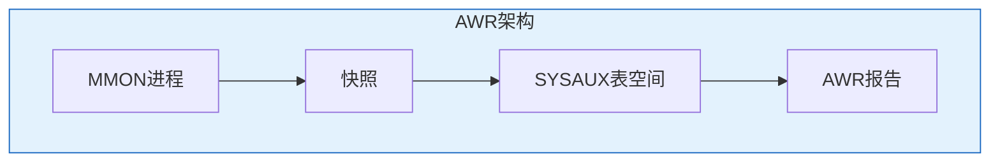

# Oracle AWR与ASH性能诊断

## 一、概述

### 1.1 一句话定义

AWR（Automatic Workload Repository）是Oracle自动收集性能统计数据的仓库，ASH（Active Session History）记录活动会话的实时采样数据，两者结合提供全面的性能诊断能力。
它在性能优化中出现和使用，解决数据库性能问题的定位和分析问题。

### 1.2 为什么重要

- **不掌握的后果：** 无法定位性能瓶颈，优化无的放矢
- **掌握的价值：** 精准定位性能问题，数据驱动优化

## 二、核心原理

### 2.1 AWR架构



### 2.2 AWR快照管理

```sql
-- 查看快照
SELECT snap_id, TO_CHAR(begin_interval_time, 'YYYY-MM-DD HH24:MI') AS begin_time,
       TO_CHAR(end_interval_time, 'YYYY-MM-DD HH24:MI') AS end_time
FROM dba_hist_snapshot
ORDER BY snap_id DESC
FETCH FIRST 20 ROWS ONLY;

-- 手动创建快照
EXEC DBMS_WORKLOAD_REPOSITORY.CREATE_SNAPSHOT;

-- 查看AWR保留期
SELECT dbid, snap_interval, retention FROM dba_hist_wr_control;

-- 修改保留期
EXEC DBMS_WORKLOAD_REPOSITORY.MODIFY_SNAPSHOT_SETTINGS(retention => 45);  -- 45天

-- 修改快照间隔
EXEC DBMS_WORKLOAD_REPOSITORY.MODIFY_SNAPSHOT_SETTINGS(snap_interval => 30);  -- 30分钟
```

### 2.3 生成AWR报告

```sql
-- 生成HTML格式AWR报告
@$ORACLE_HOME/rdbms/admin/awrrpt.sql

-- 生成文本格式
@$ORACLE_HOME/rdbms/admin/awrrpti.sql

-- 生成AWR对比报告
@$ORACLE_HOME/rdbms/admin/awrddrpi.sql

-- 使用PL/SQL生成
DECLARE
    v_report CLOB;
BEGIN
    v_report := DBMS_WORKLOAD_REPOSITORY.AWR_REPORT_HTML(
        l_dbid => (SELECT dbid FROM v$database),
        l_inst_num => 1,
        l_bid => 1000,  -- begin snap_id
        l_eid => 1024   -- end snap_id
    );
    -- 输出报告
END;
/
```

### 2.4 AWR报告关键章节

| 章节 | 说明 |
|------|------|
| Report Info | 报告基本信息 |
| Host Info | 主机信息 |
| Top 5 Timed Events | 前5等待事件 |
| SQL Statistics | SQL统计 |
| Instance Efficiency | 实例效率 |
| Tablespace IO | 表空间I/O |
| Segment Statistics | 段统计 |

### 2.5 ASH实时分析

```sql
-- 当前活动会话
SELECT session_id, session_serial#, sql_id, event,
       wait_time_micro/1000000 AS wait_sec, session_state
FROM v$active_session_history
WHERE sample_time > SYSTIMESTAMP - INTERVAL '5' MINUTE
ORDER BY sample_time DESC;

-- 最近等待事件TOP
SELECT event, COUNT(*) AS waits,
       ROUND(SUM(wait_time_micro)/1000000, 2) AS total_sec
FROM v$active_session_history
WHERE sample_time > SYSTIMESTAMP - INTERVAL '1' HOUR
  AND session_state = 'WAITING'
GROUP BY event
ORDER BY total_sec DESC
FETCH FIRST 10 ROWS ONLY;

-- 最近TOP SQL
SELECT sql_id, COUNT(*) AS samples,
       ROUND(SUM(elapsed_time)/1000000, 2) AS total_sec
FROM v$active_session_history
WHERE sample_time > SYSTIMESTAMP - INTERVAL '1' HOUR
  AND sql_id IS NOT NULL
GROUP BY sql_id
ORDER BY samples DESC
FETCH FIRST 10 ROWS ONLY;
```

### 2.6 ASH报告

```sql
-- 生成ASH报告
@$ORACLE_HOME/rdbms/admin/ashrpt.sql

-- 查看ASH历史数据
SELECT sample_time, session_id, sql_id, event, session_state
FROM dba_hist_active_sess_history
WHERE sample_time > SYSDATE - 1
ORDER BY sample_time DESC
FETCH FIRST 20 ROWS ONLY;
```

### 2.7 AWR/ASH常用视图

| 视图 | 说明 |
|------|------|
| DBA_HIST_SNAPSHOT | 快照信息 |
| DBA_HIST_SYSSTAT | 系统统计 |
| DBA_HIST_SYS_TIME_MODEL | 时间模型 |
| DBA_HIST_SQLSTAT | SQL统计 |
| DBA_HIST_ACTIVE_SESS_HISTORY | ASH历史 |
| V$ACTIVE_SESSION_HISTORY | ASH实时 |

## 三、实战案例

### 3.1 性能问题诊断流程

```sql
-- 1. 查看数据库整体状态
SELECT * FROM v$sys_time_model;

-- 2. 查看等待事件
SELECT event, total_waits, time_waited/100 AS sec
FROM v$system_event
WHERE wait_class != 'Idle'
ORDER BY time_waited DESC
FETCH FIRST 10 ROWS ONLY;

-- 3. 查看TOP SQL
SELECT sql_id, elapsed_time/1000000 AS sec, executions,
       elapsed_time/DECODE(executions, 0, 1, executions)/1000 AS avg_ms
FROM v$sql
ORDER BY elapsed_time DESC
FETCH FIRST 10 ROWS ONLY;

-- 4. 生成AWR报告深入分析
```

## 四、最佳实践

### 4.1 注意事项

| 要点 | 说明 |
|------|------|
| 定期生成报告 | 建立基线 |
| 对比分析 | 使用AWR对比 |
| ASH实时 | 问题发生时的快照 |
| 保留期合理 | 30-45天 |

## 五、总结速查

### 5.1 黄金法则

1. **AWR基线** - 建立性能基线
2. **ASH实时** - 问题时刻的快照
3. **对比分析** - 前后对比
4. **SQL聚焦** - 找到问题SQL

## 附录

### A. 官方参考

- [Oracle Database Performance Tuning Guide](https://docs.oracle.com/en/database/oracle/oracle-database/19c/tgdba/)

### B. 修订记录

| 日期 | 版本 | 修改内容 | 修改人 |
|------|------|---------|--------|
| 2026-07-02 | v1.0 | 初始版本 | YashanDB知识库生成器 |

## 六、AWR基线管理

### 6.1 创建和使用基线

```sql
-- 创建固定基线（用于对比）
BEGIN
    DBMS_WORKLOAD_REPOSITORY.CREATE_BASELINE(
        start_snap_id => 1000,
        end_snap_id => 1024,
        baseline_name => 'NORMAL_WORKLOAD_MONDAY'
    );
END;
/

-- 查看基线
SELECT baseline_name, baseline_type, start_snap_id, end_snap_id,
       TO_CHAR(creation_time, 'YYYY-MM-DD HH24:MI') AS created
FROM dba_hist_baseline;

-- 移动基线（滑动窗口）
BEGIN
    DBMS_WORKLOAD_REPOSITORY.CREATE_MOVING_WINDOW_BASELINE(
        baseline_name => 'MOVING_WINDOW_WEEK',
        window_size => 7  -- 7天滑动窗口
    );
END;
/

-- 使用基线对比
-- 在AWR报告中选择基线作为对比参考
```

### 6.2 AWR数据导出导入

```sql
-- 导出AWR数据（用于离线分析）
BEGIN
    DBMS_SWRF_INTERNAL.AWR_EXTRACT(
        dmpfile => 'awr_export.dmp',
        mpdir => 'DATA_PUMP_DIR',
        fl => DBMS_SWRF_INTERNAL.AWR_SCHEMA_ONLY,
        bid => 1000,
        eid => 1024
    );
END;
/

-- 导入AWR数据到分析库
BEGIN
    DBMS_SWRF_INTERNAL.AWR_LOAD(
        schname => 'AWR_STAGE',
        dmpfile => 'awr_export.dmp',
        dmpdir => 'DATA_PUMP_DIR'
    );
END;
/
```

## 七、AWR报告深入解读

### 7.1 关键性能指标

```sql
-- 从AWR报告中提取关键指标
-- 1. DB Time分析
SELECT snap_id,
       stat_name,
       value - LAG(value) OVER (PARTITION BY stat_name ORDER BY snap_id) AS delta
FROM dba_hist_sys_time_model
WHERE stat_name IN ('DB time', 'DB CPU', 'sql execute elapsed time')
AND snap_id BETWEEN 1000 AND 1024
ORDER BY snap_id, stat_name;

-- 2. 实例效率
SELECT 
    ROUND((1 - (SELECT value FROM v$sysstat WHERE name = 'physical reads') /
           NULLIF((SELECT value FROM v$sysstat WHERE name = 'session logical reads'), 0)) * 100, 2) AS buffer_hit_ratio,
    ROUND((1 - (SELECT value FROM v$sysstat WHERE name = 'parse count (hard)') /
           NULLIF((SELECT value FROM v$sysstat WHERE name = 'parse count (total)'), 0)) * 100, 2) AS soft_parse_ratio,
    ROUND((SELECT value FROM v$sysstat WHERE name = 'execute count') /
           NULLIF((SELECT value FROM v$sysstat WHERE name = 'parse count (total)'), 0), 2) AS execute_to_parse
FROM dual;

-- 3. 等待事件分类统计
SELECT wait_class,
       SUM(total_waits) AS total_waits,
       SUM(time_waited_micro)/1000000 AS total_sec,
       ROUND(SUM(time_waited_micro)/NULLIF(SUM(total_waits),0)/1000, 2) AS avg_ms
FROM v$system_event
WHERE wait_class != 'Idle'
GROUP BY wait_class
ORDER BY total_sec DESC;
```

### 7.2 SQL Statistics解读

```sql
-- 按不同维度分析TOP SQL
-- 按Elapsed Time
SELECT sql_id, elapsed_time/1000000 AS elapsed_sec,
       executions, 
       elapsed_time/NULLIF(executions,0)/1000 AS avg_ms,
       cpu_time/NULLIF(elapsed_time,0)*100 AS cpu_pct,
       disk_reads, buffer_gets,
       ROUND(disk_reads/NULLIF(buffer_gets,0)*100, 2) AS read_pct
FROM dba_hist_sqlstat
WHERE snap_id BETWEEN 1000 AND 1024
ORDER BY elapsed_time DESC FETCH FIRST 10 ROWS ONLY;

-- 按Buffer Gets（逻辑读）
SELECT sql_id, buffer_gets, executions,
       buffer_gets/NULLIF(executions,0) AS gets_per_exec,
       elapsed_time/1000000 AS elapsed_sec
FROM dba_hist_sqlstat
WHERE snap_id BETWEEN 1000 AND 1024
ORDER BY buffer_gets DESC FETCH FIRST 10 ROWS ONLY;

-- 按Disk Reads（物理读）
SELECT sql_id, disk_reads, executions,
       disk_reads/NULLIF(executions,0) AS reads_per_exec,
       elapsed_time/1000000 AS elapsed_sec
FROM dba_hist_sqlstat
WHERE snap_id BETWEEN 1000 AND 1024
ORDER BY disk_reads DESC FETCH FIRST 10 ROWS ONLY;
```

## 八、ASH高级分析

### 8.1 ASH时间线分析

```sql
-- 按分钟统计活动会话
SELECT TO_CHAR(sample_time, 'HH24:MI') AS minute,
       session_state,
       COUNT(*) AS samples
FROM v$active_session_history
WHERE sample_time > SYSTIMESTAMP - INTERVAL '30' MINUTE
GROUP BY TO_CHAR(sample_time, 'HH24:MI'), session_state
ORDER BY minute;

-- 找到性能峰值时刻
SELECT TO_CHAR(sample_time, 'HH24:MI') AS minute,
       COUNT(DISTINCT session_id) AS active_sessions,
       COUNT(DISTINCT sql_id) AS unique_sqls
FROM v$active_session_history
WHERE sample_time > SYSTIMESTAMP - INTERVAL '1' HOUR
GROUP BY TO_CHAR(sample_time, 'HH24:MI')
ORDER BY active_sessions DESC
FETCH FIRST 5 ROWS ONLY;
```

### 8.2 ASH与等待事件关联分析

```sql
-- 特定等待事件的SQL分布
SELECT sql_id, event, COUNT(*) AS samples,
       ROUND(COUNT(*) * 100.0 / SUM(COUNT(*)) OVER (), 2) AS pct
FROM v$active_session_history
WHERE event = 'db file sequential read'
AND sample_time > SYSTIMESTAMP - INTERVAL '1' HOUR
GROUP BY sql_id, event
ORDER BY samples DESC;

-- 特定SQL的等待事件分布
SELECT event, session_state, COUNT(*) AS samples,
       ROUND(COUNT(*) * 100.0 / SUM(COUNT(*)) OVER (), 2) AS pct
FROM v$active_session_history
WHERE sql_id = '&sql_id'
AND sample_time > SYSTIMESTAMP - INTERVAL '1' HOUR
GROUP BY event, session_state
ORDER BY samples DESC;

-- 阻塞链分析
SELECT session_id, session_serial#, sql_id, event,
       blocking_session, blocking_session_status,
       final_blocking_session, final_blocking_sql_id
FROM v$active_session_history
WHERE sample_time > SYSTIMESTAMP - INTERVAL '10' MINUTE
AND blocking_session IS NOT NULL
ORDER BY sample_time DESC;
```

### 8.3 历史ASH分析

```sql
-- 使用DBA_HIST_ACTIVE_SESS_HISTORY分析历史问题
SELECT sql_id, 
       COUNT(*) AS total_samples,
       SUM(CASE WHEN session_state = 'ON CPU' THEN 1 ELSE 0 END) AS cpu_samples,
       SUM(CASE WHEN session_state = 'WAITING' THEN 1 ELSE 0 END) AS wait_samples,
       ROUND(AVG(time_waited_micro)/1000, 2) AS avg_wait_ms
FROM dba_hist_active_sess_history
WHERE sample_time BETWEEN SYSDATE - 1 AND SYSDATE
AND sql_id IS NOT NULL
GROUP BY sql_id
ORDER BY total_samples DESC
FETCH FIRST 20 ROWS ONLY;
```

## 九、性能诊断综合案例

### 9.1 案例：系统响应时间突然增加

```sql
-- Step 1: 确认问题时间范围
SELECT TO_CHAR(sample_time, 'HH24:MI') AS minute,
       COUNT(*) AS active_sessions
FROM v$active_session_history
WHERE sample_time > SYSTIMESTAMP - INTERVAL '2' HOUR
GROUP BY TO_CHAR(sample_time, 'HH24:MI')
ORDER BY minute;
-- 发现14:30开始active sessions激增

-- Step 2: 分析该时段的等待事件
SELECT event, COUNT(*) AS samples
FROM v$active_session_history
WHERE sample_time BETWEEN 
    TO_TIMESTAMP('2026-07-02 14:30', 'YYYY-MM-DD HH24:MI') AND
    TO_TIMESTAMP('2026-07-02 15:00', 'YYYY-MM-DD HH24:MI')
GROUP BY event ORDER BY samples DESC;
-- 发现 db file sequential read 占60%

-- Step 3: 找到相关SQL
SELECT sql_id, COUNT(*) AS samples
FROM v$active_session_history
WHERE event = 'db file sequential read'
AND sample_time BETWEEN 
    TO_TIMESTAMP('2026-07-02 14:30', 'YYYY-MM-DD HH24:MI') AND
    TO_TIMESTAMP('2026-07-02 15:00', 'YYYY-MM-DD HH24:MI')
GROUP BY sql_id ORDER BY samples DESC;

-- Step 4: 检查执行计划
SELECT * FROM TABLE(DBMS_XPLAN.DISPLAY_CURSOR('&sql_id'));

-- Step 5: 生成AWR报告确认
-- 对比正常时段和异常时段的AWR报告
```

### 9.2 案例：CPU使用率持续偏高

```sql
-- Step 1: 确认CPU消耗分布
SELECT stat_name, value/1000000 AS seconds
FROM v$sys_time_model WHERE stat_name LIKE '%CPU%';

-- Step 2: ASH分析ON CPU的SQL
SELECT sql_id, COUNT(*) AS cpu_samples
FROM v$active_session_history
WHERE session_state = 'ON CPU'
AND sample_time > SYSTIMESTAMP - INTERVAL '1' HOUR
GROUP BY sql_id ORDER BY cpu_samples DESC;

-- Step 3: 检查SQL执行计划
SELECT sql_id, cpu_time/1000000 AS cpu_sec, executions,
       buffer_gets, disk_reads
FROM v$sql WHERE sql_id = '&sql_id';

-- Step 4: 优化方案
-- - 添加合适索引减少全表扫描
-- - 使用绑定变量减少硬解析
-- - 考虑并行执行
```

## 十、AWR/ASH常见问题

### 10.1 常见问题及解决

| 问题 | 原因 | 解决方案 |
|------|------|---------|
| AWR报告为空 | 快照间隔无活动 | 检查快照设置 |
| SYSAUX空间不足 | AWR数据积累 | 清理旧快照 |
| ASH数据丢失 | SGA内存限制 | 增大SGA或减少采样 |
| AWR报告生成慢 | 快照范围过大 | 缩小快照范围 |
| 基线创建失败 | 快照不存在 | 确认快照范围 |

### 10.2 AWR空间管理

```sql
-- 查看SYSAUX中AWR占用空间
SELECT occupant_desc, space_usage_kbytes/1024 AS mb
FROM v$sysaux_occupants
WHERE occupant_name LIKE '%AWR%';

-- 清理旧AWR数据
BEGIN
    DBMS_WORKLOAD_REPOSITORY.DROP_SNAPSHOT_RANGE(
        low_snap_id => 100,
        high_snap_id => 500,
        dbid => (SELECT dbid FROM v$database)
    );
END;
/
```

## 十一、命令与视图汇总

| 命令/视图 | 用途 |
|-----------|------|
| `awrrpt.sql` | 生成AWR报告 |
| `awrddrpi.sql` | AWR对比报告 |
| `ashrpt.sql` | ASH报告 |
| `dba_hist_snapshot` | 快照信息 |
| `dba_hist_sqlstat` | SQL历史统计 |
| `v$active_session_history` | 实时ASH |
| `dba_hist_active_sess_history` | 历史ASH |
| `dba_hist_baseline` | 基线信息 |
| `DBMS_WORKLOAD_REPOSITORY` | AWR管理包 |

## 十二、总结速查

| 工具 | 用途 | 数据范围 |
|------|------|---------|
| AWR | 历史性能分析 | 快照间隔（默认1小时） |
| ASH | 实时/近实时分析 | 秒级采样 |
| AWR基线 | 性能对比基准 | 固定/滑动窗口 |
| AWR对比 | 前后对比 | 两个时段 |

**核心要点**：
- AWR是事后分析的主力工具
- ASH提供秒级实时诊断能力
- 建立AWR基线是性能管理的基础
- SQL Statistics是AWR报告中最有价值的章节
- 结合AWR和ASH可以实现全时段性能覆盖
