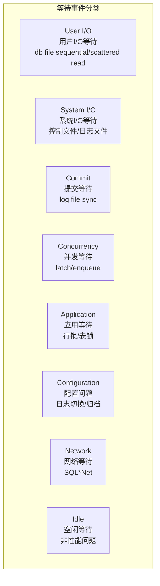
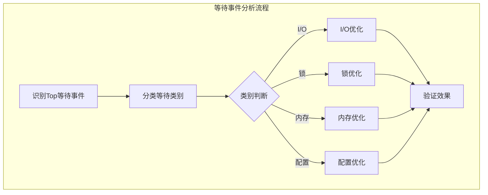
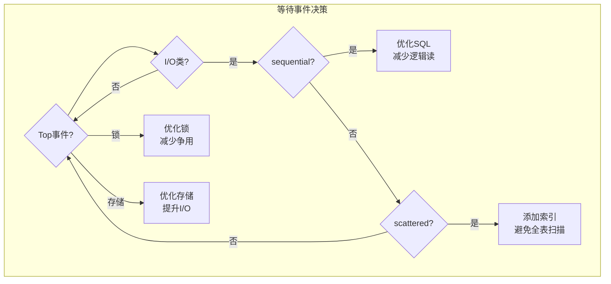

# Oracle等待事件分析

## 一、概述

### 1.1 一句话定义

Oracle等待事件是会话在等待某种资源或条件时产生的统计信息，通过分析等待事件的类型、频率和耗时，可以精准定位数据库性能瓶颈的根本原因。
它在性能优化中出现和使用，解决"数据库在等什么"的核心问题，是性能诊断的起点。

### 1.2 为什么重要

- **不掌握的后果：** 无法定位性能瓶颈，优化方向错误，可能花费大量时间优化非瓶颈点
- **掌握的价值：** 精准定位性能问题根因，将优化精力集中在真正的瓶颈上

### 1.3 适用场景

| 场景 | 说明 |
|------|------|
| 性能诊断 | 定位数据库性能瓶颈 |
| AWR分析 | 解读AWR报告中的Top等待事件 |
| 实时监控 | 发现当前正在等待的会话 |
| 基线对比 | 与正常时对比发现异常 |
| 容量规划 | 识别资源瓶颈 |

### 1.4 版本演进

| 版本 | 变化说明 |
|------|---------|
| 11gR2 | 等待事件分类体系完善 |
| 12cR1 | 新增自适应相关等待 |
| 12cR2 | 等待事件诊断增强 |
| 19c | 自动性能诊断集成 |
| 21c | 云环境等待事件监控 |

## 二、术语与概念

### 2.1 核心术语表

| 术语 | 含义 | 类比 |
|------|------|------|
| 等待事件 | 会话等待某种资源的统计 | 排队等咖啡 |
| 等待类别 | 等待事件的分类 | 排队类型（咖啡/茶/水） |
| Time Waited | 等待总时间 | 排队总时间 |
| Average Wait | 平均每次等待时间 | 平均每次等待 |
| Total Waits | 等待总次数 | 排队总次数 |
| Foreground | 用户会话的等待 | 顾客排队 |
| Background | 后台进程的等待 | 员工排队 |
| Idle | 空闲等待（非性能问题） | 没人排队时的等待 |

### 2.2 等待事件分类体系



## 三、架构与原理

### 3.1 等待事件分析流程



### 3.2 工作原理

1. **等待产生：** 会话需要某种资源但暂时无法获取时产生等待
2. **事件记录：** Oracle记录等待事件的名称、次数、时间
3. **统计分析：** 通过V$视图分析等待事件的分布
4. **瓶颈定位：** 从Top等待事件定位性能瓶颈
5. **优化验证：** 优化后对比等待事件变化

**一句话总结：** 等待事件分析的核心是"Top 5聚焦"——找出耗时最长的等待事件，针对性优化。

### 3.3 等待事件决策树



## 四、功能详解

### 4.1 I/O等待事件

#### 功能说明

I/O等待事件反映数据库的磁盘访问性能。

#### 操作步骤

```sql
-- 查看I/O等待事件
SELECT event, total_waits, time_waited/100 AS time_sec,
       average_wait*10 AS avg_ms
FROM v$system_event
WHERE event IN (
    'db file sequential read',   -- 索引扫描（单块读）
    'db file scattered read',    -- 全表扫描（多块读）
    'direct path read',          -- 直接路径读
    'direct path write',         -- 直接路径写
    'direct path read temp',     -- 临时表空间读
    'direct path write temp'     -- 临时表空间写
)
ORDER BY time_waited DESC;

-- 解读：
-- db file sequential read：索引扫描，平均等待应<1ms（SSD）或<10ms（HDD）
-- db file scattered read：全表扫描，平均等待应<5ms（SSD）或<30ms（HDD）
-- direct path read/write：大对象或并行操作
```

### 4.2 锁等待事件

```sql
-- 查看锁等待事件
SELECT event, total_waits, time_waited/100 AS time_sec
FROM v$system_event
WHERE event LIKE 'enq%' OR event LIKE '%lock%' OR event LIKE '%contention%'
ORDER BY time_waited DESC;

-- 常见锁等待事件
-- enq: TX - row lock contention: 行锁争用（最常见）
-- enq: TX - index contention: 索引争用（序列插入热点）
-- enq: TM - DML lock contention: 表锁争用
-- library cache lock: 库缓存锁（DDL操作）
-- cursor: pin S wait on X: 游标互斥锁（硬解析）

-- 查找阻塞会话
SELECT
    blocker.sid AS blocker_sid,
    blocker.serial# AS blocker_serial,
    blocker.username AS blocker_user,
    blocker.sql_id AS blocker_sql,
    waiter.sid AS waiter_sid,
    waiter.serial# AS waiter_serial,
    waiter.username AS waiter_user,
    waiter.sql_id AS waiter_sql,
    waiter.event AS wait_event
FROM v$session waiter
JOIN v$session blocker ON blocker.sid = waiter.blocking_session
WHERE waiter.blocking_session IS NOT NULL;
```

### 4.3 日志等待事件

```sql
-- 查看日志相关等待
SELECT event, total_waits, time_waited/100 AS time_sec,
       average_wait*10 AS avg_ms
FROM v$system_event
WHERE event LIKE 'log file%'
ORDER BY time_waited DESC;

-- log file sync：提交等待，平均应<3ms
-- log file parallel write：LGWR写入，平均应<1ms
-- log file switch completion：日志切换
-- log file switch (archiving needed)：归档未完成

-- 优化log file sync
-- 1. 增大Redo日志文件大小
SELECT group#, bytes/1024/1024 AS mb, status FROM v$log;
-- 建议至少500MB，推荐1-2GB

-- 2. Redo日志放在最快的存储上（SSD）

-- 3. 减少提交频率（批量提交）
-- 4. 使用异步提交（如果允许少量数据丢失）
-- ALTER SYSTEM SET commit_write = 'IMMEDIATE, NOWAIT';
```

### 4.4 闩锁与互斥锁等待

```sql
-- 查看闩锁等待
SELECT event, total_waits, time_waited/100 AS time_sec
FROM v$system_event
WHERE event LIKE 'latch%' OR event LIKE 'mutex%'
ORDER BY time_waited DESC;

-- 常见闩锁等待
-- latch: shared pool: 共享池争用（硬解析过多）
-- latch: library cache: 库缓存争用
-- latch: cache buffers chains (CBC): 热点块争用
-- latch: row cache objects: 数据字典缓存争用
-- cursor: pin S wait on X: 硬解析争用

-- 解决latch: shared pool
-- 1. 使用绑定变量减少硬解析
-- 2. 增大SHARED_POOL_SIZE
-- 3. 设置session_cached_cursors

-- 解决CBC latch
-- 1. 优化SQL减少热点块访问
-- 2. 使用HASH分区减少争用
```

### 4.5 网络等待事件

```sql
-- 查看网络等待
SELECT event, total_waits, time_waited/100 AS time_sec
FROM v$system_event
WHERE event LIKE 'SQL*Net%'
ORDER BY time_waited DESC;

-- SQL*Net message from client: 空闲等待（正常）
-- SQL*Net message to client: 发送数据到客户端
-- SQL*Net more data from client: 大数据传输
-- SQL*Net break/reset to client: 连接中断

-- 注意：SQL*Net message from client是Idle等待，不计入性能问题
```

### 4.6 等待事件分析查询

```sql
-- 系统级Top等待事件
SELECT wait_class, event, total_waits,
       ROUND(time_waited/100, 2) AS time_sec,
       ROUND(average_wait*10, 2) AS avg_ms
FROM v$system_event
WHERE wait_class != 'Idle'
ORDER BY time_waited DESC
FETCH FIRST 20 ROWS ONLY;

-- 按等待类别汇总
SELECT wait_class,
       COUNT(*) AS event_count,
       SUM(total_waits) AS total_waits,
       ROUND(SUM(time_waited)/100, 2) AS total_sec
FROM v$system_event
WHERE wait_class != 'Idle'
GROUP BY wait_class
ORDER BY total_sec DESC;

-- 会话级等待
SELECT s.sid, s.serial#, s.username, s.event,
       s.wait_time_micro/1000000 AS wait_sec,
       s.seconds_in_wait, s.state
FROM v$session s
WHERE s.wait_class != 'Idle'
AND s.status = 'ACTIVE'
ORDER BY s.wait_time_micro DESC;

-- 历史等待趋势（AWR）
SELECT snap_id, event_name, wait_class,
       time_waited_micro/1000000 AS time_sec
FROM dba_hist_system_event
WHERE snap_id > (SELECT MAX(snap_id) - 24 FROM dba_hist_snapshot)
AND wait_class != 'Idle'
ORDER BY time_waited_micro DESC;
```

## 五、性能与调优

### 5.1 等待事件基线

| 等待事件 | 正常范围 | 告警阈值 | 说明 |
|---------|---------|---------|------|
| db file sequential read | < 1ms（SSD） | > 5ms | 索引扫描延迟 |
| db file scattered read | < 5ms（SSD） | > 30ms | 全表扫描延迟 |
| log file sync | < 3ms | > 10ms | 提交延迟 |
| enq: TX | 接近0 | > 100/秒 | 行锁争用 |
| latch: shared pool | 接近0 | > 50/秒 | 硬解析争用 |

### 5.2 调优建议

| 等待事件 | 优化方向 | 具体措施 |
|---------|---------|---------|
| db file sequential read | 减少逻辑读 | 优化SQL，添加索引 |
| db file scattered read | 避免全表扫描 | 添加索引，分区 |
| log file sync | 优化提交 | 增大Redo日志，批量提交 |
| enq: TX | 减少锁争用 | 优化事务，缩短锁持有时间 |
| latch: shared pool | 减少硬解析 | 使用绑定变量 |

## 六、DFX能力

### 6.1 动态性能视图

| 视图名 | 用途 | 关键字段 |
|--------|------|---------|
| V$SYSTEM_EVENT | 系统级等待 | EVENT, TIME_WAITED |
| V$SESSION_EVENT | 会话级等待 | EVENT, TIME_WAITED |
| V$SESSION | 当前会话等待 | EVENT, SECONDS_IN_WAIT |
| DBA_HIST_SYSTEM_EVENT | 历史等待 | EVENT_NAME, TIME_WAITED |
| V$EVENT_NAME | 等待事件定义 | NAME, WAIT_CLASS |

### 6.2 监控脚本

```sql
-- 等待事件健康检查
SELECT wait_class,
       ROUND(SUM(time_waited)/100/3600, 2) AS hours_waited,
       ROUND(SUM(time_waited)/NULLIF(SUM(total_waits),0)*10, 2) AS avg_ms
FROM v$system_event
WHERE wait_class != 'Idle'
GROUP BY wait_class
ORDER BY hours_waited DESC;
```

## 七、实战案例

### 7.1 案例背景

- **场景**：某系统Oracle 19c，业务高峰期响应时间变慢
- **时间**：下午2-4点
- **现象**：AWR报告显示log file sync等待占据Top 1

### 7.2 诊断过程

**步骤1：分析Top等待事件**

```sql
SELECT event, time_waited/100 AS sec, average_wait*10 AS avg_ms
FROM v$system_event
WHERE wait_class != 'Idle'
ORDER BY time_waited DESC
FETCH FIRST 10 ROWS ONLY;
```
- → 发现：log file sync平均等待15ms，总等待时间占DB time的30%
- → 判断：提交等待是主要瓶颈

**步骤2：检查Redo配置**

```sql
SELECT group#, bytes/1024/1024 AS mb, members, status FROM v$log;
```
- → 发现：Redo日志只有100MB，且3个日志组循环使用
- → 判断：日志太小，切换频繁

**步骤3：检查提交频率**

```sql
SELECT name, value FROM v$sysstat
WHERE name IN ('user commits', 'user rollbacks');
```
- → 发现：每秒提交500次
- → 判断：提交过于频繁

**步骤4：优化方案**

```sql
-- 1. 增大Redo日志到2GB
ALTER DATABASE ADD LOGFILE GROUP 4 SIZE 2G;
ALTER DATABASE ADD LOGFILE GROUP 5 SIZE 2G;
-- 删除旧的小日志组

-- 2. Redo日志放在SSD上
-- 3. 应用改为批量提交（每1000行提交一次）
```

### 7.3 解决结果

| 指标 | 解决前 | 解决后 |
|------|--------|--------|
| log file sync等待 | 15ms | 2ms |
| 提交频率 | 500/秒 | 50/秒 |
| DB time中I/O占比 | 30% | 5% |

### 7.4 复盘总结

- **根因：** Redo日志过小 + 提交过于频繁
- **教训：** log file sync等待首先检查Redo日志大小和提交频率

## 八、常见错误与排查

### 8.1 常见等待事件速查

| 等待事件 | 类别 | 常见原因 | 解决方法 |
|---------|------|---------|---------|
| db file sequential read | I/O | 索引扫描多 | 优化SQL减少逻辑读 |
| db file scattered read | I/O | 全表扫描多 | 添加索引或分区 |
| log file sync | Commit | 提交频繁/Redo小 | 增大Redo，批量提交 |
| enq: TX - row lock | Application | 行锁争用 | 优化事务，缩短锁时间 |
| latch: shared pool | Concurrency | 硬解析多 | 使用绑定变量 |
| direct path read temp | I/O | 磁盘排序 | 增大PGA |
| cursor: pin S wait on X | Concurrency | 硬解析争用 | 使用绑定变量 |

### 8.2 排查步骤

1. **查看Top等待：** `SELECT * FROM v$system_event ORDER BY time_waited DESC`
2. **分类等待类别：** 判断是I/O/锁/内存/配置问题
3. **定位具体会话：** `SELECT * FROM v$session WHERE event = '...'`
4. **分析SQL：** 找到导致等待的SQL
5. **制定优化方案：** 针对性优化

## 九、最佳实践

### 9.1 官方推荐

- 建立等待事件基线，定期对比
- 关注Top 5等待事件，聚焦主要问题
- 区分I/O类型（sequential vs scattered）
- 锁等待找出阻塞源

### 9.2 社区经验

- AWR报告是等待事件分析的最佳起点
- 不要优化Idle等待（如SQL*Net message from client）
- 等待事件分析要结合SQL分析
- 基线对比是发现异常的最佳方法

### 9.3 反模式

| 反模式 | 问题 | 正确做法 |
|--------|------|---------|
| 不分析等待事件 | 优化方向错误 | 先分析Top等待 |
| 优化Idle等待 | 浪费时间 | 只关注非Idle等待 |
| 忽略等待类别 | 优化方向错 | 按类别分析 |
| 不建立基线 | 无法发现异常 | 建立等待事件基线 |
| 只看等待次数 | 时间才是关键 | 关注time_waited |

## 十、命令与视图汇总

### 10.1 命令列表

| 命令 | 适用场景 | 说明 |
|------|---------|------|
| `SELECT * FROM v$system_event` | 系统级等待 | 所有等待事件 |
| `SELECT * FROM v$session` | 会话级等待 | 当前等待 |
| `@?/rdbms/admin/awrrpt` | AWR报告 | 历史等待分析 |
| `DBMS_WORKLOAD_REPOSITORY` | AWR管理 | 快照管理 |

### 10.2 视图列表

| 视图名 | 类型 | 用途 | 关键字段 |
|--------|------|------|---------|
| V$SYSTEM_EVENT | 动态 | 系统级等待 | EVENT, TIME_WAITED |
| V$SESSION_EVENT | 动态 | 会话级等待 | EVENT, TIME_WAITED |
| V$SESSION | 动态 | 当前等待 | EVENT, SECONDS_IN_WAIT |
| V$EVENT_NAME | 动态 | 等待定义 | NAME, WAIT_CLASS |
| DBA_HIST_SYSTEM_EVENT | AWR | 历史等待 | EVENT_NAME |

## 十一、总结速查

### 11.1 黄金法则

1. **Top 5聚焦** - 关注耗时最长的等待
2. **分类分析** - 按I/O/锁/内存/配置分类
3. **基线对比** - 发现异常等待
4. **结合SQL** - 等待事件+SQL定位根因
5. **忽略Idle** - 不优化空闲等待

### 11.2 一页纸检查清单

| 现象/场景 | 原因 | 处理方案 |
|-----------|------|----------|
| db file sequential read高 | 逻辑读多 | 优化SQL，添加索引 |
| db file scattered read高 | 全表扫描多 | 添加索引或分区 |
| log file sync高 | 提交频繁/Redo小 | 增大Redo，批量提交 |
| enq: TX高 | 行锁争用 | 优化事务，缩短锁时间 |
| latch: shared pool高 | 硬解析多 | 使用绑定变量 |

### 11.3 关键数字

| 等待事件 | 正常范围 | 告警阈值 | 说明 |
|---------|---------|---------|------|
| db file sequential read | < 1ms | > 5ms | 索引扫描延迟 |
| db file scattered read | < 5ms | > 30ms | 全表扫描延迟 |
| log file sync | < 3ms | > 10ms | 提交延迟 |
| I/O等待/DB time | < 20% | > 40% | I/O等待占比 |

## 附录

### A. 官方参考

- [Oracle Database Reference - Wait Events](https://docs.oracle.com/en/database/oracle/oracle-database/19c/refrn/)
- [Oracle Database Performance Tuning Guide](https://docs.oracle.com/en/database/oracle/oracle-database/19c/tgdba/)
- MOS Note: 1322893.1 - "Wait Event Analysis"

### B. 数据字典

| 对象名 | 类型 | 说明 |
|--------|------|------|
| V$SYSTEM_EVENT | 动态视图 | 系统级等待 |
| V$SESSION_EVENT | 动态视图 | 会话级等待 |
| V$EVENT_NAME | 动态视图 | 等待事件定义 |
| DBA_HIST_SYSTEM_EVENT | AWR | 历史等待 |

### C. 修订记录

| 日期 | 版本 | 修改内容 | 修改人 |
|------|------|---------|--------|
| 2026-07-02 | v1.0 | 初始版本 | YashanDB知识库生成器 |
| 2026-07-02 | v1.1 | 补充完整模板章节 | YashanDB知识库生成器 |
