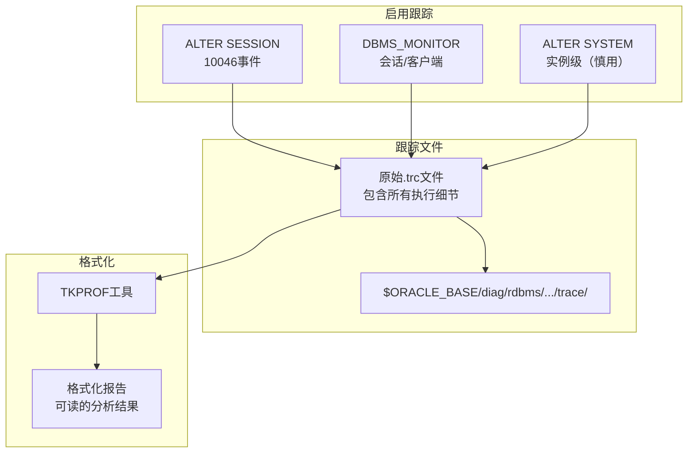
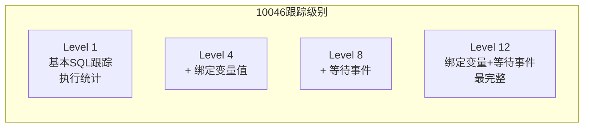
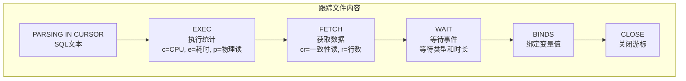

# Oracle SQL Trace与诊断

## 一、概述

### 1.1 一句话定义

Oracle SQL Trace是通过10046事件跟踪SQL执行全过程并生成详细诊断信息的工具，记录SQL的解析、执行、等待和绑定变量等细节，配合TKPROF格式化为可读报告。
它在SQL性能深度诊断中出现和使用，解决AWR/ASH无法提供的SQL级别执行细节分析问题。

### 1.2 为什么重要

- **不掌握的后果：** 无法深入分析SQL执行瓶颈，只能看到宏观统计，无法定位具体的I/O等待、锁等待和CPU消耗
- **掌握的价值：** 获得SQL执行的完整"录像"，精确到每个等待事件和每次物理读，是SQL调优的终极诊断工具

### 1.3 适用场景

| 场景 | 说明 |
|------|------|
| SQL深度调优 | 分析SQL执行的每个阶段耗时 |
| 等待事件分析 | 定位SQL具体在等什么 |
| 绑定变量检查 | 查看SQL实际使用的绑定值 |
| 执行计划验证 | 确认实际执行计划与预期一致 |
| 性能回归分析 | 对比不同时间的SQL执行细节 |

### 1.4 版本演进

| 版本 | 变化说明 |
|------|---------|
| 11gR2 | DBMS_MONITOR增强，支持跨会话跟踪 |
| 12cR1 | 统一跟踪架构，SQL Diag增强 |
| 12cR2 | 跟踪文件自动管理 |
| 19c | 跟踪诊断自动化增强 |
| 21c | 云环境跟踪集成 |

## 二、术语与概念

### 2.1 核心术语表

| 术语 | 含义 | 类比 |
|------|------|------|
| SQL Trace | SQL执行跟踪功能 | 录像机 |
| 10046事件 | SQL跟踪的内部事件号 | 录像机的型号 |
| Level | 跟踪级别（1/4/8/12） | 录像的清晰度 |
| TKPROF | 跟踪文件格式化工具 | 录像的播放器 |
| 绑定变量值 | 跟踪中记录的绑定变量实际值 | 录像中的对话内容 |
| 等待事件 | SQL执行中的等待记录 | 录像中的停顿 |
| 执行统计 | c/e/p/cr/cu/r等指标 | 录像的时间戳 |
| Trace文件 | 原始跟踪文件（.trc） | 原始录像带 |

### 2.2 跟踪架构



## 三、架构与原理

### 3.1 跟踪级别对比



### 3.2 工作原理

1. **启用跟踪：** 通过10046事件或DBMS_MONITOR开启跟踪
2. **记录执行：** Oracle记录SQL的每个执行步骤到trace文件
3. **收集细节：** 包括解析时间、执行时间、等待事件、绑定变量值
4. **关闭跟踪：** 停止记录，生成完整的trace文件
5. **格式化分析：** 使用TKPROF将原始trace格式化为可读报告
6. **诊断定位：** 从报告中找到性能瓶颈

**一句话总结：** SQL Trace是SQL诊断的"显微镜"——记录SQL执行的每一个动作，配合TKPROF可以精确分析性能瓶颈。

### 3.3 跟踪文件内容结构



## 四、功能详解

### 4.1 启用SQL Trace

#### 功能说明

在不同级别和范围启用SQL跟踪。

#### 操作步骤

```sql
-- 方法1：会话级跟踪（最常用）
ALTER SESSION SET SQL_TRACE = TRUE;
-- 执行需要跟踪的SQL
ALTER SESSION SET SQL_TRACE = FALSE;

-- 方法2：10046事件（推荐，可控制级别）
-- Level 1: 基本SQL跟踪
ALTER SESSION SET EVENTS '10046 trace name context forever, level 1';
-- 执行SQL
ALTER SESSION SET EVENTS '10046 trace name context off';

-- Level 4: + 绑定变量值
ALTER SESSION SET EVENTS '10046 trace name context forever, level 4';

-- Level 8: + 等待事件
ALTER SESSION SET EVENTS '10046 trace name context forever, level 8';

-- Level 12: 绑定变量 + 等待事件（最完整，推荐）
ALTER SESSION SET EVENTS '10046 trace name context forever, level 12';
-- 执行SQL
ALTER SESSION SET EVENTS '10046 trace name context off';

-- 方法3：DBMS_MONITOR（可跟踪其他会话）
-- 跟踪当前会话
EXEC DBMS_MONITOR.SESSION_TRACE_ENABLE(waits => TRUE, binds => TRUE);
-- 执行SQL
EXEC DBMS_MONITOR.SESSION_TRACE_DISABLE;

-- 跟踪指定会话
EXEC DBMS_MONITOR.SESSION_TRACE_ENABLE(
    session_id => 123,
    serial_num => 456,
    waits => TRUE,
    binds => TRUE
);

-- 方法4：跟踪客户端ID（跨会话）
EXEC DBMS_SESSION.SET_IDENTIFIER('my_client_id');
EXEC DBMS_MONITOR.CLIENT_ID_TRACE_ENABLE('my_client_id', TRUE, TRUE);
-- 执行SQL（多个会话使用相同client_id）
EXEC DBMS_MONITOR.CLIENT_ID_TRACE_DISABLE('my_client_id');
```

### 4.2 查找跟踪文件

```sql
-- 查看当前会话的跟踪文件路径
SELECT value FROM v$diag_info WHERE name = 'Default Trace File';

-- 查看跟踪目录
SELECT value FROM v$diag_info WHERE name = 'Diag Trace';

-- 查看实例名（跟踪文件命名规则）
SELECT instance_name FROM v$instance;

-- 跟踪文件命名规则：
-- {instance_name}_ora_{process_id}_{client_id}.trc
-- 例如：orcl_ora_12345_my_client.trc
```

### 4.3 TKPROF格式化

```bash
# 基本格式化
tkprof trace_file.trc output.txt

# 包含执行计划（需要连接数据库）
tkprof trace_file.trc output.txt explain=user/password@db

# 排除递归SQL
tkprof trace_file.trc output.txt sys=no

# 按解析时间排序
tkprof trace_file.trc output.txt sort=prsela

# 聚合相同SQL
tkprof trace_file.trc output.txt aggregate=yes

# 完整推荐命令
tkprof trace_file.trc output.txt \
    explain=user/password@db \
    sys=no \
    sort=prsela \
    aggregate=yes

# 常用排序选项
# prsela: 按解析时间排序
# exeela: 按执行时间排序
# fchela: 按获取时间排序
```

### 4.4 跟踪文件解读

```text
-- 典型跟踪文件内容解读
PARSING IN CURSOR #1 len=55 dep=0 uid=0 oct=3 lid=0 tim=1234567890
SELECT * FROM employees WHERE department_id = :dept_id
END OF STMT
PARSE #1:c=1000,e=950,p=0,cr=50,cu=0,mis=1,r=0,dep=0,og=1,plh=1234567890,tim=...
BINDS #1:
 Bind#0
  oacdty=02 mxl=22 mxlc=00 mal=00 scl=00 pre=00
  oacflg=03 fl2=1000000 frm=00 csi=00 siz=24 off=0
  kxsbbbfp=...  bln=22 avlr=3 acflg=...
  value=10
EXEC #1:c=0,e=150,p=0,cr=0,cu=0,mis=0,r=0,dep=0,og=1,plh=1234567890,tim=...
WAIT #1: nam='SQL*Net message to client' ela=5 ...
FETCH #1:c=500,e=450,p=2,cr=15,cu=0,mis=0,r=10,dep=0,og=1,tim=...

-- 关键指标解读
-- c: CPU时间（微秒）
-- e: 经过时间（微秒）
-- p: 物理读次数
-- cr: 一致性读（逻辑读）
-- cu: 当前读
-- mis: 是否硬解析（1=是，0=否）
-- r: 返回行数
-- dep: 递归深度（0=用户SQL）
-- og: 优化器模式（1=ALL_ROWS）
-- plh: 执行计划哈希值
```

### 4.5 其他诊断事件

| 事件 | 说明 | 用途 |
|------|------|------|
| 10046 | SQL执行跟踪 | SQL性能诊断 |
| 10053 | CBO决策跟踪 | 理解优化器为什么选择某个计划 |
| 10049 | 游标缓存统计 | 游标共享分析 |
| 10033 | 游标详细信息 | 游标定义分析 |
| 10200 | 一致性读回滚 | 回滚段分析 |

```sql
-- 10053：查看优化器决策过程
ALTER SESSION SET EVENTS '10053 trace name context forever, level 1';
SELECT * FROM employees WHERE department_id = 10;
ALTER SESSION SET EVENTS '10053 trace name context off';
-- 查看trace文件了解优化器为什么选择了某个执行计划
```

## 五、性能与调优

### 5.1 跟踪开销

| 级别 | CPU开销 | I/O开销 | 适用场景 |
|------|---------|---------|---------|
| Level 1 | 低（5-10%） | 低 | 基本SQL分析 |
| Level 4 | 中（10-20%） | 中 | 需要绑定变量值 |
| Level 8 | 中（10-20%） | 中 | 需要等待事件 |
| Level 12 | 高（20-40%） | 高 | 完整诊断 |

### 5.2 调优建议

| 场景 | 建议 | 原因 |
|------|------|------|
| 生产环境 | 使用会话级跟踪 | 避免全局开销 |
| 测试环境 | 可使用实例级跟踪 | 全面分析 |
| 长时间跟踪 | 注意trace文件大小 | 定期清理 |
| 性能敏感 | 使用Level 1 | 减少开销 |

## 六、DFX能力

### 6.1 动态性能视图

| 视图名 | 用途 | 关键字段 |
|--------|------|---------|
| V$DIAG_INFO | 诊断信息 | NAME, VALUE（跟踪文件路径） |
| V$SESSION | 会话信息 | SID, SERIAL#, SQL_TRACE |
| V$PROCESS | 进程信息 | SPID（OS进程号） |
| V$TRACE_FILES | 跟踪文件信息 | FILE_NAME, BYTES |

### 6.2 监控脚本

```sql
-- 查看当前正在跟踪的会话
SELECT s.sid, s.serial#, s.username, s.sql_trace
FROM v$session s
WHERE s.sql_trace = 'ENABLED';

-- 查看跟踪文件位置
SELECT value FROM v$diag_info WHERE name = 'Default Trace File';

-- 查看跟踪文件大小
SELECT value FROM v$diag_info WHERE name = 'Diag Trace';
-- 然后在OS层执行: ls -lh $trace_dir/*.trc
```

## 七、实战案例

### 7.1 案例背景

- **场景**：某系统Oracle 19c，一个SQL执行时间不稳定（1-30秒）
- **时间**：业务高峰期
- **现象**：AWR报告显示SQL平均执行时间3秒，但个别执行超过30秒

### 7.2 诊断过程

**步骤1：启用Level 12跟踪**

```sql
ALTER SESSION SET EVENTS '10046 trace name context forever, level 12';
-- 执行问题SQL多次
SELECT * FROM orders WHERE customer_id = :cid;
ALTER SESSION SET EVENTS '10046 trace name context off';
```

**步骤2：TKPROF格式化**

```bash
tkprof orcl_ora_12345.trc output.txt explain=system/password sys=no sort=exeela
```

**步骤3：分析跟踪结果**

```text
-- 正常执行
FETCH: c=1000, e=500, p=0, cr=50, r=100
-- 无等待事件

-- 异常执行
WAIT: nam='enq: TX - row lock contention' ela=28000000
FETCH: c=1000, e=28500000, p=0, cr=50, r=100
```
- → 发现：异常执行时有28秒的行锁等待
- → 判断：不是SQL本身慢，而是被其他事务阻塞

**步骤4：定位阻塞源**

```sql
-- 查看阻塞SQL
SELECT blocking_session, sql_id, event
FROM v$session
WHERE event = 'enq: TX - row lock contention';
```

### 7.3 解决结果

| 指标 | 解决前 | 解决后 |
|------|--------|--------|
| 执行时间 | 1-30秒不稳定 | 稳定0.5秒 |
| 等待事件 | TX行锁等待 | 无 |
| 根本原因 | 其他事务长时间持锁 | 优化持锁事务 |

### 7.4 复盘总结

- **根因：** SQL本身执行很快，但被其他事务的行锁阻塞
- **教训：** SQL Trace可以区分"SQL自身慢"和"被等待拖慢"，是精确诊断的关键工具

## 八、常见错误与排查

### 8.1 常见错误列表

| 问题 | 原因 | 解决方法 |
|------|------|---------|
| 跟踪文件过大 | 跟踪时间过长 | 缩短跟踪时间 |
| 找不到跟踪文件 | 路径不对 | 查询v$diag_info |
| TKPROF报错 | trace文件损坏 | 重新启用跟踪 |
| 系统级跟踪影响性能 | 所有会话都跟踪 | 使用会话级跟踪 |

### 8.2 排查步骤

1. **确认跟踪启用：** `SELECT sql_trace FROM v$session WHERE sid = ...`
2. **找到跟踪文件：** `SELECT value FROM v$diag_info WHERE name = 'Default Trace File'`
3. **检查文件大小：** `ls -lh trace_file.trc`
4. **TKPROF格式化：** `tkprof trace.trc output.txt sys=no`
5. **分析报告：** 关注WAIT和耗时最长的操作

## 九、最佳实践

### 9.1 官方推荐

- 使用会话级跟踪而非系统级
- Level 12提供最完整的诊断信息
- 使用DBMS_MONITOR支持跨会话跟踪
- 及时清理过期的trace文件

### 9.2 社区经验

- 先使用ASH定位问题SQL，再用SQL Trace深度分析
- 跟踪文件命名包含client_id便于管理
- 使用trcsess合并多个会话的跟踪
- 生产环境跟踪后立即关闭，避免性能影响

### 9.3 反模式

| 反模式 | 问题 | 正确做法 |
|--------|------|---------|
| 系统级跟踪 | 影响所有会话性能 | 使用会话级跟踪 |
| 忘记关闭跟踪 | trace文件暴增 | 跟踪完立即关闭 |
| 不格式化就分析 | 原始文件难读 | 使用TKPROF格式化 |
| Level 1信息不足 | 看不到等待和绑定 | 使用Level 12 |
| 生产环境长时间跟踪 | 性能影响大 | 短时间精确跟踪 |

## 十、命令与视图汇总

### 10.1 命令列表

| 命令 | 适用场景 | 说明 |
|------|---------|------|
| `ALTER SESSION SET EVENTS '10046 ...'` | 启用跟踪 | 10046事件 |
| `DBMS_MONITOR.SESSION_TRACE_ENABLE` | 启用跟踪 | PL/SQL接口 |
| `tkprof` | 格式化 | 跟踪文件格式化 |
| `trcsess` | 合并 | 合并多个跟踪文件 |
| `SELECT * FROM v$diag_info` | 查找文件 | 跟踪文件路径 |

### 10.2 视图列表

| 视图名 | 类型 | 用途 | 关键字段 |
|--------|------|------|---------|
| V$DIAG_INFO | 动态 | 诊断信息 | NAME, VALUE |
| V$SESSION | 动态 | 会话跟踪状态 | SQL_TRACE |
| V$PROCESS | 动态 | 进程信息 | SPID |
| V$TRACE | 动态 | 跟踪文件 | FILE_NAME |

## 十一、总结速查

### 11.1 黄金法则

1. **Level 12** - 绑定变量+等待事件，最完整
2. **会话级跟踪** - 避免全局性能影响
3. **TKPROF格式化** - 原始文件难以阅读
4. **及时关闭** - 跟踪完立即关闭
5. **结合ASH** - 先定位SQL再深度分析

### 11.2 一页纸检查清单

| 现象/场景 | 原因 | 处理方案 |
|-----------|------|----------|
| SQL执行时间不稳定 | 等待事件波动 | Level 12跟踪分析等待 |
| 绑定变量值未知 | 需要实际值分析 | Level 4+跟踪 |
| 执行计划不符预期 | 优化器决策问题 | 10053事件跟踪 |
| 跟踪文件找不到 | 路径不对 | 查询v$diag_info |
| 跟踪影响性能 | 级别太高或时间太长 | 降低级别或缩短时间 |

### 11.3 关键数字

| 指标 | 正常范围 | 告警阈值 | 说明 |
|------|---------|---------|------|
| 跟踪开销 | < 20% CPU | > 40% | Level 12开销 |
| 跟踪文件大小 | < 1GB | > 5GB | 单文件限制 |
| 跟踪时间 | < 5分钟 | > 30分钟 | 生产环境 |

## 附录

### A. 官方参考

- [Oracle Database Performance Tuning Guide - SQL Trace](https://docs.oracle.com/en/database/oracle/oracle-database/19c/tgdba/)
- [Oracle Database Reference - Diagnostic Events](https://docs.oracle.com/en/database/oracle/oracle-database/19c/refrn/)
- MOS Note: 39817.1 - "Introducing Oracle SQL Trace and TKPROF"

### B. 数据字典

| 对象名 | 类型 | 说明 |
|--------|------|------|
| V$DIAG_INFO | 动态视图 | 诊断信息 |
| V$SESSION | 动态视图 | 会话跟踪状态 |
| V$PROCESS | 动态视图 | 进程信息 |

### C. 修订记录

| 日期 | 版本 | 修改内容 | 修改人 |
|------|------|---------|--------|
| 2026-07-02 | v1.0 | 初始版本 | YashanDB知识库生成器 |
| 2026-07-02 | v1.1 | 补充完整模板章节 | YashanDB知识库生成器 |
