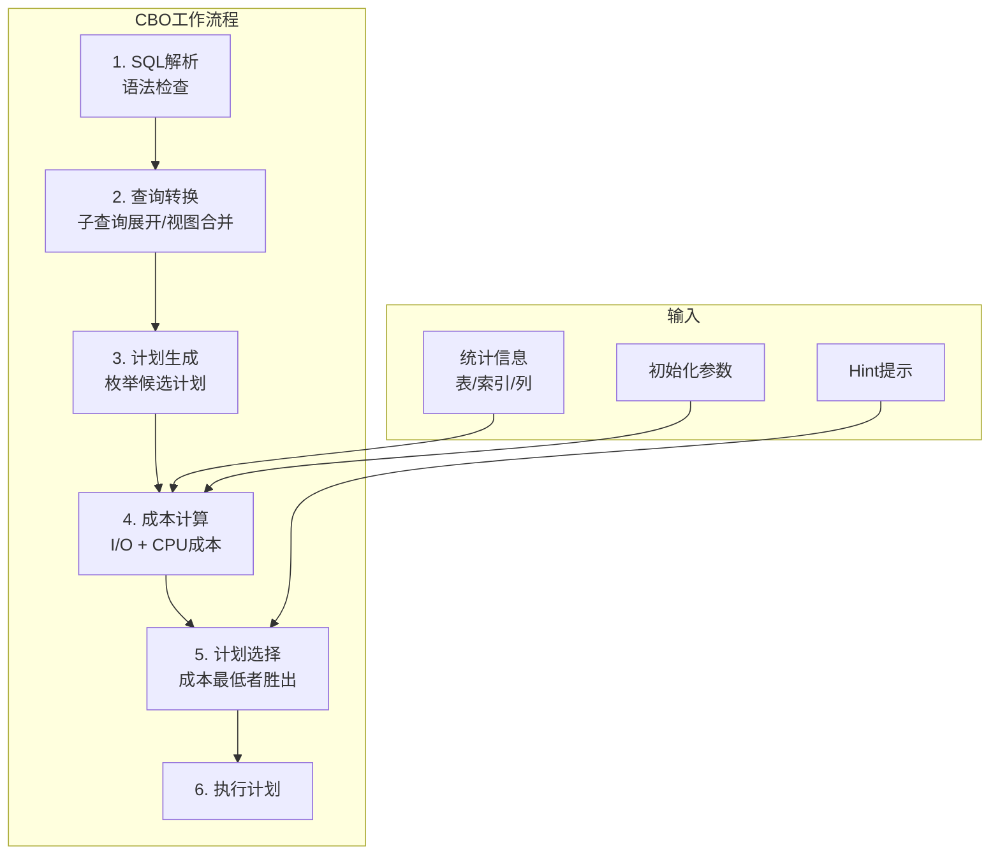
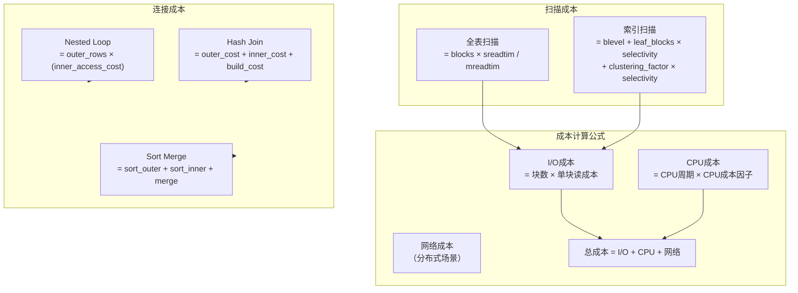
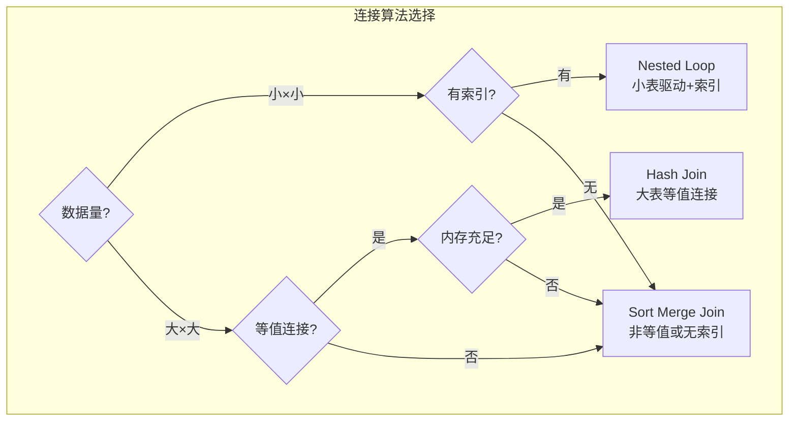

# Oracle CBO优化器原理

## 一、概述

### 1.1 一句话定义

Oracle CBO（Cost-Based Optimizer，基于成本的优化器）是Oracle数据库的SQL优化引擎，通过收集表和索引的统计信息，计算不同执行计划的成本（I/O + CPU），选择成本最低的执行计划。
它在SQL执行流程中出现和使用，解决"如何执行SQL最高效"的核心问题，直接决定查询性能。

### 1.2 为什么重要

- **不掌握的后果：** 无法理解优化器为什么选择某个执行计划，无法有效优化SQL，面对执行计划错误束手无策
- **掌握的价值：** 理解CBO工作原理，能够预测优化器行为，写出高效SQL，有效诊断执行计划问题

### 1.3 适用场景

| 场景 | 说明 |
|------|------|
| SQL调优 | 理解为什么优化器选择了差的执行计划 |
| 统计信息管理 | 理解统计信息如何影响优化器决策 |
| Hint使用 | 知道何时以及如何引导优化器 |
| 执行计划分析 | 解读执行计划中各步骤的成本 |
| 自适应优化 | 利用12c+的自适应执行计划特性 |

### 1.4 版本演进

| 版本 | 变化说明 |
|------|---------|
| 11gR2 | CBO成熟稳定，SQL Plan Management引入 |
| 12cR1 | 自适应计划（Adaptive Plans），运行时调整 |
| 12cR2 | 自适应统计信息，自动列组 |
| 19c | 自动索引与CBO深度集成 |
| 21c | 自动SQL优化增强，机器学习辅助 |

## 二、术语与概念

### 2.1 核心术语表

| 术语 | 含义 | 类比 |
|------|------|------|
| CBO | 基于成本的优化器 | 导航软件，选择最优路线 |
| 统计信息 | 表/索引的数据分布描述 | 地图上的路况信息 |
| 执行计划 | SQL的具体执行步骤 | 导航给出的路线方案 |
| 成本 | I/O + CPU的加权值 | 路线的预计时间和油耗 |
| 基数 | 操作返回的行数估计 | 预计路上有多少车 |
| 选择性 | 过滤条件筛选掉的比例 | 路上被堵的比例 |
| 查询转换 | 优化器改写SQL以找到更好的计划 | 导航重新规划路线 |
| 自适应计划 | 运行时根据实际数据调整计划 | 导航根据实时路况改路 |

### 2.2 CBO工作流程



## 三、架构与原理

### 3.1 成本计算模型



### 3.2 工作原理

1. **SQL解析：** 检查SQL语法，生成解析树
2. **查询转换：** 子查询展开、视图合并、谓词推入等改写
3. **计划枚举：** 生成所有可能的执行计划（连接顺序、连接方式、访问路径）
4. **成本计算：** 基于统计信息计算每个计划的I/O和CPU成本
5. **计划选择：** 选择成本最低的执行计划
6. **执行：** 按照选定的执行计划执行SQL

**一句话总结：** CBO的核心是"统计信息→成本计算→最优计划"——统计信息越准确，成本计算越精确，执行计划越优。

### 3.3 连接算法选择



## 四、功能详解

### 4.1 统计信息与CBO

#### 功能说明

统计信息是CBO决策的基础，包括表统计、索引统计和列统计。

#### 操作步骤

```sql
-- 查看表统计信息
SELECT table_name, num_rows, blocks, avg_row_len, last_analyzed
FROM dba_tables
WHERE owner = 'HR';

-- 查看索引统计信息
SELECT index_name, blevel, leaf_blocks, distinct_keys,
       clustering_factor, num_rows, last_analyzed
FROM dba_indexes
WHERE owner = 'HR';

-- 查看列统计信息（直方图）
SELECT column_name, num_distinct, density, histogram, num_buckets
FROM dba_tab_col_statistics
WHERE owner = 'HR' AND table_name = 'EMPLOYEES';

-- 收集统计信息
EXEC DBMS_STATS.GATHER_TABLE_STATS(
    ownname => 'HR',
    tabname => 'EMPLOYEES',
    cascade => TRUE,        -- 同时收集索引统计
    method_opt => 'FOR ALL COLUMNS SIZE AUTO',  -- 自动直方图
    estimate_percent => DBMS_STATS.AUTO_SAMPLE_SIZE  -- 自动采样率
);

-- 查看统计信息是否过旧
SELECT table_name, last_analyzed,
       ROUND((SYSDATE - last_analyzed), 0) AS days_old
FROM dba_tables
WHERE owner = 'HR'
ORDER BY last_analyzed;
```

### 4.2 查询转换

```sql
-- 查看查询转换参数
SHOW PARAMETER query_rewrite;
SHOW PARAMETER optimizer_mode;

-- 子查询展开（Subquery Unnesting）
-- 优化器将子查询转换为连接
-- SELECT * FROM employees
-- WHERE department_id IN (SELECT department_id FROM departments WHERE location_id = 1700);
-- 转换为：
-- SELECT e.* FROM employees e JOIN departments d ON e.department_id = d.department_id
-- WHERE d.location_id = 1700;

-- 视图合并（View Merging）
-- 优化器将视图定义合并到主查询中

-- 谓词推入（Predicate Pushing）
-- 将过滤条件下推到视图内部

-- 使用10053事件查看优化器决策
ALTER SESSION SET EVENTS '10053 trace name context forever, level 1';
SELECT * FROM employees WHERE department_id = 10;
ALTER SESSION SET EVENTS '10053 trace name context off';
-- 查看trace文件了解优化器为什么选择某个计划
```

### 4.3 执行计划分析

```sql
-- 查看估计的执行计划
EXPLAIN PLAN FOR
SELECT e.last_name, d.department_name
FROM employees e JOIN departments d ON e.department_id = d.department_id
WHERE e.salary > 5000;

SELECT * FROM TABLE(DBMS_XPLAN.DISPLAY(format => 'ALL'));

-- 查看实际执行计划（带统计信息）
SELECT * FROM TABLE(DBMS_XPLAN.DISPLAY_CURSOR(
    sql_id => 'abc123def',
    format => 'ALLSTATS LAST'
));

-- 关键指标解读
-- Cost: 优化器估计的总成本
-- Cardinality (Rows): 估计返回行数
-- Bytes: 估计数据量
-- Access: 数据访问方式（FULL/INDEX）
-- Predicates: 过滤条件
```

### 4.4 自适应优化（12c+）

```sql
-- 查看自适应优化参数
SHOW PARAMETER optimizer_adaptive;

-- 自适应计划（Adaptive Plans）
-- 优化器在执行过程中根据实际行数调整连接方式
-- 例如：开始用Nested Loop，发现数据量大后切换到Hash Join

-- 查看使用自适应计划的SQL
SELECT sql_id, sql_text, is_adaptive_plans_used
FROM v$sql
WHERE is_adaptive_plans_used = 'Y'
AND rownum <= 10;

-- 自适应统计信息
-- 自动发现和收集缺失的统计信息
ALTER SYSTEM SET optimizer_adaptive_statistics = TRUE;

-- 查看自适应统计报告
SELECT report FROM dba_stats_advisor_reports
WHERE task_name = 'AUTO_STATS_ADVISOR_TASK'
AND rownum <= 1;
```

### 4.5 优化器模式

```sql
-- 查看当前模式
SHOW PARAMETER optimizer_mode;

-- ALL_ROWS（默认）：优化整体吞吐量
ALTER SYSTEM SET optimizer_mode = ALL_ROWS;

-- FIRST_ROWS_N：优化前N行响应时间
ALTER SESSION SET optimizer_mode = FIRST_ROWS_10;

-- 使用Hint覆盖
SELECT /*+ ALL_ROWS */ * FROM employees ORDER BY hire_date;
SELECT /*+ FIRST_ROWS */ * FROM employees WHERE employee_id = 100;
```

## 五、性能与调优

### 5.1 统计信息管理

| 操作 | 建议 | 原因 |
|------|------|------|
| 收集频率 | 数据变化>10%时收集 | 统计信息过旧导致计划错误 |
| 采样率 | AUTO（自动） | Oracle自动计算最优采样率 |
| 直方图 | AUTO（自动） | 自动判断是否需要直方图 |
| 增量统计 | 分区表使用增量 | 减少大表统计收集时间 |

### 5.2 常见问题与调优

| 场景 | 原因 | 解决方案 |
|------|------|---------|
| 全表扫描而非索引 | 统计信息过旧或选择性低 | 收集统计信息或添加Hint |
| 错误的连接顺序 | 基数估计不准 | 收集列统计或添加Hint |
| 不必要的查询转换 | 转换后计划更差 | 使用NO_UNNEST等Hint禁止 |
| 自适应计划未触发 | 统计信息太准确 | 正常现象，不需要干预 |

## 六、DFX能力

### 6.1 动态性能视图

| 视图名 | 用途 | 关键字段 |
|--------|------|---------|
| V$SQL_PLAN | SQL执行计划 | SQL_ID, OPERATION, OPTIONS, COST |
| V$SQL_PLAN_STATISTICS_ALL | 实际执行统计 | LAST_STARTS, LAST_OUTPUT_ROWS |
| V$SQL_OPTIMIZER_ENV | 优化器环境 | OPTIMIZER_MODE |
| DBA_TAB_STATISTICS | 表统计信息 | NUM_ROWS, BLOCKS, LAST_ANALYZED |
| DBA_TAB_COL_STATISTICS | 列统计信息 | NUM_DISTINCT, HISTOGRAM |

### 6.2 诊断工具

```sql
-- 10053事件：跟踪优化器决策过程
ALTER SESSION SET EVENTS '10053 trace name context forever, level 1';
-- 执行SQL
ALTER SESSION SET EVENTS '10053 trace name context off';

-- 10046事件：跟踪SQL执行
ALTER SESSION SET EVENTS '10046 trace name context forever, level 12';
-- 执行SQL
ALTER SESSION SET EVENTS '10046 trace name context off';

-- SQL Tuning Advisor
DECLARE
    v_task VARCHAR2(64);
BEGIN
    v_task := DBMS_SQLTUNE.CREATE_TUNING_TASK(
        sql_id => 'abc123def',
        scope => 'COMPREHENSIVE',
        time_limit => 300
    );
    DBMS_SQLTUNE.EXECUTE_TUNING_TASK(v_task);
END;
/
SELECT DBMS_SQLTUNE.REPORT_TUNING_TASK('task_name') FROM dual;
```

## 七、实战案例

### 7.1 案例背景

- **场景**：某系统Oracle 19c，一个SQL执行计划突然变差
- **时间**：统计信息收集后
- **现象**：原本走索引的SQL变为全表扫描

### 7.2 诊断过程

**步骤1：查看执行计划**

```sql
SELECT * FROM TABLE(DBMS_XPLAN.DISPLAY_CURSOR(sql_id => 'abc123def'));
```
- → 发现：TABLE ACCESS FULL，Cost = 50000
- → 判断：优化器选择了全表扫描

**步骤2：检查统计信息**

```sql
SELECT table_name, num_rows, last_analyzed
FROM dba_tables WHERE table_name = 'ORDERS';
```
- → 发现：last_analyzed = 今天，num_rows从100万变为1000万
- → 判断：批量数据加载后统计信息更新，优化器认为全表扫描更优

**步骤3：分析原因**

```sql
-- 查看列选择性
SELECT column_name, num_distinct, density, histogram
FROM dba_tab_col_statistics
WHERE table_name = 'ORDERS' AND column_name = 'ORDER_DATE';
```
- → 发现：ORDER_DATE的density变为0.5（选择性很差）
- → 判断：数据分布变化导致索引不再有效

**步骤4：解决方案**

```sql
-- 方案1：添加更合适的索引
CREATE INDEX idx_orders_cust_date ON orders(customer_id, order_date);

-- 方案2：使用Hint临时引导
SELECT /*+ INDEX(orders idx_orders_date) */ *
FROM orders WHERE order_date = SYSDATE;

-- 方案3：使用SQL Plan Baseline锁定好计划
```

### 7.3 解决结果

| 指标 | 解决前 | 解决后 |
|------|--------|--------|
| 执行计划 | TABLE ACCESS FULL | INDEX RANGE SCAN |
| 执行时间 | 30秒 | 0.1秒 |
| 逻辑读 | 50,000 | 100 |

### 7.4 复盘总结

- **根因：** 批量数据加载后统计信息变化，优化器重新选择了执行计划
- **教训：** 大批量数据操作后需要关注统计信息变化，必要时使用SQL Plan Baseline锁定计划

## 八、常见错误与排查

### 8.1 常见错误列表

| 问题 | 原因 | 解决方法 |
|------|------|---------|
| 执行计划突然变差 | 统计信息变化 | 检查统计信息，使用Baseline |
| 全表扫描而非索引 | 选择性低或统计过旧 | 收集统计信息或添加索引 |
| 错误的连接顺序 | 基数估计不准 | 收集列统计，使用Hint |
| 硬解析过多 | 未使用绑定变量 | 使用绑定变量或cursor_sharing |
| 自适应计划未生效 | 参数未启用 | 检查optimizer_adaptive_plans |

### 8.2 排查步骤

1. **查看执行计划：** `DBMS_XPLAN.DISPLAY_CURSOR`
2. **检查统计信息：** `DBA_TAB_STATISTICS`
3. **分析成本：** 10053事件跟踪
4. **对比历史：** `DBA_HIST_SQLSTAT`
5. **使用Advisor：** SQL Tuning Advisor

## 九、最佳实践

### 9.1 官方推荐

- 定期收集统计信息，数据变化>10%时收集
- 使用绑定变量避免硬解析
- 利用自适应计划让优化器自动调整
- 使用SQL Plan Baseline锁定稳定的好计划

### 9.2 社区经验

- 理解CBO成本计算有助于预测执行计划
- 10053事件是理解优化器决策的最佳工具
- 统计信息是CBO的"眼睛"，信息不准则计划错误
- Hint是最后手段，优先优化统计信息和SQL

### 9.3 反模式

| 反模式 | 问题 | 正确做法 |
|--------|------|---------|
| 不收集统计信息 | 优化器"盲人摸象" | 定期收集统计信息 |
| 大量使用Hint | 维护困难，数据变化后失效 | 优先优化统计信息 |
| 不使用绑定变量 | 硬解析浪费CPU | 使用绑定变量 |
| 忽略统计信息变化 | 执行计划突然变差 | 监控统计信息更新 |
| 禁用自适应优化 | 错失自动调优机会 | 保持自适应特性开启 |

## 十、命令与视图汇总

### 10.1 命令列表

| 命令 | 适用场景 | 说明 |
|------|---------|------|
| `EXPLAIN PLAN FOR` | 查看执行计划 | 估计的执行计划 |
| `DBMS_XPLAN.DISPLAY` | 显示执行计划 | 格式化输出 |
| `DBMS_STATS.GATHER_TABLE_STATS` | 收集统计 | 表统计信息 |
| `10053事件` | 优化器跟踪 | 理解决策过程 |
| `DBMS_SQLTUNE` | SQL调优 | 自动调优建议 |

### 10.2 视图列表

| 视图名 | 类型 | 用途 | 关键字段 |
|--------|------|------|---------|
| V$SQL_PLAN | 动态 | 执行计划 | OPERATION, COST, CARDINALITY |
| DBA_TAB_STATISTICS | 数据字典 | 表统计 | NUM_ROWS, BLOCKS |
| DBA_TAB_COL_STATISTICS | 数据字典 | 列统计 | NUM_DISTINCT, HISTOGRAM |
| DBA_INDEXES | 数据字典 | 索引统计 | BLEVEL, LEAF_BLOCKS |
| DBA_HIST_SQLSTAT | AWR | 历史统计 | ELAPSED_TIME_TOTAL |

## 十一、总结速查

### 11.1 黄金法则

1. **统计信息准确** - CBO决策的基础
2. **绑定变量** - 避免硬解析，共享游标
3. **理解成本** - 能预测优化器行为
4. **自适应优化** - 利用12c+新特性
5. **Baseline锁定** - 关键SQL锁定好计划

### 11.2 一页纸检查清单

| 现象/场景 | 原因 | 处理方案 |
|-----------|------|----------|
| 执行计划突然变差 | 统计信息变化 | 检查统计，使用Baseline |
| 全表扫描 | 选择性低或统计过旧 | 收集统计或添加索引 |
| 硬解析多 | 未使用绑定变量 | 使用绑定变量 |
| 连接顺序错误 | 基数估计不准 | 收集列统计 |
| 优化器选错索引 | 统计信息不准 | 重新收集统计 |

### 11.3 关键数字

| 指标 | 正常范围 | 告警阈值 | 说明 |
|------|---------|---------|------|
| 统计信息时效 | < 7天 | > 30天 | 上次收集距今 |
| 硬解析比例 | < 1% | > 5% | parse count (hard) |
| 自适应计划使用率 | > 0 | 0 | 12c+应启用 |

## 附录

### A. 官方参考

- [Oracle Database Performance Tuning Guide - Optimizer](https://docs.oracle.com/en/database/oracle/oracle-database/19c/tgdba/)
- [Oracle Database SQL Tuning Guide](https://docs.oracle.com/en/database/oracle/oracle-database/19c/tgsql/)
- MOS Note: 2711908.1 - "CBO Best Practices"

### B. 数据字典

| 对象名 | 类型 | 说明 |
|--------|------|------|
| DBA_TAB_STATISTICS | 数据字典 | 表统计信息 |
| DBA_TAB_COL_STATISTICS | 数据字典 | 列统计信息 |
| DBA_INDEXES | 数据字典 | 索引统计信息 |
| V$SQL_PLAN | 动态视图 | 执行计划 |
| DBA_HIST_SQLSTAT | AWR | 历史SQL统计 |

### C. 修订记录

| 日期 | 版本 | 修改内容 | 修改人 |
|------|------|---------|--------|
| 2026-07-02 | v1.0 | 初始版本 | YashanDB知识库生成器 |
| 2026-07-02 | v1.1 | 补充完整模板章节 | YashanDB知识库生成器 |
