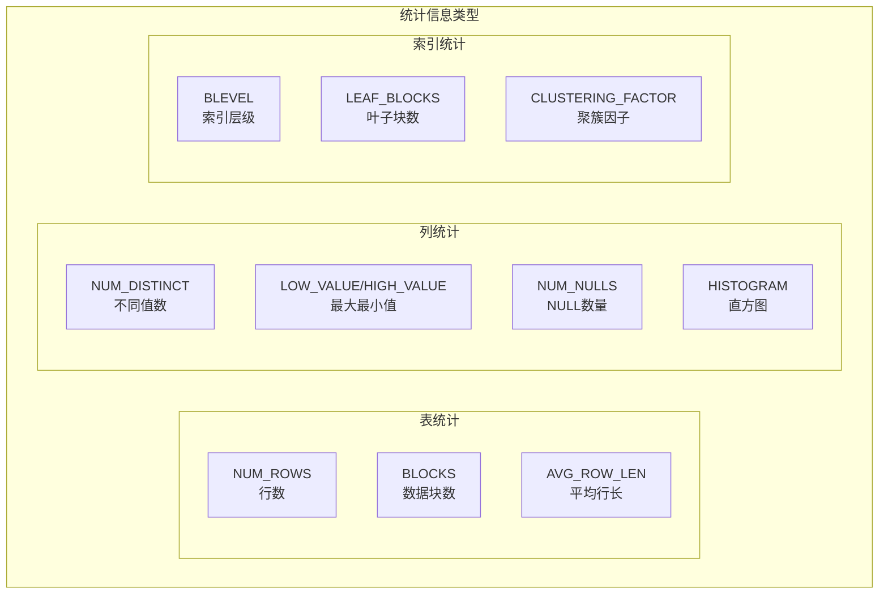
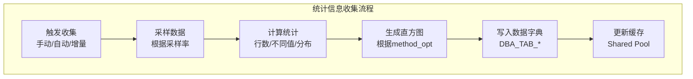
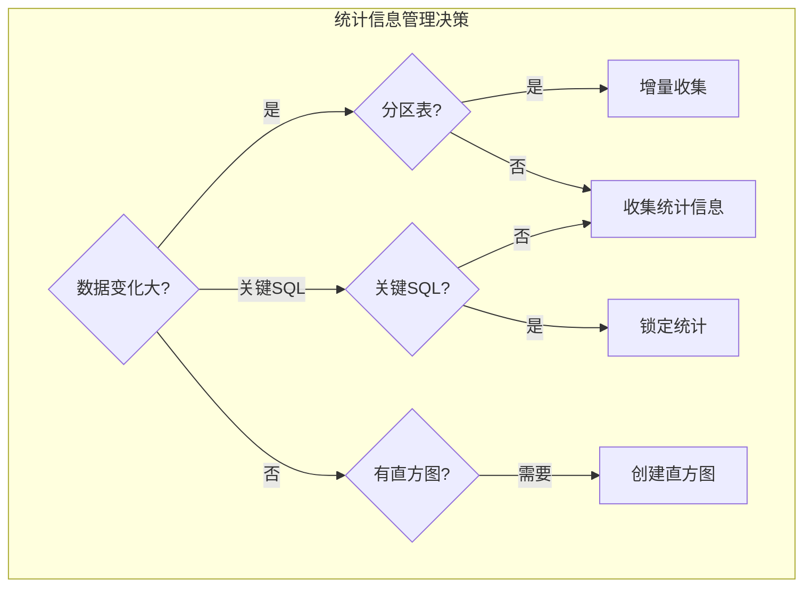

# Oracle统计信息管理

## 一、概述

### 1.1 一句话定义

Oracle统计信息是描述表、索引、列数据分布的元数据，是CBO优化器计算执行计划成本的基础依据。统计信息管理是通过收集、维护、恢复统计信息，确保优化器做出正确决策的过程。
它在SQL优化中出现和使用，解决优化器因统计信息不准而选择错误执行计划的问题。

### 1.2 为什么重要

- **不掌握的后果：** 优化器"盲人摸象"，选择全表扫描而非索引扫描，SQL性能下降10-1000倍
- **掌握的价值：** 确保优化器基于准确的数据分布信息做出正确决策，是SQL性能优化的基础

### 1.3 适用场景

| 场景 | 说明 |
|------|------|
| SQL性能突然变差 | 统计信息过旧或不准 |
| 大批量数据加载后 | 数据分布变化 |
| 升级前后 | 优化器行为变化 |
| 执行计划不稳定 | 统计信息波动 |
| 新建表/索引 | 初始统计信息 |

### 1.4 版本演进

| 版本 | 变化说明 |
|------|---------|
| 11gR2 | 增量统计信息，自动采样优化 |
| 12cR1 | 自适应统计信息，自动列组 |
| 12cR2 | 统计信息偏好（Preferences）增强 |
| 19c | 实时统计信息（Real-time Statistics） |
| 21c | 自动统计信息顾问 |

## 二、术语与概念

### 2.1 核心术语表

| 术语 | 含义 | 类比 |
|------|------|------|
| 表统计 | 行数、块数、平均行长 | 仓库的货物清单 |
| 列统计 | 不同值数、最大最小值 | 货物的规格信息 |
| 直方图 | 列值分布的详细描述 | 货物的尺寸分布图 |
| 索引统计 | 索引层级、叶子块数、聚簇因子 | 目录的详细程度 |
| 采样率 | 收集统计信息时扫描的比例 | 抽样调查的比例 |
| 陈旧统计 | 数据变化后未更新的统计 | 过期的货物清单 |
| 锁定统计 | 防止自动收集覆盖 | 冻结清单 |
| 增量统计 | 只收集变化分区的统计 | 只盘点新到的货物 |

### 2.2 统计信息体系



## 三、架构与原理

### 3.1 统计信息收集流程



### 3.2 工作原理

1. **采样：** 根据采样率扫描表数据（或全表扫描）
2. **计算：** 计算行数、不同值数、最大最小值等
3. **直方图：** 根据method_opt决定是否生成直方图
4. **存储：** 将统计信息写入数据字典（DBA_TAB_*视图）
5. **缓存：** 优化器从数据字典读取统计信息用于成本计算

**一句话总结：** 统计信息是优化器的"眼睛"——信息越准确，执行计划选择越正确。

### 3.3 统计信息决策流程



## 四、功能详解

### 4.1 基本统计信息收集

#### 功能说明

使用DBMS_STATS包收集表、索引、Schema和数据库级统计信息。

#### 操作步骤

```sql
-- 步骤1：表级统计信息收集
EXEC DBMS_STATS.GATHER_TABLE_STATS(
    ownname          => 'HR',
    tabname          => 'EMPLOYEES',
    estimate_percent => DBMS_STATS.AUTO_SAMPLE_SIZE,  -- 自动采样（推荐）
    method_opt       => 'FOR ALL COLUMNS SIZE AUTO',  -- 自动直方图
    cascade          => TRUE,                          -- 同时收集索引统计
    degree           => 4                              -- 并行度
);

-- 步骤2：Schema级统计信息收集
EXEC DBMS_STATS.GATHER_SCHEMA_STATS(
    ownname          => 'HR',
    estimate_percent => DBMS_STATS.AUTO_SAMPLE_SIZE,
    method_opt       => 'FOR ALL COLUMNS SIZE AUTO'
);

-- 步骤3：数据库级统计信息收集
EXEC DBMS_STATS.GATHER_DATABASE_STATS(
    estimate_percent => DBMS_STATS.AUTO_SAMPLE_SIZE,
    method_opt       => 'FOR ALL COLUMNS SIZE AUTO'
);

-- 步骤4：查看收集结果
SELECT table_name, num_rows, blocks, avg_row_len, last_analyzed
FROM dba_tables
WHERE owner = 'HR' AND table_name = 'EMPLOYEES';
```

### 4.2 直方图管理

```sql
-- 查看现有直方图
SELECT column_name, histogram, num_buckets, num_distinct
FROM dba_tab_col_statistics
WHERE owner = 'HR' AND table_name = 'EMPLOYEES';

-- 直方图类型说明
-- NONE: 无直方图
-- FREQUENCY: 频率直方图（值少，每个值一个桶）
-- HEIGHT BALANCED: 高度平衡（值多，每个桶行数相近）
-- HYBRID: 混合直方图（12c+，自动选择最佳方式）
-- TOP-FREQUENCY: 高频值直方图（12c+）

-- 为特定列创建直方图
EXEC DBMS_STATS.GATHER_TABLE_STATS(
    ownname => 'HR',
    tabname => 'EMPLOYEES',
    method_opt => 'FOR COLUMNS SIZE 254 department_id'
);

-- 删除直方图
EXEC DBMS_STATS.GATHER_TABLE_STATS(
    ownname => 'HR',
    tabname => 'EMPLOYEES',
    method_opt => 'FOR COLUMNS department_id SIZE 1'
);

-- 自动直方图策略
-- SIZE AUTO: Oracle自动判断哪些列需要直方图
-- SIZE REPEAT: 只对已有直方图的列重新收集
-- SIZE SKEWONLY: 只对数据倾斜的列创建直方图
```

### 4.3 统计信息锁定与解锁

```sql
-- 锁定统计信息（防止自动收集覆盖）
EXEC DBMS_STATS.LOCK_TABLE_STATS('HR', 'EMPLOYEES');

-- 锁定Schema统计
EXEC DBMS_STATS.LOCK_SCHEMA_STATS('HR');

-- 解锁
EXEC DBMS_STATS.UNLOCK_TABLE_STATS('HR', 'EMPLOYEES');

-- 查看锁定状态
SELECT owner, table_name, stattype_locked
FROM dba_tab_statistics
WHERE stattype_locked IS NOT NULL;

-- 使用场景：
-- 1. 关键SQL的执行计划稳定，不希望统计信息变化影响
-- 2. 测试环境中保持与生产一致的统计信息
-- 3. 批量加载后暂时不收集统计
```

### 4.4 统计信息恢复

```sql
-- 查看统计信息历史
SELECT table_name, stats_update_time, flags
FROM dba_tab_stats_history
WHERE owner = 'HR'
ORDER BY stats_update_time DESC;

-- 恢复到历史版本
EXEC DBMS_STATS.RESTORE_TABLE_STATS(
    ownname         => 'HR',
    tabname         => 'EMPLOYEES',
    as_of_timestamp => SYSTIMESTAMP - 1,  -- 恢复到1天前
    force           => TRUE
);

-- 恢复Schema统计
EXEC DBMS_STATS.RESTORE_SCHEMA_STATS(
    ownname         => 'HR',
    as_of_timestamp => SYSTIMESTAMP - 7
);

-- 查看保留策略
SELECT DBMS_STATS.GET_STATS_HISTORY_RETENTION FROM dual;
-- 默认保留31天

-- 修改保留策略
EXEC DBMS_STATS.ALTER_STATS_HISTORY_RETENTION(60);  -- 保留60天
```

### 4.5 自动统计信息收集

```sql
-- 查看自动任务状态
SELECT client_name, status, attributes
FROM dba_autotask_client
WHERE client_name = 'auto optimizer stats collection';

-- 查看维护窗口
SELECT window_name, repeat_interval, duration, enabled
FROM dba_scheduler_windows
WHERE window_name LIKE 'MONDAY_WINDOW'
   OR window_name LIKE 'TUESDAY_WINDOW';

-- 默认维护窗口：
-- 周一-周五：22:00 - 次日02:00
-- 周六-周日：06:00 - 次日02:00

-- 禁用自动收集
EXEC DBMS_AUTO_TASK_ADMIN.DISABLE(
    client_name => 'auto optimizer stats collection',
    operation   => NULL,
    window_name => NULL
);

-- 启用自动收集
EXEC DBMS_AUTO_TASK_ADMIN.ENABLE(
    client_name => 'auto optimizer stats collection',
    operation   => NULL,
    window_name => NULL
);

-- 查看自动收集历史
SELECT window_name, window_start_time, window_duration,
       jobs_created, jobs_completed
FROM dba_autotask_job_history
WHERE client_name = 'auto optimizer stats collection'
ORDER BY window_start_time DESC;
```

### 4.6 增量统计信息（分区表）

```sql
-- 启用增量统计（11g+）
EXEC DBMS_STATS.SET_TABLE_PREFS('HR', 'SALES', 'INCREMENTAL', 'TRUE');

-- 查看偏好设置
SELECT DBMS_STATS.GET_PREFS('INCREMENTAL', 'HR', 'SALES') FROM dual;

-- 增量统计工作原理：
-- 1. 只收集变化分区的统计
-- 2. 全局统计从分区统计聚合得出
-- 3. 大幅减少大表统计收集时间

-- 收集分区表统计
EXEC DBMS_STATS.GATHER_TABLE_STATS(
    ownname => 'HR',
    tabname => 'SALES',
    estimate_percent => DBMS_STATS.AUTO_SAMPLE_SIZE
);

-- 只收集特定分区
EXEC DBMS_STATS.GATHER_TABLE_STATS(
    ownname => 'HR',
    tabname => 'SALES',
    partname => 'SALES_2026_Q1'
);
```

## 五、性能与调优

### 5.1 收集性能

| 参数 | 建议 | 原因 |
|------|------|------|
| estimate_percent | AUTO | Oracle自动计算最优采样率 |
| degree | 并行度 | 大表使用并行加速 |
| method_opt | AUTO | 自动判断直方图需求 |
| cascade | TRUE | 同时收集索引统计 |

### 5.2 性能基线

| 指标 | 正常范围 | 告警阈值 | 说明 |
|------|---------|---------|------|
| 统计信息时效 | < 7天 | > 30天 | 上次收集距今 |
| 陈旧统计比例 | < 10% | > 30% | 需要收集的表占比 |
| 收集时间 | < 维护窗口 | > 4小时 | 单次收集耗时 |

## 六、DFX能力

### 6.1 动态性能视图

| 视图名 | 用途 | 关键字段 |
|--------|------|---------|
| DBA_TAB_STATISTICS | 表统计 | NUM_ROWS, LAST_ANALYZED, STALE_STATS |
| DBA_TAB_COL_STATISTICS | 列统计 | NUM_DISTINCT, HISTOGRAM |
| DBA_IND_STATISTICS | 索引统计 | BLEVEL, LEAF_BLOCKS |
| DBA_TAB_STATS_HISTORY | 统计历史 | STATS_UPDATE_TIME |
| DBA_AUTOTASK_JOB_HISTORY | 自动任务历史 | WINDOW_NAME, JOBS_COMPLETED |

### 6.2 监控脚本

```sql
-- 检查陈旧统计
SELECT owner, table_name, num_rows, last_analyzed, stale_stats
FROM dba_tab_statistics
WHERE stale_stats = 'YES'
AND owner NOT IN ('SYS', 'SYSTEM')
ORDER BY last_analyzed;

-- 检查统计信息时效
SELECT owner, table_name, num_rows, last_analyzed,
       ROUND(SYSDATE - last_analyzed) AS days_old
FROM dba_tab_statistics
WHERE owner NOT IN ('SYS', 'SYSTEM')
ORDER BY last_analyzed;
```

## 七、实战案例

### 7.1 案例背景

- **场景**：某系统Oracle 19c，批量数据加载后SQL性能突然变差
- **时间**：月末批量加载后
- **现象**：关键SQL执行时间从1秒变为60秒

### 7.2 诊断过程

**步骤1：检查统计信息**

```sql
SELECT table_name, num_rows, last_analyzed, stale_stats
FROM dba_tab_statistics
WHERE table_name IN ('ORDERS', 'CUSTOMERS');
```
- → 发现：ORDERS表last_analyzed是1周前，stale_stats=YES
- → 判断：统计信息陈旧

**步骤2：检查数据变化**

```sql
SELECT COUNT(*) FROM orders;
-- 实际行数：1000万
-- 统计信息中的行数：100万
```
- → 发现：实际数据是统计信息的10倍
- → 判断：批量加载后未收集统计

**步骤3：收集统计信息**

```sql
EXEC DBMS_STATS.GATHER_TABLE_STATS(
    ownname => 'SALES',
    tabname => 'ORDERS',
    estimate_percent => DBMS_STATS.AUTO_SAMPLE_SIZE,
    method_opt => 'FOR ALL COLUMNS SIZE AUTO',
    cascade => TRUE
);
```

**步骤4：验证效果**

```sql
-- 重新执行SQL
SELECT * FROM TABLE(DBMS_XPLAN.DISPLAY_CURSOR(sql_id => 'abc123'));
-- 执行计划恢复正常
```

### 7.3 解决结果

| 指标 | 解决前 | 解决后 |
|------|--------|--------|
| SQL执行时间 | 60秒 | 1秒 |
| 执行计划 | 全表扫描 | 索引扫描 |
| 统计信息 | 陈旧 | 最新 |

### 7.4 复盘总结

- **根因：** 批量加载后未收集统计信息，优化器基于旧的行数估算选择错误计划
- **教训：** 大批量数据操作后必须收集统计信息；建立统计信息监控告警

## 八、常见错误与排查

### 8.1 常见错误列表

| 问题 | 原因 | 解决方法 |
|------|------|---------|
| 执行计划突然变差 | 统计信息陈旧 | 重新收集统计 |
| 直方图导致计划差 | 不恰当的直方图 | 删除或调整直方图 |
| 统计收集太慢 | 表太大或采样率太高 | 使用增量统计或降低采样 |
| 自动收集未运行 | 维护窗口配置问题 | 检查dba_scheduler_windows |

### 8.2 排查步骤

1. **检查统计时效：** `SELECT * FROM dba_tab_statistics`
2. **检查陈旧标记：** `stale_stats`列
3. **对比实际行数：** `SELECT COUNT(*) FROM table`
4. **检查直方图：** `SELECT * FROM dba_tab_col_statistics`
5. **检查自动任务：** `SELECT * FROM dba_autotask_client`

## 九、最佳实践

### 9.1 官方推荐

- 使用AUTO采样率（DBMS_STATS.AUTO_SAMPLE_SIZE）
- 分区表使用增量统计
- 关键SQL的表锁定统计信息
- 定期监控统计信息时效

### 9.2 社区经验

- 大批量操作后立即收集统计
- 保留31天以上的统计历史
- 直方图不是越多越好
- 升级前导出统计信息，升级后对比

### 9.3 反模式

| 反模式 | 问题 | 正确做法 |
|--------|------|---------|
| 不收集统计 | 优化器盲目决策 | 定期收集 |
| 100%采样 | 收集时间过长 | 使用AUTO采样 |
| 所有列都建直方图 | 可能误导优化器 | SIZE AUTO |
| 不监控统计时效 | 问题积累无感知 | 建立监控告警 |
| 不保留统计历史 | 无法回滚 | 保留31天以上 |

## 十、命令与视图汇总

### 10.1 命令列表

| 命令 | 适用场景 | 说明 |
|------|---------|------|
| `DBMS_STATS.GATHER_TABLE_STATS` | 表统计 | 收集表统计 |
| `DBMS_STATS.GATHER_SCHEMA_STATS` | Schema统计 | 收集Schema统计 |
| `DBMS_STATS.LOCK_TABLE_STATS` | 锁定统计 | 防止自动覆盖 |
| `DBMS_STATS.RESTORE_TABLE_STATS` | 恢复统计 | 恢复到历史版本 |
| `DBMS_STATS.SET_TABLE_PREFS` | 设置偏好 | 增量统计等 |

### 10.2 视图列表

| 视图名 | 类型 | 用途 | 关键字段 |
|--------|------|------|---------|
| DBA_TAB_STATISTICS | 数据字典 | 表统计 | NUM_ROWS, STALE_STATS |
| DBA_TAB_COL_STATISTICS | 数据字典 | 列统计 | HISTOGRAM |
| DBA_TAB_STATS_HISTORY | 数据字典 | 统计历史 | STATS_UPDATE_TIME |
| DBA_AUTOTASK_CLIENT | 数据字典 | 自动任务 | STATUS |

## 十一、总结速查

### 11.1 黄金法则

1. **AUTO采样** - 精确且高效
2. **定期收集** - 数据变化>10%时收集
3. **增量统计** - 分区表必备
4. **锁定关键表** - 保护稳定计划
5. **保留历史** - 至少31天

### 11.2 一页纸检查清单

| 现象/场景 | 原因 | 处理方案 |
|-----------|------|----------|
| SQL突然变慢 | 统计信息陈旧 | 重新收集统计 |
| 执行计划不稳定 | 统计信息波动 | 锁定统计 |
| 统计收集太慢 | 表太大 | 使用增量统计 |
| 直方图问题 | 不恰当的直方图 | 删除或调整 |
| 自动收集未运行 | 维护窗口问题 | 检查调度 |

### 11.3 关键数字

| 指标 | 正常范围 | 告警阈值 | 说明 |
|------|---------|---------|------|
| 统计时效 | < 7天 | > 30天 | 上次收集距今 |
| 陈旧统计比例 | < 10% | > 30% | 需要收集的表 |
| 历史保留 | > 31天 | < 7天 | 统计历史 |

## 附录

### A. 官方参考

- [Oracle Database Performance Tuning Guide - Statistics](https://docs.oracle.com/en/database/oracle/oracle-database/19c/tgdba/)
- [Oracle Database PL/SQL Packages Reference - DBMS_STATS](https://docs.oracle.com/en/database/oracle/oracle-database/19c/arpls/)
- MOS Note: 2711908.1 - "Statistics Management Best Practices"

### B. 数据字典

| 对象名 | 类型 | 说明 |
|--------|------|------|
| DBA_TAB_STATISTICS | 数据字典 | 表统计 |
| DBA_TAB_COL_STATISTICS | 数据字典 | 列统计 |
| DBA_TAB_STATS_HISTORY | 数据字典 | 统计历史 |

### C. 修订记录

| 日期 | 版本 | 修改内容 | 修改人 |
|------|------|---------|--------|
| 2026-07-02 | v1.0 | 初始版本 | YashanDB知识库生成器 |
| 2026-07-02 | v1.1 | 补充完整模板章节 | YashanDB知识库生成器 |
