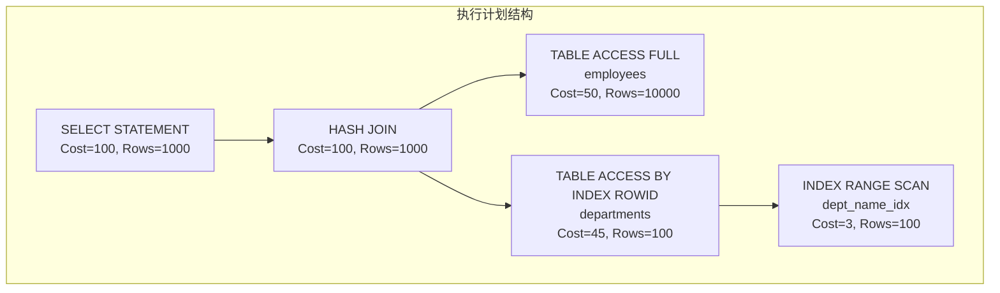
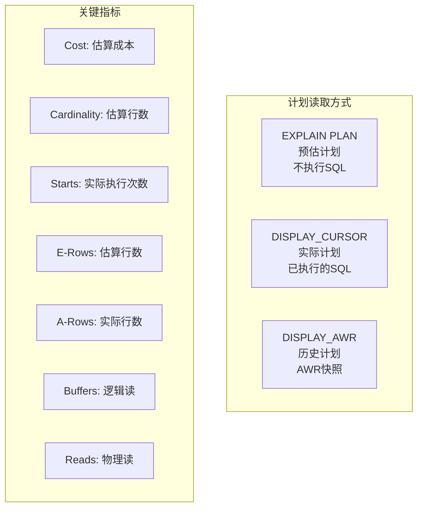

# Oracle执行计划分析

## 一、概述

### 1.1 一句话定义

Oracle执行计划是优化器为SQL语句选择的具体操作步骤序列，通过分析执行计划中的访问路径、连接方式和成本估算，可以定位SQL性能瓶颈并制定优化策略。
它在SQL优化中出现和使用，解决"SQL为什么慢"和"如何优化SQL"的核心问题。

### 1.2 为什么重要

- **不掌握的后果：** 无法定位SQL性能瓶颈，只能盲目添加索引或改写SQL，优化效率低
- **掌握的价值：** 精确理解SQL执行过程，快速定位瓶颈，制定有效的优化策略

### 1.3 适用场景

| 场景 | 说明 |
|------|------|
| SQL调优 | 分析SQL为什么慢 |
| 索引设计 | 确认索引是否被使用 |
| 计划回归 | 对比不同时间的执行计划 |
| 优化器诊断 | 理解优化器为什么选择某个计划 |
| 性能基线 | 建立SQL性能基线 |

### 1.4 版本演进

| 版本 | 变化说明 |
|------|---------|
| 11gR2 | DBMS_XPLAN增强，自适应游标 |
| 12cR1 | 自适应计划，运行时调整 |
| 12cR2 | 执行计划历史对比增强 |
| 19c | 自动SQL调优集成 |
| 21c | 执行计划可视化增强 |

## 二、术语与概念

### 2.1 核心术语表

| 术语 | 含义 | 类比 |
|------|------|------|
| 执行计划 | SQL的执行步骤序列 | 导航路线 |
| Cost | 优化器估算的成本 | 路线预计时间 |
| Cardinality | 估算返回行数 | 预计经过的车数 |
| 访问路径 | 数据访问方式 | 交通方式 |
| 连接方式 | 表连接算法 | 换乘方式 |
| 谓词 | 过滤条件 | 路障检查站 |
| 操作 | 执行步骤 | 路段 |
| 子操作 | 操作的输入来源 | 路段的入口 |

### 2.2 执行计划结构



## 三、架构与原理

### 3.1 执行计划读取方式



### 3.2 工作原理

1. **计划生成：** CBO为SQL生成候选执行计划
2. **成本计算：** 计算每个计划的I/O和CPU成本
3. **计划选择：** 选择成本最低的计划
4. **计划执行：** 按照选定计划执行SQL
5. **计划缓存：** 计划缓存在Shared Pool中供复用
6. **计划分析：** 通过DBMS_XPLAN查看和分析计划

**一句话总结：** 执行计划分析的核心是"从下往上读"——理解每个操作步骤的输入输出，找到成本最高的步骤进行优化。

### 3.3 常见访问路径对比


## 四、功能详解

### 4.1 查看执行计划

#### 功能说明

使用不同方法获取SQL的执行计划。

#### 操作步骤

```sql
-- 方法1：EXPLAIN PLAN（预估计划，不执行SQL）
EXPLAIN PLAN FOR
SELECT * FROM employees WHERE department_id = 10;

SELECT * FROM TABLE(DBMS_XPLAN.DISPLAY);
-- 基本格式

SELECT * FROM TABLE(DBMS_XPLAN.DISPLAY(format => 'ALL'));
-- 完整格式，包含所有信息

SELECT * FROM TABLE(DBMS_XPLAN.DISPLAY(format => 'BASIC +PREDICATE +NOTE'));
-- 自定义格式

-- 方法2：DISPLAY_CURSOR（实际计划，SQL已执行）
-- 先找到SQL ID
SELECT sql_id, sql_text FROM v$sql WHERE sql_text LIKE '%employees%';

-- 查看实际执行计划
SELECT * FROM TABLE(DBMS_XPLAN.DISPLAY_CURSOR(
    sql_id => 'abc123def',
    format => 'ALLSTATS LAST'
));
-- ALLSTATS LAST显示最后一次执行的统计

-- 方法3：DISPLAY_AWR（历史计划）
SELECT * FROM TABLE(DBMS_XPLAN.DISPLAY_AWR(
    sql_id => 'abc123def'
));

-- 方法4：从SQL_ID直接获取
SELECT * FROM TABLE(DBMS_XPLAN.DISPLAY_CURSOR(
    sql_id => 'abc123def',
    cursor_child_no => 0,
    format => 'ALLSTATS LAST +NOTE +PREDICATE'
));
```

### 4.2 执行计划关键指标

| 指标 | 说明 | 关注点 |
|------|------|--------|
| Cost | 优化器估算的总成本 | 相对值，非绝对时间 |
| Cardinality (Rows) | 估算返回行数 | 与实际对比 |
| Bytes | 估算返回字节数 | 数据传输量 |
| Starts | 操作实际执行次数 | 嵌套循环中关注 |
| E-Rows | 估算行数 | 与A-Rows对比 |
| A-Rows | 实际行数 | 真实数据量 |
| A-Time | 实际执行时间 | 瓶颈定位 |
| Buffers | 逻辑读次数 | 主要性能指标 |
| Reads | 物理读次数 | I/O瓶颈 |
| Access Predicates | 访问谓词 | 索引使用 |
| Filter Predicates | 过滤谓词 | 后过滤 |

### 4.3 常见操作解读

```sql
-- 全表扫描
-- TABLE ACCESS FULL - 读取所有数据块
-- 何时合理：查询返回大部分数据
-- 何时不合理：查询返回少量数据（应使用索引）

-- 索引范围扫描
-- INDEX RANGE SCAN - 读取索引中满足条件的部分
-- 通常后跟 TABLE ACCESS BY INDEX ROWID（回表）
-- 关注：Rows估算是否准确

-- 索引唯一扫描
-- INDEX UNIQUE SCAN - 唯一键精确查找
-- 最快的访问方式，返回最多1行

-- 哈希连接
-- HASH JOIN - 大表等值连接的默认方式
-- 关注：内存使用（是否溢出到磁盘）

-- 嵌套循环
-- NESTED LOOPS - 小结果集驱动
-- 关注：Starts次数（外层行数×内层访问）

-- 排序合并
-- SORT MERGE JOIN - 非等值连接
-- 关注：排序开销
```

### 4.4 执行计划分析要点

```sql
-- 1. 检查访问路径
-- 全表扫描是否合理？应该使用索引吗？
-- 索引扫描是否高效？回表次数多吗？

-- 2. 检查连接方式
-- 嵌套循环的Starts次数是否过高？
-- 哈希连接是否溢出到磁盘？

-- 3. 检查基数估算
-- E-Rows vs A-Rows 差异大说明统计信息不准
SELECT * FROM TABLE(DBMS_XPLAN.DISPLAY_CURSOR(
    sql_id => 'abc123def',
    format => 'ALLSTATS LAST'
));
-- 对比E-Rows和A-Rows

-- 4. 检查谓词使用
-- Access Predicates：用于索引访问的谓词
-- Filter Predicates：后过滤的谓词
-- 如果应该走索引的列出现在Filter中，说明索引未使用

-- 5. 查看Note信息
-- Hint是否生效
-- 自适应计划信息
-- 动态采样信息
```

### 4.5 执行计划对比

```sql
-- 查看SQL的所有子游标（不同计划）
SELECT child_number, plan_hash_value, executions,
       elapsed_time/1000000 AS elapsed_sec
FROM v$sql
WHERE sql_id = 'abc123def'
ORDER BY child_number;

-- 对比不同子游标的计划
SELECT * FROM TABLE(DBMS_XPLAN.DISPLAY_CURSOR(
    sql_id => 'abc123def',
    cursor_child_no => 0
));
SELECT * FROM TABLE(DBMS_XPLAN.DISPLAY_CURSOR(
    sql_id => 'abc123def',
    cursor_child_no => 1
));

-- 查看计划变化历史
SELECT plan_hash_value, timestamp,
       executions_total, elapsed_time_total/1000000 AS elapsed_sec
FROM dba_hist_sqlstat
WHERE sql_id = 'abc123def'
ORDER BY timestamp DESC;
```

## 五、性能与调优

### 5.1 性能基线

| 指标 | 正常范围 | 告警阈值 | 说明 |
|------|---------|---------|------|
| E-Rows/A-Rows比 | 0.5-2.0 | < 0.1 或 > 10 | 估算准确度 |
| Buffers/Row | < 10 | > 100 | 每行逻辑读 |
| 物理读比例 | < 5% | > 20% | 缓存命中率 |
| 计划稳定性 | 1个计划 | > 3个子游标 | 计划变化频率 |

### 5.2 调优建议

| 场景 | 建议 | 原因 |
|------|------|------|
| 全表扫描不合理 | 添加索引或检查统计信息 | 减少I/O |
| 嵌套循环Starts高 | 改为Hash Join或调整顺序 | 减少重复访问 |
| E-Rows/A-Rows差异大 | 收集统计信息 | 修正优化器估算 |
| 多子游标 | 检查绑定变量窥视 | 稳定执行计划 |

## 六、DFX能力

### 6.1 动态性能视图

| 视图名 | 用途 | 关键字段 |
|--------|------|---------|
| V$SQL_PLAN | 执行计划 | OPERATION, OPTIONS, COST |
| V$SQL_PLAN_STATISTICS_ALL | 实际统计 | STARTS, A_ROWS, BUFFERS |
| V$SQL | SQL信息 | SQL_ID, PLAN_HASH_VALUE |
| DBA_HIST_SQLSTAT | 历史统计 | PLAN_HASH_VALUE, ELAPSED_TIME |
| DBA_HIST_SQL_PLAN | 历史计划 | OPERATION, OPTIONS |

### 6.2 诊断工具

```sql
-- SQL Monitor（实时监控SQL执行）
SELECT dbms_sqltune.report_sql_monitor(sql_id => 'abc123def', type => 'TEXT')
FROM dual;

-- SQL Tuning Advisor
DECLARE
    v_task VARCHAR2(64);
BEGIN
    v_task := DBMS_SQLTUNE.CREATE_TUNING_TASK(sql_id => 'abc123def');
    DBMS_SQLTUNE.EXECUTE_TUNING_TASK(v_task);
END;
/
SELECT DBMS_SQLTUNE.REPORT_TUNING_TASK('task_name') FROM dual;
```

## 七、实战案例

### 7.1 案例背景

- **场景**：某系统Oracle 19c，一个SQL执行时间从1秒变为60秒
- **时间**：统计信息收集后
- **现象**：SQL文本未变，但执行计划变化

### 7.2 诊断过程

**步骤1：获取当前执行计划**

```sql
SELECT * FROM TABLE(DBMS_XPLAN.DISPLAY_CURSOR(
    sql_id => 'abc123def',
    format => 'ALLSTATS LAST'
));
```
- → 发现：TABLE ACCESS FULL，Buffers=500,000
- → 判断：原本应该走索引，现在全表扫描

**步骤2：对比历史计划**

```sql
SELECT * FROM TABLE(DBMS_XPLAN.DISPLAY_AWR(sql_id => 'abc123def'));
```
- → 发现：历史计划是INDEX RANGE SCAN，Buffers=500
- → 判断：计划回归，统计信息变化导致

**步骤3：检查统计信息**

```sql
SELECT table_name, num_rows, last_analyzed
FROM dba_tables WHERE table_name = 'ORDERS';
```
- → 发现：统计信息刚更新，num_rows从10万变为1000万
- → 判断：批量加载后统计信息变化，优化器认为全表扫描更优

**步骤4：修复方案**

```sql
-- 创建SQL Plan Baseline锁定好计划
DECLARE
    v_plans NUMBER;
BEGIN
    v_plans := DBMS_SPM.LOAD_PLANS_FROM_CURSOR_CACHE(
        sql_id => 'abc123def',
        plan_hash_value => 1234567890  -- 好计划的hash值
    );
END;
/
```

### 7.3 解决结果

| 指标 | 解决前 | 解决后 |
|------|--------|--------|
| 执行计划 | TABLE ACCESS FULL | INDEX RANGE SCAN |
| 执行时间 | 60秒 | 1秒 |
| 逻辑读 | 500,000 | 500 |

### 7.4 复盘总结

- **根因：** 统计信息更新后优化器选择了不同的执行计划
- **教训：** 使用执行计划分析可以快速定位计划回归；关键SQL使用SPM锁定计划

## 八、常见错误与排查

### 8.1 常见错误列表

| 问题 | 原因 | 解决方法 |
|------|------|---------|
| 全表扫描 | 统计信息不准或缺少索引 | 收集统计或添加索引 |
| 嵌套循环效率低 | 外层行数多 | 改为Hash Join |
| E-Rows/A-Rows差异大 | 统计信息不准 | 收集统计信息 |
| 多子游标 | 绑定变量窥视 | 使用自适应游标 |
| 计划不稳定 | 统计信息变化 | 使用SPM锁定 |

### 8.2 排查步骤

1. **获取执行计划：** `DBMS_XPLAN.DISPLAY_CURSOR`
2. **检查访问路径：** 全表扫描还是索引扫描
3. **检查连接方式：** 嵌套循环还是哈希连接
4. **对比估算实际：** E-Rows vs A-Rows
5. **检查谓词使用：** Access vs Filter

## 九、最佳实践

### 9.1 官方推荐

- 使用DISPLAY_CURSOR分析实际执行计划
- 对比E-Rows和A-Rows发现统计问题
- 使用SQL Monitor实时监控长SQL
- 建立执行计划基线定期对比

### 9.2 社区经验

- 从下往上读执行计划
- 关注Buffers（逻辑读）而非Cost
- 多子游标通常说明绑定变量问题
- 计划回归优先检查统计信息

### 9.3 反模式

| 反模式 | 问题 | 正确做法 |
|--------|------|---------|
| 只看Cost | Cost是相对值 | 关注Buffers和A-Time |
| 不分析实际计划 | 预估计划可能不准 | 使用DISPLAY_CURSOR |
| 忽略Note信息 | 错过重要诊断信息 | 查看format=+NOTE |
| 不建立基线 | 无法发现计划回归 | 定期对比历史计划 |
| 盲目添加索引 | 可能不被使用 | 先分析执行计划 |

## 十、命令与视图汇总

### 10.1 命令列表

| 命令 | 适用场景 | 说明 |
|------|---------|------|
| `EXPLAIN PLAN FOR` | 预估计划 | 不执行SQL |
| `DBMS_XPLAN.DISPLAY` | 显示计划 | 格式化输出 |
| `DBMS_XPLAN.DISPLAY_CURSOR` | 实际计划 | 已执行SQL |
| `DBMS_XPLAN.DISPLAY_AWR` | 历史计划 | AWR快照 |
| `DBMS_SQLTUNE.REPORT_SQL_MONITOR` | 实时监控 | 长SQL监控 |

### 10.2 视图列表

| 视图名 | 类型 | 用途 | 关键字段 |
|--------|------|------|---------|
| V$SQL_PLAN | 动态 | 执行计划 | OPERATION, COST |
| V$SQL_PLAN_STATISTICS_ALL | 动态 | 实际统计 | STARTS, A_ROWS |
| V$SQL | 动态 | SQL信息 | PLAN_HASH_VALUE |
| DBA_HIST_SQL_PLAN | AWR | 历史计划 | OPERATION |

## 十一、总结速查

### 11.1 黄金法则

1. **实际计划** - 使用DISPLAY_CURSOR
2. **从下往上读** - 理解数据流向
3. **对比估算实际** - E-Rows vs A-Rows
4. **关注Buffers** - 逻辑读是核心指标
5. **建立基线** - 定期对比计划变化

### 11.2 一页纸检查清单

| 现象/场景 | 原因 | 处理方案 |
|-----------|------|----------|
| 全表扫描不合理 | 统计信息不准或缺索引 | 收集统计或添加索引 |
| 嵌套循环效率低 | 外层行数多 | 改为Hash Join |
| E/A-Rows差异大 | 统计信息不准 | 收集统计信息 |
| 多子游标 | 绑定变量窥视 | 使用自适应游标 |
| 计划回归 | 统计信息变化 | 使用SPM锁定 |

### 11.3 关键数字

| 指标 | 正常范围 | 告警阈值 | 说明 |
|------|---------|---------|------|
| E/A-Rows比 | 0.5-2.0 | > 10 | 估算准确度 |
| Buffers/Row | < 10 | > 100 | 每行逻辑读 |
| 物理读比例 | < 5% | > 20% | 缓存命中率 |

## 附录

### A. 官方参考

- [Oracle Database Performance Tuning Guide - Execution Plans](https://docs.oracle.com/en/database/oracle/oracle-database/19c/tgdba/)
- [Oracle Database SQL Tuning Guide](https://docs.oracle.com/en/database/oracle/oracle-database/19c/tgsql/)
- MOS Note: 1322893.1 - "Reading Execution Plans"

### B. 数据字典

| 对象名 | 类型 | 说明 |
|--------|------|------|
| V$SQL_PLAN | 动态视图 | 执行计划 |
| V$SQL_PLAN_STATISTICS_ALL | 动态视图 | 实际统计 |
| DBA_HIST_SQL_PLAN | AWR | 历史计划 |

### C. 修订记录

| 日期 | 版本 | 修改内容 | 修改人 |
|------|------|---------|--------|
| 2026-07-02 | v1.0 | 初始版本 | YashanDB知识库生成器 |
| 2026-07-02 | v1.1 | 补充完整模板章节 | YashanDB知识库生成器 |
