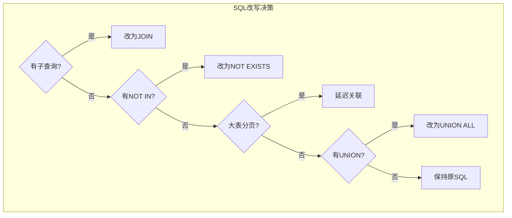

# Oracle SQL改写技巧

## 一、概述

### 1.1 一句话定义

Oracle SQL改写是通过重写SQL语句的逻辑结构来提高执行效率的技术，包括消除子查询、优化连接方式、简化聚合逻辑等方法，在不改变查询结果的前提下获得更优的执行计划。
它在SQL优化中出现和使用，解决SQL逻辑复杂导致优化器无法选择最优执行计划的问题。

### 1.2 为什么重要

- **不掌握的后果：** SQL逻辑复杂导致优化器选择差的执行计划，查询性能远低于预期
- **掌握的价值：** 通过改写SQL引导优化器选择更优的执行计划，性能提升10-1000倍

### 1.3 适用场景

| 场景 | 说明 |
|------|------|
| 子查询优化 | 将相关子查询改为连接 |
| NOT IN优化 | 改为NOT EXISTS避免NULL问题 |
| 分页查询 | 大表分页性能优化 |
| UNION优化 | 避免不必要的去重 |
| 外连接优化 | 消除不必要的外连接 |
| 聚合优化 | 减少数据传输量 |

### 1.4 版本演进

| 版本 | 变化说明 |
|------|---------|
| 11gR2 | 子查询展开增强 |
| 12cR1 |  lateral视图支持 |
| 12cR2 | 多态表函数 |
| 19c | 近似查询（APPROX）函数 |
| 21c | POLYMORPHIC表函数 |

## 二、术语与概念

### 2.1 核心术语表

| 术语 | 含义 | 类比 |
|------|------|------|
| 子查询展开 | 将子查询转换为连接 | 把嵌套信封拆开 |
| 相关子查询 | 子查询引用外层列 | 每封信都要查地址簿 |
| EXISTS | 存在性检查 | 检查是否有就行 |
| 延迟关联 | 先筛选再关联 | 先看目录再翻书 |
| 标量子查询 | 返回单值的子查询 | 查一个具体信息 |
| 谓词推入 | 将过滤条件下推到视图内 | 提前筛选 |
| 连接消除 | 删除不必要的连接 | 去掉多余的步骤 |

### 2.2 SQL改写决策流程



## 三、架构与原理

### 3.1 改写前后对比


### 3.2 工作原理

1. **分析原SQL：** 理解查询逻辑和性能瓶颈
2. **识别改写点：** 子查询、NOT IN、外连接等
3. **等价改写：** 在不改变结果的前提下重写SQL
4. **验证等价性：** 确保改写前后结果一致
5. **对比执行计划：** 确认改写后计划更优

**一句话总结：** SQL改写的核心是"简化逻辑+引导优化器"——让优化器更容易选择最优执行计划。

### 3.3 常见改写模式


## 四、功能详解

### 4.1 子查询改写为JOIN

#### 功能说明

将相关子查询转换为JOIN，消除逐行执行。

#### 操作步骤

```sql
-- 原SQL：多层嵌套子查询
SELECT * FROM employees WHERE department_id IN (
    SELECT department_id FROM departments WHERE location_id IN (
        SELECT location_id FROM locations WHERE country_id = 'US'
    )
);

-- 改写为JOIN（推荐）
SELECT e.* FROM employees e
JOIN departments d ON e.department_id = d.department_id
JOIN locations l ON d.location_id = l.location_id
WHERE l.country_id = 'US';

-- 原SQL：相关子查询
SELECT e.name,
       (SELECT d.department_name FROM departments d
        WHERE d.department_id = e.department_id) AS dept_name
FROM employees e;

-- 改写为LEFT JOIN
SELECT e.name, d.department_name AS dept_name
FROM employees e
LEFT JOIN departments d ON e.department_id = d.department_id;
```

### 4.2 NOT IN改写为NOT EXISTS

```sql
-- 原SQL：NOT IN（有NULL陷阱）
SELECT * FROM employees
WHERE department_id NOT IN (
    SELECT department_id FROM departments
);
-- 如果departments.department_id有NULL值，整个查询返回空！

-- 改写为NOT EXISTS（安全）
SELECT * FROM employees e
WHERE NOT EXISTS (
    SELECT 1 FROM departments d
    WHERE d.department_id = e.department_id
);

-- 改写为LEFT JOIN + IS NULL
SELECT e.* FROM employees e
LEFT JOIN departments d ON e.department_id = d.department_id
WHERE d.department_id IS NULL;

-- 改写为MINUS
SELECT department_id FROM employees
MINUS
SELECT department_id FROM departments;
```

### 4.3 分页查询优化

```sql
-- 传统ROWNUM分页（效率一般）
SELECT * FROM (
    SELECT a.*, ROWNUM rn FROM (
        SELECT * FROM employees ORDER BY salary DESC
    ) a WHERE ROWNUM <= 20
) WHERE rn > 10;

-- ROW_NUMBER分页（推荐）
SELECT * FROM (
    SELECT e.*, ROW_NUMBER() OVER (ORDER BY salary DESC) AS rn
    FROM employees e
) WHERE rn BETWEEN 11 AND 20;

-- 延迟关联优化（大表分页，推荐）
-- 先在索引上分页，再回表取数据
SELECT e.* FROM employees e
JOIN (
    SELECT employee_id FROM (
        SELECT employee_id,
               ROW_NUMBER() OVER (ORDER BY salary DESC) AS rn
        FROM employees
    ) WHERE rn BETWEEN 11 AND 20
) t ON e.employee_id = t.employee_id;

-- 基于键集的分页（最高效）
-- 第一页
SELECT * FROM employees ORDER BY employee_id FETCH FIRST 20 ROWS ONLY;
-- 后续页（使用上一页最后一个值）
SELECT * FROM employees
WHERE employee_id > :last_id
ORDER BY employee_id
FETCH FIRST 20 ROWS ONLY;
```

### 4.4 UNION优化

```sql
-- UNION（去重，需要排序）
SELECT id, name FROM table1
UNION
SELECT id, name FROM table2;

-- UNION ALL（不去重，更快）
-- 如果确定无重复数据，优先使用UNION ALL
SELECT id, name FROM table1
UNION ALL
SELECT id, name FROM table2;

-- 如果必须去重，使用DISTINCT代替UNION
SELECT DISTINCT id, name FROM (
    SELECT id, name FROM table1
    UNION ALL
    SELECT id, name FROM table2
);
-- 有时比UNION更高效
```

### 4.5 外连接优化

```sql
-- 原SQL：不必要的外连接
SELECT e.name, d.department_name
FROM employees e LEFT JOIN departments d ON e.department_id = d.department_id
WHERE d.location_id = 1700;
-- WHERE条件使LEFT JOIN变为INNER JOIN

-- 改写为内连接
SELECT e.name, d.department_name
FROM employees e JOIN departments d ON e.department_id = d.department_id
WHERE d.location_id = 1700;

-- 原SQL：DISTINCT消除重复
SELECT DISTINCT d.department_name
FROM departments d JOIN employees e ON d.department_id = e.department_id;

-- 改写为EXISTS（更高效）
SELECT department_name FROM departments d
WHERE EXISTS (
    SELECT 1 FROM employees e WHERE e.department_id = d.department_id
);
```

### 4.6 聚合优化

```sql
-- 避免SELECT *
SELECT employee_id, name, salary FROM employees WHERE department_id = 10;

-- 使用聚合减少数据传输
SELECT department_id, COUNT(*) AS emp_count, AVG(salary) AS avg_salary
FROM employees GROUP BY department_id;

-- 使用WITH子句避免重复扫描
WITH dept_stats AS (
    SELECT department_id, COUNT(*) AS cnt, SUM(salary) AS total_sal
    FROM employees GROUP BY department_id
)
SELECT d.department_name, ds.cnt, ds.total_sal
FROM departments d
JOIN dept_stats ds ON d.department_id = ds.department_id;

-- 使用近似聚合（19c+，大表快速统计）
SELECT department_id,
       APPROX_COUNT(*) AS approx_cnt,
       APPROX_SUM(salary) AS approx_total
FROM employees
GROUP BY department_id;
```

## 五、性能与调优

### 5.1 改写效果对比

| 改写模式 | 典型提升 | 适用场景 |
|---------|---------|---------|
| 子查询→JOIN | 10-100x | 相关子查询 |
| NOT IN→NOT EXISTS | 2-10x | 排除查询 |
| 延迟关联分页 | 5-50x | 大表深分页 |
| UNION→UNION ALL | 2-5x | 无重复数据 |
| 外连接→内连接 | 2-10x | WHERE过滤外连接表 |
| 标量子查询→JOIN | 5-50x | 关联查询 |

### 5.2 调优建议

| 场景 | 建议 | 原因 |
|------|------|------|
| 相关子查询 | 改为JOIN | 消除逐行执行 |
| NOT IN | 改为NOT EXISTS | 避免NULL陷阱 |
| 大表分页 | 延迟关联 | 减少回表 |
| 重复扫描 | 使用WITH子句 | 复用中间结果 |

## 六、DFX能力

### 6.1 动态性能视图

| 视图名 | 用途 | 关键字段 |
|--------|------|---------|
| V$SQL | SQL信息 | SQL_ID, ELAPSED_TIME |
| V$SQL_PLAN | 执行计划 | OPERATION, OPTIONS |
| V$SQLSTATS | SQL统计 | BUFFER_GETS, DISK_READS |

### 6.2 验证改写等价性

```sql
-- 对比改写前后结果
-- 方法1：MINUS检查差异
(SELECT * FROM original_query)
MINUS
(SELECT * FROM rewritten_query);

(SELECT * FROM rewritten_query)
MINUS
(SELECT * FROM original_query);
-- 两个查询都返回0行说明等价

-- 方法2：对比行数
SELECT COUNT(*) FROM (original_query);
SELECT COUNT(*) FROM (rewritten_query);
```

## 七、实战案例

### 7.1 案例背景

- **场景**：某系统Oracle 19c，月度报表查询耗时30分钟
- **时间**：月末结算
- **现象**：SQL包含多层嵌套子查询，涉及5张表

### 7.2 诊断过程

**步骤1：分析原SQL**

```sql
-- 原SQL（简化）
SELECT c.customer_name,
       (SELECT COUNT(*) FROM orders o WHERE o.customer_id = c.customer_id
        AND o.order_date > ADD_MONTHS(SYSDATE, -12)) AS order_count,
       (SELECT SUM(amount) FROM orders o WHERE o.customer_id = c.customer_id
        AND o.order_date > ADD_MONTHS(SYSDATE, -12)) AS total_amount
FROM customers c
WHERE c.status = 'ACTIVE';
```
- → 发现：两个标量子查询，每个客户执行两次子查询
- → 判断：100万客户 × 2次子查询 = 200万次子查询执行

**步骤2：改写SQL**

```sql
-- 改写为LEFT JOIN + 聚合
SELECT c.customer_name,
       NVL(o.order_count, 0) AS order_count,
       NVL(o.total_amount, 0) AS total_amount
FROM customers c
LEFT JOIN (
    SELECT customer_id,
           COUNT(*) AS order_count,
           SUM(amount) AS total_amount
    FROM orders
    WHERE order_date > ADD_MONTHS(SYSDATE, -12)
    GROUP BY customer_id
) o ON c.customer_id = o.customer_id
WHERE c.status = 'ACTIVE';
```

**步骤3：验证效果**

```sql
-- 执行计划对比
-- 原SQL：NESTED LOOPS (OUTER)，Starts=2000000
-- 改写后：HASH JOIN (OUTER)，Starts=1
```

### 7.3 解决结果

| 指标 | 解决前 | 解决后 |
|------|--------|--------|
| 执行时间 | 30分钟 | 15秒 |
| 逻辑读 | 5亿 | 50万 |
| 子查询执行次数 | 200万次 | 0次 |

### 7.4 复盘总结

- **根因：** 标量子查询导致逐行执行，100万次子查询开销巨大
- **教训：** 标量子查询几乎总是可以改写为JOIN，性能提升显著

## 八、常见错误与排查

### 8.1 常见错误列表

| 问题 | 原因 | 解决方法 |
|------|------|---------|
| 改写后结果不同 | 不等价改写 | 使用MINUS验证 |
| NOT IN返回空 | NULL值陷阱 | 改为NOT EXISTS |
| 分页越来越慢 | 深分页OFFSET大 | 使用键集分页 |
| UNION性能差 | 不必要的去重 | 改为UNION ALL |

### 8.2 排查步骤

1. **验证等价性：** 使用MINUS对比结果
2. **对比执行计划：** 改写前后的Cost和Buffers
3. **检查边界条件：** NULL值、空表等
4. **测试大数据量：** 确保改写后性能稳定
5. **文档记录：** 记录改写原因和效果

## 九、最佳实践

### 9.1 官方推荐

- 优先使用JOIN而非子查询
- NOT IN改为NOT EXISTS避免NULL问题
- 使用UNION ALL代替UNION（除非需要去重）
- 大表分页使用延迟关联或键集分页

### 9.2 社区经验

- 改写前先分析执行计划找到瓶颈
- 使用WITH子句复用中间结果
- 19c+使用APPROX函数加速大表统计
- 改写后必须验证结果等价性

### 9.3 反模式

| 反模式 | 问题 | 正确做法 |
|--------|------|---------|
| 标量子查询 | 逐行执行开销大 | 改为LEFT JOIN |
| NOT IN含NULL | 返回空结果 | 改为NOT EXISTS |
| 深分页OFFSET | 越翻越慢 | 键集分页 |
| UNION不去重用 | 不必要的排序 | UNION ALL |
| SELECT * | 传输不必要列 | 只选需要的列 |

## 十、命令与视图汇总

### 10.1 改写模式速查

| 原模式 | 改写模式 | 典型提升 |
|--------|---------|---------|
| 标量子查询 | LEFT JOIN + 聚合 | 5-50x |
| NOT IN | NOT EXISTS | 2-10x |
| 嵌套子查询 | JOIN | 10-100x |
| UNION | UNION ALL | 2-5x |
| 外连接+WHERE | 内连接 | 2-10x |
| ROWNUM分页 | 延迟关联/键集 | 5-50x |
| DISTINCT+JOIN | EXISTS | 2-10x |

### 10.2 视图列表

| 视图名 | 类型 | 用途 | 关键字段 |
|--------|------|------|---------|
| V$SQL | 动态 | SQL信息 | ELAPSED_TIME |
| V$SQL_PLAN | 动态 | 执行计划 | OPERATION |
| V$SQLSTATS | 动态 | SQL统计 | BUFFER_GETS |

## 十一、总结速查

### 11.1 黄金法则

1. **JOIN替代子查询** - 消除逐行执行
2. **NOT EXISTS替代NOT IN** - 避免NULL陷阱
3. **延迟关联分页** - 大表分页优化
4. **UNION ALL优先** - 避免不必要去重
5. **验证等价性** - 改写后必须验证结果

### 11.2 一页纸检查清单

| 现象/场景 | 原因 | 处理方案 |
|-----------|------|----------|
| 标量子查询慢 | 逐行执行 | 改为LEFT JOIN |
| NOT IN返回空 | NULL值 | 改为NOT EXISTS |
| 分页越来越慢 | OFFSET大 | 键集分页 |
| UNION性能差 | 不必要的去重 | 改为UNION ALL |
| 外连接效率低 | WHERE使外连接失效 | 改为内连接 |

### 11.3 关键数字

| 改写模式 | 典型提升 | 适用条件 |
|---------|---------|---------|
| 子查询→JOIN | 10-100x | 相关子查询 |
| NOT IN→NOT EXISTS | 2-10x | 排除查询 |
| 延迟关联分页 | 5-50x | 大表深分页 |
| UNION→UNION ALL | 2-5x | 无重复数据 |

## 附录

### A. 官方参考

- [Oracle Database Performance Tuning Guide - SQL Tuning](https://docs.oracle.com/en/database/oracle/oracle-database/19c/tgdba/)
- [Oracle Database SQL Tuning Guide](https://docs.oracle.com/en/database/oracle/oracle-database/19c/tgsql/)
- MOS Note: 2711908.1 - "SQL Rewrite Best Practices"

### B. 数据字典

| 对象名 | 类型 | 说明 |
|--------|------|------|
| V$SQL | 动态视图 | SQL信息 |
| V$SQL_PLAN | 动态视图 | 执行计划 |
| V$SQLSTATS | 动态视图 | SQL统计 |

### C. 修订记录

| 日期 | 版本 | 修改内容 | 修改人 |
|------|------|---------|--------|
| 2026-07-02 | v1.0 | 初始版本 | YashanDB知识库生成器 |
| 2026-07-02 | v1.1 | 补充完整模板章节 | YashanDB知识库生成器 |
