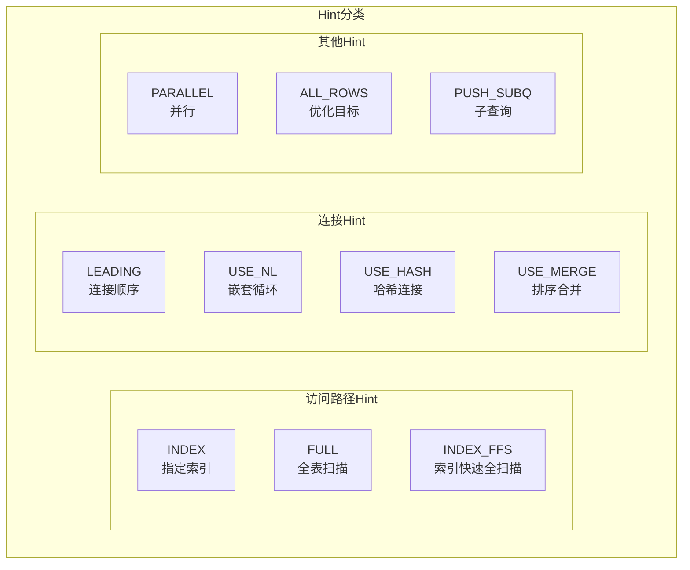
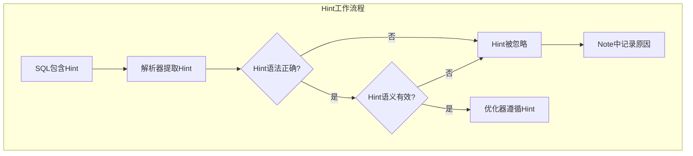
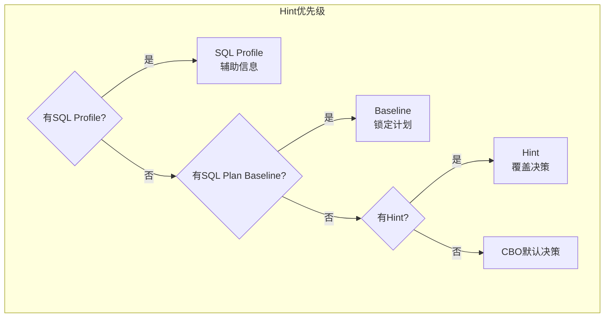

# Oracle Hint使用指南

## 一、概述

### 1.1 一句话定义

Oracle Hint是嵌入SQL注释中的优化器指令，用于覆盖CBO的默认决策，强制使用特定的访问路径、连接方式或并行度。
它在SQL优化中出现和使用，解决优化器因统计信息不准或数据分布特殊而选择不当执行计划的问题。

### 1.2 为什么重要

- **不掌握的后果：** 面对优化器错误决策束手无策，无法快速修复关键SQL的性能问题
- **掌握的价值：** 在不修改应用代码的前提下，快速引导优化器选择正确的执行计划

### 1.3 适用场景

| 场景 | 说明 |
|------|------|
| 紧急修复 | 关键SQL执行计划突然变差 |
| 统计信息不准 | 优化器因统计错误选错计划 |
| 特殊数据分布 | 优化器无法正确处理倾斜数据 |
| 第三方应用 | 无法修改SQL文本 |
| 升级过渡 | 升级后计划变化，临时使用Hint |

### 1.4 版本演进

| 版本 | 变化说明 |
|------|---------|
| 11gR2 | 查询块名称Hint支持增强 |
| 12cR1 | 自适应计划与Hint交互 |
| 12cR2 | Hint报告功能增强 |
| 19c | 自动索引与Hint优先级 |
| 21c | Hint验证工具增强 |

## 二、术语与概念

### 2.1 核心术语表

| 术语 | 含义 | 类比 |
|------|------|------|
| Hint | 优化器指令 | 导航软件的"避开高速"指令 |
| 查询块 | SQL中的子查询单元 | 导航的路段 |
| 访问路径 | 数据访问方式 | 路线选择 |
| 连接方式 | 表连接算法 | 换乘方式 |
| 连接顺序 | 表的连接先后 | 途经顺序 |
| 并行度 | 并行执行的线程数 | 车道数量 |
| Hint失效 | 优化器忽略Hint | 导航不听指令 |
| SQL Plan Baseline | 计划锁定 | 固定路线 |

### 2.2 Hint分类体系



## 三、架构与原理

### 3.1 Hint工作流程



### 3.2 工作原理

1. **语法解析：** Oracle解析SQL时提取注释中的Hint
2. **有效性检查：** 验证Hint引用的表、索引是否存在
3. **应用Hint：** 优化器按照Hint指定的方式生成执行计划
4. **失效处理：** 如果Hint无效，在Note中记录原因

**一句话总结：** Hint是优化器的"强制指令"，但必须语法正确、引用对象存在才能生效。

### 3.3 Hint优先级决策



## 四、功能详解

### 4.1 访问路径Hint

#### 功能说明

指定数据访问方式（索引/全表扫描）。

#### 操作步骤

```sql
-- 强制使用指定索引
SELECT /*+ INDEX(e emp_dept_idx) */ *
FROM employees e
WHERE department_id = 10;

-- 强制全表扫描（当索引反而慢时）
SELECT /*+ FULL(e) */ *
FROM employees e
WHERE department_id IS NOT NULL;

-- 强制索引快速全扫描（不需要回表时）
SELECT /*+ INDEX_FFS(e emp_dept_idx) */ department_id
FROM employees e;

-- 强制索引跳跃扫描
SELECT /*+ INDEX_SS(e emp_name_idx) */ *
FROM employees e
WHERE first_name = 'John';

-- 强制不使用索引
SELECT /*+ NO_INDEX(e) */ *
FROM employees e
WHERE department_id = 10;
```

### 4.2 连接Hint

```sql
-- 指定连接顺序（重要！）
SELECT /*+ LEADING(d e) */ *
FROM departments d
JOIN employees e ON d.department_id = e.department_id
WHERE d.department_name = 'IT';

-- 指定哈希连接
SELECT /*+ USE_HASH(e d) */ *
FROM employees e
JOIN departments d ON e.department_id = d.department_id;

-- 指定嵌套循环
SELECT /*+ USE_NL(e d) */ *
FROM employees e
JOIN departments d ON e.department_id = d.department_id;

-- 指定排序合并
SELECT /*+ USE_MERGE(e d) */ *
FROM employees e
JOIN departments d ON e.department_id = d.department_id;

-- 组合使用（推荐）
SELECT /*+ LEADING(d e) USE_NL(e) INDEX(e emp_dept_idx) */ *
FROM departments d
JOIN employees e ON d.department_id = e.department_id
WHERE d.department_name = 'IT';
```

### 4.3 并行Hint

```sql
-- 并行查询
SELECT /*+ PARALLEL(e, 4) */ *
FROM employees e;

-- 并行DML（批量插入）
INSERT /*+ APPEND PARALLEL(4) */
INTO target_table
SELECT * FROM source_table;

-- 取消并行
SELECT /*+ NO_PARALLEL(e) */ *
FROM employees e;

-- 自动并行度
SELECT /*+ PARALLEL(AUTO) */ *
FROM large_table;
```

### 4.4 子查询和集合Hint

```sql
-- 子查询展开
SELECT /*+ UNNEST */ *
FROM employees e
WHERE department_id IN (
    SELECT department_id FROM departments WHERE location_id = 1700
);

-- 禁止子查询展开
SELECT /*+ NO_UNNEST */ *
FROM employees e
WHERE department_id IN (
    SELECT department_id FROM departments
);

-- PUSH_SUBQ：提前执行子查询
SELECT /*+ PUSH_SUBQ */ *
FROM employees e
WHERE department_id IN (
    SELECT /*+ PUSH_SUBQ */ department_id
    FROM departments WHERE location_id = 1700
);
```

### 4.5 Hint作用域（查询块）

```sql
-- 使用查询块名称精确控制
SELECT /*+ INDEX(@sel$1 e emp_idx) */ *
FROM employees e
WHERE department_id IN (
    SELECT /*+ INDEX(@sel$2 d dept_idx) */ department_id
    FROM departments d
    WHERE location_id = 1700
);

-- 查看查询块名称
EXPLAIN PLAN FOR
SELECT * FROM employees WHERE department_id IN (
    SELECT department_id FROM departments
);
SELECT * FROM TABLE(DBMS_XPLAN.DISPLAY(format => '+ALIAS'));
-- 查看Outline Data中的查询块名称
```

### 4.6 Hint验证

```sql
-- 验证Hint是否生效
EXPLAIN PLAN FOR
SELECT /*+ INDEX(e emp_dept_idx) */ *
FROM employees e WHERE department_id = 10;

-- 查看Note部分
SELECT * FROM TABLE(DBMS_XPLAN.DISPLAY(format => '+NOTE'));

-- 常见Note信息：
-- "Warning: basic plan statistics not available" - 无统计信息
-- "Warning: this is an adaptive plan" - 自适应计划
-- "this is an adaptive plan (optimizer re-optimization)" - 自适应重优化

-- 查看被忽略的Hint
SELECT * FROM v$sql_hint WHERE name = 'INDEX';
```

## 五、性能与调优

### 5.1 Hint使用原则

| 原则 | 说明 |
|------|------|
| 最后手段 | 先优化SQL和统计信息 |
| 精确指定 | 使用表别名和查询块名称 |
| 验证生效 | 检查执行计划Note |
| 文档记录 | 记录使用原因和预期效果 |

### 5.2 性能基线

| 指标 | 正常范围 | 告警阈值 | 说明 |
|------|---------|---------|------|
| Hint使用数量 | < 10 | > 50 | 过多说明基础优化不足 |
| Hint有效率 | > 90% | < 70% | 失效Hint需排查 |

## 六、DFX能力

### 6.1 动态性能视图

| 视图名 | 用途 | 关键字段 |
|--------|------|---------|
| V$SQL_HINT | Hint列表 | NAME, TARGET_LEVEL |
| V$SQL_PLAN | 执行计划 | OTHER_TAG（Hint标记） |
| V$SQL_PLAN_DIRECTIVE | 计划指令 | DIRECTIVE_ID |

### 6.2 诊断工具

```sql
-- 查看所有可用Hint
SELECT name, class, target_level, inverse
FROM v$sql_hint
ORDER BY name;

-- 查看Hint版本信息
SELECT name, version, version_outline
FROM v$sql_hint
WHERE name = 'INDEX';
```

## 七、实战案例

### 7.1 案例背景

- **场景**：某系统Oracle 19c，一个SQL优化器选择全表扫描
- **时间**：业务高峰期
- **现象**：小比例查询（返回0.1%数据）却走全表扫描

### 7.2 诊断过程

**步骤1：分析执行计划**

```sql
EXPLAIN PLAN FOR
SELECT * FROM orders WHERE order_status = 'PENDING';
SELECT * FROM TABLE(DBMS_XPLAN.DISPLAY);
```
- → 发现：TABLE ACCESS FULL，Cost=50000
- → 判断：优化器认为全表扫描更优（统计信息可能不准）

**步骤2：使用Hint修复**

```sql
SELECT /*+ INDEX(orders idx_order_status) */ *
FROM orders
WHERE order_status = 'PENDING';

EXPLAIN PLAN FOR
SELECT /*+ INDEX(orders idx_order_status) */ *
FROM orders WHERE order_status = 'PENDING';
SELECT * FROM TABLE(DBMS_XPLAN.DISPLAY);
```
- → 发现：INDEX RANGE SCAN，Cost=100
- → 判断：Hint生效，性能大幅提升

**步骤3：长期方案**

```sql
-- 收集统计信息
EXEC DBMS_STATS.GATHER_TABLE_STATS('SALES', 'ORDERS', CASCADE => TRUE);

-- 创建SQL Plan Baseline锁定计划
DECLARE
    v_plans NUMBER;
BEGIN
    v_plans := DBMS_SPM.LOAD_PLANS_FROM_CURSOR_CACHE(sql_id => 'abc123');
END;
/
```

### 7.3 解决结果

| 指标 | 解决前 | 解决后 |
|------|--------|--------|
| 执行计划 | TABLE ACCESS FULL | INDEX RANGE SCAN |
| 执行时间 | 30秒 | 0.1秒 |
| 逻辑读 | 500,000 | 100 |

### 7.4 复盘总结

- **根因：** 统计信息不准导致优化器错误估计选择性
- **教训：** Hint是临时方案，长期应修复统计信息并使用SPM锁定计划

## 八、常见错误与排查

### 8.1 常见错误列表

| 问题 | 原因 | 解决方法 |
|------|------|---------|
| Hint不生效 | 语法错误或对象不存在 | 检查表名/索引名 |
| Hint被忽略 | 与Baseline冲突 | 检查Baseline配置 |
| 性能反而变差 | Hint指定了错误路径 | 重新评估Hint |
| 查询块不匹配 | 子查询展开后块名变化 | 使用正确的块名 |

### 8.2 排查步骤

1. **检查Hint语法：** 确认表名、索引名正确
2. **查看执行计划Note：** 确认Hint是否被使用
3. **检查Baseline：** 确认无冲突
4. **验证效果：** 对比Hint前后的执行计划
5. **考虑替代方案：** SQL Profile或SPM

## 九、最佳实践

### 9.1 官方推荐

- Hint是最后手段，优先优化SQL和统计信息
- 使用SQL Profile替代Hint（不修改SQL）
- 使用SPM锁定好的执行计划
- 文档记录每个Hint的使用原因

### 9.2 社区经验

- 组合Hint：LEADING + USE_HASH + INDEX 通常最有效
- 使用查询块名称精确控制
- 定期复查Hint是否仍然有效
- 升级前评估所有Hint的影响

### 9.3 反模式

| 反模式 | 问题 | 正确做法 |
|--------|------|---------|
| 大量使用Hint | 维护困难 | 优化统计信息+SPM |
| 不验证Hint生效 | 可能无效 | 检查执行计划Note |
| Hint写死在代码中 | 数据变化后失效 | 使用SQL Profile |
| 不记录Hint原因 | 后续维护困难 | 文档化每个Hint |
| 忽略Hint优先级 | Baseline覆盖Hint | 理解优先级关系 |

## 十、命令与视图汇总

### 10.1 命令列表

| 命令 | 适用场景 | 说明 |
|------|---------|------|
| `/*+ INDEX(table idx) */` | 指定索引 | 访问路径 |
| `/*+ LEADING(t1 t2) */` | 连接顺序 | 多表连接 |
| `/*+ USE_HASH(t1 t2) */` | 哈希连接 | 大表连接 |
| `/*+ PARALLEL(n) */` | 并行执行 | 大查询 |
| `/*+ ALL_ROWS */` | 优化目标 | 吞吐量 |

### 10.2 视图列表

| 视图名 | 类型 | 用途 | 关键字段 |
|--------|------|------|---------|
| V$SQL_HINT | 动态 | Hint列表 | NAME, CLASS |
| V$SQL_PLAN | 动态 | 执行计划 | OTHER_TAG |
| DBA_SQL_PLAN_BASELINES | 数据字典 | 计划基线 | SQL_HANDLE |

## 十一、总结速查

### 11.1 黄金法则

1. **最后手段** - 先优化SQL和统计信息
2. **验证生效** - 检查执行计划Note
3. **精确指定** - 使用表别名和查询块名
4. **文档记录** - 记录每个Hint的使用原因
5. **定期复查** - 数据变化后可能失效

### 11.2 一页纸检查清单

| 现象/场景 | 原因 | 处理方案 |
|-----------|------|----------|
| Hint不生效 | 语法错误或对象不存在 | 检查表名/索引名 |
| 优化器选错计划 | 统计信息不准 | 收集统计+SQL Profile |
| 执行计划不稳定 | 数据分布变化 | 使用SPM锁定 |
| 升级后计划变化 | 优化器行为变化 | Hint临时+SPM长期 |
| 并行度不合适 | 资源争用 | 调整PARALLEL值 |

### 11.3 关键数字

| 指标 | 正常范围 | 告警阈值 | 说明 |
|------|---------|---------|------|
| Hint使用数量 | < 10 | > 50 | 过多需重新评估 |
| Hint有效率 | > 90% | < 70% | 失效需排查 |

## 附录

### A. 官方参考

- [Oracle Database Performance Tuning Guide - Hints](https://docs.oracle.com/en/database/oracle/oracle-database/19c/tgdba/)
- [Oracle Database Reference - V$SQL_HINT](https://docs.oracle.com/en/database/oracle/oracle-database/19c/refrn/)
- MOS Note: 402932.1 - "Commonly Used Hints"

### B. 数据字典

| 对象名 | 类型 | 说明 |
|--------|------|------|
| V$SQL_HINT | 动态视图 | 可用Hint列表 |
| V$SQL_PLAN | 动态视图 | 执行计划 |
| DBA_SQL_PLAN_BASELINES | 数据字典 | 计划基线 |

### C. 修订记录

| 日期 | 版本 | 修改内容 | 修改人 |
|------|------|---------|--------|
| 2026-07-02 | v1.0 | 初始版本 | YashanDB知识库生成器 |
| 2026-07-02 | v1.1 | 补充完整模板章节 | YashanDB知识库生成器 |
