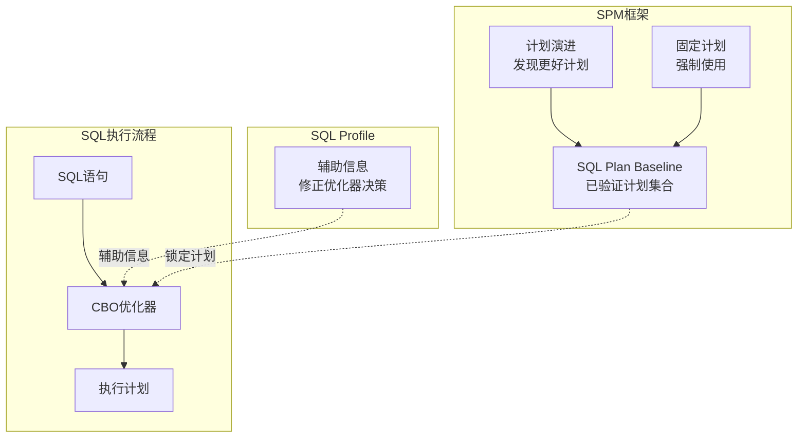
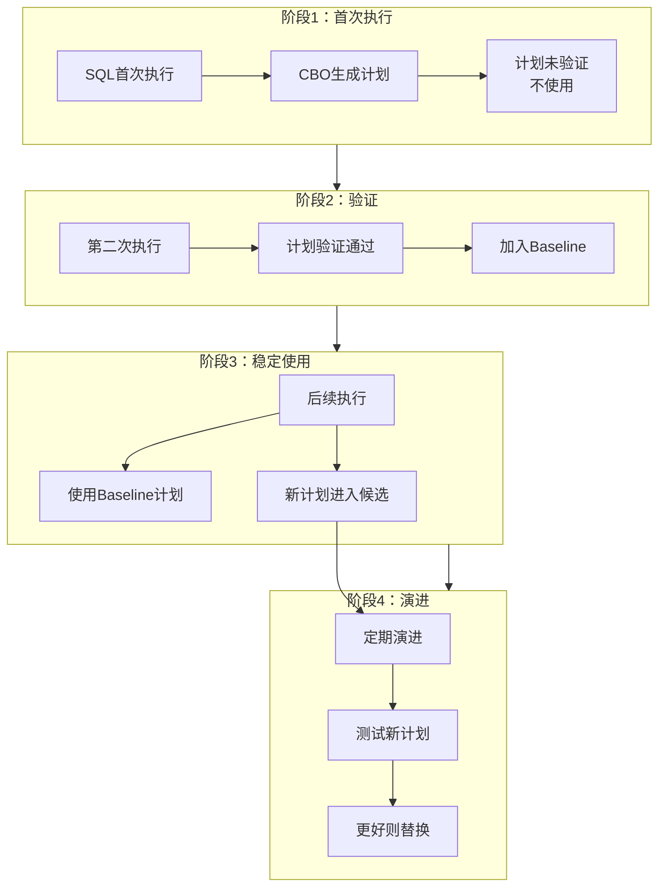
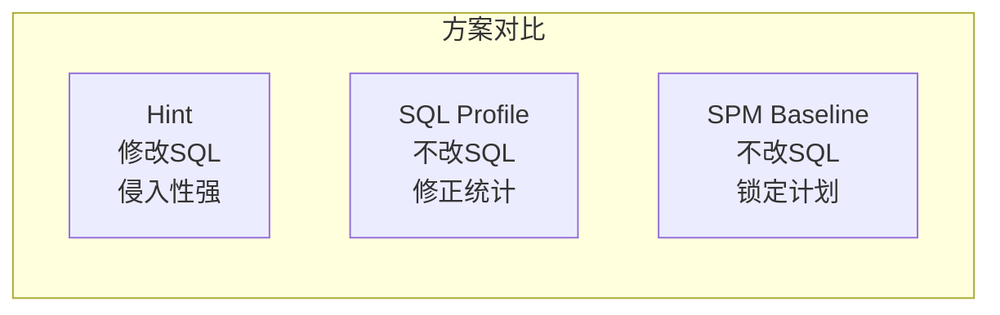

# Oracle SQL Profile与SPM

## 一、概述

### 1.1 一句话定义

SQL Profile是优化器的辅助信息集合，帮助CBO为特定SQL选择更准确的执行计划而不修改SQL文本；SPM（SQL Plan Management）是管理执行计划稳定性的框架，通过SQL Plan Baseline锁定已验证的好计划，防止性能回归。
它们在SQL优化和稳定性保障中出现和使用，解决执行计划不稳定和SQL性能回归的问题。

### 1.2 为什么重要

- **不掌握的后果：** 统计信息变化或参数调整后，关键SQL的执行计划突然变差，导致业务性能骤降
- **掌握的价值：** 通过SQL Profile修正优化器决策，通过SPM锁定稳定的好计划，确保关键SQL性能不会退化

### 1.3 适用场景

| 场景 | 说明 |
|------|------|
| 执行计划不稳定 | 关键SQL的执行计划频繁变化 |
| 性能回归 | 升级或变更后SQL性能变差 |
| 无法修改SQL | 第三方应用SQL不能改 |
| 统计信息不准 | 优化器因统计信息错误选错计划 |
| 升级保护 | 数据库升级时保护现有执行计划 |

### 1.4 版本演进

| 版本 | 变化说明 |
|------|---------|
| 11gR2 | SPM正式发布，SQL Profile成熟 |
| 12cR1 | 自适应计划与SPM集成 |
| 12cR2 | SQL Plan Baseline自动演进增强 |
| 19c | 自动SQL调优与SPM深度集成 |
| 21c | 机器学习辅助计划选择 |

## 二、术语与概念

### 2.1 核心术语表

| 术语 | 含义 | 类比 |
|------|------|------|
| SQL Profile | 优化器辅助信息，不修改SQL | 给导航加路况信息 |
| SQL Plan Baseline | 已验证的执行计划集合 | 固定的导航路线 |
| SPM | SQL Plan Management框架 | 路线管理系统 |
| SQL Tuning Advisor | SQL调优顾问 | 路线规划师 |
| 计划演进 | 自动发现并验证更好的计划 | 发现新路线后测试 |
| 计划回归 | 执行计划变差 | 路线变堵了 |
| 固定计划 | 强制使用某个特定计划 | 固定路线不走别的 |
| 辅助统计 | SQL Profile中的额外统计信息 | 补充的路况数据 |

### 2.2 SQL Profile与SPM架构



## 三、架构与原理

### 3.1 SPM工作流程



### 3.2 工作原理

1. **SQL Profile：** SQL Tuning Advisor分析SQL后生成辅助统计信息，帮助CBO做出更准确的成本估算
2. **Baseline创建：** 将当前好的执行计划加入SQL Plan Baseline
3. **计划锁定：** 后续执行强制使用Baseline中的计划
4. **计划演进：** 定期测试新计划，如果更好则替换Baseline
5. **固定计划：** 关键SQL可以固定某个特定计划

**一句话总结：** SQL Profile修正优化器的"判断"，SPM锁定优化器的"选择"——两者配合确保关键SQL始终使用最优计划。

### 3.3 SQL Profile vs SPM vs Hint对比



## 四、功能详解

### 4.1 SQL Tuning Advisor

#### 功能说明

使用SQL Tuning Advisor分析SQL并生成优化建议。

#### 操作步骤

```sql
-- 步骤1：创建调优任务
DECLARE
    v_task VARCHAR2(100);
BEGIN
    v_task := DBMS_SQLTUNE.CREATE_TUNING_TASK(
        sql_id => 'abc123def',
        time_limit => 300,        -- 最多分析5分钟
        scope => 'COMPREHENSIVE'  -- 全面分析
    );
    DBMS_SQLTUNE.EXECUTE_TUNING_TASK(v_task);
    DBMS_OUTPUT.PUT_LINE('Task: ' || v_task);
END;
/

-- 步骤2：查看调优报告
SELECT DBMS_SQLTUNE.REPORT_TUNING_TASK('task_name') FROM dual;

-- 报告内容包括：
-- 1. 索引建议
-- 2. SQL Profile建议
-- 3. SQL改写建议
-- 4. 统计信息建议

-- 步骤3：接受SQL Profile
BEGIN
    DBMS_SQLTUNE.ACCEPT_SQL_PROFILE(
        task_name => 'task_name',
        name => 'profile_for_abc123',
        force_match => TRUE  -- 强制匹配（类似CURSOR_SHARING）
    );
END;
/
```

### 4.2 SQL Profile管理

```sql
-- 查看所有SQL Profile
SELECT name, category, status, sql_text, type, force_match
FROM dba_sql_profiles
ORDER BY created DESC;

-- 启用/禁用Profile
EXEC DBMS_SQLTUNE.ALTER_SQL_PROFILE('profile_name', 'STATUS', 'DISABLED');
EXEC DBMS_SQLTUNE.ALTER_SQL_PROFILE('profile_name', 'STATUS', 'ENABLED');

-- 删除Profile
EXEC DBMS_SQLTUNE.DROP_SQL_PROFILE('profile_name');

-- 查看Profile使用的SQL
SELECT p.name, p.sql_text, p.status
FROM dba_sql_profiles p
WHERE p.status = 'ENABLED';

-- 查看哪些SQL正在使用Profile
SELECT sql_id, sql_profile, sql_plan_baseline
FROM v$sql
WHERE sql_profile IS NOT NULL;
```

### 4.3 SQL Plan Baseline管理

```sql
-- 步骤1：从游标缓存加载计划到Baseline
DECLARE
    v_plans NUMBER;
BEGIN
    v_plans := DBMS_SPM.LOAD_PLANS_FROM_CURSOR_CACHE(
        sql_id => 'abc123def',
        plan_hash_value => 1234567890
    );
    DBMS_OUTPUT.PUT_LINE('Loaded: ' || v_plans || ' plans');
END;
/

-- 步骤2：查看Baseline
SELECT sql_handle, plan_name, origin, enabled, accepted, fixed,
       sql_text, elapsed_time, buffer_gets
FROM dba_sql_plan_baselines
ORDER BY created DESC;

-- 步骤3：演进Baseline（发现更好计划）
DECLARE
    v_report CLOB;
BEGIN
    v_report := DBMS_SPM.EVOLVE_SQL_PLAN_BASELINE(
        sql_handle => 'SQL_xxxxx',
        time_limit => 300
    );
    DBMS_OUTPUT.PUT_LINE(v_report);
END;
/

-- 步骤4：固定计划（强制使用）
EXEC DBMS_SPM.ALTER_SQL_PLAN_BASELINE(
    sql_handle => 'SQL_xxxxx',
    plan_name => 'SQL_PLAN_xxx',
    attribute_name => 'fixed',
    attribute_value => 'YES'
);

-- 步骤5：删除Baseline
EXEC DBMS_SPM.DROP_SQL_PLAN_BASELINE(
    sql_handle => 'SQL_xxxxx',
    plan_name => 'SQL_PLAN_xxx'
);
```

### 4.4 从AWR加载Baseline

```sql
-- 从AWR历史加载计划
DECLARE
    v_plans NUMBER;
BEGIN
    v_plans := DBMS_SPM.LOAD_PLANS_FROM_AWR(
        begin_snap => 1000,
        end_snap => 1100,
        basic_filter => 'sql_text like ''SELECT%FROM orders%'''
    );
END;
/

-- 从STSS（SQL Tuning Set）加载
DECLARE
    v_plans NUMBER;
BEGIN
    v_plans := DBMS_SPM.LOAD_PLANS_FROM_SQLSET(
        sqlset_name => 'my_sqlset',
        basic_filter => 'elapsed_time > 1000000'
    );
END;
/
```

### 4.5 自动SPM配置

```sql
-- 查看自动SPM配置
SHOW PARAMETER optimizer_capture_sql_plan_baselines;
SHOW PARAMETER optimizer_use_sql_plan_baselines;

-- 启用自动捕获
ALTER SYSTEM SET optimizer_capture_sql_plan_baselines = TRUE;
-- 第一次执行：计划加入baseline但未验证
-- 第二次执行：计划验证通过，正式启用

-- 启用自动使用
ALTER SYSTEM SET optimizer_use_sql_plan_baselines = TRUE;  -- 默认已启用
```

## 五、性能与调优

### 5.1 性能影响

| 操作 | 性能影响 | 建议 |
|------|---------|------|
| SQL Profile使用 | 极小（<1%） | 放心使用 |
| Baseline匹配 | 小（1-2%） | 关键SQL使用 |
| 计划演进 | 后台执行 | 非高峰时段 |
| 大量Baseline | 匹配开销增加 | 定期清理无用Baseline |

### 5.2 性能基线

| 指标 | 正常范围 | 告警阈值 | 说明 |
|------|---------|---------|------|
| SQL Profile数量 | < 100 | > 500 | 过多影响匹配 |
| Baseline数量 | < 1000 | > 5000 | 过多影响性能 |
| 计划回归率 | 0 | > 1% | 使用Baseline后应为0 |

## 六、DFX能力

### 6.1 动态性能视图

| 视图名 | 用途 | 关键字段 |
|--------|------|---------|
| DBA_SQL_PROFILES | SQL Profile列表 | NAME, STATUS, SQL_TEXT |
| DBA_SQL_PLAN_BASELINES | Baseline列表 | SQL_HANDLE, PLAN_NAME, FIXED |
| V$SQL | 游标信息 | SQL_PROFILE, SQL_PLAN_BASELINE |
| DBA_ADVISOR_TASKS | 调优任务 | TASK_NAME, STATUS |
| DBA_ADVISOR_FINDINGS | 调优发现 | TASK_NAME, MESSAGE |

### 6.2 监控脚本

```sql
-- 查看使用Profile的SQL
SELECT sql_id, sql_profile, sql_plan_baseline, executions
FROM v$sql
WHERE sql_profile IS NOT NULL OR sql_plan_baseline IS NOT NULL
ORDER BY executions DESC;

-- 查看未接受的Baseline计划
SELECT sql_handle, plan_name, enabled, accepted, fixed
FROM dba_sql_plan_baselines
WHERE accepted = 'NO';
```

## 七、实战案例

### 7.1 案例背景

- **场景**：某系统Oracle 19c，升级后一个关键SQL执行计划变差
- **时间**：数据库从11g升级到19c后
- **现象**：SQL执行时间从0.5秒变为30秒

### 7.2 诊断过程

**步骤1：对比执行计划**

```sql
-- 查看当前执行计划
SELECT * FROM TABLE(DBMS_XPLAN.DISPLAY_CURSOR(sql_id => 'abc123def'));
-- 发现：升级后走了全表扫描而非索引扫描
```
- → 发现：计划哈希值变化
- → 判断：升级导致优化器选择了不同计划

**步骤2：使用SQL Tuning Advisor**

```sql
DECLARE
    v_task VARCHAR2(100);
BEGIN
    v_task := DBMS_SQLTUNE.CREATE_TUNING_TASK(
        sql_id => 'abc123def',
        time_limit => 300,
        scope => 'COMPREHENSIVE'
    );
    DBMS_SQLTUNE.EXECUTE_TUNING_TASK(v_task);
END;
/
SELECT DBMS_SQLTUNE.REPORT_TUNING_TASK('task_name') FROM dual;
```
- → 发现：Advisor建议使用SQL Profile
- → 判断：接受Profile可修正计划

**步骤3：接受SQL Profile**

```sql
BEGIN
    DBMS_SQLTUNE.ACCEPT_SQL_PROFILE(
        task_name => 'task_name',
        name => 'profile_abc123',
        force_match => TRUE
    );
END;
/
```

**步骤4：创建Baseline锁定计划**

```sql
DECLARE
    v_plans NUMBER;
BEGIN
    v_plans := DBMS_SPM.LOAD_PLANS_FROM_CURSOR_CACHE(
        sql_id => 'abc123def'
    );
END;
/
```

### 7.3 解决结果

| 指标 | 解决前 | 解决后 |
|------|--------|--------|
| 执行时间 | 30秒 | 0.5秒 |
| 执行计划 | 全表扫描 | 索引扫描 |
| 计划稳定性 | 不稳定 | 锁定 |

### 7.4 复盘总结

- **根因：** 升级后统计信息和优化器行为变化导致计划改变
- **教训：** 升级前为关键SQL创建Baseline，升级后验证计划未变化

## 八、常见错误与排查

### 8.1 常见错误列表

| 问题 | 原因 | 解决方法 |
|------|------|---------|
| Profile不生效 | 状态被禁用 | ALTER_SQL_PROFILE启用 |
| Baseline不生效 | 计划未验证 | 等待第二次执行验证 |
| 计划仍变化 | 未固定计划 | 设置fixed=YES |
| Advisor无建议 | SQL已最优 | 无需干预 |

### 8.2 排查步骤

1. **检查Profile状态：** `SELECT * FROM dba_sql_profiles`
2. **检查Baseline：** `SELECT * FROM dba_sql_plan_baselines`
3. **查看游标使用：** `SELECT sql_profile, sql_plan_baseline FROM v$sql`
4. **对比执行计划：** `DBMS_XPLAN.DISPLAY_CURSOR`
5. **重新运行Advisor：** 如果建议不生效

## 九、最佳实践

### 9.1 官方推荐

- 关键SQL使用SQL Plan Baseline锁定计划
- 升级前创建Baseline保护现有计划
- 定期演进Baseline发现更好计划
- SQL Profile作为修正优化器决策的工具

### 9.2 社区经验

- 升级项目必须包含SPM保护计划
- SQL Profile比Hint更优雅（不修改SQL）
- Baseline演进放在维护窗口执行
- 定期清理无用的Profile和Baseline

### 9.3 反模式

| 反模式 | 问题 | 正确做法 |
|--------|------|---------|
| 大量使用Hint | 维护困难 | 使用SQL Profile |
| 不创建Baseline | 升级后计划回归 | 升级前创建Baseline |
| 固定所有计划 | 无法自动优化 | 只固定关键SQL |
| 不演进Baseline | 错失优化机会 | 定期演进 |
| 不清理无用Profile | 匹配开销增加 | 定期清理 |

## 十、命令与视图汇总

### 10.1 命令列表

| 命令 | 适用场景 | 说明 |
|------|---------|------|
| `DBMS_SQLTUNE.CREATE_TUNING_TASK` | SQL调优 | 创建调优任务 |
| `DBMS_SQLTUNE.ACCEPT_SQL_PROFILE` | 接受Profile | 应用优化建议 |
| `DBMS_SPM.LOAD_PLANS_FROM_CURSOR_CACHE` | 创建Baseline | 从游标加载 |
| `DBMS_SPM.EVOLVE_SQL_PLAN_BASELINE` | 计划演进 | 发现更好计划 |
| `DBMS_SPM.ALTER_SQL_PLAN_BASELINE` | 修改Baseline | 固定/启用计划 |

### 10.2 视图列表

| 视图名 | 类型 | 用途 | 关键字段 |
|--------|------|------|---------|
| DBA_SQL_PROFILES | 数据字典 | Profile列表 | NAME, STATUS |
| DBA_SQL_PLAN_BASELINES | 数据字典 | Baseline列表 | SQL_HANDLE, FIXED |
| V$SQL | 动态 | 游标信息 | SQL_PROFILE |
| DBA_ADVISOR_TASKS | 数据字典 | 调优任务 | TASK_NAME |

## 十一、总结速查

### 11.1 黄金法则

1. **关键SQL用Baseline** - 锁定稳定的好计划
2. **SQL Profile修正** - 不修改SQL改善计划
3. **升级前保护** - 创建Baseline防止回归
4. **定期演进** - 发现更好的计划
5. **定期清理** - 删除无用的Profile和Baseline

### 11.2 一页纸检查清单

| 现象/场景 | 原因 | 处理方案 |
|-----------|------|----------|
| 执行计划突然变差 | 统计信息变化 | 使用SQL Profile或Baseline |
| 升级后性能回归 | 优化器行为变化 | 升级前创建Baseline |
| 无法修改SQL | 第三方应用 | 使用SQL Profile |
| 计划不稳定 | 数据分布变化 | 固定Baseline计划 |
| Advisor无建议 | SQL已最优 | 无需干预 |

### 11.3 关键数字

| 指标 | 正常范围 | 告警阈值 | 说明 |
|------|---------|---------|------|
| Profile数量 | < 100 | > 500 | 过多影响匹配 |
| Baseline数量 | < 1000 | > 5000 | 过多影响性能 |
| 计划回归率 | 0 | > 0 | 使用Baseline后应为0 |

## 附录

### A. 官方参考

- [Oracle Database Performance Tuning Guide - SPM](https://docs.oracle.com/en/database/oracle/oracle-database/19c/tgdba/)
- [Oracle Database SQL Tuning Guide](https://docs.oracle.com/en/database/oracle/oracle-database/19c/tgsql/)
- MOS Note: 1359841.1 - "SQL Plan Management Best Practices"

### B. 数据字典

| 对象名 | 类型 | 说明 |
|--------|------|------|
| DBA_SQL_PROFILES | 数据字典 | SQL Profile列表 |
| DBA_SQL_PLAN_BASELINES | 数据字典 | Baseline列表 |
| DBA_ADVISOR_TASKS | 数据字典 | 调优任务 |
| DBA_ADVISOR_FINDINGS | 数据字典 | 调优发现 |

### C. 修订记录

| 日期 | 版本 | 修改内容 | 修改人 |
|------|------|---------|--------|
| 2026-07-02 | v1.0 | 初始版本 | YashanDB知识库生成器 |
| 2026-07-02 | v1.1 | 补充完整模板章节 | YashanDB知识库生成器 |
