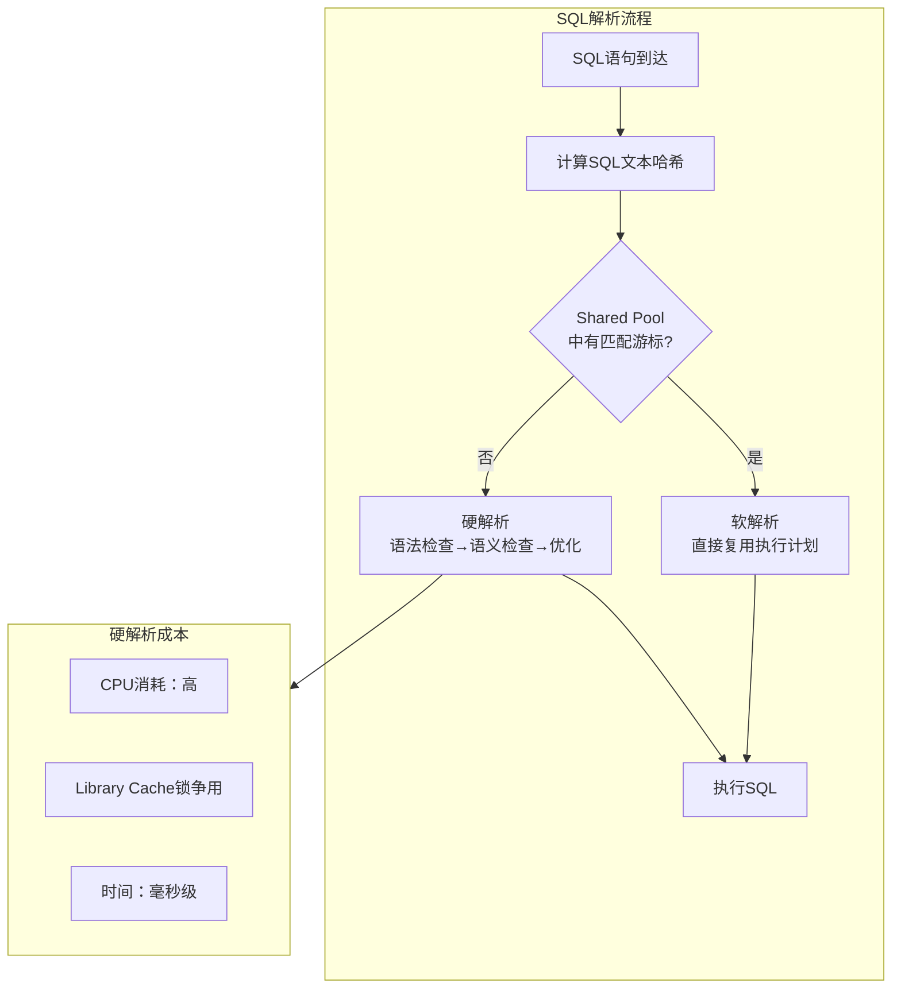
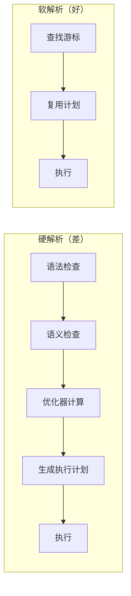
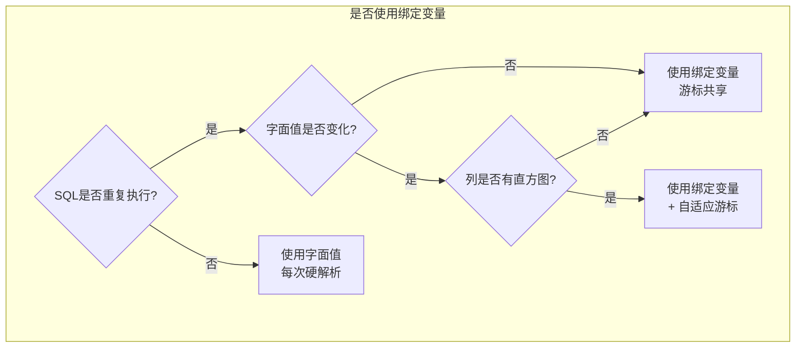

# Oracle绑定变量与硬解析

## 一、概述

### 1.1 一句话定义

Oracle绑定变量是SQL语句中的占位符（如`:id`），允许相同SQL文本使用不同参数值执行，从而实现游标共享、避免硬解析。
它在SQL开发和优化中出现和使用，解决因SQL字面值不同导致的硬解析开销过大、Shared Pool碎片化和CPU浪费问题。

### 1.2 为什么重要

- **不掌握的后果：** 每秒数千次硬解析消耗大量CPU，Shared Pool碎片化导致ORA-04031，系统吞吐量远低于硬件能力
- **掌握的价值：** 消除硬解析可将CPU使用率降低30-80%，是SQL优化中投入产出比最高的改进

### 1.3 适用场景

| 场景 | 说明 |
|------|------|
| 高并发OLTP | 大量相似SQL避免重复硬解析 |
| Shared Pool优化 | 减少游标数量，缓解内存碎片 |
| SQL注入防护 | 绑定变量天然防止SQL注入 |
| 性能调优 | 硬解析率高导致CPU瓶颈 |
| 代码规范 | 开发规范要求使用绑定变量 |

### 1.4 版本演进

| 版本 | 变化说明 |
|------|---------|
| 11gR2 | 自适应游标共享（Adaptive Cursor Sharing）成熟 |
| 12cR1 | CURSOR_SHARING=FORCE行为优化 |
| 12cR2 | 游标共享诊断增强 |
| 19c | 自动索引与绑定变量感知 |
| 21c | 游标共享建议器增强 |

## 二、术语与概念

### 2.1 核心术语表

| 术语 | 含义 | 类比 |
|------|------|------|
| 硬解析 | 完整的SQL解析过程（语法+语义+优化） | 从头写一份报告 |
| 软解析 | 复用已有执行计划，跳过优化阶段 | 复制粘贴已有报告 |
| 绑定变量 | SQL中的参数占位符（:var） | 报告中的空白填空 |
| 游标 | SQL在Shared Pool中的缓存 | 报告的存档 |
| 游标共享 | 多个会话复用同一个游标 | 多人共用一份报告 |
| CURSOR_SHARING | 参数，控制是否自动替换字面值为绑定变量 | 自动填空功能 |
| 绑定窥视 | 优化器在硬解析时查看绑定变量值 | 看填空内容决定方案 |
| 自适应游标 | 根据绑定变量值自动切换执行计划 | 根据填空内容选方案 |

### 2.2 SQL解析流程



## 三、架构与原理

### 3.1 硬解析 vs 软解析对比



### 3.2 工作原理

1. **SQL到达：** 应用发送SQL到数据库
2. **哈希计算：** Oracle计算SQL文本的哈希值
3. **游标查找：** 在Shared Pool中查找匹配的游标
4. **硬解析路径：** 未找到→语法检查→语义检查→优化器计算→生成计划→缓存游标
5. **软解析路径：** 找到→直接复用执行计划→执行
6. **绑定变量关键：** 使用绑定变量使SQL文本一致，提高游标命中率

**一句话总结：** 绑定变量的核心价值是让SQL文本保持一致，使后续执行可以走软解析路径，避免昂贵的硬解析。

### 3.3 绑定变量决策流程



## 四、功能详解

### 4.1 绑定变量使用方式

#### 功能说明

在不同编程环境中使用绑定变量的方法。

#### 操作步骤

```sql
-- SQL*Plus中使用绑定变量
VARIABLE v_id NUMBER
EXEC :v_id := 100
SELECT * FROM employees WHERE employee_id = :v_id;

-- PL/SQL中自动使用绑定变量（推荐）
DECLARE
    v_id NUMBER := 100;
    v_name VARCHAR2(100);
BEGIN
    -- PL/SQL自动将变量转为绑定变量
    SELECT last_name INTO v_name FROM employees WHERE employee_id = v_id;
END;
/

-- JDBC中使用绑定变量
-- PreparedStatement pstmt = conn.prepareStatement(
--     "SELECT * FROM employees WHERE employee_id = ?"
-- );
-- pstmt.setInt(1, 100);
-- ResultSet rs = pstmt.executeQuery();

-- 错误方式（不使用绑定变量）
-- Statement stmt = conn.createStatement();
-- stmt.executeQuery("SELECT * FROM employees WHERE employee_id = " + id);
-- 每次id不同都会硬解析！
```

### 4.2 CURSOR_SHARING参数

```sql
-- 查看当前设置
SHOW PARAMETER cursor_sharing;

-- 三种模式
-- EXACT（默认）：不替换，字面值不同则硬解析
ALTER SYSTEM SET cursor_sharing = EXACT;

-- FORCE：强制将字面值替换为绑定变量
ALTER SYSTEM SET cursor_sharing = FORCE;
-- 效果：SELECT * FROM t WHERE id = 100
-- 变为：SELECT * FROM t WHERE id = :"SYS_B_0"

-- SIMILAR（11g已废弃，等同FORCE）
-- 不推荐使用

-- 注意：CURSOR_SHARING=FORCE是临时方案
-- 根本解决方案是修改应用代码使用绑定变量
-- FORCE可能导致执行计划不是最优（因为优化器看不到实际值）
```

### 4.3 硬解析诊断

```sql
-- 步骤1：查看解析统计
SELECT name, value FROM v$sysstat
WHERE name IN (
    'parse count (hard)',      -- 硬解析次数
    'parse count (total)',     -- 总解析次数
    'session cursor cache hits', -- 游标缓存命中
    'parse count (failures)'   -- 解析失败次数
);

-- 计算硬解析比例
SELECT
    (SELECT value FROM v$sysstat WHERE name = 'parse count (hard)') AS hard_parse,
    (SELECT value FROM v$sysstat WHERE name = 'parse count (total)') AS total_parse,
    ROUND(
        (SELECT value FROM v$sysstat WHERE name = 'parse count (hard)') /
        NULLIF((SELECT value FROM v$sysstat WHERE name = 'parse count (total)'), 0) * 100,
        2
    ) AS hard_parse_pct;

-- 步骤2：查找高硬解析SQL
SELECT sql_id, sql_text, executions, parse_calls,
       ROUND(parse_calls / NULLIF(executions, 0), 2) AS parse_per_exec
FROM v$sql
WHERE parse_calls > 100
AND parse_calls > executions * 0.8
ORDER BY parse_calls DESC
FETCH FIRST 10 ROWS ONLY;

-- 步骤3：查看游标不可共享原因
SELECT sql_id, child_number, reason
FROM v$sql_shared_cursor
WHERE sql_id = 'abc123def';
```

### 4.4 绑定窥视与自适应游标

```sql
-- 绑定窥视问题示例
-- 数据分布不均匀时，优化器第一次窥视的值可能不代表后续查询

-- 查看自适应游标状态
SELECT sql_id, child_number, is_bind_sensitive, is_bind_aware,
       executions
FROM v$sql
WHERE sql_id = 'abc123def';

-- is_bind_sensitive = Y: 优化器感知绑定变量值可能影响计划
-- is_bind_aware = Y: 优化器已为不同值生成不同计划

-- 查看自适应游标统计
SELECT * FROM v$sql_cs_statistics WHERE sql_id = 'abc123def';
SELECT * FROM v$sql_cs_selectivity WHERE sql_id = 'abc123def';

-- 确保自适应特性启用
SHOW PARAMETER optimizer_adaptive;
-- optimizer_adaptive_plans = TRUE
```

### 4.5 Session Cursor Cache

```sql
-- 启用会话游标缓存（减少软解析开销）
ALTER SYSTEM SET session_cached_cursors = 100 SCOPE = SPFILE;
ALTER SYSTEM SET open_cursors = 300 SCOPE = BOTH;

-- 查看游标缓存命中率
SELECT name, value FROM v$sysstat
WHERE name LIKE '%cursor%cache%';

-- 查看当前会话的游标使用
SELECT sid, user_name, sql_text
FROM v$open_cursor
WHERE sid = SYS_CONTEXT('USERENV', 'SID')
ORDER BY sql_text;
```

## 五、性能与调优

### 5.1 性能基线

| 指标 | 正常范围 | 告警阈值 | 说明 |
|------|---------|---------|------|
| 硬解析比例 | < 1% | > 5% | 硬解析/总解析 |
| 硬解析/秒 | < 100 | > 1000 | 每秒硬解析次数 |
| 游标缓存命中 | > 80% | < 50% | session cursor cache hits |
| Shared Pool空闲 | > 20% | < 10% | 可用内存比例 |

### 5.2 调优建议

| 场景 | 建议 | 原因 |
|------|------|------|
| 硬解析率高 | 修改应用使用绑定变量 | 根本解决方案 |
| 无法修改应用 | CURSOR_SHARING=FORCE | 临时方案 |
| 游标不共享 | 检查v$sql_shared_cursor | 找出不共享原因 |
| 绑定窥视问题 | 使用自适应游标 | 自动调整执行计划 |

## 六、DFX能力

### 6.1 动态性能视图

| 视图名 | 用途 | 关键字段 |
|--------|------|---------|
| V$SQL | 游标信息 | SQL_ID, EXECUTIONS, PARSE_CALLS |
| V$SQL_SHARED_CURSOR | 游标不共享原因 | SQL_ID, REASON |
| V$SQL_CS_STATISTICS | 自适应游标统计 | SQL_ID, BIND_SET_HASH_VALUE |
| V$SYSSTAT | 系统统计 | NAME, VALUE |
| V$SESSION | 会话信息 | SID, SQL_ID |

### 6.2 监控脚本

```sql
-- 硬解析监控
SELECT sn.snap_id, sn.begin_interval_time,
       ss.value - LAG(ss.value) OVER (ORDER BY sn.snap_id) AS hard_parses
FROM dba_hist_sysstat ss
JOIN dba_hist_snapshot sn ON ss.snap_id = sn.snap_id
WHERE ss.stat_name = 'parse count (hard)'
AND sn.begin_interval_time > SYSDATE - 1
ORDER BY sn.snap_id;
```

## 七、实战案例

### 7.1 案例背景

- **场景**：某OLTP系统Oracle 19c，CPU使用率持续90%+
- **时间**：业务高峰期
- **现象**：AWR报告显示硬解析每秒3000次，Library Cache锁争用严重

### 7.2 诊断过程

**步骤1：确认硬解析率**

```sql
SELECT name, value FROM v$sysstat
WHERE name IN ('parse count (hard)', 'parse count (total)');
```
- → 发现：hard=3000/s，total=3500/s，硬解析比例85%
- → 判断：严重的硬解析问题

**步骤2：定位问题SQL**

```sql
SELECT sql_id, sql_text, executions, parse_calls
FROM v$sql
WHERE parse_calls > 1000
ORDER BY parse_calls DESC
FETCH FIRST 5 ROWS ONLY;
```
- → 发现：Top SQL为`SELECT * FROM orders WHERE order_id = 12345`，每个值都不同
- → 判断：应用未使用绑定变量

**步骤3：检查应用代码**

```java
// 发现问题代码
String sql = "SELECT * FROM orders WHERE order_id = " + orderId;
Statement stmt = conn.createStatement();
ResultSet rs = stmt.executeQuery(sql);
// 每次orderId不同，SQL文本不同，导致硬解析
```

**步骤4：修复代码**

```java
// 修复后使用PreparedStatement
String sql = "SELECT * FROM orders WHERE order_id = ?";
PreparedStatement pstmt = conn.prepareStatement(sql);
pstmt.setLong(1, orderId);
ResultSet rs = pstmt.executeQuery();
// SQL文本始终一致，只需软解析
```

### 7.3 解决结果

| 指标 | 解决前 | 解决后 |
|------|--------|--------|
| 硬解析/秒 | 3,000 | 50 |
| CPU使用率 | 90% | 45% |
| Library Cache锁争用 | Top 1等待事件 | 消失 |
| 系统吞吐量 | 5,000 TPS | 12,000 TPS |

### 7.4 复盘总结

- **根因：** 应用使用Statement拼接SQL，未使用PreparedStatement
- **教训：** 所有OLTP应用必须使用绑定变量；JDBC统一使用PreparedStatement

## 八、常见错误与排查

### 8.1 常见错误列表

| 问题 | 原因 | 解决方法 |
|------|------|---------|
| 硬解析率高 | 未使用绑定变量 | 修改应用代码 |
| ORA-04031 | Shared Pool碎片化 | 使用绑定变量+增大Shared Pool |
| 游标不共享 | 环境差异（schema/权限） | 检查v$sql_shared_cursor |
| 绑定窥视导致计划差 | 数据分布不均 | 使用自适应游标 |
| CURSOR_SHARING副作用 | 执行计划非最优 | 修改应用使用绑定变量 |

### 8.2 排查步骤

1. **检查硬解析率：** `SELECT * FROM v$sysstat WHERE name LIKE 'parse%'`
2. **定位问题SQL：** `SELECT * FROM v$sql ORDER BY parse_calls DESC`
3. **检查不共享原因：** `SELECT * FROM v$sql_shared_cursor`
4. **检查应用代码：** 确认是否使用PreparedStatement
5. **检查CURSOR_SHARING：** `SHOW PARAMETER cursor_sharing`

## 九、最佳实践

### 9.1 官方推荐

- 所有OLTP应用使用绑定变量（PreparedStatement）
- PL/SQL中变量自动作为绑定变量处理
- 硬解析比例控制在1%以下
- 使用CURSOR_SHARING=FORCE作为临时方案

### 9.2 社区经验

- 代码审查时重点检查SQL拼接
- 使用JDBC的PreparedStatement而非Statement
- 监控parse count (hard)建立告警
- 大数据量查询考虑使用绑定变量+动态采样

### 9.3 反模式

| 反模式 | 问题 | 正确做法 |
|--------|------|---------|
| SQL字符串拼接 | 每次硬解析 | 使用PreparedStatement |
| CURSOR_SHARING=FORCE长期用 | 执行计划可能非最优 | 修改应用使用绑定变量 |
| 不监控硬解析 | 问题积累无感知 | 监控parse count (hard) |
| 忽略游标不共享 | Shared Pool碎片化 | 检查v$sql_shared_cursor |
| 所有SQL都用Hint | 维护困难 | 绑定变量+统计信息 |

## 十、命令与视图汇总

### 10.1 命令列表

| 命令 | 适用场景 | 说明 |
|------|---------|------|
| `ALTER SYSTEM SET cursor_sharing = FORCE` | 临时方案 | 强制绑定变量替换 |
| `ALTER SYSTEM SET session_cached_cursors` | 游标缓存 | 减少软解析开销 |
| `ALTER SYSTEM SET open_cursors` | 游标限制 | 每会话最大游标数 |
| `VARIABLE / EXEC` | SQL*Plus绑定变量 | 测试绑定变量 |

### 10.2 视图列表

| 视图名 | 类型 | 用途 | 关键字段 |
|--------|------|------|---------|
| V$SQL | 动态 | 游标信息 | SQL_ID, PARSE_CALLS |
| V$SQL_SHARED_CURSOR | 动态 | 不共享原因 | REASON |
| V$SQL_CS_STATISTICS | 动态 | 自适应游标 | BIND_SET_HASH_VALUE |
| V$SYSSTAT | 动态 | 解析统计 | parse count (hard) |

## 十一、总结速查

### 11.1 黄金法则

1. **PreparedStatement** - 所有OLTP应用必须使用
2. **硬解析<1%** - 监控parse count (hard)
3. **CURSOR_SHARING** - 仅作为临时方案
4. **自适应游标** - 处理绑定窥视问题
5. **代码审查** - 检查SQL拼接

### 11.2 一页纸检查清单

| 现象/场景 | 原因 | 处理方案 |
|-----------|------|----------|
| 硬解析率高 | 未使用绑定变量 | 修改应用代码 |
| ORA-04031 | Shared Pool碎片 | 绑定变量+增大SP |
| 游标不共享 | 环境差异 | 检查v$sql_shared_cursor |
| 执行计划不稳定 | 绑定窥视 | 使用自适应游标 |
| CPU高但SQL简单 | 硬解析开销 | 消除硬解析 |

### 11.3 关键数字

| 指标 | 正常范围 | 告警阈值 | 说明 |
|------|---------|---------|------|
| 硬解析比例 | < 1% | > 5% | 硬解析/总解析 |
| 硬解析/秒 | < 100 | > 1000 | parse count (hard) |
| 游标缓存命中 | > 80% | < 50% | cursor cache hits |

## 附录

### A. 官方参考

- [Oracle Database Performance Tuning Guide - Shared Pool](https://docs.oracle.com/en/database/oracle/oracle-database/19c/tgdba/)
- [Oracle Database Development Guide - SQL Injection](https://docs.oracle.com/en/database/oracle/oracle-database/19c/adfns/)
- MOS Note: 296377.1 - "Cursor Sharing and Bind Variables"

### B. 数据字典

| 对象名 | 类型 | 说明 |
|--------|------|------|
| V$SQL | 动态视图 | 游标信息 |
| V$SQL_SHARED_CURSOR | 动态视图 | 不共享原因 |
| V$SQL_CS_STATISTICS | 动态视图 | 自适应游标 |
| V$OPEN_CURSOR | 动态视图 | 打开的游标 |

### C. 修订记录

| 日期 | 版本 | 修改内容 | 修改人 |
|------|------|---------|--------|
| 2026-07-02 | v1.0 | 初始版本 | YashanDB知识库生成器 |
| 2026-07-02 | v1.1 | 补充完整模板章节 | YashanDB知识库生成器 |
