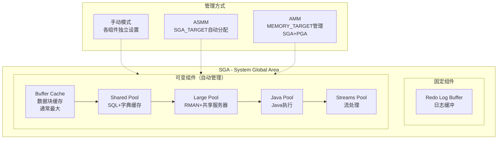
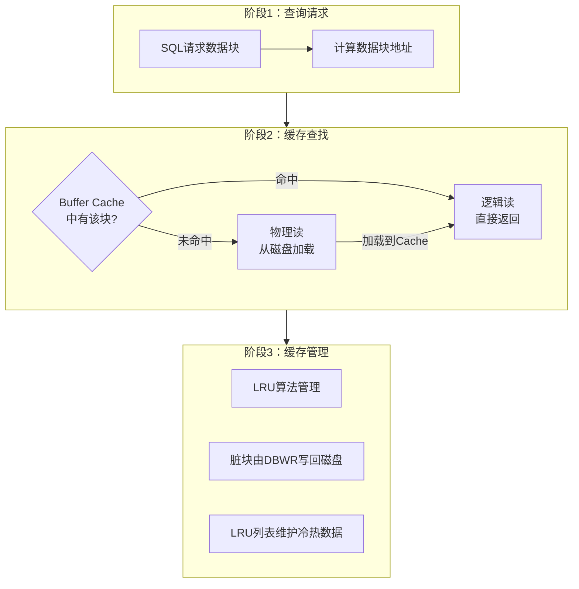
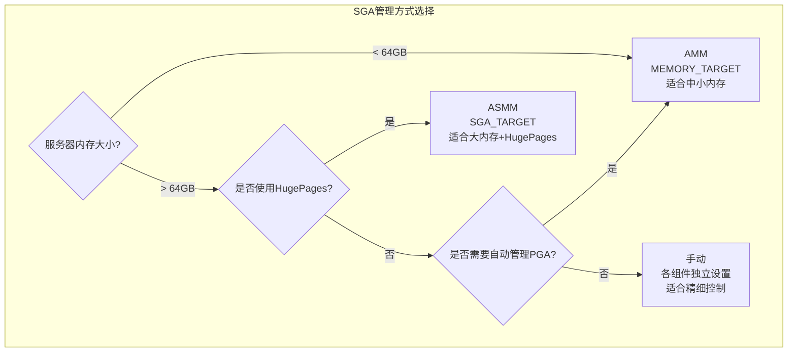

# Oracle SGA优化

## 一、概述

### 1.1 一句话定义

Oracle SGA（System Global Area）是所有服务器进程和后台进程共享的内存区域，包含Buffer Cache、Shared Pool、Large Pool等关键组件。SGA优化是通过合理配置各组件大小，最大化缓存命中率、减少物理I/O和硬解析的过程。
它在性能优化中出现和使用，解决内存配置不当导致的缓存不足、硬解析过多等性能问题。

### 1.2 为什么重要

- **不掌握的后果：** Buffer Cache不足导致大量物理读，Shared Pool不足导致频繁硬解析，系统性能远低于硬件能力
- **掌握的价值：** 合理配置SGA可使查询性能提升10-100倍，是性能优化中最基础也最重要的环节

### 1.3 适用场景

| 场景 | 说明 |
|------|------|
| 新系统上线 | 根据业务类型配置初始SGA |
| Buffer Cache优化 | 缓存命中率低于95% |
| Shared Pool优化 | 硬解析过多 |
| 内存管理方式选择 | AMM vs ASMM vs 手动 |
| 大内存服务器 | 配置HugePages |

### 1.4 版本演进

| 版本 | 变化说明 |
|------|---------|
| 11gR2 | AMM（MEMORY_TARGET）全面支持，但与HugePages不兼容 |
| 12cR1 | SGA自动管理增强，SHARED_POOL_SIZE最小值保护 |
| 12cR2 | 在线参数修改增强 |
| 19c | 自动索引优化Shared Pool使用 |
| 21c | 自动内存管理进一步增强 |

## 二、术语与概念

### 2.1 核心术语表

| 术语 | 含义 | 类比 |
|------|------|------|
| Buffer Cache | 数据块缓存，减少物理读 | 桌面上的常用文件 |
| Shared Pool | SQL和字典缓存，减少硬解析 | 共享的工具箱 |
| Library Cache | SQL执行计划缓存 | 工具箱里的工具 |
| Dictionary Cache | 数据字典缓存 | 工具箱里的说明书 |
| Large Pool | RMAN、共享服务器的大操作内存 | 特殊工具存放区 |
| ASMM | 自动共享内存管理 | 自动分配办公室空间 |
| AMM | 自动内存管理（SGA+PGA） | 自动管理整栋楼 |
| HugePages | 大页内存，减少TLB miss | 大号文件柜 |

### 2.2 SGA组件架构



## 三、架构与原理

### 3.1 Buffer Cache工作原理



### 3.2 工作原理

1. **数据请求：** SQL查询需要访问数据块时，先检查Buffer Cache
2. **缓存命中：** 如果数据块在Cache中（逻辑读），直接返回，无需I/O
3. **缓存未命中：** 如果不在Cache中（物理读），从磁盘加载到Cache
4. **LRU管理：** 使用LRU算法维护Cache中的数据块，频繁访问的保留
5. **DBWR写回：** 脏块（被修改的块）由DBWR进程异步写回磁盘

**一句话总结：** SGA优化的核心是最大化Buffer Cache命中率（减少物理读）和最大化Shared Pool命中率（减少硬解析）。

### 3.3 内存管理方式选择



## 四、功能详解

### 4.1 Buffer Cache优化

#### 功能说明

Buffer Cache是SGA中最大的组件，缓存从磁盘读取的数据块。

#### 操作步骤

```sql
-- 步骤1：查看Buffer Cache命中率
SELECT ROUND((1 - (phy.value / (cur.value + con.value))) * 100, 2) AS hit_ratio
FROM v$sysstat cur, v$sysstat con, v$sysstat phy
WHERE cur.name = 'db block gets'
  AND con.name = 'consistent gets'
  AND phy.name = 'physical reads';

-- 步骤2：查看Buffer Cache各组件
SELECT component, current_size/1024/1024 AS size_mb,
       min_size/1024/1024 AS min_mb
FROM v$sga_dynamic_components
WHERE component LIKE '%cache%'
ORDER BY current_size DESC;

-- 步骤3：配置Buffer Cache
ALTER SYSTEM SET db_cache_size = 4G SCOPE = BOTH;  -- 最小值
ALTER SYSTEM SET sga_target = 8G SCOPE = BOTH;       -- 自动管理

-- 步骤4：查看Buffer Cache建议
SELECT size_for_estimate AS size_mb,
       estd_physical_read_factor,
       estd_physical_reads
FROM v$db_cache_advice
WHERE name = 'DEFAULT'
AND advice_status = 'ON'
ORDER BY size_for_estimate;
-- 选择estd_physical_read_factor接近1.0的最小size

-- 步骤5：配置KEEP/RECYCLE缓冲池
ALTER SYSTEM SET db_keep_cache_size = 512M SCOPE = BOTH;
ALTER SYSTEM SET db_recycle_cache_size = 256M SCOPE = BOTH;

-- 将频繁访问的小表放入KEEP池
ALTER TABLE small_important_table STORAGE (BUFFER_POOL KEEP);
```

### 4.2 Shared Pool优化

```sql
-- 步骤1：查看Library Cache命中率
SELECT namespace,
       gets, gethitratio,
       pins, pinhitratio,
       reloads, invalidations
FROM v$librarycache
WHERE namespace IN ('SQL AREA', 'TABLE/PROCEDURE', 'BODY', 'TRIGGER');

-- 总体Library Cache命中率
SELECT ROUND((1 - SUM(reloads)/NULLIF(SUM(pins), 0)) * 100, 2) AS hit_ratio
FROM v$librarycache;

-- 步骤2：查看Shared Pool使用
SELECT component, current_size/1024/1024 AS size_mb
FROM v$sga_dynamic_components
WHERE component LIKE '%shared%';

-- 步骤3：查看Shared Pool子组件
SELECT pool, name, bytes/1024/1024 AS mb
FROM v$sgastat
WHERE pool = 'shared pool'
ORDER BY bytes DESC
FETCH FIRST 10 ROWS ONLY;

-- 步骤4：配置Shared Pool
ALTER SYSTEM SET shared_pool_size = 2G SCOPE = BOTH;  -- 最小值

-- 步骤5：减少硬解析（关键！）
-- 使用绑定变量
-- 错误方式：
SELECT * FROM employees WHERE employee_id = 100;
SELECT * FROM employees WHERE employee_id = 101;
-- 正确方式：
SELECT * FROM employees WHERE employee_id = :id;

-- 检查硬解析比例
SELECT name, value FROM v$sysstat
WHERE name IN ('parse count (total)', 'parse count (hard)');

-- 查看cursor_sharing设置
SHOW PARAMETER cursor_sharing;
-- 如果应用未使用绑定变量，可设置cursor_sharing = FORCE
```

### 4.3 SGA自动管理

```sql
-- ASMM配置（推荐大内存服务器）
ALTER SYSTEM SET sga_target = 8G SCOPE = BOTH;
ALTER SYSTEM SET sga_max_size = 12G SCOPE = SPFILE;  -- 需重启

-- 设置各组件最小值（防止自动管理过度收缩）
ALTER SYSTEM SET db_cache_size = 4G SCOPE = BOTH;
ALTER SYSTEM SET shared_pool_size = 2G SCOPE = BOTH;
ALTER SYSTEM SET large_pool_size = 256M SCOPE = BOTH;

-- AMM配置（中小内存服务器）
ALTER SYSTEM SET memory_target = 10G SCOPE = BOTH;
ALTER SYSTEM SET memory_max_target = 14G SCOPE = SPFILE;

-- 查看SGA信息
SELECT * FROM v$sgainfo;
SELECT * FROM v$sga;
SELECT * FROM v$sga_dynamic_components;

-- 查看SGA各组件当前分配
SELECT component, oper_type, oper_mode,
       initial_size/1024/1024 AS init_mb,
       target_size/1024/1024 AS target_mb,
       current_size/1024/1024 AS current_mb,
       last_oper_type
FROM v$sga_dynamic_components
ORDER BY current_size DESC;
```

### 4.4 HugePages配置

```bash
# Linux HugePages配置（大内存服务器推荐）
# 步骤1：计算所需HugePages数
# HugePages = SGA大小 / HugePage大小 + 额外10%
# 默认HugePage大小 = 2MB
# SGA = 8G → 需要 8192/2 * 1.1 = 4506 个HugePages

# 步骤2：配置系统参数
echo "vm.nr_hugepages = 4506" >> /etc/sysctl.conf
sysctl -p

# 步骤3：配置Oracle使用HugePages
# 注意：使用HugePages时不能使用AMM
echo "USE_LARGE_PAGES=ONLY" >> $ORACLE_HOME/hs/admin/oracle_oraenv

# 步骤4：重启数据库使配置生效
```

```sql
-- 验证HugePages使用
SELECT component, current_size/1024/1024 AS mb
FROM v$sga_dynamic_components;
-- 如果使用了HugePages，SGA会显示正确的大小
```

## 五、性能与调优

### 5.1 性能基线

| 指标 | 正常范围 | 告警阈值 | 说明 |
|------|---------|---------|------|
| Buffer Cache Hit | > 95% | < 90% | 缓存命中率 |
| Library Cache Hit | > 99% | < 95% | SQL缓存命中率 |
| 硬解析比例 | < 1% | > 5% | 硬解析占比 |
| SGA/物理内存 | 60-80% | > 85% | SGA占比 |

### 5.2 调优建议

| 场景 | 建议 | 原因 |
|------|------|------|
| Buffer Cache低 | 增大SGA_TARGET或设DB_CACHE_SIZE最小值 | 提高缓存命中率 |
| 硬解析多 | 使用绑定变量，增大SHARED_POOL_SIZE | 减少CPU开销 |
| 大内存服务器 | 使用HugePages + ASMM | 减少TLB miss |
| 自动管理收缩 | 设置各组件最小值 | 防止关键组件被过度收缩 |

## 六、DFX能力

### 6.1 动态性能视图

| 视图名 | 用途 | 关键字段 |
|--------|------|---------|
| V$SGAINFO | SGA区域信息 | NAME, BYTES, RESIZEABLE |
| V$SGA_DYNAMIC_COMPONENTS | SGA动态组件 | COMPONENT, CURRENT_SIZE |
| V$SGASTAT | SGA详细统计 | POOL, NAME, BYTES |
| V$DB_CACHE_ADVICE | Buffer Cache建议 | SIZE_FOR_ESTIMATE |
| V$SHARED_POOL_ADVICE | Shared Pool建议 | SHARED_POOL_SIZE_FOR_ESTIMATE |
| V$LIBRARYCACHE | Library Cache统计 | NAMESPACE, GETHITRATIO |

### 6.2 监控脚本

```sql
-- SGA健康检查
SELECT component, current_size/1024/1024 AS current_mb,
       min_size/1024/1024 AS min_mb,
       max_size/1024/1024 AS max_mb
FROM v$sga_dynamic_components
ORDER BY current_size DESC;

-- Buffer Cache命中率
SELECT name, value FROM v$sysstat
WHERE name IN ('db block gets', 'consistent gets', 'physical reads');
```

## 七、实战案例

### 7.1 案例背景

- **场景**：某ERP系统Oracle 19c，SGA=4G，Buffer Cache命中率88%
- **时间**：业务高峰期
- **现象**：大量物理读导致I/O等待高，响应时间劣化

### 7.2 诊断过程

**步骤1：检查Buffer Cache命中率**

```sql
SELECT ROUND((1 - (phy.value / (cur.value + con.value))) * 100, 2)
FROM v$sysstat cur, v$sysstat con, v$sysstat phy
WHERE cur.name = 'db block gets'
AND con.name = 'consistent gets'
AND phy.name = 'physical reads';
```
- → 发现：Buffer Cache命中率 = 88%
- → 判断：低于95%的正常范围

**步骤2：检查SGA配置**

```sql
SELECT component, current_size/1024/1024 AS mb
FROM v$sga_dynamic_components
ORDER BY current_size DESC;
```
- → 发现：SGA_TARGET=4G，db_cache_size被自动收缩到2.5G
- → 判断：SGA总量不足，且db_cache没有设置最小值

**步骤3：查看Buffer Cache建议**

```sql
SELECT size_for_estimate AS mb,
       estd_physical_read_factor
FROM v$db_cache_advice
WHERE name = 'DEFAULT'
ORDER BY size_for_estimate;
```
- → 发现：当db_cache=4G时，estd_physical_read_factor=1.0
- → 判断：需要将db_cache增大到4G

**步骤4：优化方案**

```sql
-- 增大SGA
ALTER SYSTEM SET sga_target = 8G SCOPE = BOTH;

-- 设置Buffer Cache最小值
ALTER SYSTEM SET db_cache_size = 4G SCOPE = BOTH;

-- 设置Shared Pool最小值
ALTER SYSTEM SET shared_pool_size = 2G SCOPE = BOTH;
```

### 7.3 解决结果

| 指标 | 解决前 | 解决后 |
|------|--------|--------|
| Buffer Cache Hit | 88% | 98% |
| 物理读/秒 | 50,000 | 5,000 |
| 平均响应时间 | 500ms | 50ms |

### 7.4 复盘总结

- **根因：** SGA配置过小，且未设置db_cache_size最小值导致被自动管理收缩
- **教训：** 对关键SGA组件设置最小值，不要完全依赖自动管理

## 八、常见错误与排查

### 8.1 常见错误列表

| 错误代码 | 错误信息 | 原因 | 解决方法 |
|---------|---------|------|---------|
| ORA-04031 | unable to allocate shared memory | Shared Pool不足 | 增大SHARED_POOL_SIZE |
| ORA-000200 | critical: cannot create process | SGA过大，OS内存不足 | 减小SGA或增加物理内存 |
| ORA-27102 | out of memory | HugePages配置不当 | 调整nr_hugepages |
| ORA-04031 (shared pool) | 碎片化严重 | 硬解析过多 | 使用绑定变量 |

### 8.2 排查步骤

1. **检查SGA配置：** `SELECT * FROM v$sgainfo`
2. **检查Buffer Cache：** 计算命中率
3. **检查Shared Pool：** Library Cache命中率
4. **查看alert.log：** ORA-04031相关错误
5. **检查OS内存：** `free -g` 确认OS有足够内存

### 8.3 解决方案

**方案一：紧急释放Shared Pool**

```sql
ALTER SYSTEM FLUSH SHARED_POOL;
-- 然后优化SQL使用绑定变量
```

**方案二：增大SGA**

```sql
ALTER SYSTEM SET sga_target = 12G SCOPE = BOTH;
ALTER SYSTEM SET sga_max_size = 16G SCOPE = SPFILE;
-- sga_max_size需要重启
```

## 九、最佳实践

### 9.1 官方推荐

- 使用SPFILE管理参数
- 大内存服务器（>64G）使用HugePages + ASMM
- 对关键组件设置最小值（db_cache_size, shared_pool_size）
- 定期导出SPFILE备份

### 9.2 社区经验

- SGA不超过物理内存的80%，留足OS内存
- Buffer Cache命中率低于90%必须优化
- 硬解析比例超过1%说明绑定变量使用不当
- AMM与HugePages不兼容，大内存不要用AMM

### 9.3 反模式

| 反模式 | 问题 | 正确做法 |
|--------|------|---------|
| 不设组件最小值 | ASMM过度收缩关键组件 | 设置db_cache_size和shared_pool_size最小值 |
| 大内存用AMM | 与HugePages不兼容 | 大内存用ASMM+HugePages |
| SGA占满内存 | OS层面内存不足 | SGA不超过物理内存80% |
| 不检查硬解析 | CPU浪费在解析上 | 监控parse count (hard) |
| 不备份SPFILE | 参数丢失无法恢复 | 定期CREATE PFILE FROM SPFILE |

## 十、命令与视图汇总

### 10.1 命令列表

| 命令 | 适用场景 | 说明 |
|------|---------|------|
| `ALTER SYSTEM SET sga_target` | 调整SGA | ASMM模式 |
| `ALTER SYSTEM SET db_cache_size` | 设置Buffer Cache最小值 | 防止被收缩 |
| `ALTER SYSTEM SET shared_pool_size` | 设置Shared Pool最小值 | 防止被收缩 |
| `ALTER SYSTEM FLUSH SHARED_POOL` | 紧急释放 | 清除缓存 |
| `CREATE PFILE FROM SPFILE` | 备份参数 | 导出参数文件 |

### 10.2 视图列表

| 视图名 | 类型 | 用途 | 关键字段 |
|--------|------|------|---------|
| V$SGAINFO | 动态 | SGA信息 | NAME, BYTES |
| V$SGA_DYNAMIC_COMPONENTS | 动态 | 动态组件 | COMPONENT, CURRENT_SIZE |
| V$DB_CACHE_ADVICE | 动态 | Cache建议 | SIZE_FOR_ESTIMATE |
| V$LIBRARYCACHE | 动态 | Library Cache | NAMESPACE, GETHITRATIO |
| V$SGASTAT | 动态 | SGA详细统计 | POOL, NAME, BYTES |

## 十一、总结速查

### 11.1 黄金法则

1. **Buffer Cache > 95%** - 缓存命中率是核心指标
2. **设置最小值** - db_cache_size和shared_pool_size设最小值
3. **绑定变量** - 减少硬解析，提高Shared Pool效率
4. **HugePages** - 大内存服务器必须使用
5. **SGA ≤ 80%内存** - 留足OS内存

### 11.2 一页纸检查清单

| 现象/场景 | 原因 | 处理方案 |
|-----------|------|----------|
| Buffer Cache低 | SGA不足或未设最小值 | 增大SGA，设db_cache_size最小值 |
| 硬解析多 | 未使用绑定变量 | 优化SQL使用绑定变量 |
| ORA-04031 | Shared Pool碎片化 | FLUSH SHARED_POOL + 优化SQL |
| SGA被收缩 | 未设组件最小值 | 设置db_cache_size和shared_pool_size |
| OS内存不足 | SGA占满内存 | SGA不超过物理内存80% |

### 11.3 关键数字

| 指标 | 正常范围 | 告警阈值 | 说明 |
|------|---------|---------|------|
| Buffer Cache Hit | > 95% | < 90% | 缓存命中率 |
| Library Cache Hit | > 99% | < 95% | SQL缓存命中率 |
| 硬解析比例 | < 1% | > 5% | 硬解析占比 |
| SGA/物理内存 | 60-80% | > 85% | SGA占比 |

## 附录

### A. 官方参考

- [Oracle Database Performance Tuning Guide - SGA](https://docs.oracle.com/en/database/oracle/oracle-database/19c/tgdba/)
- [Oracle Database Reference - SGA Views](https://docs.oracle.com/en/database/oracle/oracle-database/19c/refrn/)
- MOS Note: 272746.1 - "SGA Memory Management"

### B. 数据字典

| 对象名 | 类型 | 说明 |
|--------|------|------|
| V$SGAINFO | 动态视图 | SGA区域信息 |
| V$SGA_DYNAMIC_COMPONENTS | 动态视图 | SGA动态组件 |
| V$DB_CACHE_ADVICE | 动态视图 | Buffer Cache建议 |
| V$LIBRARYCACHE | 动态视图 | Library Cache统计 |

### C. 修订记录

| 日期 | 版本 | 修改内容 | 修改人 |
|------|------|---------|--------|
| 2026-07-02 | v1.0 | 初始版本 | YashanDB知识库生成器 |
| 2026-07-02 | v1.1 | 补充完整模板章节 | YashanDB知识库生成器 |
