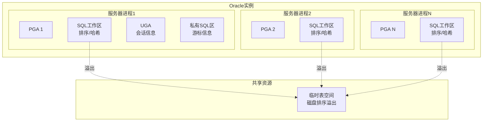
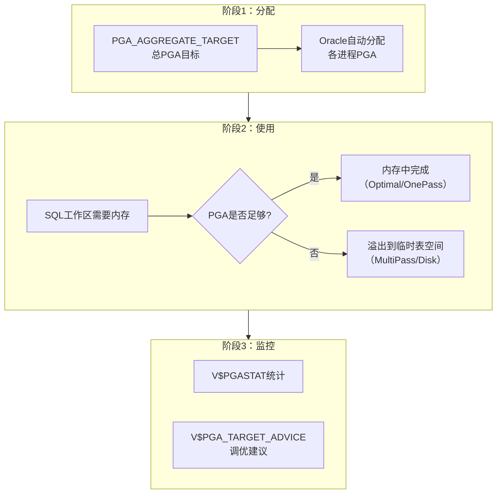
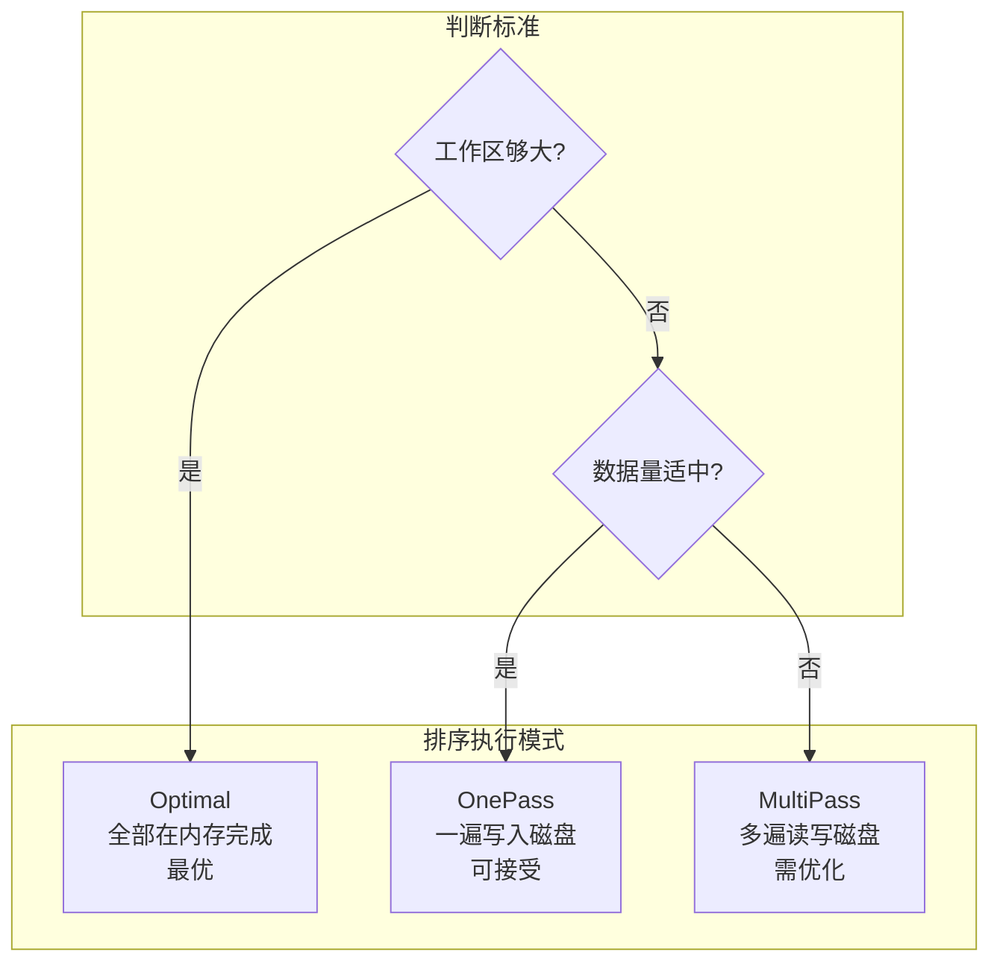

# Oracle PGA优化

## 一、概述

### 1.1 一句话定义

Oracle PGA（Program Global Area）是每个服务器进程私有的内存区域，用于排序、哈希连接、位图合并等操作的内存工作区。
它在性能优化中出现和使用，解决因PGA不足导致的磁盘排序、哈希连接溢出到临时表空间造成的性能下降问题。

### 1.2 为什么重要

- **不掌握的后果：** 大量排序和哈希操作溢出到磁盘（临时表空间），I/O开销暴增，查询响应时间从毫秒级退化到秒级甚至分钟级
- **掌握的价值：** 合理配置PGA可使排序操作全部在内存中完成，查询性能提升10-100倍

### 1.3 适用场景

| 场景 | 说明 |
|------|------|
| 排序性能优化 | ORDER BY、GROUP BY操作慢 |
| 哈希连接优化 | Hash Join溢出到临时表空间 |
| 批量操作调优 | 大批量INSERT/UPDATE的内存优化 |
| 临时表空间告警 | 临时表空间使用率持续高位 |
| 报表系统优化 | OLAP场景大量排序和聚合 |

### 1.4 版本演进

| 版本 | 变化说明 |
|------|---------|
| 11gR2 | PGA_AGGREGATE_TARGET自动管理，PGA_AGGREGATE_LIMIT未引入 |
| 12cR1 | 引入PGA_AGGREGATE_LIMIT，防止单进程占用过多PGA |
| 12cR2 | 自动PGA管理增强，临时表空间优化 |
| 19c | 自动PGA调优建议更准确 |
| 21c | 自动PGA聚合进一步增强 |

## 二、术语与概念

### 2.1 核心术语表

| 术语 | 含义 | 类比 |
|------|------|------|
| PGA | 程序全局区，每个进程私有内存 | 每个人的办公桌 |
| SQL Work Area | SQL工作区，排序/哈希操作的内存空间 | 办公桌上的工作区域 |
| 内存排序 | 排序操作在PGA中完成 | 在桌上整理文件 |
| 磁盘排序 | 排序溢出到临时表空间 | 桌子太小，文件放地上 |
| ONEPASS | 一遍完成（只需一次磁盘写回） | 整理一次就完成 |
| MULTIPASS | 多遍完成（需要多次磁盘读写） | 反复整理，效率极低 |
| over allocation | PGA分配超限 | 办公桌不够用 |
| 临时表空间 | 磁盘排序的溢出存储 | 地上的文件柜 |

### 2.2 PGA内存架构



## 三、架构与原理

### 3.1 PGA自动管理原理



### 3.2 工作原理

1. **PGA分配：** Oracle根据PGA_AGGREGATE_TARGET自动为各进程分配PGA
2. **工作区使用：** 排序、哈希连接等操作使用SQL工作区内存
3. **内存排序：** 如果工作区足够大，排序在内存中完成（Optimal模式）
4. **磁盘排序：** 工作区不足时，数据溢出到临时表空间（MultiPass模式）
5. **自动调整：** Oracle根据负载动态调整各进程的PGA分配

**一句话总结：** PGA优化的目标是让排序和哈希操作全部在内存中完成（Optimal模式），避免溢出到磁盘。

### 3.3 排序执行模式



## 四、功能详解

### 4.1 PGA参数配置

#### 功能说明

通过PGA_AGGREGATE_TARGET和PGA_AGGREGATE_LIMIT控制PGA总量。

#### 操作步骤

```sql
-- 步骤1：查看当前PGA配置
SHOW PARAMETER pga;
SELECT name, value/1024/1024 AS mb
FROM v$parameter
WHERE name LIKE 'pga%';

-- 步骤2：设置PGA目标值
-- OLTP系统：PGA = 物理内存 × 20%
-- OLAP系统：PGA = 物理内存 × 40%
ALTER SYSTEM SET pga_aggregate_target = 4G SCOPE = BOTH;

-- 步骤3：设置PGA上限（12c+）
-- 防止单进程占用过多PGA
ALTER SYSTEM SET pga_aggregate_limit = 8G SCOPE = BOTH;

-- 步骤4：查看PGA使用统计
SELECT name, value/1024/1024 AS mb
FROM v$pgastat
WHERE name IN (
    'aggregate PGA target parameter',
    'aggregate PGA auto target',
    'total PGA allocated',
    'total PGA used for auto workareas',
    'maximum PGA allocated',
    'over allocation count',
    'extra bytes read/written to disk'
);
```

### 4.2 PGA调优建议

```sql
-- 查看PGA调优建议
SELECT pga_target_for_estimate/1024/1024 AS target_mb,
       pga_target_factor,
       estd_extra_bytes_rw/1024/1024 AS extra_rw_mb,
       estd_pga_cache_hit_percentage AS hit_pct,
       estd_overalloc_count AS overalloc
FROM v$pga_target_advice
ORDER BY pga_target_for_estimate;

-- 解读：
-- hit_pct < 100% 说明有磁盘排序
-- overalloc > 0 说明PGA总量不足
-- 选择hit_pct接近100%且overalloc=0的最小target
```

### 4.3 排序监控与优化

```sql
-- 查看排序统计
SELECT name, value FROM v$sysstat
WHERE name LIKE '%sort%';

-- 计算磁盘排序比例
SELECT disk.value AS disk_sorts,
       mem.value AS memory_sorts,
       ROUND(disk.value / NULLIF(disk.value + mem.value, 0) * 100, 2) AS disk_pct
FROM v$sysstat disk, v$sysstat mem
WHERE disk.name = 'sorts (disk)'
AND mem.name = 'sorts (memory)';

-- 查看大排序会话
SELECT s.sid, s.serial#, s.username, s.program,
       w.tablespace,
       ROUND(w.blocks * (SELECT value FROM v$parameter WHERE name = 'db_block_size') / 1024 / 1024) AS temp_mb
FROM v$session s
JOIN v$sort_usage w ON s.saddr = w.session_addr
ORDER BY w.blocks DESC;

-- 查看使用临时表空间的SQL
SELECT s.sid, s.serial#, s.username,
       q.sql_id, q.sql_text
FROM v$session s
JOIN v$sort_usage w ON s.saddr = w.session_addr
JOIN v$sql q ON s.sql_id = q.sql_id
WHERE w.blocks > 1000;
```

### 4.4 临时表空间优化

```sql
-- 查看临时表空间使用
SELECT tablespace_name,
       ROUND(SUM(bytes_used)/1024/1024) AS used_mb,
       ROUND(SUM(bytes_free)/1024/1024) AS free_mb,
       ROUND(SUM(bytes_used + bytes_free)/1024/1024) AS total_mb
FROM v$temp_space_header
GROUP BY tablespace_name;

-- 查看临时文件
SELECT file_name, bytes/1024/1024 AS mb, autoextensible, maxbytes/1024/1024 AS max_mb
FROM dba_temp_files;

-- 添加临时文件
ALTER TABLESPACE temp ADD TEMPFILE '/u02/oradata/temp02.dbf' SIZE 10G AUTOEXTEND ON MAXSIZE 32G;

-- 创建临时表空间组（12c+）
-- 允许一个排序操作使用多个临时表空间
ALTER TABLESPACE temp TABLESPACE GROUP temp_group;
ALTER TABLESPACE temp2 TABLESPACE GROUP temp_group;
ALTER DATABASE DEFAULT TEMPORARY TABLESPACE temp_group;
```

### 4.5 哈希连接优化

```sql
-- 查看哈希连接统计
SELECT name, value FROM v$sysstat
WHERE name LIKE '%hash%';

-- 哈希连接工作区大小
-- 由PGA自动管理，增大PGA_AGGREGATE_TARGET可增加哈希工作区

-- 查看哈希连接溢出
SELECT name, value FROM v$sysstat
WHERE name IN ('hash join key size', 'hash join spillover created');

-- 优化哈希连接
-- 1. 增大PGA
-- 2. 优化SQL减少哈希表大小
-- 3. 使用NL连接替代（小表驱动时）
```

## 五、性能与调优

### 5.1 性能基线

| 指标 | 正常范围 | 告警阈值 | 说明 |
|------|---------|---------|------|
| PGA缓存命中率 | > 95% | < 80% | 内存排序比例 |
| 磁盘排序数 | 接近0 | > 100 | 溢出到临时表空间 |
| over allocation | 0 | > 0 | PGA总量不足 |
| 临时表空间使用率 | < 70% | > 90% | 临时空间不足 |

### 5.2 调优建议

| 场景 | 建议 | 原因 |
|------|------|------|
| 磁盘排序多 | 增大PGA_AGGREGATE_TARGET | 更多排序在内存完成 |
| over allocation | 增大PGA_AGGREGATE_LIMIT | 允许更多PGA分配 |
| 临时表空间满 | 添加临时文件或优化SQL | 减少磁盘排序需求 |
| 单进程PGA过大 | 设置PGA_AGGREGATE_LIMIT | 防止单进程占用过多 |

## 六、DFX能力

### 6.1 动态性能视图

| 视图名 | 用途 | 关键字段 |
|--------|------|---------|
| V$PGASTAT | PGA使用统计 | NAME, VALUE |
| V$PGA_TARGET_ADVICE | PGA调优建议 | PGA_TARGET_FOR_ESTIMATE |
| V$PROCESS | 进程PGA使用 | PGA_ALLOCATED, PGA_USED_MEM |
| V$SORT_USAGE | 排序使用 | TABLESPACE, BLOCKS |
| V$TEMPSEG_USAGE | 临时段使用 | TABLESPACE, BLOCKS |

### 6.2 监控脚本

```sql
-- PGA健康检查
SELECT name, value/1024/1024 AS mb
FROM v$pgastat
WHERE name IN (
    'aggregate PGA target parameter',
    'total PGA allocated',
    'maximum PGA allocated',
    'over allocation count'
);

-- 查看各进程PGA使用
SELECT pid, spid, pga_alloc_mem/1024/1024 AS alloc_mb,
       pga_used_mem/1024/1024 AS used_mb,
       pga_free_mem/1024/1024 AS free_mb
FROM v$process
ORDER BY pga_alloc_mem DESC
FETCH FIRST 10 ROWS ONLY;
```

## 七、实战案例

### 7.1 案例背景

- **场景**：某报表系统Oracle 19c，月末生成报表耗时2小时
- **时间**：月末结账
- **现象**：AWR报告显示大量"direct path write temp"等待，磁盘排序数超过10000

### 7.2 诊断过程

**步骤1：检查排序统计**

```sql
SELECT name, value FROM v$sysstat
WHERE name LIKE '%sort%';
```
- → 发现：sorts (disk) = 12,345，sorts (memory) = 50,000
- → 判断：磁盘排序比例20%，过高

**步骤2：检查PGA配置**

```sql
SELECT name, value/1024/1024 AS mb FROM v$pgastat
WHERE name IN ('aggregate PGA target parameter', 'total PGA allocated', 'over allocation count');
```
- → 发现：PGA target = 1G，allocated = 980M，over allocation = 523
- → 判断：PGA严重不足，需要增大

**步骤3：定位大排序SQL**

```sql
SELECT s.sid, q.sql_id, q.sql_text,
       ROUND(w.blocks * 8192 / 1024 / 1024) AS temp_mb
FROM v$session s
JOIN v$sort_usage w ON s.saddr = w.session_addr
JOIN v$sql q ON s.sql_id = q.sql_id
ORDER BY w.blocks DESC;
```
- → 发现：Top SQL是一个大表GROUP BY操作，每次排序需要2GB临时空间
- → 判断：需要增大PGA并优化SQL

**步骤4：优化方案**

```sql
-- 增大PGA
ALTER SYSTEM SET pga_aggregate_target = 8G SCOPE = BOTH;
ALTER SYSTEM SET pga_aggregate_limit = 16G SCOPE = BOTH;

-- 优化SQL：添加索引避免全表排序
CREATE INDEX idx_report_date ON sales(report_date);
```

### 7.3 解决结果

| 指标 | 解决前 | 解决后 |
|------|--------|--------|
| 磁盘排序数 | 12,345 | 50 |
| PGA over allocation | 523 | 0 |
| 报表生成时间 | 2小时 | 15分钟 |
| 临时表空间峰值 | 30GB | 2GB |

### 7.4 复盘总结

- **根因：** PGA配置过小（1G），报表系统大量排序操作溢出到磁盘
- **教训：** OLAP/报表系统PGA应配置为物理内存的30-40%；同时优化SQL减少排序数据量

## 八、常见错误与排查

### 8.1 常见错误列表

| 错误代码 | 错误信息 | 原因 | 解决方法 |
|---------|---------|------|---------|
| ORA-04036 | PGA memory exceeds limit | 单进程PGA超限 | 增大PGA_AGGREGATE_LIMIT |
| ORA-01652 | unable to extend temp segment | 临时表空间不足 | 添加临时文件或增大 |
| ORA-04036 + over allocation | PGA总量不足 | 所有进程PGA总和超限 | 增大PGA_AGGREGATE_TARGET |
| ORA-00955 | name is already used | 临时表空间名冲突 | 使用不同名称 |

### 8.2 排查步骤

1. **检查PGA统计：** `SELECT * FROM v$pgastat`
2. **检查排序比例：** `sorts (disk)` vs `sorts (memory)`
3. **检查临时表空间：** `SELECT * FROM v$temp_space_header`
4. **定位大排序SQL：** `SELECT * FROM v$sort_usage`
5. **查看PGA建议：** `SELECT * FROM v$pga_target_advice`

### 8.3 解决方案

**方案一：增大PGA**

```sql
ALTER SYSTEM SET pga_aggregate_target = 8G SCOPE = BOTH;
ALTER SYSTEM SET pga_aggregate_limit = 16G SCOPE = BOTH;
```

**方案二：优化SQL减少排序**

```sql
-- 添加索引避免排序
CREATE INDEX idx_sort_col ON table_name(sort_column);

-- 或使用NO_SORT操作
-- 改写SQL避免不必要的ORDER BY
```

## 九、最佳实践

### 9.1 官方推荐

- OLTP系统PGA = 物理内存 × 20%，OLAP系统 = 40%
- 设置PGA_AGGREGATE_LIMIT防止单进程占用过多
- 磁盘排序比例应接近0%
- 临时表空间预留足够空间（至少为最大排序的2倍）

### 9.2 社区经验

- 报表系统PGA宁大勿小，排序溢出代价极高
- 监控over allocation指标，大于0就说明PGA不够
- 大排序SQL优先优化（添加索引）而非一味增大PGA
- 临时表空间使用本地管理，减少空间管理开销

### 9.3 反模式

| 反模式 | 问题 | 正确做法 |
|--------|------|---------|
| PGA设置过小 | 大量磁盘排序 | OLTP 20%，OLAP 40% |
| 不设PGA_AGGREGATE_LIMIT | 单进程可能耗尽内存 | 设置LIMIT = 2×TARGET |
| 忽略磁盘排序 | 性能持续劣化 | 监控sorts (disk) |
| 临时表空间太小 | ORA-01652错误 | 预留足够空间 |
| 不优化SQL只加PGA | 治标不治本 | 优先优化SQL减少排序 |

## 十、命令与视图汇总

### 10.1 命令列表

| 命令 | 适用场景 | 说明 |
|------|---------|------|
| `ALTER SYSTEM SET pga_aggregate_target` | 调整PGA目标 | 控制PGA总量 |
| `ALTER SYSTEM SET pga_aggregate_limit` | 设置PGA上限 | 防止单进程超限 |
| `ALTER TABLESPACE temp ADD TEMPFILE` | 扩容临时表空间 | 添加临时文件 |
| `ALTER TABLESPACE ... TABLESPACE GROUP` | 临时表空间组 | 允许跨表空间排序 |

### 10.2 视图列表

| 视图名 | 类型 | 用途 | 关键字段 |
|--------|------|------|---------|
| V$PGASTAT | 动态 | PGA统计 | NAME, VALUE |
| V$PGA_TARGET_ADVICE | 动态 | PGA调优建议 | PGA_TARGET_FOR_ESTIMATE |
| V$PROCESS | 动态 | 进程PGA使用 | PGA_ALLOCATED |
| V$SORT_USAGE | 动态 | 排序使用 | TABLESPACE, BLOCKS |
| V$SYSSTAT | 动态 | 排序统计 | sorts (disk), sorts (memory) |

## 十一、总结速查

### 11.1 黄金法则

1. **PGA够大** - OLTP 20%内存，OLAP 40%内存
2. **零磁盘排序** - 所有排序在内存完成
3. **设置上限** - PGA_AGGREGATE_LIMIT = 2×TARGET
4. **优化SQL** - 添加索引减少排序数据量
5. **监控over allocation** - 大于0就增大PGA

### 11.2 一页纸检查清单

| 现象/场景 | 原因 | 处理方案 |
|-----------|------|----------|
| 磁盘排序多 | PGA不足 | 增大PGA_AGGREGATE_TARGET |
| over allocation > 0 | PGA总量不够 | 增大PGA_AGGREGATE_TARGET |
| ORA-04036 | 单进程超限 | 增大PGA_AGGREGATE_LIMIT |
| ORA-01652 | 临时表空间不足 | 添加临时文件 |
| 报表查询慢 | 大排序溢出 | 优化SQL + 增大PGA |

### 11.3 关键数字

| 指标 | 正常范围 | 告警阈值 | 说明 |
|------|---------|---------|------|
| PGA缓存命中率 | > 95% | < 80% | 内存排序比例 |
| 磁盘排序数 | 接近0 | > 100 | 溢出到临时表空间 |
| over allocation | 0 | > 0 | PGA总量不足 |
| 临时表空间使用率 | < 70% | > 90% | 临时空间不足 |

## 附录

### A. 官方参考

- [Oracle Database Performance Tuning Guide - PGA](https://docs.oracle.com/en/database/oracle/oracle-database/19c/tgdba/)
- [Oracle Database Reference - V$PGASTAT](https://docs.oracle.com/en/database/oracle/oracle-database/19c/refrn/)
- MOS Note: 272746.1 - "PGA Memory Management"

### B. 数据字典

| 对象名 | 类型 | 说明 |
|--------|------|------|
| V$PGASTAT | 动态视图 | PGA使用统计 |
| V$PGA_TARGET_ADVICE | 动态视图 | PGA调优建议 |
| V$SORT_USAGE | 动态视图 | 排序使用情况 |
| DBA_TEMP_FILES | 数据字典 | 临时文件信息 |

### C. 修订记录

| 日期 | 版本 | 修改内容 | 修改人 |
|------|------|---------|--------|
| 2026-07-02 | v1.0 | 初始版本 | YashanDB知识库生成器 |
| 2026-07-02 | v1.1 | 补充完整模板章节 | YashanDB知识库生成器 |
