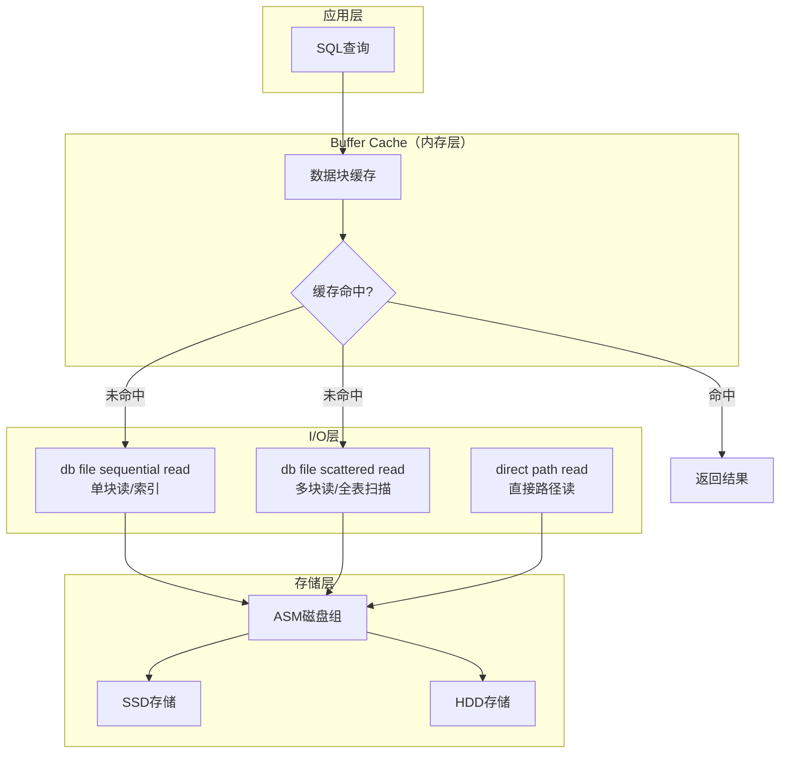
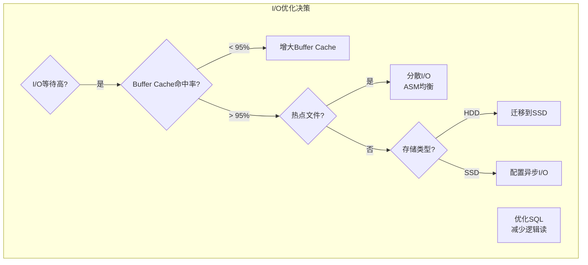
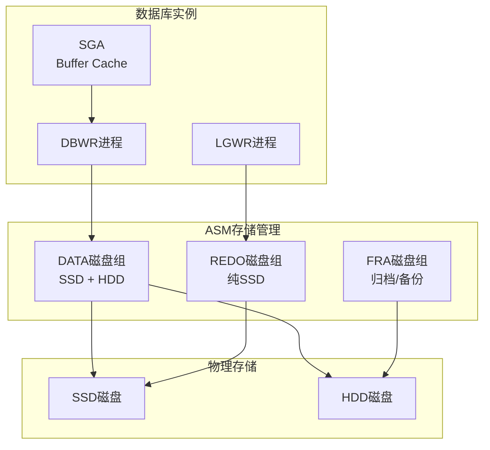

# Oracle I/O优化策略

## 一、概述

### 1.1 一句话定义

Oracle I/O优化是通过合理配置存储层次、分散I/O负载、优化数据访问模式和利用缓存机制，减少物理I/O次数和延迟，提高数据库整体性能的过程。
它在性能优化体系中出现和使用，解决I/O瓶颈导致的查询缓慢、事务延迟和系统吞吐量下降问题。

### 1.2 为什么重要

- **不掌握的后果：** 数据库性能受限于存储I/O，即使CPU和内存充足也无法发挥，查询响应时间从毫秒级退化到秒级
- **掌握的价值：** I/O优化可将数据库吞吐量提升2-10倍，是性能优化中投入产出比最高的方向之一

### 1.3 适用场景

| 场景 | 说明 |
|------|------|
| I/O瓶颈诊断 | db file sequential/scattered read等待事件高 |
| 存储架构优化 | 从HDD迁移到SSD，或配置ASM |
| 热点文件处理 | 某些数据文件I/O远超其他文件 |
| 批量操作优化 | 大批量INSERT/UPDATE的I/O优化 |
| 存储参数调优 | DB_FILE_MULTIBLOCK_READ_COUNT等参数 |

### 1.4 版本演进

| 版本 | 变化说明 |
|------|---------|
| 11gR2 | ASM增强，支持Exadata智能存储 |
| 12cR1 | 自动数据优化（ADO），存储分层 |
| 12cR2 | Flex ASM，ASM实例高可用 |
| 19c | 自动I/O优化建议，Exadata增强 |
| 21c | 云存储集成，自动存储管理 |

## 二、术语与概念

### 2.1 核心术语表

| 术语 | 含义 | 类比 |
|------|------|------|
| 物理读 | 从磁盘读取数据块到Buffer Cache | 从书架取书 |
| 逻辑读 | 从Buffer Cache读取数据块 | 从桌面取书 |
| 直接路径读 | 绕过Buffer Cache直接读磁盘 | 不经过桌面直接看书 |
| 多块读 | 一次I/O读取多个连续数据块 | 一次拿多本书 |
| ASM | 自动存储管理，Oracle专用卷管理 | 自动整理书架的系统 |
| 热点文件 | I/O集中在少数数据文件上 | 几本书被频繁取阅 |
| I/O分布 | 数据文件在不同磁盘上的分布 | 书分散在不同书架 |
| 存储分层 | 热数据放SSD，冷数据放HDD | 常用书放手边，不常用放远处 |

### 2.2 I/O路径架构



## 三、架构与原理

### 3.1 I/O类型与路径


### 3.2 工作原理

1. **逻辑读优先：** 查询先检查Buffer Cache，命中则无需物理I/O
2. **物理读补充：** Cache未命中时从磁盘读取数据块
3. **索引走单块读：** 索引扫描使用sequential read（每次读1块）
4. **全表走多块读：** 全表扫描使用scattered read（每次读多块）
5. **异步I/O：** 配置异步I/O减少CPU等待
6. **存储分层：** 热数据放SSD，冷数据放HDD

**一句话总结：** I/O优化的核心是"减少物理读次数 + 降低单次I/O延迟"——通过缓存命中减少物理读，通过SSD和异步I/O降低延迟。

### 3.3 I/O优化决策流程



## 四、功能详解

### 4.1 I/O监控与诊断

#### 功能说明

通过动态性能视图识别I/O瓶颈和热点文件。

#### 操作步骤

```sql
-- 步骤1：查看I/O等待事件
SELECT event, total_waits, time_waited/100 AS sec,
       average_wait*10 AS avg_ms
FROM v$system_event
WHERE event IN (
    'db file sequential read',
    'db file scattered read',
    'direct path read',
    'direct path write',
    'db file single write',
    'log file sync',
    'log file parallel write'
)
ORDER BY time_waited DESC;

-- 步骤2：查看文件级I/O统计
SELECT df.name AS file_name,
       ts.name AS tablespace,
       fs.phyrds AS reads,
       fs.phywrts AS writes,
       fs.readtim / NULLIF(fs.phyrds, 0) * 10 AS avg_read_ms,
       fs.writetim / NULLIF(fs.phywrts, 0) * 10 AS avg_write_ms
FROM v$filestat fs
JOIN v$datafile df ON fs.file# = df.file#
JOIN v$tablespace ts ON df.ts# = ts.ts#
ORDER BY (fs.phyrds + fs.phywrts) DESC;

-- 步骤3：查看表空间I/O汇总
SELECT ts.name AS tablespace,
       SUM(fs.phyrds) AS total_reads,
       SUM(fs.phywrts) AS total_writes,
       SUM(fs.phyrds + fs.phywrts) AS total_io,
       ROUND(SUM(fs.readtim) / NULLIF(SUM(fs.phyrds), 0) * 10, 2) AS avg_read_ms
FROM v$filestat fs
JOIN v$datafile df ON fs.file# = df.file#
JOIN v$tablespace ts ON df.ts# = ts.ts#
GROUP BY ts.name
ORDER BY total_io DESC;

-- 步骤4：Buffer Cache命中率
SELECT ROUND((1 - (physical.value / (consistent.value + db_block.value))) * 100, 2)
       AS buffer_cache_hit_ratio
FROM v$sysstat physical, v$sysstat consistent, v$sysstat db_block
WHERE physical.name = 'physical reads'
AND consistent.name = 'consistent gets'
AND db_block.name = 'db block gets';
```

### 4.2 ASM存储管理

#### 功能说明

ASM自动管理数据文件在磁盘间的分布，实现I/O均衡。

#### 操作步骤

```sql
-- 查看ASM磁盘组
SELECT name, total_mb, free_mb,
       ROUND((1 - free_mb/total_mb) * 100, 2) AS pct_used,
       type, state
FROM v$asm_diskgroup;

-- 查看ASM磁盘
SELECT group_number, disk_number, name,
       total_mb, free_mb,
       ROUND(free_mb/total_mb * 100, 2) AS pct_free
FROM v$asm_disk
ORDER BY group_number, free_mb/total_mb;

-- 均衡磁盘组（添加/删除磁盘后）
ALTER DISKGROUP data REBALANCE POWER 8;
-- POWER范围1-11，值越大均衡越快但I/O开销越大

-- 查看Rebalance进度
SELECT group_number, operation, state,
       power, actual, sofar, est_work, est_rate, est_minutes
FROM v$asm_operation;

-- 查看ASM文件分布
SELECT group_number, file_number, type,
       blocks, bytes/1024/1024 AS mb
FROM v$asm_file
WHERE type = 'DATAFILE'
ORDER BY bytes DESC;
```

### 4.3 存储分层配置

```sql
-- 创建ASM磁盘组（SSD + HDD分层）
-- CREATE DISKGROUP hot DATA
--   DISK '/dev/oracle/ssd_*' ATTRIBUTE 'au_size' = '4M';
-- CREATE DISKGROUP cold DATA
--   DISK '/dev/oracle/hdd_*' ATTRIBUTE 'au_size' = '8M';

-- 使用ADO自动数据优化（12c+）
-- 热数据（最近30天访问）放SSD
-- 冷数据（超过90天未访问）放HDD
ALTER TABLE orders ILM ADD POLICY
    TIERELASS TO TABLESPACE cold
    AFTER 90 DAYS OF NO MODIFICATION;

-- 查看ADO策略
SELECT policy_name, tablespace, enabled
FROM dba_ilm policies;
```

### 4.4 异步I/O配置

```sql
-- 查看异步I/O配置
SHOW PARAMETER disk_asynch_io;
SHOW PARAMETER filesystemio_options;

-- Linux推荐配置
-- filesystemio_options = SETALL  （启用异步I/O和直接I/O）
-- disk_asynch_io = TRUE

-- 查看I/O校准结果
-- 使用DBMS_RESOURCE_MANAGER.CALIBRATE_IO
SET SERVEROUTPUT ON
DECLARE
    lat  INTEGER;
    iops INTEGER;
    mbps INTEGER;
BEGIN
    DBMS_RESOURCE_MANAGER.CALIBRATE_IO(
        num_disks => 4,
        max_latency => 20,
        max_iops => iops,
        max_mbps => mbps,
        actual_latency => lat
    );
    DBMS_OUTPUT.PUT_LINE('IOPS: ' || iops);
    DBMS_OUTPUT.PUT_LINE('MBPS: ' || mbps);
    DBMS_OUTPUT.PUT_LINE('Latency: ' || lat || 'ms');
END;
/
```

### 4.5 多块读参数优化

```sql
-- 查看多块读参数
SHOW PARAMETER db_file_multiblock_read_count;

-- 通常不需要手动设置，Oracle自动计算最优值
-- 全表扫描时每次I/O读取的块数
-- 影响scattered read的效率

-- 查看实际多块读大小
SELECT value FROM v$parameter
WHERE name = 'db_file_multiblock_read_count';

-- 查看大I/O统计
SELECT name, value FROM v$sysstat
WHERE name LIKE '%table scan%';
```

## 五、性能与调优

### 5.1 性能基线

| 指标 | 正常范围 | 告警阈值 | 说明 |
|------|---------|---------|------|
| Buffer Cache Hit | > 95% | < 90% | 缓存命中率 |
| 单块读延迟 | < 1ms（SSD）/ < 10ms（HDD） | > 20ms | sequential read |
| 多块读延迟 | < 5ms（SSD）/ < 30ms（HDD） | > 50ms | scattered read |
| ASM均衡度 | < 10%差异 | > 20%差异 | 磁盘间数据分布 |
| I/O等待/DB time | < 20% | > 40% | I/O等待占比 |

### 5.2 调优建议

| 场景 | 建议 | 原因 |
|------|------|------|
| 全表扫描多 | 添加合适索引 | 减少scattered read |
| Buffer Cache低 | 增大SGA_TARGET | 提高缓存命中率 |
| 热点文件 | ASM均衡或迁移到SSD | 分散I/O负载 |
| 日志写入慢 | Redo放独立SSD | 减少LGWR延迟 |
| 批量操作慢 | 使用直接路径写入 | 绕过Buffer Cache |

## 六、DFX能力

### 6.1 动态性能视图

| 视图名 | 用途 | 关键字段 |
|--------|------|---------|
| V$FILESTAT | 文件I/O统计 | PHYRDS, PHYWRTS, READTIM |
| V$TEMPSTAT | 临时文件I/O | PHYRDS, PHYWRTS |
| V$ASM_DISKGROUP | ASM磁盘组 | TOTAL_MB, FREE_MB |
| V$ASM_DISK | ASM磁盘 | TOTAL_MB, FREE_MB |
| V$IOSTAT_FILE | 文件I/O统计 | SMALL_READ_MEGATIONS |
| V$SYSTEM_EVENT | 等待事件 | EVENT, TIME_WAITED |

### 6.2 监控脚本

```sql
-- I/O健康检查
SELECT ts.name AS tablespace,
       SUM(fs.phyrds + fs.phywrts) AS total_io,
       ROUND(SUM(fs.readtim)/NULLIF(SUM(fs.phyrds),0)*10, 2) AS avg_read_ms,
       ROUND(SUM(fs.writetim)/NULLIF(SUM(fs.phywrts),0)*10, 2) AS avg_write_ms
FROM v$filestat fs
JOIN v$datafile df ON fs.file# = df.file#
JOIN v$tablespace ts ON df.ts# = ts.ts#
GROUP BY ts.name
ORDER BY total_io DESC;
```

## 七、实战案例

### 7.1 案例背景

- **场景**：某ERP系统Oracle 19c，运行在HDD存储上
- **时间**：月末结账期间
- **现象**：AWR报告显示db file scattered read占DB time的45%，全表扫描严重

### 7.2 诊断过程

**步骤1：分析I/O等待**

```sql
SELECT event, total_waits, time_waited/100 AS sec
FROM v$system_event
WHERE event LIKE '%file%' OR event LIKE '%direct%'
ORDER BY time_waited DESC;
```
- → 发现：db file scattered read等待时间占DB time的45%
- → 判断：大量全表扫描导致I/O瓶颈

**步骤2：定位热点文件**

```sql
SELECT df.name, fs.phyrds + fs.phywrts AS total_io,
       fs.readtim / NULLIF(fs.phyrds, 0) * 10 AS avg_read_ms
FROM v$filestat fs
JOIN v$datafile df ON fs.file# = df.file#
ORDER BY total_io DESC FETCH FIRST 5 ROWS ONLY;
```
- → 发现：USERS表空间I/O最高，平均读延迟12ms（HDD正常范围上限）
- → 判断：存储性能已达极限

**步骤3：优化SQL**

```sql
-- 查找Top SQL（全表扫描）
SELECT sql_id, disk_reads, executions,
       disk_reads / NULLIF(executions, 0) AS reads_per_exec
FROM v$sql
WHERE disk_reads > 10000
ORDER BY disk_reads DESC FETCH FIRST 10 ROWS ONLY;
```
- → 发现：3个SQL贡献了60%的物理读
- → 判断：添加索引可大幅减少I/O

**步骤4：综合优化**

```sql
-- 1. 为Top SQL添加索引
CREATE INDEX idx_orders_date ON orders(order_date) ONLINE;

-- 2. 迁移热表空间到SSD
-- ALTER TABLESPACE users DATAFILE ... （迁移到ASM SSD磁盘组）

-- 3. 增大Buffer Cache
ALTER SYSTEM SET sga_target = 16G SCOPE = BOTH;
```

### 7.3 解决结果

| 指标 | 解决前 | 解决后 |
|------|--------|--------|
| DB time中I/O占比 | 45% | 8% |
| Buffer Cache Hit | 85% | 98% |
| 平均读延迟 | 12ms | 0.3ms（SSD） |
| 月末结账时间 | 8小时 | 1.5小时 |

### 7.4 复盘总结

- **根因：** HDD存储性能瓶颈 + 缺少索引导致全表扫描 + Buffer Cache不足
- **教训：** I/O优化要综合施策——SQL优化（减少I/O需求）+ 存储升级（提升I/O能力）+ 缓存增大（减少物理I/O）

## 八、常见错误与排查

### 8.1 常见错误列表

| 错误代码 | 错误信息 | 原因 | 解决方法 |
|---------|---------|------|---------|
| ORA-15041 | diskgroup space exhausted | ASM磁盘组空间不足 | 添加磁盘或删除数据 |
| ORA-01114 | IO error writing block | 磁盘I/O错误 | 检查存储硬件 |
| ORA-15064 | communication failure with ASM | ASM通信失败 | 检查ASM实例状态 |
| ORA-27072 | File I/O error | 文件系统I/O错误 | 检查磁盘健康 |

### 8.2 排查步骤

1. **检查等待事件：** `SELECT * FROM v$system_event WHERE event LIKE '%file%'`
2. **检查文件I/O：** `SELECT * FROM v$filestat ORDER BY phyrds DESC`
3. **检查ASM状态：** `SELECT * FROM v$asm_diskgroup`
4. **检查存储健康：** OS层 `iostat -x 1 10`
5. **检查Buffer Cache：** 计算命中率

### 8.3 解决方案

**方案一：紧急增大Buffer Cache**

```sql
ALTER SYSTEM SET db_cache_size = 8G SCOPE = BOTH;
```

**方案二：ASM磁盘组扩容**

```sql
ALTER DISKGROUP data ADD DISK '/dev/oracle/new_disk';
-- 自动触发Rebalance
```

## 九、最佳实践

### 9.1 官方推荐

- Redo日志放在最快的存储上（SSD）
- 使用ASM管理数据文件分布
- 启用异步I/O（filesystemio_options=SETALL）
- 定期执行I/O校准（DBMS_RESOURCE_MANAGER.CALIBRATE_IO）

### 9.2 社区经验

- I/O优化先优化SQL（减少需求），再优化存储（提升能力）
- 使用存储分层：热数据SSD，冷数据HDD
- ASM REBALANCE POWER在工作时间设低（1-4），维护窗口设高（8-11）
- 监控I/O趋势，提前规划存储扩容

### 9.3 反模式

| 反模式 | 问题 | 正确做法 |
|--------|------|---------|
| 所有数据放同一磁盘 | 热点导致I/O瓶颈 | ASM分散到多磁盘 |
| 不优化SQL就加存储 | 成本高，效果差 | 先优化SQL减少I/O需求 |
| 忽略异步I/O | CPU等待I/O浪费 | 启用filesystemio_options |
| Redo和数据混放 | LGWR与DBWR争抢I/O | Redo放独立高速存储 |
| 不监控I/O趋势 | 容量不足时才发现 | 定期采集I/O基线 |

## 十、命令与视图汇总

### 10.1 命令列表

| 命令 | 适用场景 | 说明 |
|------|---------|------|
| `ALTER DISKGROUP ... REBALANCE` | ASM均衡 | 重新分布数据 |
| `ALTER DISKGROUP ... ADD DISK` | ASM扩容 | 添加磁盘 |
| `DBMS_RESOURCE_MANAGER.CALIBRATE_IO` | I/O校准 | 测试存储性能 |
| `ALTER SYSTEM SET db_cache_size` | 调整缓存 | 增大Buffer Cache |
| `ALTER SYSTEM SET filesystemio_options` | I/O配置 | 启用异步I/O |

### 10.2 视图列表

| 视图名 | 类型 | 用途 | 关键字段 |
|--------|------|------|---------|
| V$FILESTAT | 动态 | 文件I/O统计 | PHYRDS, PHYWRTS, READTIM |
| V$ASM_DISKGROUP | 动态 | ASM磁盘组 | TOTAL_MB, FREE_MB |
| V$ASM_DISK | 动态 | ASM磁盘 | TOTAL_MB, FREE_MB |
| V$SYSTEM_EVENT | 动态 | 等待事件 | EVENT, TIME_WAITED |
| V$IOSTAT_FILE | 动态 | 文件I/O详细 | SMALL_READ_MEGATIONS |

## 十一、总结速查

### 11.1 黄金法则

1. **先优化SQL** - 减少I/O需求比提升I/O能力更有效
2. **缓存优先** - Buffer Cache命中率 > 95%
3. **SSD加速** - 热数据和Redo放SSD
4. **ASM均衡** - 数据均匀分布避免热点
5. **异步I/O** - 启用filesystemio_options=SETALL

### 11.2 一页纸检查清单

| 现象/场景 | 原因 | 处理方案 |
|-----------|------|----------|
| scattered read高 | 全表扫描过多 | 添加索引，优化SQL |
| sequential read高 | 索引回表过多 | 使用覆盖索引 |
| Buffer Cache低 | 缓存不足 | 增大SGA_TARGET |
| 热点文件 | I/O集中在少数文件 | ASM均衡或迁移到SSD |
| ASM空间不足 | 数据增长 | 添加磁盘或清理数据 |

### 11.3 关键数字

| 指标 | 正常范围 | 告警阈值 | 说明 |
|------|---------|---------|------|
| Buffer Cache Hit | > 95% | < 90% | 缓存命中率 |
| 单块读延迟（SSD） | < 1ms | > 5ms | sequential read |
| 单块读延迟（HDD） | < 10ms | > 20ms | sequential read |
| I/O等待/DB time | < 20% | > 40% | I/O等待占比 |

## 附录

### A. 存储架构拓扑



### B. 官方参考

- [Oracle Database Administrator's Guide - Storage Management](https://docs.oracle.com/en/database/oracle/oracle-database/19c/admin/)
- [Oracle ASM Administrator's Guide](https://docs.oracle.com/en/database/oracle/oracle-database/19c/asmad/)
- MOS Note: 1506253.1 - "I/O Performance Tuning"

### C. 修订记录

| 日期 | 版本 | 修改内容 | 修改人 |
|------|------|---------|--------|
| 2026-07-02 | v1.0 | 初始版本 | YashanDB知识库生成器 |
| 2026-07-02 | v1.1 | 补充完整模板章节 | YashanDB知识库生成器 |
