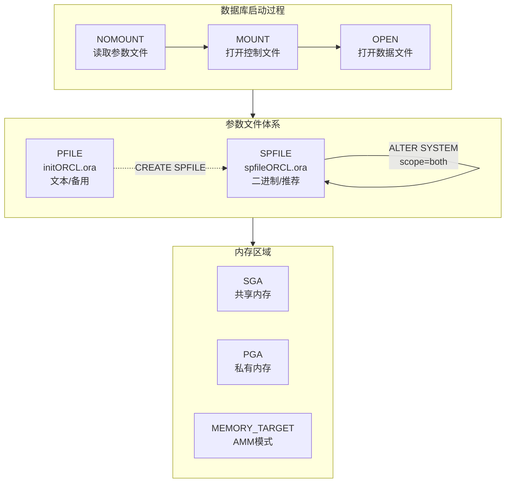
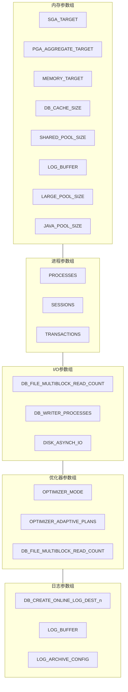
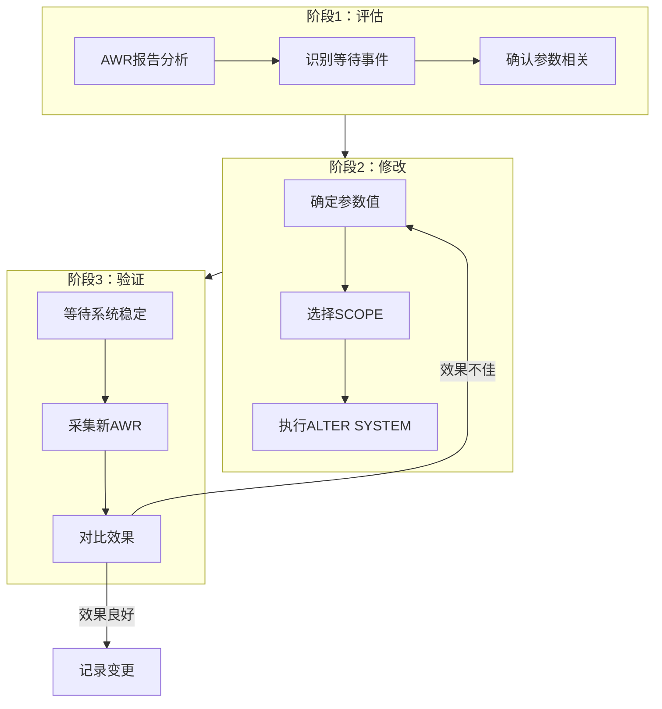

# Oracle初始化参数调优

## 一、概述

### 1.1 一句话定义

Oracle初始化参数调优是根据系统负载特征和硬件资源配置数据库启动参数，使数据库在内存分配、进程管理、I/O行为等方面达到最优性能的过程。
它在性能优化体系中出现和使用，解决因参数配置不当导致的内存不足、连接瓶颈、I/O瓶颈等性能问题。

### 1.2 为什么重要

- **不掌握的后果：** 数据库可能频繁出现ORA-04031（共享池内存不足）、ORA-00020（进程数超限）、buffer busy waits等错误，导致业务响应变慢甚至宕机
- **掌握的价值：** 通过合理的参数配置，可以让同样的硬件资源支撑更大的业务负载，减少不必要的硬件投入

### 1.3 适用场景

| 场景 | 说明 |
|------|------|
| 新系统上线 | 根据业务类型（OLTP/OLAP）配置初始参数 |
| 性能瓶颈诊断 | 通过AWR/ASH发现参数相关等待事件后调优 |
| 硬件变更 | 服务器内存/CPU升级后重新分配资源 |
| 负载变化 | 业务从OLTP转向批处理或混合负载 |
| 故障排查 | 出现ORA-04031、ORA-00020等参数相关错误时 |

### 1.4 版本演进

| 版本 | 变化说明 |
|------|---------|
| 11gR2 | MEMORY_TARGET自动内存管理（AMM），但Linux大页不兼容 |
| 12cR1 | SGA/PGA自动管理增强，SHARED_SERVERS改进 |
| 12cR2 | 支持在线参数修改（部分参数无需重启） |
| 19c | 自动索引、自动DOP，参数调优更加自动化 |
| 21c | 自动内存管理进一步增强，引入自动PGA聚合 |

## 二、术语与概念

### 2.1 核心术语表

| 术语 | 含义 | 类比 |
|------|------|------|
| SPFILE | 服务器参数文件，二进制格式，支持ALTER SYSTEM持久化 | 数据库的"永久配置本" |
| PFILE | 文本参数文件，手动编辑 | 数据库的"临时便签" |
| SGA | 系统全局区，所有进程共享的内存区域 | 办公室的公共白板 |
| PGA | 程序全局区，每个进程私有的内存区域 | 每个人的办公桌 |
| ASMM | 自动共享内存管理，Oracle自动分配SGA各组件 | 自动分配办公室空间 |
| AMM | 自动内存管理，Oracle自动管理SGA+PGA | 自动管理整栋办公楼 |
| 动态参数 | 可在运行时通过ALTER SYSTEM修改 | 不停机就能调的设置 |
| 静态参数 | 需要重启数据库才能生效 | 必须停机才能改的设置 |

### 2.2 参数管理架构



## 三、架构与原理

### 3.1 参数分类架构图



### 3.2 参数调优工作原理

1. **基线建立：** 通过AWR/ASH报告建立当前系统性能基线
2. **瓶颈识别：** 从Top等待事件、Top SQL中定位参数相关的性能瓶颈
3. **参数选择：** 确定需要调整的参数及其方向（增大/减小）
4. **修改生效：** 使用ALTER SYSTEM修改参数，选择适当的SCOPE
5. **效果验证：** 等待系统稳定后重新采集AWR报告对比
6. **迭代优化：** 根据效果决定是否需要继续调整

**一句话总结：** 参数调优是一个"测量→分析→调整→验证"的循环过程，每次只改一个参数，观察效果后再决定下一步。

### 3.3 参数修改生效流程



## 四、功能详解

### 4.1 内存参数调优

#### 功能说明

内存参数是Oracle调优中最关键的一类参数，直接影响数据库的缓存命中率和响应速度。

#### SGA参数

```sql
-- 查看当前SGA配置
SHOW PARAMETER sga;
SELECT * FROM v$sgainfo;
SELECT * FROM v$sga_dynamic_components;

-- SGA自动管理（推荐）
ALTER SYSTEM SET sga_target = 8G SCOPE = BOTH;
ALTER SYSTEM SET sga_max_size = 12G SCOPE = SPFILE;  -- 需重启

-- SGA各组件最小值设置（防止自动管理过度收缩）
ALTER SYSTEM SET db_cache_size = 4G SCOPE = BOTH;
ALTER SYSTEM SET shared_pool_size = 2G SCOPE = BOTH;
ALTER SYSTEM SET large_pool_size = 256M SCOPE = BOTH;
ALTER SYSTEM SET java_pool_size = 128M SCOPE = BOTH;
ALTER SYSTEM SET log_buffer = 256M SCOPE = SPFILE;

-- 查看SGA各组件当前大小
SELECT component, current_size/1024/1024 AS size_mb,
       min_size/1024/1024 AS min_mb,
       max_size/1024/1024 AS max_mb,
       last_oper_type
FROM v$sga_dynamic_components
ORDER BY current_size DESC;
```

#### PGA参数

```sql
-- 查看PGA配置
SHOW PARAMETER pga;

-- PGA自动管理
ALTER SYSTEM SET pga_aggregate_target = 2G SCOPE = BOTH;
ALTER SYSTEM SET pga_aggregate_limit = 4G SCOPE = BOTH;  -- 12c+

-- 查看PGA使用统计
SELECT name, value/1024/1024 AS value_mb
FROM v$pgastat
WHERE name IN (
    'aggregate PGA target parameter',
    'aggregate PGA auto target',
    'total PGA allocated',
    'total PGA used for auto workareas',
    'maximum PGA allocated',
    'over allocation count'
);

-- over allocation count > 0 说明PGA不够用
```

#### AMM（自动内存管理）

```sql
-- 使用AMM（MEMORY_TARGET管理SGA+PGA）
ALTER SYSTEM SET memory_target = 10G SCOPE = BOTH;
ALTER SYSTEM SET memory_max_target = 14G SCOPE = SPFILE;

-- 注意：使用AMM时SGA_TARGET和PGA_AGGREGATE_TARGET作为最小值
-- AMM与Linux HugePages不兼容，大内存系统推荐ASMM

-- 查看内存使用情况
SELECT * FROM v$memory_dynamic_components;
```

### 4.2 进程参数调优

```sql
-- 查看进程相关参数
SHOW PARAMETER processes;
SHOW PARAMETER sessions;
SHOW PARAMETER transactions;

-- 参数计算关系
-- sessions = 1.5 × processes + 22
-- transactions = 1.1 × sessions

-- 查看当前使用量
SELECT resource_name,
       current_utilization AS current_val,
       max_utilization AS max_val,
       initial_allocation AS initial,
       limit_value AS limits
FROM v$resource_limit
WHERE resource_name IN ('processes', 'sessions', 'transactions');

-- 调整进程数
ALTER SYSTEM SET processes = 1500 SCOPE = SPFILE;  -- 需重启
ALTER SYSTEM SET sessions = 2272 SCOPE = SPFILE;    -- 需重启
```

### 4.3 优化器参数调优

```sql
-- 查看优化器参数
SHOW PARAMETER optimizer;

-- 优化模式选择
-- ALL_ROWS：适合批处理/OLAP，优化整体吞吐量
-- FIRST_ROWS：适合OLTP，优化首行响应
ALTER SYSTEM SET optimizer_mode = ALL_ROWS SCOPE = BOTH;

-- 自适应优化（12c+）
ALTER SYSTEM SET optimizer_adaptive_plans = TRUE SCOPE = BOTH;
ALTER SYSTEM SET optimizer_adaptive_statistics = FALSE SCOPE = BOTH;

-- 查看自适应计划执行情况
SELECT sql_id, is_adaptive_plans_used
FROM v$sql
WHERE is_adaptive_plans_used = 'Y'
AND rownum <= 10;
```

### 4.4 I/O参数调优

```sql
-- 多块读参数
SHOW PARAMETER db_file_multiblock_read_count;
-- 默认值通常已优化，一般不需手动设置
-- 全表扫描时每次读取的块数

-- 异步I/O
SHOW PARAMETER disk_asynch_io;
SHOW PARAMETER filesystemio_options;
-- Linux推荐: filesystemio_options = SETALL

-- DBWR进程数
SHOW PARAMETER db_writer_processes;
-- 建议: CPU核数的1/4到1/2

-- 查看I/O统计
SELECT name, phyrds, phywrts, readtim, writetim
FROM v$filestat
JOIN v$datafile USING (file#)
ORDER BY phyrds DESC;
```

### 4.5 参数修改SCOPE说明

| SCOPE值 | 生效范围 | 是否需重启 | 说明 |
|---------|---------|-----------|------|
| MEMORY | 仅当前实例内存 | 否 | 重启后失效 |
| SPFILE | 仅SPFILE文件 | 是 | 下次启动生效 |
| BOTH | 内存+SPFILE | 否（动态参数） | 立即生效且持久化 |

```sql
-- 临时测试（不持久化）
ALTER SYSTEM SET sort_area_size = 1048576 SCOPE = MEMORY;

-- 永久修改（需重启）
ALTER SYSTEM SET processes = 2000 SCOPE = SPFILE;

-- 立即生效且持久化（动态参数）
ALTER SYSTEM SET sga_target = 8G SCOPE = BOTH;

-- 恢复默认值
ALTER SYSTEM RESET sort_area_size SCOPE = BOTH;
```

## 五、性能与调优

### 5.1 参数调优方法

```sql
-- 1. 查看当前修改过的参数
SELECT name, value, ismodified, isdefault
FROM v$system_parameter
WHERE ismodified != 'FALSE'
ORDER BY name;

-- 2. 查看参数修改历史（12c+）
SELECT name, value, update_comment
FROM v$spparameter
WHERE isspecified = 'TRUE'
ORDER BY name;

-- 3. 使用ADDM获取参数建议
SELECT findings FROM dba_advisor_findings
WHERE task_name = (
    SELECT max(task_name) FROM dba_advisor_tasks
    WHERE advisor_name = 'ADDM'
);
```

### 5.2 性能基线

| 指标 | 正常范围 | 告警阈值 | 说明 |
|------|---------|---------|------|
| Buffer Cache Hit Ratio | > 95% | < 90% | 低于90%考虑增大DB_CACHE_SIZE |
| Library Cache Hit Ratio | > 99% | < 95% | 低于95%考虑增大SHARED_POOL_SIZE |
| PGA over allocation | 0 | > 0 | 大于0说明PGA不够 |
| Processes使用率 | < 70% | > 85% | 超过85%需要增大PROCESSES |
| Redo Log Space Requests | 接近0 | > 100 | 大于100考虑增大LOG_BUFFER |
| Sorts (disk) | 接近0 | > 100 | 磁盘排序过多需调PGA |

### 5.3 调优建议

| 场景 | 建议 | 原因 |
|------|------|------|
| OLTP系统 | SGA=物理内存60%, PGA=20% | OLTP连接多但单连接内存小 |
| OLAP/批处理 | SGA=物理内存50%, PGA=40% | 排序和哈希连接需要大量PGA |
| 混合负载 | SGA=60%, PGA=20%, 启用AMM | 让Oracle自动在SGA/PGA间调配 |
| 大内存服务器(>64G) | 使用HugePages, 不用AMM | AMM与HugePages不兼容 |
| RAC环境 | 各节点参数保持一致 | 避免负载不均 |

## 六、DFX能力

### 6.1 动态性能视图

| 视图名 | 用途 | 关键字段 |
|--------|------|---------|
| V$PARAMETER | 当前生效的参数值 | NAME, VALUE, ISDEFAULT, ISMODIFIED |
| V$SPPARAMETER | SPFILE中的参数 | NAME, VALUE, ISSPECIFIED |
| V$SGAINFO | SGA各区域信息 | NAME, BYTES, RESIZEABLE |
| V$SGA_DYNAMIC_COMPONENTS | SGA动态组件大小 | COMPONENT, CURRENT_SIZE, MIN_SIZE |
| V$PGASTAT | PGA使用统计 | NAME, VALUE |
| V$RESOURCE_LIMIT | 资源使用上限 | RESOURCE_NAME, MAX_UTILIZATION |
| V$SYSTEM_PARAMETER | 系统级参数 | NAME, VALUE, ISMODIFIED |

### 6.2 日志与告警

- **日志位置：** `$ORACLE_BASE/diag/rdbms/{db_name}/{instance_name}/trace/alert_{instance_name}.log`
- **关键日志：** 参数修改记录在alert.log中，包含时间戳和修改者信息
- **告警配置：** 可对PROCESSES使用率、SGA/PGA超限配置EM告警

```sql
-- 查看alert.log中的参数修改记录
-- 在OS层执行：
-- grep "ALTER SYSTEM" $ORACLE_BASE/diag/rdbms/*/trace/alert_*.log
```

## 七、实战案例

### 7.1 案例背景

- **场景**：某电商系统Oracle 19c单实例环境，SGA=4G，PGA=1G
- **时间**：大促期间
- **现象**：应用响应变慢，AWR报告显示大量"direct path read temp"等待，buffer cache hit ratio降至82%

### 7.2 诊断过程

**步骤1：检查内存参数**

```sql
SELECT name, value FROM v$parameter
WHERE name IN ('sga_target', 'pga_aggregate_target', 'memory_target');
```
- → 发现：SGA_TARGET=4G, PGA_AGGREGATE_TARGET=1G, MEMORY_TARGET=0
- → 判断：PGA只有1G，大促期间大量排序操作可能导致PGA不足

**步骤2：检查PGA使用**

```sql
SELECT name, value/1024/1024 AS mb FROM v$pgastat
WHERE name IN ('total PGA allocated', 'total PGA used for auto workareas',
               'over allocation count', 'aggregate PGA target parameter');
```
- → 发现：over allocation count = 1523，total PGA allocated接近target
- → 判断：PGA严重不足，大量操作被迫使用磁盘排序

**步骤3：检查Buffer Cache**

```sql
SELECT name, value FROM v$sysstat
WHERE name IN ('physical reads', 'consistent gets', 'db block gets');
```
- → 发现：buffer cache hit ratio = 82%
- → 判断：SGA中db_cache_size被自动收缩，需要设置最小值

**步骤4：调整参数**

```sql
-- 增大PGA
ALTER SYSTEM SET pga_aggregate_target = 4G SCOPE = BOTH;
ALTER SYSTEM SET pga_aggregate_limit = 8G SCOPE = BOTH;

-- 设置SGA各组件最小值，防止被过度收缩
ALTER SYSTEM SET db_cache_size = 3G SCOPE = BOTH;
ALTER SYSTEM SET shared_pool_size = 1G SCOPE = BOTH;

-- 增大SGA总量
ALTER SYSTEM SET sga_target = 6G SCOPE = BOTH;
```

### 7.3 解决结果

| 指标 | 解决前 | 解决后 |
|------|--------|--------|
| Buffer Cache Hit Ratio | 82% | 98% |
| PGA over allocation | 1523 | 0 |
| direct path read temp | Top 1等待事件 | 消失 |
| 平均响应时间 | 2.3s | 0.15s |

### 7.4 复盘总结

- **根因：** PGA配置过小，大促期间排序操作大量溢出到磁盘；同时ASMM自动收缩了db_cache_size
- **教训：** 对关键SGA组件设置最小值（db_cache_size、shared_pool_size），防止自动管理过度收缩；PGA要根据业务峰值配置

## 八、常见错误与排查

### 8.1 常见错误列表

| 错误代码 | 错误信息 | 原因 | 解决方法 |
|---------|---------|------|---------|
| ORA-04031 | unable to allocate X bytes of shared memory | 共享池内存不足 | 增大SHARED_POOL_SIZE或flush共享池 |
| ORA-00020 | maximum number of processes exceeded | 进程数超限 | 增大PROCESSES参数（需重启） |
| ORA-00018 | maximum number of sessions exceeded | 会话数超限 | 增大SESSIONS参数（需重启） |
| ORA-04031 (shared pool) | shared pool碎片化 | 未使用绑定变量导致硬解析过多 | 检查cursor_sharing，优化SQL |
| ORA-000200 | critical: cannot create background process | SGA配置过大，系统内存不足 | 减小SGA_TARGET或增加物理内存 |

### 8.2 排查步骤

1. **确认当前状态：** `SHOW PARAMETER` 查看关键参数
2. **检查资源使用：** `SELECT * FROM v$resource_limit` 查看资源使用率
3. **查看AWR报告：** 定位Top等待事件是否与参数相关
4. **检查alert.log：** 查看是否有ORA-04031等内存错误
5. **定位根因：** 确认是参数配置问题还是SQL问题

### 8.3 解决方案

**方案一：紧急增大PROCESSES**

```sql
-- ORA-00020紧急处理
ALTER SYSTEM SET processes = 2000 SCOPE = SPFILE;
-- 需要重启数据库
SHUTDOWN IMMEDIATE;
STARTUP;
```

**方案二：紧急释放共享池**

```sql
-- ORA-04031紧急处理
ALTER SYSTEM FLUSH SHARED_POOL;
-- 然后查找并优化导致碎片化的SQL
```

## 九、最佳实践

### 9.1 官方推荐

- 使用SPFILE而非PFILE管理参数
- 对关键SGA组件设置最小值，不要完全依赖自动管理
- 大内存服务器（>64G）使用HugePages，不使用AMM
- 定期导出SPFILE备份：`CREATE PFILE='/tmp/pfile_backup.ora' FROM SPFILE`

### 9.2 社区经验

- 每次只改一个参数，观察至少一个完整业务周期
- 保留参数修改记录，建立变更日志
- 生产环境参数修改先在测试环境验证
- OLTP系统优先保证Buffer Cache Hit Ratio > 95%

### 9.3 反模式

| 反模式 | 问题 | 正确做法 |
|--------|------|---------|
| 一次修改多个参数 | 无法判断哪个参数生效 | 每次只改一个，观察效果 |
| 不设SGA组件最小值 | ASMM可能过度收缩关键组件 | 设置db_cache_size和shared_pool_size最小值 |
| 大内存用AMM | 与HugePages不兼容，性能下降 | 大内存用ASMM+HugePages |
| 仅改SCOPE=MEMORY | 重启后参数恢复，问题再次出现 | 生产环境用SCOPE=BOTH或SPFILE |
| 盲目增大SGA | 可能导致OS层面内存不足 | SGA不超过物理内存的80% |

## 十、命令与视图汇总

### 10.1 命令列表

| 命令 | 适用场景 | 说明 |
|------|---------|------|
| `SHOW PARAMETER` | 查看参数当前值 | 快速查看 |
| `ALTER SYSTEM SET ... SCOPE=BOTH` | 修改动态参数 | 立即生效且持久化 |
| `ALTER SYSTEM SET ... SCOPE=SPFILE` | 修改静态参数 | 重启后生效 |
| `ALTER SYSTEM RESET` | 恢复参数默认值 | 清除自定义设置 |
| `CREATE PFILE FROM SPFILE` | 导出参数文件 | 备份或查看 |
| `CREATE SPFILE FROM PFILE` | 从PFILE创建SPFILE | 初始化参数文件 |

### 10.2 视图列表

| 视图名 | 类型 | 用途 | 关键字段 |
|--------|------|------|---------|
| V$PARAMETER | 动态 | 当前参数值 | NAME, VALUE, ISDEFAULT |
| V$SPPARAMETER | 动态 | SPFILE参数 | NAME, VALUE, ISSPECIFIED |
| V$SGAINFO | 动态 | SGA区域信息 | NAME, BYTES |
| V$SGA_DYNAMIC_COMPONENTS | 动态 | SGA动态组件 | COMPONENT, CURRENT_SIZE |
| V$PGASTAT | 动态 | PGA统计 | NAME, VALUE |
| V$RESOURCE_LIMIT | 动态 | 资源限制 | RESOURCE_NAME, MAX_UTILIZATION |

## 十一、总结速查

### 11.1 黄金法则

1. **一次一参** - 每次只改一个参数，观察完整业务周期
2. **设置下限** - 对db_cache_size和shared_pool_size设置最小值
3. **SCOPE=BOTH** - 生产环境参数修改必须持久化
4. **备份SPFILE** - 修改前导出PFILE备份
5. **监控验证** - 修改后通过AWR对比验证效果

### 11.2 一页纸检查清单

| 现象/场景 | 原因 | 处理方案 |
|-----------|------|----------|
| ORA-04031 | 共享池不足 | 增大SHARED_POOL_SIZE，检查绑定变量 |
| ORA-00020 | 进程数超限 | 增大PROCESSES（需重启） |
| Buffer Cache低 | 缓存不足 | 增大SGA_TARGET或设DB_CACHE_SIZE最小值 |
| PGA over allocation | PGA不足 | 增大PGA_AGGREGATE_TARGET |
| 大量磁盘排序 | PGA不够 | 增大PGA，检查sort_area_size |
| Redo log space request | 日志缓冲不足 | 增大LOG_BUFFER |

### 11.3 关键数字

| 指标 | 正常范围 | 告警阈值 | 说明 |
|------|---------|---------|------|
| Buffer Cache Hit | > 95% | < 90% | 内存读命中率 |
| Library Cache Hit | > 99% | < 95% | 共享池命中率 |
| PGA over allocation | 0 | > 0 | 大于0需关注 |
| Processes使用率 | < 70% | > 85% | 预留足够余量 |
| SGA占物理内存 | 60-80% | > 85% | 留足OS内存 |

## 附录

### A. 官方参考

- [Oracle Database Reference - Initialization Parameters](https://docs.oracle.com/en/database/oracle/oracle-database/19c/refrn/)
- [Oracle Database Performance Tuning Guide](https://docs.oracle.com/en/database/oracle/oracle-database/19c/tgdba/)
- MOS Note: 274161.1 - "Information and Scripts for Diagnosing ORA-04031"

### B. 数据字典

| 对象名 | 类型 | 说明 |
|--------|------|------|
| V$PARAMETER | 动态视图 | 当前生效的参数值 |
| V$SPPARAMETER | 动态视图 | SPFILE中的参数 |
| V$SGA_DYNAMIC_COMPONENTS | 动态视图 | SGA动态组件大小 |
| V$PGASTAT | 动态视图 | PGA使用统计 |
| DBA_HIST_PARAMETER | AWR历史 | 参数历史值 |

### C. 修订记录

| 日期 | 版本 | 修改内容 | 修改人 |
|------|------|---------|--------|
| 2026-07-02 | v1.0 | 初始版本 | YashanDB知识库生成器 |
| 2026-07-02 | v1.1 | 补充完整模板章节 | YashanDB知识库生成器 |
