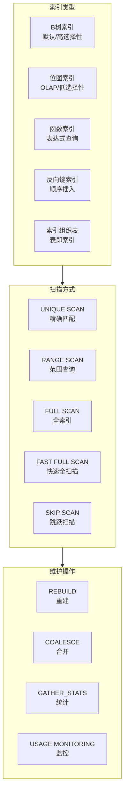
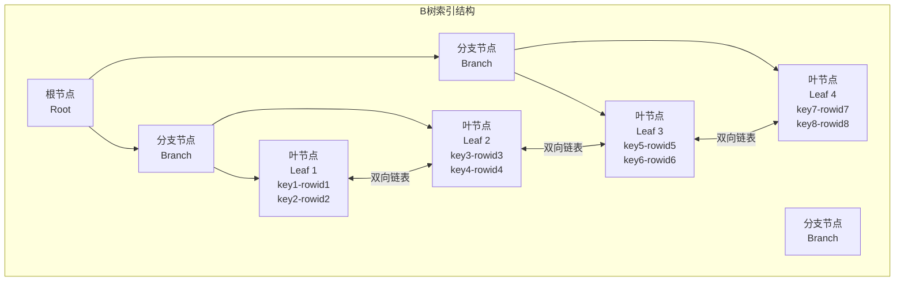
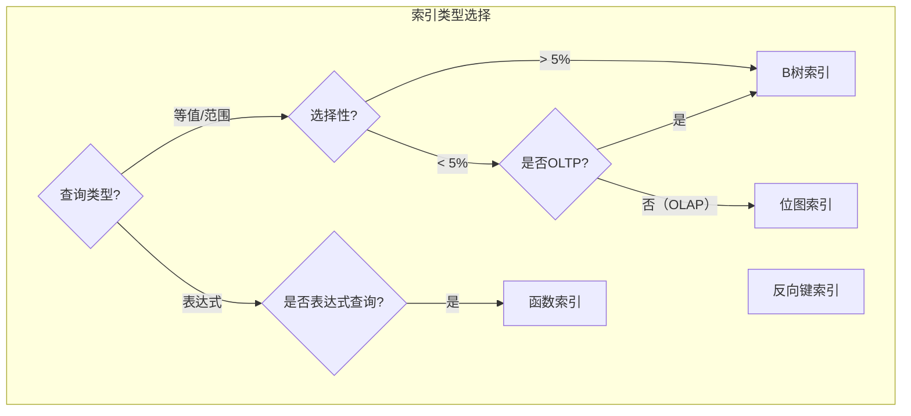

# Oracle索引优化策略

## 一、概述

### 1.1 一句话定义

Oracle索引优化是通过合理设计索引结构、选择索引类型、维护索引健康状态，使查询能够高效定位数据的过程。
它在性能优化体系中出现和使用，解决全表扫描导致的查询性能低下、I/O过载问题。

### 1.2 为什么重要

- **不掌握的后果：** 查询走全表扫描，大量逻辑读导致CPU和I/O资源浪费，响应时间从毫秒级退化到秒级
- **掌握的价值：** 正确的索引策略可将查询性能提升10-1000倍，是SQL调优最直接的优化手段

### 1.3 适用场景

| 场景 | 说明 |
|------|------|
| SQL调优 | 通过添加/修改索引改善查询性能 |
| 索引设计 | 新建表时设计合理的索引策略 |
| 索引维护 | 定期检查和重建碎片化索引 |
| 无用索引清理 | 识别并删除未使用的索引，减少DML开销 |
| 特殊查询优化 | 函数索引、覆盖索引等高级优化 |

### 1.4 版本演进

| 版本 | 变化说明 |
|------|---------|
| 11gR2 | 不可见索引（Invisible Index）支持 |
| 12cR1 | 自动索引（Automatic Indexing）引入 |
| 12cR2 | 在线索引创建增强（ONLINE关键字改进） |
| 19c | 自动索引全面启用，JSON索引支持 |
| 21c | 索引 advisor 增强，自动推荐索引 |

## 二、术语与概念

### 2.1 核心术语表

| 术语 | 含义 | 类比 |
|------|------|------|
| B树索引 | 平衡多叉树索引，Oracle默认索引类型 | 字典的拼音索引 |
| 位图索引 | 用位图表示列值的索引，适合低选择性 | 打勾的清单 |
| 函数索引 | 基于函数表达式的索引 | 按计算结果排序的目录 |
| 选择性 | 列中不同值的比例 | 区分度，越高越好 |
| 回表 | 通过索引找到ROWID后访问表数据 | 查目录后翻到具体页 |
| 覆盖索引 | 索引包含查询所需的所有列 | 目录里就有全部信息 |
| INDEX SKIP SCAN | 非前导列查询时的跳跃扫描 | 跳过目录前缀查找 |
| 索引碎片 | 索引叶块中的空间浪费 | 目录页中的空白区域 |

### 2.2 索引体系架构



## 三、架构与原理

### 3.1 B树索引结构



### 3.2 工作原理

1. **索引查找：** 从根节点开始，逐层比较键值，定位到叶节点
2. **获取ROWID：** 叶节点存储键值和对应的ROWID
3. **回表访问：** 通过ROWID访问表数据块获取完整行
4. **覆盖索引：** 如果索引包含所有查询列，无需回表

**一句话总结：** 索引优化就是让查询尽可能通过索引直接获取数据，减少或消除回表操作。

### 3.3 索引选择决策流程



## 四、功能详解

### 4.1 索引类型详解

#### B树索引

```sql
-- 默认索引类型，适合高选择性列
CREATE INDEX idx_emp_id ON employees(employee_id);

-- 复合索引（注意列顺序）
-- 等值查询列在前，范围查询列在后
CREATE INDEX idx_emp_dept_sal ON employees(department_id, salary);

-- 覆盖索引（避免回表）
CREATE INDEX idx_emp_covering ON employees(department_id, last_name, salary);
-- 查询 SELECT department_id, last_name, salary FROM employees WHERE department_id = 10
-- 无需回表
```

#### 位图索引

```sql
-- 适合OLAP场景的低选择性列
CREATE BITMAP INDEX idx_emp_gender ON employees(gender);
CREATE BITMAP INDEX idx_emp_status ON employees(status);

-- 位图连接索引（星型模型优化）
CREATE BITMAP INDEX idx_sales_prod
FROM sales s, products p
WHERE s.prod_id = p.prod_id AND p.category = 'Electronics';

-- 注意：位图索引不适合OLTP！会导致严重的锁争用
```

#### 函数索引

```sql
-- 基于函数的索引
CREATE INDEX idx_emp_upper_name ON employees(UPPER(last_name));

-- 查询使用函数索引
SELECT * FROM employees WHERE UPPER(last_name) = 'SMITH';

-- 日期函数索引
CREATE INDEX idx_hire_year ON employees(EXTRACT(YEAR FROM hire_date));

-- 注意：函数必须是DETERMINISTIC
-- 或使用虚拟列
ALTER TABLE employees ADD name_upper GENERATED ALWAYS AS (UPPER(last_name));
CREATE INDEX idx_emp_name_upper ON employees(name_upper);
```

### 4.2 索引扫描类型详解

| 扫描类型 | 说明 | 适用场景 | 性能 |
|---------|------|---------|------|
| INDEX UNIQUE SCAN | 唯一索引精确查找 | PK/UK等值查询 | 最优 |
| INDEX RANGE SCAN | 范围扫描 | 范围查询、前缀匹配 | 优 |
| INDEX FULL SCAN | 从根到叶全扫描 | ORDER BY利用索引排序 | 中 |
| INDEX FAST FULL SCAN | 多块读全索引 | 索引包含所有查询列 | 中 |
| INDEX SKIP SCAN | 跳过前导列扫描 | 非前导列查询（前导列低选择性） | 差 |

```sql
-- 查看执行计划中的索引扫描类型
EXPLAIN PLAN FOR
SELECT * FROM employees WHERE department_id = 10;
SELECT * FROM TABLE(DBMS_XPLAN.DISPLAY);

-- INDEX SKIP SCAN示例
-- 索引: (gender, employee_id)
-- 查询: WHERE employee_id = 100
-- 前导列gender未出现在WHERE中，触发SKIP SCAN
```

### 4.3 索引监控与维护

```sql
-- 索引使用监控
-- 步骤1：开启监控
ALTER INDEX emp_dept_idx MONITORING USAGE;

-- 步骤2：等待一段时间（至少一个完整业务周期）
-- 步骤3：查看使用记录
SELECT index_name, table_name, monitoring, used, start_monitoring
FROM v$object_usage
WHERE table_name = 'EMPLOYEES';

-- 步骤4：关闭监控
ALTER INDEX emp_dept_idx NOMONITORING USAGE;

-- 索引碎片检查
SELECT index_name, blevel, leaf_blocks, distinct_keys,
       clustering_factor, num_rows,
       ROUND((leaf_blocks * 8192) / 1024 / 1024, 2) AS size_mb
FROM dba_indexes
WHERE owner = 'HR'
ORDER BY leaf_blocks DESC;

-- 索引重建（在线）
ALTER INDEX emp_dept_idx REBUILD ONLINE;

-- 索引合并（减少碎片，不改变结构）
ALTER INDEX emp_dept_idx COALESCE;

-- 删除未使用的索引
-- 确认索引确实未使用后
DROP INDEX emp_old_idx;
```

### 4.4 索引设计原则

```sql
-- 1. 分析列选择性
SELECT column_name, num_distinct, num_rows,
       ROUND(num_distinct / NULLIF(num_rows, 0) * 100, 2) AS selectivity_pct
FROM dba_tab_columns
WHERE owner = 'HR' AND table_name = 'EMPLOYEES'
ORDER BY selectivity_pct DESC;

-- 2. 复合索引列顺序原则
-- 等值查询列在前（按选择性从高到低）
-- 范围查询列在后
-- 示例：WHERE dept_id = 10 AND salary > 5000
-- 索引：(dept_id, salary)

-- 3. 索引数量权衡
-- 每个索引增加INSERT/UPDATE/DELETE开销
-- OLTP系统：每个表2-5个索引
-- OLAP系统：可以有更多索引

-- 4. 查看表的索引
SELECT index_name, index_type, uniqueness,
       blevel, leaf_blocks, num_rows
FROM dba_indexes
WHERE owner = 'HR' AND table_name = 'EMPLOYEES'
ORDER BY index_name;

-- 查看索引列
SELECT index_name, column_name, column_position
FROM dba_ind_columns
WHERE table_owner = 'HR' AND table_name = 'EMPLOYEES'
ORDER BY index_name, column_position;
```

## 五、性能与调优

### 5.1 索引对DML的影响

| 操作 | 影响 | 优化建议 |
|------|------|---------|
| INSERT | 每个索引都需要维护 | 批量插入时可先禁用索引 |
| UPDATE | 更新索引列需维护索引 | 避免频繁更新索引列 |
| DELETE | 索引叶节点标记删除 | 定期重建碎片索引 |

### 5.2 性能基线

| 指标 | 正常范围 | 告警阈值 | 说明 |
|------|---------|---------|------|
| 索引碎片率 | < 20% | > 30% | 需要重建或合并 |
| 聚簇因子 | 接近表行数 | > 表行数×10 | 索引与表数据顺序差 |
| 未使用索引数 | 0 | > 0 | 浪费DML资源 |

### 5.3 调优建议

| 场景 | 建议 | 原因 |
|------|------|------|
| 全表扫描 | 添加合适的索引 | 减少逻辑读 |
| INDEX SKIP SCAN | 调整复合索引列顺序或拆分索引 | SKIP SCAN效率低 |
| 聚簇因子高 | 考虑按索引列重组表 | 减少回表I/O |
| DML性能差 | 减少不必要的索引 | 每个索引增加DML开销 |

## 六、DFX能力

### 6.1 动态性能视图

| 视图名 | 用途 | 关键字段 |
|--------|------|---------|
| DBA_INDEXES | 索引信息 | INDEX_NAME, BLEVEL, LEAF_BLOCKS |
| DBA_IND_COLUMNS | 索引列信息 | COLUMN_NAME, COLUMN_POSITION |
| V$OBJECT_USAGE | 索引使用监控 | INDEX_NAME, USED, MONITORING |
| DBA_SEGMENTS | 索引段大小 | SEGMENT_NAME, BYTES |
| V$SEGSTAT | 段统计信息 | OBJECT_NAME, STATISTIC_NAME |

### 6.2 监控指标

```sql
-- 索引相关等待事件
SELECT event, total_waits, time_waited/100 AS sec
FROM v$system_event
WHERE event LIKE '%index%'
ORDER BY time_waited DESC;

-- 索引扫描统计
SELECT name, value FROM v$sysstat
WHERE name LIKE '%index%scan%'
   OR name LIKE '%index%fast%';
```

## 七、实战案例

### 7.1 案例背景

- **场景**：某报表系统Oracle 19c，查询订单表耗时30秒
- **时间**：月末报表生成
- **现象**：全表扫描1000万行订单数据，逻辑读超过50万

### 7.2 诊断过程

**步骤1：分析执行计划**

```sql
EXPLAIN PLAN FOR
SELECT customer_id, SUM(amount)
FROM orders
WHERE order_date BETWEEN DATE '2026-01-01' AND DATE '2026-06-30'
GROUP BY customer_id;

SELECT * FROM TABLE(DBMS_XPLAN.DISPLAY);
```
- → 发现：TABLE ACCESS FULL（全表扫描），无索引可用
- → 判断：需要在order_date上创建索引

**步骤2：检查现有索引**

```sql
SELECT index_name, column_name, column_position
FROM dba_ind_columns
WHERE table_owner = 'SALES' AND table_name = 'ORDERS'
ORDER BY index_name, column_position;
```
- → 发现：只有PK索引(order_id)，无日期列索引
- → 判断：需要添加日期范围索引

**步骤3：创建索引**

```sql
-- 创建复合索引（日期+客户ID，覆盖查询列）
CREATE INDEX idx_orders_date_cust ON orders(order_date, customer_id, amount);
```

**步骤4：验证效果**

```sql
EXPLAIN PLAN FOR
SELECT customer_id, SUM(amount)
FROM orders
WHERE order_date BETWEEN DATE '2026-01-01' AND DATE '2026-06-30'
GROUP BY customer_id;

SELECT * FROM TABLE(DBMS_XPLAN.DISPLAY);
-- 执行计划变为 INDEX RANGE SCAN
```

### 7.3 解决结果

| 指标 | 解决前 | 解决后 |
|------|--------|--------|
| 执行时间 | 30秒 | 0.5秒 |
| 逻辑读 | 500,000 | 2,000 |
| 执行计划 | TABLE ACCESS FULL | INDEX RANGE SCAN |

### 7.4 复盘总结

- **根因：** 缺少日期列索引，导致全表扫描
- **教训：** 覆盖索引（包含查询所需所有列）可以避免回表，进一步提升性能

## 八、常见错误与排查

### 8.1 常见错误列表

| 错误代码 | 错误信息 | 原因 | 解决方法 |
|---------|---------|------|---------|
| ORA-01408 | such index list already created | 索引已存在 | 检查现有索引 |
| ORA-01410 | invalid ROWID | 索引与表数据不一致 | REBUILD INDEX |
| ORA-08102 | index key not found | 索引损坏 | REBUILD INDEX ONLINE |
| ORA-00955 | name is already used | 对象名冲突 | 使用不同名称 |
| ORA-01502 | index in unusable state | 索引不可用 | REBUILD或ALTER INDEX ... UNUSABLE |

### 8.2 排查步骤

1. **检查索引状态：** `SELECT status FROM dba_indexes WHERE index_name = '...'`
2. **分析执行计划：** 确认查询是否使用了预期索引
3. **检查统计信息：** 统计信息过旧可能导致优化器不选索引
4. **检查索引碎片：** 碎片率高时重建索引
5. **验证索引列：** 确认查询条件匹配索引前导列

### 8.3 解决方案

**方案一：重建不可用索引**

```sql
ALTER INDEX idx_name REBUILD ONLINE NOLOGGING;
-- 然后收集统计信息
EXEC DBMS_STATS.GATHER_INDEX_STATS('HR', 'IDX_NAME');
```

**方案二：优化器不选索引**

```sql
-- 收集表和索引的统计信息
EXEC DBMS_STATS.GATHER_TABLE_STATS('HR', 'EMPLOYEES', CASCADE => TRUE);

-- 检查统计信息是否过旧
SELECT last_analyzed FROM dba_tables
WHERE owner = 'HR' AND table_name = 'EMPLOYEES';
```

## 九、最佳实践

### 9.1 官方推荐

- 使用覆盖索引减少回表操作
- OLTP系统避免使用位图索引
- 定期监控索引使用情况，删除未使用的索引
- 使用在线重建避免锁定表

### 9.2 社区经验

- 复合索引列顺序：等值在前、范围在后、选择性高在前
- 索引数量控制在每表2-5个（OLTP）
- 批量数据加载前禁用索引，加载后重建
- 使用INDEX HINT临时测试索引效果

### 9.3 反模式

| 反模式 | 问题 | 正确做法 |
|--------|------|---------|
| 所有列都建索引 | DML性能严重下降 | 只为查询条件列建索引 |
| OLTP用位图索引 | 锁争用导致并发下降 | OLTP只用B树索引 |
| 从不维护索引 | 碎片化导致性能退化 | 定期检查并重建 |
| 忽略INDEX SKIP SCAN | 性能差于全表扫描 | 调整列顺序或拆分索引 |
| 不收集统计信息 | 优化器选错执行计划 | 定期收集表和索引统计 |

## 十、命令与视图汇总

### 10.1 命令列表

| 命令 | 适用场景 | 说明 |
|------|---------|------|
| `CREATE INDEX ... ONLINE` | 创建索引 | 不锁定表 |
| `ALTER INDEX ... REBUILD ONLINE` | 重建索引 | 消除碎片 |
| `ALTER INDEX ... COALESCE` | 合并叶节点 | 减少碎片 |
| `ALTER INDEX ... MONITORING USAGE` | 监控使用 | 识别无用索引 |
| `DROP INDEX` | 删除索引 | 清理无用索引 |
| `DBMS_STATS.GATHER_INDEX_STATS` | 收集统计 | 更新索引统计信息 |

### 10.2 视图列表

| 视图名 | 类型 | 用途 | 关键字段 |
|--------|------|------|---------|
| DBA_INDEXES | 数据字典 | 索引信息 | INDEX_NAME, STATUS, BLEVEL |
| DBA_IND_COLUMNS | 数据字典 | 索引列 | COLUMN_NAME, COLUMN_POSITION |
| V$OBJECT_USAGE | 动态 | 使用监控 | USED, MONITORING |
| DBA_SEGMENTS | 数据字典 | 段大小 | BYTES, BLOCKS |
| DBA_HIST_SEG_STAT | AWR | 历史统计 | STATISTIC_NAME |

## 十一、总结速查

### 11.1 黄金法则

1. **高选择性** - 为高选择性列创建B树索引
2. **覆盖索引** - 包含所有查询列，避免回表
3. **列顺序** - 复合索引：等值在前、范围在后
4. **定期维护** - 监控使用、重建碎片、删除无用索引
5. **OLTP禁位图** - 位图索引只用于OLAP

### 11.2 一页纸检查清单

| 现象/场景 | 原因 | 处理方案 |
|-----------|------|----------|
| 全表扫描 | 缺少合适索引 | 分析查询条件，创建索引 |
| INDEX SKIP SCAN | 非前导列查询 | 调整列顺序或拆分索引 |
| DML性能差 | 索引过多 | 删除无用索引 |
| 索引不可用 | 索引损坏 | REBUILD INDEX ONLINE |
| 优化器不选索引 | 统计信息过旧 | 收集表和索引统计 |

### 11.3 关键数字

| 指标 | 正常范围 | 告警阈值 | 说明 |
|------|---------|---------|------|
| 索引碎片率 | < 20% | > 30% | 需要重建 |
| 聚簇因子 | 接近表行数 | > 表行数×10 | 索引顺序差 |
| 每表索引数 | 2-5（OLTP） | > 10 | DML开销大 |
| 选择性 | > 5% | < 1% | 低选择性不适合B树 |

## 附录

### A. 官方参考

- [Oracle Database Performance Tuning Guide - Indexes](https://docs.oracle.com/en/database/oracle/oracle-database/19c/tgdba/)
- [Oracle Database Concepts - Indexes](https://docs.oracle.com/en/database/oracle/oracle-database/19c/cncpt/)
- MOS Note: 274161.1 - "Index Rebuild vs Coalesce"

### B. 数据字典

| 对象名 | 类型 | 说明 |
|--------|------|------|
| DBA_INDEXES | 数据字典 | 索引基本信息 |
| DBA_IND_COLUMNS | 数据字典 | 索引列信息 |
| DBA_IND_EXPRESSIONS | 数据字典 | 函数索引表达式 |
| V$OBJECT_USAGE | 动态视图 | 索引使用监控 |

### C. 修订记录

| 日期 | 版本 | 修改内容 | 修改人 |
|------|------|---------|--------|
| 2026-07-02 | v1.0 | 初始版本 | YashanDB知识库生成器 |
| 2026-07-02 | v1.1 | 补充完整模板章节 | YashanDB知识库生成器 |
