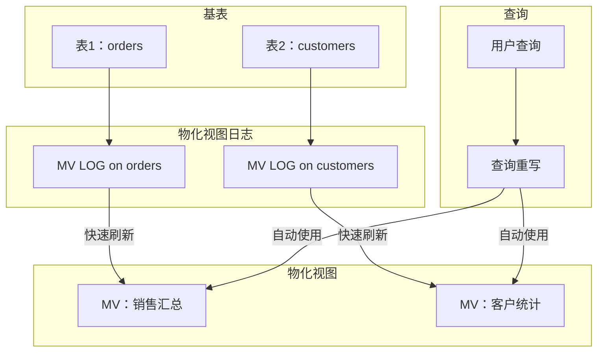
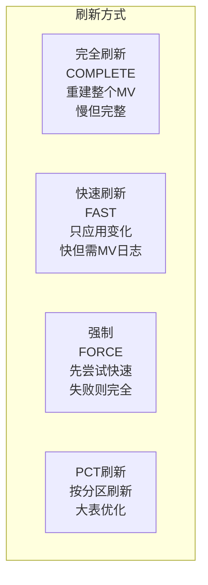
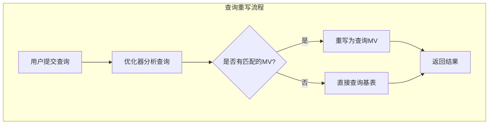

# Oracle物化视图技术

## 一、概述

### 1.1 一句话定义

Oracle物化视图（Materialized View，MV）是存储查询结果的数据库对象，通过预计算和缓存复杂查询结果来提高查询性能，并支持查询重写自动优化。
它在数据仓库和报表场景中出现和使用，解决复杂聚合查询、多表连接查询性能低下的问题。

### 1.2 为什么重要

- **不掌握的后果：** 报表查询需要数分钟甚至数小时，用户无法及时获得分析结果
- **掌握的价值：** 将分钟级查询优化到秒级甚至毫秒级，大幅提升报表和分析效率

### 1.3 适用场景

| 场景 | 说明 |
|------|------|
| 数据仓库 | 预计算聚合结果 |
| 报表系统 | 加速复杂报表查询 |
| 查询重写 | 自动优化匹配查询 |
| 数据同步 | 远程数据本地化 |
| 增量计算 | 只刷新变化的数据 |

### 1.4 版本演进

| 版本 | 变化说明 |
|------|---------|
| 11gR2 | 实时物化视图（Real-time MV） |
| 12cR1 | 外部表物化视图增强 |
| 12cR2 | 物化视图日志优化 |
| 19c | 自动物化视图建议 |
| 21c | 云环境物化视图管理 |

## 二、术语与概念

### 2.1 核心术语表

| 术语 | 含义 | 类比 |
|------|------|------|
| 物化视图 | 存储查询结果的数据库对象 | 预制的报表 |
| 查询重写 | 优化器自动将查询改为使用MV | 自动用预制报表 |
| 完全刷新 | 重新执行查询重建MV | 重做整份报表 |
| 快速刷新 | 只应用变化的数据 | 只更新变化的部分 |
| MV日志 | 记录基表变化的日志 | 变化记录本 |
| 陈旧度 | MV与基表数据的差异 | 报表的时效性 |
| PCT刷新 | 按分区刷新 | 只重做部分报表 |
| 实时MV | 查询时实时合并基表数据 | 预制+实时更新 |

### 2.2 物化视图架构



## 三、架构与原理

### 3.1 刷新方式对比



### 3.2 工作原理

1. **创建MV：** 执行查询并将结果存储为段
2. **创建MV日志：** 在基表上创建日志记录变更
3. **刷新MV：** 根据策略定期刷新MV数据
4. **查询重写：** 优化器自动将匹配的查询改为使用MV
5. **陈旧度管理：** 监控MV与基表数据的差异

**一句话总结：** 物化视图的核心是"预计算+自动重写"——将复杂查询结果预先存储，优化器自动将查询路由到MV。

### 3.3 查询重写流程



## 四、功能详解

### 4.1 创建物化视图

#### 功能说明

创建不同类型的物化视图。

#### 操作步骤

```sql
-- 步骤1：完全刷新MV（最简单）
CREATE MATERIALIZED VIEW mv_emp_summary
BUILD IMMEDIATE              -- 创建时立即填充数据
REFRESH COMPLETE ON DEMAND   -- 手动完全刷新
AS
SELECT department_id,
       COUNT(*) AS emp_count,
       AVG(salary) AS avg_salary,
       SUM(salary) AS total_salary
FROM employees
GROUP BY department_id;

-- 步骤2：支持快速刷新的MV
-- 先创建MV日志
CREATE MATERIALIZED VIEW LOG ON employees
WITH ROWID, SEQUENCE (department_id, salary)
INCLUDING NEW VALUES;

-- 创建支持快速刷新的MV
CREATE MATERIALIZED VIEW mv_emp_fast
BUILD IMMEDIATE
REFRESH FAST ON DEMAND
AS
SELECT department_id,
       COUNT(*) AS emp_count,
       SUM(salary) AS total_salary
FROM employees
GROUP BY department_id;

-- 步骤3：定时刷新MV
CREATE MATERIALIZED VIEW mv_daily_sales
BUILD IMMEDIATE
REFRESH COMPLETE
    START WITH SYSDATE
    NEXT SYSDATE + 1/24  -- 每小时刷新
ENABLE QUERY REWRITE
AS
SELECT TO_CHAR(sale_date, 'YYYY-MM-DD') AS sale_day,
       COUNT(*) AS order_count,
       SUM(amount) AS total_amount
FROM orders
GROUP BY TO_CHAR(sale_date, 'YYYY-MM-DD');

-- 步骤4：实时物化视图（11g+）
CREATE MATERIALIZED VIEW mv_realtime
ENABLE QUERY REWRITE
AS
SELECT department_id, COUNT(*) AS emp_count
FROM employees
GROUP BY department_id;
-- 查询时自动合并基表最新数据
```

### 4.2 刷新管理

```sql
-- 手动刷新
EXEC DBMS_MVIEW.REFRESH('MV_EMP_SUMMARY', 'C');  -- 完全刷新
EXEC DBMS_MVIEW.REFRESH('MV_EMP_FAST', 'F');      -- 快速刷新
EXEC DBMS_MVIEW.REFRESH('MV_EMP_FAST', '?');      -- FORCE

-- 批量刷新
BEGIN
    DBMS_MVIEW.REFRESH_DEPENDENT(
        list => 'MV_EMP_SUMMARY,MV_DAILY_SALES',
        method => 'F'
    );
END;
/

-- 使用DBMS_SCHEDULER定时刷新
BEGIN
    DBMS_SCHEDULER.CREATE_JOB(
        job_name => 'REFRESH_MV_HOURLY',
        job_type => 'PLSQL_BLOCK',
        job_action => 'BEGIN DBMS_MVIEW.REFRESH(''MV_DAILY_SALES'', ''C''); END;',
        repeat_interval => 'FREQ=HOURLY',
        enabled => TRUE,
        comments => '每小时刷新销售汇总MV'
    );
END;
/

-- 查看刷新状态
SELECT mview_name, last_refresh_date, stale,
       refresh_mode, refresh_method
FROM dba_mviews
WHERE owner = 'SALES';
```

### 4.3 查询重写

```sql
-- 启用查询重写
ALTER MATERIALIZED VIEW mv_emp_summary ENABLE QUERY REWRITE;

-- 查看重写配置
SELECT mview_name, rewrite_enabled, rewrite_capability
FROM dba_mviews
WHERE owner = 'SALES';

-- 验证查询重写
-- 方法1：EXPLAIN PLAN
EXPLAIN PLAN FOR
SELECT department_id, COUNT(*) FROM employees GROUP BY department_id;
SELECT * FROM TABLE(DBMS_XPLAN.DISPLAY);
-- 查看是否出现MAT_VIEW ACCESS

-- 方法2：DBMS_MVIEW.EXPLAIN_REWRITE
BEGIN
    DBMS_MVIEW.EXPLAIN_REWRITE(
        'SELECT department_id, COUNT(*) FROM employees GROUP BY department_id',
        'MV_EMP_SUMMARY'
    );
END;
/
SELECT * FROM rewrite_table;

-- 查询重写条件：
-- 1. MV的查询必须包含用户查询的所有数据
-- 2. 必须启用QUERY REWRITE
-- 3. 查询重写模式为TRUE或FORCE
SHOW PARAMETER query_rewrite_enabled;
```

### 4.4 MV监控与管理

```sql
-- 查看所有MV
SELECT mview_name, container_name, refresh_mode, refresh_method,
       last_refresh_date, stale, unknown,
       rewrite_enabled, rewrite_capability
FROM dba_mviews
WHERE owner = 'SALES';

-- 查看MV日志
SELECT log_table, master, log_option, rowids
FROM dba_mview_logs;

-- 查看MV大小
SELECT segment_name, bytes/1024/1024 AS mb
FROM dba_segments
WHERE segment_name LIKE 'MV_%';

-- 删除MV
DROP MATERIALIZED VIEW mv_emp_summary;

-- 删除MV日志
DROP MATERIALIZED VIEW LOG ON employees;

-- 检查MV陈旧度
SELECT mview_name, stale, last_refresh_date,
       ROUND((SYSDATE - last_refresh_date) * 24, 2) AS hours_stale
FROM dba_mviews
WHERE owner = 'SALES';
```

### 4.5 MV调优

```sql
-- 为MV创建索引加速查询
CREATE INDEX idx_mv_dept ON mv_emp_summary(department_id);

-- 使用分区MV
CREATE MATERIALIZED VIEW mv_partitioned
PARTITION BY RANGE (sale_month)
(
    PARTITION p2025 VALUES LESS THAN ('2026-01'),
    PARTITION p2026 VALUES LESS THAN ('2027-01'),
    PARTITION pmax VALUES LESS THAN (MAXVALUE)
)
BUILD IMMEDIATE
REFRESH COMPLETE ON DEMAND
AS
SELECT TO_CHAR(sale_date, 'YYYY-MM') AS sale_month,
       SUM(amount) AS total
FROM orders
GROUP BY TO_CHAR(sale_date, 'YYYY-MM');

-- PCT刷新（只刷新变化的分区）
-- 需要基表也是分区表
```

## 五、性能与调优

### 5.1 性能基线

| 指标 | 正常范围 | 告警阈值 | 说明 |
|------|---------|---------|------|
| MV查询加速比 | > 10x | < 2x | 相比直接查询基表 |
| 刷新时间 | < 业务窗口 | > 1小时 | 刷新耗时 |
| 陈旧度 | < 1小时 | > 1天 | MV数据时效 |
| 重写命中率 | > 80% | < 50% | 查询被重写的比例 |

### 5.2 调优建议

| 场景 | 建议 | 原因 |
|------|------|------|
| 刷新慢 | 使用快速刷新 | 只应用变化数据 |
| 查询未重写 | 检查重写条件 | 启用REWRITE |
| MV太大 | 分区MV | 便于管理 |
| 数据太旧 | 增加刷新频率 | 减少陈旧度 |

## 六、DFX能力

### 6.1 动态性能视图

| 视图名 | 用途 | 关键字段 |
|--------|------|---------|
| DBA_MVIEWS | MV列表 | MVIEW_NAME, STALE, REFRESH_MODE |
| DBA_MVIEW_LOGS | MV日志 | LOG_TABLE, MASTER |
| DBA_REGISTERED_MVIEWS | 注册的MV | NAME, UPDATE_LOG |
| REWRITE_TABLE | 重写分析结果 | QUERY, MESSAGE |

### 6.2 监控脚本

```sql
-- MV健康检查
SELECT mview_name, stale, last_refresh_date,
       ROUND((SYSDATE - last_refresh_date) * 24, 2) AS hours_stale,
       rewrite_enabled
FROM dba_mviews
WHERE owner = 'SALES'
ORDER BY last_refresh_date;

-- 查看刷新历史
SELECT job, log_user, last_date, next_date, broken
FROM dba_jobs
WHERE what LIKE '%REFRESH%';
```

## 七、实战案例

### 7.1 案例背景

- **场景**：某数据仓库Oracle 19c，月度销售报表查询需要15分钟
- **时间**：月度结算
- **现象**：复杂聚合查询涉及5张表，数据量1亿行

### 7.2 诊断过程

**步骤1：分析查询**

```sql
EXPLAIN PLAN FOR
SELECT d.department_name, p.product_name,
       SUM(s.amount) AS total_sales,
       COUNT(*) AS order_count
FROM sales s
JOIN products p ON s.product_id = p.product_id
JOIN departments d ON s.dept_id = d.dept_id
WHERE s.sale_date BETWEEN DATE '2026-01-01' AND DATE '2026-06-30'
GROUP BY d.department_name, p.product_name;
```
- → 发现：HASH JOIN + HASH GROUP BY，逻辑读500万
- → 判断：需要预计算

**步骤2：创建物化视图**

```sql
-- 创建MV日志
CREATE MATERIALIZED VIEW LOG ON sales WITH ROWID, SEQUENCE
    (product_id, dept_id, sale_date, amount) INCLUDING NEW VALUES;
CREATE MATERIALIZED VIEW LOG ON products WITH ROWID, SEQUENCE
    (product_id, product_name) INCLUDING NEW VALUES;
CREATE MATERIALIZED VIEW LOG ON departments WITH ROWID, SEQUENCE
    (dept_id, department_name) INCLUDING NEW VALUES;

-- 创建MV
CREATE MATERIALIZED VIEW mv_sales_summary
BUILD IMMEDIATE
REFRESH FAST ON DEMAND
ENABLE QUERY REWRITE
AS
SELECT d.department_name,
       p.product_name,
       s.sale_date,
       SUM(s.amount) AS total_sales,
       COUNT(*) AS order_count
FROM sales s
JOIN products p ON s.product_id = p.product_id
JOIN departments d ON s.dept_id = d.dept_id
GROUP BY d.department_name, p.product_name, s.sale_date;
```

**步骤3：验证查询重写**

```sql
EXPLAIN PLAN FOR
SELECT d.department_name, p.product_name, SUM(s.amount)
FROM sales s JOIN products p ON s.product_id = p.product_id
JOIN departments d ON s.dept_id = d.dept_id
WHERE s.sale_date BETWEEN DATE '2026-01-01' AND DATE '2026-06-30'
GROUP BY d.department_name, p.product_name;

SELECT * FROM TABLE(DBMS_XPLAN.DISPLAY);
-- 显示 MAT_VIEW ACCESS FULL MV_SALES_SUMMARY
```

### 7.3 解决结果

| 指标 | 解决前 | 解决后 |
|------|--------|--------|
| 查询时间 | 15分钟 | 2秒 |
| 逻辑读 | 5,000,000 | 500 |
| 刷新时间 | - | 30秒（每小时） |

### 7.4 复盘总结

- **根因：** 复杂聚合查询每次都重新计算
- **教训：** 数据仓库场景必须使用MV预计算；MV日志是快速刷新的前提

## 八、常见错误与排查

### 8.1 常见错误列表

| 错误代码 | 错误信息 | 原因 | 解决方法 |
|---------|---------|------|---------|
| ORA-12015 | 不是简单查询 | MV查询太复杂 | 简化查询或完全刷新 |
| ORA-12018 | 快速刷新失败 | 不满足快速刷新条件 | 检查MV日志 |
| ORA-12096 | MV日志不存在 | 未创建MV日志 | 创建MV日志 |
| QSM-00721 | 无法重写 | 不满足重写条件 | 检查REWRITE配置 |

### 8.2 排查步骤

1. **检查MV状态：** `SELECT * FROM dba_mviews`
2. **检查MV日志：** `SELECT * FROM dba_mview_logs`
3. **测试刷新：** `DBMS_MVIEW.REFRESH`
4. **验证重写：** `DBMS_MVIEW.EXPLAIN_REWRITE`
5. **检查陈旧度：** `stale`列

## 九、最佳实践

### 9.1 官方推荐

- 数据仓库场景使用MV预计算聚合
- 启用查询重写自动优化
- 创建MV日志支持快速刷新
- 使用DBMS_SCHEDULER管理刷新任务

### 9.2 社区经验

- 先分析查询模式再设计MV
- MV索引可进一步加速查询
- 分区MV便于管理和刷新
- 监控MV陈旧度设置告警

### 9.3 反模式

| 反模式 | 问题 | 正确做法 |
|--------|------|---------|
| 不创建MV日志 | 无法快速刷新 | 基表上创建MV日志 |
| MV不刷新 | 数据陈旧 | 配置定时刷新 |
| 不启用重写 | 查询不走MV | ENABLE QUERY REWRITE |
| MV过多 | 维护成本高 | 只创建必要的MV |
| 不监控陈旧度 | 数据过时不知 | 设置陈旧度告警 |

## 十、命令与视图汇总

### 10.1 命令列表

| 命令 | 适用场景 | 说明 |
|------|---------|------|
| `CREATE MATERIALIZED VIEW` | 创建MV | 物化视图 |
| `CREATE MATERIALIZED VIEW LOG` | 创建日志 | 支持快速刷新 |
| `DBMS_MVIEW.REFRESH` | 刷新MV | 手动刷新 |
| `DBMS_MVIEW.EXPLAIN_REWRITE` | 分析重写 | 验证重写 |
| `ALTER MV ENABLE QUERY REWRITE` | 启用重写 | 自动优化 |

### 10.2 视图列表

| 视图名 | 类型 | 用途 | 关键字段 |
|--------|------|------|---------|
| DBA_MVIEWS | 数据字典 | MV列表 | STALE, REFRESH_MODE |
| DBA_MVIEW_LOGS | 数据字典 | MV日志 | LOG_TABLE |
| DBA_REGISTERED_MVIEWS | 数据字典 | 注册MV | NAME |
| REWRITE_TABLE | 分析结果 | 重写分析 | QUERY, MESSAGE |

## 十一、总结速查

### 11.1 黄金法则

1. **MV预计算** - 数据仓库必备
2. **快速刷新** - 创建MV日志
3. **启用重写** - 自动优化查询
4. **定时刷新** - 控制数据陈旧度
5. **MV索引** - 进一步加速

### 11.2 一页纸检查清单

| 现象/场景 | 原因 | 处理方案 |
|-----------|------|----------|
| 报表查询慢 | 未使用MV | 创建MV预计算 |
| 刷新失败 | MV日志缺失 | 创建MV日志 |
| 查询未重写 | REWRITE未启用 | ENABLE QUERY REWRITE |
| 数据太旧 | 刷新频率低 | 增加刷新频率 |
| MV占用大 | 未分区 | 使用分区MV |

### 11.3 关键数字

| 指标 | 正常范围 | 告警阈值 | 说明 |
|------|---------|---------|------|
| 查询加速比 | > 10x | < 2x | MV效果 |
| 刷新时间 | < 业务窗口 | > 1小时 | 刷新耗时 |
| 陈旧度 | < 1小时 | > 1天 | 数据时效 |

## 附录

### A. 官方参考

- [Oracle Database Data Warehousing Guide](https://docs.oracle.com/en/database/oracle/oracle-database/19c/dwhsg/)
- [Oracle Database Administrator's Guide - Materialized Views](https://docs.oracle.com/en/database/oracle/oracle-database/19c/admin/)
- MOS Note: 1359841.1 - "Materialized View Best Practices"

### B. 数据字典

| 对象名 | 类型 | 说明 |
|--------|------|------|
| DBA_MVIEWS | 数据字典 | MV信息 |
| DBA_MVIEW_LOGS | 数据字典 | MV日志 |
| DBA_REGISTERED_MVIEWS | 数据字典 | 注册MV |

### C. 修订记录

| 日期 | 版本 | 修改内容 | 修改人 |
|------|------|---------|--------|
| 2026-07-02 | v1.0 | 初始版本 | YashanDB知识库生成器 |
| 2026-07-02 | v1.1 | 补充完整模板章节 | YashanDB知识库生成器 |
