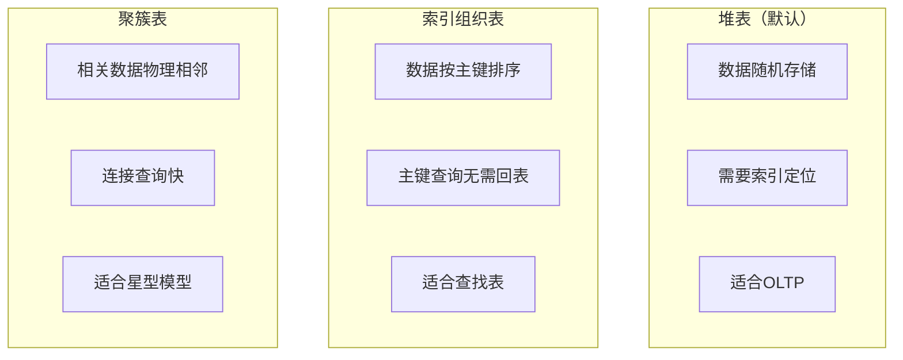
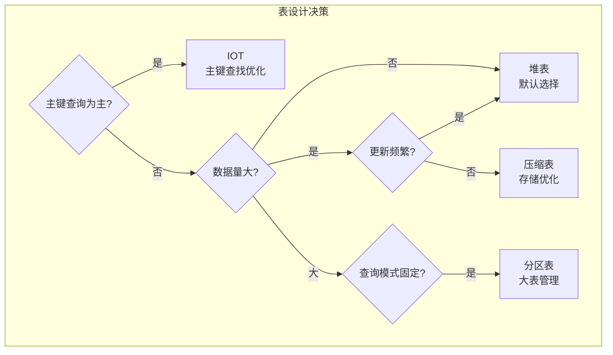
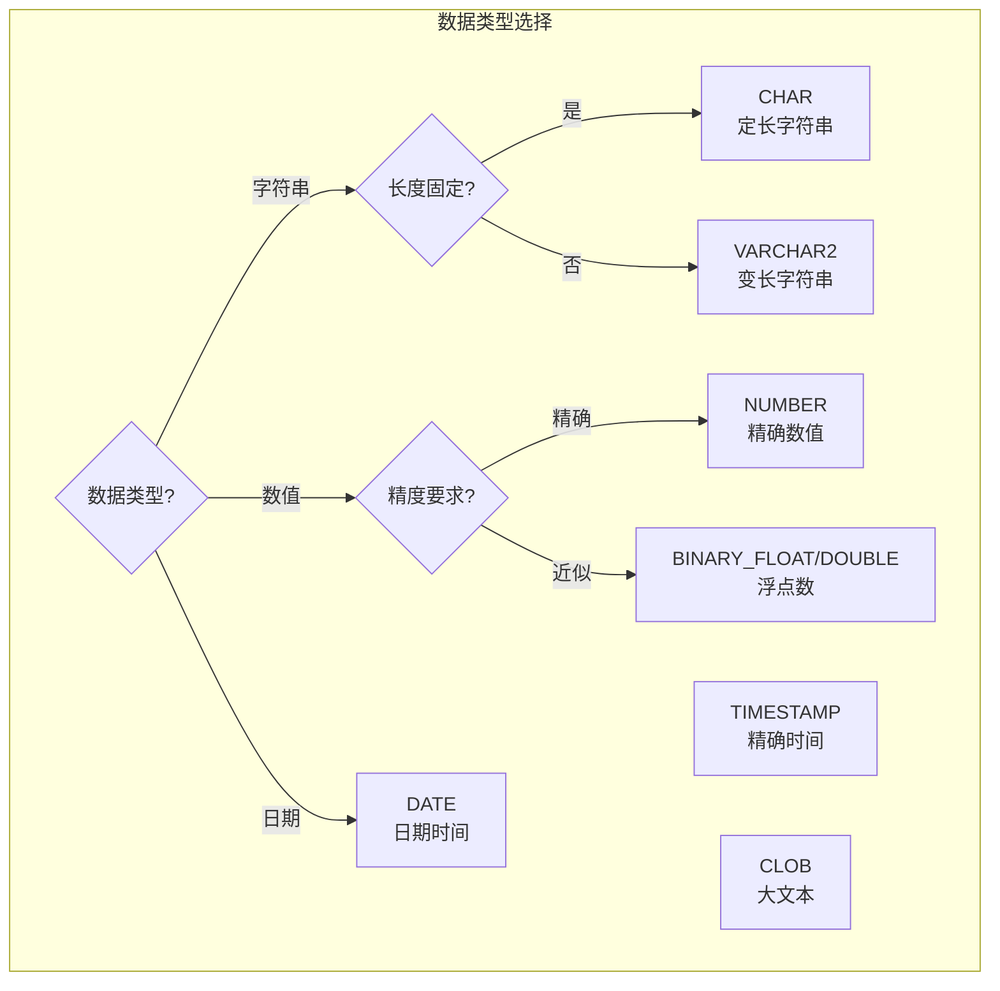

# Oracle表设计优化

## 一、概述

### 1.1 一句话定义

Oracle表设计优化是通过合理选择数据类型、存储参数、表组织方式（堆表/IOT/聚簇）和压缩策略，在满足业务需求的同时最大化查询性能和存储效率的过程。
它在数据库设计阶段和性能调优中出现和使用，解决表设计不当导致的查询慢、存储浪费和维护困难问题。

### 1.2 为什么重要

- **不掌握的后果：** 表设计不当导致全表扫描频繁、存储空间浪费、DML性能差、维护成本高
- **掌握的价值：** 良好的表设计可使查询性能提升5-10倍，存储成本降低50-80%

### 1.3 适用场景

| 场景 | 说明 |
|------|------|
| 新建表设计 | 选择合适的数据类型和存储参数 |
| 大表优化 | 压缩、分区、IOT等技术 |
| 存储成本优化 | 减少磁盘占用 |
| 查询性能优化 | 通过表组织方式提高查询效率 |
| 数据仓库设计 | 列式存储、压缩策略 |

### 1.4 版本演进

| 版本 | 变化说明 |
|------|---------|
| 11gR2 | OLTP压缩（HCC for OLTP）引入 |
| 12cR1 | 自动数据类型优化，临时表增强 |
| 12cR2 | 在线表重组织增强 |
| 19c | 自动存储优化，JSON数据类型 |
| 21c | 多模型数据类型支持 |

## 二、术语与概念

### 2.1 核心术语表

| 术语 | 含义 | 类比 |
|------|------|------|
| 堆表 | Oracle默认表组织方式 | 随意堆放的文件 |
| IOT | 索引组织表，数据存储在索引中 | 按编号排列的文件柜 |
| 聚簇表 | 相关数据物理上存储在一起 | 相关文件放同一抽屉 |
| PCTFREE | 预留空间百分比（用于更新） | 文件袋预留空间 |
| 压缩 | 减少数据存储大小 | 文件压缩打包 |
| 虚拟列 | 不存储的计算列 | 自动计算的字段 |
| 不可见列 | 不显示的列 | 隐藏字段 |
| 默认值 | 列的默认值 | 默认填充内容 |

### 2.2 表组织方式对比



## 三、架构与原理

### 3.1 表设计决策流程



### 3.2 工作原理

1. **数据类型选择：** 选择最合适的数据类型，避免过度分配
2. **表组织选择：** 根据查询模式选择堆表/IOT/聚簇表
3. **存储参数：** 配置PCTFREE、INITRANS等参数
4. **压缩策略：** 根据读写比例选择压缩方式
5. **辅助特性：** 虚拟列、默认值、不可见列等

**一句话总结：** 表设计的核心是"选择正确的数据类型 + 合适的表组织方式 + 合理的存储参数"。

### 3.3 数据类型选择指南



## 四、功能详解

### 4.1 数据类型最佳实践

#### 功能说明

选择合适的数据类型是表设计的基础。

#### 操作步骤

```sql
-- 字符串类型
CREATE TABLE demo_strings (
    code        CHAR(10),        -- 固定长度：编码、ID
    name        VARCHAR2(100),   -- 变长：名称
    description VARCHAR2(4000),  -- 长文本：描述
    large_text  CLOB             -- 超大文本：文档
);

-- 数值类型
CREATE TABLE demo_numbers (
    id          NUMBER(10),       -- 整数ID
    amount      NUMBER(15,2),     -- 金额（精确）
    rate        BINARY_DOUBLE,    -- 比率（浮点）
    quantity    INTEGER           -- 数量
);

-- 日期时间类型
CREATE TABLE demo_dates (
    create_date   DATE,                    -- 日期时间（秒精度）
    modify_time   TIMESTAMP,               -- 时间戳（微秒精度）
    event_time    TIMESTAMP WITH TIME ZONE -- 带时区时间戳
);

-- 避免的错误
-- 错误：用VARCHAR2存日期
-- 错误：用NUMBER存金额不指定精度
-- 错误：用VARCHAR2存布尔值（用NUMBER(1)）
```

### 4.2 表压缩

```sql
-- OLTP压缩（适合频繁更新的表）
CREATE TABLE orders_comp
COMPRESS FOR OLTP
AS SELECT * FROM orders;

-- 查看压缩效果
SELECT segment_name, bytes/1024/1024 AS mb, compression
FROM dba_segments
WHERE segment_name = 'ORDERS_COMP';

-- 现有表添加压缩
ALTER TABLE orders MODIFY COMPRESS FOR OLTP;
-- 需要MOVE使压缩生效
ALTER TABLE orders MOVE;
-- 12c+可以在线MOVE
ALTER TABLE orders MOVE ONLINE;

-- 查询压缩效果
SELECT table_name, compression, compress_for
FROM dba_tables
WHERE owner = 'SALES';

-- Warehouse压缩（适合数据仓库，只读场景）
-- CREATE TABLE fact_data COMPRESS FOR QUERY AS SELECT ...;
-- CREATE TABLE fact_data COLUMN STORE COMPRESS FOR QUERY HIGH AS SELECT ...;
```

### 4.3 索引组织表（IOT）

```sql
-- 创建IOT（适合主键查询为主的表）
CREATE TABLE emp_lookup (
    employee_id NUMBER PRIMARY KEY,
    first_name  VARCHAR2(50),
    last_name   VARCHAR2(50),
    department_id NUMBER,
    email       VARCHAR2(100)
)
ORGANIZATION INDEX
INCLUDING department_id    -- 这些列存储在索引叶节点
OVERFLOW TABLESPACE users; -- 溢出的列放在溢出段

-- IOT优势：
-- 1. 主键查询无需回表（数据在索引中）
-- 2. 存储空间更小（无ROWID开销）
-- 3. 范围扫描效率高（数据按主键排序）

-- IOT适用场景：
-- - 查找表/字典表
-- - 主键查询为主的OLTP
-- - 数据量不大的参考表

-- 带溢出表的IOT（大行处理）
CREATE TABLE large_iot (
    id NUMBER PRIMARY KEY,
    small_col VARCHAR2(50),
    large_col1 VARCHAR2(2000),
    large_col2 VARCHAR2(2000)
)
ORGANIZATION INDEX
INCLUDING small_col
OVERFLOW TABLESPACE users;
```

### 4.4 虚拟列与默认值

```sql
-- 虚拟列（不存储，计算得出）
CREATE TABLE employees (
    employee_id  NUMBER,
    first_name   VARCHAR2(50),
    last_name    VARCHAR2(50),
    salary       NUMBER(10,2),
    -- 虚拟列
    full_name    GENERATED ALWAYS AS (first_name || ' ' || last_name) VIRTUAL,
    annual_pay   GENERATED ALWAYS AS (salary * 12) VIRTUAL,
    hire_year    GENERATED ALWAYS AS (EXTRACT(YEAR FROM hire_date)) VIRTUAL
);

-- 虚拟列可以建索引
CREATE INDEX emp_name_idx ON employees(full_name);

-- 虚拟列可以用于分区键
-- CREATE TABLE ... PARTITION BY RANGE (hire_year) ...

-- 默认值
CREATE TABLE orders (
    order_id    NUMBER,
    order_date  DATE DEFAULT SYSDATE,
    status      VARCHAR2(20) DEFAULT 'PENDING',
    created_by  VARCHAR2(50) DEFAULT SYS_CONTEXT('USERENV', 'SESSION_USER')
);

-- 不可见列（12c+）
ALTER TABLE employees ADD (secret_code VARCHAR2(100) INVISIBLE);
-- SELECT * 不会显示，但显式指定列名可以访问
SELECT employee_id, secret_code FROM employees;
```

### 4.5 存储参数优化

```sql
-- PCTFREE和PCTUSED
CREATE TABLE employees (
    employee_id NUMBER,
    name VARCHAR2(100),
    salary NUMBER(10,2)
)
PCTFREE 20     -- 预留20%空间给更新（如果经常更新salary）
PCTUSED 40;    -- 低于40%时可插入新行

-- PCTFREE建议：
-- 很少更新的表：PCTFREE 5-10
-- 经常更新的表：PCTFREE 20-30
-- 只插入不更新的表：PCTFREE 0

-- INITRANS（初始事务槽数）
CREATE TABLE high_concurrency (
    id NUMBER,
    data VARCHAR2(100)
)
INITRANS 16;  -- 高并发场景增大

-- LOB存储优化
CREATE TABLE documents (
    doc_id   NUMBER,
    content  CLOB
)
LOB(content) STORE AS (
    CHUNK 32K         -- 块大小
    CACHE READS       -- 读时缓存
    STORAGE (INITIAL 100M)
);
```

## 五、性能与调优

### 5.1 性能基线

| 指标 | 正常范围 | 告警阈值 | 说明 |
|------|---------|---------|------|
| 行迁移率 | < 1% | > 5% | PCTFREE设置不当 |
| 压缩率 | 50-80% | < 30% | 压缩效果 |
| 链式行 | < 1% | > 5% | 行太大或块太小 |
| 空间利用率 | 70-90% | < 50% | 存储浪费 |

### 5.2 调优建议

| 场景 | 建议 | 原因 |
|------|------|------|
| 大表存储浪费 | 启用压缩 | 减少50-80%存储 |
| 主键查询慢 | 使用IOT | 消除回表 |
| 行迁移严重 | 调整PCTFREE | 预留足够更新空间 |
| 大字段查询慢 | 优化LOB存储 | CHUNK和CACHE设置 |

## 六、DFX能力

### 6.1 动态性能视图

| 视图名 | 用途 | 关键字段 |
|--------|------|---------|
| DBA_TABLES | 表信息 | COMPRESSION, PCT_FREE, IOT_TYPE |
| DBA_TAB_COLUMNS | 列信息 | DATA_TYPE, DATA_LENGTH, VIRTUAL_COLUMN |
| DBA_SEGMENTS | 段信息 | BYTES, BLOCKS |
| DBA_LOBS | LOB信息 | CHUNK, CACHE |

### 6.2 监控脚本

```sql
-- 检查行迁移
ANALYZE TABLE employees LIST CHAINED ROWS;
SELECT * FROM chained_rows WHERE table_name = 'EMPLOYEES';

-- 检查压缩效果
SELECT table_name, compression, compress_for,
       blocks, num_rows
FROM dba_tables
WHERE owner = 'SALES'
AND compression = 'ENABLED';

-- 检查表空间使用
SELECT tablespace_name,
       ROUND(SUM(bytes)/1024/1024) AS total_mb,
       ROUND(SUM(maxbytes)/1024/1024) AS max_mb
FROM dba_data_files
GROUP BY tablespace_name;
```

## 七、实战案例

### 7.1 案例背景

- **场景**：某系统Oracle 19c，订单表5000万行，占用500GB存储
- **时间**：存储成本优化项目
- **现象**：存储成本高，全表扫描查询慢

### 7.2 诊断过程

**步骤1：分析表结构**

```sql
SELECT table_name, num_rows, blocks, avg_row_len,
       compression, compress_for
FROM dba_tables
WHERE table_name = 'ORDERS';
```
- → 发现：5000万行，6.4M blocks，无压缩，avg_row_len=200
- → 判断：可以启用压缩减少存储

**步骤2：分析查询模式**

```sql
-- 查看Top SQL
SELECT sql_id, sql_text, executions
FROM v$sql
WHERE sql_text LIKE '%FROM orders%'
ORDER BY executions DESC;
```
- → 发现：大部分查询按order_date范围查询
- → 判断：可以按日期分区 + 压缩

**步骤3：实施优化**

```sql
-- 1. 启用OLTP压缩
ALTER TABLE orders MOVE COMPRESS FOR OLTP ONLINE;

-- 2. 按日期分区（在线重定义）
-- 使用DBMS_REDEFINITION在线转换为分区表

-- 3. 添加虚拟列简化查询
ALTER TABLE orders ADD (order_month GENERATED ALWAYS AS (
    TO_CHAR(order_date, 'YYYY-MM')
) VIRTUAL);
```

### 7.3 解决结果

| 指标 | 解决前 | 解决后 |
|------|--------|--------|
| 存储占用 | 500GB | 150GB（压缩70%） |
| 全表扫描时间 | 30分钟 | 8分钟 |
| 存储成本 | 高 | 降低70% |

### 7.4 复盘总结

- **根因：** 表未压缩，大量历史数据占用存储
- **教训：** 大表设计时就应考虑压缩策略；历史数据用Warehouse压缩

## 八、常见错误与排查

### 8.1 常见错误列表

| 问题 | 原因 | 解决方法 |
|------|------|---------|
| 行迁移严重 | PCTFREE过小 | 增大PCTFREE |
| 存储空间浪费 | 未压缩 | 启用压缩 |
| 主键查询慢 | 堆表回表开销 | 使用IOT |
| 链式行多 | 行太大或块太小 | 增大块大小 |

### 8.2 排查步骤

1. **检查表结构：** `SELECT * FROM dba_tables WHERE table_name = '...'`
2. **检查行迁移：** `ANALYZE TABLE ... LIST CHAINED ROWS`
3. **检查存储：** `SELECT * FROM dba_segments WHERE segment_name = '...'`
4. **分析查询模式：** 查看AWR/ASH中的Top SQL
5. **评估压缩效果：** 测试压缩后的空间节省

## 九、最佳实践

### 9.1 官方推荐

- 大表启用OLTP压缩（减少50-80%存储）
- 主键查询为主的表使用IOT
- 正确设置PCTFREE避免行迁移
- 使用虚拟列简化查询逻辑

### 9.2 社区经验

- 数据类型选择遵循"最小够用"原则
- 大表设计时就考虑分区策略
- LOB字段单独表空间管理
- 定期分析行迁移和链式行

### 9.3 反模式

| 反模式 | 问题 | 正确做法 |
|--------|------|---------|
| 所有列VARCHAR2(4000) | 存储浪费 | 指定合理长度 |
| 不启用压缩 | 存储成本高 | 大表启用压缩 |
| PCTFREE=0频繁更新 | 行迁移严重 | 根据更新频率设置 |
| 不用IOT | 主键查询有回表开销 | 查找表用IOT |
| 不分区大表 | 维护困难 | 大表按时间分区 |

## 十、命令与视图汇总

### 10.1 命令列表

| 命令 | 适用场景 | 说明 |
|------|---------|------|
| `ALTER TABLE ... COMPRESS FOR OLTP` | 启用压缩 | OLTP压缩 |
| `ALTER TABLE ... MOVE ONLINE` | 在线重组织 | 不锁定表 |
| `ANALYZE TABLE ... LIST CHAINED ROWS` | 检查行迁移 | 链式行分析 |
| `CREATE TABLE ... ORGANIZATION INDEX` | 创建IOT | 索引组织表 |

### 10.2 视图列表

| 视图名 | 类型 | 用途 | 关键字段 |
|--------|------|------|---------|
| DBA_TABLES | 数据字典 | 表信息 | COMPRESSION, PCT_FREE |
| DBA_TAB_COLUMNS | 数据字典 | 列信息 | DATA_TYPE, VIRTUAL_COLUMN |
| DBA_SEGMENTS | 数据字典 | 段大小 | BYTES, BLOCKS |
| CHAINED_ROWS | 分析结果 | 链式行 | HEAD_ROWID |

## 十一、总结速查

### 11.1 黄金法则

1. **数据类型最小够用** - 避免VARCHAR2(4000)滥用
2. **大表启用压缩** - 减少50-80%存储
3. **PCTFREE合理** - 根据更新频率设置
4. **IOT用于查找表** - 主键查询无回表
5. **虚拟列简化逻辑** - 计算列不存储

### 11.2 一页纸检查清单

| 现象/场景 | 原因 | 处理方案 |
|-----------|------|----------|
| 存储浪费 | 未压缩 | 启用OLTP压缩 |
| 行迁移多 | PCTFREE过小 | 增大PCTFREE |
| 主键查询慢 | 堆表回表 | 使用IOT |
| 大表维护难 | 未分区 | 按时间分区 |
| 链式行多 | 行太大 | 增大块大小 |

### 11.3 关键数字

| 指标 | 正常范围 | 告警阈值 | 说明 |
|------|---------|---------|------|
| 压缩率 | 50-80% | < 30% | 压缩效果 |
| 行迁移率 | < 1% | > 5% | PCTFREE问题 |
| 链式行率 | < 1% | > 5% | 块大小问题 |

## 附录

### A. 官方参考

- [Oracle Database Administrator's Guide - Tables](https://docs.oracle.com/en/database/oracle/oracle-database/19c/admin/)
- [Oracle Database VLDB and Partitioning Guide](https://docs.oracle.com/en/database/oracle/oracle-database/19c/vldbg/)
- MOS Note: 1297535.1 - "Table Compression Best Practices"

### B. 数据字典

| 对象名 | 类型 | 说明 |
|--------|------|------|
| DBA_TABLES | 数据字典 | 表基本信息 |
| DBA_TAB_COLUMNS | 数据字典 | 列信息 |
| DBA_SEGMENTS | 数据字典 | 段大小 |
| DBA_LOBS | 数据字典 | LOB存储 |

### C. 修订记录

| 日期 | 版本 | 修改内容 | 修改人 |
|------|------|---------|--------|
| 2026-07-02 | v1.0 | 初始版本 | YashanDB知识库生成器 |
| 2026-07-02 | v1.1 | 补充完整模板章节 | YashanDB知识库生成器 |
