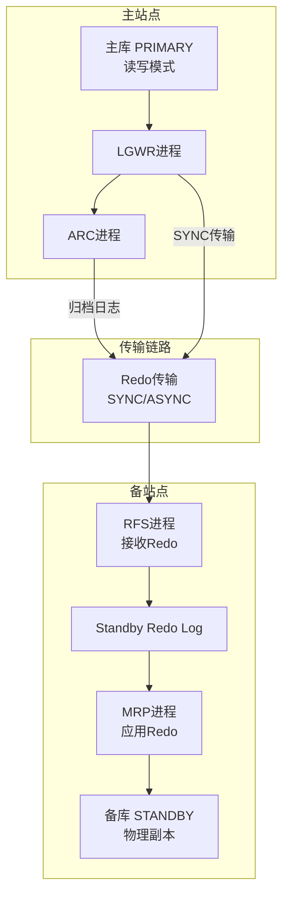
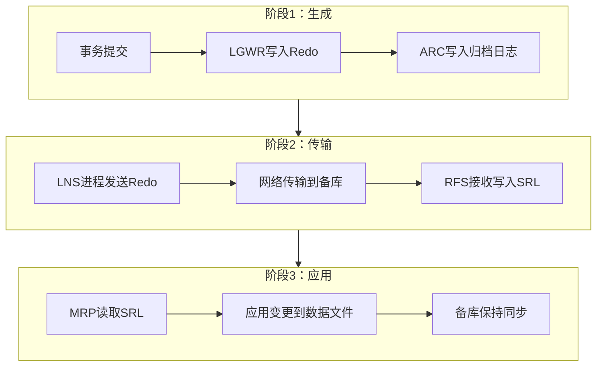
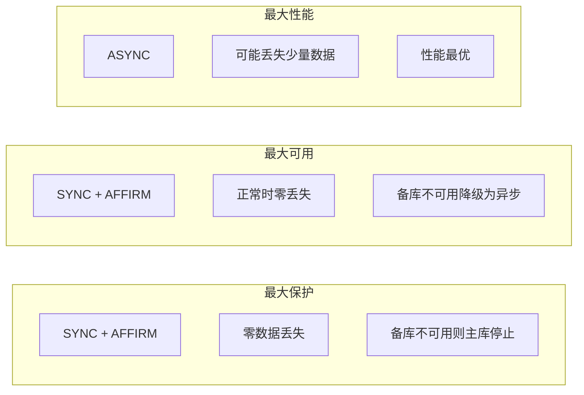
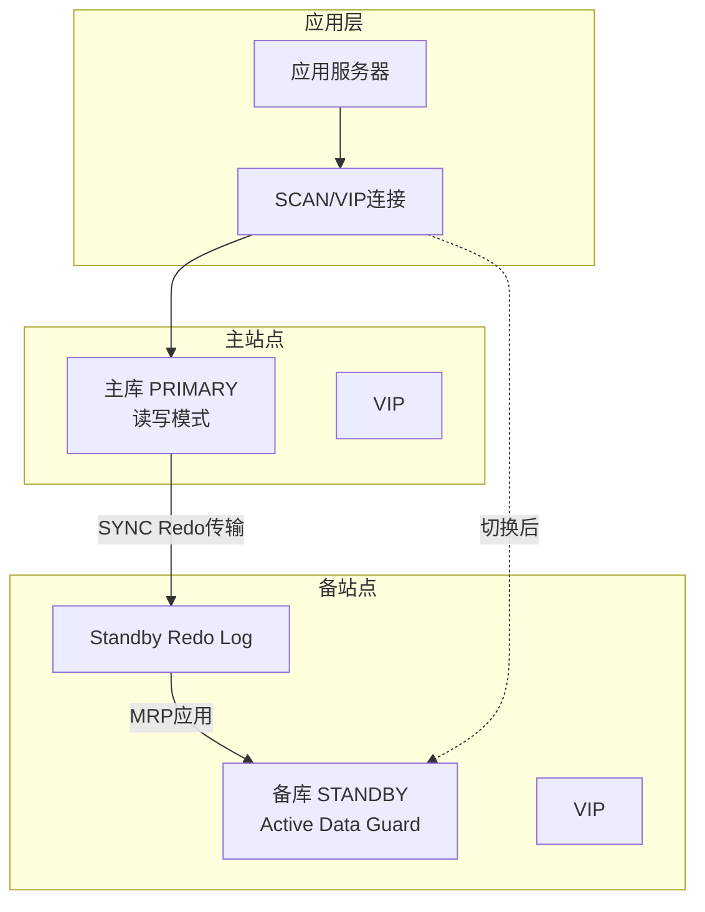

# Oracle Data Guard物理复制

## 一、概述

### 1.1 一句话定义

Oracle Data Guard是通过Redo日志传输实现数据库物理复制的高可用技术，主库产生的Redo实时传输到备库并应用，提供数据保护、灾难恢复和读写分离能力。
它在高可用架构中出现和使用，解决单点故障风险，满足RPO/RTO要求，实现跨站点容灾。

### 1.2 为什么重要

- **不掌握的后果：** 单点故障导致业务长时间中断，数据丢失无法满足合规要求
- **掌握的价值：** 实现RPO=0的数据保护和秒级RTO的快速切换，满足金融级容灾要求

### 1.3 适用场景

| 场景 | 说明 |
|------|------|
| 灾难恢复 | 主站点故障时快速切换到备站点 |
| 数据保护 | 零数据丢失的最大保护模式 |
| 读写分离 | Active Data Guard备库提供只读查询 |
| 滚动升级 | 备库先升级再切换，减少停机时间 |
| 备份卸载 | 在备库执行备份，减轻主库压力 |

### 1.4 版本演进

| 版本 | 变化说明 |
|------|---------|
| 11gR2 | Active Data Guard发布，备库可只读打开 |
| 12cR1 | Far Sync实例引入，实现零数据丢失+异步性能 |
| 12cR2 | 自动备库创建，简化部署 |
| 19c | 自动Switchover支持，DGMGRL简化 |
| 21c | PDB级别Data Guard支持 |

## 二、术语与概念

### 2.1 核心术语表

| 术语 | 含义 | 类比 |
|------|------|------|
| Primary | 主库，读写模式 | 正式仓库 |
| Standby | 备库，接收并应用Redo | 影子仓库 |
| Redo Transport | Redo日志传输服务 | 快递服务 |
| Redo Apply | 备库应用Redo到数据文件 | 按清单补货 |
| Switchover | 计划性角色互换 | 有序交接 |
| Failover | 故障时备库提升为主库 | 紧急替补 |
| SRL | Standby Redo Log，备库重做日志 | 备用的笔记本 |
| FAL | Fetch Archive Log，归档日志获取 | 自动补发丢失件 |
| Protection Mode | 保护模式，决定数据保护级别 | 安全等级 |

### 2.2 Data Guard架构



## 三、架构与原理

### 3.1 Redo传输与应用流程



### 3.2 工作原理

1. **Redo生成：** 主库LGWR将事务变更写入在线Redo日志
2. **Redo传输：** LNS进程将Redo通过网络传输到备库的Standby Redo Log
3. **Redo接收：** 备库RFS进程接收Redo并写入SRL
4. **Redo应用：** MRP进程从SRL读取Redo并应用到备库数据文件
5. **间隙处理：** FAL自动获取缺失的归档日志
6. **角色切换：** Switchover（计划）或Failover（故障）

**一句话总结：** Data Guard的核心是"Redo传输+Redo应用"——主库的每一次变更都通过Redo日志传递到备库，备库通过应用Redo保持与主库一致。

### 3.3 保护模式对比



## 四、功能详解

### 4.1 Data Guard部署

#### 功能说明

使用RMAN从主库复制创建物理备库。

#### 操作步骤

```sql
-- 步骤1：主库配置
-- 启用强制日志
ALTER DATABASE FORCE LOGGING;

-- 配置传输参数
ALTER SYSTEM SET log_archive_dest_2 = 'SERVICE=standby LGWR SYNC AFFIRM VALID_FOR=(ONLINE_LOGFILES,PRIMARY_ROLE) DB_UNIQUE_NAME=standby';
ALTER SYSTEM SET fal_server = 'standby';
ALTER SYSTEM SET fal_client = 'primary';
ALTER SYSTEM SET standby_file_management = AUTO;

-- 创建Standby Redo Log（至少比主库多一组）
ALTER DATABASE ADD STANDBY LOGFILE THREAD 1 GROUP 4 SIZE 500M;
ALTER DATABASE ADD STANDBY LOGFILE THREAD 1 GROUP 5 SIZE 500M;
ALTER DATABASE ADD STANDBY LOGFILE THREAD 1 GROUP 6 SIZE 500M;
ALTER DATABASE ADD STANDBY LOGFILE THREAD 1 GROUP 7 SIZE 500M;
```

```bash
# 步骤2：备库配置
# 使用RMAN从主库复制
rman target sys/password@primary auxiliary sys/password@standby

RMAN> DUPLICATE TARGET DATABASE FOR STANDBY FROM ACTIVE DATABASE
      NOFILENAMECHECK;

# 步骤3：启动Redo应用
sqlplus sys/password@standby
ALTER DATABASE RECOVER MANAGED STANDBY DATABASE DISCONNECT;
```

### 4.2 Active Data Guard

```sql
-- 启用Active Data Guard（备库只读打开）
ALTER DATABASE OPEN READ ONLY;
ALTER DATABASE RECOVER MANAGED STANDBY DATABASE USING CURRENT LOGFILE;

-- 备库可以：
-- 1. 只读查询（报表、分析）
-- 2. 备份操作（减轻主库压力）
-- 3. 临时表操作

-- 注意：备库只读模式下不能执行DML
```

### 4.3 保护模式配置

```sql
-- 最大保护模式（零数据丢失）
ALTER DATABASE SET STANDBY DATABASE TO MAXIMIZE PROTECTION;

-- 最大可用模式（推荐）
ALTER DATABASE SET STANDBY DATABASE TO MAXIMIZE AVAILABILITY;

-- 最大性能模式
ALTER DATABASE SET STANDBY DATABASE TO MAXIMIZE PERFORMANCE;

-- 查看当前保护模式
SELECT protection_mode, protection_level FROM v$database;
```

### 4.4 Switchover与Failover

```sql
-- Switchover（计划切换，零数据丢失）
-- 主库
SELECT switchover_status FROM v$database;
-- 应显示 TO STANDBY
ALTER DATABASE COMMIT TO SWITCHOVER TO STANDBY;

-- 备库
ALTER DATABASE COMMIT TO SWITCHOVER TO PRIMARY;
ALTER DATABASE OPEN;

-- Failover（故障切换，可能丢数据）
-- 备库
ALTER DATABASE RECOVER MANAGED STANDBY DATABASE FINISH;
ALTER DATABASE ACTIVATE STANDBY DATABASE;
ALTER DATABASE OPEN;

-- 验证角色
SELECT database_role, open_mode FROM v$database;
```

### 4.5 Far Sync实例

```sql
-- Far Sync实例（12c+）
-- 一个只有SRL没有数据文件的轻量级实例
-- 部署在主库和备库之间
-- 实现零数据丢失 + 异步性能

-- 配置：主库 → Far Sync（SYNC） → 备库（ASYNC）
-- 主库到Far Sync同步传输保证零丢失
-- Far Sync到备库异步传输保证性能
```

## 五、性能与调优

### 5.1 性能影响因素

- **网络带宽：** 影响Redo传输速度
- **Redo生成速率：** 主库事务量决定
- **备库I/O：** 影响Redo应用速度
- **保护模式：** SYNC模式增加主库延迟

### 5.2 性能基线

| 指标 | 正常范围 | 告警阈值 | 说明 |
|------|---------|---------|------|
| Transport Lag | < 1秒 | > 10秒 | Redo传输延迟 |
| Apply Lag | < 5秒 | > 30秒 | Redo应用延迟 |
| 归档间隙 | 0 | > 0 | 缺失的归档日志 |

### 5.3 调优建议

| 场景 | 建议 | 原因 |
|------|------|------|
| Transport Lag高 | 检查网络带宽 | 网络是传输瓶颈 |
| Apply Lag高 | 增大备库I/O能力 | Redo应用是I/O密集 |
| 主库延迟高 | 使用ASYNC或Far Sync | SYNC增加主库等待 |

## 六、DFX能力

### 6.1 动态性能视图

| 视图名 | 用途 | 关键字段 |
|--------|------|---------|
| V$DATABASE | 数据库角色和保护模式 | DATABASE_ROLE, PROTECTION_MODE |
| V$DATAGUARD_STATS | DG延迟统计 | NAME, VALUE |
| V$DATAGUARD_STATUS | DG事件日志 | SEVERITY, MESSAGE |
| V$ARCHIVE_GAP | 归档间隙 | THREAD#, LOW_SEQUENCE# |
| V$MANAGED_STANDBY | 备库进程状态 | PROCESS, STATUS |

### 6.2 监控命令

```sql
-- 查看DG状态
SELECT name, value, datum_time FROM v$dataguard_stats
WHERE name IN ('transport lag', 'apply lag');

-- 查看保护模式
SELECT protection_mode, protection_level FROM v$database;

-- 查看归档应用
SELECT sequence#, applied FROM v$archived_log
WHERE applied = 'NO' ORDER BY first_time DESC;
```

## 七、实战案例

### 7.1 案例背景

- **场景**：某银行Oracle 19c Data Guard环境，最大可用模式
- **时间**：主库服务器计划维护
- **现象**：需要执行Switchover将服务迁移到备库

### 7.2 诊断过程

**步骤1：检查切换条件**

```sql
-- 主库检查
SELECT switchover_status FROM v$database;
-- TO STANDBY → 可以切换
```
- → 发现：状态为TO STANDBY
- → 判断：满足切换条件

**步骤2：检查延迟**

```sql
SELECT name, value FROM v$dataguard_stats
WHERE name IN ('transport lag', 'apply lag');
```
- → 发现：transport lag = 0秒，apply lag = 2秒
- → 判断：延迟很低，可以安全切换

**步骤3：执行Switchover**

```sql
-- 主库
ALTER DATABASE COMMIT TO SWITCHOVER TO STANDBY;
-- 备库
ALTER DATABASE COMMIT TO SWITCHOVER TO PRIMARY;
ALTER DATABASE OPEN;
```

**步骤4：验证结果**

```sql
SELECT database_role, open_mode FROM v$database;
-- PRIMARY / READ WRITE
```

### 7.3 解决结果

| 指标 | 目标 | 实际 |
|------|------|------|
| 停机时间 | < 5分钟 | 30秒 |
| 数据丢失 | 0 | 0 |
| 应用重连 | < 1分钟 | 15秒 |

### 7.4 复盘总结

- **根因：** 计划性维护，使用Switchover零数据丢失
- **教训：** 切换前确认switchover_status和延迟指标

## 八、常见错误与排查

### 8.1 常见错误列表

| 错误代码 | 错误信息 | 原因 | 解决方法 |
|---------|---------|------|---------|
| ORA-16810 | Multiple errors or warnings | DG配置异常 | SHOW CONFIGURATION |
| ORA-16086 | Standby redo log不可用 | SRL空间不足 | 增大SRL |
| ORA-00279 | change number needed | 归档日志缺失 | FAL获取 |
| ORA-16792 | DG配置被禁用 | Broker配置问题 | ENABLE CONFIGURATION |

### 8.2 排查步骤

1. **检查DG状态：** `SELECT * FROM v$dataguard_stats`
2. **检查传输：** `SELECT * FROM v$archive_dest WHERE dest_id = 2`
3. **检查应用：** `SELECT * FROM v$managed_standby`
4. **检查间隙：** `SELECT * FROM v$archive_gap`
5. **查看alert.log：** DG相关错误

## 九、最佳实践

### 9.1 官方推荐

- 使用最大可用模式（兼顾安全和性能）
- 配置Active Data Guard实现读写分离
- 每季度执行一次Switchover演练
- 监控transport lag和apply lag

### 9.2 社区经验

- SRL数量至少比主库在线Redo多一组
- 备库配置与主库相同的硬件规格
- 使用DGMGRL简化切换操作
- 备库也做定期备份

### 9.3 反模式

| 反模式 | 问题 | 正确做法 |
|--------|------|---------|
| 不监控延迟 | 容灾失效无感知 | 实时监控transport/apply lag |
| 从不演练切换 | 真正故障时手忙脚乱 | 每季度Switchover演练 |
| SRL数量不足 | Redo传输等待 | SRL比在线Redo多一组 |
| 忽略归档间隙 | 备库数据不一致 | 间隙>0立即告警 |
| 备库不备份 | 备库也故障时无数据 | 备库也做定期备份 |

## 十、命令与视图汇总

### 10.1 命令列表

| 命令 | 适用场景 | 说明 |
|------|---------|------|
| `ALTER DATABASE RECOVER MANAGED STANDBY DATABASE` | 启动Redo应用 | 启动MRP |
| `ALTER DATABASE COMMIT TO SWITCHOVER TO STANDBY` | 计划切换 | 主库变备库 |
| `ALTER DATABASE ACTIVATE STANDBY DATABASE` | 故障切换 | 备库变主库 |
| `ALTER DATABASE ADD STANDBY LOGFILE` | 添加SRL | 备库重做日志 |
| `RMAN> DUPLICATE ... FOR STANDBY` | 创建备库 | 从主库复制 |

### 10.2 视图列表

| 视图名 | 类型 | 用途 | 关键字段 |
|--------|------|------|---------|
| V$DATABASE | 动态 | 角色和保护模式 | DATABASE_ROLE |
| V$DATAGUARD_STATS | 动态 | 延迟统计 | NAME, VALUE |
| V$ARCHIVE_GAP | 动态 | 归档间隙 | SEQUENCE# |
| V$MANAGED_STANDBY | 动态 | 备库进程 | PROCESS, STATUS |

## 十一、总结速查

### 11.1 黄金法则

1. **FORCE LOGGING** - 主库必须启用强制日志
2. **最大可用模式** - 兼顾安全和性能
3. **定期演练** - 每季度Switchover测试
4. **监控延迟** - transport lag和apply lag实时监控
5. **SRL充足** - 至少比在线Redo多一组

### 11.2 一页纸检查清单

| 现象/场景 | 原因 | 处理方案 |
|-----------|------|----------|
| Transport Lag高 | 网络问题 | 检查网络带宽 |
| Apply Lag高 | 备库I/O瓶颈 | 优化备库存储 |
| 归档间隙 | 网络闪断 | FAL自动获取 |
| Switchover失败 | switchover_status异常 | 检查活跃会话 |
| 备库无法打开 | Redo应用未停止 | 先CANCEL再OPEN |

### 11.3 关键数字

| 指标 | 正常范围 | 告警阈值 | 说明 |
|------|---------|---------|------|
| Transport Lag | < 1秒 | > 10秒 | Redo传输延迟 |
| Apply Lag | < 5秒 | > 30秒 | Redo应用延迟 |
| 归档间隙 | 0 | > 0 | 缺失归档日志 |
| 切换时间 | < 30秒 | > 5分钟 | Switchover耗时 |

## 附录

### A. 拓扑示例



### B. 官方参考

- [Oracle Data Guard Concepts and Administration](https://docs.oracle.com/en/database/oracle/oracle-database/19c/sbydb/)
- [Oracle Data Guard Broker](https://docs.oracle.com/en/database/oracle/oracle-database/19c/dgbkr/)
- MOS Note: 2196973.1 - "Data Guard Best Practices"

### C. 修订记录

| 日期 | 版本 | 修改内容 | 修改人 |
|------|------|---------|--------|
| 2026-07-02 | v1.0 | 初始版本 | YashanDB知识库生成器 |
| 2026-07-02 | v1.1 | 补充完整模板章节 | YashanDB知识库生成器 |
