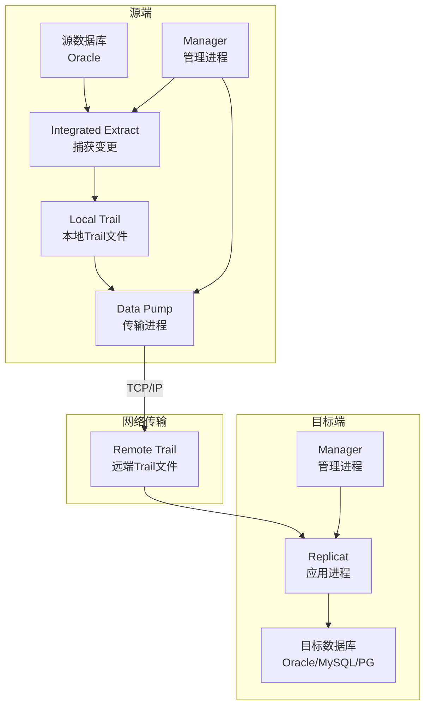
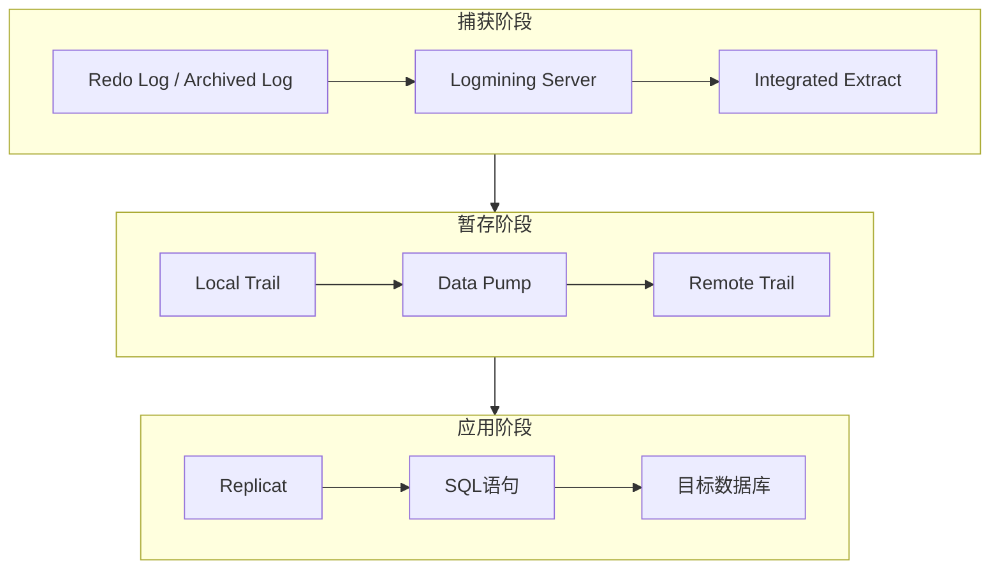
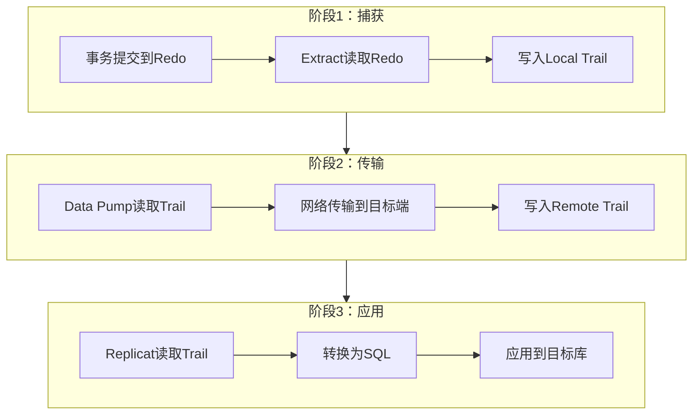
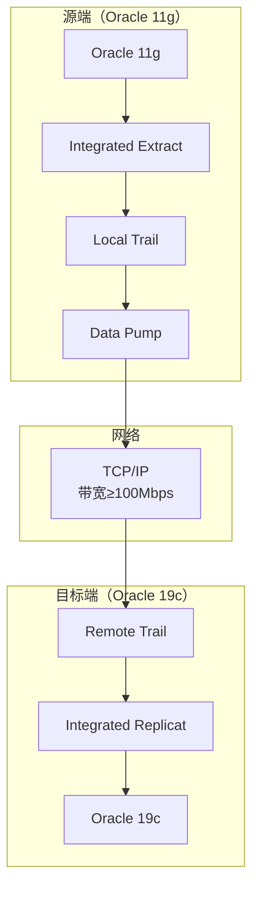

# Oracle GoldenGate逻辑复制

## 一、概述

### 1.1 一句话定义

Oracle GoldenGate是基于数据库日志的逻辑复制工具，通过捕获源库的Redo/归档日志变更，实时传输并应用到目标数据库，支持同构和异构数据库间的数据同步。
它在数据集成、零停机迁移和高可用场景中出现和使用，解决跨平台、跨版本的实时数据同步问题。

### 1.2 为什么重要

- **不掌握的后果：** 无法实现异构数据库间的实时同步，数据迁移需要停机窗口，容灾架构受限于同版本同平台
- **掌握的价值：** 实现零停机迁移、异构数据集成、双向复制多活架构，RPO接近零

### 1.3 适用场景

| 场景 | 说明 |
|------|------|
| 零停机迁移 | Oracle版本升级或平台迁移 |
| 异构数据集成 | Oracle到MySQL/PostgreSQL/Kafka等 |
| 实时数仓 | 生产库到分析库的实时同步 |
| 双向复制 | 多活架构的数据同步 |
| 数据订阅 | 将数据库变更推送到消息队列 |

### 1.4 版本演进

| 版本 | 变化说明 |
|------|---------|
| 11gR2 | Classic Extract/Replicat架构成熟 |
| 12cR1 | Integrated Extract引入，减少源库开销 |
| 12cR2 | 支持Oracle到Kafka、NoSQL |
| 19c | 微服务架构（Microservices），REST API管理 |
| 21c | 云原生部署，OCI集成，自动伸缩 |

## 二、术语与概念

### 2.1 核心术语表

| 术语 | 含义 | 类比 |
|------|------|------|
| Extract | 捕获进程，从Redo日志读取变更 | 抄写员，抄录日记变更 |
| Replicat | 应用进程，将变更写入目标库 | 执行者，按清单补货 |
| Trail文件 | 中间数据文件，存储变更数据 | 快递包裹 |
| Pump | 传输进程，将Trail文件传到远端 | 快递员 |
| Manager | 管理进程，控制其他进程 | 仓库管理员 |
| Integrated Extract | 集成提取，通过Logmining Server | 官方快递通道 |
| Classic Extract | 传统提取，直接读Redo | 手动翻日记 |
| DDL复制 | 复制DDL变更（CREATE/ALTER等） | 规则变更也同步通知 |

### 2.2 GoldenGate架构组件



## 三、架构与原理

### 3.1 数据流转架构



### 3.2 工作原理

1. **日志捕获：** Integrated Extract通过Logmining Server从Redo日志中读取变更
2. **格式转换：** 将变更转换为GoldenGate内部格式，写入Local Trail
3. **网络传输：** Data Pump将Trail文件通过网络传输到目标端
4. **变更应用：** Replicat读取Remote Trail，将变更转换为SQL执行
5. **事务保序：** 保证源端事务顺序在目标端一致
6. **冲突处理：** 双向复制时通过CDR机制处理冲突

**一句话总结：** GoldenGate通过"捕获日志→传输Trail→应用变更"的链路，实现数据库变更的实时逻辑复制。

### 3.3 数据流转流程



## 四、功能详解

### 4.1 Integrated Extract配置

#### 功能说明

Integrated Extract通过Oracle Logmining Server捕获变更，对源库性能影响最小。

#### 操作步骤

```bash
# 步骤1：源库配置
# 启用补充日志
sqlplus sys/password <<EOF
ALTER DATABASE ADD SUPPLEMENTAL LOG DATA;
ALTER DATABASE ADD SUPPLEMENTAL LOG DATA (PRIMARY KEY) COLUMNS;
EXIT;
EOF

# 步骤2：创建GoldenGate用户
sqlplus sys/password <<EOF
CREATE TABLESPACE ggs DATAFILE SIZE 1G AUTOEXTEND ON;
CREATE USER ggs IDENTIFIED BY password DEFAULT TABLESPACE ggs;
GRANT DBA TO ggs;
GRANT SELECT ANY DICTIONARY TO ggs;
GRANT SELECT ANY TABLE TO ggs;
EXIT;
EOF

# 步骤3：GGSCI配置Extract
GGSCI> DBLOGIN USERID ggs PASSWORD password
GGSCI> ADD TRANDATA hr.*
GGSCI> ADD EXTRACT ext1, INTEGRATED, TRANLOG
GGSCI> ADD EXTTRAIL ./dirdat/lt, EXTRACT ext1
GGSCI> REGISTER EXTRACT ext1 DATABASE
```

```text
# Extract参数文件
EXTRACT ext1
USERID ggs, PASSWORD password
EXTTRAIL ./dirdat/lt
TABLE hr.employees;
TABLE hr.departments;
TABLE hr.jobs;
```

### 4.2 Data Pump配置

```text
# Pump参数文件
EXTRACT dpump1
PASSTHRU
RMTHOST target_server, MGRPORT 7809
RMTTRAIL ./dirdat/rt
TABLE hr.*;
```

```bash
# 添加Pump
GGSCI> ADD EXTRACT dpump1, EXTTRAILSOURCE ./dirdat/lt
GGSCI> ADD RMTTRAIL ./dirdat/rt, EXTRACT dpump1
```

### 4.3 Replicat配置

```text
# Replicat参数文件
REPLICAT rep1
USERID ggs, PASSWORD password
MAP hr.employees, TARGET hr.employees;
MAP hr.departments, TARGET hr.departments;
MAP hr.jobs, TARGET hr.jobs;
```

```bash
# 添加Replicat
GGSCI> ADD REPLICAT rep1, INTEGRATED, EXTTRAIL ./dirdat/rt
GGSCI> START REPLICAT rep1
```

### 4.4 异构复制（Oracle到MySQL）

```text
# 源端Extract（Oracle）
EXTRACT ext_mysql
USERID ggs, PASSWORD password
EXTTRAIL ./dirdat/my
TABLE hr.*;

# 目标端Replicat（MySQL）
REPLICAT rep_mysql
TARGETDB mysqldb USERID root PASSWORD password
MAP hr.employees, TARGET employees;
MAP hr.departments, TARGET departments;
```

### 4.5 DDL复制

```text
# 启用DDL复制
-- Extract参数添加
DDL INCLUDE MAPPED

-- Replicat参数添加
DDL
```

```sql
-- 源库安装DDL支持
@marker_setup.sql
@ddl_setup.sql
@role_setup.sql
GRANT GGS_GGSUSER_ROLE TO ggs;
@ddl_enable.sql
```

## 五、性能与调优

### 5.1 性能影响因素

- **Extract模式：** Integrated Extract比Classic Extract对源库影响更小
- **Trail文件大小：** 影响传输延迟
- **Replicat模式：** Integrated Replicat比Classic Replicat性能更好
- **网络带宽：** 影响端到端延迟
- **过滤复杂度：** 复杂的FILTER/COMPUTE增加处理开销

### 5.2 调优建议

| 场景 | 建议 | 原因 |
|------|------|------|
| 高延迟 | 使用Integrated Extract/Replicat | 减少处理开销 |
| 大事务 | 增大GROUPTRANSOPS | 减少提交频率 |
| 高吞吐 | 批量应用模式 | 减少逐行开销 |
| 网络瓶颈 | 压缩Trail文件 | 减少传输量 |

### 5.3 性能基线

| 指标 | 正常范围 | 告警阈值 | 说明 |
|------|---------|---------|------|
| Extract延迟 | < 5秒 | > 30秒 | 捕获延迟 |
| Replicat延迟 | < 5秒 | > 30秒 | 应用延迟 |
| 端到端延迟 | < 10秒 | > 60秒 | 总延迟 |

## 六、DFX能力

### 6.1 监控视图与命令

| 命令/视图 | 用途 | 说明 |
|-----------|------|------|
| GGSCI> INFO ALL | 进程状态 | 所有进程运行状态 |
| GGSCI> LAG EXTRACT | Extract延迟 | 捕获延迟 |
| GGSCI> LAG REPLICAT | Replicat延迟 | 应用延迟 |
| GGSCI> STATS | 统计信息 | 处理行数统计 |
| DBA_GOLDENGATE_PROCESSES | 进程状态 | 数据库内视图 |

### 6.2 日志与告警

- **日志位置：** `$GG_HOME/dirrpt/*.rpt`（进程报告）
- **Discard文件：** `$GG_HOME/dirdsc/*.dsc`（被丢弃的记录）
- **告警配置：** 监控LAG指标，超过阈值告警

```bash
# 监控脚本示例
GGSCI> LAG EXTRACT ext1
# 输出：Lag Information: Lag 00:00:02
```

## 七、实战案例

### 7.1 案例背景

- **场景**：某企业Oracle 11g升级到19c，零停机迁移
- **时间**：周末维护窗口
- **现象**：需要在不停机的情况下将500GB数据从11g迁移到19c

### 7.2 诊断过程

**步骤1：部署GoldenGate**

```bash
# 在源库（11g）和目标库（19c）分别安装GoldenGate
# 配置Manager进程
GGSCI> EDIT PARAMS MGR
PORT 7809
GGSCI> START MGR
```

**步骤2：初始数据加载**

```bash
# 使用RMAN或Data Pump进行初始数据同步
# 记录SCN号
sqlplus sys/password <<EOF
SELECT current_scn FROM v$database;
-- SCN: 12345678
EOF

# GoldenGate从该SCN开始捕获
GGSCI> ALTER EXTRACT ext1, BEGIN 12345678
```

**步骤3：启动实时同步**

```bash
GGSCI> START EXTRACT ext1
GGSCI> START REPLICAT rep1

# 监控同步进度
GGSCI> LAG REPLICAT rep1
# Lag: 00:00:03
```

**步骤4：切换应用**

```bash
# 停止应用写入源库
# 等待GoldenGate同步完成
GGSCI> LAG REPLICAT rep1
# Lag: 00:00:00

# 切换应用到新库
# 验证数据一致性
```

### 7.3 解决结果

| 指标 | 目标 | 实际 |
|------|------|------|
| 停机时间 | < 30分钟 | 5分钟 |
| 数据一致性 | 100% | 100% |
| 同步延迟 | < 10秒 | 3秒 |

### 7.4 复盘总结

- **根因：** 传统导出导入需要长时间停机，GoldenGate实现增量同步
- **教训：** 初始数据加载和实时同步可以并行，只需在切换时短暂停机

## 八、常见错误与排查

### 8.1 常见错误列表

| 错误代码 | 错误信息 | 原因 | 解决方法 |
|---------|---------|------|---------|
| OGG-00446 | Unable to open database | 数据库连接失败 | 检查连接参数 |
| OGG-01154 | Conflict detected | 双向复制冲突 | 检查CDR配置 |
| OGG-01224 | Address already in use | Manager端口冲突 | 修改端口 |
| OGG-02253 | Extract abended | Extract异常 | 检查discard文件和日志 |
| ORA-26786 | Apply error | Replicat应用错误 | 检查目标表结构 |

### 8.2 排查步骤

1. **检查进程状态：** `GGSCI> INFO ALL`
2. **查看进程报告：** `cat $GG_HOME/dirrpt/*.rpt`
3. **检查discard文件：** `cat $GG_HOME/dirdsc/*.dsc`
4. **检查LAG：** `GGSCI> LAG EXTRACT/REPLICAT`
5. **查看数据库告警：** alert.log中的GoldenGate相关错误

### 8.3 解决方案

**方案一：重启异常进程**

```bash
GGSCI> STOP EXTRACT ext1
GGSCI> START EXTRACT ext1

# 如果仍失败，检查参数文件
GGSCI> EDIT PARAMS ext1
```

**方案二：跳过错误记录**

```bash
# Replicat参数中添加
REPERROR (DEFAULT, DISCARD)
# 错误记录写入discard文件，继续处理后续记录
```

## 九、最佳实践

### 9.1 官方推荐

- 使用Integrated Extract减少源库性能影响
- 所有同步表必须启用补充日志
- 配置Manager自动重启进程（AUTORESTART）
- 定期清理Trail文件（PURGEOLDEXTRACTS）

### 9.2 社区经验

- 初始加载和增量同步可以并行，减少总迁移时间
- 使用GGS Monitor监控GoldenGate运行状态
- 大表同步时使用FILTER减少不必要的数据传输
- 双向复制必须配置CDR冲突解决策略

### 9.3 反模式

| 反模式 | 问题 | 正确做法 |
|--------|------|---------|
| 不启用补充日志 | 无法正确捕获变更 | 所有同步表启用补充日志 |
| Classic Extract | 源库性能影响大 | 使用Integrated Extract |
| 不监控LAG | 延迟积累无感知 | 实时监控LAG指标 |
| Trail文件不清理 | 磁盘空间耗尽 | 配置PURGEOLDEXTRACTS |
| 不测试切换 | 迁移时手忙脚乱 | 提前演练切换流程 |

## 十、命令与视图汇总

### 10.1 命令列表

| 命令 | 适用场景 | 说明 |
|------|---------|------|
| `GGSCI> INFO ALL` | 状态检查 | 所有进程状态 |
| `GGSCI> LAG EXTRACT` | 延迟监控 | Extract延迟 |
| `GGSCI> LAG REPLICAT` | 延迟监控 | Replicat延迟 |
| `GGSCI> STATS` | 统计 | 处理行数统计 |
| `GGSCI> ADD TRANDATA` | 配置 | 添加补充日志 |
| `ALTER DATABASE ADD SUPPLEMENTAL LOG DATA` | 初始化 | 启用数据库级补充日志 |

### 10.2 视图列表

| 视图名 | 类型 | 用途 | 关键字段 |
|--------|------|------|---------|
| DBA_GOLDENGATE_PROCESSES | 动态 | 进程状态 | PROCESS_NAME, STATUS |
| DBA_APPLY | 数据字典 | 应用信息 | APPLY_NAME, STATUS |
| DBA_CAPTURE | 数据字典 | 捕获信息 | CAPTURE_NAME, STATUS |
| V$LOGMNR_CONTENTS | 动态 | Logmining内容 | SQL_REDO, OPERATION |

## 十一、总结速查

### 11.1 黄金法则

1. **Integrated模式** - 使用Integrated Extract/Replicat减少性能影响
2. **补充日志** - 所有同步表必须启用补充日志
3. **监控LAG** - 实时监控端到端延迟
4. **自动重启** - Manager配置AUTORESTART
5. **定期清理** - 清理Trail文件防止磁盘满

### 11.2 一页纸检查清单

| 现象/场景 | 原因 | 处理方案 |
|-----------|------|----------|
| Extract ABENDED | 日志不可用或连接失败 | 检查Redo日志和数据库连接 |
| Replicat ABENDED | 应用错误或冲突 | 检查discard文件，修复数据 |
| LAG持续增大 | 处理能力不足或网络慢 | 优化Replicat或增大资源 |
| Trail文件暴增 | 目标端处理慢 | 检查Replicat状态 |
| 数据不一致 | 补充日志未启用 | 检查并启用补充日志 |

### 11.3 关键数字

| 指标 | 正常范围 | 告警阈值 | 说明 |
|------|---------|---------|------|
| Extract LAG | < 5秒 | > 30秒 | 捕获延迟 |
| Replicat LAG | < 5秒 | > 30秒 | 应用延迟 |
| 端到端延迟 | < 10秒 | > 60秒 | 总延迟 |
| Trail文件大小 | < 10GB | > 50GB | 磁盘空间 |

## 附录

### A. 拓扑示例



### B. 官方参考

- [Oracle GoldenGate Documentation](https://docs.oracle.com/en/middleware/goldengate/)
- [Oracle GoldenGate Best Practices](https://docs.oracle.com/en/middleware/goldengate/core/index.html)
- MOS Note: 1306963.1 - "GoldenGate Configuration Guide"

### C. 修订记录

| 日期 | 版本 | 修改内容 | 修改人 |
|------|------|---------|--------|
| 2026-07-02 | v1.0 | 初始版本 | YashanDB知识库生成器 |
| 2026-07-02 | v1.1 | 补充完整模板章节 | YashanDB知识库生成器 |
