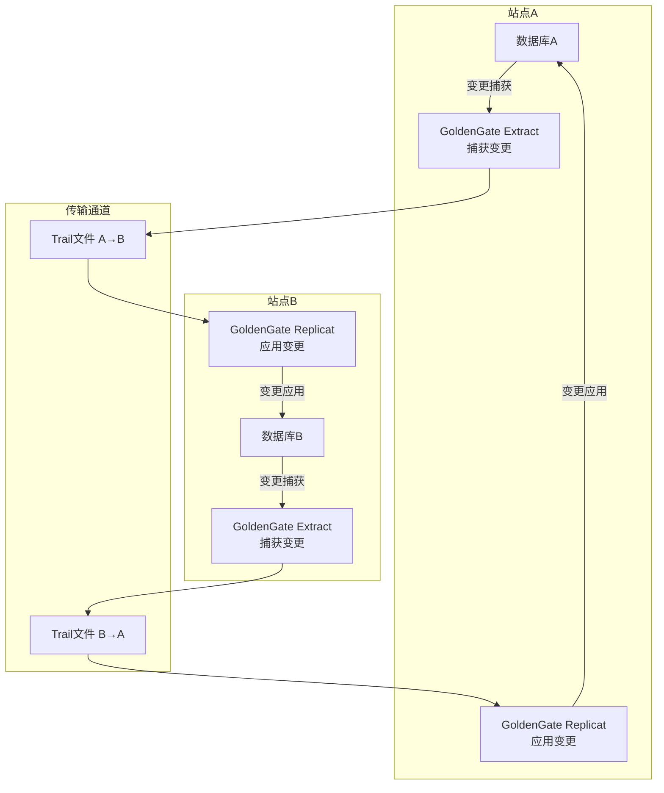
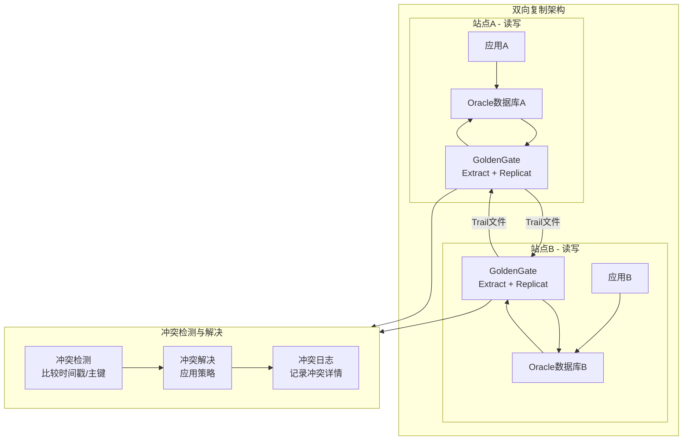
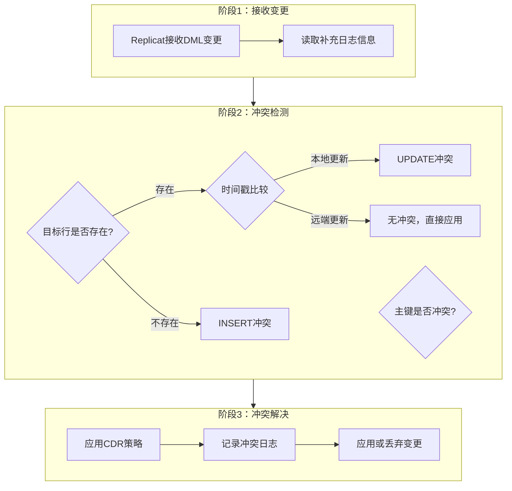
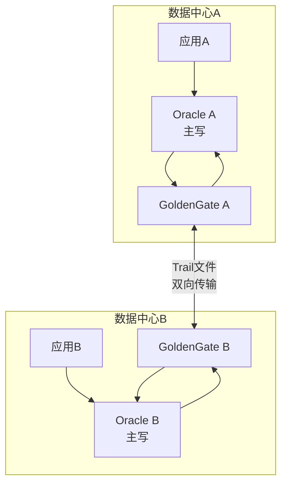

# Oracle双向复制与冲突解决

## 一、概述

### 1.1 一句话定义

Oracle双向复制是数据在两个或多个数据库间双向同步的技术，通过GoldenGate、XStream等组件实现多活数据同步，并通过冲突检测和解决机制保证数据一致性。
它在多活架构和数据分发场景中出现和使用，解决多节点同时写入导致的数据冲突问题。

### 1.2 为什么重要

- **不掌握的后果：** 双向同步时同一行数据被两端同时修改，导致数据不一致或复制中断，业务数据损坏
- **掌握的价值：** 设计合理的冲突解决策略，保证多活架构下数据最终一致性，支撑业务多站点并发写入

### 1.3 适用场景

| 场景 | 说明 |
|------|------|
| 多活数据中心 | 两个数据中心同时接受写入，需要双向同步 |
| 分支机构同步 | 总部与分支各自写入，定期同步合并 |
| 数据迁移过渡期 | 新旧系统并行运行，双向同步保证一致性 |
| 离线/在线混合 | 移动端离线操作后与中心数据库合并 |
| 跨区域业务 | 不同区域的用户各自写入本地数据库 |

### 1.4 版本演进

| 版本 | 变化说明 |
|------|---------|
| 11gR2 | Advanced Replication逐步废弃，推荐GoldenGate |
| 12cR1 | XStream 2.0，支持双向XStream In/Out |
| 12cR2 | GoldenGate 12.2内置冲突检测与解决（CDR） |
| 19c | GoldenGate 19.1增强CDR，支持更多冲突解决策略 |
| 21c | GoldenGate微服务架构，简化双向复制部署 |

## 二、术语与概念

### 2.1 核心术语表

| 术语 | 含义 | 类比 |
|------|------|------|
| 双向复制 | 数据在两端互相同步 | 两个人互相抄对方的笔记 |
| 冲突 | 同一行数据被两端同时修改 | 两个人同时改同一份文件 |
| CDR | Conflict Detection and Resolution，冲突检测与解决 | 自动仲裁机制 |
| 补充日志 | 记录额外列信息用于冲突检测 | 给每行数据加时间戳标记 |
| 时间戳优先 | 以最后修改时间为准的冲突解决策略 | "后来者居上" |
| 站点优先级 | 指定某个站点的数据优先 | "领导说了算" |
| XStream | Oracle提供的流式数据接口 | 数据库变更的"直播频道" |
| 事务顺序 | 保证事务按原始顺序应用 | 按时间线回放录像 |

### 2.2 关键角色与组件



## 三、架构与原理

### 3.1 双向复制架构图



### 3.2 工作原理

1. **变更捕获：** GoldenGate Extract从Redo日志中捕获DML变更
2. **变更传输：** 通过Trail文件将变更传输到对端
3. **冲突检测：** Replicat在应用变更前检查是否存在冲突
4. **冲突解决：** 根据预定义策略（时间戳/优先级）解决冲突
5. **变更应用：** 将解决后的变更应用到目标数据库
6. **冲突记录：** 将冲突详情写入日志供人工审查

**一句话总结：** 双向复制的核心挑战是冲突处理——通过补充日志记录修改时间和来源，在冲突发生时按预设策略自动仲裁。

### 3.3 冲突检测流程



## 四、功能详解

### 4.1 冲突类型与检测

#### 功能说明

双向复制中可能出现的冲突类型及对应的检测方法。

#### 冲突类型详解

| 类型 | 说明 | 检测方法 | 频率 |
|------|------|---------|------|
| 更新冲突 | 同一行被两端更新 | 补充日志+时间戳比较 | 常见 |
| 插入冲突 | 两端插入相同主键 | 主键唯一性检查 | 较少 |
| 删除冲突 | 一端删除另一端更新 | 行存在性检查 | 少见 |
| 删除删除 | 两端删除同一行 | 行存在性检查 | 极少 |

### 4.2 补充日志配置

#### 操作步骤

```sql
-- 步骤1：启用数据库级补充日志
ALTER DATABASE ADD SUPPLEMENTAL LOG DATA;
ALTER DATABASE ADD SUPPLEMENTAL LOG DATA (PRIMARY KEY) COLUMNS;
ALTER DATABASE ADD SUPPLEMENTAL LOG DATA (ALL) COLUMNS;

-- 步骤2：添加时间戳列用于冲突检测
ALTER TABLE employees ADD (
    last_update TIMESTAMP DEFAULT SYSTIMESTAMP,
    source_site VARCHAR2(30) DEFAULT SYS_CONTEXT('USERENV','DB_UNIQUE_NAME')
);

-- 步骤3：创建自动更新时间戳的触发器
CREATE OR REPLACE TRIGGER trg_emp_update_ts
BEFORE UPDATE ON employees
FOR EACH ROW
BEGIN
    :NEW.last_update := SYSTIMESTAMP;
    :NEW.source_site := SYS_CONTEXT('USERENV','DB_UNIQUE_NAME');
END;
/

-- 步骤4：配置GoldenGate补充日志组
-- GGSCI命令
-- GGSCI> DBLOGIN USERID ggs_admin PASSWORD xxx
-- GGSCI> ADD TRANDATA hr.employees COLS last_update, source_site
```

### 4.3 GoldenGate CDR配置

#### 操作步骤

```text
-- GGSCI配置冲突检测与解决

-- 配置UPDATE冲突解决：最新时间戳优先
GGSCI> ADD REPLICAT rep_a, INTEGRATED, EXTTRAIL ./dirdat/ra
GGSCI> EDIT PARAMS rep_a

-- Replicat参数文件内容
REPLICAT rep_a
USERID ggs_admin, PASSWORD xxx
MAP hr.employees, TARGET hr.employees,
    COMPARECOLS (ON UPDATE ALL, ON DELETE ALL),
    RESOLVECONFLICT (UPDATEROWEXISTS,
        (DEFAULT, USEMAX (last_update)));

-- 配置INSERT冲突解决：忽略重复插入
MAP hr.employees, TARGET hr.employees,
    RESOLVECONFLICT (INSERTROWEXISTS,
        (DEFAULT, DISCARD));

-- 配置DELETE冲突解决：删除优先
MAP hr.employees, TARGET hr.employees,
    RESOLVECONFLICT (DELETEROWEXISTS,
        (DEFAULT, OVERWRITE));
```

### 4.4 冲突解决策略详解

| 策略 | 说明 | 适用场景 | 配置方法 |
|------|------|---------|---------|
| USEMAX | 最新时间戳优先 | 一般业务场景 | USEMAX(last_update) |
| USEMIN | 最早时间戳优先 | 特殊保留需求 | USEMIN(last_update) |
| DISCARD | 丢弃冲突行 | 插入冲突 | DISCARD |
| OVERWRITE | 覆盖目标行 | 删除优先 | OVERWRITE |
| IGNORE | 忽略冲突 | 可接受数据丢失 | IGNORE |
| 自定义 | 调用自定义函数 | 复杂业务逻辑 | CDCAPI函数 |

### 4.5 XStream双向复制

```sql
-- 创建XStream Out（捕获变更）
BEGIN
    DBMS_XSTREAM_ADM.CREATE_OUTBOUND(
        server_name  => 'xout_employees',
        table_names  => 'hr.employees',
        include_dml  => TRUE,
        include_ddl  => FALSE
    );
END;
/

-- 创建XStream In（应用变更）
BEGIN
    DBMS_XSTREAM_ADM.CREATE_INBOUND(
        server_name  => 'xin_employees',
        table_names  => 'hr.employees'
    );
END;
/

-- 查看XStream状态
SELECT server_name, status FROM dba_xstream_outbound;
SELECT server_name, status FROM dba_xstream_inbound;
```

## 五、性能与调优

### 5.1 性能影响因素

- **冲突频率：** 冲突越多，解决开销越大
- **补充日志量：** ALL COLUMNS日志量最大，建议只记录必要列
- **Trail文件大小：** 影响传输延迟
- **网络带宽：** 双向传输需要双倍带宽

### 5.2 调优建议

| 场景 | 建议 | 原因 |
|------|------|------|
| 高冲突场景 | 优化业务设计减少冲突 | 冲突解决有性能开销 |
| 大表同步 | 使用列级补充日志 | 减少日志量 |
| 低延迟要求 | 使用Integrated Replicat | 直接写入Redo，更快 |
| 高吞吐要求 | 批量应用模式 | 减少逐行开销 |

## 六、DFX能力

### 6.1 动态性能视图

| 视图名 | 用途 | 关键字段 |
|--------|------|---------|
| DBA_APPLY_CONFLICT_COLUMNS | 冲突检测列配置 | TABLE_NAME, COLUMN_NAME |
| DBA_APPLY_ERROR | 应用错误和冲突 | LOCAL_TRANSACTION_ID, MESSAGE |
| GG_ADMIN.GG_CS_CONFLICT_STATS | GoldenGate冲突统计 | CONFLICT_TYPE, COUNT |
| V$XSTREAM_OUTBOUND | XStream Out状态 | SERVER_NAME, STATUS |
| V$XSTREAM_INBOUND | XStream In状态 | SERVER_NAME, STATUS |

### 6.2 监控指标

| 指标名 | 采集方式 | 说明 |
|--------|---------|------|
| 复制延迟 | GGSCI> LAG REPLICAT | 变更从源到目标的延迟 |
| 冲突数量 | 冲突日志统计 | 单位时间内冲突次数 |
| Trail文件大小 | OS命令 ls -la | 传输积压情况 |

```sql
-- 查看应用错误（冲突）
SELECT source_database, source_commit_scn, local_transaction_id,
       message_number, message_text
FROM dba_apply_error
ORDER BY local_transaction_id DESC;
```

## 七、实战案例

### 7.1 案例背景

- **场景**：某零售企业Oracle 19c双活架构，两个数据中心同时接受POS机写入
- **时间**：促销活动期间
- **现象**：GoldenGate Replicat频繁报错停止，冲突日志显示大量UPDATE冲突

### 7.2 诊断过程

**步骤1：检查Replicat状态**

```bash
GGSCI> INFO REPLICAT rep_b
# REPLICAT ABENDED - 冲突导致中止
```
- → 发现：Replicat因未处理的冲突而中止
- → 判断：冲突解决策略配置不完整

**步骤2：查看冲突统计**

```bash
GGSCI> STATS REPLICAT rep_b
# 显示：Update conflicts: 15,234
# Discard file中有大量冲突记录
```
- → 发现：促销期间两端同时更新同一商品库存，冲突激增
- → 判断：当前的USEMAX策略在库存场景不适用

**步骤3：检查补充日志**

```sql
SELECT supplemental_log_data_min,
       supplemental_log_data_pk,
       supplemental_log_data_all
FROM v$database;
```
- → 发现：已启用PK补充日志，但未对库存表启用时间戳列
- → 判断：缺少时间戳列导致无法正确比较更新时间

**步骤4：修复配置**

```sql
-- 为库存表添加时间戳列
ALTER TABLE inventory ADD (
    last_update TIMESTAMP DEFAULT SYSTIMESTAMP,
    source_site VARCHAR2(30)
);

-- 创建触发器
CREATE OR REPLACE TRIGGER trg_inv_ts
BEFORE UPDATE ON inventory
FOR EACH ROW
BEGIN
    :NEW.last_update := SYSTIMESTAMP;
    :NEW.source_site := SYS_CONTEXT('USERENV','DB_UNIQUE_NAME');
END;
/
```

```text
-- 更新GoldenGate CDR配置
GGSCI> EDIT PARAMS rep_b
-- 添加冲突解决策略
MAP store.inventory, TARGET store.inventory,
    COMPARECOLS (ON UPDATE ALL),
    RESOLVECONFLICT (UPDATEROWEXISTS,
        (DEFAULT, USEMAX (last_update)));
```

### 7.3 解决结果

| 指标 | 解决前 | 解决后 |
|------|--------|--------|
| Replicat状态 | ABENDED | RUNNING |
| 每日冲突数 | 15,000+（未处理） | 15,000+（自动解决） |
| 数据一致性 | 不一致 | 最终一致 |
| 复制延迟 | 中止 | < 5秒 |

### 7.4 复盘总结

- **根因：** 库存表缺少时间戳列，GoldenGate无法执行USEMAX冲突解决策略
- **教训：** 双向复制的每张表都必须配置时间戳列和触发器；高冲突场景应优化业务设计（如分区写入）减少冲突

## 八、常见错误与排查

### 8.1 常见错误列表

| 错误代码 | 错误信息 | 原因 | 解决方法 |
|---------|---------|------|---------|
| OGG-01154 | Conflict detected | Replicat检测到冲突 | 检查CDR配置 |
| ORA-00001 | unique constraint violated | 插入冲突，主键重复 | 配置INSERTROWEXISTS策略 |
| ORA-01403 | no data found | 删除冲突，行已不存在 | 配置DELETEROWMISSING策略 |
| OGG-01296 | Replicat ABENDED | 未处理的冲突导致中止 | 完善CDR策略配置 |
| ORA-26687 | instantiation SCN error | XStream配置错误 | 重新配置instantiation |

### 8.2 排查步骤

1. **检查Replicat状态：** `GGSCI> INFO REPLICAT`
2. **查看冲突统计：** `GGSCI> STATS REPLICAT`
3. **检查discard文件：** 查看被丢弃的冲突记录
4. **验证补充日志：** 确认源端和目标端补充日志一致
5. **检查时间戳列：** 确认所有同步表都有时间戳列

### 8.3 解决方案

**方案一：完善CDR策略**

```text
-- 为所有冲突类型配置解决策略
MAP schema.table, TARGET schema.table,
    COMPARECOLS (ON UPDATE ALL, ON DELETE ALL),
    RESOLVECONFLICT (
        UPDATEROWEXISTS, (DEFAULT, USEMAX (last_update)),
        INSERTROWEXISTS, (DEFAULT, DISCARD),
        DELETEROWEXISTS, (DEFAULT, OVERWRITE),
        DELETEROWMISSING, (DEFAULT, DISCARD)
    );
```

**方案二：业务层避免冲突**

```sql
-- 使用分区键避免两端写同一行
-- 站点A只写偶数ID，站点B只写奇数ID
-- 或使用序列范围分配
```

## 九、最佳实践

### 9.1 官方推荐

- 所有双向复制表必须配置补充日志和时间戳列
- 使用GoldenGate CDR而非自定义冲突解决逻辑
- 监控冲突数量，冲突率超过1%需优化业务设计
- 定期清理冲突日志和discard文件

### 9.2 社区经验

- 业务设计时尽量让两端写不同的数据分区（如按区域分）
- 冲突日志要持久化保存，用于事后审计
- 双向复制延迟要控制在秒级，延迟越大冲突越多
- 测试环境模拟高并发冲突场景验证CDR策略

### 9.3 反模式

| 反模式 | 问题 | 正确做法 |
|--------|------|---------|
| 不配置时间戳列 | 无法进行时间戳比较 | 每张表都加时间戳列 |
| 忽略冲突日志 | 数据不一致无法追溯 | 持久化冲突日志 |
| 不配置CDR策略 | Replicat遇到冲突就中止 | 为所有冲突类型配置策略 |
| 使用ALL列补充日志 | 日志量过大影响性能 | 只补充必要的列 |
| 高冲突场景不优化业务 | 冲突解决开销大 | 业务层设计减少冲突 |

## 十、命令与视图汇总

### 10.1 命令列表

| 命令 | 适用场景 | 说明 |
|------|---------|------|
| `ALTER DATABASE ADD SUPPLEMENTAL LOG DATA` | 初始化配置 | 启用数据库级补充日志 |
| `GGSCI> ADD TRANDATA` | GoldenGate配置 | 添加表级补充日志 |
| `GGSCI> STATS REPLICAT` | 监控 | 查看复制统计和冲突数 |
| `GGSCI> INFO REPLICAT` | 状态检查 | 查看Replicat运行状态 |
| `DBMS_XSTREAM_ADM.CREATE_OUTBOUND` | XStream配置 | 创建XStream Out |

### 10.2 视图列表

| 视图名 | 类型 | 用途 | 关键字段 |
|--------|------|------|---------|
| DBA_APPLY_ERROR | 数据字典 | 应用错误/冲突 | MESSAGE_NUMBER, MESSAGE_TEXT |
| DBA_APPLY_CONFLICT_COLUMNS | 数据字典 | 冲突检测列 | TABLE_NAME, COLUMN_NAME |
| V$XSTREAM_OUTBOUND | 动态 | XStream Out状态 | SERVER_NAME, STATUS |
| V$XSTREAM_INBOUND | 动态 | XStream In状态 | SERVER_NAME, STATUS |

## 十一、总结速查

### 11.1 黄金法则

1. **补充日志** - 所有同步表必须配置补充日志和时间戳列
2. **CDR策略** - 为所有冲突类型配置解决策略，不留死角
3. **监控冲突** - 实时监控冲突数量，超过阈值告警
4. **业务设计** - 从业务层面减少冲突发生
5. **冲突审计** - 保留冲突日志，定期审查数据一致性

### 11.2 一页纸检查清单

| 现象/场景 | 原因 | 处理方案 |
|-----------|------|----------|
| Replicat ABENDED | 未配置CDR策略 | 完善冲突解决策略配置 |
| 数据不一致 | 冲突未正确解决 | 检查时间戳列和CDR策略 |
| 复制延迟大 | 冲突过多或日志量大 | 优化业务减少冲突 |
| ORA-00001 | 插入冲突 | 配置INSERTROWEXISTS策略 |
| 冲突日志暴增 | 业务设计不合理 | 分区写入减少冲突 |

### 11.3 关键数字

| 指标 | 正常范围 | 告警阈值 | 说明 |
|------|---------|---------|------|
| 冲突率 | < 0.1% | > 1% | 冲突数/总事务数 |
| 复制延迟 | < 5秒 | > 30秒 | 端到端延迟 |
| 冲突解决时间 | < 1ms/次 | > 10ms/次 | 单次冲突解决耗时 |

## 附录

### A. 拓扑示例



### B. 官方参考

- [Oracle GoldenGate Application Administrator's Guide](https://docs.oracle.com/en/middleware/goldengate/core/index.html)
- [Oracle Database XStream Guide](https://docs.oracle.com/en/database/oracle/oracle-database/19c/xstrm/)
- MOS Note: 1306963.1 - "GoldenGate Conflict Detection and Resolution"

### C. 修订记录

| 日期 | 版本 | 修改内容 | 修改人 |
|------|------|---------|--------|
| 2026-07-02 | v1.0 | 初始版本 | YashanDB知识库生成器 |
| 2026-07-02 | v1.1 | 补充完整模板章节 | YashanDB知识库生成器 |
