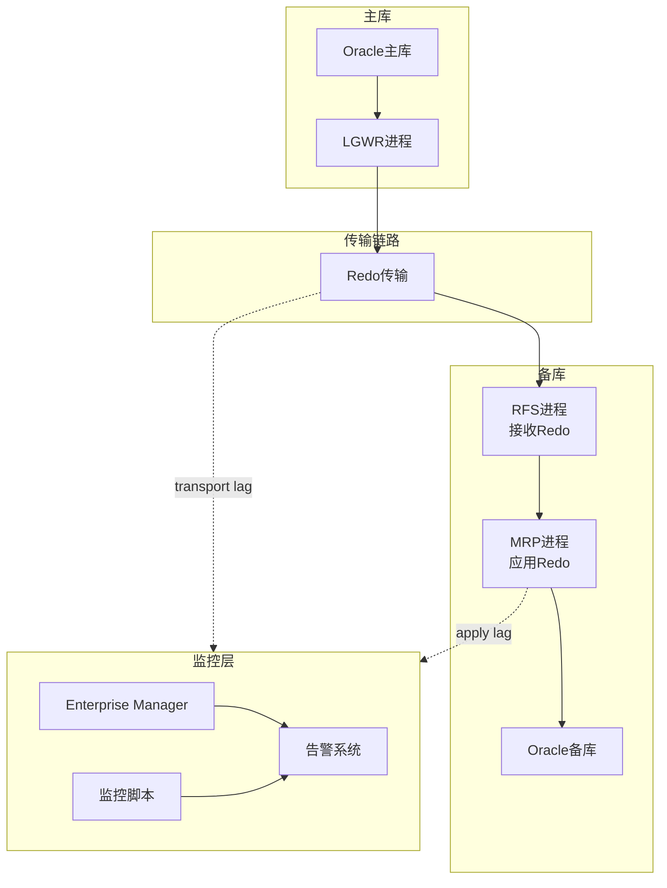
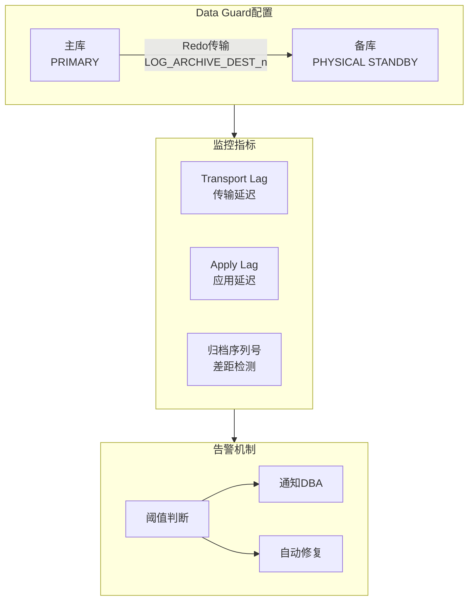
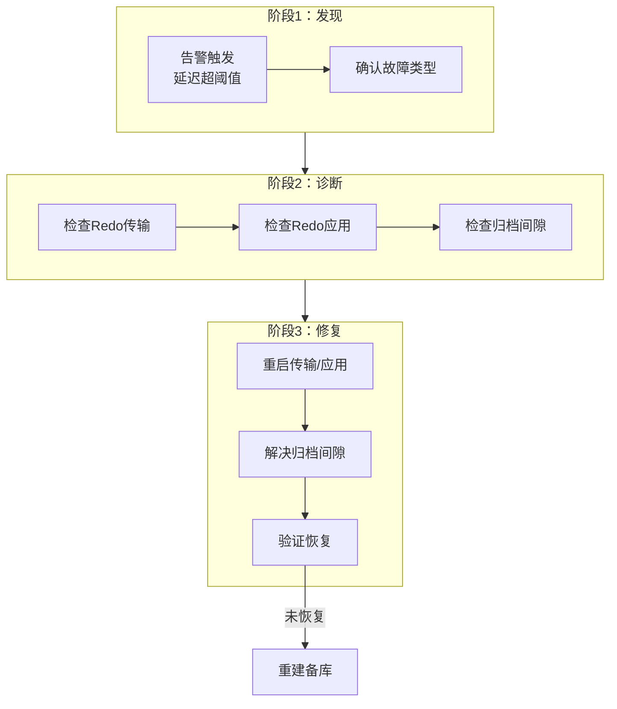
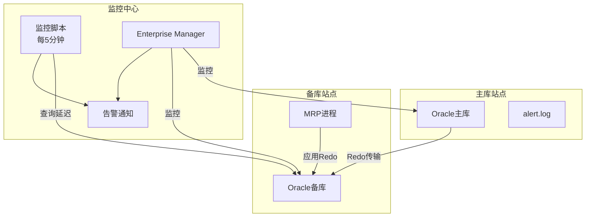

# Oracle复制监控与故障处理

## 一、概述

### 1.1 一句话定义

Oracle复制监控是持续跟踪Data Guard和GoldenGate复制链路的状态、延迟和性能的过程，故障处理是快速定位并恢复复制中断的操作。
它在高可用运维中出现和使用，解决复制中断、数据延迟和数据不一致的问题，确保容灾架构始终处于可用状态。

### 1.2 为什么重要

- **不掌握的后果：** 复制中断未被及时发现，主库持续产生Redo但备库未同步，一旦主库故障将丢失大量数据，容灾形同虚设
- **掌握的价值：** 建立完善的监控体系，在复制异常时第一时间发现并处理，保证RPO接近零

### 1.3 适用场景

| 场景 | 说明 |
|------|------|
| 日常运维 | 定期检查Data Guard和GoldenGate复制状态 |
| 延迟告警 | transport lag或apply lag超过阈值时告警 |
| 故障处理 | Redo传输中断、应用停止等故障的快速恢复 |
| 归档日志间隙 | 处理归档日志缺失导致的复制断裂 |
| 性能调优 | 优化复制链路延迟，提升同步效率 |

### 1.4 版本演进

| 版本 | 变化说明 |
|------|---------|
| 11gR2 | Data Guard Broker增强，DGMGRL命令行工具 |
| 12cR1 | Active Data Guard远端路径本地传输 |
| 12cR2 | 自动备库创建，简化故障恢复 |
| 19c | 自动Data Guard监控告警增强 |
| 21c | 云环境下的复制监控集成 |

## 二、术语与概念

### 2.1 核心术语表

| 术语 | 含义 | 类比 |
|------|------|------|
| Transport Lag | Redo从主库传输到备库的延迟 | 快递从发货到到达的时间 |
| Apply Lag | 备库应用Redo的延迟 | 快递到达后拆包的时间 |
| Archive Gap | 备库缺失的归档日志 | 快递丢件 |
| FAL | Fetch Archive Log，归档日志获取服务 | 自动补发丢失的快递 |
| Redo Apply | 备库将Redo应用到数据文件 | 按快递清单补货 |
| SQL Apply | 逻辑备库将Redo转换为SQL执行 | 翻译后执行 |
| Observer | FSFO观察者进程 | 独立裁判 |
| Trail文件 | GoldenGate的中间传输文件 | 快递中转站 |

### 2.2 监控架构



## 三、架构与原理

### 3.1 Data Guard监控架构图



### 3.2 工作原理

1. **Redo生成：** 主库LGWR将事务变更写入在线Redo日志
2. **Redo传输：** Redo通过网络传输到备库的Standby Redo Log
3. **Redo接收：** 备库RFS进程接收并写入Standby Redo Log
4. **Redo应用：** MRP进程将Standby Redo Log应用到备库数据文件
5. **监控采集：** 定期从V$DATAGUARD_STATS等视图采集延迟指标
6. **告警触发：** 延迟超过阈值时触发告警通知DBA

**一句话总结：** 复制监控的核心是持续跟踪"传输延迟"和"应用延迟"两个指标，任何异常都需要立即处理。

### 3.3 故障处理流程



## 四、功能详解

### 4.1 Data Guard监控命令

#### 功能说明

通过SQL查询和DGMGRL命令监控Data Guard复制状态。

#### 操作步骤

**步骤1：检查复制延迟**

```sql
-- 查看传输和应用延迟
SELECT name, value, datum_time, time_computed
FROM v$dataguard_stats
WHERE name IN ('transport lag', 'apply lag', 'apply finish time', 'estimated startup time')
ORDER BY name;

-- 快速判断是否健康
SELECT CASE
    WHEN value LIKE '+00 00:%' THEN 'NORMAL'
    ELSE 'WARNING'
END AS status, name, value
FROM v$dataguard_stats
WHERE name IN ('transport lag', 'apply lag');
```

**步骤2：检查归档日志应用状态**

```sql
-- 查看未应用的归档日志
SELECT thread#, sequence#, first_time, next_time, applied
FROM v$archived_log
WHERE applied = 'NO'
AND first_time > SYSDATE - 1
ORDER BY thread#, sequence#;

-- 检查归档间隙
SELECT thread#, low_sequence#, high_sequence#
FROM v$archive_gap;
```

**步骤3：检查Redo传输状态**

```sql
-- 查看传输目标状态
SELECT dest_id, status, error, destination
FROM v$archive_dest
WHERE status != 'INACTIVE'
AND destination IS NOT NULL;

-- 查看传输详情
SELECT dest_id, affirm, async_affirm,
       reopen_secs, max_failure, failure_count
FROM v$archive_dest
WHERE target = 'STANDBY';
```

**步骤4：使用DGMGRL监控**

```bash
# 连接Broker
dgmgrl sys/password@primary

# 查看整体配置
DGMGRL> SHOW CONFIGURATION;

# 查看主库详情
DGMGRL> SHOW DATABASE VERBOSE primary_db;

# 查看备库详情
DGMGRL> SHOW DATABASE VERBOSE standby_db;

# 查看实例状态
DGMGRL> SHOW DATABASE standby_db StatusReport;
```

### 4.2 GoldenGate监控命令

#### 操作步骤

```bash
# 查看所有进程状态
GGSCI> INFO ALL

# 查看Extract详情
GGSCI> INFO EXTRACT ext1, DETAIL
GGSCI> LAG EXTRACT ext1

# 查看Replicat详情
GGSCI> INFO REPLICAT rep1, DETAIL
GGSCI> LAG REPLICAT rep1

# 查看统计信息
GGSCI> STATS EXTRACT ext1
GGSCI> STATS REPLICAT rep1

# 查看延迟详情
GGSCI> SEND EXTRACT ext1, GETLAG
GGSCI> SEND REPLICAT rep1, GETLAG
```

### 4.3 监控脚本示例

```bash
#!/bin/bash
# Data Guard监控脚本
# 检查transport lag和apply lag

LAG_INFO=$(sqlplus -s sys/password@standby <<EOF
SET HEADING OFF FEEDBACK OFF
SELECT name || '|' || value FROM v\$dataguard_stats
WHERE name IN ('transport lag', 'apply lag');
EXIT;
EOF
)

echo "$LAG_INFO" | while IFS='|' read name value; do
    echo "$(date '+%Y-%m-%d %H:%M:%S') $name = $value"
    # 如果延迟超过30秒，发送告警
    if echo "$value" | grep -qE '\+00 00:[0-3][0-9]:'; then
        echo "WARNING: $name exceeds threshold!"
        # 发送告警通知
    fi
done
```

## 五、性能与调优

### 5.1 延迟优化建议

| 场景 | 建议 | 原因 |
|------|------|------|
| Transport Lag高 | 检查网络带宽和延迟 | 网络是传输瓶颈 |
| Apply Lag高 | 增大备库I/O能力 | 应用Redo是I/O密集操作 |
| 归档间隙频繁 | 使用SYNC传输或增大SDU | 减少日志丢失概率 |
| GoldenGate延迟 | 使用Integrated Replicat | 减少逻辑解码开销 |

### 5.2 性能基线

| 指标 | 正常范围 | 告警阈值 | 说明 |
|------|---------|---------|------|
| Transport Lag | < 1秒 | > 10秒 | Redo传输延迟 |
| Apply Lag | < 5秒 | > 30秒 | Redo应用延迟 |
| 归档间隙 | 0 | > 0 | 缺失的归档日志数 |
| GoldenGate LAG | < 5秒 | > 30秒 | 端到端复制延迟 |

## 六、DFX能力

### 6.1 动态性能视图

| 视图名 | 用途 | 关键字段 |
|--------|------|---------|
| V$DATAGUARD_STATS | DG延迟统计 | NAME, VALUE, DATUM_TIME |
| V$DATAGUARD_STATUS | DG事件日志 | SEVERITY, MESSAGE |
| V$ARCHIVE_GAP | 归档间隙 | THREAD#, LOW_SEQUENCE#, HIGH_SEQUENCE# |
| V$ARCHIVED_LOG | 归档日志状态 | SEQUENCE#, APPLIED, FIRST_TIME |
| V$ARCHIVE_DEST | 传输目标状态 | DEST_ID, STATUS, ERROR |
| V$RECOVERY_PROGRESS | 恢复进度 | ITEM, SOFAR, TOTAL |
| V$MANAGED_STANDBY | 备库进程状态 | PROCESS, STATUS, SEQUENCE# |

### 6.2 日志与告警

- **日志位置：** `$ORACLE_BASE/diag/rdbms/*/trace/alert_*.log`
- **关键日志：** FAL相关日志、Redo传输错误、MRP进程状态变化
- **告警配置：** 建议通过Enterprise Manager或自定义脚本监控延迟

```sql
-- 查看Data Guard相关事件
SELECT severity, error_code, message, timestamp
FROM v$dataguard_status
WHERE timestamp > SYSDATE - 1
ORDER BY timestamp DESC;
```

## 七、实战案例

### 7.1 案例背景

- **场景**：某银行Oracle 19c Data Guard环境，主库+物理备库
- **时间**：凌晨3:00
- **现象**：监控告警显示apply lag达到2小时，且持续增长

### 7.2 诊断过程

**步骤1：确认延迟情况**

```sql
SELECT name, value, datum_time FROM v$dataguard_stats
WHERE name IN ('transport lag', 'apply lag');
```
- → 发现：transport lag = +00 00:00:02（正常），apply lag = +00 02:15:30（异常）
- → 判断：Redo传输正常，但备库应用跟不上

**步骤2：检查备库MRP进程**

```sql
SELECT process, status, sequence#, block# FROM v$managed_standby
WHERE process = 'MRP0';
```
- → 发现：MRP进程状态为WAIT_FOR_GAP
- → 判断：存在归档日志间隙

**步骤3：检查归档间隙**

```sql
SELECT thread#, low_sequence#, high_sequence# FROM v$archive_gap;
```
- → 发现：thread 1, sequence 5000-5020 缺失
- → 判断：20个归档日志缺失，需要FAL获取

**步骤4：触发FAL获取**

```sql
-- 检查FAL配置
SHOW PARAMETER fal_server;
SHOW PARAMETER fal_client;

-- 手动触发归档日志获取
ALTER DATABASE REGISTER LOGFILE '/path/to/arch_1_5000.arc';

-- 或重启MRP让FAL自动获取
ALTER DATABASE RECOVER MANAGED STANDBY DATABASE CANCEL;
ALTER DATABASE RECOVER MANAGED STANDBY DATABASE DISCONNECT;
```

**步骤5：验证恢复**

```sql
-- 等待FAL完成后检查
SELECT name, value FROM v$dataguard_stats WHERE name = 'apply lag';
-- apply lag = +00 00:00:05（恢复正常）
```

### 7.3 解决结果

| 指标 | 解决前 | 解决后 |
|------|--------|--------|
| Apply Lag | 2小时15分 | 5秒 |
| Transport Lag | 2秒 | 2秒 |
| 归档间隙 | 20个日志 | 0 |
| MRP状态 | WAIT_FOR_GAP | APPLYING_LOG |

### 7.4 复盘总结

- **根因：** 网络闪断导致20个归档日志传输失败，FAL自动重试未能完全恢复
- **教训：** 配置FAL后仍需监控归档间隙，设置间隙告警阈值=1

## 八、常见错误与排查

### 8.1 常见错误列表

| 错误代码 | 错误信息 | 原因 | 解决方法 |
|---------|---------|------|---------|
| ORA-16792 | Data Guard配置被禁用 | Broker配置问题 | ENABLE CONFIGURATION |
| ORA-16086 | Standby redo log不可用 | 备库SRL空间不足 | 增大Standby Redo Log |
| ORA-00279 | change number needed for thread | 归档日志缺失 | FAL获取或手动注册 |
| ORA-16810 | 多个错误或告警 | Data Guard状态异常 | SHOW CONFIGURATION查看详情 |
| OGG-01154 | Replicat冲突中止 | GoldenGate冲突处理 | 检查CDR配置 |

### 8.2 排查步骤

1. **检查延迟：** `SELECT * FROM v$dataguard_stats`
2. **检查传输：** `SELECT dest_id, status, error FROM v$archive_dest`
3. **检查应用：** `SELECT process, status FROM v$managed_standby`
4. **检查间隙：** `SELECT * FROM v$archive_gap`
5. **查看alert.log：** 搜索ORA-错误和FAL相关日志

### 8.3 解决方案

**方案一：重启Redo应用**

```sql
ALTER DATABASE RECOVER MANAGED STANDBY DATABASE CANCEL;
ALTER DATABASE RECOVER MANAGED STANDBY DATABASE DISCONNECT;
```

**方案二：手动解决归档间隙**

```sql
-- 从主库复制缺失的归档日志到备库
-- 然后注册
ALTER DATABASE REGISTER LOGFILE '/path/to/missing_archive.arc';
-- 重启MRP
ALTER DATABASE RECOVER MANAGED STANDBY DATABASE DISCONNECT;
```

## 九、最佳实践

### 9.1 官方推荐

- 配置Enterprise Manager自动监控Data Guard状态
- 设置transport lag和apply lag告警阈值为30秒
- 定期检查归档间隙，确保FAL配置正确
- 每月执行一次切换演练验证容灾能力

### 9.2 社区经验

- 编写自动化监控脚本，每5分钟检查一次延迟
- 告警分级：延迟<30秒为信息级，<5分钟为告警级，>5分钟为紧急级
- 保留至少7天的归档日志，防止间隙过大无法恢复
- GoldenGate监控要关注discard文件增长

### 9.3 反模式

| 反模式 | 问题 | 正确做法 |
|--------|------|---------|
| 不监控复制延迟 | 故障时才发现容灾失效 | 设置自动监控和告警 |
| 忽略归档间隙 | 间隙扩大后恢复困难 | 间隙>1立即告警 |
| 不测试切换 | 真正故障时流程不熟 | 定期演练 |
| 手动处理一切 | 响应慢，易出错 | 编写自动化脚本 |
| 不保留监控历史 | 无法分析趋势 | 持久化监控数据 |

## 十、命令与视图汇总

### 10.1 命令列表

| 命令 | 适用场景 | 说明 |
|------|---------|------|
| `ALTER DATABASE RECOVER MANAGED STANDBY DATABASE DISCONNECT` | 启动Redo应用 | 启动MRP进程 |
| `ALTER DATABASE RECOVER MANAGED STANDBY DATABASE CANCEL` | 停止Redo应用 | 停止MRP进程 |
| `ALTER DATABASE REGISTER LOGFILE` | 手动注册归档日志 | 解决归档间隙 |
| `DGMGRL> SHOW CONFIGURATION` | 查看DG配置 | Broker命令 |
| `GGSCI> LAG REPLICAT` | 查看复制延迟 | GoldenGate命令 |
| `GGSCI> STATS REPLICAT` | 查看复制统计 | GoldenGate命令 |

### 10.2 视图列表

| 视图名 | 类型 | 用途 | 关键字段 |
|--------|------|------|---------|
| V$DATAGUARD_STATS | 动态 | DG延迟统计 | NAME, VALUE |
| V$DATAGUARD_STATUS | 动态 | DG事件日志 | SEVERITY, MESSAGE |
| V$ARCHIVE_GAP | 动态 | 归档间隙 | THREAD#, LOW_SEQUENCE# |
| V$ARCHIVED_LOG | 动态 | 归档日志状态 | SEQUENCE#, APPLIED |
| V$ARCHIVE_DEST | 动态 | 传输目标状态 | DEST_ID, STATUS, ERROR |
| V$MANAGED_STANDBY | 动态 | 备库进程状态 | PROCESS, STATUS |
| V$RECOVERY_PROGRESS | 动态 | 恢复进度 | ITEM, SOFAR, TOTAL |

## 十一、总结速查

### 11.1 黄金法则

1. **持续监控** - transport lag和apply lag必须实时监控
2. **快速响应** - 延迟超阈值立即告警和处理
3. **归档保护** - 确保归档日志不丢失，FAL配置正确
4. **定期演练** - 每月检查复制状态，每季度切换演练
5. **自动化** - 编写监控脚本，减少人工检查遗漏

### 11.2 一页纸检查清单

| 现象/场景 | 原因 | 处理方案 |
|-----------|------|----------|
| Transport Lag增大 | 网络问题或主库I/O瓶颈 | 检查网络带宽和主库Redo写入 |
| Apply Lag增大 | 备库I/O瓶颈或MRP停止 | 检查备库资源，重启MRP |
| 归档间隙 | 网络闪断或日志被删 | FAL获取或手动注册日志 |
| MRP状态WAIT_FOR_GAP | 归档日志缺失 | 解决归档间隙后重启MRP |
| GoldenGate Replicat ABENDED | 冲突或数据错误 | 检查discard文件和冲突日志 |

### 11.3 关键数字

| 指标 | 正常范围 | 告警阈值 | 说明 |
|------|---------|---------|------|
| Transport Lag | < 1秒 | > 10秒 | Redo传输延迟 |
| Apply Lag | < 5秒 | > 30秒 | Redo应用延迟 |
| 归档间隙 | 0 | > 0 | 缺失归档日志数 |
| GG LAG | < 5秒 | > 30秒 | GoldenGate延迟 |

## 附录

### A. 拓扑示例



### B. 官方参考

- [Oracle Data Guard Concepts and Administration](https://docs.oracle.com/en/database/oracle/oracle-database/19c/sbydb/)
- [Oracle GoldenGate Monitor Guide](https://docs.oracle.com/en/middleware/goldengate/core/index.html)
- MOS Note: 1581647.1 - "Data Guard Troubleshooting Guide"

### C. 修订记录

| 日期 | 版本 | 修改内容 | 修改人 |
|------|------|---------|--------|
| 2026-07-02 | v1.0 | 初始版本 | YashanDB知识库生成器 |
| 2026-07-02 | v1.1 | 补充完整模板章节 | YashanDB知识库生成器 |
