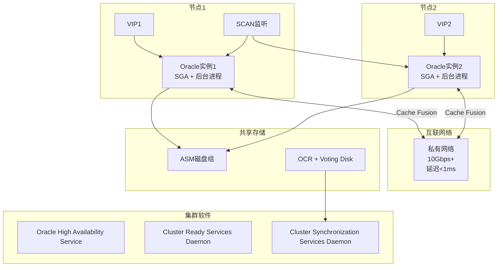
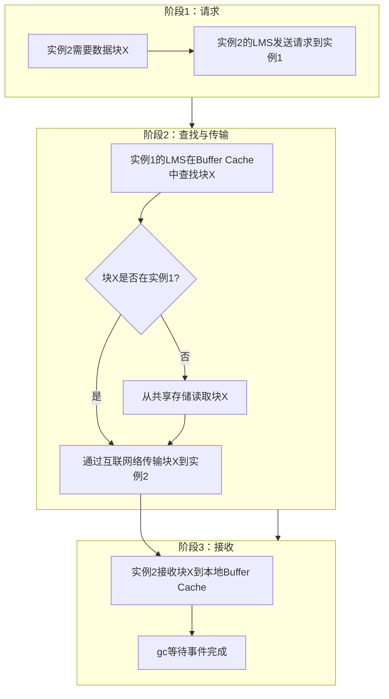
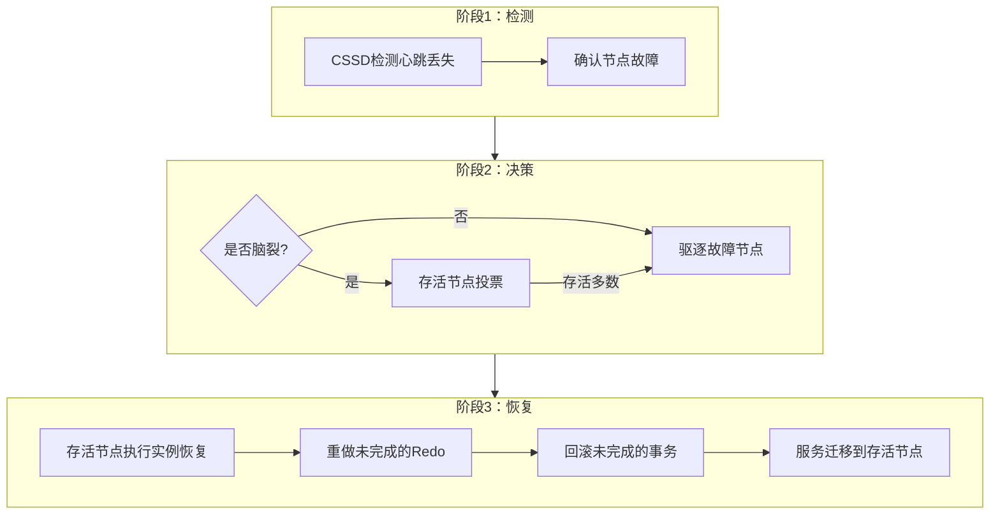
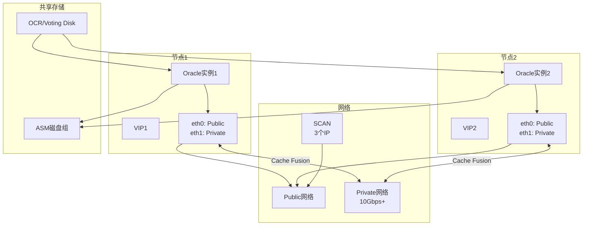

# Oracle RAC架构原理

## 一、概述

### 1.1 一句话定义

Oracle RAC（Real Application Clusters）是多实例共享存储的集群架构，多个Oracle实例同时访问同一共享数据库，通过Cache Fusion技术在互联网络上直接传输数据块，实现高可用和负载扩展。
它在高可用和性能扩展场景中出现和使用，解决单实例故障停机和高性能需求的问题。

### 1.2 为什么重要

- **不掌握的后果：** 单实例故障导致业务完全中断，无法实现高可用；无法通过增加节点扩展处理能力
- **掌握的价值：** 实现节点级故障自动切换（RTO秒级），通过增加节点线性扩展处理能力

### 1.3 适用场景

| 场景 | 说明 |
|------|------|
| 高可用 | 节点故障时服务自动迁移到存活节点 |
| 负载均衡 | 多个节点分担业务负载 |
| 滚动升级 | 逐节点升级，业务不中断 |
| 读扩展 | 通过服务配置将读请求分散到多节点 |
| 维护窗口 | 一个节点维护时业务切换到其他节点 |

### 1.4 版本演进

| 版本 | 变化说明 |
|------|---------|
| 11gR2 | Clusterware 11gR2，SCAN监听引入 |
| 12cR1 | Flex Cluster（Hub+Leaf），RAC One Node增强 |
| 12cR2 | Flex ASM，ASM实例可跨节点共享 |
| 19c | 自动RAC诊断增强，AWR跨实例报告 |
| 21c | 云原生RAC，25Gbps/100Gbps互联网络 |

## 二、术语与概念

### 2.1 核心术语表

| 术语 | 含义 | 类比 |
|------|------|------|
| 实例 | 一个Oracle数据库的内存+后台进程 | 一台收银机 |
| 节点 | 运行实例的物理服务器 | 一个收银台 |
| Cache Fusion | 通过互联网络直接传输数据块 | 收银机之间直接传钱 |
| 互联网络 | 节点间私有高速网络 | 收银台间的专用通道 |
| SCAN | Single Client Access Name，统一客户端入口 | 统一的客服电话 |
| VIP | 虚拟IP，绑定在节点上可迁移 | 可移动的电话号码 |
| OCR | Oracle Cluster Registry，集群配置存储 | 集群的通讯录 |
| Voting Disk | 投票磁盘，用于脑裂决策 | 投票器 |
| LMS | Global Cache Service进程 | 数据块传递管理员 |
| LMD | Global Enqueue Service进程 | 全局锁管理员 |

### 2.2 RAC架构组件



## 三、架构与原理

### 3.1 Cache Fusion工作原理



### 3.2 工作原理

1. **多实例并行：** 多个Oracle实例同时打开同一个数据库
2. **独立Buffer Cache：** 每个实例有独立的Buffer Cache
3. **Cache Fusion：** 当实例需要其他实例缓存的数据块时，通过互联网络直接传输
4. **全局锁协调：** LMD进程协调全局锁，保证数据一致性
5. **共享存储：** 所有实例通过ASM访问同一组数据文件
6. **集群管理：** Clusterware管理节点成员资格和资源调度

**一句话总结：** RAC的核心是"多实例+共享存储+Cache Fusion"——多个实例共享数据但各自缓存，通过高速网络直接传递数据块，避免磁盘I/O。

### 3.3 节点故障切换流程



## 四、功能详解

### 4.1 Cache Fusion详解

#### 功能说明

Cache Fusion是RAC的核心技术，通过互联网络在实例间直接传输数据块。

#### gc等待事件

```sql
-- 查看gc等待事件
SELECT inst_id, event, total_waits,
       time_waited/100 AS sec,
       average_wait*10 AS avg_ms
FROM gv$system_event
WHERE event LIKE 'gc%'
ORDER BY time_waited DESC;

-- 常见gc等待事件解读
-- gc buffer busy acquire/release: 全局缓冲区忙
-- gc cr grant 2-way: 一致性读授权（快）
-- gc cr grant 3-way: 一致性读授权（慢，需LMS中转）
-- gc cr block 2-way: 一致性读块传输（快）
-- gc cr block 3-way: 一致性读块传输（慢）
-- gc current block 2-way: 当前块传输（快）
-- gc current block 3-way: 当前块传输（慢）
```

### 4.2 集群管理组件

#### 操作步骤

```bash
# 查看集群状态
crsctl stat res -t

# 查看集群节点
olsnodes -n

# 检查集群健康
crsctl check cluster -all

# 查看集群资源
crsctl stat res -t

# 查看Voting Disk
crsctl query css votedisk

# 查看OCR
ocrcheck
```

```sql
-- 查看集群实例信息
SELECT inst_id, instance_name, host_name, status
FROM gv$instance;

-- 查看集群数据库信息
SELECT inst_id, database_status, logins
FROM gv$instance;
```

### 4.3 SCAN与VIP

```bash
# SCAN配置
# srvctl config scan
# SCAN Name: scan-orcl
# SCAN VIPs: 192.168.1.100, 192.168.1.101, 192.168.1.102

# VIP配置
# srvctl config vip -node node1
# VIP Name: node1-vip
# VIP Address: 192.168.1.50

# 服务配置
# srvctl add service -db orcl -service oltp_svc \
#   -preferred orcl1,orcl2 -clbgoal SHORT -rlbgoal NONE

# srvctl start service -db orcl -service oltp_svc
```

```text
# tnsnames.ora配置（使用SCAN）
ORCL =
  (DESCRIPTION =
    (ADDRESS = (PROTOCOL = TCP)(HOST = scan-orcl)(PORT = 1521))
    (CONNECT_DATA =
      (SERVICE_NAME = orcl)
    )
  )
```

### 4.4 服务与负载均衡

```sql
-- 查看服务配置
SELECT name, clb_goal, rlb_goal, failover_method, failover_type
FROM dba_services;

-- 查看运行时负载均衡统计
SELECT inst_id, service_name,
       SUM(CASE WHEN wait_class = 'User I/O' THEN wait_time ELSE 0 END) AS io_wait,
       COUNT(*) AS sessions
FROM gv$session
GROUP BY inst_id, service_name;

-- 创建负载均衡服务
-- srvctl add service -db orcl -service lb_svc \
--   -preferred orcl1,orcl2 \
--   -clbgoal SHORT \
--   -rlbgoal NONE
```

## 五、性能与调优

### 5.1 性能基线

| 指标 | 正常范围 | 告警阈值 | 说明 |
|------|---------|---------|------|
| gc cr block time | < 1ms | > 5ms | Cache Fusion效率 |
| gc current block time | < 1ms | > 5ms | 当前块传输时间 |
| 互联网络延迟 | < 0.5ms | > 1ms | 私有网络RTT |
| gc等待/DB time | < 10% | > 20% | RAC性能税 |

### 5.2 调优建议

| 场景 | 建议 | 原因 |
|------|------|------|
| gc等待高 | 检查互联网络带宽和延迟 | Cache Fusion瓶颈 |
| 热点块 | 优化SQL，使用分区 | 减少多实例争用 |
| 负载不均 | 配置CLB/RLB服务 | 智能负载均衡 |
| 3-way比例高 | 减少全局锁竞争 | 优化事务设计 |

## 六、DFX能力

### 6.1 动态性能视图

| 视图名 | 用途 | 关键字段 |
|--------|------|---------|
| GV$INSTANCE | 实例信息 | INST_ID, INSTANCE_NAME, STATUS |
| GV$CLUSTER_INTERCONNECTS | 互联网络 | IP_ADDRESS, INTERFACE_NAME |
| GV$SYSTEM_EVENT | 等待事件（全局） | EVENT, TIME_WAITED |
| GV$SYSSTAT | 系统统计（全局） | NAME, VALUE |
| GV$ACTIVE_SESSION_HISTORY | 活跃会话历史 | EVENT, INST_ID |

### 6.2 日志与告警

- **日志位置：** `$GRID_HOME/log/<hostname>/`
- **关键日志：** CSSD日志（ocssd.log）、CRSD日志、alert.log
- **告警配置：** 监控节点状态、gc等待事件、互联网络延迟

```bash
# 查看集群告警
tail -f $GRID_HOME/log/$(hostname)/alert_$(hostname).log
```

## 七、实战案例

### 7.1 案例背景

- **场景**：某银行Oracle 19c RAC（2节点），计划维护窗口滚动升级
- **时间**：周末维护窗口
- **现象**：需要在不中断业务的情况下完成RAC滚动升级

### 7.2 诊断过程

**步骤1：检查集群状态**

```bash
$ crsctl stat res -t
# 所有资源ONLINE，两个实例正常运行
```
- → 发现：集群状态正常
- → 判断：可以开始滚动升级

**步骤2：迁移服务到节点2**

```bash
# 停止节点1上的服务
$ srvctl stop service -db orcl -service oltp_svc -instance orcl1
# 服务自动迁移到节点2

# 验证连接
$ sqlplus user/pass@scan-orcl:1521/orcl
# 连接到节点2
```
- → 发现：服务成功迁移到节点2
- → 判断：节点1可以安全停机

**步骤3：升级节点1**

```bash
# 停止节点1
$ srvctl stop instance -db orcl -instance orcl1
# 执行升级操作...
# 启动节点1
$ srvctl start instance -db orcl -instance orcl1
```

**步骤4：切换并升级节点2**

```bash
# 迁移服务到节点1
$ srvctl start service -db orcl -service oltp_svc -instance orcl1
$ srvctl stop service -db orcl -service oltp_svc -instance orcl2
# 重复升级步骤...
```

### 7.3 解决结果

| 指标 | 目标 | 实际 |
|------|------|------|
| 业务中断时间 | 0 | 0 |
| 升级总时间 | < 4小时 | 3小时 |
| 服务迁移时间 | < 30秒 | 10秒 |

### 7.4 复盘总结

- **根因：** RAC架构天然支持滚动升级
- **教训：** 升级前充分测试服务迁移流程，确保所有服务都能正确切换

## 八、常见错误与排查

### 8.1 常见错误列表

| 错误代码 | 错误信息 | 原因 | 解决方法 |
|---------|---------|------|---------|
| ORA-29701 | unable to connect to Cluster Manager | CSSD通信失败 | 检查Clusterware状态 |
| ORA-29740 | node eviction | 节点被驱逐 | 检查CSSD日志 |
| CRS-4535 | Cannot communicate with Clusterware | CRS未启动 | crsctl start crs |
| ORA-29702 | Clusterware service error | 集群服务错误 | 检查集群资源状态 |
| CLSU-00105 | 互联网络配置错误 | 私有网络问题 | oifcfg检查配置 |

### 8.2 排查步骤

1. **检查集群状态：** `crsctl stat res -t`
2. **检查节点状态：** `olsnodes -s`
3. **查看CSSD日志：** `$GRID_HOME/log/$(hostname)/cssd/ocssd.log`
4. **检查互联网络：** `oifcfg getif` + ping测试
5. **查看alert.log：** 搜索集群相关错误

### 8.3 解决方案

**方案一：重启集群**

```bash
# 停止集群
crsctl stop crs
# 启动集群
crsctl start crs
# 检查状态
crsctl stat res -t
```

**方案二：处理脑裂**

```bash
# 脑裂时存活节点通过投票决定
# 检查Voting Disk
crsctl query css votedisk
# 如果Voting Disk不可用，需要修复共享存储
```

## 九、最佳实践

### 9.1 官方推荐

- 互联网络使用独立的10Gbps+网络
- 配置至少2个VIP和3个SCAN IP
- 使用SCAN连接而非直连节点VIP
- 配置CLB/RLB实现智能负载均衡

### 9.2 社区经验

- RAC一般2-4节点最佳，过多增加Cache Fusion开销
- 定期执行节点驱逐演练
- 监控gc等待事件建立性能基线
- 滚动升级前测试服务迁移流程

### 9.3 反模式

| 反模式 | 问题 | 正确做法 |
|--------|------|---------|
| 互联网络共享Public | 带宽争用 | 独立私有网络 |
| 节点数过多 | Cache Fusion开销大 | 2-4节点最佳 |
| 直连VIP而非SCAN | 无法透明故障切换 | 使用SCAN连接 |
| 不监控gc等待 | 性能劣化无感知 | 建立AWR基线 |
| 不测试故障切换 | 真正故障时手忙脚乱 | 定期演练 |

## 十、命令与视图汇总

### 10.1 命令列表

| 命令 | 适用场景 | 说明 |
|------|---------|------|
| `crsctl stat res -t` | 查看集群状态 | 所有资源状态 |
| `olsnodes -n` | 查看节点 | 集群节点列表 |
| `oifcfg getif` | 查看网络配置 | 互联网络接口 |
| `srvctl status service` | 查看服务状态 | RAC服务运行 |
| `crsctl check cluster -all` | 检查集群健康 | 所有节点状态 |

### 10.2 视图列表

| 视图名 | 类型 | 用途 | 关键字段 |
|--------|------|------|---------|
| GV$INSTANCE | 动态 | 实例信息 | INST_ID, STATUS |
| GV$CLUSTER_INTERCONNECTS | 动态 | 互联网络 | IP_ADDRESS |
| GV$SYSTEM_EVENT | 动态 | 等待事件 | EVENT, TIME_WAITED |
| GV$ACTIVE_SESSION_HISTORY | 动态 | 活跃会话 | EVENT, INST_ID |

## 十一、总结速查

### 11.1 黄金法则

1. **独立网络** - 互联网络10Gbps+，不与Public共享
2. **SCAN连接** - 客户端通过SCAN连接，实现透明故障切换
3. **监控gc等待** - 建立性能基线，gc等待<10% DB time
4. **定期演练** - 测试节点驱逐和服务迁移
5. **控制节点数** - 2-4节点最佳

### 11.2 一页纸检查清单

| 现象/场景 | 原因 | 处理方案 |
|-----------|------|----------|
| gc等待高 | 互联网络瓶颈 | 检查网络带宽和延迟 |
| 节点驱逐 | 心跳丢失 | 检查互联网络和CSSD日志 |
| 脑裂 | 网络分区 | 检查Voting Disk |
| 负载不均 | 未配置CLB | 配置负载均衡服务 |
| 服务无法切换 | VIP或SCAN配置问题 | 检查srvctl配置 |

### 11.3 关键数字

| 指标 | 正常范围 | 告警阈值 | 说明 |
|------|---------|---------|------|
| gc cr block time | < 1ms | > 5ms | Cache Fusion效率 |
| 互联网络延迟 | < 0.5ms | > 1ms | 私有网络RTT |
| gc等待/DB time | < 10% | > 20% | RAC性能税 |
| 节点数 | 2-4 | > 6 | 过多增加开销 |

## 附录

### A. 拓扑示例



### B. 官方参考

- [Oracle Real Application Clusters Administration and Deployment Guide](https://docs.oracle.com/en/database/oracle/oracle-database/19c/racad/)
- [Oracle Grid Infrastructure Administration and Deployment Guide](https://docs.oracle.com/en/database/oracle/oracle-database/19c/cwadm/)
- MOS Note: 1367077.1 - "RAC Performance Tuning"

### C. 修订记录

| 日期 | 版本 | 修改内容 | 修改人 |
|------|------|---------|--------|
| 2026-07-02 | v1.0 | 初始版本 | YashanDB知识库生成器 |
| 2026-07-02 | v1.1 | 补充完整模板章节 | YashanDB知识库生成器 |
