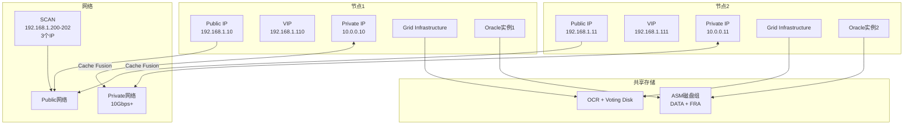
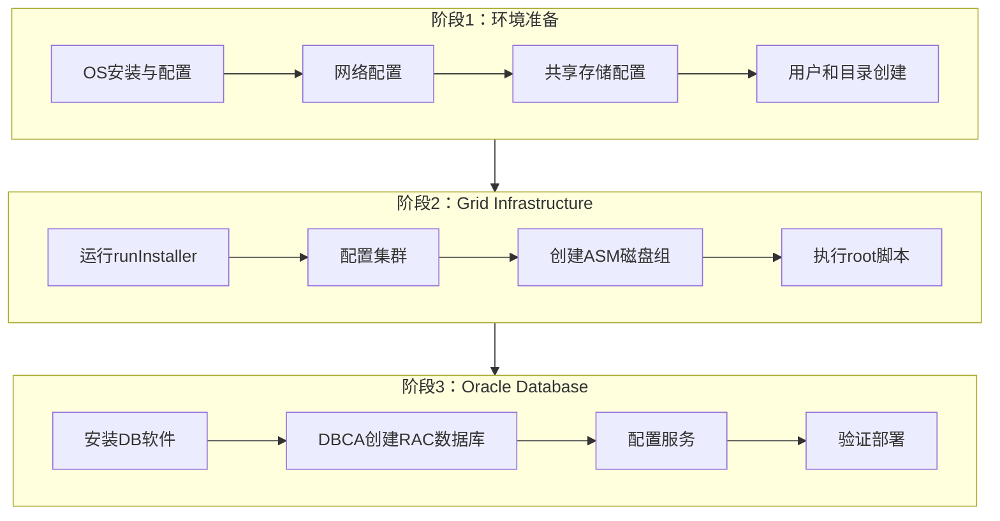
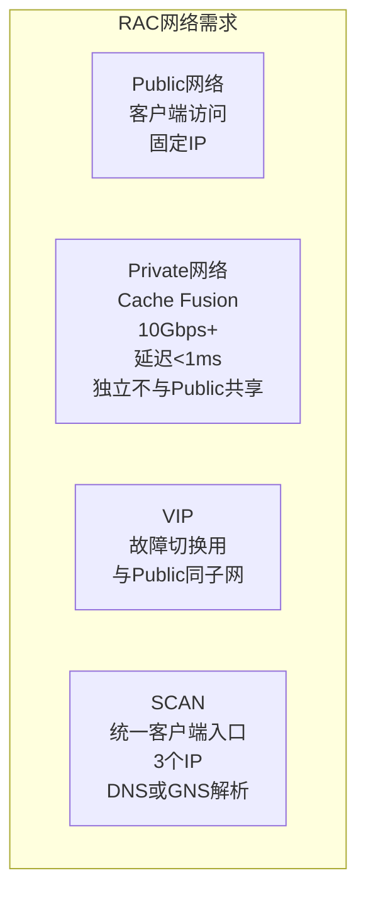

# Oracle RAC部署与配置

## 一、概述

### 1.1 一句话定义

Oracle RAC部署是安装Grid Infrastructure集群软件、配置共享存储（ASM）、设置集群网络并创建多实例数据库的完整过程。
它在集群环境搭建中出现和使用，解决高可用数据库环境的规划、安装和验证问题。

### 1.2 为什么重要

- **不掌握的后果：** 部署不当导致集群不稳定、性能差、故障切换失败，高可用形同虚设
- **掌握的价值：** 一次正确部署，获得节点级故障自动切换、负载均衡和滚动升级能力

### 1.3 适用场景

| 场景 | 说明 |
|------|------|
| 新建RAC环境 | 从零开始部署2节点或多节点RAC |
| 环境迁移 | 将单实例迁移为RAC架构 |
| 版本升级 | RAC环境的滚动升级 |
| 扩容 | 添加新节点到现有集群 |
| 故障排查 | 部署后集群异常的诊断 |

### 1.4 版本演进

| 版本 | 变化说明 |
|------|---------|
| 11gR2 | SCAN引入，简化客户端配置 |
| 12cR1 | Flex Cluster（Hub+Leaf节点） |
| 12cR2 | Flex ASM，DHCP/ONS支持 |
| 19c | 部署自动化增强，GI Home可共享 |
| 21c | 云原生部署，Kubernetes集成 |

## 二、术语与概念

### 2.1 核心术语表

| 术语 | 含义 | 类比 |
|------|------|------|
| Grid Infrastructure | 集群软件，包含Clusterware和ASM | 大楼的物业管理 |
| Clusterware | 集群管理组件（CRS/CSS/EVM） | 大楼的安保系统 |
| SCAN | Single Client Access Name，统一入口 | 大楼的总前台 |
| VIP | 虚拟IP，可迁移 | 可移动的工位号 |
| OCR | Oracle Cluster Registry，集群配置库 | 大楼的设备台账 |
| Voting Disk | 投票磁盘，脑裂决策 | 投票器 |
| ASM | 自动存储管理 | 大楼的仓库管理员 |
| OUI | Oracle Universal Installer | 安装向导 |

### 2.2 RAC部署架构



## 三、架构与原理

### 3.1 部署流程总览



### 3.2 部署关键步骤

1. **环境准备：** OS安装、网络配置、SSH等价性、时间同步
2. **共享存储：** 配置ASM磁盘，确保所有节点可见
3. **安装GI：** 运行OUI，配置Clusterware和ASM
4. **安装DB：** 安装Oracle Database软件到所有节点
5. **创建数据库：** 使用DBCA创建RAC数据库
6. **配置服务：** 创建负载均衡和高可用服务
7. **验证测试：** 检查集群状态和故障切换

**一句话总结：** RAC部署的核心是"环境准备→GI安装→DB安装→服务配置→验证测试"，每一步都必须正确才能保证集群稳定。

### 3.3 网络配置要求



## 四、功能详解

### 4.1 环境准备

#### 功能说明

部署前需要完成的操作系统和网络配置。

#### 操作步骤

```bash
# 步骤1：OS配置（每个节点）
# 配置/etc/hosts
cat >> /etc/hosts <<EOF
# Public
192.168.1.10  node1
192.168.1.11  node2
# Private
10.0.0.10     node1-priv
10.0.0.11     node2-priv
# VIP
192.168.1.110 node1-vip
192.168.1.111 node2-vip
EOF

# 步骤2：配置SSH等价性
ssh-keygen -t rsa
ssh-copy-id node1
ssh-copy-id node2

# 步骤3：配置时间同步
# 使用chrony或NTP
systemctl enable chronyd
systemctl start chronyd

# 步骤4：配置内核参数
cat >> /etc/sysctl.conf <<EOF
kernel.shmmax = 68719476736
kernel.shmall = 4294967296
net.ipv4.ip_local_port_range = 9000 65500
net.core.rmem_default = 262144
net.core.rmem_max = 4194304
net.core.wmem_default = 262144
net.core.wmem_max = 1048576
fs.file-max = 6815744
fs.aio-max-nr = 1048576
EOF
sysctl -p

# 步骤5：创建用户和组
groupadd -g 54321 oinstall
groupadd -g 54322 dba
groupadd -g 54323 oper
groupadd -g 54324 asmadmin
groupadd -g 54325 asmoper
groupadd -g 54326 asmdba

useradd -u 54321 -g oinstall -G dba,oper,asmdba oracle
useradd -u 54322 -g oinstall -G asmadmin,asmoper,asmdba grid
```

### 4.2 Grid Infrastructure安装

```bash
# 步骤1：解压安装包
cd /u01/app/19.0.0/grid
unzip /path/to/LINUX.X64_193000_grid_home.zip

# 步骤2：运行安装前检查
./gridSetup.sh -executePrereqs

# 步骤3：运行安装程序
./gridSetup.sh
# 图形界面选择：
# 1. Configure Oracle Grid Infrastructure for a New Cluster
# 2. Configure Oracle Grid Infrastructure for a Cluster
# 3. 添加节点信息
# 4. 配置网络（Public + Private）
# 5. 配置ASM磁盘组（OCR + DATA + FRA）
# 6. 配置SCAN（名称 + 3个IP）

# 步骤4：执行root脚本（按提示）
# 节点1：/u01/app/oraInventory/orainstRoot.sh
# 节点1：/u01/app/19.0.0/grid/root.sh
# 节点2：/u01/app/oraInventory/orainstRoot.sh
# 节点2：/u01/app/19.0.0/grid/root.sh
```

### 4.3 ASM磁盘组配置

```bash
# 使用ASMCMD管理
asmcmd lsdg          # 查看磁盘组
asmcmd lsdsk         # 查看磁盘
asmcmd lspwusr       # 查看密码文件用户

# 创建磁盘组
asmca  # ASM配置助手

# 或使用SQL
-- CREATE DISKGROUP DATA NORMAL REDUNDANCY
--   DISK '/dev/oracle/data_*'
--   ATTRIBUTE 'compatible.asm' = '19.0', 'compatible.rdbms' = '19.0';
```

### 4.4 创建RAC数据库

```bash
# 使用DBCA创建RAC数据库
dbca -silent -createDatabase \
  -templateName General_Purpose.dbc \
  -gdbName orcl \
  -sid orcl \
  -createAsContainerDatabase true \
  -numberOfPDBs 1 \
  -pdbName pdb1 \
  -nodelist node1,node2 \
  -storageType ASM \
  -datafileDestination '+DATA' \
  -recoveryAreaDestination '+FRA' \
  -characterSet AL32UTF8 \
  -totalMemory 4096 \
  -databaseConfigType RAC
```

### 4.5 服务配置

```bash
# 创建负载均衡服务
srvctl add service -db orcl -service oltp_svc \
  -preferred orcl1,orcl2 \
  -clbgoal SHORT -rlbgoal NONE

# 创建高可用服务
srvctl add service -db orcl -service ha_svc \
  -preferred orcl1 -available orcl2 \
  -failovertype SELECT -failovermethod BASIC

# 启动服务
srvctl start service -db orcl -service oltp_svc
srvctl start service -db orcl -service ha_svc

# 查看服务状态
srvctl status service -db orcl
```

## 五、性能与调优

### 5.1 部署后性能检查

| 检查项 | 命令 | 正常值 |
|--------|------|--------|
| 互联网络延迟 | `ping -s 8192 node-priv` | < 0.5ms |
| 互联网络带宽 | `iperf -c node-priv` | > 10Gbps |
| ASM均衡度 | `asmcmd lsdg` | 各磁盘使用率差异<10% |
| gc等待事件 | `SELECT * FROM gv$system_event WHERE event LIKE 'gc%'` | < 10% DB time |

### 5.2 调优建议

| 场景 | 建议 | 原因 |
|------|------|------|
| gc等待高 | 检查互联网络 | Cache Fusion瓶颈 |
| 负载不均 | 配置CLB/RLB服务 | 智能负载均衡 |
| ASM不均衡 | REBALANCE | 手动触发均衡 |

## 六、DFX能力

### 6.1 集群管理命令

| 命令 | 用途 | 说明 |
|------|------|------|
| `crsctl stat res -t` | 查看资源状态 | 所有集群资源 |
| `crsctl check cluster -all` | 检查集群健康 | 所有节点 |
| `olsnodes -n` | 查看节点 | 集群节点列表 |
| `srvctl status service` | 查看服务状态 | RAC服务 |
| `asmcmd lsdg` | 查看磁盘组 | ASM存储 |

### 6.2 日志位置

- **Grid日志：** `$GRID_HOME/log/<hostname>/`
- **CSSD日志：** `$GRID_HOME/log/<hostname>/cssd/ocssd.log`
- **DB alert.log：** `$ORACLE_BASE/diag/rdbms/*/trace/alert_*.log`

## 七、实战案例

### 7.1 案例背景

- **场景**：某企业新建Oracle 19c RAC（2节点）环境
- **时间**：项目上线前
- **现象**：部署完成后需要验证所有功能正常

### 7.2 诊断过程

**步骤1：检查集群状态**

```bash
$ crsctl stat res -t
# 所有资源ONLINE
```
- → 发现：集群资源全部正常
- → 判断：GI部署成功

**步骤2：检查实例状态**

```sql
SELECT inst_id, instance_name, host_name, status
FROM gv$instance;
```
- → 发现：两个实例都OPEN
- → 判断：数据库创建成功

**步骤3：测试故障切换**

```bash
# 停止节点1的实例
$ srvctl stop instance -db orcl -instance orcl1

# 验证服务迁移
$ srvctl status service -db orcl
# ha_svc迁移到orcl2

# 重启节点1
$ srvctl start instance -db orcl -instance orcl1
```
- → 发现：服务自动迁移，节点恢复后自动回切
- → 判断：故障切换功能正常

**步骤4：验证负载均衡**

```bash
# 多次连接SCAN，观察是否分散到两个节点
for i in {1..10}; do
  sqlplus -s user/pass@scan-orcl:1521/orcl <<EOF
  SELECT instance_name FROM v\$instance;
  EXIT;
EOF
done
```
- → 发现：连接均匀分布在两个实例
- → 判断：负载均衡配置正确

### 7.3 解决结果

| 检查项 | 结果 |
|--------|------|
| 集群状态 | 全部ONLINE |
| 实例状态 | 两个实例OPEN |
| 故障切换 | 30秒内完成 |
| 负载均衡 | 连接均匀分布 |

### 7.4 复盘总结

- **根因：** 按标准流程部署，所有功能验证通过
- **教训：** 部署后必须执行完整的验证测试，特别是故障切换测试

## 八、常见错误与排查

### 8.1 常见错误列表

| 错误代码 | 错误信息 | 原因 | 解决方法 |
|---------|---------|------|---------|
| CRS-4535 | Cannot communicate with Clusterware | CRS未启动 | crsctl start crs |
| CRS-5017 | resource action encountered error | 资源启动失败 | 检查日志 |
| ORA-29701 | unable to connect to Cluster Manager | CSSD通信失败 | 检查互联网络 |
| PRVG-1101 | SCAN listener not running | SCAN监听未启动 | srvctl start scan_listener |

### 8.2 排查步骤

1. **检查集群状态：** `crsctl stat res -t`
2. **检查节点状态：** `olsnodes -s`
3. **查看GI日志：** `$GRID_HOME/log/$(hostname)/`
4. **检查网络：** ping测试Public和Private
5. **检查存储：** `asmcmd lsdg`

## 九、最佳实践

### 9.1 官方推荐

- 使用静默安装方式部署，便于自动化
- 互联网络使用独立10Gbps+网络
- SCAN配置3个IP，使用DNS解析
- 部署后执行完整的验证测试

### 9.2 社区经验

- 部署前运行CVU（Cluster Verification Utility）检查环境
- 使用response file实现自动化部署
- 部署文档化，记录所有配置参数
- 首次部署后执行节点驱逐演练

### 9.3 反模式

| 反模式 | 问题 | 正确做法 |
|--------|------|---------|
| 互联网络共享Public | Cache Fusion性能差 | 独立私有网络 |
| 不配置SSH等价性 | 安装失败 | 提前配置SSH免密 |
| 不运行CVU检查 | 环境不满足要求 | 部署前运行cluvfy |
| 不测试故障切换 | 真正故障时不工作 | 部署后必须测试 |
| 不文档化配置 | 维护困难 | 记录所有配置参数 |

## 十、命令与视图汇总

### 10.1 命令列表

| 命令 | 适用场景 | 说明 |
|------|---------|------|
| `crsctl stat res -t` | 查看资源 | 集群资源状态 |
| `srvctl add service` | 创建服务 | RAC服务配置 |
| `srvctl start/stop` | 启停资源 | 实例/服务管理 |
| `asmcmd lsdg` | ASM管理 | 磁盘组信息 |
| `cluvfy comp` | 环境检查 | 部署前验证 |
| `dbca -createDatabase` | 创建数据库 | RAC数据库 |

### 10.2 视图列表

| 视图名 | 类型 | 用途 | 关键字段 |
|--------|------|------|---------|
| GV$INSTANCE | 动态 | 实例信息 | INST_ID, STATUS |
| GV$ACTIVE_INSTANCES | 动态 | 活跃实例 | INST_ID, INSTANCE_NAME |
| V$CLUSTER_INTERCONNECTS | 动态 | 互联网络 | IP_ADDRESS |
| V$ASM_DISKGROUP | 动态 | ASM磁盘组 | NAME, TOTAL_MB |

## 十一、总结速查

### 11.1 黄金法则

1. **环境检查** - 部署前运行CVU验证环境
2. **网络隔离** - Public和Private必须独立
3. **SCAN配置** - 3个IP，DNS解析
4. **完整测试** - 部署后测试故障切换和负载均衡
5. **文档化** - 记录所有配置参数和步骤

### 11.2 一页纸检查清单

| 现象/场景 | 原因 | 处理方案 |
|-----------|------|----------|
| GI安装失败 | 环境不满足要求 | 运行cluvfy检查 |
| SCAN无法解析 | DNS配置问题 | 检查DNS或/etc/hosts |
| 互联网络不通 | 网络配置错误 | 检查路由和防火墙 |
| ASM磁盘不可见 | 权限问题 | 检查oracleasm配置 |
| 服务无法启动 | 依赖资源未就绪 | 检查crsctl stat res -t |

### 11.3 关键数字

| 指标 | 正常范围 | 告警阈值 | 说明 |
|------|---------|---------|------|
| 互联网络延迟 | < 0.5ms | > 1ms | Private网络RTT |
| 互联网络带宽 | > 10Gbps | < 1Gbps | Cache Fusion吞吐 |
| 故障切换时间 | < 30秒 | > 5分钟 | 服务迁移时间 |
| ASM均衡度 | < 10%差异 | > 20%差异 | 磁盘使用率差异 |

## 附录

### A. 部署检查清单

```
环境准备：
□ OS安装和配置
□ 网络配置（Public + Private + VIP + SCAN）
□ SSH等价性
□ 时间同步（NTP/chrony）
□ 内核参数
□ 用户和组
□ 目录创建

Grid Infrastructure：
□ CVU检查通过
□ GI安装成功
□ OCR和Voting Disk配置
□ ASM磁盘组创建
□ SCAN配置

Oracle Database：
□ DB软件安装
□ RAC数据库创建
□ 服务配置
□ 故障切换测试
□ 负载均衡测试
```

### B. 官方参考

- [Oracle Grid Infrastructure Installation Guide](https://docs.oracle.com/en/database/oracle/oracle-database/19c/install/)
- [Oracle Real Application Clusters Administration and Deployment Guide](https://docs.oracle.com/en/database/oracle/oracle-database/19c/racad/)
- MOS Note: 169706.1 - "Oracle Clusterware and RAC Installation Checklist"

### C. 修订记录

| 日期 | 版本 | 修改内容 | 修改人 |
|------|------|---------|--------|
| 2026-07-02 | v1.0 | 初始版本 | YashanDB知识库生成器 |
| 2026-07-02 | v1.1 | 补充完整模板章节 | YashanDB知识库生成器 |
