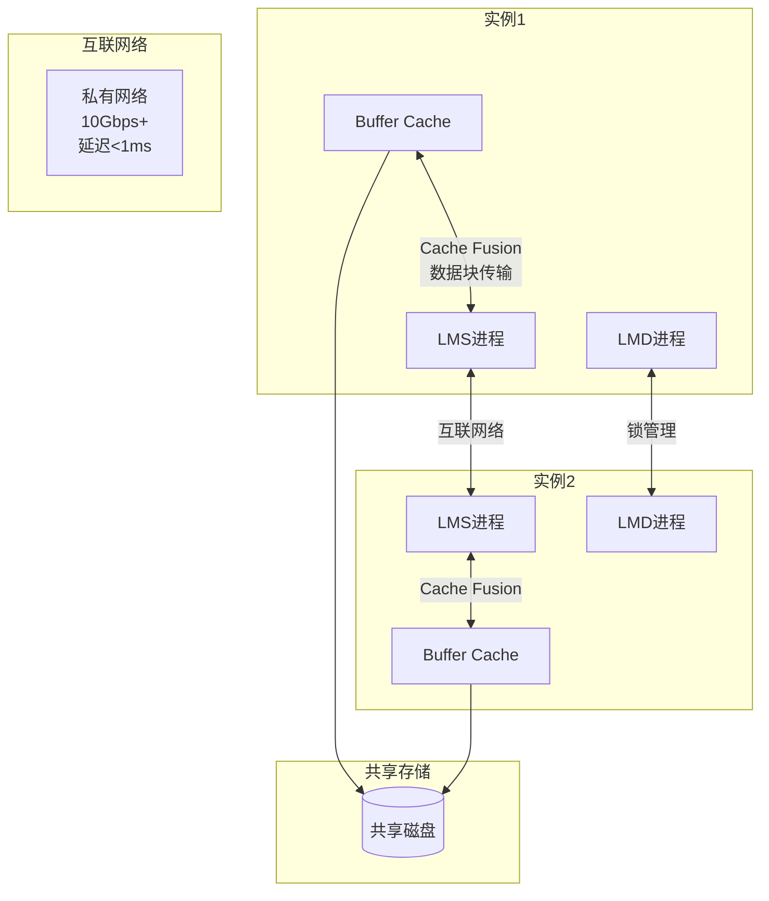
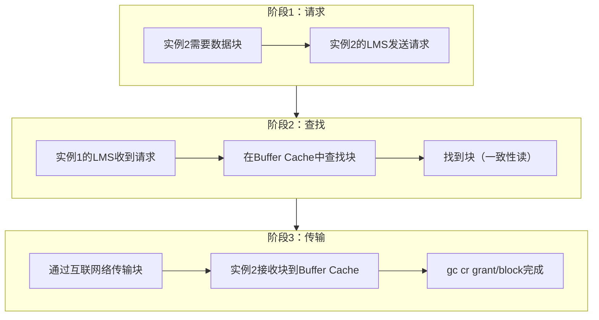
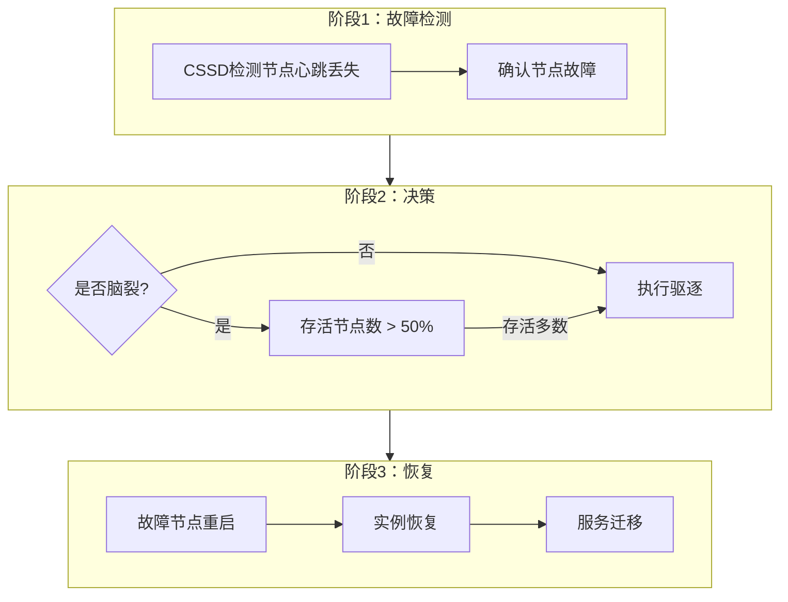
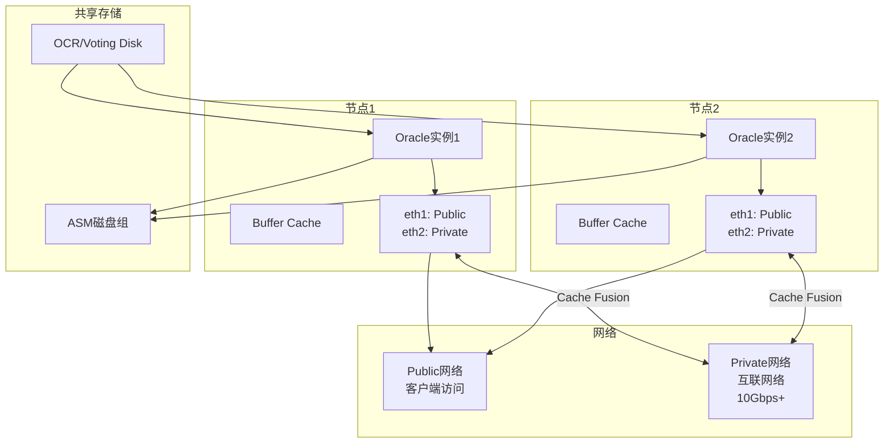

# Oracle RAC性能优化与故障处理

## 一、概述

### 1.1 一句话定义

Oracle RAC性能优化是通过减少全局缓存等待事件（gc*）、优化互联网络带宽和延迟、合理配置服务和负载均衡策略，使集群整体性能达到最优的过程。
它在RAC环境运维中出现和使用，解决集群环境下因Cache Fusion开销、互联网络瓶颈和热点块争用导致的性能下降问题。

### 1.2 为什么重要

- **不掌握的后果：** RAC性能反而低于单实例（"RAC税"），互联网络成为瓶颈，gc等待事件占据Top事件，业务响应时间劣化
- **掌握的价值：** 消除RAC环境特有的性能开销，使集群性能接近或超过单实例，充分发挥集群的高可用和扩展价值

### 1.3 适用场景

| 场景 | 说明 |
|------|------|
| RAC性能基线 | 建立RAC环境性能基线，识别异常 |
| gc等待事件优化 | 减少Cache Fusion带来的全局等待 |
| 互联网络调优 | 优化私有网络带宽和延迟 |
| 热点块处理 | 解决多实例争用同一数据块 |
| 节点驱逐/脑裂 | 处理集群故障和节点异常重启 |

### 1.4 版本演进

| 版本 | 变化说明 |
|------|---------|
| 11gR2 | Cache Fusion优化，10Gbps互联网络推荐 |
| 12cR1 | 增强型Cache Fusion，减少gc等待 |
| 12cR2 | 灵活ASM，RAC One Node增强 |
| 19c | 自动RAC性能诊断，AWR增强 |
| 21c | 云环境RAC性能优化，25Gbps/100Gbps支持 |

## 二、术语与概念

### 2.1 核心术语表

| 术语 | 含义 | 类比 |
|------|------|------|
| Cache Fusion | 通过互联网络在实例间直接传输数据块 | 两个人直接传递文件 |
| gc等待事件 | 全局缓存相关的等待事件总称 | 等待别人传文件的时间 |
| LMS | Global Cache Service进程，管理全局缓存 | 文件传递管理员 |
| LMD | Global Enqueue Service进程，管理全局锁 | 文件借阅登记员 |
| 互联网络 | 实例间私有网络，用于Cache Fusion | 办公室间的专用通道 |
| 热点块 | 被多个实例频繁访问的数据块 | 大家都要用的热门文件 |
| 节点驱逐 | Clusterware强制重启异常节点 | 把不听话的人赶出去 |
| 脑裂 | 集群分裂为多个独立部分 | 团队失联各自为政 |

### 2.2 RAC性能组件关系



## 三、架构与原理

### 3.1 Cache Fusion工作原理



### 3.2 工作原理

1. **数据请求：** 实例A需要访问某个数据块，先检查本地Buffer Cache
2. **全局查找：** 如果本地没有，通过LMS向其他实例查询
3. **块传输：** 拥有该块的实例B通过互联网络直接传输到实例A
4. **锁协调：** LMD进程协调全局锁，确保块的一致性
5. **本地缓存：** 实例A收到块后放入本地Buffer Cache，后续访问无需网络

**一句话总结：** RAC性能的核心是Cache Fusion效率——互联网络带宽和延迟直接决定全局等待时间。

### 3.3 RAC故障处理流程



## 四、功能详解

### 4.1 gc等待事件分析

#### 功能说明

gc等待事件是RAC特有的性能指标，反映Cache Fusion的效率。

#### 操作步骤

```sql
-- 查看gc等待事件
SELECT inst_id, event, total_waits,
       time_waited/100 AS time_sec,
       average_wait*10 AS avg_wait_ms
FROM gv$system_event
WHERE event LIKE 'gc%'
ORDER BY time_waited DESC;

-- 常见gc等待事件解读
-- gc buffer busy acquire/release: 全局缓冲区忙（热点块）
-- gc cr grant 2-way/3-way: 一致性读授权
-- gc cr block 2-way/3-way: 一致性读块传输
-- gc current block 2-way/3-way: 当前块传输
-- gc buffer busy deadlock: 全局缓冲区死锁

-- 2-way vs 3-way
-- 2-way: 直接传输（快）
-- 3-way: 通过LMS中转（慢，说明有锁竞争）
```

### 4.2 互联网络优化

#### 功能说明

互联网络是RAC性能的物理基础，带宽和延迟直接影响Cache Fusion效率。

#### 操作步骤

```bash
# 查看互联网络配置
oifcfg getif

# 检查互联网络接口
$ORACLE_HOME/bin/oifcfg iflist

# 检查网络延迟
ping -s 8192 -c 100 private_ip_1
ping -s 8192 -c 100 private_ip_2

# 检查网络带宽
# 使用iperf测试
iperf -s  # 一端
iperf -c private_ip  # 另一端
```

```sql
-- 查看互联网络统计
SELECT inst_id, ip_address, interface_name,
       cache_fusion_transfer_rate
FROM gv$cluster_interconnects;

-- 检查互联网络性能
SELECT inst_id, name, value
FROM gv$sysstat
WHERE name LIKE '%gc%block%lost%'
   OR name LIKE '%gc%block%corrupt%';
-- block lost > 0 说明网络有问题
```

### 4.3 热点块处理

```sql
-- 识别热点块
SELECT inst_id, event, p1 AS file#, p2 AS block#
FROM gv$session_wait
WHERE event = 'gc buffer busy acquire'
AND state = 'WAITING';

-- 查看热点对象
SELECT owner, object_name, subobject_name, object_type
FROM dba_extents
WHERE file_id = &file_no
AND &block_no BETWEEN block_id AND block_id + blocks - 1;

-- 热点块处理方案
-- 1. 优化SQL减少对该块的访问
-- 2. 使用分区减少争用
-- 3. 调整应用设计（如序列缓存）
-- 4. 考虑将热点表迁移到单实例
```

### 4.4 服务配置与负载均衡

```sql
-- 创建负载均衡服务
-- srvctl add service -db orcl -service oltp_svc \
--   -preferred orcl1,orcl2 -clbgoal SHORT -rlbgoal NONE

-- 创建高可用服务
-- srvctl add service -db orcl -service ha_svc \
--   -preferred orcl1 -available orcl2 -failovertype SELECT

-- 查看服务状态
-- srvctl status service -db orcl

-- 查看运行时统计
SELECT name, clb_goal, rlb_goal, goal
FROM dba_services;

-- 查看服务运行时统计
SELECT service_name, inst_id, sum(wait_time)/1000 AS total_wait
FROM gv$active_session_history
GROUP BY service_name, inst_id
ORDER BY total_wait DESC;
```

## 五、性能与调优

### 5.1 性能监控

```sql
-- 查看实例活动概览
SELECT inst_id, event, state,
       COUNT(*) AS cnt,
       SUM(wait_time_micro)/1000000 AS total_sec
FROM gv$session
WHERE wait_class != 'Idle'
GROUP BY inst_id, event, state
ORDER BY total_sec DESC;

-- 查看全局缓存统计
SELECT inst_id, name, value
FROM gv$sysstat
WHERE name LIKE '%gc%'
ORDER BY inst_id, name;

-- 查看Cache Fusion效率
SELECT inst_id,
       name,
       value
FROM gv$sysstat
WHERE name IN (
    'gc cr blocks received',
    'gc cr blocks served',
    'gc current blocks received',
    'gc current blocks served',
    'gc cr grant time',
    'gc cr block time',
    'gc current block time'
);
```

### 5.2 性能基线

| 指标 | 正常范围 | 告警阈值 | 说明 |
|------|---------|---------|------|
| gc cr block time | < 1ms | > 5ms | 一致性读块传输时间 |
| gc current block time | < 1ms | > 5ms | 当前块传输时间 |
| gc block lost | 0 | > 0 | 网络丢块 |
| 互联网络延迟 | < 0.5ms | > 1ms | 私有网络延迟 |
| 3-way比例 | < 10% | > 30% | 3-way等待占比 |

### 5.3 调优建议

| 场景 | 建议 | 原因 |
|------|------|------|
| gc等待高 | 检查互联网络带宽和延迟 | Cache Fusion瓶颈 |
| 热点块争用 | 优化SQL，使用分区 | 减少多实例并发访问 |
| 负载不均 | 配置CLB/RLB服务 | 让负载均衡更智能 |
| 3-way比例高 | 减少全局锁竞争 | 优化事务设计 |

## 六、DFX能力

### 6.1 动态性能视图

| 视图名 | 用途 | 关键字段 |
|--------|------|---------|
| GV$CLUSTER_INTERCONNECTS | 互联网络信息 | IP_ADDRESS, INTERFACE_NAME |
| GV$CRS_BLOCKMASTER | 块主信息 | FILE#, BLOCK# |
| GV$GCSPFMASTER_INFO | SPMaster信息 | DATA_OBJECT_ID, POLICY |
| GV$DLM_RESS | 全局锁资源 | RESOURCE_NAME, GRANT_LEVEL |
| GV$DLM_LCK | 全局锁信息 | RESOURCE_NAME, MODE_HELD |

### 6.2 日志与告警

- **日志位置：** `$GRID_HOME/log/<hostname>/alert_<hostname>.log`
- **关键日志：** 节点驱逐、脑裂检测、互联网络错误
- **告警配置：** 监控gc等待事件、互联网络延迟、节点状态

```sql
-- 查看集群事件
SELECT * FROM gv$cluster_interconnects;

-- 查看CSSD日志
-- $GRID_HOME/log/$(hostname)/cssd/ocssd.log
```

## 七、实战案例

### 7.1 案例背景

- **场景**：某电商Oracle 19c RAC（2节点），互联网络10Gbps
- **时间**：大促期间
- **现象**：AWR报告显示gc buffer busy acquire占据Top 1等待事件，平均等待时间15ms

### 7.2 诊断过程

**步骤1：分析gc等待事件**

```sql
SELECT inst_id, event, total_waits,
       time_waited/100 AS sec,
       average_wait*10 AS avg_ms
FROM gv$system_event
WHERE event LIKE 'gc%'
ORDER BY time_waited DESC;
```
- → 发现：gc buffer busy acquire总等待时间占DB time的35%
- → 判断：存在严重的热点块争用

**步骤2：定位热点块**

```sql
SELECT inst_id, current_obj#, COUNT(*) AS waits
FROM gv$active_session_history
WHERE event = 'gc buffer busy acquire'
AND sample_time > SYSDATE - 1/24
GROUP BY inst_id, current_obj#
ORDER BY waits DESC;
```
- → 发现：热点对象为ORDER_SEQ序列对应的表
- → 判断：序列争用导致热点块

**步骤3：检查互联网络**

```bash
$ ping -s 8192 -c 100 node2-priv
# rtt min/avg/max = 0.15/0.25/0.8 ms
```
- → 发现：互联网络延迟正常（<1ms）
- → 判断：问题不在网络，在应用层热点

**步骤4：优化方案**

```sql
-- 将序列改为CACHE + ORDER模式减少争用
-- 或使用分区减少并发
ALTER TABLE orders MODIFY PARTITION BY HASH(order_id) PARTITIONS 8;

-- 增大序列缓存
ALTER SEQUENCE order_seq CACHE 10000;
```

### 7.3 解决结果

| 指标 | 解决前 | 解决后 |
|------|--------|--------|
| gc buffer busy等待 | Top 1（35% DB time） | 消失 |
| 平均响应时间 | 500ms | 20ms |
| 互联网络利用率 | 正常 | 正常 |

### 7.4 复盘总结

- **根因：** 序列CACHE值过小（默认20），导致多实例频繁争用同一数据块
- **教训：** RAC环境中序列CACHE要设大（10000+），或使用HASH分区减少热点

## 八、常见错误与排查

### 8.1 常见错误列表

| 错误代码 | 错误信息 | 原因 | 解决方法 |
|---------|---------|------|---------|
| ORA-29701 | unable to connect to Cluster Manager | CSSD通信失败 | 检查Clusterware状态 |
| ORA-29740 | node eviction | 节点被驱逐 | 检查alert.log和CSSD日志 |
| ORA-00600 [kjblrdm | 全局锁相关内部错误 | 锁管理异常 | 联系Oracle Support |
| CRS-4639 | Could not contact Oracle High Availability Services | OHASD未启动 | crsctl start has |
| CLSU-00105 | 互联网络配置错误 | 私有网络配置问题 | oifcfg检查配置 |

### 8.2 排查步骤

1. **检查集群状态：** `crsctl stat res -t`
2. **查看gc等待：** `SELECT * FROM gv$system_event WHERE event LIKE 'gc%'`
3. **检查互联网络：** `oifcfg getif` + ping测试
4. **查看CSSD日志：** `$GRID_HOME/log/$(hostname)/cssd/ocssd.log`
5. **检查alert.log：** 搜索节点驱逐和脑裂相关错误

### 8.3 解决方案

**方案一：优化gc等待**

```sql
-- 减少热点块争用
-- 1. 增大序列CACHE
ALTER SEQUENCE seq_name CACHE 10000;
-- 2. 使用HASH分区
ALTER TABLE table_name MODIFY PARTITION BY HASH(id) PARTITIONS 8;
-- 3. 优化SQL减少块访问
```

**方案二：节点驱逐后恢复**

```bash
# 检查集群状态
crsctl stat res -t

# 启动故障节点
crsctl start crs

# 检查服务是否自动迁移
srvctl status service -db orcl

# 如果服务未迁移，手动启动
srvctl start service -db orcl -instance orcl1
```

## 九、最佳实践

### 9.1 官方推荐

- 互联网络使用独立的10Gbps+网络，不与Public共享
- 使用CLB/RLB服务实现智能负载均衡
- 序列CACHE值在RAC环境中设为10000+
- 定期检查gc等待事件基线

### 9.2 社区经验

- AWR报告中gc等待超过DB time的10%需要关注
- 3-way等待比例超过30%说明锁竞争严重
- 互联网络使用jumbo frame（9000 MTU）减少包开销
- 热点块问题优先考虑应用层优化而非硬件升级

### 9.3 反模式

| 反模式 | 问题 | 正确做法 |
|--------|------|---------|
| 互联网络共享Public | 带宽争用导致gc等待 | 使用独立私有网络 |
| 序列CACHE过小 | 热点块争用 | RAC环境CACHE >= 10000 |
| 不监控gc等待 | 性能劣化无感知 | 建立AWR基线定期对比 |
| 忽略3-way等待 | 锁竞争导致性能差 | 优化事务减少锁持有时间 |
| 节点数过多 | Cache Fusion开销线性增长 | RAC一般2-4节点 |

## 十、命令与视图汇总

### 10.1 命令列表

| 命令 | 适用场景 | 说明 |
|------|---------|------|
| `oifcfg getif` | 查看网络配置 | 互联网络接口 |
| `crsctl stat res -t` | 查看集群状态 | 所有资源状态 |
| `srvctl status service` | 查看服务状态 | RAC服务运行状态 |
| `ping -s 8192` | 测试网络延迟 | 互联网络质量 |
| `iperf` | 测试网络带宽 | 互联网络吞吐 |

### 10.2 视图列表

| 视图名 | 类型 | 用途 | 关键字段 |
|--------|------|------|---------|
| GV$CLUSTER_INTERCONNECTS | 动态 | 互联网络信息 | IP_ADDRESS, INTERFACE_NAME |
| GV$SYSTEM_EVENT | 动态 | 等待事件 | EVENT, TIME_WAITED |
| GV$SYSSTAT | 动态 | 系统统计 | NAME, VALUE |
| GV$SESSION_WAIT | 动态 | 会话等待 | EVENT, P1, P2 |
| GV$ACTIVE_SESSION_HISTORY | 动态 | 活跃会话历史 | EVENT, CURRENT_OBJ# |

## 十一、总结速查

### 11.1 黄金法则

1. **独立网络** - 互联网络必须独立，10Gbps+
2. **监控gc等待** - 建立AWR基线，gc等待<10% DB time
3. **消除热点** - 大CACHE序列 + HASH分区
4. **智能负载均衡** - 使用CLB/RLB服务
5. **控制节点数** - 2-4节点最佳，过多增加Cache Fusion开销

### 11.2 一页纸检查清单

| 现象/场景 | 原因 | 处理方案 |
|-----------|------|----------|
| gc buffer busy高 | 热点块争用 | 增大序列CACHE，HASH分区 |
| gc cr block time高 | 互联网络延迟 | 检查网络，使用jumbo frame |
| 3-way等待比例高 | 全局锁竞争 | 优化事务，减少锁持有时间 |
| 节点驱逐 | 心跳丢失或脑裂 | 检查互联网络和存储 |
| 负载不均 | 未配置CLB/RLB | 配置智能负载均衡服务 |

### 11.3 关键数字

| 指标 | 正常范围 | 告警阈值 | 说明 |
|------|---------|---------|------|
| gc cr block time | < 1ms | > 5ms | 一致性读块传输时间 |
| gc等待/DB time | < 10% | > 20% | gc等待占比 |
| 互联网络延迟 | < 0.5ms | > 1ms | 私有网络RTT |
| 3-way比例 | < 10% | > 30% | 3-way等待占比 |

## 附录

### A. 拓扑示例



### B. 官方参考

- [Oracle Real Application Clusters Administration and Deployment Guide](https://docs.oracle.com/en/database/oracle/oracle-database/19c/racad/)
- [Oracle Grid Infrastructure Administration and Deployment Guide](https://docs.oracle.com/en/database/oracle/oracle-database/19c/cwadm/)
- MOS Note: 1367077.1 - "RAC Performance Tuning"

### C. 修订记录

| 日期 | 版本 | 修改内容 | 修改人 |
|------|------|---------|--------|
| 2026-07-02 | v1.0 | 初始版本 | YashanDB知识库生成器 |
| 2026-07-02 | v1.1 | 补充完整模板章节 | YashanDB知识库生成器 |
