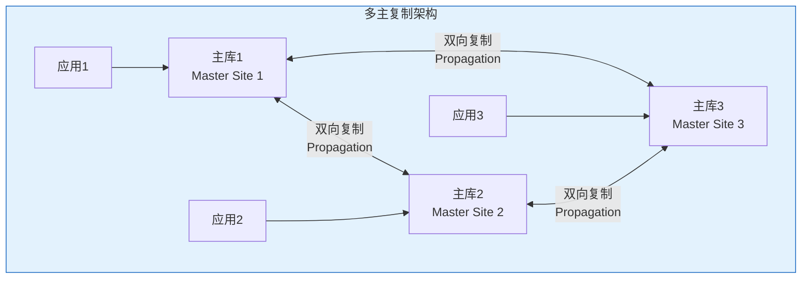
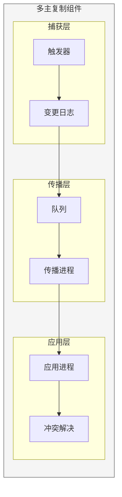
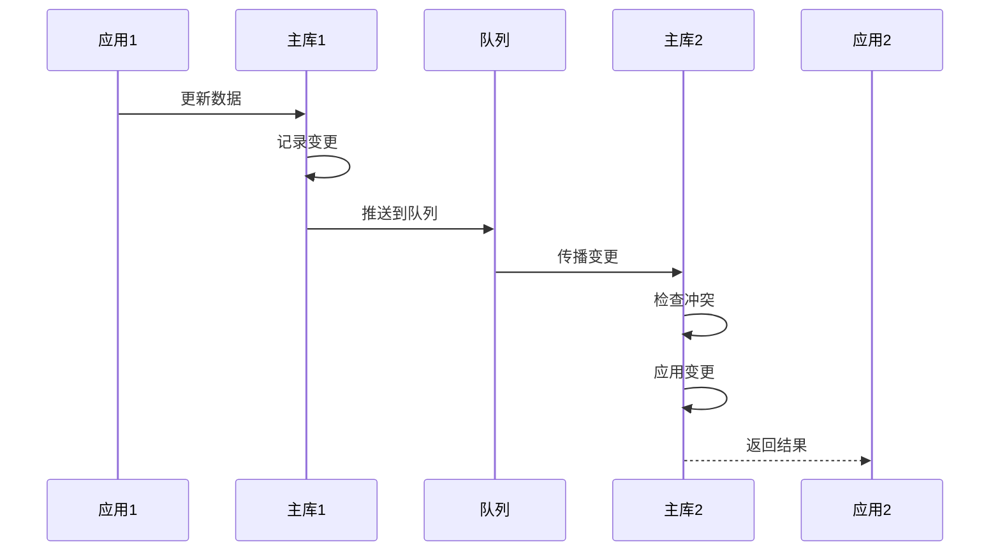
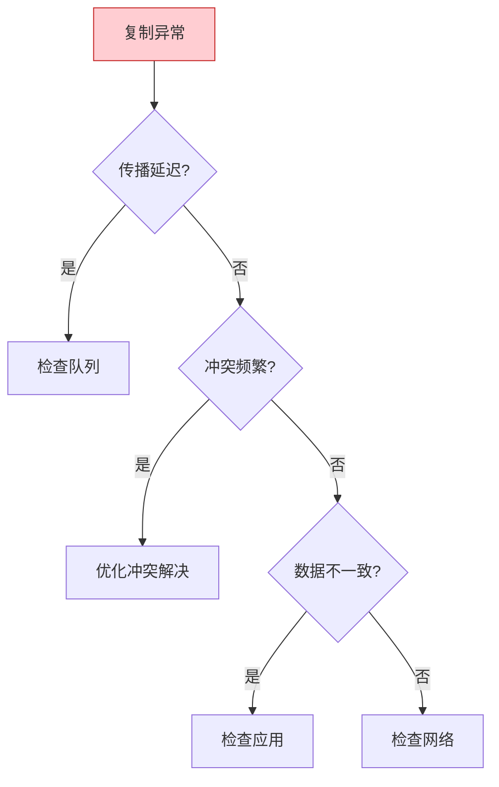

# Oracle多主复制架构

## 一、概述

### 1.1 一句话定义

Oracle多主复制是数据在多个主数据库间双向同步的技术，支持多活架构和分布式数据处理。
它在多活架构中出现和使用，解决多节点数据一致性的问题。

### 1.2 为什么重要

- **不掌握的后果：** 无法实现多活架构，数据一致性无法保证
- **掌握的价值：** 实现高可用多活架构，提升系统扩展性

### 1.3 适用场景

| 场景 | 说明 |
|------|------|
| 多活架构 | 多节点同时提供服务 |
| 分布式处理 | 数据分散处理 |
| 离线同步 | 断网后同步 |
| 地理分布 | 跨地域数据同步 |

### 1.4 版本演进

| 版本 | 变化说明 |
|------|---------|
| 11gR2 | Advanced Replication成熟 |
| 12cR1 | XStream增强 |
| 12cR2 | GoldenGate集成 |
| 19c | Sharding支持 |
| 21c | 云原生多活 |

## 二、术语与概念

### 2.1 核心术语表

| 术语 | 含义 | 类比 |
|------|------|------|
| Multi-Master | 多主复制 | 多中心 |
| Conflict | 冲突 | 数据打架 |
| Resolution | 解决 | 裁决 |
| Propagation | 传播 | 数据传递 |
| Deferrable | 可延迟 | 延迟执行 |

### 2.2 多主复制架构



## 三、核心原理

### 3.1 复制方式对比

| 方式 | 同步/异步 | 一致性 | 性能 | 适用场景 |
|------|----------|--------|------|---------|
| 同步复制 | 同步 | 强一致 | 低 | 金融交易 |
| 异步复制 | 异步 | 最终一致 | 高 | 一般业务 |
| 可更新物化视图 | 定期 | 最终一致 | 高 | 离线场景 |

### 3.2 冲突类型

| 类型 | 说明 | 示例 |
|------|------|------|
| 更新冲突 | 同一行被不同节点更新 | 两端修改同一记录 |
| 插入冲突 | 主键重复 | 两端插入相同主键 |
| 删除冲突 | 一端删除一端更新 | 一端删除，一端修改 |
| 唯一约束冲突 | 唯一键重复 | 两端插入相同唯一键 |

### 3.3 冲突检测方法

```sql
-- 时间戳方法（推荐）
ALTER TABLE employees ADD (
    last_update TIMESTAMP DEFAULT SYSTIMESTAMP,
    update_site VARCHAR2(30)
);

-- 触发器自动更新
CREATE OR REPLACE TRIGGER trg_emp_timestamp
BEFORE UPDATE ON employees
FOR EACH ROW
BEGIN
    :NEW.last_update := SYSTIMESTAMP;
    :NEW.update_site := SYS_CONTEXT('USERENV', 'DB_NAME');
END;
/

-- 配置补充日志
ALTER TABLE employees ADD SUPPLEMENTAL LOG GROUP emp_ts_grp (last_update) ALWAYS;

-- 基于列值的冲突检测
BEGIN
    DBMS_REPCAT.ADD_UPDATE_RESOLUTION(
        sname => 'hr',
        oname => 'employees',
        column_group => 'emp_ts_grp',
        parameter_name => 'last_update',
        function_name => 'max',
        priority_level => NULL
    );
END;
/
```

### 3.4 冲突解决策略

| 策略 | 说明 | 适用场景 |
|------|------|---------|
| 最新时间戳 | 最新修改优先 | 一般场景 |
| 站点优先级 | 指定站点优先 | 主从场景 |
| 加法合并 | 数值相加 | 计数场景 |
| 平均值 | 取平均 | 统计场景 |
| 丢弃更新 | 忽略冲突 | 非关键数据 |
| 人工解决 | 人工介入 | 关键数据 |

```sql
-- 站点优先级解决
BEGIN
    DBMS_REPCAT.ADD_UPDATE_RESOLUTION(
        sname => 'hr',
        oname => 'employees',
        column_group => 'emp_site_grp',
        parameter_name => 'update_site',
        function_name => 'priority',
        priority_level => 1  -- 站点优先级
    );
END;
/

-- 加法合并（适合计数器）
BEGIN
    DBMS_REPCAT.ADD_UPDATE_RESOLUTION(
        sname => 'hr',
        oname => 'order_count',
        column_group => 'count_grp',
        parameter_name => 'count_value',
        function_name => 'add',
        priority_level => NULL
    );
END;
/
```

### 3.5 XStream技术

```sql
-- XStream是GoldenGate的底层技术
-- 提供API接口给应用程序

-- 创建XStream Out服务器
BEGIN
    DBMS_XSTREAM_ADM.CREATE_OUTBOUND(
        server_name => 'xout_server',
        table_names => 'hr.employees, hr.departments'
    );
END;
/

-- 创建XStream In服务器
BEGIN
    DBMS_XSTREAM_ADM.CREATE_INBOUND(
        server_name => 'xin_server',
        table_names => 'hr.employees'
    );
END;
/

-- 查看XStream状态
SELECT server_name, status, capture_name
FROM dba_xstream_outbound;

-- 应用连接XStream
DECLARE
    l_position RAW(64);
BEGIN
    -- 获取起始位置
    l_position := DBMS_XSTREAM_ADM.GET_POSITION(
        server_name => 'xout_server'
    );
END;
/
```

### 3.6 多主复制配置

```sql
-- 1. 配置补充日志
ALTER DATABASE ADD SUPPLEMENTAL LOG DATA;
ALTER DATABASE ADD SUPPLEMENTAL LOG DATA (PRIMARY KEY) COLUMNS;
ALTER DATABASE ADD SUPPLEMENTAL LOG DATA (UNIQUE) COLUMNS;

-- 2. 创建复制管理员
CREATE USER repadmin IDENTIFIED BY repadmin_pass;
GRANT DBA TO repadmin;

BEGIN
    DBMS_REPCAT_ADMIN.GRANT_ADMIN_ANY_SCHEMA(
        username => 'repadmin'
    );
END;
/

-- 3. 创建主组
BEGIN
    DBMS_REPCAT.CREATE_MASTER_REPGROUP(
        gname => 'hr_repg',
        master => 'orcl1',
        qualifier => ''
    );
END;
/

-- 4. 添加复制对象
BEGIN
    DBMS_REPCAT.CREATE_MASTER_REPOBJECT(
        sname => 'hr',
        oname => 'employees',
        type => 'TABLE',
        gname => 'hr_repg',
        use_existing_object => TRUE
    );
END;
/

-- 5. 添加其他主站点
BEGIN
    DBMS_REPCAT.ADD_MASTER_DATABASE(
        gname => 'hr_repg',
        master => 'orcl2',
        existing_master => 'orcl1',
        use_existing_objects => TRUE,
        copy_rows => FALSE
    );
END;
/

-- 6. 启动复制
BEGIN
    DBMS_REPCAT.RESUME_MASTER_ACTIVITY(
        gname => 'hr_repg'
    );
END;
/
```

## 四、架构与组件

### 4.1 多主复制组件



### 4.2 数据流向



## 五、配置与调优

### 5.1 性能优化

| 策略 | 说明 | 效果 |
|------|------|------|
| 异步传播 | 批量传播 | 提高性能 |
| 并行传播 | 多进程传播 | 提高吞吐 |
| 批量应用 | 批量应用变更 | 减少开销 |
| 压缩传输 | 压缩变更数据 | 减少网络 |

```sql
-- 配置异步传播
BEGIN
    DBMS_DEFER_SYS.SCHEDULE_PURGE(
        destination => 'orcl2',
        interval => '/*1:hr*/ SYSDATE + 1/144',  -- 每分钟
        delay_seconds => 0
    );
END;
/

-- 配置并行传播
BEGIN
    DBMS_DEFER_SYS.SCHEDULE_PROPAGATION(
        destination => 'orcl2',
        interval => '/*1:hr*/ SYSDATE + 1/1440',
        parallelism => 4
    );
END;
/
```

### 5.2 监控多主复制

```sql
-- 查看复制状态
SELECT gname, master, status
FROM dba_repgroup;

-- 查看待传播事务
SELECT * FROM dba_defertran;

-- 查看传播延迟
SELECT destination, 
       TO_CHAR(start_time, 'HH24:MI:SS') AS start_time,
       elapsed_time
FROM dba_deferred_dest;

-- 查看错误事务
SELECT * FROM dba_repcatlog;

-- 查看冲突统计
SELECT * FROM dba_repcolumn_group;
```

## 六、监控与诊断

### 6.1 常见问题诊断

| 问题 | 症状 | 排查方法 |
|------|------|---------|
| 传播延迟 | 数据不同步 | 检查队列和传播进程 |
| 冲突频繁 | 性能下降 | 优化冲突检测 |
| 应用失败 | 事务失败 | 检查错误日志 |
| 数据不一致 | 数据差异 | 检查冲突解决 |

```sql
-- 诊断传播延迟
SELECT destination, 
       COUNT(*) AS pending_txns,
       MIN(start_time) AS oldest_txn
FROM dba_deferred_dest
GROUP BY destination;

-- 诊断冲突
SELECT sname, oname, conflict_type, resolution
FROM dba_represolution;

-- 清理错误事务
BEGIN
    DBMS_REPCAT.PURGE_MASTER_LOG(
        id => NULL,
        destination => NULL,
        gname => 'hr_repg'
    );
END;
/
```

## 七、实战案例

### 7.1 案例背景

- **场景**：多地区零售系统，各地独立运营
- **时间**：2026年
- **需求**：各地数据独立，定期汇总

### 7.2 架构设计

```sql
-- 架构设计
-- 北京主库：华北地区数据
-- 上海主库：华东地区数据
-- 广州主库：华南地区数据
-- 总部汇总库：全国数据汇总

-- 配置数据分区
-- 北京：store_id BETWEEN 1000 AND 1999
-- 上海：store_id BETWEEN 2000 AND 2999
-- 广州：store_id BETWEEN 3000 AND 3999
```

### 7.3 实施步骤

```sql
-- 1. 配置各主库
-- 2. 建立复制关系
-- 3. 配置冲突解决
-- 4. 启动复制
-- 5. 验证数据一致性
```

### 7.4 运行效果

| 指标 | 值 |
|------|-----|
| 节点数 | 3个主库 |
| 同步延迟 | <5秒 |
| 冲突率 | <0.01% |
| 可用性 | 99.99% |

### 7.5 复盘总结

- **根因：** 各地需要独立运营能力
- **教训：** 冲突解决策略要提前设计
- **改进：** 使用数据分区减少冲突

## 八、常见错误与排查

### 8.1 常见错误

| 错误 | 问题 | 解决方法 |
|------|------|---------|
| ORA-23310 | 对象不在复制组 | 添加到复制组 |
| ORA-23312 | 主键冲突 | 检查冲突解决 |
| ORA-23313 | 复制组未启动 | 启动复制组 |
| ORA-23337 | 冲突解决失败 | 检查解决策略 |

### 8.2 排查流程



## 九、最佳实践

### 9.1 官方推荐

- 使用数据分区减少冲突
- 配置合适的冲突解决策略
- 定期监控复制状态
- 建立完善的监控告警

### 9.2 社区经验

- 异步传播性能更好
- 时间戳冲突解决最通用
- 定期清理复制日志
- 建立灾备方案

### 9.3 反模式

| 反模式 | 问题 | 正确做法 |
|--------|------|---------|
| 不配置冲突解决 | 复制失败 | 必须配置 |
| 同步复制 | 性能差 | 使用异步 |
| 不监控复制 | 问题发现晚 | 建立监控 |
| 数据不分区 | 冲突多 | 数据分区 |

## 十、命令与视图汇总

### 10.1 命令列表

| 命令 | 适用场景 | 说明 |
|------|---------|------|
| `DBMS_REPCAT.CREATE_MASTER_REPGROUP` | 创建复制组 | 初始化 |
| `DBMS_REPCAT.ADD_MASTER_DATABASE` | 添加主库 | 扩展 |
| `DBMS_REPCAT.RESUME_MASTER_ACTIVITY` | 启动复制 | 开始同步 |
| `DBMS_XSTREAM_ADM.CREATE_OUTBOUND` | 创建XStream Out | 捕获变更 |

### 10.2 视图列表

| 视图名 | 类型 | 用途 |
|--------|------|------|
| DBA_REPGROUP | 静态 | 复制组信息 |
| DBA_DEFERRED_DEST | 静态 | 待传播事务 |
| DBA_REPCATLOG | 静态 | 复制错误 |
| DBA_XSTREAM_OUTBOUND | 静态 | XStream状态 |

## 十一、总结速查

### 11.1 黄金法则

1. **冲突解决** - 必须配置
2. **数据分区** - 减少冲突
3. **异步传播** - 提高性能
4. **定期监控** - 及时发现问题

### 11.2 一页纸检查清单

| 检查项 | 说明 |
|--------|------|
| 冲突检测 | 配置完整 |
| 冲突解决 | 策略明确 |
| 传播状态 | 无延迟 |
| 数据一致性 | 定期验证 |
| 监控告警 | 配置完善 |

## 附录

### A. 官方参考

- [Oracle Database Advanced Replication](https://docs.oracle.com/en/database/oracle/oracle-database/19c/radvd/)
- [Oracle XStream Documentation](https://docs.oracle.com/en/database/oracle/oracle-database/19c/xstrm/)

### B. 修订记录

| 日期 | 版本 | 修改内容 | 修改人 |
|------|------|---------|--------|
| 2026-07-02 | v1.0 | 初始版本 | YashanDB知识库生成器 |
