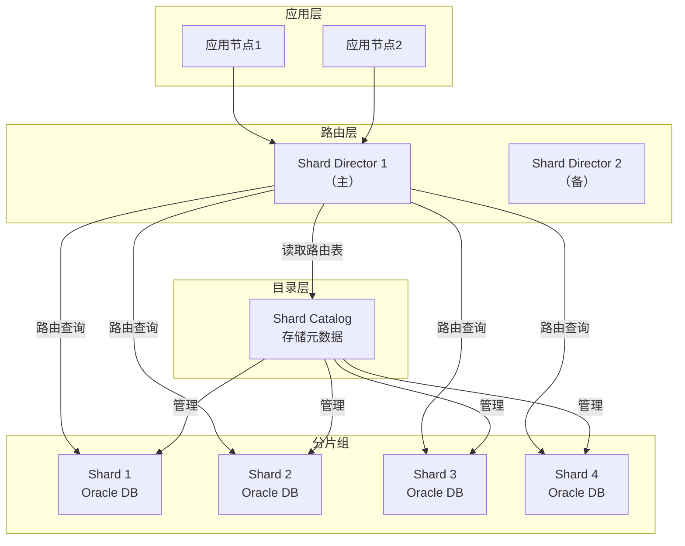
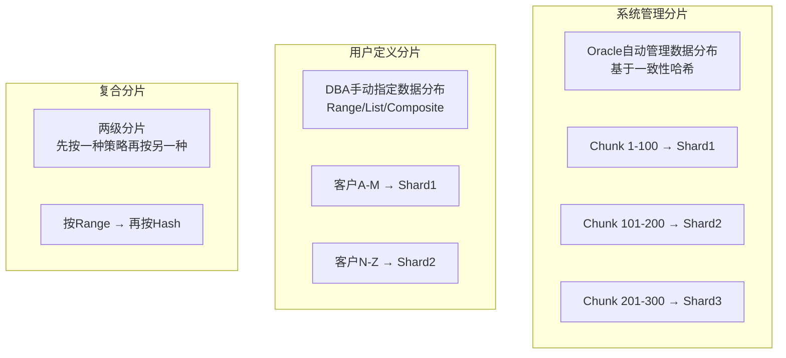
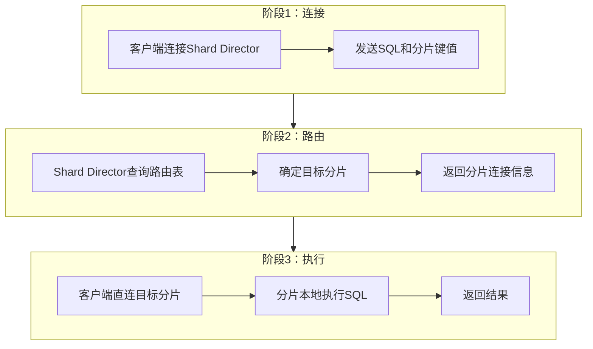
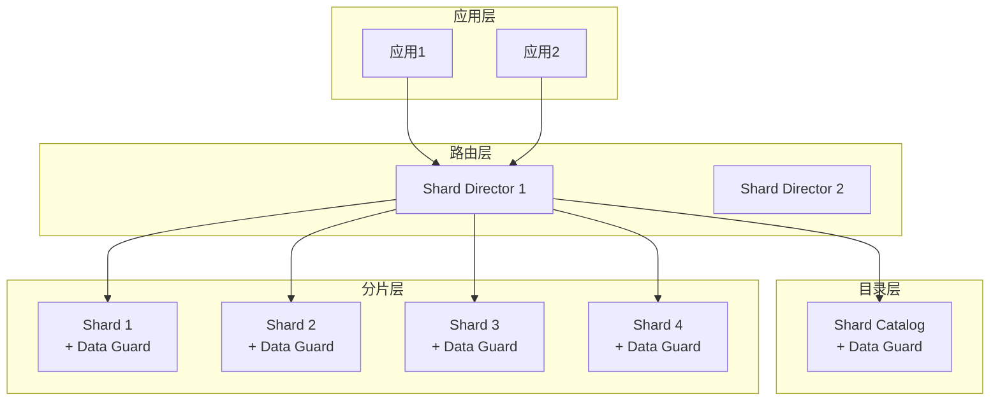

# Oracle分片与分布式数据库

## 一、概述

### 1.1 一句话定义

Oracle分片（Sharding）是将数据按分片键水平分布到多个独立数据库实例的技术，通过共享 nothing架构实现线性扩展，每个分片是完全自治的数据库。
它在大规模数据场景中出现和使用，解决单库容量和性能天花板的问题，支撑百万级QPS和PB级数据存储。

### 1.2 为什么重要

- **不掌握的后果：** 数据量超过单库极限后无法扩展，只能依赖昂贵的垂直扩展（更大服务器），成本指数增长
- **掌握的价值：** 通过水平扩展实现近乎无限的容量和性能增长，同时保持SQL数据库的事务一致性

### 1.3 适用场景

| 场景 | 说明 |
|------|------|
| SaaS多租户 | 按租户ID分片，每个租户数据隔离 |
| 电商订单 | 按客户ID分片，单客户数据在同一分片 |
| 时序数据 | 按时间范围分片，历史数据归档 |
| 地理分布 | 按区域分片，数据就近访问 |
| 超大规模OLTP | 单库无法承载的并发量和数据量 |

### 1.4 版本演进

| 版本 | 变化说明 |
|------|---------|
| 12cR2 | 原生Oracle Sharding发布，支持系统管理/用户定义/复合分片 |
| 18c | 增强JSON分片支持，在线分片重组织 |
| 19c | 分片自动管理增强，GDSCTL命令行改进 |
| 21c | 云原生分片架构，Kubernetes集成 |

## 二、术语与概念

### 2.1 核心术语表

| 术语 | 含义 | 类比 |
|------|------|------|
| Shard | 分片，一个独立的Oracle数据库实例 | 图书馆的一个书架 |
| Shard Catalog | 分片目录，存储分片元数据的中央数据库 | 图书馆的总目录 |
| Shard Director | 分片路由器，根据分片键将请求路由到正确分片 | 图书馆的导引员 |
| Sharding Key | 分片键，决定数据存储在哪个分片的列 | 书架编号规则 |
| Chunk | 数据块，分片间数据迁移的最小单位 | 一摞书 |
| GDS | Global Data Services，全局数据服务框架 | 图书馆管理系统 |
| DDL复制 | 将DDL变更自动传播到所有分片 | 统一更新所有书架的规则 |
| 全局索引 | 跨所有分片的索引 | 图书馆的全局检索系统 |

### 2.2 分片架构组件



## 三、架构与原理

### 3.1 分片类型架构图



### 3.2 工作原理

1. **分片键确定：** 根据业务查询模式选择分片键（如customer_id）
2. **路由决策：** Shard Director根据分片键值查询Shard Catalog中的路由表
3. **连接路由：** 将客户端连接重定向到对应的分片数据库
4. **本地执行：** 分片数据库本地执行SQL，无需跨分片通信
5. **DDL复制：** DDL变更通过Shard Catalog自动复制到所有分片
6. **数据重平衡：** 添加/删除分片时，通过Chunk迁移重新平衡数据

**一句话总结：** Oracle分片通过"分片键→路由→分片"的链路，让每个查询只访问一个分片，实现线性扩展。

### 3.3 查询路由流程



## 四、功能详解

### 4.1 系统管理分片

#### 功能说明

Oracle自动使用一致性哈希算法将数据均匀分布到各分片，无需DBA手动管理数据分布。

#### 操作步骤

```sql
-- 步骤1：创建分片目录（在Catalog数据库上）
-- 使用GDSCTL
-- GDSCTL> CREATE SHARDCATALOG -database cat_host:1521:catalog -user sdb_admin

-- 步骤2：添加分片
-- GDSCTL> ADD SHARD -shardgroup shardgroup1 -deploy_as active -credential oracle_cred
-- GDSCTL> DEPLOY

-- 步骤3：创建分片表
CREATE TABLE orders (
    order_id    NUMBER,
    customer_id NUMBER,
    amount      NUMBER(10,2),
    order_date  DATE
)
PARTITION BY CONSISTENT HASH (customer_id)
PARTITIONS AUTO;

-- 步骤4：创建分片索引
CREATE INDEX idx_orders_cust ON orders(customer_id) LOCAL;
```

### 4.2 用户定义分片

#### 功能说明

DBA手动指定数据分布规则，使用Range、List或Composite策略。

#### 操作步骤

```sql
-- Range分片示例
CREATE TABLE customers (
    customer_id   NUMBER,
    customer_name VARCHAR2(100),
    region        VARCHAR2(20)
)
PARTITION BY RANGE (customer_id)
(
    PARTITION p1 VALUES LESS THAN (1000000),   -- Shard 1
    PARTITION p2 VALUES LESS THAN (2000000),   -- Shard 2
    PARTITION p3 VALUES LESS THAN (3000000),   -- Shard 3
    PARTITION p4 VALUES LESS THAN (MAXVALUE)   -- Shard 4
);

-- List分片示例
CREATE TABLE orders (
    order_id    NUMBER,
    region_code VARCHAR2(10),
    amount      NUMBER
)
PARTITION BY LIST (region_code)
(
    PARTITION p_east  VALUES ('EAST'),
    PARTITION p_west  VALUES ('WEST'),
    PARTITION p_north VALUES ('NORTH'),
    PARTITION p_south VALUES ('SOUTH')
);
```

### 4.3 分片管理操作

```sql
-- 使用GDSCTL管理分片
-- 查看分片配置
-- GDSCTL> CONFIG
-- GDSCTL> CONFIG SHARDS

-- 添加新分片
-- GDSCTL> ADD SHARD -shardgroup shardgroup1 -deploy_as active
--         -connect shard4_host:1521:shard4 -credential oracle_cred
-- GDSCTL> DEPLOY
-- GDSCTL> START SHARD -shard shard4

-- 数据重平衡（添加分片后自动进行Chunk迁移）
-- GDSCTL> MIGRATE CHUNK -chunk_id 1 -dest_shard shard4

-- 移除分片
-- GDSCTL> REMOVE SHARD -shard shard1
-- GDSCTL> MIGRATE CHUNK -all -dest_shard shard2,shard3,shard4

-- 查看分片状态
-- GDSCTL> CONFIG SHARDS
-- GDSCTL> STATUS SHARD
```

### 4.4 全局索引与跨分片查询

```sql
-- 全局索引（跨所有分片）
CREATE INDEX idx_orders_amount ON orders(amount) GLOBAL;
-- 注意：全局索引会跨所有分片查询，影响性能

-- 分片级本地索引（推荐）
CREATE INDEX idx_orders_cust ON orders(customer_id) LOCAL;

-- 跨分片查询（需扫描所有分片）
SELECT * FROM orders WHERE amount > 10000;
-- 无法路由到单个分片，需要scatter-gather

-- 单分片查询（推荐）
SELECT * FROM orders WHERE customer_id = 12345;
-- 直接路由到目标分片
```

## 五、性能与调优

### 5.1 性能影响因素

- **分片键选择：** 直接影响数据分布均匀度和查询路由效率
- **Chunk大小：** 影响数据迁移的粒度
- **全局索引数量：** 全局索引需要跨分片查询，影响性能
- **Shard Director数量：** 影响路由层可用性和性能

### 5.2 调优建议

| 场景 | 建议 | 原因 |
|------|------|------|
| 数据倾斜 | 使用一致性哈希或调整分片策略 | 保证数据均匀分布 |
| 跨分片查询多 | 优化SQL使用分片键 | 减少scatter-gather |
| 分片扩展 | 预留足够Chunk | 减少重平衡时间 |
| 高并发路由 | 部署多个Shard Director | 消除路由单点 |

### 5.3 性能基线

| 指标 | 正常范围 | 告警阈值 | 说明 |
|------|---------|---------|------|
| 路由延迟 | < 1ms | > 10ms | Shard Director路由耗时 |
| 数据倾斜度 | < 10% | > 30% | 最大/最小分片数据量差异 |
| Chunk迁移时间 | < 10分钟 | > 1小时 | 单个Chunk迁移耗时 |

## 六、DFX能力

### 6.1 动态性能视图

| 视图名 | 用途 | 关键字段 |
|--------|------|---------|
| DBA_SHARDS | 分片列表 | SHARD_NAME, STATUS, TABLESPACE_GROUP |
| DBA_SHARD_CHUNKS | Chunk分布 | CHUNK_ID, SHARD_NAME |
| DBA_SHARD_KEY_COLUMNS | 分片键列 | TABLE_NAME, COLUMN_NAME |
| DBA_SHARD_TABLES | 分片表 | TABLE_NAME, SHARDING_TYPE |
| GSMADMIN_INTERNAL.DBA_CHUNKS | Chunk详情 | CHUNK_ID, SHARD_NAME, STATUS |

### 6.2 监控指标

| 指标名 | 采集方式 | 说明 |
|--------|---------|------|
| 分片数据量 | GDSCTL> STATUS SHARD | 各分片数据量 |
| Chunk分布 | DBA_SHARD_CHUNKS | Chunk在各分片的分布 |
| 路由命中率 | Shard Director日志 | 路由到正确分片的比例 |

```sql
-- 查看分片表信息
SELECT table_name, sharding_type, partition_count
FROM dba_shard_tables;

-- 查看Chunk分布
SELECT shard_name, COUNT(*) AS chunk_count
FROM dba_shard_chunks
GROUP BY shard_name
ORDER BY chunk_count;
```

## 七、实战案例

### 7.1 案例背景

- **场景**：某SaaS平台Oracle 19c分片架构，按租户ID分片，50个分片
- **时间**：业务快速增长期
- **现象**：部分分片数据量远超其他分片，导致热点分片性能下降

### 7.2 诊断过程

**步骤1：检查数据分布**

```sql
-- 查看各分片Chunk数量
SELECT shard_name, COUNT(*) AS chunks,
       SUM(row_count) AS total_rows
FROM dba_shard_chunks
GROUP BY shard_name
ORDER BY total_rows DESC;
```
- → 发现：Shard 3的数据量是Shard 12的10倍
- → 判断：数据分布严重不均匀

**步骤2：分析分片键**

```sql
-- 查看分片键分布
SELECT tenant_id, COUNT(*) AS row_count
FROM orders
GROUP BY tenant_id
ORDER BY row_count DESC;
```
- → 发现：前3个租户占了40%的数据量
- → 判断：租户大小差异导致数据倾斜

**步骤3：优化分片策略**

```sql
-- 将大租户拆分到多个分片
-- 使用复合分片：先按租户ID范围，再按Hash
-- 大租户的数据按order_id Hash分布到多个分片
```

```bash
# 执行Chunk迁移重新平衡
# GDSCTL> MIGRATE CHUNK -chunk_id 50 -dest_shard shard12
# GDSCTL> MIGRATE CHUNK -chunk_id 51 -dest_shard shard15
```

### 7.3 解决结果

| 指标 | 解决前 | 解决后 |
|------|--------|--------|
| 最大/最小分片比 | 10:1 | 1.5:1 |
| 热点分片CPU | 90% | 45% |
| P99延迟 | 500ms | 50ms |

### 7.4 复盘总结

- **根因：** 按租户ID分片时未考虑租户大小差异，大租户导致数据倾斜
- **教训：** 分片键选择要考虑数据分布均匀度，大租户使用复合分片策略

## 八、常见错误与排查

### 8.1 常见错误列表

| 错误代码 | 错误信息 | 原因 | 解决方法 |
|---------|---------|------|---------|
| ORA-03001 | unimplemented feature | 分片表不支持的操作 | 检查分片表限制 |
| ORA-003001 | 跨分片操作不支持 | 使用了不支持的跨分片操作 | 改写SQL使用分片键 |
| GDS-00xxx | Shard Director路由错误 | 路由表不一致 | 同步Shard Catalog |
| ORA-65500 | 分片管理操作错误 | GDSCTL操作错误 | 检查分片配置 |

### 8.2 排查步骤

1. **检查分片状态：** `GDSCTL> CONFIG SHARDS`
2. **检查Chunk分布：** `SELECT * FROM dba_shard_chunks`
3. **检查路由日志：** Shard Director日志
4. **检查数据倾斜：** 各分片数据量对比
5. **验证DDL复制：** 确认DDL已传播到所有分片

### 8.3 解决方案

**方案一：数据重平衡**

```bash
# 迁移Chunk到目标分片
# GDSCTL> MIGRATE CHUNK -chunk_id N -dest_shard target_shard
# 等待迁移完成后验证
# GDSCTL> CONFIG SHARDS
```

**方案二：添加新分片**

```bash
# 添加新分片
# GDSCTL> ADD SHARD -shardgroup shardgroup1 -deploy_as active
# GDSCTL> DEPLOY
# 自动触发Chunk迁移重新平衡
```

## 九、最佳实践

### 9.1 官方推荐

- 分片键选择高选择性的列，避免数据倾斜
- 使用系统管理分片（一致性哈希）简化运维
- 部署至少2个Shard Director保证路由层高可用
- Shard Catalog配置Data Guard保护

### 9.2 社区经验

- 分片数量预留扩展空间（如当前10个分片，按20个规划）
- 监控数据倾斜度，超过30%需要重平衡
- 避免全局索引，优先使用分片键查询
- 分片环境下的备份策略需要覆盖所有分片

### 9.3 反模式

| 反模式 | 问题 | 正确做法 |
|--------|------|---------|
| 分片键选择不当 | 数据倾斜或跨分片查询多 | 选择高选择性、查询常用的列 |
| 过多全局索引 | 跨分片查询性能差 | 优先使用本地索引 |
| 不监控数据分布 | 数据倾斜导致热点 | 定期检查分片数据量 |
| 分片数过少 | 扩展空间不足 | 预留扩展空间 |
| 忽略DDL复制 | 分片间schema不一致 | 验证DDL已传播到所有分片 |

## 十、命令与视图汇总

### 10.1 命令列表

| 命令 | 适用场景 | 说明 |
|------|---------|------|
| `GDSCTL> CONFIG SHARDS` | 查看分片配置 | 列出所有分片 |
| `GDSCTL> ADD SHARD` | 添加分片 | 扩展分片集群 |
| `GDSCTL> MIGRATE CHUNK` | 迁移Chunk | 数据重平衡 |
| `GDSCTL> STATUS SHARD` | 查看状态 | 分片运行状态 |
| `GDSCTL> REMOVE SHARD` | 移除分片 | 缩减分片集群 |

### 10.2 视图列表

| 视图名 | 类型 | 用途 | 关键字段 |
|--------|------|------|---------|
| DBA_SHARDS | 数据字典 | 分片列表 | SHARD_NAME, STATUS |
| DBA_SHARD_CHUNKS | 数据字典 | Chunk分布 | CHUNK_ID, SHARD_NAME |
| DBA_SHARD_TABLES | 数据字典 | 分片表 | TABLE_NAME, SHARDING_TYPE |
| DBA_SHARD_KEY_COLUMNS | 数据字典 | 分片键列 | TABLE_NAME, COLUMN_NAME |

## 十一、总结速查

### 11.1 黄金法则

1. **分片键选择** - 高选择性、查询常用、数据均匀
2. **避免倾斜** - 监控数据分布，及时重平衡
3. **减少跨分片** - 查询带上分片键，避免全局索引
4. **路由层高可用** - 至少2个Shard Director
5. **预留扩展** - 分片数和Chunk数预留增长空间

### 11.2 一页纸检查清单

| 现象/场景 | 原因 | 处理方案 |
|-----------|------|----------|
| 数据倾斜严重 | 分片键选择不当 | 调整分片策略或重新分片 |
| 跨分片查询多 | SQL未使用分片键 | 优化SQL添加分片键条件 |
| 路由延迟高 | Shard Director负载高 | 增加Shard Director实例 |
| 分片扩展困难 | Chunk预留不足 | 规划时预留足够Chunk |
| DDL未同步 | DDL复制中断 | 检查Shard Catalog连接 |

### 11.3 关键数字

| 指标 | 正常范围 | 告警阈值 | 说明 |
|------|---------|---------|------|
| 数据倾斜度 | < 10% | > 30% | 最大/最小分片差异 |
| 路由延迟 | < 1ms | > 10ms | Shard Director路由耗时 |
| Chunk迁移 | < 10分钟 | > 1小时 | 单Chunk迁移时间 |

## 附录

### A. 拓扑示例



### B. 官方参考

- [Oracle Database Sharding Guide](https://docs.oracle.com/en/database/oracle/oracle-database/19c/shard/)
- [Oracle Global Data Services Guide](https://docs.oracle.com/en/database/oracle/oracle-database/19c/gsmsg/)
- MOS Note: 2345518.1 - "Oracle Sharding Architecture"

### C. 修订记录

| 日期 | 版本 | 修改内容 | 修改人 |
|------|------|---------|--------|
| 2026-07-02 | v1.0 | 初始版本 | YashanDB知识库生成器 |
| 2026-07-02 | v1.1 | 补充完整模板章节 | YashanDB知识库生成器 |
