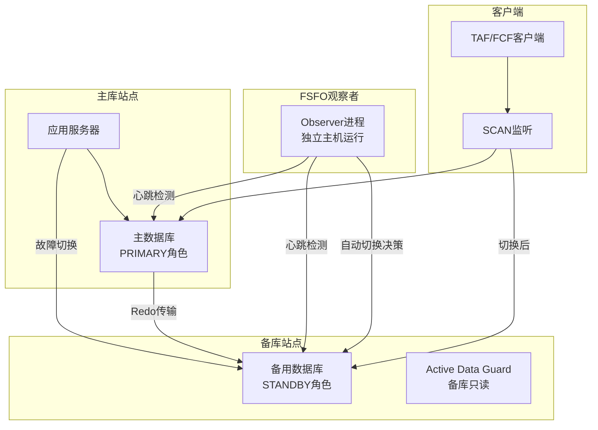
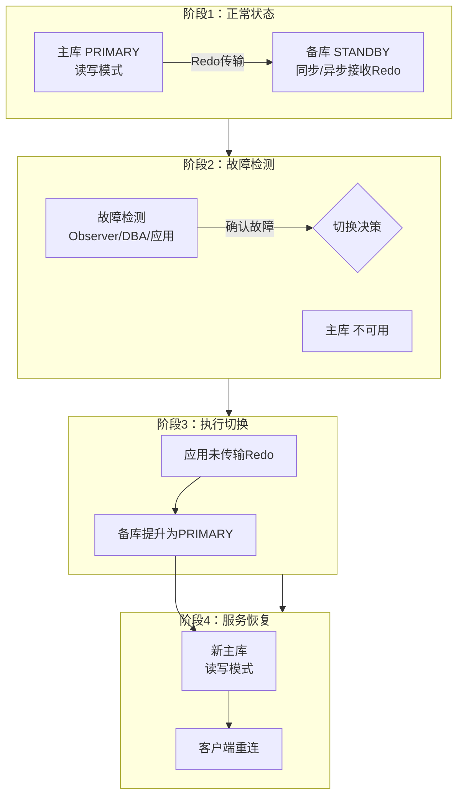
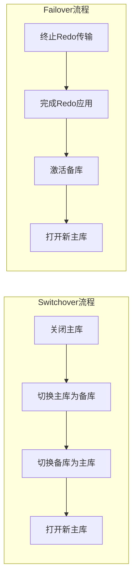
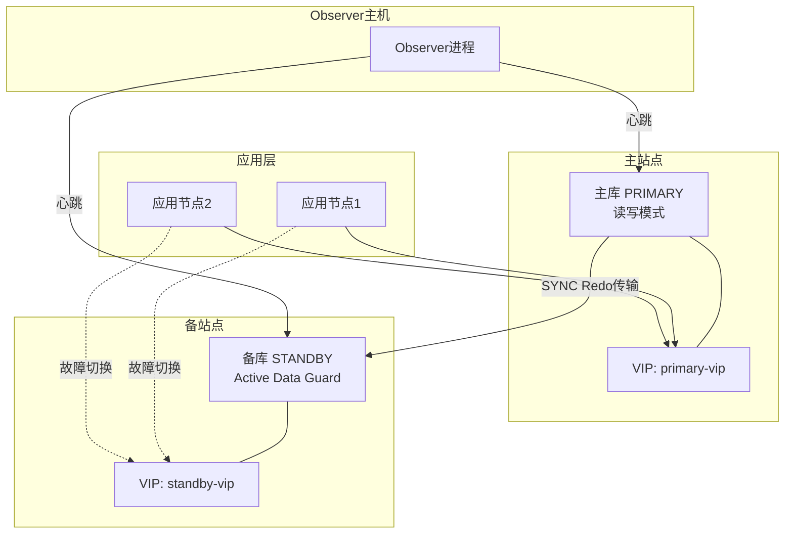

# Oracle故障切换方案设计

## 一、概述

### 1.1 一句话定义

Oracle故障切换是当主数据库发生故障时，通过Data Guard、RAC或应用层机制，自动或手动将服务切换到备用数据库的过程，包括Switchover（计划切换）和Failover（故障切换）两种方式。
它在高可用架构中出现和使用，解决单点故障导致的业务中断问题，确保RTO满足业务连续性要求。

### 1.2 为什么重要

- **不掌握的后果：** 主库故障时无法快速恢复服务，导致业务长时间中断（可能数小时），造成巨大经济损失
- **掌握的价值：** 设计合理的故障切换方案可将RTO控制在秒级到分钟级，保障业务连续性

### 1.3 适用场景

| 场景 | 说明 |
|------|------|
| 计划性维护 | 主机硬件升级、OS补丁等，使用Switchover零数据丢失 |
| 灾难恢复 | 主库硬件故障、站点断电等，使用Failover快速恢复 |
| 定期演练 | 验证故障切换流程是否可用，确保切换时间满足SLA |
| 地理容灾 | 跨机房/跨城容灾，结合Data Guard实现站点级切换 |
| 应用高可用 | 通过TAF/FCF实现连接级自动故障切换 |

### 1.4 版本演进

| 版本 | 变化说明 |
|------|---------|
| 11gR2 | Active Data Guard支持备库只读打开，Fast-Start Failover增强 |
| 12cR1 | 支持跨平台Data Guard，Far Sync实例引入 |
| 12cR2 | 自动故障切换增强，PDB级别切换 |
| 19c | 自动Switchover支持，DGMGRL简化切换操作 |
| 21c | 数据库服务自动迁移增强，切换时间进一步缩短 |

## 二、术语与概念

### 2.1 核心术语表

| 术语 | 含义 | 类比 |
|------|------|------|
| Switchover | 计划性角色转换，主备互换，无数据丢失 | 接力赛中有序交接 |
| Failover | 非计划性切换，备库提升为主库，可能丢数据 | 紧急替补上场 |
| FSFO | Fast-Start Failover，自动故障切换 | 自动驾驶紧急接管 |
| TAF | Transparent Application Failover，透明应用故障切换 | 电话转接，用户无感 |
| FCF | Fast Connection Failover，快速连接故障切换 | 连接池自动重连 |
| RTO | Recovery Time Objective，恢复时间目标 | 允许的最长中断时间 |
| RPO | Recovery Point Objective，恢复点目标 | 允许的最大数据丢失 |
| Observer | FSFO观察者进程，监控主库状态 | 裁判，判断是否需要切换 |

### 2.2 关键角色与组件



## 三、架构与原理

### 3.1 故障切换架构图



### 3.2 工作原理

1. **Redo持续同步：** 主库产生的Redo日志实时传输到备库
2. **故障检测：** Observer进程或DBA监控主库心跳
3. **切换决策：** 确认主库不可用后，决定执行Switchover或Failover
4. **备库提升：** 备库完成Redo应用后，提升为新的主库
5. **服务迁移：** 数据库服务（Service）迁移到新主库
6. **客户端重连：** 应用通过TAF/FCF自动重连到新主库

**一句话总结：** 故障切换的核心是将备库的Redo全部应用完毕后提升为主库，同时让客户端感知到新的服务地址。

### 3.3 Switchover vs Failover流程对比



## 四、功能详解

### 4.1 Switchover（计划切换）

#### 功能说明

Switchover是计划性的角色转换，主库和备库互换角色，保证零数据丢失。适用于维护窗口。

#### 操作步骤

**步骤1：检查切换条件**

```sql
-- 在主库检查
SELECT switchover_status FROM v$database;
-- 应显示 TO STANDBY 或 SESSIONS ACTIVE

-- 在备库检查
SELECT switchover_status FROM v$database;
-- 应显示 NOT ALLOWED（正常）或 TO PRIMARY
```

**步骤2：执行Switchover（使用DGMGRL）**

```bash
# 使用Data Guard Broker
dgmgrl sys/password@primary

DGMGRL> SHOW CONFIGURATION;
DGMGRL> SWITCHOVER TO standby_db;
# 自动完成角色转换
```

**步骤3：手动执行Switchover**

```sql
-- 主库
ALTER DATABASE COMMIT TO SWITCHOVER TO STANDBY;
-- 备库
ALTER DATABASE COMMIT TO SWITCHOVER TO PRIMARY;
ALTER DATABASE OPEN;
```

### 4.2 Failover（故障切换）

#### 功能说明

Failover是在主库不可用时，将备库提升为主库。根据保护模式可能丢失少量数据。

#### 操作步骤

```sql
-- 备库执行Failover
ALTER DATABASE RECOVER MANAGED STANDBY DATABASE FINISH;
ALTER DATABASE ACTIVATE STANDBY DATABASE;
ALTER DATABASE OPEN;

-- 验证角色
SELECT database_role, open_mode FROM v$database;
-- 应显示 PRIMARY / READ WRITE
```

### 4.3 Fast-Start Failover（自动故障切换）

#### 功能说明

FSFO通过Observer进程自动检测主库故障并执行切换，无需DBA介入。

#### 操作步骤

```bash
# 配置FSFO
dgmgrl sys/password@primary

DGMGRL> ENABLE FAST_START FAILOVER;
DGMGRL> START OBSERVER;
# Observer在独立主机上运行

# 验证配置
DGMGRL> SHOW FAST_START FAILOVER;
DGMGRL> SHOW CONFIGURATION;
```

```sql
-- 查看FSFO状态
SELECT fsfo_status, fsfo_target FROM v$database;
```

### 4.4 TAF（透明应用故障切换）

#### 功能说明

TAF允许客户端连接在主库故障时自动迁移到备库，对应用透明。

#### 配置步骤

```text
# tnsnames.ora配置
ORCL =
  (DESCRIPTION =
    (ADDRESS_LIST =
      (ADDRESS = (PROTOCOL = TCP)(HOST = primary-vip)(PORT = 1521))
      (ADDRESS = (PROTOCOL = TCP)(HOST = standby-vip)(PORT = 1521))
    )
    (CONNECT_DATA =
      (SERVICE_NAME = orcl)
      (FAILOVER_MODE =
        (TYPE = SELECT)       -- SESSION或SELECT
        (METHOD = BASIC)      -- BASIC或PRECONNECT
        (RETRIES = 3)         -- 重试次数
        (DELAY = 5)           -- 重试间隔（秒）
      )
    )
  )
```

| 参数 | 取值 | 说明 |
|------|------|------|
| TYPE | SESSION | 仅切换连接，正在执行的查询需重发 |
| TYPE | SELECT | 切换连接并恢复SELECT查询 |
| METHOD | BASIC | 故障时才建立到备库的连接 |
| METHOD | PRECONNECT | 预先建立到备库的连接，切换更快 |

### 4.5 FCF（快速连接故障切换）

#### 功能说明

FCF通过UCP连接池与FAN事件配合，实现秒级连接故障切换。

```sql
-- FCF配置（Java应用）
-- 使用UCP + ONS订阅FAN事件
-- ons.config:
-- nodes=primary-vip:6200,standby-vip:6200

-- 查看FAN事件配置
SELECT name, network_name FROM dba_services;
```

## 五、性能与调优

### 5.1 切换时间优化

| 因素 | 优化方法 | 预期效果 |
|------|---------|---------|
| Redo传输延迟 | 使用SYNC传输（最大保护模式） | 减少切换时的Redo追赶时间 |
| 备库启动时间 | 使用Active Data Guard（备库已打开） | 省去启动时间 |
| 客户端重连 | 使用FCF+PRECONNECT | 秒级重连 |
| 切换脚本 | 预编写自动化脚本 | 减少人工操作时间 |

### 5.2 性能基线

| 指标 | 正常范围 | 告警阈值 | 说明 |
|------|---------|---------|------|
| Redo传输延迟 | < 1秒 | > 10秒 | 影响Failover数据丢失量 |
| 切换时间 | < 30秒 | > 5分钟 | 超过RTO要求需优化 |
| 客户端重连时间 | < 5秒 | > 30秒 | 检查TAF/FCF配置 |

## 六、DFX能力

### 6.1 动态性能视图

| 视图名 | 用途 | 关键字段 |
|--------|------|---------|
| V$DATABASE | 数据库角色和切换状态 | DATABASE_ROLE, SWITCHOVER_STATUS, FSFO_STATUS |
| V$DATAGUARD_STATS | Data Guard统计 | NAME（transport lag, apply lag） |
| V$DATAGUARD_STATUS | Data Guard事件 | SEVERITY, MESSAGE |
| V$MANAGED_STANDBY | 备库管理进程状态 | PROCESS, STATUS |
| V$RECOVERY_PROGRESS | 恢复进度 | ITEM, SOFAR, TOTAL |

### 6.2 日志与告警

- **日志位置：** `$ORACLE_BASE/diag/rdbms/*/trace/alert_*.log`
- **关键日志：** Data Guard切换相关事件记录在alert.log
- **告警配置：** 监控transport lag和apply lag，超过阈值告警

```sql
-- 查看Redo传输延迟
SELECT name, value, datum_time FROM v$dataguard_stats
WHERE name IN ('transport lag', 'apply lag')
ORDER BY datum_time DESC;
```

## 七、实战案例

### 7.1 案例背景

- **场景**：某金融系统Oracle 19c Data Guard环境（主库+物理备库），配置FSFO
- **时间**：凌晨2:00
- **现象**：主库服务器硬件故障宕机，应用全部报错无法连接

### 7.2 诊断过程

**步骤1：确认主库状态**

```bash
$ ping primary-vip
# 无响应
$ ssh primary-host
# 无法连接
```
- → 发现：主库服务器完全不可达
- → 判断：硬件故障，需要执行Failover

**步骤2：检查FSFO状态**

```bash
$ dgmgrl sys/password@standby
DGMGRL> SHOW CONFIGURATION;
# 显示 FSFO 已触发，备库正在提升为主库
```
- → 发现：Observer已检测到主库故障，自动触发FSFO
- → 判断：无需人工干预，等待自动切换完成

**步骤3：验证切换结果**

```sql
-- 备库（现已为主库）
SELECT database_role, open_mode, switchover_status FROM v$database;
-- PRIMARY / READ WRITE / NOT ALLOWED
```
- → 发现：备库已成功提升为主库
- → 判断：切换成功

**步骤4：检查应用重连**

```bash
$ tail -f /app/logs/application.log
# 观察到应用在15秒后自动重连到新主库
```
- → 发现：TAF配置生效，应用自动重连
- → 根因定位：主库硬件故障，FSFO自动切换成功

### 7.3 解决结果

| 指标 | 目标 | 实际 |
|------|------|------|
| RTO | < 5分钟 | 45秒 |
| RPO | 0（最大保护模式） | 0 |
| 应用重连时间 | < 30秒 | 15秒 |
| 数据丢失 | 0 | 0 |

### 7.4 复盘总结

- **根因：** 主库服务器主板故障
- **教训：** FSFO+TAF组合实现了全自动故障切换，RTO远优于SLA要求；建议每季度执行一次切换演练

## 八、常见错误与排查

### 8.1 常见错误列表

| 错误代码 | 错误信息 | 原因 | 解决方法 |
|---------|---------|------|---------|
| ORA-16810 | Multiple errors or warnings | Data Guard配置异常 | 检查DGMGRL SHOW CONFIGURATION |
| ORA-16809 | Unable to create observer | Observer配置错误 | 检查Observer连接参数 |
| ORA-16826 | Apply service is not running | 备库Redo应用未启动 | ALTER DATABASE RECOVER MANAGED STANDBY |
| ORA-16792 | Configuration is disabled | Broker配置被禁用 | ENABLE CONFIGURATION |
| ORA-16191 | Primary log shipping client not logged in | Redo传输中断 | 检查网络连接和LOG_ARCHIVE_DEST_n |

### 8.2 排查步骤

1. **确认当前状态：** `SELECT database_role FROM v$database`
2. **检查Data Guard：** `SHOW CONFIGURATION`（DGMGRL）
3. **查看传输延迟：** `SELECT * FROM v$dataguard_stats`
4. **查看alert.log：** 查找切换相关事件
5. **验证网络：** 检查主备间网络连通性和监听状态

### 8.3 解决方案

**方案一：手动Failover**

```sql
-- 当FSFO未触发时手动执行
ALTER DATABASE RECOVER MANAGED STANDBY DATABASE FINISH;
ALTER DATABASE ACTIVATE STANDBY DATABASE;
ALTER DATABASE OPEN;
```

**方案二：重建原主库为备库**

```sql
-- Failover后原主库恢复，需要重建为备库
-- 使用RMAN从新主库复制
-- 或使用Data Guard Broker REINSTATE命令
DGMGRL> REINSTATE DATABASE old_primary;
```

## 九、最佳实践

### 9.1 官方推荐

- 配置FSFO实现自动故障切换，减少人工干预时间
- 使用Active Data Guard让备库保持打开状态，加快切换速度
- 定期执行Switchover演练（建议每季度一次）
- 配置TAF或FCF实现客户端自动重连

### 9.2 社区经验

- 切换脚本要文档化并定期演练，确保所有DBA都能执行
- 关键系统配置两个备库（级联备），提高容灾能力
- 切换后第一时间通知应用团队验证业务功能
- 保留切换过程日志，用于事后分析和优化

### 9.3 反模式

| 反模式 | 问题 | 正确做法 |
|--------|------|---------|
| 从不演练切换 | 真正故障时才发现流程有问题 | 每季度演练一次 |
| 没有自动化脚本 | 紧急时手忙脚乱，操作失误 | 预编写并测试切换脚本 |
| 忽略Redo传输延迟 | Failover时丢失大量数据 | 监控transport lag，保持<1秒 |
| 不配置客户端切换 | 切换后应用无法自动重连 | 配置TAF/FCF |
| 单备库无级联 | 备库也故障时无后备 | 关键系统配置级联备库 |

## 十、命令与视图汇总

### 10.1 命令列表

| 命令 | 适用场景 | 说明 |
|------|---------|------|
| `ALTER DATABASE COMMIT TO SWITCHOVER TO STANDBY` | 计划切换 | 主库切换为备库 |
| `ALTER DATABASE ACTIVATE STANDBY DATABASE` | 故障切换 | 激活备库为主库 |
| `ALTER DATABASE RECOVER MANAGED STANDBY DATABASE FINISH` | 故障切换前 | 完成所有Redo应用 |
| `DGMGRL> SWITCHOVER TO` | 计划切换 | Broker自动切换 |
| `DGMGRL> FAILOVER TO` | 故障切换 | Broker执行Failover |
| `DGMGRL> ENABLE FAST_START FAILOVER` | 自动切换 | 启用FSFO |

### 10.2 视图列表

| 视图名 | 类型 | 用途 | 关键字段 |
|--------|------|------|---------|
| V$DATABASE | 动态 | 数据库角色和状态 | DATABASE_ROLE, SWITCHOVER_STATUS |
| V$DATAGUARD_STATS | 动态 | DG统计信息 | NAME, VALUE |
| V$DATAGUARD_STATUS | 动态 | DG事件日志 | SEVERITY, MESSAGE |
| V$MANAGED_STANDBY | 动态 | 备库进程状态 | PROCESS, STATUS |

## 十一、总结速查

### 11.1 黄金法则

1. **定期演练** - 每季度执行一次Switchover演练
2. **自动切换** - 关键系统配置FSFO实现自动故障切换
3. **客户端感知** - 配置TAF/FCF实现应用自动重连
4. **监控延迟** - 实时关注transport lag和apply lag
5. **文档化** - 切换流程文档化，所有DBA都能执行

### 11.2 一页纸检查清单

| 现象/场景 | 原因 | 处理方案 |
|-----------|------|----------|
| Switchover Status非TO STANDBY | 有活跃会话或Redo未传输 | 断开会话，等待Redo传输完成 |
| Transport lag > 10秒 | 网络问题或备库I/O瓶颈 | 检查网络，优化备库I/O |
| FSFO未触发 | Observer未运行或配置错误 | 启动Observer，检查配置 |
| 切换后应用无法连接 | 未配置TAF/FCF或DNS未更新 | 检查客户端配置，更新DNS/VIP |
| Failover后数据丢失 | 异步传输模式下未传输的Redo | 评估业务容忍度，考虑同步传输 |

### 11.3 关键数字

| 指标 | 正常范围 | 告警阈值 | 说明 |
|------|---------|---------|------|
| Transport Lag | < 1秒 | > 10秒 | Redo传输延迟 |
| Apply Lag | < 5秒 | > 30秒 | Redo应用延迟 |
| 切换时间 | < 30秒 | > 5分钟 | 从故障到服务恢复 |
| 客户端重连 | < 5秒 | > 30秒 | TAF/FCF重连时间 |

## 附录

### A. 拓扑示例



### B. 官方参考

- [Oracle Data Guard Concepts and Administration](https://docs.oracle.com/en/database/oracle/oracle-database/19c/sbydb/)
- [Oracle Data Guard Broker](https://docs.oracle.com/en/database/oracle/oracle-database/19c/dgbkr/)
- MOS Note: 2196973.1 - "How to Configure Fast-Start Failover"

### C. 修订记录

| 日期 | 版本 | 修改内容 | 修改人 |
|------|------|---------|--------|
| 2026-07-02 | v1.0 | 初始版本 | YashanDB知识库生成器 |
| 2026-07-02 | v1.1 | 补充完整模板章节 | YashanDB知识库生成器 |
