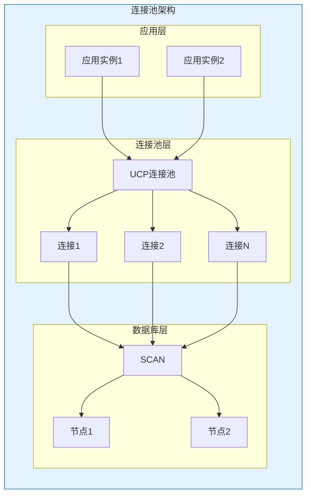
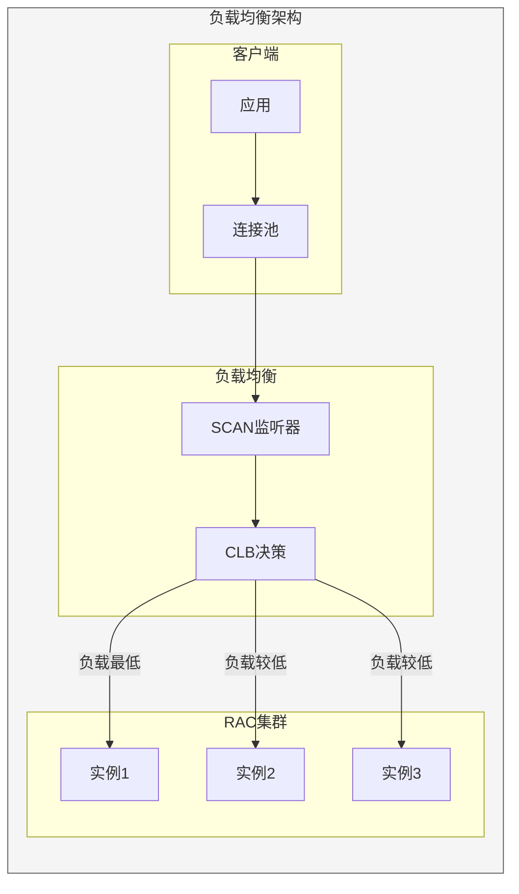

# Oracle连接池与负载均衡

## 一、概述

### 1.1 一句话定义

Oracle连接池是管理数据库连接的中间件，结合负载均衡技术实现连接复用和请求分发。
它在应用架构中出现和使用，解决连接管理和性能扩展的问题。

### 1.2 为什么重要

- **不掌握的后果：** 连接泄漏导致系统崩溃，无法扩展性能
- **掌握的价值：** 提高系统性能和可靠性

### 1.3 适用场景

| 场景 | 说明 |
|------|------|
| 连接管理 | 复用数据库连接 |
| 负载均衡 | 分发请求到多节点 |
| 故障切换 | 自动切换到备节点 |
| 性能扩展 | 水平扩展能力 |

### 1.4 版本演进

| 版本 | 变化说明 |
|------|---------|
| 11gR2 | UCP引入 |
| 12cR1 | FCF增强 |
| 12cR2 | 运行时负载均衡 |
| 19c | 自动负载均衡 |
| 21c | 云负载均衡 |

## 二、术语与概念

### 2.1 核心术语表

| 术语 | 含义 | 类比 |
|------|------|------|
| Connection Pool | 连接池 | 连接仓库 |
| UCP | Universal Connection Pool | Oracle连接池 |
| SCAN | Single Client Access Name | 统一接入名 |
| FCF | Fast Connection Failover | 快速故障切换 |
| TAF | Transparent Application Failover | 透明应用切换 |
| CLB | Connection Load Balancing | 连接负载均衡 |
| RLB | Runtime Load Balancing | 运行时负载均衡 |

### 2.2 连接池架构



## 三、核心原理

### 3.1 UCP连接池配置

```java
// UCP连接池配置
import oracle.ucp.jdbc.PoolDataSourceFactory;
import oracle.ucp.jdbc.PoolDataSource;

PoolDataSource pds = PoolDataSourceFactory.getPoolDataSource();
pds.setConnectionFactoryClassName("oracle.jdbc.pool.OracleDataSource");
pds.setURL("jdbc:oracle:thin:@//scan-host:1521/orcl");
pds.setUser("app_user");
pds.setPassword("password");

// 连接池参数
pds.setInitialPoolSize(10);      // 初始连接数
pds.setMinPoolSize(10);          // 最小连接数
pds.setMaxPoolSize(100);         // 最大连接数
pds.setConnectionWaitTimeout(10); // 等待超时（秒）

// FCF配置（快速故障切换）
pds.setFastConnectionFailoverEnabled(true);

// 连接验证
pds.setValidateConnectionOnBorrow(true);
pds.setAbandonedConnectionTimeout(300);  // 5分钟
```

### 3.2 连接池参数说明

| 参数 | 说明 | 建议值 |
|------|------|--------|
| initialPoolSize | 初始连接数 | 10-20 |
| minPoolSize | 最小连接数 | 10 |
| maxPoolSize | 最大连接数 | CPU*2+磁盘数 |
| connectionWaitTimeout | 等待超时 | 10秒 |
| abandonedConnectionTimeout | 废弃超时 | 300秒 |
| inactiveConnectionTimeout | 空闲超时 | 600秒 |

### 3.3 SCAN配置

```bash
# SCAN配置（3个IP地址）
# srvctl config scan
# SCAN Name: scan-cluster
# SCAN VIPs: 192.168.1.100, 192.168.1.101, 192.168.1.102

# tnsnames.ora配置
ORCL =
  (DESCRIPTION =
    (ADDRESS_LIST =
      (LOAD_BALANCE = ON)
      (FAILOVER = ON)
      (ADDRESS = (PROTOCOL = TCP)(HOST = scan-cluster)(PORT = 1521))
    )
    (CONNECT_DATA =
      (SERVICE_NAME = orcl)
    )
  )

# JDBC URL
# jdbc:oracle:thin:@//scan-cluster:1521/orcl
```

### 3.4 负载均衡方式

| 方式 | 说明 | 适用场景 |
|------|------|---------|
| CLB | 连接时负载均衡 | 新连接分发 |
| RLB | 运行时负载均衡 | 请求分发 |
| 服务级LB | 基于服务 | 多服务场景 |
| FCF | 故障切换 | 高可用 |

```sql
-- 创建负载均衡服务
-- srvctl add service -db orcl -service lb_service \
--   -preferred orcl1,orcl2 \
--   -clbgoal SHORT \
--   -rlbgoal NONE

-- 查看服务配置
-- srvctl config service -db orcl -service lb_service

-- 查看服务状态
-- srvctl status service -db orcl
```

### 3.5 FCF（Fast Connection Failover）

```java
// FCF配置
pds.setFastConnectionFailoverEnabled(true);

// FAN事件订阅
// UCP自动接收FAN事件
// 当节点故障时，自动移除故障节点的连接

// 连接池状态监控
System.out.println("Borrowed: " + pds.getBorrowedConnectionsCount());
System.out.println("Available: " + pds.getAvailableConnectionsCount());
System.out.println("Total: " + pds.getAvailableConnectionsCount() 
    + pds.getBorrowedConnectionsCount());
```

### 3.6 TAF（Transparent Application Failover）

```sql
-- TAF配置（tnsnames.ora）
ORCL_TAF =
  (DESCRIPTION =
    (ADDRESS_LIST =
      (ADDRESS = (PROTOCOL = TCP)(HOST = node1-vip)(PORT = 1521))
      (ADDRESS = (PROTOCOL = TCP)(HOST = node2-vip)(PORT = 1521))
    )
    (CONNECT_DATA =
      (SERVICE_NAME = orcl)
      (FAILOVER_MODE =
        (TYPE = SELECT)       -- SELECT/SESSION/NONE
        (METHOD = BASIC)      -- BASIC/PRECONNECT
        (RETRIES = 3)         -- 重试次数
        (DELAY = 5)           -- 重试延迟（秒）
      )
    )
  )

-- TYPE说明：
-- SELECT: 支持查询故障切换
-- SESSION: 支持会话故障切换
-- NONE: 不支持故障切换

-- METHOD说明：
-- BASIC: 故障时才连接备节点
-- PRECONNECT: 预先连接到所有节点
```

### 3.7 连接池监控

```java
// UCP监控API
// 连接池统计
int borrowed = pds.getBorrowedConnectionsCount();
int available = pds.getAvailableConnectionsCount();
int total = borrowed + available;

// 连接池配置
int maxSize = pds.getMaxPoolSize();
int minSize = pds.getMinPoolSize();

// 连接池状态
System.out.println("Pool Status:");
System.out.println("  Borrowed: " + borrowed);
System.out.println("  Available: " + available);
System.out.println("  Total: " + total);
System.out.println("  Max: " + maxSize);
```

```sql
-- 数据库端监控连接
SELECT inst_id, username, machine, program,
       COUNT(*) AS sessions
FROM gv$session
WHERE username IS NOT NULL
GROUP BY inst_id, username, machine, program
ORDER BY sessions DESC;

-- 查看服务连接分布
SELECT name, network_name, goal, clb_goal, rlb_goal
FROM gv$active_services;
```

## 四、架构与组件

### 4.1 负载均衡架构



## 五、配置与调优

### 5.1 连接池大小计算

```
推荐公式：
连接池大小 = (核心数 * 2) + 有效磁盘数

示例：
- 8核CPU，4块磁盘
- 连接池 = (8 * 2) + 4 = 20

考虑因素：
- OLTP：连接数较少，事务短
- OLAP：连接数较多，事务长
- 混合：取中间值
```

### 5.2 性能优化

| 策略 | 说明 | 效果 |
|------|------|------|
| 合理池大小 | 避免过大过小 | 减少资源浪费 |
| 连接验证 | 检查连接有效 | 避免无效连接 |
| 超时配置 | 防止连接泄漏 | 提高可靠性 |
| 监控告警 | 及时发现问题 | 快速响应 |

## 六、监控与诊断

### 6.1 常见问题诊断

| 问题 | 症状 | 排查方法 |
|------|------|---------|
| 连接泄漏 | 连接数持续增长 | 检查超时配置 |
| 连接不足 | 等待超时 | 增大池大小 |
| 负载不均 | 节点负载差异大 | 检查CLB配置 |
| 切换失败 | 故障时无法切换 | 检查FCF配置 |

```sql
-- 诊断连接问题
SELECT username, machine, program,
       COUNT(*) AS sessions,
       SUM(CASE WHEN status = 'ACTIVE' THEN 1 ELSE 0 END) AS active,
       SUM(CASE WHEN status = 'INACTIVE' THEN 1 ELSE 0 END) AS inactive
FROM v$session
WHERE username IS NOT NULL
GROUP BY username, machine, program
ORDER BY sessions DESC;
```

## 七、实战案例

### 7.1 案例背景

- **场景**：电商系统连接池优化
- **时间**：2026年
- **问题**：高峰期连接等待超时

### 7.2 诊断过程

```sql
-- 1. 查看连接分布
SELECT inst_id, COUNT(*) AS sessions
FROM gv$session
WHERE username = 'APP_USER'
GROUP BY inst_id;

-- 结果：节点1有80个连接，节点2只有20个
-- 问题：负载不均衡
```

### 7.3 优化方案

```java
// 1. 调整连接池大小
pds.setMaxPoolSize(150);  // 从100增加到150

// 2. 启用FCF
pds.setFastConnectionFailoverEnabled(true);

// 3. 配置连接验证
pds.setValidateConnectionOnBorrow(true);
```

```sql
-- 4. 优化服务配置
-- srvctl modify service -db orcl -service app_service -clbgoal SHORT
```

### 7.4 优化结果

| 指标 | 优化前 | 优化后 |
|------|--------|--------|
| 等待超时 | 100次/小时 | 0次/小时 |
| 负载分布 | 80:20 | 50:50 |
| 响应时间 | 500ms | 100ms |

### 7.5 复盘总结

- **根因：** 连接池配置不合理
- **教训：** 监控连接池状态
- **改进：** 建立连接池监控

## 八、常见错误与排查

### 8.1 常见错误

| 错误 | 问题 | 解决方法 |
|------|------|---------|
| ORA-12519 | 监听无法处理 | 增大连接池 |
| ORA-12520 | 无法找到可用进程 | 检查进程数 |
| UCP-45001 | 连接泄漏 | 检查超时配置 |
| TNS-12541 | 无监听 | 检查SCAN |

## 九、最佳实践

### 9.1 官方推荐

- 使用UCP连接池
- 启用FCF故障切换
- 配置SCAN接入
- 监控连接池状态

### 9.2 反模式

| 反模式 | 问题 | 正确做法 |
|--------|------|---------|
| 不配置连接池 | 连接泄漏 | 使用UCP |
| 池大小不合理 | 性能问题 | 合理计算 |
| 不启用FCF | 切换慢 | 启用FCF |
| 不监控 | 问题发现晚 | 建立监控 |

## 十、命令与视图汇总

### 10.1 命令列表

| 命令 | 适用场景 | 说明 |
|------|---------|------|
| `srvctl add service` | 创建服务 | 负载均衡 |
| `srvctl config scan` | 查看SCAN | 网络配置 |
| `PoolDataSource.setURL` | 配置连接 | JDBC |

### 10.2 视图列表

| 视图名 | 类型 | 用途 |
|--------|------|------|
| GV$SESSION | 动态 | 会话信息 |
| GV$ACTIVE_SERVICES | 动态 | 服务状态 |
| V$SERVICE_STATS | 动态 | 服务统计 |

## 十一、总结速查

### 11.1 黄金法则

1. **UCP连接池** - Oracle推荐
2. **FCF** - 快速故障切换
3. **SCAN** - 统一接入
4. **监控** - 定期检查

### 11.2 一页纸检查清单

| 检查项 | 说明 |
|--------|------|
| 连接池大小 | 合理配置 |
| FCF启用 | 故障切换 |
| SCAN配置 | 统一接入 |
| 监控告警 | 配置完善 |

## 附录

### A. 官方参考

- [Oracle Database JDBC Developer's Guide](https://docs.oracle.com/en/database/oracle/oracle-database/19c/jjdbc/)
- [Oracle Universal Connection Pool Developer's Guide](https://docs.oracle.com/en/database/oracle/oracle-database/19c/jjucp/)

### B. 修订记录

| 日期 | 版本 | 修改内容 | 修改人 |
|------|------|---------|--------|
| 2026-07-02 | v1.0 | 初始版本 | YashanDB知识库生成器 |
