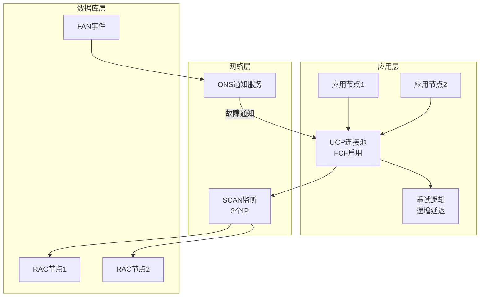
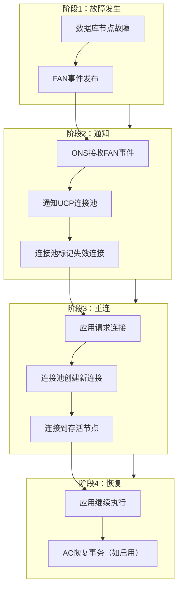
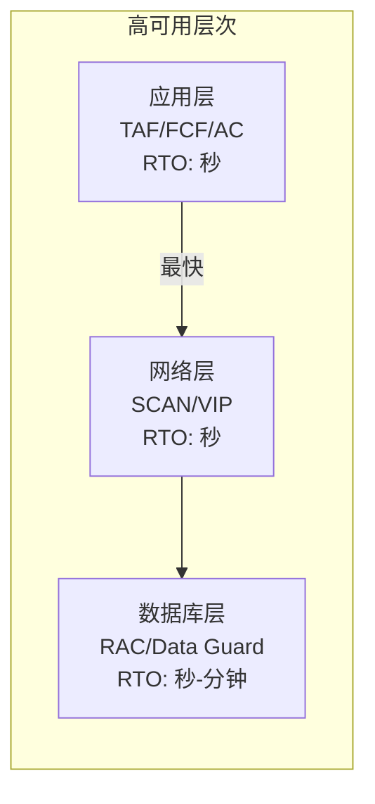
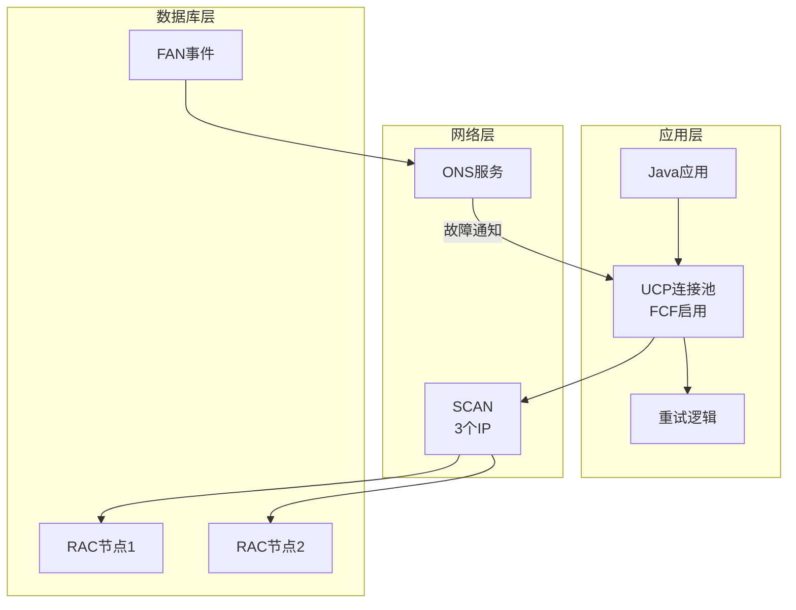

# Oracle应用层高可用设计

## 一、概述

### 1.1 一句话定义

Oracle应用层高可用设计是在应用层实现数据库故障自动检测、连接重试和服务切换的技术方案，通过TAF、FCF、连接池和重试机制，使应用在数据库故障时能够自动恢复而无需人工干预。
它在应用架构设计中出现和使用，解决数据库故障对应用可用性的影响，实现端到端的高可用。

### 1.2 为什么重要

- **不掌握的后果：** 数据库故障时应用完全不可用，需要人工重启或修改配置，RTO从秒级退化到分钟级甚至小时级
- **掌握的价值：** 实现数据库故障对应用透明，RTO控制在秒级，用户体验无感知

### 1.3 适用场景

| 场景 | 说明 |
|------|------|
| RAC故障切换 | 节点故障时应用自动重连到存活节点 |
| Data Guard切换 | 主库故障时应用自动连接到新主库 |
| 计划维护 | 滚动升级时应用无感知 |
| 网络闪断 | 短暂网络故障自动恢复 |
| 连接池管理 | 高效管理数据库连接生命周期 |

### 1.4 版本演进

| 版本 | 变化说明 |
|------|---------|
| 11gR2 | TAF成熟，SCAN引入简化配置 |
| 12cR1 | UCP连接池增强，FCF改进 |
| 12cR2 | Application Continuity（AC）引入 |
| 19c | AC增强，透明应用故障切换 |
| 21c | 云原生应用高可用模式 |

## 二、术语与概念

### 2.1 核心术语表

| 术语 | 含义 | 类比 |
|------|------|------|
| TAF | Transparent Application Failover，透明应用故障切换 | 电话转接 |
| FCF | Fast Connection Failover，快速连接故障切换 | 连接池自动重连 |
| AC | Application Continuity，应用连续性 | 通话不中断 |
| UCP | Universal Connection Pool，通用连接池 | 电话总机 |
| FAN | Fast Application Notification，快速应用通知 | 故障广播 |
| ONS | Oracle Notification Service，通知服务 | 广播系统 |
| 重试策略 | 失败后自动重试的机制 | 打不通再打 |
| 超时配置 | 等待响应的最大时间 | 等待铃响的时间 |

### 2.2 应用层高可用架构



## 三、架构与原理

### 3.1 故障切换流程



### 3.2 工作原理

1. **故障检测：** 数据库集群检测到节点故障，发布FAN事件
2. **事件传播：** ONS服务将FAN事件推送给所有订阅的应用
3. **连接清理：** UCP连接池收到DOWN事件，标记并清除失效连接
4. **新连接创建：** 应用请求连接时，连接池创建到存活节点的新连接
5. **应用恢复：** 应用使用新连接继续执行，用户无感知
6. **AC恢复：** 如果启用Application Continuity，自动重放事务

**一句话总结：** 应用层高可用的核心是"故障通知+自动重连"——通过FAN事件快速感知故障，通过连接池自动重建连接到存活节点。

### 3.3 高可用层次对比



## 四、功能详解

### 4.1 TAF配置

#### 功能说明

TAF允许客户端连接在数据库故障时自动迁移到备用节点。

#### 操作步骤

```text
# tnsnames.ora配置TAF
ORCL =
  (DESCRIPTION =
    (ADDRESS_LIST =
      (ADDRESS = (PROTOCOL = TCP)(HOST = scan-orcl)(PORT = 1521))
    )
    (CONNECT_DATA =
      (SERVICE_NAME = orcl)
      (FAILOVER_MODE =
        (TYPE = SELECT)       -- SESSION或SELECT
        (METHOD = PRECONNECT) -- BASIC或PRECONNECT
        (RETRIES = 3)
        (DELAY = 5)
      )
    )
  )

# TYPE参数说明
# SESSION: 仅切换连接，正在执行的查询需重发
# SELECT: 切换连接并恢复正在执行的SELECT查询
# NONE: 不启用故障切换

# METHOD参数说明
# BASIC: 故障时才建立到备节点的连接（延迟较高）
# PRECONNECT: 预先建立到所有节点的连接（切换更快）
```

### 4.2 FCF配置

```java
// Java应用使用UCP连接池+FCF
import oracle.ucp.jdbc.PoolDataSource;
import oracle.ucp.jdbc.PoolDataSourceFactory;

PoolDataSource pds = PoolDataSourceFactory.getPoolDataSource();
pds.setConnectionFactoryClassName("oracle.jdbc.pool.OracleDataSource");
pds.setURL("jdbc:oracle:thin:@scan-orcl:1521/orcl");
pds.setUser("app_user");
pds.setPassword("password");

// 启用FCF
pds.setFastConnectionFailoverEnabled(true);

// 配置连接池参数
pds.setInitialPoolSize(10);
pds.setMinPoolSize(10);
pds.setMaxPoolSize(100);
pds.setConnectionWaitTimeout(10);  // 获取连接超时10秒

// 配置ONS订阅（接收FAN事件）
pds.setFastConnectionFailoverEnabled(true);
// ONS配置在ons.config文件中
// nodes=scan-orcl:6200
```

### 4.3 Application Continuity（AC）

```sql
-- AC需要数据库端配置
-- 创建AC服务
-- srvctl add service -db orcl -service ac_service \
--   -preferred orcl1,orcl2 \
--   -failovertype AUTO \
--   -failovermethod BASIC \
--   -failoverretry 30 \
--   -failoverdelay 3 \
--   -commit_outcome TRUE \
--   -notification TRUE

-- 启用AC
-- srvctl modify service -db orcl -service ac_service -drain_timeout 300
```

```java
// Java应用使用AC
// 连接到AC服务
pds.setURL("jdbc:oracle:thin:@scan-orcl:1521/ac_service");

// AC自动重放事务
// 故障发生时，AC自动重连并重放未提交的事务
// 应用代码无需修改
```

### 4.4 重试策略实现

```java
// 通用重试工具
public class RetryHelper {
    public static <T> T executeWithRetry(
            Callable<T> operation,
            int maxRetries,
            long initialDelayMs) throws Exception {
        
        int attempt = 0;
        while (true) {
            try {
                return operation.call();
            } catch (SQLException e) {
                if (isRetryable(e) && attempt < maxRetries) {
                    attempt++;
                    long delay = initialDelayMs * (long)Math.pow(2, attempt - 1);
                    Thread.sleep(delay);  // 指数退避
                } else {
                    throw e;
                }
            }
        }
    }

    // 可重试的Oracle错误
    private static boolean isRetryable(SQLException e) {
        int code = e.getErrorCode();
        return code == 3113   // ORA-03113: end-of-file on communication
            || code == 3114   // ORA-03114: not connected
            || code == 12541  // ORA-12541: no listener
            || code == 12543  // ORA-12543: TNS:destination host unreachable
            || code == 17002  // ORA-17002: I/O exception
            || code == 17008; // ORA-17008: closed connection
    }
}

// 使用示例
Connection conn = RetryHelper.executeWithRetry(
    () -> pds.getConnection(),
    3,      // 最多重试3次
    1000    // 初始延迟1秒
);
```

### 4.5 超时配置

```java
// 连接超时
pds.setConnectionWaitTimeout(10);  // 从连接池获取连接超时10秒

// 查询超时
Statement stmt = conn.createStatement();
stmt.setQueryTimeout(30);  // SQL执行超时30秒

// 网络读超时（JDBC）
OracleConnection oconn = (OracleConnection) conn;
oconn.setReadTimeout(30000);  // 网络读超时30秒

// 网络连接超时
OracleDataSource ods = new OracleDataSource();
ods.setConnectionTimeout(10000);  // TCP连接超时10秒
```

## 五、性能与调优

### 5.1 性能基线

| 指标 | 正常范围 | 告警阈值 | 说明 |
|------|---------|---------|------|
| 故障切换时间 | < 5秒 | > 30秒 | 从故障到恢复 |
| 连接获取时间 | < 100ms | > 1秒 | 从连接池获取连接 |
| 重试成功率 | > 95% | < 80% | 重试后成功比例 |
| 连接池使用率 | 30-80% | > 90% | 连接池利用率 |

### 5.2 调优建议

| 场景 | 建议 | 原因 |
|------|------|------|
| 切换慢 | 使用PRECONNECT或AC | 预建立连接更快 |
| 重试风暴 | 使用指数退避 | 避免雪崩 |
| 连接池满 | 增大maxPoolSize | 应对故障时重连 |
| 超时太短 | 根据业务调整 | 避免误判 |

## 六、DFX能力

### 6.1 监控指标

| 指标名 | 采集方式 | 说明 |
|--------|---------|------|
| 连接池大小 | UCP API | 当前/最大连接数 |
| 故障切换次数 | 应用日志 | FCF触发次数 |
| 重试次数 | 应用日志 | 重试逻辑触发 |
| 连接等待时间 | UCP统计 | 获取连接平均耗时 |

### 6.2 日志与告警

- **应用日志：** 记录故障切换和重试事件
- **UCP日志：** 连接池状态变化
- **告警配置：** 故障切换次数超阈值告警

```java
// UCP连接池监控
System.out.println("Pool size: " + pds.getMaxPoolSize());
System.out.println("Active connections: " + pds.getBorrowedConnectionsCount());
System.out.println("Available connections: " + pds.getRemainingPoolCapacity());
```

## 七、实战案例

### 7.1 案例背景

- **场景**：某电商系统Oracle 19c RAC（2节点），Java应用使用UCP连接池
- **时间**：周末维护窗口
- **现象**：计划滚动升级一个节点，需要验证应用无感知

### 7.2 诊断过程

**步骤1：确认FCF配置**

```java
// 检查连接池配置
System.out.println("FCF enabled: " + pds.getFastConnectionFailoverEnabled());
// FCF enabled: true
```
- → 发现：FCF已启用
- → 判断：应该能自动处理节点故障

**步骤2：确认ONS配置**

```bash
# 检查ONS配置
cat $ORACLE_HOME/opmn/conf/ons.config
# nodes=scan-orcl:6200
```
- → 发现：ONS配置正确
- → 判断：能接收FAN事件

**步骤3：执行节点停止测试**

```bash
# 停止节点1
$ srvctl stop instance -db orcl -instance orcl1

# 观察应用日志
$ tail -f /app/logs/application.log
# [INFO] FCF: Connection to node1 invalidated
# [INFO] FCF: New connection established to node2
# [INFO] Application resumed normally
```
- → 发现：应用在2秒内自动重连到节点2
- → 判断：FCF工作正常

**步骤4：验证事务完整性**

```sql
-- 检查是否有未完成事务
SELECT s.sid, s.status, t.status AS txn_status
FROM v$session s
LEFT JOIN v$transaction t ON s.saddr = t.ses_addr
WHERE s.username = 'APP_USER';
```
- → 发现：无悬挂事务
- → 判断：故障切换过程中事务处理正确

### 7.3 解决结果

| 指标 | 目标 | 实际 |
|------|------|------|
| 应用中断时间 | < 5秒 | 2秒 |
| 用户感知 | 无 | 无 |
| 数据一致性 | 100% | 100% |
| 事务丢失 | 0 | 0 |

### 7.4 复盘总结

- **根因：** FCF+ONS配置正确，故障切换自动完成
- **教训：** 部署前必须测试故障切换，确认FCF和ONS配置正确

## 八、常见错误与排查

### 8.1 常见错误列表

| 错误代码 | 错误信息 | 原因 | 解决方法 |
|---------|---------|------|---------|
| ORA-12541 | no listener | 监听不可用 | 检查SCAN/VIP |
| ORA-03113 | end-of-file | 连接断开 | 启用重试 |
| ORA-17008 | closed connection | 连接被关闭 | FCF自动处理 |
| UCP-xxxxx | 连接池错误 | 池配置问题 | 检查UCP参数 |

### 8.2 排查步骤

1. **检查FCF状态：** 确认`setFastConnectionFailoverEnabled(true)`
2. **检查ONS连接：** `onsctl ping`
3. **查看应用日志：** 故障切换事件
4. **检查网络：** SCAN/VIP可达性
5. **验证重试逻辑：** 可重试错误列表

## 九、最佳实践

### 9.1 官方推荐

- 使用UCP连接池并启用FCF
- 配置Application Continuity实现事务级故障切换
- 使用SCAN连接而非直连节点
- 实现指数退避重试策略

### 9.2 社区经验

- 连接池大小设置为正常负载的1.5倍（预留故障时重连）
- 超时设置根据业务SLA调整，不要太短
- 测试时模拟各种故障场景（节点停止、网络闪断、监听重启）
- 应用日志记录所有故障切换事件

### 9.3 反模式

| 反模式 | 问题 | 正确做法 |
|--------|------|---------|
| 不使用连接池 | 每次创建新连接慢 | 使用UCP连接池 |
| 不启用FCF | 故障时无法自动切换 | setFastConnectionFailoverEnabled(true) |
| 无限重试 | 雪崩效应 | 使用指数退避+最大次数 |
| 超时太短 | 正常操作被误判失败 | 根据业务SLA设置 |
| 不测试故障切换 | 真正故障时才发现问题 | 定期演练 |

## 十、命令与视图汇总

### 10.1 命令列表

| 命令 | 适用场景 | 说明 |
|------|---------|------|
| `srvctl add service -failovertype` | 配置故障切换 | 服务级配置 |
| `onsctl ping` | 检查ONS | ONS连通性 |
| `srvctl status service` | 查看服务 | 服务运行状态 |
| `crsctl stat res -t` | 查看集群 | 集群资源状态 |

### 10.2 视图列表

| 视图名 | 类型 | 用途 | 关键字段 |
|--------|------|------|---------|
| DBA_SERVICES | 数据字典 | 服务配置 | NAME, FAILOVER_METHOD |
| GV$SESSION | 动态 | 会话信息 | INST_ID, STATUS |
| V$SERVICE_EVENT | 动态 | 服务事件 | NAME, EVENT |

## 十一、总结速查

### 11.1 黄金法则

1. **UCP+FCF** - 连接池+快速故障切换
2. **SCAN连接** - 统一入口，透明切换
3. **指数退避** - 重试策略避免雪崩
4. **AC事务保护** - 关键业务启用Application Continuity
5. **定期演练** - 测试各种故障场景

### 11.2 一页纸检查清单

| 现象/场景 | 原因 | 处理方案 |
|-----------|------|----------|
| 故障切换慢 | 未使用PRECONNECT/AC | 配置PRECONNECT或AC |
| 重试风暴 | 无退避策略 | 使用指数退避 |
| 连接池满 | 故障时重连激增 | 增大maxPoolSize |
| 事务丢失 | 未启用AC | 配置Application Continuity |
| FCF不生效 | ONS未配置 | 检查ONS配置 |

### 11.3 关键数字

| 指标 | 正常范围 | 告警阈值 | 说明 |
|------|---------|---------|------|
| 故障切换时间 | < 5秒 | > 30秒 | 从故障到恢复 |
| 重试成功率 | > 95% | < 80% | 重试后成功比例 |
| 连接池使用率 | 30-80% | > 90% | 连接池利用率 |

## 附录

### A. 拓扑示例



### B. 官方参考

- [Oracle Database High Availability Overview](https://docs.oracle.com/en/database/oracle/oracle-database/19c/haovw/)
- [Oracle Universal Connection Pool Developer's Guide](https://docs.oracle.com/en/database/oracle/oracle-database/19c/jjucp/)
- MOS Note: 1272737.1 - "Application Continuity Best Practices"

### C. 修订记录

| 日期 | 版本 | 修改内容 | 修改人 |
|------|------|---------|--------|
| 2026-07-02 | v1.0 | 初始版本 | YashanDB知识库生成器 |
| 2026-07-02 | v1.1 | 补充完整模板章节 | YashanDB知识库生成器 |
