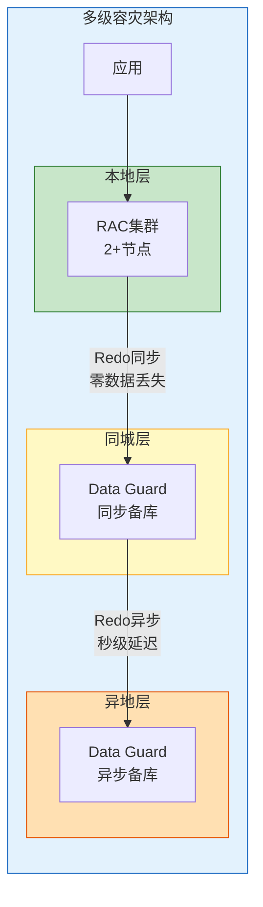
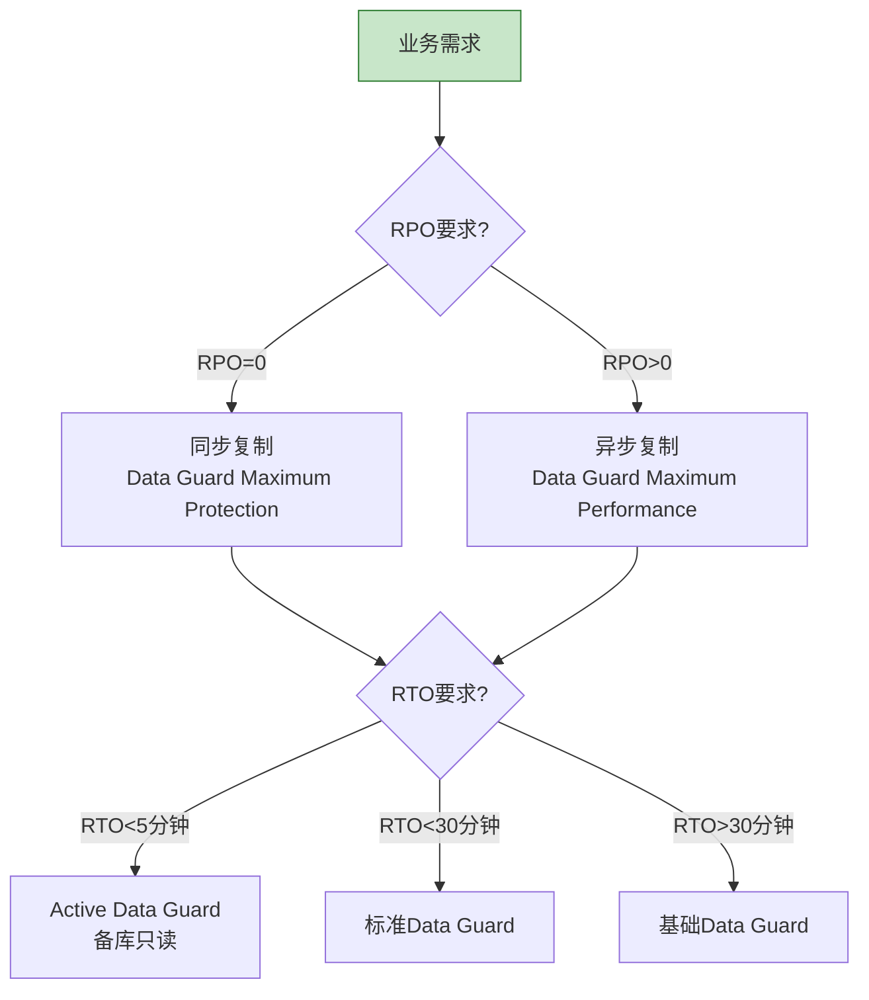
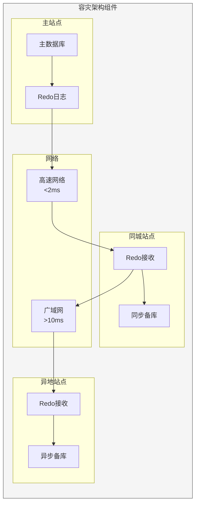
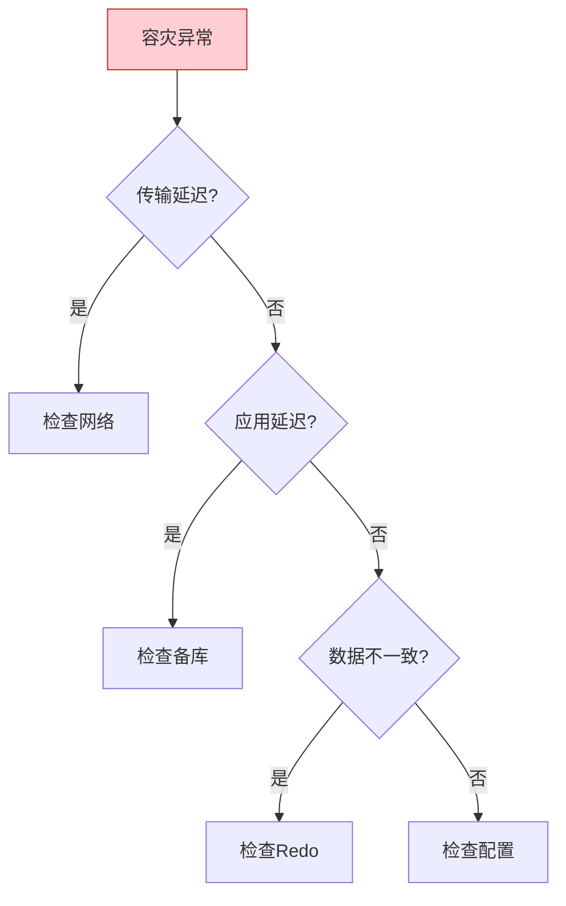

# Oracle容灾架构设计

## 一、概述

### 1.1 一句话定义

Oracle容灾架构设计是根据业务需求规划数据保护级别、容灾站点和切换方案的过程。
它在架构设计中出现和使用，解决灾难场景下的数据保护和业务连续性问题。

### 1.2 为什么重要

- **不掌握的后果：** 无法满足业务连续性要求，灾难时损失巨大
- **掌握的价值：** 保障业务连续性，满足合规要求

### 1.3 适用场景

| 场景 | 说明 |
|------|------|
| 金融系统 | 零数据丢失要求 |
| 核心业务 | 分钟级恢复要求 |
| 一般系统 | 小时级恢复可接受 |
| 测试系统 | 天级恢复可接受 |

### 1.4 版本演进

| 版本 | 变化说明 |
|------|---------|
| 11gR2 | Data Guard增强 |
| 12cR1 | Active Data Guard |
| 12cR2 | 多租户容灾 |
| 19c | 自动容灾切换 |
| 21c | 云容灾集成 |

## 二、术语与概念

### 2.1 核心术语表

| 术语 | 含义 | 类比 |
|------|------|------|
| RPO | 恢复点目标 | 可接受数据丢失 |
| RTO | 恢复时间目标 | 可接受停机时间 |
| DR | 灾难恢复 | 灾后恢复 |
| BC | 业务连续 | 业务不停 |
| Switchover | 计划切换 | 维护切换 |
| Failover | 故障切换 | 紧急切换 |

### 2.2 容灾等级

| 等级 | 说明 | RPO | RTO | 成本 |
|------|------|-----|-----|------|
| 本地高可用 | RAC | 0 | 分钟级 | 低 |
| 同城容灾 | Data Guard同步 | 0 | 分钟级 | 中 |
| 异地容灾 | Data Guard异步 | 秒-分钟 | 小时级 | 中 |
| 多级容灾 | 组合方案 | 0 | 分钟级 | 高 |

### 2.3 容灾架构



## 三、核心原理

### 3.1 RPO/RTO设计

```sql
-- RPO（Recovery Point Objective）
-- 可接受的数据丢失量
-- 0：零数据丢失（同步复制）
-- >0：允许数据丢失（异步复制）

-- RTO（Recovery Time Objective）
-- 可接受的停机时间
-- 分钟级：快速切换
-- 小时级：标准切换
-- 天级：慢速切换

-- 业务需求分析
-- 核心系统：RPO=0, RTO<5分钟
-- 重要系统：RPO<1分钟, RTO<30分钟
-- 一般系统：RPO<1小时, RTO<4小时
-- 测试系统：RPO<24小时, RTO<24小时
```

### 3.2 容灾架构选型



### 3.3 同城容灾设计

```sql
-- 同城容灾架构
-- 距离：<100km
-- 延迟：<2ms
-- 带宽：>1Gbps

-- Data Guard配置（同步模式）
ALTER SYSTEM SET log_archive_dest_2 = 
    'SERVICE=standby_db SYNC AFFIRM VALID_FOR=(ONLINE_LOGFILES,PRIMARY_ROLE) DB_UNIQUE_NAME=standby';

-- 保护模式
ALTER DATABASE SET STANDBY DATABASE MAXIMUM PROTECTION;

-- 验证配置
SELECT dest_id, status, protection_mode, protection_level
FROM v$archive_dest
WHERE dest_id = 2;
```

### 3.4 异地容灾设计

```sql
-- 异地容灾架构
-- 距离：>100km
-- 延迟：>10ms
-- 带宽：>100Mbps

-- Data Guard配置（异步模式）
ALTER SYSTEM SET log_archive_dest_2 = 
    'SERVICE=standby_db ASYNC VALID_FOR=(ONLINE_LOGFILES,PRIMARY_ROLE) DB_UNIQUE_NAME=standby';

-- 保护模式
ALTER DATABASE SET STANDBY DATABASE MAXIMUM PERFORMANCE;

-- 配置网络优化
ALTER SYSTEM SET redo_transport_user = 'sys';
ALTER SYSTEM SET log_archive_dest_state_2 = ENABLE;
```

### 3.5 多级容灾设计

```sql
-- 多级容灾架构
-- 本地RAC + 同城同步 + 异地异步

-- 1. 本地RAC配置
-- srvctl add service -db orcl -service app_svc -preferred orcl1,orcl2

-- 2. 同城Data Guard配置
ALTER SYSTEM SET log_archive_dest_2 = 
    'SERVICE=metro_standby SYNC AFFIRM';

-- 3. 异地Data Guard配置
ALTER SYSTEM SET log_archive_dest_3 = 
    'SERVICE=remote_standby ASYNC';

-- 查看多级配置
SELECT dest_id, target, protection_mode
FROM v$archive_dest
WHERE status = 'VALID';
```

### 3.6 切换方案设计

| 场景 | 切换类型 | 步骤 | 时间 |
|------|---------|------|------|
| 计划维护 | Switchover | 标准流程 | 分钟级 |
| 主库故障 | Failover | 紧急流程 | 分钟级 |
| 站点故障 | Failover | 紧急流程 | 分钟级 |
| 网络中断 | 等待恢复 | 监控等待 | 不确定 |

```sql
-- Switchover流程
-- 1. 主库切换到备库
ALTER DATABASE COMMIT TO SWITCHOVER TO STANDBY;

-- 2. 备库切换到主库
ALTER DATABASE COMMIT TO SWITCHOVER TO PRIMARY;
ALTER DATABASE OPEN;

-- Failover流程
-- 1. 备库完成Redo应用
ALTER DATABASE RECOVER MANAGED STANDBY DATABASE FINISH;

-- 2. 激活备库
ALTER DATABASE ACTIVATE STANDBY DATABASE;
ALTER DATABASE OPEN;
```

### 3.7 容灾演练计划

```sql
-- 演练类型
-- 1. 桌面演练：流程讨论（季度）
-- 2. 模拟演练：部分切换（半年）
-- 3. 完整演练：全量切换（年度）
-- 4. 突击演练：无预告切换（不定期）

-- 演练脚本
-- 1. 检查状态
SELECT database_role, protection_mode FROM v$database;

-- 2. 模拟故障
-- SHUTDOWN ABORT;

-- 3. 执行切换
-- 备库执行Failover

-- 4. 验证结果
SELECT database_role, open_mode FROM v$database;

-- 5. 记录时间
-- 6. 恢复环境
```

## 四、架构与组件

### 4.1 容灾架构组件



## 五、配置与调优

### 5.1 网络优化

| 参数 | 建议值 | 说明 |
|------|--------|------|
| 带宽 | >1Gbps | 同城 |
| 带宽 | >100Mbps | 异地 |
| 延迟 | <2ms | 同城 |
| 延迟 | <50ms | 异地 |
| SDU | 65535 | 增大传输单元 |

```sql
-- 网络优化配置
-- tnsnames.ora
STANDBY_DB =
  (DESCRIPTION =
    (SDU = 65535)
    (RECV_BUF_SIZE = 1048576)
    (SEND_BUF_SIZE = 1048576)
    (ADDRESS = (PROTOCOL = TCP)(HOST = standby_host)(PORT = 1521))
    (CONNECT_DATA = (SERVICE_NAME = standby_db))
  )
```

### 5.2 性能优化

| 策略 | 说明 | 效果 |
|------|------|------|
| 并行传输 | 多进程传输Redo | 提高吞吐 |
| 压缩传输 | 压缩Redo数据 | 减少带宽 |
| 异步提交 | 异步Redo确认 | 提高性能 |
| 批量传输 | 批量传输Redo | 减少开销 |

```sql
-- 启用压缩传输
ALTER SYSTEM SET log_archive_dest_2 = 
    'SERVICE=standby_db COMPRESSION=ENABLE';

-- 启用并行传输
ALTER SYSTEM SET log_archive_dest_2 = 
    'SERVICE=standby_db PARALLEL=4';
```

## 六、监控与诊断

### 6.1 容灾监控

```sql
-- 查看传输延迟
SELECT name, value, datum_time
FROM v$dataguard_stats
WHERE name IN ('transport lag', 'apply lag');

-- 查看Redo传输状态
SELECT dest_id, status, error
FROM v$archive_dest
WHERE dest_id IN (2, 3);

-- 查看归档日志应用状态
SELECT sequence#, applied, first_time
FROM v$archived_log
WHERE applied = 'NO'
ORDER BY first_time DESC;

-- 查看备库状态
SELECT database_role, protection_mode, open_mode
FROM v$database;
```

### 6.2 常见问题诊断

| 问题 | 症状 | 排查方法 |
|------|------|---------|
| 传输延迟 | transport lag增大 | 检查网络 |
| 应用延迟 | apply lag增大 | 检查备库资源 |
| 归档间隙 | 日志缺失 | 检查归档 |
| 数据不一致 | 数据差异 | 检查Redo |

## 七、实战案例

### 7.1 案例背景

- **场景**：银行核心系统容灾建设
- **时间**：2026年
- **需求**：RPO=0, RTO<5分钟

### 7.2 架构设计

```sql
-- 架构设计
-- 本地：2节点RAC
-- 同城：Data Guard同步备库（RPO=0）
-- 异地：Data Guard异步备库（RPO<30秒）

-- 网络规划
-- 本地-同城：10Gbps专线，延迟<1ms
-- 同城-异地：1Gbps专线，延迟<20ms
```

### 7.3 实施步骤

```sql
-- 1. 部署本地RAC
-- 2. 部署同城Data Guard
-- 3. 部署异地Data Guard
-- 4. 配置监控告警
-- 5. 执行容灾演练
```

### 7.4 运行效果

| 指标 | 值 |
|------|-----|
| RPO | 0（同城） |
| RTO | <3分钟 |
| 切换成功率 | 100% |
| 数据一致性 | 100% |

### 7.5 复盘总结

- **根因：** 业务连续性要求高
- **教训：** 网络质量是关键
- **改进：** 定期演练验证

## 八、常见错误与排查

### 8.1 常见错误

| 错误 | 问题 | 解决方法 |
|------|------|---------|
| ORA-16191 | Redo传输失败 | 检查网络 |
| ORA-16086 | 备库不可用 | 检查备库状态 |
| ORA-16009 | 远程密码文件问题 | 同步密码文件 |
| ORA-16810 | 多故障 | 检查配置 |

### 8.2 排查流程



## 九、最佳实践

### 9.1 官方推荐

- 明确RPO/RTO需求
- 选择合适的容灾架构
- 定期演练验证
- 建立完善的监控

### 9.2 社区经验

- 网络质量是关键
- 定期测试切换
- 文档化操作流程
- 建立应急预案

### 9.3 反模式

| 反模式 | 问题 | 正确做法 |
|--------|------|---------|
| 不明确RPO/RTO | 架构选型错误 | 明确需求 |
| 不演练 | 切换失败 | 定期演练 |
| 不监控 | 问题发现晚 | 建立监控 |
| 不文档化 | 操作失误 | 文档化流程 |

## 十、命令与视图汇总

### 10.1 命令列表

| 命令 | 适用场景 | 说明 |
|------|---------|------|
| `ALTER DATABASE COMMIT TO SWITCHOVER` | 计划切换 | Switchover |
| `ALTER DATABASE ACTIVATE STANDBY` | 故障切换 | Failover |
| `ALTER DATABASE RECOVER MANAGED` | Redo应用 | 应用日志 |

### 10.2 视图列表

| 视图名 | 类型 | 用途 |
|--------|------|------|
| V$DATAGUARD_STATS | 动态 | 容灾统计 |
| V$ARCHIVE_DEST | 动态 | 归档目标 |
| V$ARCHIVED_LOG | 动态 | 归档日志 |
| V$DATABASE | 动态 | 数据库状态 |

## 十一、总结速查

### 11.1 黄金法则

1. **明确需求** - RPO/RTO
2. **架构选型** - 匹配业务
3. **定期演练** - 验证方案
4. **完善监控** - 及时发现问题

### 11.2 一页纸检查清单

| 检查项 | 说明 |
|--------|------|
| RPO/RTO | 明确定义 |
| 架构设计 | 匹配需求 |
| 网络质量 | 满足要求 |
| 定期演练 | 验证方案 |
| 监控告警 | 配置完善 |

## 附录

### A. 官方参考

- [Oracle Database High Availability Overview](https://docs.oracle.com/en/database/oracle/oracle-database/19c/haovw/)
- [Oracle Data Guard Concepts and Administration](https://docs.oracle.com/en/database/oracle/oracle-database/19c/sbydb/)

### B. 修订记录

| 日期 | 版本 | 修改内容 | 修改人 |
|------|------|---------|--------|
| 2026-07-02 | v1.0 | 初始版本 | YashanDB知识库生成器 |
