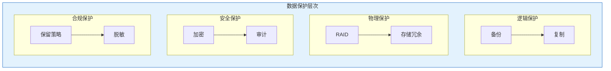
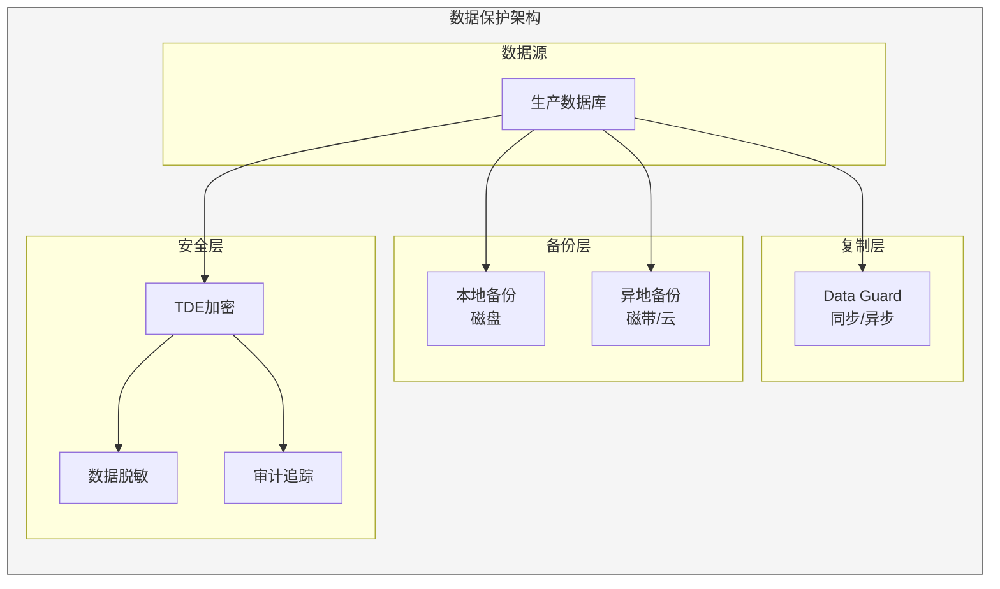

# Oracle数据保护策略

## 一、概述

### 1.1 一句话定义

Oracle数据保护策略是综合运用备份、复制、加密等技术保护数据免受丢失、损坏和未授权访问的方案。
它在数据管理中出现和使用，解决数据安全和合规的问题。

### 1.2 为什么重要

- **不掌握的后果：** 数据丢失无法恢复，安全合规不达标
- **掌握的价值：** 保障数据安全，满足合规要求

### 1.3 适用场景

| 场景 | 说明 |
|------|------|
| 数据备份 | 防止数据丢失 |
| 数据加密 | 保护敏感数据 |
| 合规审计 | 满足法规要求 |
| 数据保留 | 长期保存 |

### 1.4 版本演进

| 版本 | 变化说明 |
|------|---------|
| 11gR2 | TDE增强 |
| 12cR1 | 统一审计 |
| 12cR2 | 数据脱敏 |
| 19c | 自动加密 |
| 21c | 云加密集成 |

## 二、术语与概念

### 2.1 核心术语表

| 术语 | 含义 | 类比 |
|------|------|------|
| Backup | 备份 | 数据副本 |
| Encryption | 加密 | 数据锁 |
| TDE | 透明数据加密 | 自动加密 |
| Masking | 脱敏 | 数据遮挡 |
| Retention | 保留 | 保存期限 |
| Compliance | 合规 | 法规遵从 |

### 2.2 数据保护层次



## 三、核心原理

### 3.1 3-2-1备份原则

```
3份数据副本
├── 1份生产数据
├── 1份本地备份
└── 1份异地备份

2种存储介质
├── 磁盘
└── 磁带/云

1份异地备份
└── 异地容灾站点
```

### 3.2 备份策略设计

| 策略 | 说明 | RPO | 适用场景 |
|------|------|-----|---------|
| 全量备份 | 备份所有数据 | 24小时 | 基础备份 |
| 增量备份 | 备份变更数据 | 1小时 | 日常备份 |
| 差异备份 | 备份差异数据 | 4小时 | 折中方案 |
| 连续保护 | 实时保护 | 0 | 关键数据 |

```sql
-- RMAN备份策略配置
-- RMAN> CONFIGURE RETENTION POLICY TO RECOVERY WINDOW OF 30 DAYS;
-- RMAN> CONFIGURE CONTROLFILE AUTOBACKUP ON;
-- RMAN> CONFIGURE BACKUP OPTIMIZATION ON;

-- 每日增量备份
-- RMAN> BACKUP INCREMENTAL LEVEL 1 DATABASE;

-- 每周全量备份
-- RMAN> BACKUP INCREMENTAL LEVEL 0 DATABASE;

-- 每小时归档备份
-- RMAN> BACKUP ARCHIVELOG ALL DELETE INPUT;
```

### 3.3 透明数据加密（TDE）

```sql
-- 创建加密钱包
ADMINISTER KEY MANAGEMENT CREATE KEYSTORE '/u01/app/oracle/wallet' 
    IDENTIFIED BY "WalletPass123";

-- 打开钱包
ADMINISTER KEY MANAGEMENT SET KEYSTORE OPEN 
    IDENTIFIED BY "WalletPass123";

-- 创建主密钥
ADMINISTER KEY MANAGEMENT SET KEY 
    IDENTIFIED BY "WalletPass123" WITH BACKUP;

-- 创建加密表空间
CREATE TABLESPACE secure_data
    DATAFILE '/u02/oradata/secure_data01.dbf' SIZE 1G
    ENCRYPTION USING 'AES256'
    DEFAULT STORAGE(ENCRYPT);

-- 加密现有表
ALTER TABLE employees MOVE TABLESPACE secure_data;

-- 加密列
ALTER TABLE employees MODIFY (salary ENCRYPT USING 'AES256');

-- 查看加密状态
SELECT owner, table_name, tablespace_name 
FROM dba_tables 
WHERE tablespace_name = 'SECURE_DATA';
```

### 3.4 数据脱敏

```sql
-- 使用DBMS_REDACT进行数据脱敏
BEGIN
    DBMS_REDACT.ADD_POLICY(
        object_schema => 'HR',
        object_name => 'EMPLOYEES',
        policy_name => 'REDACT_SALARY',
        column_name => 'SALARY',
        function_type => DBMS_REDACT.RANDOM,
        expression => '1=1'
    );
END;
/

-- 查看脱敏策略
SELECT object_schema, object_name, policy_name, column_name
FROM dba_redaction_policies;

-- 脱敏函数类型
-- FULL: 完全脱敏
-- PARTIAL: 部分脱敏
-- RANDOM: 随机脱敏
-- REGEXP: 正则脱敏
```

### 3.5 数据保留策略

```sql
-- 备份保留
-- RMAN> CONFIGURE RETENTION POLICY TO RECOVERY WINDOW OF 30 DAYS;

-- 归档日志保留
-- RMAN> DELETE ARCHIVELOG ALL COMPLETED BEFORE 'SYSDATE-7';

-- 审计日志保留
-- 配置审计日志保留90天
ALTER SYSTEM SET audit_trail = DB;

-- 统一审计保留
BEGIN
    DBMS_AUDIT_MGMT.SET_LAST_ARCHIVE_TIMESTAMP(
        audit_trail_type => DBMS_AUDIT_MGMT.AUDIT_TRAIL_UNIFIED,
        last_archive_time => SYSTIMESTAMP - 90
    );
END;
/

-- 数据生命周期管理
-- 1. 热数据：在线存储，快速访问
-- 2. 温数据：近线存储，较慢访问
-- 3. 冷数据：离线存储，归档保存
-- 4. 过期数据：删除或永久归档
```

### 3.6 合规要求

| 法规 | 要求 | 实现方式 |
|------|------|---------|
| 等保2.0 | 数据加密 | TDE |
| GDPR | 数据保护 | 加密+脱敏 |
| SOX | 审计追踪 | 统一审计 |
| PCI-DSS | 支付安全 | 加密+监控 |

```sql
-- 等保合规配置
-- 1. 启用审计
ALTER SYSTEM SET audit_trail = DB;

-- 2. 配置审计策略
CREATE AUDIT POLICY compliance_policy
    PRIVILEGES CREATE USER, DROP USER, ALTER USER,
               GRANT, REVOKE,
               CREATE TABLE, DROP TABLE,
               ALTER SYSTEM
    ACTIONS LOGON, LOGOFF;

AUDIT POLICY compliance_policy;

-- 3. 启用加密
-- 4. 配置备份保留
```

## 四、架构与组件

### 4.1 数据保护架构



## 五、配置与调优

### 5.1 备份优化

| 策略 | 说明 | 效果 |
|------|------|------|
| 增量备份 | 只备份变更 | 减少备份量 |
| 压缩备份 | 压缩数据 | 减少空间 |
| 并行备份 | 多通道并行 | 提高速度 |
| 块变更跟踪 | 加速增量 | 减少扫描 |

```sql
-- 启用块变更跟踪
ALTER DATABASE ENABLE BLOCK CHANGE TRACKING
    USING FILE '/u02/oradata/bct.cht';

-- 配置压缩
-- RMAN> CONFIGURE DEVICE TYPE DISK BACKUP TYPE TO COMPRESSED BACKUPSET;

-- 配置并行
-- RMAN> CONFIGURE DEVICE TYPE DISK PARALLELISM 4;
```

### 5.2 加密性能

| 算法 | 强度 | 性能 | 推荐 |
|------|------|------|------|
| AES128 | 中 | 高 | 一般场景 |
| AES192 | 高 | 中 | 推荐 |
| AES256 | 最高 | 低 | 敏感数据 |

```sql
-- 选择加密算法
CREATE TABLESPACE secure_data
    ENCRYPTION USING 'AES192'  -- 推荐AES192
    DEFAULT STORAGE(ENCRYPT);
```

## 六、监控与诊断

### 6.1 数据保护监控

```sql
-- 查看备份状态
-- RMAN> LIST BACKUP SUMMARY;

-- 查看加密状态
SELECT owner, table_name, tablespace_name 
FROM dba_tables 
WHERE tablespace_name IN (
    SELECT tablespace_name FROM dba_tablespaces 
    WHERE encrypted = 'YES'
);

-- 查看脱敏策略
SELECT * FROM dba_redaction_policies;

-- 查看审计记录
SELECT COUNT(*) FROM unified_audit_trail
WHERE event_timestamp > SYSDATE - 1;
```

### 6.2 常见问题诊断

| 问题 | 症状 | 排查方法 |
|------|------|---------|
| 备份失败 | 错误日志 | 检查空间 |
| 加密失败 | 钱包问题 | 检查钱包 |
| 脱敏失效 | 数据泄露 | 检查策略 |
| 审计缺失 | 无记录 | 检查配置 |

## 七、实战案例

### 7.1 案例背景

- **场景**：金融机构数据保护建设
- **时间**：2026年
- **需求**：满足等保2.0三级要求

### 7.2 保护方案

```sql
-- 1. 备份策略
-- - 每日增量备份
-- - 每周全量备份
-- - 异地备份保留30天

-- 2. 加密策略
-- - TDE加密敏感数据
-- - 网络传输加密

-- 3. 脱敏策略
-- - 测试环境数据脱敏
-- - 报表数据脱敏

-- 4. 审计策略
-- - 全量审计
-- - 保留90天
```

### 7.3 实施效果

| 指标 | 值 |
|------|-----|
| 备份成功率 | 100% |
| 加密覆盖率 | 100% |
| 审计完整性 | 100% |
| 合规达标 | 是 |

### 7.4 复盘总结

- **根因：** 合规要求严格
- **教训：** 数据保护要全面
- **改进：** 定期审查策略

## 八、常见错误与排查

### 8.1 常见错误

| 错误 | 问题 | 解决方法 |
|------|------|---------|
| ORA-28365 | 钱包未打开 | 打开钱包 |
| ORA-28367 | 钱包不存在 | 创建钱包 |
| ORA-28374 | 加密失败 | 检查配置 |
| RMAN-03009 | 备份失败 | 检查空间 |

## 九、最佳实践

### 9.1 官方推荐

- 遵循3-2-1备份原则
- 敏感数据必须加密
- 定期验证备份可恢复
- 建立完整审计链

### 9.2 反模式

| 反模式 | 问题 | 正确做法 |
|--------|------|---------|
| 不备份 | 数据丢失 | 定期备份 |
| 不加密 | 数据泄露 | TDE加密 |
| 不审计 | 无法追踪 | 全量审计 |
| 不验证 | 备份无效 | 定期验证 |

## 十、命令与视图汇总

### 10.1 命令列表

| 命令 | 适用场景 | 说明 |
|------|---------|------|
| `ADMINISTER KEY MANAGEMENT` | 密钥管理 | TDE |
| `DBMS_REDACT.ADD_POLICY` | 数据脱敏 | 脱敏 |
| `CREATE AUDIT POLICY` | 审计策略 | 审计 |
| `BACKUP` | 备份 | RMAN |

### 10.2 视图列表

| 视图名 | 类型 | 用途 |
|--------|------|------|
| DBA_TABLESPACES | 静态 | 表空间加密 |
| DBA_REDACTION_POLICIES | 静态 | 脱敏策略 |
| UNIFIED_AUDIT_TRAIL | 动态 | 审计记录 |
| V$BACKUP_SET | 动态 | 备份信息 |

## 十一、总结速查

### 11.1 黄金法则

1. **3-2-1原则** - 多重保护
2. **TDE加密** - 敏感数据
3. **全量审计** - 合规要求
4. **定期验证** - 备份有效

### 11.2 一页纸检查清单

| 检查项 | 说明 |
|--------|------|
| 备份策略 | 3-2-1原则 |
| 加密配置 | TDE启用 |
| 脱敏策略 | 测试环境 |
| 审计配置 | 全量审计 |
| 保留策略 | 合规要求 |

## 附录

### A. 官方参考

- [Oracle Database Security Guide](https://docs.oracle.com/en/database/oracle/oracle-database/19c/dbseg/)
- [Oracle Database Backup and Recovery User's Guide](https://docs.oracle.com/en/database/oracle/oracle-database/19c/backup/)

### B. 修订记录

| 日期 | 版本 | 修改内容 | 修改人 |
|------|------|---------|--------|
| 2026-07-02 | v1.0 | 初始版本 | YashanDB知识库生成器 |
