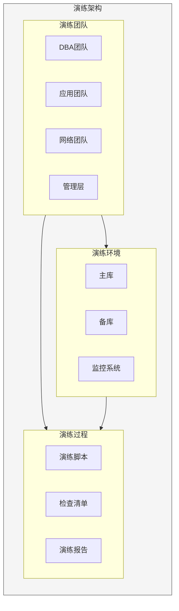
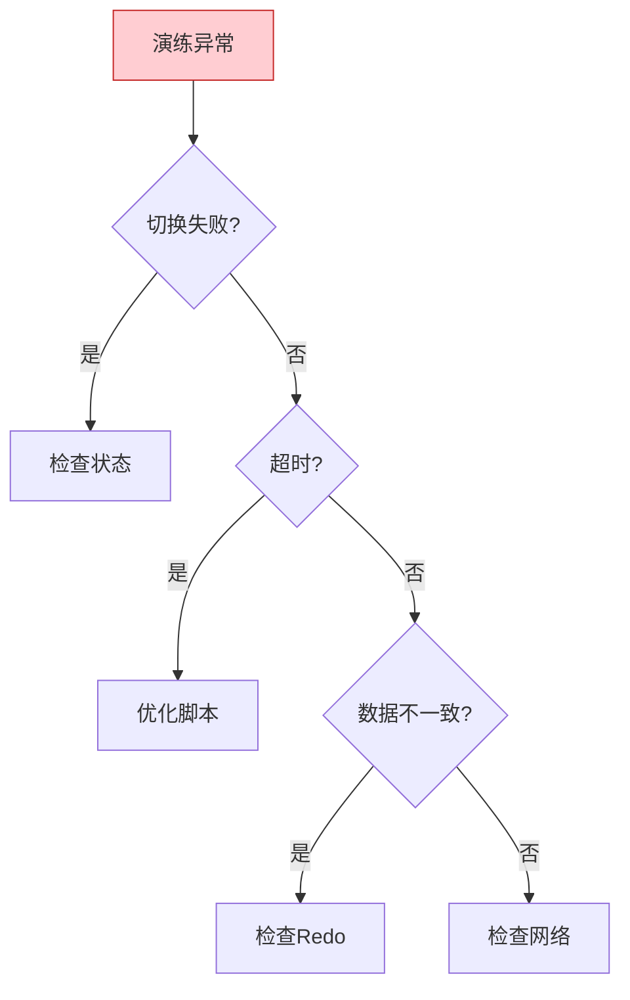

# Oracle容灾演练与切换

## 一、概述

### 1.1 一句话定义

Oracle容灾演练是定期模拟故障场景并验证切换和恢复流程的过程，确保容灾方案在真实故障时有效。
它在运维管理中出现和使用，解决容灾方案未经验证的问题。

### 1.2 为什么重要

- **不掌握的后果：** 真实故障时切换失败，业务长时间中断
- **掌握的价值：** 验证容灾能力，缩短恢复时间

### 1.3 适用场景

| 场景 | 说明 |
|------|------|
| 定期演练 | 验证容灾能力 |
| 切换测试 | 测试切换流程 |
| 故障模拟 | 模拟真实故障 |
| 新人培训 | 培训运维人员 |

### 1.4 版本演进

| 版本 | 变化说明 |
|------|---------|
| 11gR2 | 手动切换 |
| 12cR1 | 自动切换增强 |
| 12cR2 | 快速切换 |
| 19c | 自动故障切换 |
| 21c | 云切换集成 |

## 二、术语与概念

### 2.1 核心术语表

| 术语 | 含义 | 类比 |
|------|------|------|
| Drill | 演练 | 消防演习 |
| Switchover | 计划切换 | 有序交接 |
| Failover | 故障切换 | 紧急接管 |
| Failback | 回切 | 恢复原位 |
| RTO | 恢复时间目标 | 恢复时限 |

### 2.2 演练类型

| 类型 | 说明 | 频率 | 影响 |
|------|------|------|------|
| 桌面演练 | 流程讨论 | 季度 | 无 |
| 模拟演练 | 部分切换 | 半年 | 低 |
| 完整演练 | 全量切换 | 年度 | 中 |
| 突击演练 | 无预告切换 | 不定期 | 中 |

### 2.3 演练流程


## 三、核心原理

### 3.1 Switchover演练

```sql
-- Switchover：计划切换，无数据丢失
-- 适用于：维护窗口、升级等计划操作

-- 1. 检查状态
SELECT database_role, protection_mode, open_mode 
FROM v$database;

-- 2. 检查Redo传输
SELECT dest_id, status, error 
FROM v$archive_dest 
WHERE dest_id = 2;

-- 3. 检查延迟
SELECT name, value FROM v$dataguard_stats
WHERE name IN ('transport lag', 'apply lag');

-- 4. 主库切换到备库角色
ALTER DATABASE COMMIT TO SWITCHOVER TO STANDBY;

-- 5. 备库切换到主库角色
ALTER DATABASE COMMIT TO SWITCHOVER TO PRIMARY;

-- 6. 打开新主库
ALTER DATABASE OPEN;

-- 7. 启动新备库的Redo应用
ALTER DATABASE RECOVER MANAGED STANDBY DATABASE DISCONNECT;

-- 8. 验证切换结果
SELECT database_role, open_mode FROM v$database;
```

### 3.2 Failover演练

```sql
-- Failover：故障切换，可能有数据丢失
-- 适用于：主库故障、站点灾难等紧急情况

-- 1. 确认主库不可用
-- ping primary_host
-- sqlplus sys@primary as sysdba

-- 2. 备库完成Redo应用
ALTER DATABASE RECOVER MANAGED STANDBY DATABASE FINISH;

-- 3. 激活备库
ALTER DATABASE ACTIVATE STANDBY DATABASE;

-- 4. 打开数据库
ALTER DATABASE OPEN;

-- 5. 验证切换结果
SELECT database_role, open_mode FROM v$database;

-- 6. 重建原主库为新备库
-- 在原主库上执行：
-- STARTUP MOUNT;
-- ALTER DATABASE CONVERT TO PHYSICAL STANDBY;
-- STARTUP MOUNT;
-- ALTER DATABASE RECOVER MANAGED STANDBY DATABASE DISCONNECT;
```

### 3.3 演练场景设计

| 场景 | 模拟方式 | 验证点 | 预期RTO |
|------|---------|--------|---------|
| 主库宕机 | SHUTDOWN ABORT | 自动切换 | <5分钟 |
| 网络中断 | 断开网络 | 服务切换 | <3分钟 |
| 存储故障 | 断开存储 | 备库接管 | <10分钟 |
| 应用故障 | 停止应用 | 服务重启 | <2分钟 |
| 站点灾难 | 模拟全站 | 异地切换 | <30分钟 |

### 3.4 演练脚本模板

```sql
-- ============================================
-- Oracle容灾演练脚本模板
-- ============================================

-- 阶段1：准备
-- 1.1 通知相关团队
-- 1.2 确认演练时间窗口
-- 1.3 准备回滚方案

-- 阶段2：检查
SELECT '=== 检查主库状态 ===' FROM dual;
SELECT database_role, protection_mode, open_mode FROM v$database;

SELECT '=== 检查备库状态 ===' FROM dual;
-- 在备库执行
SELECT database_role, protection_mode, open_mode FROM v$database;

SELECT '=== 检查Redo传输 ===' FROM dual;
SELECT dest_id, status, error FROM v$archive_dest WHERE dest_id = 2;

SELECT '=== 检查延迟 ===' FROM dual;
SELECT name, value FROM v$dataguard_stats;

-- 阶段3：执行切换
SELECT '=== 开始切换 ===' FROM dual;
-- 记录开始时间
SELECT SYSTIMESTAMP AS start_time FROM dual;

-- 执行Switchover或Failover
-- ...（根据演练场景）

-- 记录结束时间
SELECT SYSTIMESTAMP AS end_time FROM dual;

-- 阶段4：验证
SELECT '=== 验证结果 ===' FROM dual;
SELECT database_role, open_mode FROM v$database;

-- 验证业务连接
-- SELECT COUNT(*) FROM app_table;

-- 阶段5：恢复
-- 恢复原环境（如需）

-- 阶段6：总结
-- 记录切换时间
-- 记录问题和改进点
-- 编写演练报告
```

### 3.5 切换时间优化

```sql
-- 减少切换时间的方法

-- 1. 使用Active Data Guard（备库已打开）
ALTER DATABASE OPEN READ ONLY;
ALTER DATABASE RECOVER MANAGED STANDBY DATABASE USING CURRENT LOGFILE;

-- 2. 优化Redo传输
ALTER SYSTEM SET log_archive_dest_2 = 'SERVICE=standby SYNC AFFIRM';

-- 3. 预创建切换脚本
-- 将切换步骤写入脚本，减少人工操作时间

-- 4. 使用Fast-Start Failover（自动切换）
-- DGMGRL> EDIT DATABASE 'primary' SET PROPERTY FastStartFailoverTarget = 'standby';
-- DGMGRL> ENABLE FAST_START FAILOVER;

-- 查看预估切换时间
SELECT name, value FROM v$dataguard_stats
WHERE name = 'estimated startup time';
```

### 3.6 Fast-Start Failover

```sql
-- 配置自动故障切换
-- 使用Data Guard Broker

-- 1. 启用Broker
ALTER SYSTEM SET dg_broker_start = TRUE;

-- 2. 配置Broker
-- DGMGRL> CREATE CONFIGURATION 'dr_config' AS
--   PRIMARY DATABASE IS 'primary'
--   CONNECT IDENTIFIER IS 'primary';

-- DGMGRL> ADD DATABASE 'standby' AS
--   CONNECT IDENTIFIER IS 'standby'
--   MAINTAINED AS PHYSICAL;

-- DGMGRL> ENABLE CONFIGURATION;

-- 3. 配置Fast-Start Failover
-- DGMGRL> EDIT DATABASE 'primary' SET PROPERTY FastStartFailoverTarget = 'standby';
-- DGMGRL> EDIT DATABASE 'standby' SET PROPERTY FastStartFailoverTarget = 'primary';
-- DGMGRL> ENABLE FAST_START FAILOVER;

-- 4. 启动Observer
-- DGMGRL> START OBSERVER;

-- 查看FSFO状态
-- DGMGRL> SHOW FAST_START FAILOVER;
```

## 四、架构与组件

### 4.1 演练架构



## 五、配置与调优

### 5.1 演练频率

| 系统级别 | 演练频率 | 演练类型 |
|---------|---------|---------|
| 核心系统 | 季度 | 完整演练 |
| 重要系统 | 半年 | 模拟演练 |
| 一般系统 | 年度 | 桌面演练 |
| 新系统 | 上线前 | 完整演练 |

### 5.2 演练文档

```
演练计划文档：
- 演练目标
- 演练场景
- 参与人员
- 时间安排
- 风险评估

演练执行文档：
- 检查清单
- 操作脚本
- 回滚方案
- 联系清单

演练报告文档：
- 执行记录
- 切换时间
- 问题记录
- 改进建议
```

## 六、监控与诊断

### 6.1 演练监控

```sql
-- 实时监控切换过程
SELECT * FROM v$recovery_progress;

-- 查看切换日志
SELECT originating_timestamp, message_text
FROM v$diag_alert_ext
WHERE message_text LIKE '%switchover%'
   OR message_text LIKE '%failover%'
ORDER BY originating_timestamp DESC;

-- 查看切换统计
SELECT name, value FROM v$sysstat
WHERE name LIKE '%switch%' OR name LIKE '%failover%';
```

### 6.2 常见问题

| 问题 | 症状 | 解决方法 |
|------|------|---------|
| 切换超时 | 超过预期时间 | 优化脚本 |
| 切换失败 | 报错停止 | 检查配置 |
| 数据不一致 | 数据差异 | 检查Redo |
| 业务中断长 | 恢复慢 | 优化流程 |

## 七、实战案例

### 7.1 案例背景

- **场景**：银行核心系统年度容灾演练
- **时间**：2026年
- **目标**：验证RTO<5分钟

### 7.2 演练计划

```
演练时间：周日02:00-06:00
参与人员：DBA 3人，应用2人，网络1人
演练场景：主库完全故障，备库接管
预期RTO：<5分钟
回滚方案：如切换失败，恢复原主库
```

### 7.3 演练执行

```sql
-- 02:00 开始演练
-- 02:05 检查状态完成
-- 02:10 模拟主库故障
SHUTDOWN ABORT;

-- 02:12 备库开始切换
ALTER DATABASE RECOVER MANAGED STANDBY DATABASE FINISH;
ALTER DATABASE ACTIVATE STANDBY DATABASE;
ALTER DATABASE OPEN;

-- 02:15 验证业务连接
-- 应用连接成功

-- 02:20 演练结束
-- 实际RTO：10分钟（超过预期）
```

### 7.4 演练总结

| 指标 | 预期 | 实际 | 改进 |
|------|------|------|------|
| RTO | <5分钟 | 10分钟 | 优化脚本 |
| 数据丢失 | 0 | 0 | 保持 |
| 业务中断 | <5分钟 | 10分钟 | 优化流程 |

### 7.5 复盘改进

- **问题1：** 脚本执行慢
- **改进：** 优化脚本，减少手动步骤
- **问题2：** 应用重连慢
- **改进：** 优化应用连接池配置

## 八、常见错误与排查

### 8.1 常见错误

| 错误 | 问题 | 解决方法 |
|------|------|---------|
| ORA-16472 | Switchover失败 | 检查备库状态 |
| ORA-16109 | Redo应用失败 | 检查日志 |
| ORA-16810 | 多故障 | 检查配置 |
| TNS-12541 | 网络问题 | 检查网络 |

### 8.2 排查流程



## 九、最佳实践

### 9.1 官方推荐

- 至少每年一次完整演练
- 文档化所有操作流程
- 建立自动化切换脚本
- 定期培训运维人员

### 9.2 社区经验

- 演练前充分准备
- 演练中详细记录
- 演练后及时复盘
- 持续改进流程

### 9.3 反模式

| 反模式 | 问题 | 正确做法 |
|--------|------|---------|
| 不演练 | 切换失败 | 定期演练 |
| 不文档化 | 操作失误 | 文档化流程 |
| 不复盘 | 问题重复 | 及时复盘 |
| 不自动化 | 效率低 | 自动化脚本 |

## 十、命令与视图汇总

### 10.1 命令列表

| 命令 | 适用场景 | 说明 |
|------|---------|------|
| `ALTER DATABASE COMMIT TO SWITCHOVER` | 计划切换 | Switchover |
| `ALTER DATABASE ACTIVATE STANDBY` | 故障切换 | Failover |
| `ALTER DATABASE RECOVER MANAGED` | Redo应用 | 应用日志 |
| `DGMGRL> ENABLE FAST_START FAILOVER` | 自动切换 | FSFO |

### 10.2 视图列表

| 视图名 | 类型 | 用途 |
|--------|------|------|
| V$DATABASE | 动态 | 数据库状态 |
| V$DATAGUARD_STATS | 动态 | 容灾统计 |
| V$RECOVERY_PROGRESS | 动态 | 恢复进度 |
| V$ARCHIVE_DEST | 动态 | 归档目标 |

## 十一、总结速查

### 11.1 黄金法则

1. **定期演练** - 至少年度
2. **文档化** - 记录流程
3. **自动化** - 减少人工
4. **复盘改进** - 持续优化

### 11.2 一页纸检查清单

| 检查项 | 说明 |
|--------|------|
| 演练计划 | 提前制定 |
| 参与人员 | 通知到位 |
| 检查清单 | 逐项确认 |
| 回滚方案 | 准备充分 |
| 演练报告 | 及时编写 |

## 附录

### A. 官方参考

- [Oracle Database High Availability Overview](https://docs.oracle.com/en/database/oracle/oracle-database/19c/haovw/)
- [Oracle Data Guard Broker](https://docs.oracle.com/en/database/oracle/oracle-database/19c/dgbkr/)

### B. 修订记录

| 日期 | 版本 | 修改内容 | 修改人 |
|------|------|---------|--------|
| 2026-07-02 | v1.0 | 初始版本 | YashanDB知识库生成器 |
