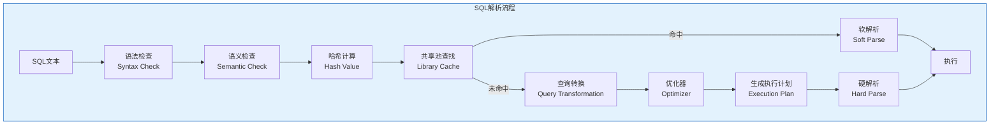
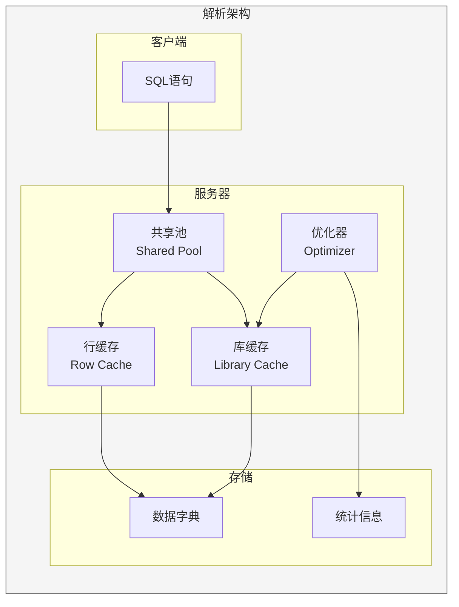
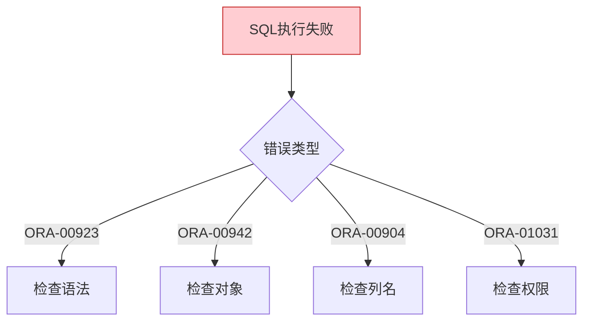

# Oracle查询解析与执行计划生成

## 一、概述

### 1.1 一句话定义

Oracle查询解析是将SQL文本转换为执行计划的内部过程，包括语法检查、语义检查、查询转换和成本计算。
它在SQL执行中出现和使用，解决SQL如何被优化器处理的问题。

### 1.2 为什么重要

- **不掌握的后果：** 无法理解SQL执行过程，无法优化SQL性能
- **掌握的价值：** 深入理解SQL执行机制，有效优化SQL

### 1.3 适用场景

| 场景 | 说明 |
|------|------|
| SQL优化 | 理解执行计划 |
| 性能诊断 | 分析解析开销 |
| 绑定变量 | 理解游标共享 |
| 优化器调优 | 理解优化器决策 |

### 1.4 版本演进

| 版本 | 变化说明 |
|------|---------|
| 11gR2 | 自适应游标共享 |
| 12cR1 | 自适应计划 |
| 12cR2 | 统计信息自动收集 |
| 19c | 自动索引 |
| 21c | 自动SQL调优 |

## 二、术语与概念

### 2.1 核心术语表

| 术语 | 含义 | 类比 |
|------|------|------|
| Parse | 解析 | 翻译 |
| Hard Parse | 硬解析 | 重新翻译 |
| Soft Parse | 软解析 | 使用缓存 |
| Cursor | 游标 | SQL缓存 |
| Optimizer | 优化器 | 决策者 |
| Execution Plan | 执行计划 | 执行步骤 |

### 2.2 解析流程



## 三、核心原理

### 3.1 语法检查

```sql
-- 语法检查验证SQL语法正确性
-- 检查关键字、运算符、括号匹配等

-- 语法错误示例
SELECT * FORM employees;  -- FORM应为FROM
-- ORA-00923: FROM keyword not found where expected

SELECT * FROM employees WHERE salary > ;  -- 缺少值
-- ORA-00936: missing expression
```

### 3.2 语义检查

```sql
-- 语义检查验证对象和权限
-- 检查表是否存在、列是否存在、权限是否足够

-- 语义错误示例
SELECT * FROM non_existent_table;
-- ORA-00942: table or view does not exist

SELECT invalid_column FROM employees;
-- ORA-00904: "INVALID_COLUMN": invalid identifier

-- 权限不足
-- ORA-00942: table or view does not exist
-- (实际是权限不足，但返回相同错误)
```

### 3.3 哈希计算与共享池查找

```sql
-- 计算SQL文本的哈希值
-- 用于在共享池中查找相同的SQL

-- 查看SQL的哈希值
SELECT sql_id, hash_value, sql_text
FROM v$sql
WHERE sql_text LIKE '%employees%'
FETCH FIRST 5 ROWS ONLY;

-- 查看不可共享原因
SELECT sql_id, child_number, reason
FROM v$sql_shared_cursor
WHERE sql_id = 'abc123def';

-- 常见不可共享原因
-- AUTH_CHECK_MISMATCH: 权限检查失败
-- TRANSLATION_MISMATCH: 翻译不匹配
-- BIND_MISMATCH: 绑定变量不匹配
-- OPTIMIZER_MODE_MISMATCH: 优化器模式不同
```

### 3.4 查询转换

```sql
-- 查询转换将SQL转换为更优形式

-- 1. 子查询展开（Subquery Unnesting）
-- 原SQL
SELECT * FROM employees
WHERE department_id IN (SELECT department_id FROM departments WHERE location_id = 1700);

-- 转换为JOIN
SELECT e.* FROM employees e, departments d
WHERE e.department_id = d.department_id AND d.location_id = 1700;

-- 2. 视图合并（View Merging）
-- 原SQL
SELECT * FROM (SELECT * FROM employees WHERE salary > 10000) WHERE department_id = 10;

-- 合并为
SELECT * FROM employees WHERE salary > 10000 AND department_id = 10;

-- 3. 谓词推入（Predicate Pushing）
-- 将谓词推入视图内部

-- 4. 连接消除（Join Elimination）
-- 原SQL
SELECT e.employee_id, e.name, d.department_name
FROM employees e, departments d
WHERE e.department_id = d.department_id AND e.department_id = 10;

-- 如果只需要员工信息，可以消除departments表
SELECT employee_id, name FROM employees WHERE department_id = 10;
```

### 3.5 优化器决策

```sql
-- 优化器基于成本选择执行计划

-- 查看优化器决策（10053事件）
ALTER SESSION SET EVENTS '10053 trace name context forever, level 1';
SELECT * FROM employees WHERE department_id = 10;
ALTER SESSION SET EVENTS '10053 trace name context off';

-- 跟踪文件包含：
-- 1. 统计信息
-- 2. 候选计划
-- 3. 成本计算
-- 4. 最终选择

-- 查看跟踪文件位置
SELECT value FROM v$diag_info WHERE name = 'Default Trace File';
```

### 3.6 执行计划生成

```sql
-- 查看执行计划
EXPLAIN PLAN FOR SELECT * FROM employees WHERE department_id = 10;
SELECT * FROM TABLE(DBMS_XPLAN.DISPLAY);

-- 输出示例：
-- --------------------------------------------------------------
-- | Id | Operation                    | Name        | Rows | Cost |
-- --------------------------------------------------------------
-- |  0 | SELECT STATEMENT             |             |      |   10 |
-- |  1 |  TABLE ACCESS BY INDEX ROWID | EMPLOYEES   |   10 |   10 |
-- |* 2 |   INDEX RANGE SCAN           | EMP_DEPT_IX |   10 |    2 |
-- --------------------------------------------------------------

-- 查看实际执行计划
SELECT * FROM TABLE(DBMS_XPLAN.DISPLAY_CURSOR(sql_id => 'abc123'));

-- 查看带统计的执行计划
SELECT * FROM TABLE(DBMS_XPLAN.DISPLAY_CURSOR(
    sql_id => 'abc123',
    format => 'ALLSTATS LAST'
));
```

### 3.7 硬解析与软解析

```sql
-- 硬解析：完整的解析过程
-- - 语法检查
-- - 语义检查
-- - 查询转换
-- - 优化器
-- - 生成执行计划

-- 软解析：使用缓存的执行计划
-- - 语法检查
-- - 语义检查
-- - 直接使用缓存计划

-- 查看解析统计
SELECT name, value FROM v$sysstat
WHERE name IN (
    'parse count (total)',
    'parse count (hard)',
    'parse count (failures)',
    'session cursor cache hits'
);

-- 硬解析率计算
SELECT 
    (SELECT value FROM v$sysstat WHERE name = 'parse count (hard)') AS hard_parse,
    (SELECT value FROM v$sysstat WHERE name = 'parse count (total)') AS total_parse,
    ROUND(
        (SELECT value FROM v$sysstat WHERE name = 'parse count (hard)') * 100 /
        (SELECT value FROM v$sysstat WHERE name = 'parse count (total)')
    , 2) AS hard_parse_ratio
FROM dual;
```

### 3.8 游标共享

```sql
-- 游标共享机制
-- 相同SQL共享同一执行计划

-- 查看SQL的游标信息
SELECT sql_id, child_number, executions, parse_calls
FROM v$sql
WHERE sql_text LIKE '%employees%';

-- 查看不可共享原因
SELECT sql_id, child_number, reason
FROM v$sql_shared_cursor
WHERE sql_id = 'abc123';

-- 常见原因：
-- BIND_MISMATCH: 绑定变量类型/长度不同
-- AUTH_CHECK_MISMATCH: 权限检查失败
-- TRANSLATION_MISMATCH: 对象翻译不匹配
-- OPTIMIZER_MODE_MISMATCH: 优化器模式不同
-- ROLL_INVALID_MISMATCH: 对象失效

-- CURSOR_SHARING参数
SHOW PARAMETER cursor_sharing;
-- EXACT: 默认，精确匹配
-- FORCE: 强制替换字面量为绑定变量
-- SIMILAR: 类似FORCE但有优化
```

## 四、架构与组件

### 4.1 解析架构



### 4.2 共享池结构

```sql
-- 查看共享池使用
SELECT pool, name, bytes/1024/1024 AS mb
FROM v$sgastat
WHERE pool = 'shared pool'
ORDER BY bytes DESC
FETCH FIRST 20 ROWS ONLY;

-- 查看库缓存命中率
SELECT namespace, gets, gethits,
       ROUND(gethits/gets*100, 2) AS hit_ratio
FROM v$librarycache
WHERE namespace IN ('SQL AREA', 'TABLE/PROCEDURE', 'BODY');

-- 查看行缓存命中率
SELECT parameter, gets, getmisses,
       ROUND((1 - getmisses/gets)*100, 2) AS hit_ratio
FROM v$rowcache
WHERE gets > 0;
```

## 五、配置与调优

### 5.1 减少硬解析

| 策略 | 说明 | 效果 |
|------|------|------|
| 绑定变量 | 使用绑定变量 | 大幅减少 |
| CURSOR_SHARING | 强制替换字面值 | 临时方案 |
| 共享池大小 | 增大共享池 | 减少失效 |
| 会话缓存 | 启用会话缓存 | 提高复用 |

```sql
-- 启用会话游标缓存
ALTER SYSTEM SET session_cached_cursors = 100;

-- 查看会话游标缓存
SELECT * FROM v$sesstat WHERE statistic# = (
    SELECT statistic# FROM v$statname WHERE name = 'session cursor cache hits'
);

-- 查看游标缓存使用
SELECT sid, value FROM v$sesstat
WHERE statistic# = (
    SELECT statistic# FROM v$statname 
    WHERE name = 'session cursor cache count'
);
```

### 5.2 优化器参数

```sql
-- 优化器模式
SHOW PARAMETER optimizer_mode;
-- ALL_ROWS: 优化吞吐量（默认）
-- FIRST_ROWS: 优化响应时间

-- 自适应优化
SHOW PARAMETER optimizer_adaptive;
-- optimizer_adaptive_plans: 自适应计划
-- optimizer_adaptive_statistics: 自适应统计

-- 查看优化器特性
SELECT parameter, value FROM v$parameter
WHERE name LIKE 'optimizer%';
```

## 六、监控与诊断

### 6.1 解析监控

```sql
-- 实时监控解析
SELECT name, value FROM v$sysstat
WHERE name LIKE '%parse%'
ORDER BY value DESC;

-- 查看硬解析SQL
SELECT sql_id, sql_text, parse_calls, executions
FROM v$sql
WHERE parse_calls > 100
ORDER BY parse_calls DESC
FETCH FIRST 10 ROWS ONLY;

-- 查看不可共享游标
SELECT sql_id, child_number, reason
FROM v$sql_shared_cursor
WHERE sql_id IN (
    SELECT sql_id FROM v$sql WHERE parse_calls > 100
);
```

### 6.2 常见问题诊断

| 问题 | 症状 | 排查方法 |
|------|------|---------|
| 硬解析率高 | CPU使用高 | 检查绑定变量 |
| 共享池失效 | 解析增加 | 检查共享池大小 |
| 游标不共享 | 多版本计划 | 检查不可共享原因 |
| 优化器选择差 | 执行计划差 | 检查统计信息 |

## 七、实战案例

### 7.1 案例背景

- **场景**：数据库CPU使用率持续90%以上
- **时间**：2026年
- **现象**：大量硬解析

### 7.2 诊断过程

**步骤1：确认硬解析率**

```sql
SELECT name, value FROM v$sysstat
WHERE name IN ('parse count (hard)', 'parse count (total)');

-- 结果：硬解析率超过50%
```

**步骤2：查找问题SQL**

```sql
SELECT sql_id, sql_text, parse_calls, executions
FROM v$sql
WHERE parse_calls > 1000
ORDER BY parse_calls DESC;

-- 发现大量未使用绑定变量的SQL
```

**步骤3：优化方案**

```sql
-- 1. 修改应用使用绑定变量
-- 2. 临时使用CURSOR_SHARING=FORCE
ALTER SYSTEM SET cursor_sharing = FORCE;

-- 3. 增大共享池
ALTER SYSTEM SET shared_pool_size = 2G;

-- 4. 启用会话游标缓存
ALTER SYSTEM SET session_cached_cursors = 200;
```

### 7.3 优化结果

| 指标 | 优化前 | 优化后 |
|------|--------|--------|
| 硬解析率 | 50% | 5% |
| CPU使用率 | 90% | 40% |
| 响应时间 | 500ms | 50ms |

### 7.4 复盘总结

- **根因：** 应用未使用绑定变量
- **教训：** 必须使用绑定变量
- **改进：** 代码审查增加绑定变量检查

## 八、常见错误与排查

### 8.1 常见错误

| 错误 | 问题 | 解决方法 |
|------|------|---------|
| ORA-00923 | 语法错误 | 检查SQL语法 |
| ORA-00942 | 对象不存在 | 检查对象和权限 |
| ORA-00904 | 列不存在 | 检查列名 |
| ORA-01031 | 权限不足 | 授予权限 |

### 8.2 排查流程



## 九、最佳实践

### 9.1 官方推荐

- 使用绑定变量
- 合理配置共享池
- 启用会话游标缓存
- 定期收集统计信息

### 9.2 社区经验

- 硬解析率应低于5%
- 共享池命中率应高于90%
- 监控不可共享游标
- 定期分析TOP SQL

### 9.3 反模式

| 反模式 | 问题 | 正确做法 |
|--------|------|---------|
| 不使用绑定变量 | 硬解析多 | 使用绑定变量 |
| 共享池太小 | 频繁失效 | 合理配置 |
| 不监控解析 | 问题发现晚 | 建立监控 |
| 不收集统计信息 | 优化器决策差 | 定期收集 |

## 十、命令与视图汇总

### 10.1 命令列表

| 命令 | 适用场景 | 说明 |
|------|---------|------|
| `EXPLAIN PLAN` | 查看执行计划 | 预估计划 |
| `DBMS_XPLAN.DISPLAY` | 显示计划 | 格式化输出 |
| `ALTER SYSTEM SET cursor_sharing` | 游标共享 | 减少硬解析 |

### 10.2 视图列表

| 视图名 | 类型 | 用途 |
|--------|------|------|
| V$SQL | 动态 | SQL信息 |
| V$SQL_SHARED_CURSOR | 动态 | 游标共享 |
| V$SQLSTATS | 动态 | SQL统计 |
| V$LIBRARYCACHE | 动态 | 库缓存 |
| V$ROWCACHE | 动态 | 行缓存 |

## 十一、总结速查

### 11.1 黄金法则

1. **绑定变量** - 减少硬解析
2. **共享池** - 合理配置
3. **统计信息** - 优化器基础
4. **游标共享** - 提高复用

### 11.2 一页纸检查清单

| 检查项 | 说明 |
|--------|------|
| 硬解析率 | <5% |
| 共享池命中率 | >90% |
| 绑定变量使用 | 必须使用 |
| 统计信息 | 定期收集 |

## 附录

### A. 官方参考

- [Oracle Database Performance Tuning Guide - SQL Processing](https://docs.oracle.com/en/database/oracle/oracle-database/19c/tgdba/)
- [Oracle Database Reference - V$SQL](https://docs.oracle.com/en/database/oracle/oracle-database/19c/refrn/)

### B. 修订记录

| 日期 | 版本 | 修改内容 | 修改人 |
|------|------|---------|--------|
| 2026-07-02 | v1.0 | 初始版本 | YashanDB知识库生成器 |
