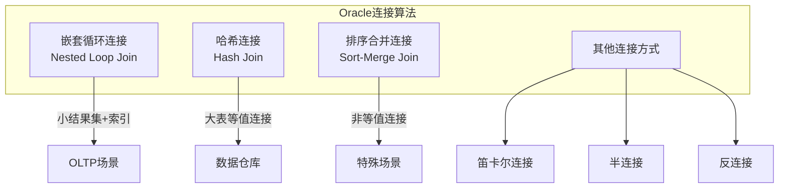
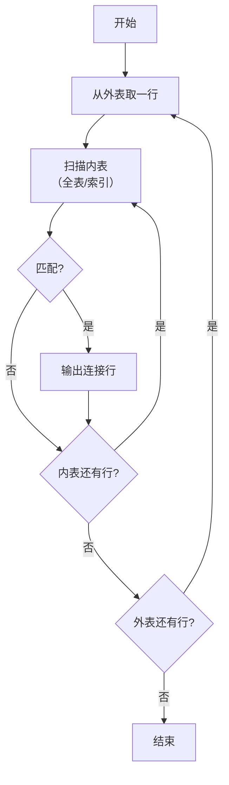
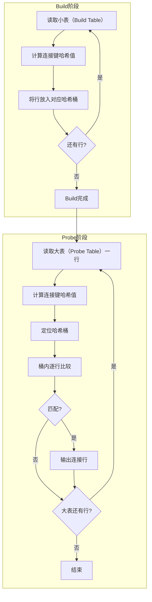
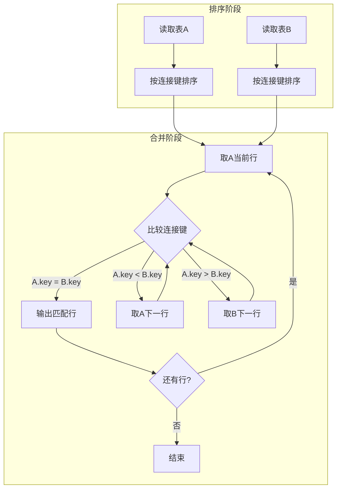
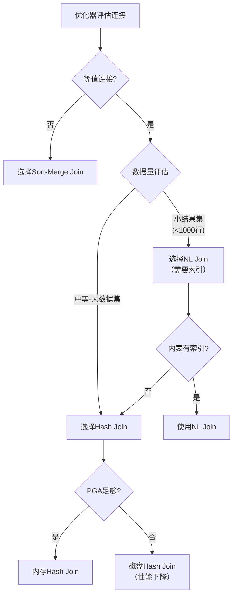

# Oracle连接算法与算子实现

## 一、概述

### 1.1 一句话定义

Oracle连接算法是优化器在執行多表查询时选择的内部数据处理方式，主要包括嵌套循环连接（NL Join）、哈希连接（Hash Join）和排序合并连接（Sort-Merge Join）三种核心算法。
它在多表关联查询中出现和使用，解决如何高效组合多个数据源行的问题。

### 1.2 为什么重要

- **不掌握的后果：** 无法理解执行计划中的连接操作，无法诊断连接性能瓶颈
- **掌握的价值：** 深入理解优化器决策，精准优化多表查询性能

### 1.3 适用场景

| 场景 | 说明 |
|------|------|
| OLTP小表关联 | NL Join适合小结果集 |
| 大表等值连接 | Hash Join适合大数据量等值连接 |
| 非等值连接 | Sort-Merge Join适合非等值条件 |
| 优化器调优 | 理解连接算法选择逻辑 |

### 1.4 版本演进

| 版本 | 变化说明 |
|------|---------|
| 11gR2 | 增强NL Join的自适应优化 |
| 12cR1 | 自适应查询优化，运行时切换连接算法 |
| 12cR2 | 自动索引优化连接路径 |
| 19c | 自适应计划默认启用 |
| 21c | 自动SQL调优增强连接选择 |

## 二、术语与概念

### 2.1 核心术语表

| 术语 | 含义 | 类比 |
|------|------|------|
| Nested Loop Join | 嵌套循环连接 | 双层for循环 |
| Hash Join | 哈希连接 | 按桶分类匹配 |
| Sort-Merge Join | 排序合并连接 | 排序后合并 |
| Build Table | 构建表（Hash Join） | 先做索引的表 |
| Probe Table | 探测表（Hash Join） | 后查的表 |
| Outer Table | 外表（NL Join） | 驱动表 |
| Inner Table | 内表（NL Join） | 被驱动表 |
| Join Key | 连接键 | 匹配条件列 |
| Cardinality | 基数 | 结果行数估计 |

### 2.2 连接算法分类



## 三、核心原理

### 3.1 嵌套循环连接（NL Join）

#### 3.1.1 算法描述

嵌套循环连接是最直观的连接算法，类似于两层嵌套循环：

```
对于外表（Outer）的每一行：
    扫描内表（Inner），找到匹配的行
    输出连接结果
```

#### 3.1.2 执行流程



#### 3.1.3 性能特点

| 特性 | 说明 |
|------|------|
| 时间复杂度 | O(N × M)，N为外表行数，M为内表扫描代价 |
| 索引依赖 | 内表有索引时性能大幅提升，降至O(N × log M) |
| 内存消耗 | 极低，无需额外内存 |
| 启动速度 | 最快，第一行立即返回 |
| 适用场景 | 小结果集、高选择性连接、OLTP |

#### 3.1.4 Oracle实现细节

```sql
-- 执行计划中的NL Join标识
-- ----------------------------------------------
-- | Id | Operation                    | Name    |
-- ----------------------------------------------
-- |  0 | SELECT STATEMENT             |         |
-- |  1 |  NESTED LOOPS                |         |
-- |  2 |   NESTED LOOPS               |         |
-- |  3 |    TABLE ACCESS FULL         | EMP     |  -- 外表
-- |  4 |    INDEX RANGE SCAN          | DEPT_PK |  -- 内表索引
-- |  5 |   TABLE ACCESS BY INDEX ROWID| DEPT    |  -- 内表数据
-- ----------------------------------------------

-- 强制使用NL Join的Hint
SELECT /*+ USE_NL(e d) LEADING(e) */
    e.empno, e.ename, d.dname
FROM emp e, dept d
WHERE e.deptno = d.deptno;

-- 查看实际执行计划
SELECT * FROM TABLE(DBMS_XPLAN.DISPLAY_CURSOR(NULL, NULL, 'ALLSTATS LAST'));
```

#### 3.1.5 内部算子

| 算子 | 说明 |
|------|------|
| NESTED LOOPS | 标准嵌套循环 |
| NESTED LOOPS OUTER | 外连接NL |
| NESTED LOOPS SEMI | 半连接NL（EXISTS） |
| NESTED LOOPS ANTI | 反连接NL（NOT EXISTS） |

### 3.2 哈希连接（Hash Join）

#### 3.2.1 算法描述

哈希连接分两个阶段：
1. **Build阶段**：扫描较小的表，按连接键建立哈希表
2. **Probe阶段**：扫描较大的表，对每行计算哈希值并在哈希表中查找匹配

#### 3.2.2 执行流程



#### 3.2.3 性能特点

| 特性 | 说明 |
|------|------|
| 时间复杂度 | O(N + M)，线性扫描 |
| 内存消耗 | 需要为Build表分配哈希表内存（PGA） |
| 启动速度 | 较慢，需等Build阶段完成 |
| 适用场景 | 大表等值连接、数据仓库 |
| 限制 | 仅支持等值连接（=） |

#### 3.2.4 Oracle内存管理

```sql
-- Hash Join的内存分配
-- 当哈希表能完全放入PGA（最优情况）
SELECT name, value FROM v$statname s, v$mystat m
WHERE s.statistic# = m.statistic#
AND name LIKE '%hash%';

-- 查看PGA内存分配
SELECT * FROM v$pgastat WHERE name LIKE '%PGA%';

-- Hash Join的内存溢出（磁盘溢出）
-- 当PGA不足以容纳哈希表时，部分桶溢出到临时表空间
-- 性能显著下降

-- 强制使用Hash Join的Hint
SELECT /*+ USE_HASH(e d) */
    e.empno, e.ename, d.dname
FROM emp e, dept d
WHERE e.deptno = d.deptno;

-- 控制Build表选择
SELECT /*+ USE_HASH(e d) SWAP_JOIN_INPUTS(d) */
    e.empno, e.ename, d.dname
FROM emp e, dept d
WHERE e.deptno = d.deptno;
```

#### 3.2.5 内部算子

| 算子 | 说明 |
|------|------|
| HASH JOIN | 标准哈希连接 |
| HASH JOIN OUTER | 外连接Hash |
| HASH JOIN SEMI | 半连接Hash |
| HASH JOIN ANTI | 反连接Hash |
| HASH JOIN RIGHT | 右连接Hash |

### 3.3 排序合并连接（Sort-Merge Join）

#### 3.3.1 算法描述

排序合并连接分两个阶段：
1. **Sort阶段**：分别对两个表按连接键排序
2. **Merge阶段**：同步扫描两个有序序列，匹配相同连接键的行

#### 3.3.2 执行流程



#### 3.3.3 性能特点

| 特性 | 说明 |
|------|------|
| 时间复杂度 | O(N log N + M log M)，排序占主导 |
| 内存消耗 | 排序需要内存，可能溢出到磁盘 |
| 启动速度 | 慢，需等两表都排序完成 |
| 适用场景 | 非等值连接（<, >, BETWEEN）、不等连接 |
| 优势 | 结果自然有序 |

#### 3.3.4 Oracle实现

```sql
-- 强制使用Sort-Merge Join
SELECT /*+ USE_MERGE(e d) */
    e.empno, e.ename, d.dname
FROM emp e, dept d
WHERE e.deptno >= d.deptno;  -- 非等值连接

-- 排序可能使用内存或磁盘
-- 查看排序统计
SELECT name, value FROM v$sysstat
WHERE name IN ('sorts (memory)', 'sorts (disk)', 'sorts (rows)');

-- 查看排序区大小
SHOW PARAMETER sort_area_size;
SHOW PARAMETER pga_aggregate_target;
```

## 四、架构与组件

### 4.1 优化器选择逻辑



### 4.2 自适应查询优化（12c+）

```sql
-- 自适应计划（Adaptive Plans）
-- 优化器在运行时根据实际行数动态选择连接算法

-- 查看自适应计划统计
SELECT * FROM v$sql_plan_statistics_all
WHERE child_address = (SELECT child_address FROM v$sql WHERE sql_id = '&sql_id')
AND is_adaptive_plan = 1;

-- 查看自适应计划决策
SELECT report FROM DBMS_XPLAN.DISPLAY_CURSOR('&sql_id', NULL, 'ADAPTIVE');

-- 相关参数
SHOW PARAMETER optimizer_adaptive_plans;    -- TRUE（12c+默认）
SHOW PARAMETER optimizer_adaptive_statistics;
```

### 4.3 连接算法对比

| 维度 | NL Join | Hash Join | Sort-Merge Join |
|------|---------|-----------|-----------------|
| 等值连接 | ✓ | ✓ | ✓ |
| 非等值连接 | ✓ | ✗ | ✓ |
| 内存需求 | 低 | 高 | 中 |
| 启动延迟 | 低 | 高 | 高 |
| 大数据集 | 差 | 优 | 中 |
| 小数据集 | 优 | 中 | 差 |
| 排序输出 | 否 | 否 | 是 |
| 索引利用 | 是 | 否 | 否 |
| 并行执行 | 有限 | 好 | 好 |

## 五、配置与调优

### 5.1 关键参数

```sql
-- PGA相关（影响Hash Join和Sort-Merge Join）
SHOW PARAMETER pga_aggregate_target;     -- PGA总目标
SHOW PARAMETER pga_aggregate_limit;      -- PGA硬限制
SHOW PARAMETER workarea_size_policy;     -- AUTO/MANUAL

-- 手动模式下的排序区大小
SHOW PARAMETER sort_area_size;
SHOW PARAMETER hash_area_size;

-- 优化器相关
SHOW PARAMETER optimizer_features_enable;
SHOW PARAMETER optimizer_adaptive_plans;
```

### 5.2 Hint控制

```sql
-- 连接方法Hint
/*+ USE_NL(table1 table2) */    -- 强制NL Join
/*+ USE_HASH(table1 table2) */  -- 强制Hash Join
/*+ USE_MERGE(table1 table2) */ -- 强制Sort-Merge Join

-- 驱动顺序Hint
/*+ LEADING(table1 table2) */   -- 指定驱动顺序
/*+ ORDER */                    -- 按FROM子句顺序

-- 交换连接输入
/*+ SWAP_JOIN_INPUTS(table) */  -- 交换Build/Probe表
/*+ NO_SWAP_JOIN_INPUTS(table) */

-- 禁止特定连接方法
/*+ NO_USE_NL(table) */
/*+ NO_USE_HASH(table) */
/*+ NO_USE_MERGE(table) */
```

### 5.3 性能调优策略

| 问题 | 诊断方法 | 解决方案 |
|------|---------|---------|
| NL Join内表全表扫描 | 执行计划中TABLE ACCESS FULL | 添加索引或改用Hash Join |
| Hash Join磁盘溢出 | v$mystat中memory/disk溢出 | 增大PGA或优化SQL |
| Sort-Merge排序溢出 | sorts(disk)统计增长 | 增大sort_area_size |
| 连接顺序不当 | 检查实际行数vs估计行数 | 使用LEADING Hint |
| 自适应计划失效 | 检查自适应统计 | 收集直方图统计信息 |

## 六、DFX能力

### 6.1 监控连接性能

```sql
-- 查看SQL执行中的连接统计
SELECT sql_id, operation, options, 
       last_starts, last_output_rows, 
       last_cr_buffer_gets, last_cu_buffer_gets
FROM v$sql_plan_statistics_all
WHERE operation LIKE '%JOIN%'
AND sql_id = '&sql_id';

-- 查看Hash Join内存使用
SELECT operation_type, policy, 
       last_memory_used / 1024 / 1024 AS mem_mb,
       last_execution
FROM v$sql_workarea
WHERE operation_type LIKE '%JOIN%';

-- 查看排序溢出
SELECT name, value FROM v$sysstat
WHERE name IN ('sorts (memory)', 'sorts (disk)');
```

### 6.2 诊断连接问题

```sql
-- 使用SQL Monitor监控连接操作
SELECT /*+ MONITOR */
    e.empno, e.ename, d.dname
FROM emp e, dept d
WHERE e.deptno = d.deptno;

-- 查看SQL Monitor报告
SELECT DBMS_SQLTUNE.REPORT_SQL_MONITOR(sql_id => '&sql_id') FROM dual;

-- 查看执行计划中的连接统计
SELECT * FROM TABLE(
    DBMS_XPLAN.DISPLAY_CURSOR('&sql_id', NULL, 'ALLSTATS LAST +COST')
);
```

## 七、实战案例

### 7.1 案例一：NL Join性能问题

**问题**：查询执行时间从0.1秒增加到30秒

```sql
-- 问题SQL
SELECT e.*, d.dname, loc.city
FROM employees e, departments d, locations loc
WHERE e.dept_id = d.dept_id
AND d.loc_id = loc.loc_id
AND e.hire_date > DATE '2020-01-01';

-- 执行计划分析
-- NL Join驱动表employees返回10000行
-- 内表departments无索引，每次全表扫描
-- 总扫描次数：10000 × 500 = 5,000,000

-- 解决方案1：添加索引
CREATE INDEX idx_dept_id ON departments(dept_id);

-- 解决方案2：改用Hash Join
SELECT /*+ USE_HASH(e d loc) */
    e.*, d.dname, loc.city
FROM employees e, departments d, locations loc
WHERE e.dept_id = d.dept_id
AND d.loc_id = loc.loc_id
AND e.hire_date > DATE '2020-01-01';
```

### 7.2 案例二：Hash Join内存溢出

**问题**：大表连接时临时表空间暴涨

```sql
-- 诊断：检查Hash Join是否溢出到磁盘
SELECT operation_type, policy,
       optimal_executions,
       onepass_executions,
       multipasses_executions,
       last_memory_used / 1024 / 1024 AS mem_mb
FROM v$sql_workarea
WHERE operation_type = 'HASH-JOIN'
AND multipasses_executions > 0;

-- 解决方案：增大PGA
ALTER SYSTEM SET pga_aggregate_target = 4G SCOPE=BOTH;
ALTER SYSTEM SET pga_aggregate_limit = 8G SCOPE=BOTH;

-- 或优化SQL减少Build表大小
SELECT /*+ USE_HASH(a b) */
    a.*, b.order_date
FROM order_items a, orders b
WHERE a.order_id = b.order_id
AND b.order_date >= SYSDATE - 30;  -- 减少Build表行数
```

### 7.3 案例三：Sort-Merge Join优化

**问题**：非等值连接导致大量排序

```sql
-- 问题SQL：范围连接
SELECT e.*, b.bonus_amount
FROM employees e, bonuses b
WHERE e.salary BETWEEN b.min_salary AND b.max_salary;

-- 执行计划：Sort-Merge Join，两表排序
-- 排序消耗大量临时空间

-- 优化方案：改写为Hash Joinable的等值连接
SELECT e.*, b.bonus_amount
FROM employees e
JOIN bonuses b ON e.salary >= b.min_salary AND e.salary <= b.max_salary;

-- 或使用分区减少排序数据量
```

## 八、常见错误与排查

### 8.1 常见问题

| 问题 | 原因 | 解决方案 |
|------|------|---------|
| ORA-04036 | PGA超出限制 | 增大pga_aggregate_limit |
| ORA-01652 | 临时表空间不足 | 扩展临时表空间 |
| Hash Join回退到磁盘 | Build表过大 | 增大PGA或优化SQL |
| NL Join性能差 | 内表无索引 | 添加索引或换连接算法 |
| 笛卡尔连接 | 缺少连接条件 | 检查SQL逻辑 |

### 8.2 排查步骤

```sql
-- Step 1: 确认连接类型
SELECT * FROM TABLE(DBMS_XPLAN.DISPLAY_CURSOR('&sql_id'));

-- Step 2: 检查实际vs估计行数
SELECT * FROM TABLE(DBMS_XPLAN.DISPLAY_CURSOR('&sql_id', NULL, 'ALLSTATS LAST'));

-- Step 3: 检查内存使用
SELECT * FROM v$sql_workarea WHERE sql_id = '&sql_id';

-- Step 4: 检查排序统计
SELECT name, value FROM v$sesstat s, v$statname n
WHERE s.statistic# = n.statistic#
AND n.name LIKE '%sort%'
AND s.sid = &sid;
```

## 九、最佳实践

### 9.1 连接算法选择原则

- **默认信任优化器**：CBO通常能做出正确的连接选择
- **小表驱动大表**：NL Join中确保小表作为外表
- **等值连接优先Hash Join**：大数据量等值连接时Hash Join最优
- **非等值连接用Sort-Merge**：范围条件连接只能使用Sort-Merge或NL
- **避免笛卡尔连接**：通常是SQL逻辑错误的信号

### 9.2 性能优化清单

- 确保连接列有合适的索引（NL Join场景）
- 合理设置PGA大小（Hash Join场景）
- 收集准确的统计信息，特别是连接列的直方图
- 使用SQL Monitor监控大查询的连接操作
- 定期审查自适应计划的决策质量

## 十、命令与视图汇总

| 命令/视图 | 用途 |
|-----------|------|
| `DBMS_XPLAN.DISPLAY_CURSOR` | 查看执行计划中的连接操作 |
| `v$sql_plan_statistics_all` | 连接操作的实际统计 |
| `v$sql_workarea` | 连接操作的内存使用 |
| `v$pgastat` | PGA整体统计 |
| `v$sysstat` (sorts) | 排序统计 |
| `/*+ USE_NL */` | 强制NL Join |
| `/*+ USE_HASH */` | 强制Hash Join |
| `/*+ USE_MERGE */` | 强制Sort-Merge Join |
| `/*+ LEADING */` | 指定驱动顺序 |

## 十一、总结速查

| 连接算法 | 最佳场景 | 内存需求 | 启动速度 |
|---------|---------|---------|---------|
| NL Join | 小结果集+索引 | 低 | 快 |
| Hash Join | 大表等值连接 | 高 | 慢 |
| Sort-Merge | 非等值连接 | 中 | 慢 |

**核心要点**：
- 优化器基于统计信息自动选择连接算法
- 12c+自适应计划可在运行时调整
- Hash Join是大数据量等值连接的最优选择
- NL Join的性能高度依赖内表索引

## 附录

### A. 连接算法决策树

```
连接类型判断：
├── 等值连接（=）
│   ├── 小结果集（<1000行） → NL Join（需索引）
│   ├── 中等-大数据集 → Hash Join
│   └── 需要排序输出 → Sort-Merge Join
├── 非等值连接（<, >, BETWEEN）
│   ├── 小结果集 → NL Join
│   └── 大数据集 → Sort-Merge Join
└── 无连接条件 → 笛卡尔连接（通常应避免）
```

### B. 参考文档

- Oracle Database Performance Tuning Guide - Join Operations
- Oracle Database SQL Tuning Guide - Optimizer Execution Plans
- Oracle Database Concepts - Processing Joins
