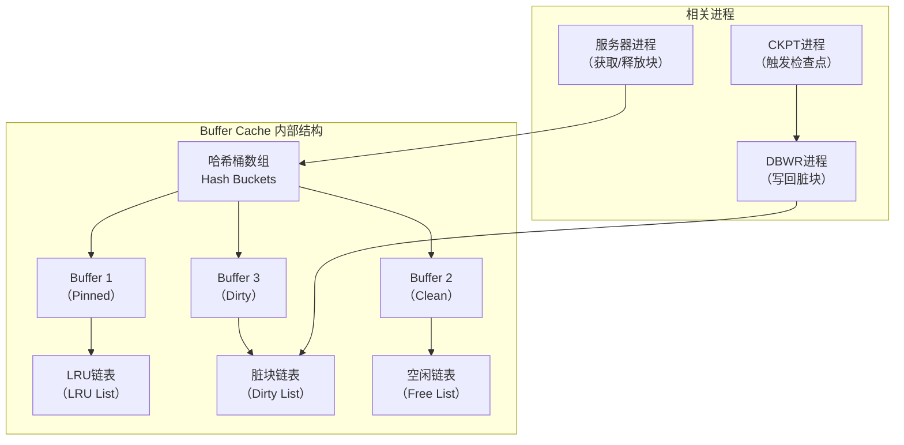
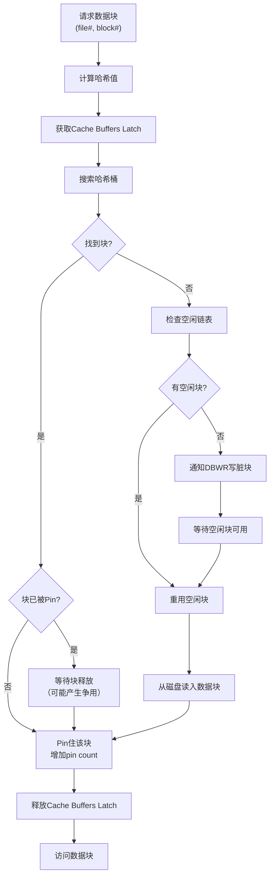
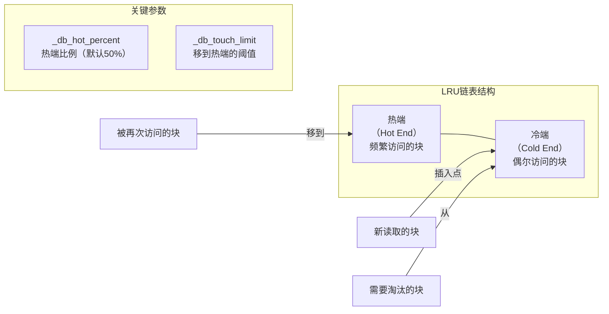
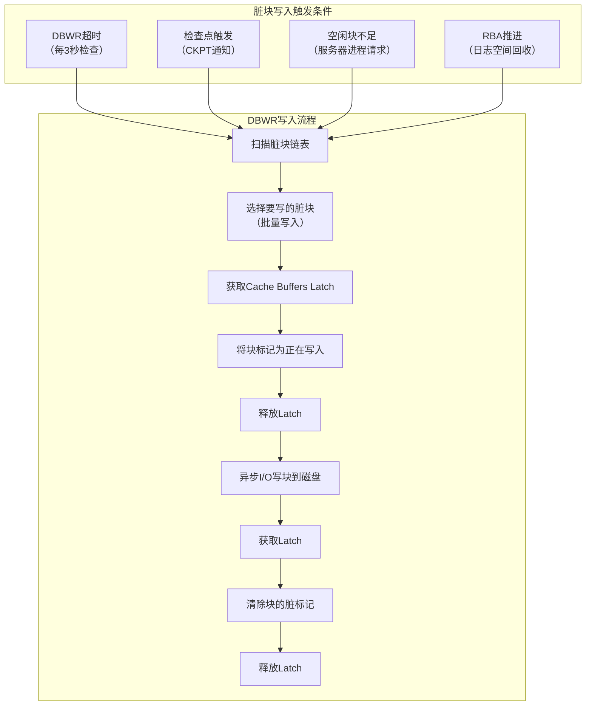

# Oracle缓冲区管理器深入

## 一、概述

### 1.1 一句话定义

Oracle缓冲区管理器是管理Buffer Cache中数据块缓存的核心组件，负责块的获取、缓存、修改和写回磁盘的全过程。
它在所有数据库I/O操作中出现和使用，解决减少磁盘I/O、提升数据访问性能的问题。

### 1.2 为什么重要

- **不掌握的后果：** 无法诊断Buffer Cache性能瓶颈，无法优化I/O密集型负载
- **掌握的价值：** 深入理解数据库I/O路径，精准调优Buffer Cache性能

### 1.3 适用场景

| 场景 | 说明 |
|------|------|
| Buffer Cache调优 | 优化缓存命中率 |
| I/O瓶颈诊断 | 分析DBWR写性能 |
| Latch争用处理 | 解决Cache Buffers Latch等待 |
| 内存管理 | 优化Buffer Cache大小 |

### 1.4 版本演进

| 版本 | 变化说明 |
|------|---------|
| 11gR2 | 自动SGA内存管理增强 |
| 12cR1 | 多租户Buffer Cache隔离 |
| 12cR2 | In-Memory列式缓存集成 |
| 19c | 自动Buffer Cache调优 |
| 21c | 自适应Buffer Cache管理 |

## 二、术语与概念

### 2.1 核心术语表

| 术语 | 含义 | 类比 |
|------|------|------|
| Buffer Cache | 缓冲区缓存 | 内存中的磁盘缓存 |
| DB Block | 数据块 | 最小I/O单位 |
| Dirty Buffer | 脏块 | 被修改未写回的块 |
| Free Buffer | 空闲块 | 可分配的干净块 |
| Pinned Buffer | 固定块 | 正在使用的块 |
| LRU List | LRU链表 | 最近最少使用队列 |
| Checkpoint | 检查点 | 脏块写回标记 |
| DBWR | 数据库写进程 | 脏块写回执行者 |
| Latch | 闩锁 | 轻量级锁 |
| Buffer Header | 块头 | 块的元数据描述 |

### 2.2 Buffer Cache内部结构



## 三、核心原理

### 3.1 块获取流程

当服务器进程需要访问一个数据块时：



### 3.2 LRU算法实现

Oracle使用改进的LRU算法，将Buffer Cache分为热端和冷端：



### 3.3 脏块写入机制



### 3.4 缓冲区保护机制

Oracle使用多层Latch保护Buffer Cache：

| Latch类型 | 保护对象 | 争用影响 |
|-----------|---------|---------|
| Cache Buffers LRU Latch | 保护LRU链表操作 | 空闲块不足时争用 |
| Cache Buffers Latch | 保护哈希桶和块头 | 高并发访问同一块时争用 |
| Cache Buffers Chains Latch | 保护哈希链 | 热点块访问时争用 |

```sql
-- 查看Latch争用
SELECT name, gets, misses, immediate_gets, immediate_misses,
       ROUND(misses / NULLIF(gets, 0) * 100, 2) AS miss_ratio
FROM v$latch
WHERE name IN ('cache buffers lru chain', 'cache buffers chains')
ORDER BY misses DESC;

-- 查看热点块
SELECT hladdr, obj, tch
FROM (
    SELECT hladdr, obj, tch
    FROM x$bh
    ORDER BY tch DESC
)
WHERE ROWNUM <= 20;

-- 关联到具体对象
SELECT o.owner, o.object_name, o.object_type, bh.tch, bh.hladdr
FROM x$bh bh
JOIN dba_objects o ON bh.obj = o.data_object_id
WHERE bh.tch > 100
ORDER BY bh.tch DESC;
```

## 四、架构与组件

### 4.1 Buffer Cache内存布局

```
Buffer Cache
├── Hash Buckets（哈希桶数组）
│   ├── Bucket 0 → Buffer → Buffer → ...
│   ├── Bucket 1 → Buffer → Buffer → ...
│   └── ...
├── LRU Lists
│   ├── Hot End（热端）
│   └── Cold End（冷端）
├── Dirty List（脏块链表）
└── Free List（空闲链表）

每个Buffer结构：
├── Buffer Header（块头）
│   ├── DBA (Data Block Address)
│   ├── Pin Count（固定计数）
│   ├── Dirty Flag（脏标记）
│   ├── Latch Pointer（闩锁指针）
│   └── Next/Prev Pointers（链表指针）
└── Data Area（数据区域 = db_block_size）
```

### 4.2 多Buffer Pool架构

```sql
-- Oracle支持多个Buffer Pool
-- DEFAULT Pool：默认缓冲池
-- KEEP Pool：长期保留的块（小表、频繁访问的表）
-- RECACHE Pool：临时大量扫描的块（大表全扫）

-- 配置多Buffer Pool
ALTER SYSTEM SET db_keep_cache_size = 512M;
ALTER SYSTEM SET db_recycle_cache_size = 256M;

-- 表指定Buffer Pool
ALTER TABLE important_table STORAGE (BUFFER_POOL KEEP);
ALTER TABLE batch_table STORAGE (BUFFER_POOL RECYCLE);

-- 查看各Pool统计
SELECT name, block_size, buffers
FROM v$buffer_pool
ORDER BY name;

SELECT name, physical_reads, db_block_gets, consistent_gets
FROM v$buffer_pool_statistics;
```

## 五、配置与调优

### 5.1 关键参数

```sql
-- Buffer Cache大小
SHOW PARAMETER db_cache_size;          -- 显式设置
SHOW PARAMETER sga_target;             -- 自动管理
SHOW PARAMETER memory_target;          -- 自动内存管理

-- 块大小
SHOW PARAMETER db_block_size;          -- 标准块大小

-- 多Buffer Pool
SHOW PARAMETER db_keep_cache_size;
SHOW PARAMETER db_recycle_cache_size;

-- 内部参数（谨慎使用）
-- _db_block_lru_latches    -- LRU Latch数量
-- _db_blocks_per_checkpoint -- 每个检查点的块数
```

### 5.2 性能调优策略

| 问题 | 诊断方法 | 解决方案 |
|------|---------|---------|
| Buffer Cache命中率低 | 检查hit ratio | 增大Buffer Cache |
| Latch争用 | v$latch统计 | 增加LRU Latch或优化SQL |
| 热点块争用 | x$bh热点分析 | 使用Hash Partitioning |
| DBWR写瓶颈 | v$system_event等待 | 增加DBWR进程或优化I/O |
| 空闲块不足 | v$buffer_pool统计 | 增大Buffer Cache |

```sql
-- 计算Buffer Cache命中率
SELECT name, value FROM v$sysstat
WHERE name IN ('session logical reads',
               'physical reads cache',
               'physical reads');

-- 命中率 = 1 - (physical reads cache / session logical reads)
SELECT 
    1 - (pr.value / (lr.value)) AS hit_ratio
FROM v$sysstat pr, v$sysstat lr
WHERE pr.name = 'physical reads cache'
AND lr.name = 'session logical reads';

-- 检查Buffer Cache建议
SELECT size_for_estimate AS cache_mb,
       size_factor,
       estd_physical_read_factor,
       estd_physical_reads AS est_reads
FROM v$db_cache_advice
WHERE name = 'DEFAULT'
AND block_size = (SELECT value FROM v$parameter WHERE name = 'db_block_size')
ORDER BY cache_mb;
```

## 六、DFX能力

### 6.1 监控命令

```sql
-- Buffer Cache整体统计
SELECT * FROM v$buffer_pool_statistics;

-- 查看Buffer Cache Advisory
SELECT * FROM v$db_cache_advice;

-- 监控Buffer等待
SELECT event, total_waits, time_waited_micro
FROM v$system_event
WHERE event IN ('db file sequential read',
                'db file scattered read',
                'buffer busy waits',
                'read by other session',
                'free buffer waits');

-- 查看DBWR性能
SELECT name, value FROM v$sysstat
WHERE name LIKE '%DBWR%' OR name LIKE '%physical writes%';
```

### 6.2 诊断脚本

```sql
-- 综合诊断Buffer Cache性能
SELECT 
    (SELECT value FROM v$sysstat WHERE name = 'session logical reads') AS logical_reads,
    (SELECT value FROM v$sysstat WHERE name = 'physical reads cache') AS phys_reads,
    ROUND((1 - (SELECT value FROM v$sysstat WHERE name = 'physical reads cache') /
           NULLIF((SELECT value FROM v$sysstat WHERE name = 'session logical reads'), 0)) * 100, 2) AS hit_ratio_pct,
    (SELECT value FROM v$sysstat WHERE name = 'free buffer inspected') AS free_inspected,
    (SELECT value FROM v$sysstat WHERE name = 'free buffer requested') AS free_requested
FROM dual;
```

## 七、实战案例

### 7.1 案例一：Buffer Cache命中率优化

**问题**：Buffer Cache命中率从98%下降到85%

```sql
-- 诊断：发现大量全表扫描
SELECT sql_id, disk_reads, buffer_gets, 
       ROUND(disk_reads / NULLIF(buffer_gets, 0) * 100, 2) AS disk_pct,
       sql_text
FROM v$sql
WHERE buffer_gets > 10000
ORDER BY disk_reads DESC
FETCH FIRST 10 ROWS ONLY;

-- 解决方案1：增大Buffer Cache
ALTER SYSTEM SET db_cache_size = 4G SCOPE=BOTH;

-- 解决方案2：优化SQL，添加索引避免全表扫描
CREATE INDEX idx_orders_date ON orders(order_date);

-- 解决方案3：使用KEEP Pool保留关键小表
ALTER TABLE critical_lookup STORAGE (BUFFER_POOL KEEP);
```

### 7.2 案例二：热点块Latch争用

**问题**：buffer busy waits等待事件激增

```sql
-- 诊断热点块
SELECT current_obj#, current_file#, current_block#, count(*)
FROM v$active_session_history
WHERE event = 'buffer busy waits'
AND sample_time > SYSDATE - 1/24
GROUP BY current_obj#, current_file#, current_block#
ORDER BY count(*) DESC;

-- 关联到对象
SELECT owner, object_name, subobject_name
FROM dba_objects
WHERE data_object_id = &obj_id;

-- 解决方案：对热点表使用Hash Partitioning
ALTER TABLE hot_table MODIFY
    PARTITION BY HASH (id) PARTitions 8;
```

## 八、常见错误与排查

| 问题 | 原因 | 解决方案 |
|------|------|---------|
| ORA-04031 | 共享池内存不足 | 调整shared_pool_size |
| buffer busy waits | 热点块争用 | Hash分区或优化SQL |
| free buffer waits | Buffer Cache过小 | 增大db_cache_size |
| DBWR写延迟 | I/O子系统瓶颈 | 优化存储或使用异步I/O |
| latch: cache buffers chains | 热点块访问 | 减少逻辑读或分散热点 |

## 九、最佳实践

- 使用自动SGA管理，让Oracle自动调优Buffer Cache大小
- 监控Buffer Cache命中率，保持在95%以上
- 使用Buffer Cache Advisory评估不同大小的影响
- 对热点块使用Hash Partitioning减少Latch争用
- 使用KEEP/RECYCLE Pool分离不同访问模式的表
- 定期检查DBWR写入性能，确保I/O子系统无瓶颈

## 十、命令与视图汇总

| 命令/视图 | 用途 |
|-----------|------|
| `v$buffer_pool` | Buffer Pool信息 |
| `v$buffer_pool_statistics` | Pool统计信息 |
| `v$db_cache_advice` | Buffer Cache大小建议 |
| `v$latch` | Latch统计 |
| `v$bh` | Buffer Header信息 |
| `x$bh` | 内部Buffer Header表 |
| `v$system_event` | 等待事件统计 |
| `ALTER SYSTEM SET db_cache_size` | 调整Buffer Cache大小 |

## 十一、总结速查

| 组件 | 功能 | 关键调优点 |
|------|------|-----------|
| Hash Buckets | 快速定位块 | 减少Latch争用 |
| LRU List | 管理块的淘汰 | 热端/冷端比例 |
| Dirty List | 跟踪脏块 | DBWR写入效率 |
| Free List | 管理空闲块 | 避免空闲块不足 |
| DBWR | 写回脏块 | I/O性能 |
| CKPT | 触发检查点 | 检查点频率 |

## 附录

### A. Buffer Cache内部数据流

```
用户请求 → 服务器进程 → 计算Hash → 搜索Buffer Cache
    ├── 命中 → Pin块 → 返回数据
    └── 未命中 → 分配空闲块 → 从磁盘读入 → Pin块 → 返回数据
                                        └── 无空闲块 → 通知DBWR → 等待
```
