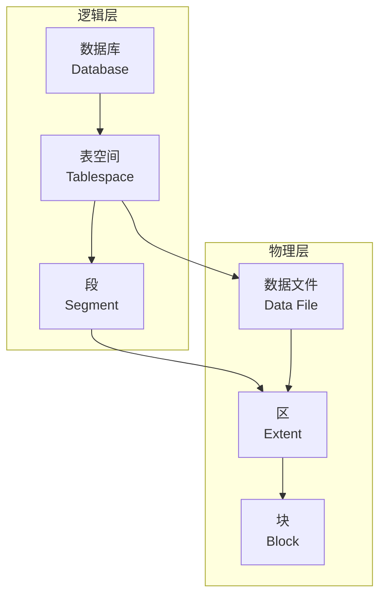
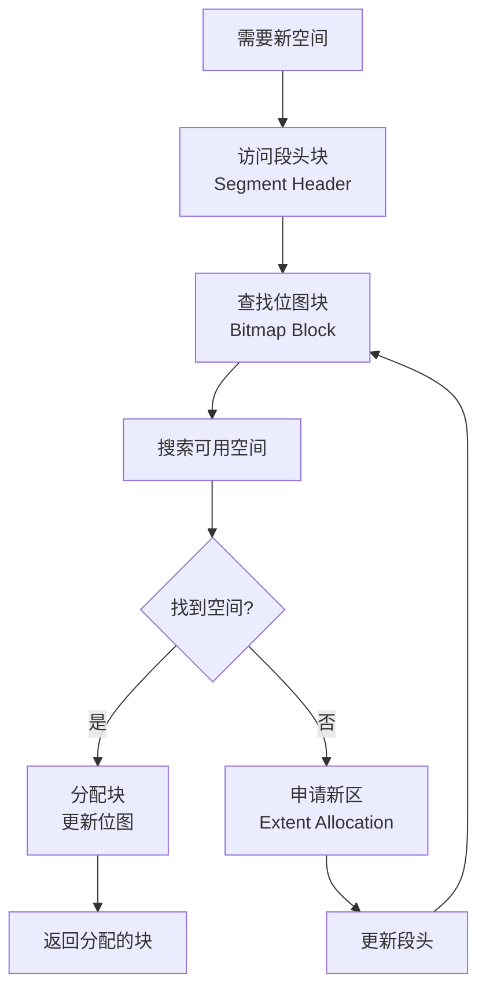
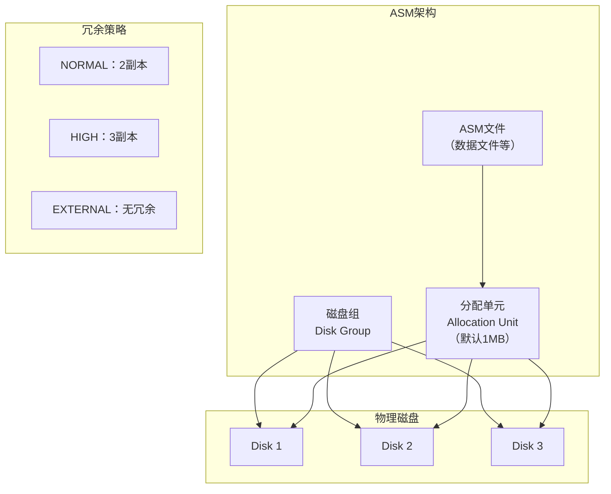

# Oracle磁盘空间管理

## 一、概述

### 1.1 一句话定义

Oracle磁盘空间管理是数据库内核中负责数据文件空间分配、回收和组织的核心子系统，通过位图块、段头管理和ASM等技术实现高效的空间利用。
它在数据写入和段扩展中出现和使用，解决数据在磁盘上如何组织和存储的问题。

### 1.2 为什么重要

- **不掌握的后果：** 无法诊断空间碎片问题，无法优化存储性能
- **掌握的价值：** 深入理解Oracle存储层次，有效管理空间分配

### 1.3 适用场景

| 场景 | 说明 |
|------|------|
| 空间碎片诊断 | 分析和解决空间碎片 |
| ASSM调优 | 优化自动段空间管理 |
| ASM管理 | 管理自动存储管理 |
| 存储性能优化 | 优化空间分配性能 |

### 1.4 版本演进

| 版本 | 变化说明 |
|------|---------|
| 11gR2 | ASSM增强，大文件表空间 |
| 12cR1 | 多租户空间隔离 |
| 12cR2 | ASM Flex磁盘组 |
| 19c | 自动数据优化（ADO）增强 |
| 21c | 自动存储管理自适应 |

## 二、术语与概念

### 2.1 核心术语表

| 术语 | 含义 | 类比 |
|------|------|------|
| Tablespace | 表空间 | 逻辑存储容器 |
| Data File | 数据文件 | 物理存储文件 |
| Extent | 区 | 连续块集合 |
| Block | 块 | 最小I/O单位 |
| Segment | 段 | 对象的存储空间 |
| Bitmap Block | 位图块 | 空间使用地图 |
| ASSM | 自动段空间管理 | 自动空间管家 |
| ASM | 自动存储管理 | 卷管理器 |
| HWM | 高水位线 | 已使用上限 |
| PCTFREE | 保留空间比 | 预留更新空间 |

### 2.2 空间层次结构



## 三、核心原理

### 3.1 空间分配机制

Oracle空间分配从段头（Segment Header）开始：



### 3.2 位图块管理（ASSM）

ASSM使用多级位图管理块空间：

```
位图块层级：
├── Level 1 Bitmap Blocks（一级位图块）
│   ├── 每个位图块管理约 8000 个数据块
│   ├── 每2位表示一个块的空间状态
│   └── 状态：0=0-25%满, 1=25-50%满, 2=50-75%满, 3=75-100%满
├── Level 2 Bitmap Blocks（二级位图块）
│   └── 管理一级位图块的汇总信息
└── Segment Header（段头）
    └── 管理二级位图块的汇总信息
```

```sql
-- 查看段的位图块信息
SELECT segment_name, segment_type, header_file, header_block
FROM dba_segments
WHERE segment_name = 'EMPLOYEES';

-- 查看段的空间使用情况
SELECT * FROM DBA_EXTENTS WHERE segment_name = 'EMPLOYEES';

-- 使用DBMS_SPACE分析空间使用
DECLARE
    v_unformatted_blocks NUMBER;
    v_unformatted_bytes NUMBER;
    v_fs1_blocks NUMBER; v_fs1_bytes NUMBER;
    v_fs2_blocks NUMBER; v_fs2_bytes NUMBER;
    v_fs3_blocks NUMBER; v_fs3_bytes NUMBER;
    v_fs4_blocks NUMBER; v_fs4_bytes NUMBER;
    v_full_blocks NUMBER; v_full_bytes NUMBER;
BEGIN
    DBMS_SPACE.SPACE_USAGE(
        segment_owner => 'HR',
        segment_name => 'EMPLOYEES',
        segment_type => 'TABLE',
        unformatted_blocks => v_unformatted_blocks,
        unformatted_bytes => v_unformatted_bytes,
        fs1_blocks => v_fs1_blocks, fs1_bytes => v_fs1_bytes,
        fs2_blocks => v_fs2_blocks, fs2_bytes => v_fs2_bytes,
        fs3_blocks => v_fs3_blocks, fs3_bytes => v_fs3_bytes,
        fs4_blocks => v_fs4_blocks, fs4_bytes => v_fs4_bytes,
        full_blocks => v_full_blocks, full_bytes => v_full_bytes
    );
    DBMS_OUTPUT.PUT_LINE('Full blocks: ' || v_full_blocks);
    DBMS_OUTPUT.PUT_LINE('FS1 (0-25%): ' || v_fs1_blocks);
    DBMS_OUTPUT.PUT_LINE('FS2 (25-50%): ' || v_fs2_blocks);
    DBMS_OUTPUT.PUT_LINE('FS3 (50-75%): ' || v_fs3_blocks);
    DBMS_OUTPUT.PUT_LINE('FS4 (75-100%): ' || v_fs4_blocks);
END;
/
```

### 3.3 区分配策略

```sql
-- 区管理方式
-- 1. AUTOALLOCATE：系统自动管理区大小（默认）
-- 2. UNIFORM：统一区大小

-- 创建表空间指定区管理
CREATE TABLESPACE app_data
    DATAFILE '/u01/oradata/app_data01.dbf' SIZE 1G
    EXTENT MANAGEMENT LOCAL AUTOALLOCATE;

CREATE TABLESPACE app_data_uniform
    DATAFILE '/u01/oradata/app_data02.dbf' SIZE 1G
    EXTENT MANAGEMENT LOCAL UNIFORM SIZE 1M;

-- 区分配过程（AUTOALLOCATE）
-- 初始区：64KB（8个块，假设8K块）
-- 增长序列：64KB → 1MB → 8MB → 64MB
```

### 3.4 ASM存储管理



```sql
-- ASM管理命令
-- 查看磁盘组
SELECT name, state, type, total_mb, free_mb, 
       ROUND(free_mb/total_mb*100, 2) AS free_pct
FROM v$asm_diskgroup;

-- 查看磁盘
SELECT group_number, disk_number, name, 
       total_mb, free_mb, path
FROM v$asm_disk;

-- 查看ASM文件
SELECT group_number, file_number, bytes/1024/1024 AS mb,
       type, redundancy
FROM v$asm_file
WHERE type = 'DATAFILE';

-- 创建磁盘组
CREATE DISKGROUP data NORMAL REDUNDANCY
    DISK '/dev/oracle/data1', '/dev/oracle/data2'
    ATTRIBUTE 'compatible.asm' = '19.0',
              'compatible.rdbms' = '19.0',
              'au_size' = '4M';
```

## 四、架构与组件

### 4.1 空间碎片分析

```sql
-- 表空间碎片诊断
SELECT tablespace_name,
       ROUND(SQRT(MAX(bytes)/SUM(bytes)) * 
       (100/SQRT(SQRT(COUNT(bytes)))) * 100, 2) AS fragmentation_index
FROM dba_free_space
GROUP BY tablespace_name
ORDER BY fragmentation_index DESC;

-- 查看表空间使用情况
SELECT tablespace_name,
       ROUND(total_mb) AS total_mb,
       ROUND(free_mb) AS free_mb,
       ROUND(used_mb) AS used_mb,
       ROUND(100 - (free_mb/total_mb*100), 2) AS used_pct
FROM (
    SELECT a.tablespace_name,
           a.bytes/1024/1024 AS total_mb,
           b.bytes/1024/1024 AS free_mb,
           (a.bytes - b.bytes)/1024/1024 AS used_mb
    FROM dba_data_files a
    LEFT JOIN (SELECT tablespace_name, SUM(bytes) bytes FROM dba_free_space GROUP BY tablespace_name) b
    ON a.tablespace_name = b.tablespace_name
    GROUP BY a.tablespace_name, a.bytes, b.bytes
)
ORDER BY used_pct DESC;

-- 段级碎片分析
SELECT owner, segment_name, segment_type,
       bytes/1024/1024 AS mb,
       extents, blocks
FROM dba_segments
WHERE owner = 'HR'
ORDER BY bytes DESC
FETCH FIRST 20 ROWS ONLY;
```

### 4.2 高水位线（HWM）管理

```sql
-- 查看表的HWM
SELECT segment_name, blocks, empty_blocks, num_rows
FROM dba_tables
WHERE owner = 'HR' AND table_name = 'EMPLOYEES';

-- 查看段的空间使用详情
SELECT segment_name,
       bytes/1024/1024 AS total_mb,
       blocks,
       num_rows,
       avg_row_len,
       blocks * 8192 / NULLIF(num_rows * avg_row_len, 0) AS space_amplification
FROM dba_segments s
JOIN dba_tables t ON s.segment_name = t.table_name AND s.owner = t.owner
WHERE s.owner = 'HR'
ORDER BY bytes DESC;

-- 回收HWM以下空间
-- 方法1：ALTER TABLE SHRINK
ALTER TABLE employees ENABLE ROW MOVEMENT;
ALTER TABLE employees SHRINK SPACE;

-- 方法2：ALTER TABLE MOVE（需要重建索引）
ALTER TABLE employees MOVE TABLESPACE app_data;
```

## 五、配置与调优

### 5.1 关键参数

```sql
-- 空间管理相关参数
SHOW PARAMETER db_create_file_dest;        -- OMF文件位置
SHOW PARAMETER db_file_multiblock_read_count; -- 多块读次数
SHOW PARAMETER db_block_size;              -- 标准块大小

-- ASM相关参数
SHOW PARAMETER asm_diskstring;             -- ASM磁盘发现路径
SHOW PARAMETER asm_power_limit;            -- ASM操作并行度
```

### 5.2 性能优化策略

| 问题 | 诊断方法 | 解决方案 |
|------|---------|---------|
| 空间碎片严重 | 碎片指数查询 | 重建表空间或SHRINK |
| 区分配争用 | ST/enqueue等待 | 使用ASSM |
| ASM重平衡慢 | v$asm_operation | 调整asm_power_limit |
| 段增长频繁 | DBA_EXTENTS监控 | 调整NEXT大小 |
| HWM过高 | 空间使用分析 | SHRINK或MOVE |

## 六、DFX能力

### 6.1 监控命令

```sql
-- 表空间使用实时监控
SELECT tablespace_name, 
       ROUND(used_space * 8192 / 1024/1024/1024, 2) AS used_gb,
       ROUND(tablespace_size * 8192 / 1024/1024/1024, 2) AS total_gb,
       ROUND(used_percent, 2) AS used_pct
FROM dba_tablespace_usage_metrics
ORDER BY used_percent DESC;

-- ASM磁盘组监控
SELECT name, total_mb, free_mb, 
       required_mirror_free_mb,
       usable_file_mb
FROM v$asm_diskgroup;

-- 空间增长趋势
SELECT tablespace_name, 
       snap_time,
       used_space_delta_mb
FROM dba_hist_tbspc_space_usage
WHERE snap_time > SYSDATE - 30
ORDER BY snap_time DESC;
```

## 七、实战案例

### 7.1 案例一：ASSM空间碎片解决

**问题**：表空间使用率80%但无法分配新区

```sql
-- 诊断
SELECT tablespace_name, 
       COUNT(*) AS free_extents,
       MAX(bytes)/1024/1024 AS max_free_mb,
       SUM(bytes)/1024/1024 AS total_free_mb
FROM dba_free_space
WHERE tablespace_name = 'APP_DATA'
GROUP BY tablespace_name;
-- 结果：100个空闲区，最大仅1MB，总计5GB → 碎片严重

-- 解决方案：合并空闲空间或重建
ALTER TABLESPACE app_data COALESCE;  -- 合并相邻空闲空间
-- 或重建表空间
```

### 7.2 案例二：ASM磁盘组扩容

```sql
-- 查看当前磁盘组
SELECT name, total_mb, free_mb FROM v$asm_diskgroup;

-- 添加新磁盘
ALTER DISKGROUP data ADD DISK '/dev/oracle/data3' NAME data3;

-- 监控重平衡进度
SELECT group_number, operation, state, 
       power, actual, sofar, est_work, est_rate
FROM v$asm_operation;
```

## 八、常见错误与排查

| 问题 | 原因 | 解决方案 |
|------|------|---------|
| ORA-01653 | 表空间无法扩展 | 添加数据文件或启用自动扩展 |
| ORA-01654 | 区无法分配 | 检查碎片和空间 |
| ORA-15041 | ASM空间不足 | 扩容磁盘组 |
| ORA-03296 | 表空间无连续空间 | COALESCE或重建 |

## 九、最佳实践

- 使用ASSM（自动段空间管理）管理所有新表空间
- 使用大文件表空间（Bigfile Tablespace）简化管理
- 定期监控表空间使用率和碎片指数
- ASM使用NORMAL REDUNDANCY保障数据安全
- 设置数据文件AUTOEXTEND并设置合理的MAXSIZE
- 使用ADO（自动数据优化）实现分层存储

## 十、命令与视图汇总

| 命令/视图 | 用途 |
|-----------|------|
| `dba_tablespaces` | 表空间信息 |
| `dba_data_files` | 数据文件信息 |
| `dba_free_space` | 空闲空间信息 |
| `dba_segments` | 段信息 |
| `dba_extents` | 区信息 |
| `v$asm_diskgroup` | ASM磁盘组 |
| `v$asm_disk` | ASM磁盘 |
| `DBMS_SPACE.SPACE_USAGE` | 空间使用分析 |
| `DBA_TABLESPACE_USAGE_METRICS` | 表空间使用指标 |

## 十一、总结速查

| 组件 | 功能 | 关键点 |
|------|------|--------|
| 位图块 | 跟踪块使用状态 | 2位/块，4种状态 |
| ASSM | 自动段空间管理 | 替代Free List |
| ASM | 自动存储管理 | 条带化+镜像 |
| HWM | 高水位线 | 标记已使用上限 |
| 区管理 | 空间分配单位 | AUTOALLOCATE vs UNIFORM |

## 附录

### A. 空间分配流程

```
INSERT请求 → 段头查找 → 位图块搜索
├── 找到空间（>PCTFREE） → 直接插入
├── 找到空间（<PCTFREE） → 跳过
└── 无空间 → 分配新区 → 更新位图 → 插入
```
