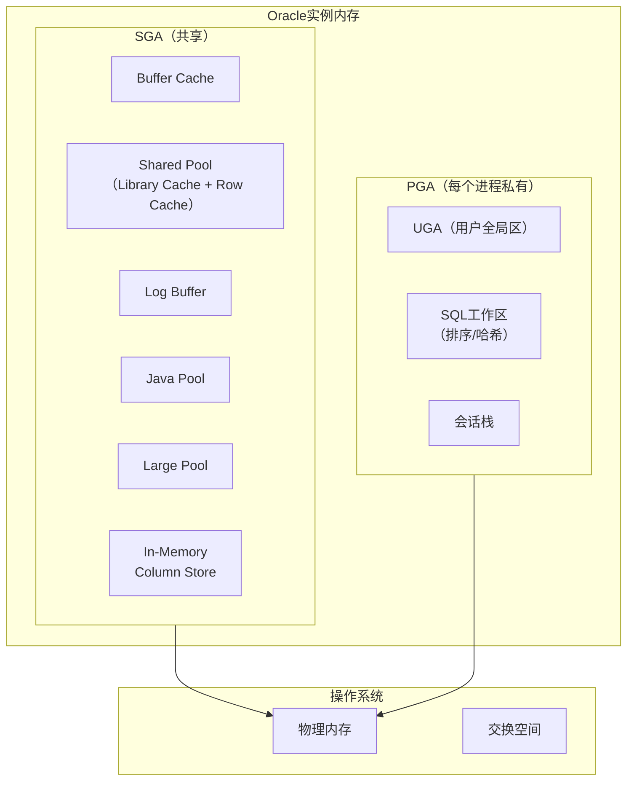
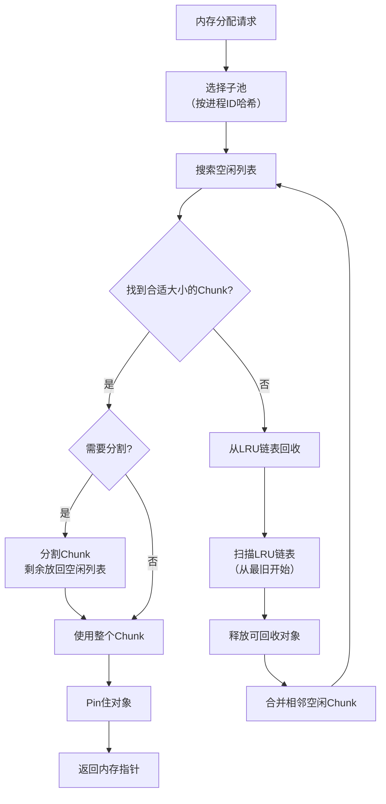
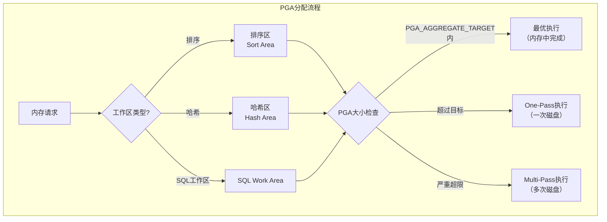
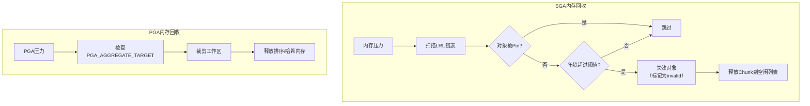

# Oracle内存分配与回收

## 一、概述

### 1.1 一句话定义

Oracle内存分配与回收是管理SGA和PGA中内存的申请、使用、释放和回收的内核机制，通过LRU算法、内存池管理和自动内存管理（AMM）实现高效内存利用。
它在所有数据库操作中出现和使用，解决内存资源的高效分配和及时回收问题。

### 1.2 为什么重要

- **不掌握的后果：** 无法诊断内存泄漏、OOM问题，无法优化内存使用效率
- **掌握的价值：** 深入理解Oracle内存管理机制，有效处理内存压力

### 1.3 适用场景

| 场景 | 说明 |
|------|------|
| 内存压力诊断 | 分析内存不足原因 |
| PGA调优 | 优化排序和哈希内存 |
| 共享池管理 | 减少ORA-04031 |
| OOM处理 | 解决系统内存不足 |

### 1.4 版本演进

| 版本 | 变化说明 |
|------|---------|
| 11gR2 | 自动内存管理（AMM）增强 |
| 12cR1 | SGA/PGA自动管理改进 |
| 12cR2 | 大页内存优化 |
| 19c | 自动内存调优增强 |
| 21c | 自适应内存管理 |

## 二、术语与概念

### 2.1 核心术语表

| 术语 | 含义 | 类比 |
|------|------|------|
| SGA | 系统全局区 | 共享内存池 |
| PGA | 程序全局区 | 进程私有内存 |
| Shared Pool | 共享池 | SQL缓存区 |
| LRU | 最近最少使用 | 淘汰策略 |
| Heap | 堆 | 动态内存区 |
| Subpool | 子池 | 共享池分区 |
| Extent | 内存扩展 | 内存分配块 |
| Chunk | 内存块 | 最小分配单位 |
| AMM | 自动内存管理 | 自动调优 |
| HugePages | 大页 | 减少TLB miss |

### 2.2 Oracle内存架构



## 三、核心原理

### 3.1 共享池内存管理

共享池使用LRU算法管理内存：



### 3.2 共享池子池（Subpool）

```sql
-- 子池用于减少共享池Latch争用
-- 每个CPU最多一个子池（最多7个）

-- 查看子池信息
SELECT pool, name, bytes/1024/1024 AS mb
FROM v$sgastat
WHERE pool = 'shared pool'
AND name LIKE '%free%'
ORDER BY bytes DESC;

-- 查看子池Latch争用
SELECT child#, gets, misses, sleeps
FROM v$latch_children
WHERE name = 'shared pool'
ORDER BY sleeps DESC;

-- 手动设置子池数（谨慎使用）
-- ALTER SYSTEM SET "_kghdsidx_count" = 4 SCOPE=SPFILE;
```

### 3.3 PGA内存分配



```sql
-- 查看PGA使用
SELECT name, value/1024/1024 AS mb
FROM v$pgastat
WHERE name IN (
    'aggregate PGA target parameter',
    'aggregate PGA auto target',
    'total PGA allocated',
    'total PGA used for auto workareas',
    'maximum PGA allocated',
    'over allocation count'
);

-- 查看PGA工作区统计
SELECT operation_type, policy,
       last_memory_used/1024/1024 AS mem_mb,
       last_execution,
       optimal_executions, onepass_executions, multipasses_executions
FROM v$sql_workarea_histogram
WHERE optimal_executions + onepass_executions + multipasses_executions > 0
ORDER BY last_memory_used DESC
FETCH FIRST 20 ROWS ONLY;
```

### 3.4 内存回收机制



### 3.5 自动内存管理（AMM）

```sql
-- AMM自动在SGA和PGA之间分配内存
SHOW PARAMETER memory_target;
SHOW PARAMETER memory_max_target;

-- 查看AMM动态调整
SELECT component, current_size/1024/1024 AS current_mb,
       min_size/1024/1024 AS min_mb,
       max_size/1024/1024 AS max_mb,
       last_oper_type
FROM v$memory_dynamic_components;

-- 查看SGA动态调整
SELECT component, current_size/1024/1024 AS current_mb,
       last_oper_type, last_oper_mode
FROM v$sga_dynamic_components;
```

## 四、架构与组件

### 4.1 内存分配器层次

```
内存分配层次：
├── OS层：mmap/malloc系统调用
├── SGA层
│   ├── SGA Heap（顶层堆）
│   │   ├── Shared Pool Subpool 0..N
│   │   │   ├── Heap（子堆）
│   │   │   │   ├── Chunk（最小分配单位）
│   │   │   │   │   ├── Free Chunk
│   │   │   │   │   ├── Allocated Chunk（SQL、PL/SQL、字典缓存）
│   │   │   │   │   └── Recreatable Chunk（可重建）
│   │   │   │   └── Extent（Chunk集合）
│   │   │   └── LRU List
│   │   └── Buffer Cache
│   └── Large Pool / Java Pool
└── PGA层
    └── PGA Heap
        ├── UGA（会话内存）
        └── Call Heap（调用级内存）
```

### 4.2 内存压力检测

```sql
-- 检测SGA内存压力
SELECT name, value FROM v$sgainfo
WHERE name IN ('Maximum SGA Size', 'Granule Size');

-- 检测共享池碎片
SELECT ROUND(100 * (1 - COUNT(DECODE(bytes, 1, 1)) / COUNT(*)), 2) AS fragmentation_pct
FROM x$ksmsp
WHERE ksmchcom = 'free memory'
AND ksmchsiz > 4096;

-- 检测PGA超限
SELECT name, value FROM v$pgastat
WHERE name = 'over allocation count';
-- 如果 > 0，说明PGA不够用

-- 检测内存泄漏
SELECT pool, name, bytes/1024/1024 AS mb
FROM v$sgastat
WHERE bytes > 100 * 1024 * 1024  -- > 100MB
ORDER BY bytes DESC;
```

## 五、配置与调优

### 5.1 关键参数

```sql
-- 内存管理参数
SHOW PARAMETER memory_target;          -- AMM总目标
SHOW PARAMETER memory_max_target;      -- AMM最大限制
SHOW PARAMETER sga_target;             -- SGA目标（非AMM时）
SHOW PARAMETER sga_max_size;           -- SGA最大
SHOW PARAMETER pga_aggregate_target;   -- PGA目标
SHOW PARAMETER pga_aggregate_limit;    -- PGA硬限制
SHOW PARAMETER shared_pool_size;       -- 共享池大小
SHOW PARAMETER db_cache_size;          -- Buffer Cache大小
SHOW PARAMETER large_pool_size;        -- 大池大小
```

### 5.2 大页内存配置

```sql
-- Linux大页配置（减少TLB miss）
-- 1. 计算需要的大页数
-- SGA大小 / 大页大小(2MB) + 余量
-- 例如：SGA=16GB → 16384/2 + 10 = 8202

-- 2. 系统配置
-- echo 8202 > /proc/sys/vm/nr_hugepages

-- 3. Oracle参数
ALTER SYSTEM SET USE_LARGE_PAGES = ONLY SCOPE=SPFILE;

-- 4. 验证
SELECT * FROM v$sgainfo WHERE name LIKE '%Large%';
```

### 5.3 性能调优策略

| 问题 | 诊断方法 | 解决方案 |
|------|---------|---------|
| ORA-04031 | 共享池碎片 | 固定大SQL、使用KEEP |
| PGA超限 | over allocation count > 0 | 增大pga_aggregate_target |
| SGA频繁调整 | v$memory_dynamic_components | 设置最小值 |
| OOM Killer | OS日志 | 使用大页、锁定SGA |
| 内存泄漏 | v$sgastat增长趋势 | 重启+补丁 |

## 六、DFX能力

### 6.1 监控命令

```sql
-- 内存使用总览
SELECT component, current_size/1024/1024 AS current_mb,
       min_size/1024/1024 AS min_mb,
       max_size/1024/1024 AS max_mb
FROM v$memory_dynamic_components
ORDER BY current_size DESC;

-- 共享池详细统计
SELECT name, bytes/1024/1024 AS mb
FROM v$sgastat
WHERE pool = 'shared pool'
AND bytes > 10 * 1024 * 1024
ORDER BY bytes DESC;

-- PGA per process
SELECT p.spid, s.username, p.pga_alloc_mem/1024/1024 AS pga_alloc_mb,
       p.pga_used_mem/1024/1024 AS pga_used_mb,
       p.pga_max_mem/1024/1024 AS pga_max_mb
FROM v$process p
JOIN v$session s ON p.addr = s.paddr
WHERE s.type = 'USER'
ORDER BY p.pga_alloc_mem DESC
FETCH FIRST 20 ROWS ONLY;
```

## 七、实战案例

### 7.1 案例一：ORA-04031共享池内存不足

```sql
-- 诊断
SELECT * FROM v$sgastat WHERE pool = 'shared pool' ORDER BY bytes DESC;
-- 发现大量free memory碎片

-- 解决方案1：增大共享池
ALTER SYSTEM SET shared_pool_size = 2G SCOPE=BOTH;

-- 解决方案2：固定重要SQL
EXEC DBMS_SHARED_POOL.KEEP('SQL_ID或NAME', 'Q');

-- 解决方案3：刷新共享池（影响大，谨慎）
-- ALTER SYSTEM FLUSH SHARED_POOL;
```

### 7.2 案例二：PGA内存超限

```sql
-- 诊断
SELECT name, value FROM v$pgastat WHERE name = 'over allocation count';
-- over allocation count > 0

-- 查看哪些会话消耗最多PGA
SELECT s.sid, s.username, s.program,
       p.pga_alloc_mem/1024/1024 AS alloc_mb
FROM v$process p JOIN v$session s ON p.addr = s.paddr
WHERE p.pga_alloc_mem > 500 * 1024 * 1024
ORDER BY p.pga_alloc_mem DESC;

-- 解决方案
ALTER SYSTEM SET pga_aggregate_target = 4G SCOPE=BOTH;
ALTER SYSTEM SET pga_aggregate_limit = 8G SCOPE=BOTH;
```

## 八、常见错误与排查

| 问题 | 原因 | 解决方案 |
|------|------|---------|
| ORA-04031 | 共享池内存不足 | 增大shared_pool_size |
| ORA-04030 | PGA进程内存不足 | 增大OS内存或PGA |
| OOM Killer | 系统内存耗尽 | 使用大页、锁定SGA |
| ORA-00093 | _shared_pool_reserved_min_alloc | 调整保留参数 |

## 九、最佳实践

- 使用AMM（memory_target）自动管理内存分配
- 对生产系统使用大页（HugePages）减少TLB miss
- 设置pga_aggregate_limit防止单个进程消耗过多内存
- 使用DBMS_SHARED_POOL.KEEP固定关键SQL
- 定期监控v$sgastat和v$pgastat发现异常增长
- 在Linux上配置LOCK_SGA避免SGA被交换到磁盘

## 十、命令与视图汇总

| 命令/视图 | 用途 |
|-----------|------|
| `v$sgainfo` | SGA基本信息 |
| `v$sgastat` | SGA详细统计 |
| `v$sga_dynamic_components` | SGA动态组件 |
| `v$pgastat` | PGA统计 |
| `v$memory_dynamic_components` | AMM动态组件 |
| `v$latch_children` | 子Latch统计 |
| `DBMS_SHARED_POOL.KEEP` | 固定共享池对象 |
| `ALTER SYSTEM FLUSH SHARED_POOL` | 清空共享池 |

## 十一、总结速查

| 组件 | 功能 | 调优关键 |
|------|------|---------|
| 共享池 | SQL和字典缓存 | 减少碎片、固定大SQL |
| Buffer Cache | 数据块缓存 | 命中率、LRU效率 |
| PGA | 进程私有内存 | 排序/哈希性能 |
| AMM | 自动内存管理 | 合理设置target |
| 大页 | 减少TLB miss | 生产环境必配 |

## 附录

### A. 内存分配流程

```
内存请求 → 选择堆（SGA/PGA） → 计算大小
├── 有空闲Chunk → 直接分配
├── 需要分割 → 分割后分配
└── 无空间 → LRU回收 → 合并空闲 → 分配
    └── 回收失败 → 返回错误（ORA-04031等）
```
