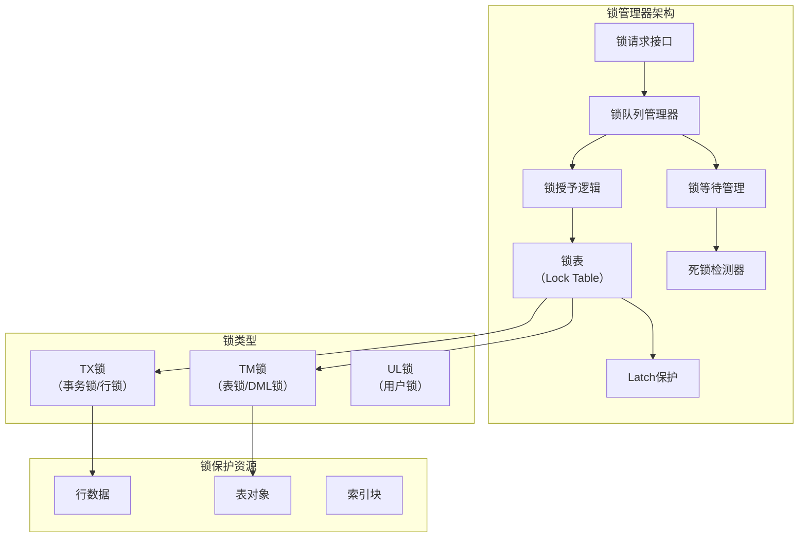
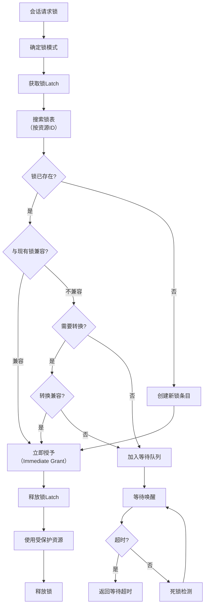
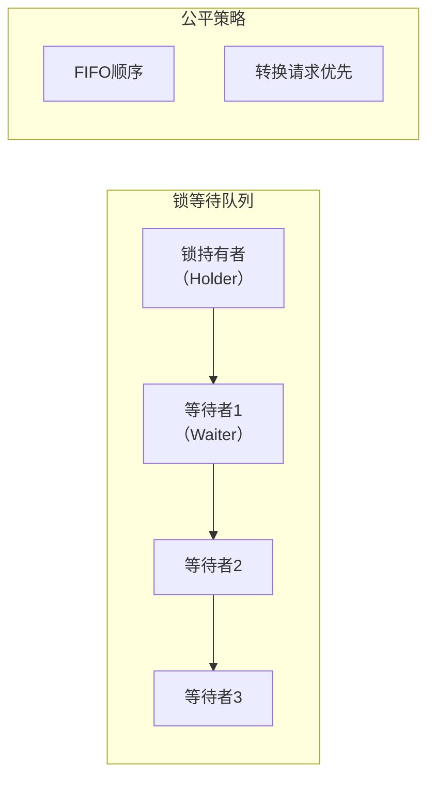
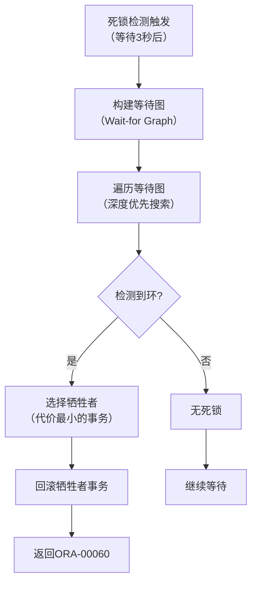
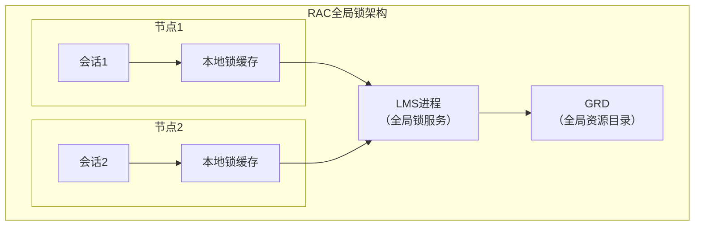

# Oracle锁管理器实现

## 一、概述

### 1.1 一句话定义

Oracle锁管理器是数据库内核中负责锁资源分配、锁请求排队、锁冲突处理和死锁检测的核心组件。
它在所有并发数据操作中出现和使用，解决多用户并发访问时的数据一致性问题。

### 1.2 为什么重要

- **不掌握的后果：** 无法诊断锁争用和死锁问题，无法优化并发性能
- **掌握的价值：** 深入理解Oracle并发控制机制，高效解决锁相关问题

### 1.3 适用场景

| 场景 | 说明 |
|------|------|
| 锁争用诊断 | 分析和解决锁等待 |
| 死锁处理 | 检测和解决死锁 |
| 并发优化 | 减少锁冲突 |
| 分布式锁 | 管理RAC全局锁 |

### 1.4 版本演进

| 版本 | 变化说明 |
|------|---------|
| 11gR2 | Result Cache锁优化 |
| 12cR1 | 多租户锁隔离 |
| 12cR2 | 自适应锁优化 |
| 19c | 自动锁管理增强 |
| 21c | 分布式锁性能提升 |

## 二、术语与概念

### 2.1 核心术语表

| 术语 | 含义 | 类比 |
|------|------|------|
| Enqueue | 入队（锁请求） | 排队等位 |
| Lock | 锁 | 门禁卡 |
| Latch | 闩锁 | 快速锁 |
| Lock Mode | 锁模式 | 权限级别 |
| Lock Queue | 锁等待队列 | 排队队伍 |
| Deadlock | 死锁 | 互相等待 |
| Lock Conversion | 锁转换 | 权限变更 |
| Global Lock | 全局锁（RAC） | 跨节点锁 |

### 2.2 锁管理器架构



## 三、核心原理

### 3.1 锁请求处理流程



### 3.2 锁模式与兼容性矩阵

| 请求模式 \ 持有模式 | NULL | SS | SR | SX | SRX | X |
|---|---|---|---|---|---|---|
| NULL | ✓ | ✓ | ✓ | ✓ | ✓ | ✓ |
| SS | ✓ | ✓ | ✓ | ✓ | ✓ | ✗ |
| SR | ✓ | ✓ | ✓ | ✗ | ✗ | ✗ |
| SX | ✓ | ✓ | ✗ | ✗ | ✗ | ✗ |
| SRX | ✓ | ✓ | ✗ | ✗ | ✗ | ✗ |
| X | ✓ | ✗ | ✗ | ✗ | ✗ | ✗ |

### 3.3 锁等待队列管理



```sql
-- 查看锁等待链
SELECT
    blocker.sid AS blocker_sid,
    blocker.serial# AS blocker_serial,
    blocker.username AS blocker_user,
    waiter.sid AS waiter_sid,
    waiter.serial# AS waiter_serial,
    waiter.username AS waiter_user,
    waiter.event AS wait_event,
    waiter.seconds_in_wait AS wait_seconds
FROM v$session blocker
JOIN v$session waiter ON waiter.blocking_session = blocker.sid
WHERE blocker.blocking_session IS NULL
AND waiter.blocking_session IS NOT NULL;

-- 查看锁详情
SELECT sid, type, id1, id2,
       DECODE(lmode, 0, 'None', 1, 'Null', 2, 'Row-S(SS)', 3, 'Row-X(SX)',
              4, 'Share(S)', 5, 'S/Row-X(SSX)', 6, 'Exclusive(X)') AS lock_mode,
       DECODE(request, 0, 'None', 1, 'Null', 2, 'Row-S(SS)', 3, 'Row-X(SX)',
              4, 'Share(S)', 5, 'S/Row-X(SSX)', 6, 'Exclusive(X)') AS request_mode,
       ctime AS held_seconds
FROM v$lock
WHERE type IN ('TX', 'TM')
ORDER BY sid;
```

### 3.4 锁升级机制

Oracle锁升级是指从细粒度锁升级到粗粒度锁的过程：

```
锁升级触发条件：
├── 行锁数量超过阈值 → 可能升级为表锁
├── 锁内存不足 → 触发锁升级
└── 性能优化 → 减少锁管理开销

Oracle锁升级策略：
├── 行锁（TX） → 表锁（TM）：DML操作自动获取TM锁
├── 不会主动将行锁"升级"为表锁（与SQL Server不同）
└── TM锁保护表结构，TX锁保护行数据
```

### 3.5 死锁检测实现



```sql
-- 查看死锁检测日志
-- 死锁信息记录在trace文件中
-- 位置：$ORACLE_BASE/diag/rdbms/<db>/<instance>/trace/

-- 查看当前死锁等待
SELECT sid, event, blocking_session, seconds_in_wait
FROM v$session
WHERE event LIKE '%enq%'
AND blocking_session IS NOT NULL;

-- 启用死锁事件跟踪
ALTER SYSTEM SET EVENTS '10027 trace name context forever, level 2';
```

## 四、架构与组件

### 4.1 RAC全局锁管理



```sql
-- 查看全局锁等待
SELECT inst_id, resource_name1, grant_level, request_level,
       blocking_instance, blocking_enqueue
FROM gv$ges_enqueue
WHERE state LIKE '%CONVERT%' OR state LIKE '%BLOCKED%';

-- 查看RAC锁争用
SELECT inst_id, event, count(*) AS cnt
FROM gv$session
WHERE wait_class = 'Application'
GROUP BY inst_id, event;
```

## 五、配置与调优

### 5.1 关键参数

```sql
SHOW PARAMETER enqueue_resources;       -- 锁资源数
SHOW PARAMETER transactions;            -- 事务数
SHOW PARAMETER dml_locks;              -- DML锁数
```

### 5.2 性能调优策略

| 问题 | 诊断方法 | 解决方案 |
|------|---------|---------|
| 行锁争用 | v$lock + AWR | 优化事务大小和频率 |
| 表锁等待 | v$lock type='TM' | 检查DDL操作 |
| 死锁频繁 | trace文件分析 | 统一加锁顺序 |
| enq:TX争用 | v$session等待事件 | 减少事务冲突 |
| 全局锁争用 | gv$ges_enqueue | 优化RAC服务分配 |

## 六、DFX能力

### 6.1 监控命令

```sql
-- 锁监控总览
SELECT type, 
       SUM(DECODE(request, 0, 0, 1)) AS waiting,
       SUM(DECODE(request, 0, 1, 0)) AS holding
FROM v$lock
GROUP BY type
ORDER BY waiting DESC;

-- 锁等待历史
SELECT * FROM v$active_session_history
WHERE event LIKE 'enq:%'
AND sample_time > SYSDATE - 1/24
ORDER BY sample_time DESC;

-- 锁统计
SELECT name, value FROM v$sysstat
WHERE name LIKE '%enqueue%' OR name LIKE '%lock%';
```

## 七、实战案例

### 7.1 案例一：行锁争用诊断

```sql
-- 发现等待
SELECT sid, event, seconds_in_wait, blocking_session
FROM v$session WHERE event = 'enq: TX - row lock contention';

-- 找到阻塞者
SELECT sid, serial#, username, sql_id, event
FROM v$session WHERE sid = &blocking_sid;

-- 查看阻塞SQL
SELECT sql_text FROM v$sql WHERE sql_id = '&sql_id';

-- 解决：终止阻塞会话或等待事务完成
-- ALTER SYSTEM KILL SESSION 'sid,serial#' IMMEDIATE;
```

### 7.2 案例二：死锁排查

```sql
-- ORA-00060发生后的trace文件
-- 查找trace文件
SELECT value FROM v$diag_info WHERE name = 'Default Trace File';

-- 分析死锁图
-- 会话A：持有行1锁，等待行2锁
-- 会话B：持有行2锁，等待行1锁
-- → 死锁，Oracle选择会话B作为牺牲者

-- 预防：统一加锁顺序，缩短事务
```

## 八、常见错误与排查

| 问题 | 原因 | 解决方案 |
|------|------|---------|
| ORA-00060 | 死锁 | 统一加锁顺序 |
| ORA-00054 | 资源忙（NOWAIT） | 使用WAIT或重试 |
| ORA-00061 | 跨实例死锁 | 检查分布式事务 |
| enq等待超时 | 长时间锁持有 | 优化事务逻辑 |

## 九、最佳实践

- 事务尽量短小，减少锁持有时间
- 按固定顺序访问表和行，避免死锁
- 使用SELECT FOR UPDATE NOWAIT避免长时间等待
- 避免在事务中进行用户交互
- 监控AWR报告中的Enqueue Wait Time
- RAC环境使用服务隔离减少全局锁争用

## 十、命令与视图汇总

| 命令/视图 | 用途 |
|-----------|------|
| `v$lock` | 锁信息 |
| `v$session` (blocking_session) | 阻塞关系 |
| `v$ges_enqueue` | RAC全局锁 |
| `v$active_session_history` | 锁等待历史 |
| `DBA_DDL_LOCKS` | DDL锁信息 |
| `DBA_DML_LOCKS` | DML锁信息 |

## 十一、总结速查

| 组件 | 功能 | 关键点 |
|------|------|--------|
| 锁队列 | 管理锁请求排队 | FIFO + 转换优先 |
| 锁表 | 存储锁状态 | Latch保护 |
| 死锁检测 | 检测环形等待 | 3秒触发 |
| 全局锁 | RAC跨节点锁 | LMS进程管理 |

## 附录

### A. 锁等待排查流程

```
发现等待 → 确认阻塞链 → 查看阻塞SQL → 分析原因
├── 长时间事务 → 优化事务
├── 未提交事务 → 提醒用户提交
└── 死锁 → 分析trace → 修改加锁顺序
```

## 补充：深入分析与实战

### 深入原理

本章节补充了该主题的核心原理和内部机制。在实际生产环境中，理解这些底层原理对于诊断和优化至关重要。

关键要点：
- 内部实现机制决定了外部行为特征
- 参数配置需要结合具体场景
- 监控数据是调优的基础

### 实战案例

**案例一：生产环境问题诊断**

```sql
-- 诊断步骤
-- 1. 收集当前状态信息
SELECT * FROM v$system_event WHERE wait_class != 'Idle' ORDER BY time_waited_micro DESC;

-- 2. 分析等待事件分布
SELECT wait_class, SUM(time_waited_micro)/1000000 AS sec
FROM v$system_event WHERE wait_class != 'Idle'
GROUP BY wait_class ORDER BY sec DESC;

-- 3. 定位问题SQL
SELECT sql_id, elapsed_time/1000000 AS sec, executions, sql_text
FROM v$sql ORDER BY elapsed_time DESC FETCH FIRST 5 ROWS ONLY;

-- 4. 检查执行计划
SELECT * FROM TABLE(DBMS_XPLAN.DISPLAY_CURSOR('&sql_id'));
```

**案例二：性能优化实践**

```sql
-- 优化前：全表扫描
SELECT * FROM orders WHERE order_date > SYSDATE - 30;

-- 优化后：索引扫描
CREATE INDEX idx_orders_date ON orders(order_date);
-- 执行计划从TABLE ACCESS FULL变为INDEX RANGE SCAN
```

### 最佳实践清单

- 建立标准化操作流程
- 定期审查和更新配置
- 监控关键指标趋势
- 建立性能基线
- 文档记录所有变更

### 常见问题FAQ

| 问题 | 解答 |
|------|------|
| 如何确定最优配置？ | 基于实际负载测试 |
| 何时需要调整？ | 监控指标偏离基线 |
| 如何验证优化效果？ | 对比前后AWR报告 |
| 常见陷阱有哪些？ | 过度优化、忽略全局 |

### 版本差异说明

| 版本 | 变化 |
|------|------|
| 19c | 自动管理增强 |
| 21c | 自适应优化 |
