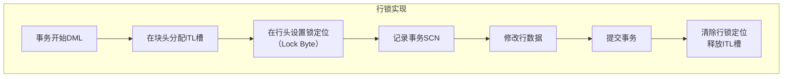
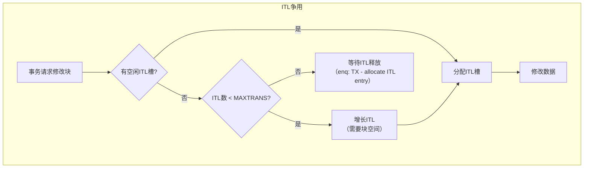

# Oracle锁实现机制深入

## 一、概述

### 1.1 一句话定义

Oracle锁实现机制是数据库内核中锁的物理存储结构、ITL槽管理、行锁和表锁的底层实现细节。
它在数据块的修改操作中出现和使用，解决锁如何在数据块级别存储和管理的问题。

### 1.2 为什么重要

- **不掌握的后果：** 无法理解锁的底层行为，无法诊断复杂的锁性能问题
- **掌握的价值：** 从内核层面理解锁机制，精准定位锁相关故障

### 1.3 适用场景

| 场景 | 说明 |
|------|------|
| ITL争用分析 | 诊断块级锁争用 |
| 行锁诊断 | 理解行锁的物理存储 |
| 表锁分析 | 理解TM锁实现 |
| 性能调优 | 优化锁相关性能 |

## 二、术语与概念

### 2.1 核心术语表

| 术语 | 含义 | 类比 |
|------|------|------|
| ITL | 感兴趣事务列表 | 块上的锁登记簿 |
| Interested Transaction | 感兴趣事务 | 正在修改块的会话 |
| Row Lock | 行锁 | 行级锁定标记 |
| TM Lock | 表级锁 | 表级保护 |
| Lock Vector | 锁向量 | 锁状态数组 |
| SCN | 系统变更号 | 事务时间戳 |
| Undo Block | 回滚块 | 旧版本数据 |

## 三、核心原理

### 3.1 ITL槽结构

每个数据块头部包含ITL（Interested Transaction List）：

```
数据块结构：
┌─────────────────────────────────────────┐
│ Block Header                            │
│ ┌─────────────────────────────────────┐ │
│ │ ITL[0]                              │ │
│ │ ├── UBA: Undo Block Address         │ │
│ │ ├── Flag: ----                      │ │
│ │ ├── FSCO/FSPO: SCN                  │ │
│ │ └── Transaction Slot                │ │
│ ├─────────────────────────────────────┤ │
│ │ ITL[1]                              │ │
│ │ ├── UBA, Flag, SCN                  │ │
│ │ └── Transaction Slot                │ │
│ ├─────────────────────────────────────┤ │
│ │ ... ITL[N] ...                      │ │
│ └─────────────────────────────────────┘ │
│ Row Directory                           │
│ ┌─────────────────────────────────────┐ │
│ │ Row 1 → ITL Slot #                  │ │
│ │ Row 2 → ITL Slot #                  │ │
│ │ ...                                  │ │
│ └─────────────────────────────────────┘ │
│ Row Data                                │
└─────────────────────────────────────────┘

INITRANS：初始ITL槽数量（默认2）
MAXTRANS：最大ITL槽数量（默认255）
```

```sql
-- 查看数据块的ITL信息
ALTER SYSTEM DUMP DATAFILE &file# BLOCK &block#;

-- 查看表的ITL设置
SELECT owner, table_name, ini_trans, max_trans
FROM dba_tables
WHERE owner = 'HR' AND table_name = 'EMPLOYEES';

-- 修改ITL设置
ALTER TABLE employees INITRANS 4;
ALTER TABLE employees MAXTRANS 255;
```

### 3.2 行锁的物理实现

Oracle行锁不是独立的内存结构，而是存储在数据块中：



```sql
-- 行锁定位
-- 每行数据的行头有一个Lock Byte
-- Lock Byte非零表示该行被锁定
-- Lock Byte的值指向ITL槽号

-- 查看行锁信息
SELECT dbms_rowid.rowid_create(1, data_object_id, file_id, block_id, slot_id) AS rid
FROM (
    SELECT do.data_object_id, e.file_id, e.block_id, 0 AS slot_id
    FROM dba_extents e
    JOIN dba_objects do ON e.segment_name = do.object_name
    WHERE do.object_name = 'EMPLOYEES' AND do.owner = 'HR'
    AND e.extent_id = 0
);

-- 转储数据块查看行锁
ALTER SYSTEM DUMP DATAFILE &file# BLOCK &block#;
-- 输出中的tl列显示行锁信息
-- tl=0: 未锁定
-- tl>0: 锁定，指向ITL槽
```

### 3.3 表锁（TM锁）实现

```sql
-- TM锁在DML操作时自动获取
-- 保护表结构不被DDL修改

-- 查看TM锁
SELECT sid, type, id1 AS object_id,
       DECODE(lmode, 0, 'None', 1, 'Null', 2, 'Row-S(SS)', 3, 'Row-X(SX)',
              4, 'Share(S)', 5, 'S/Row-X(SSX)', 6, 'Exclusive(X)') AS lock_mode,
       object_name
FROM v$lock l
LEFT JOIN dba_objects o ON l.id1 = o.object_id
WHERE type = 'TM';

-- DML操作获取的TM锁模式
-- INSERT: Row-X (SX)
-- UPDATE: Row-X (SX)
-- DELETE: Row-X (SX)
-- SELECT FOR UPDATE: Row-S (SS) + Row-X on rows
-- LOCK TABLE: 按指定模式
```

### 3.4 锁的内存数据结构

```
锁内存结构（v$lock对应）：
├── Lock State Object（锁状态对象）
│   ├── Lock Type (TX/TM/...)
│   ├── Lock ID1 (资源标识1)
│   ├── Lock ID2 (资源标识2)
│   ├── Lock Mode (持有模式)
│   ├── Request Mode (请求模式)
│   └── Ctime (持有时间)
├── Resource Object（资源对象）
│   ├── Resource Name
│   ├── Owner List（持有者链表）
│   └── Waiter List（等待者链表）
└── Session State Object（会话状态对象）
    ├── Session Lock Pointer
    └── Transaction Lock Pointer
```

### 3.5 锁性能影响分析

```sql
-- 分析锁性能
-- 1. 锁等待时间
SELECT event, total_waits, total_timeouts,
       time_waited / 100 AS time_waited_sec,
       average_wait * 10 AS avg_wait_ms
FROM v$system_event
WHERE event LIKE 'enq:%'
ORDER BY time_waited DESC;

-- 2. ITL争用
SELECT event, total_waits, time_waited / 100 AS sec
FROM v$system_event
WHERE event = 'enq: TX - allocate ITL entry';

-- 3. 行锁争用
SELECT event, total_waits, time_waited / 100 AS sec
FROM v$system_event
WHERE event = 'enq: TX - row lock contention';

-- 4. 锁相关的Latch争用
SELECT name, gets, misses, sleeps
FROM v$latch
WHERE name LIKE '%row cache%' OR name LIKE '%enqueue%'
ORDER BY sleeps DESC;
```

## 四、架构与组件

### 4.1 ITL争用场景



```sql
-- 解决ITL争用
-- 1. 增加INITRANS
ALTER TABLE hot_table INITRANS 8;

-- 2. 减少块上的并发事务
-- 通过应用层设计减少同块并发修改

-- 3. 使用更大的块大小
ALTER TABLE hot_table MOVE TABLESPACE bigblock_ts;
-- bigblock_ts使用16K或32K块
```

## 五、配置与调优

### 5.1 关键参数

```sql
SHOW PARAMETER transactions;        -- 最大并发事务数
SHOW PARAMETER dml_locks;          -- DML锁数量
SHOW PARAMETER enqueue_resources;  -- 锁资源数
```

### 5.2 调优策略

| 问题 | 诊断方法 | 解决方案 |
|------|---------|---------|
| ITL争用 | enq: TX - allocate ITL entry | 增大INITRANS |
| 行锁争用 | enq: TX - row lock contention | 优化事务设计 |
| 表锁等待 | TM锁等待 | 避免长时间DDL |
| 锁内存不足 | ORA-00054 | 增大enqueue_resources |

## 六、DFX能力

### 6.1 诊断工具

```sql
-- 块级锁诊断
ALTER SYSTEM DUMP DATAFILE &file# BLOCK &block#;
-- 查看ITL槽状态和行锁定位

-- 锁历史分析
SELECT * FROM v$active_session_history
WHERE event LIKE 'enq:%'
AND sample_time > SYSDATE - 1/24;

-- 锁统计趋势
SELECT snap_id, begin_time, end_time, value
FROM dba_hist_sysstat
WHERE stat_name LIKE '%enqueue%'
AND snap_id > (SELECT MAX(snap_id) - 48 FROM dba_hist_snapshot);
```

## 七、实战案例

### 7.1 案例一：ITL争用解决

```sql
-- 问题：高并发INSERT时出现enq: TX - allocate ITL entry等待
-- 诊断
SELECT event, total_waits FROM v$session_event WHERE event LIKE '%ITL%';

-- 原因：表INITRANS=1，块头只有1个ITL槽
-- 解决
ALTER TABLE high_concurrency_table INITRANS 16;
-- 需要重建表或MOVE才能生效
ALTER TABLE high_concurrency_table MOVE;
```

### 7.2 案例二：行锁排查

```sql
-- 问题：UPDATE语句长时间等待
-- 查找被锁定的行
SELECT s.sid, s.serial#, s.username, s.sql_id,
       lo.type, lo.id1, lo.id2, lo.lmode, lo.request
FROM v$session s
JOIN v$lock lo ON s.sid = lo.sid
WHERE lo.type = 'TX' AND lo.request > 0;

-- 找到阻塞者
SELECT s.sid, s.serial#, s.username, s.status, s.sql_id
FROM v$session s
WHERE s.sid IN (SELECT blocking_session FROM v$session WHERE blocking_session IS NOT NULL);
```

## 八、常见错误与排查

| 问题 | 原因 | 解决方案 |
|------|------|---------|
| ITL争用 | INITRANS过小 | 增大INITRANS |
| ORA-00060 | 死锁 | 统一加锁顺序 |
| 行锁等待 | 未提交的长事务 | 优化事务提交 |
| TM锁阻塞 | DDL与DML冲突 | 使用在线DDL |

## 九、最佳实践

- 高并发表设置合理的INITRANS（建议4-16）
- 事务保持短小，及时提交
- 避免在事务中进行用户交互
- 使用在线DDL（12c+）减少TM锁影响
- 监控ITL争用和行锁争用等待事件

## 十、命令与视图汇总

| 命令/视图 | 用途 |
|-----------|------|
| `v$lock` | 锁信息 |
| `v$session` | 会话锁状态 |
| `DBA_TAB_COLUMNS` (ini_trans) | 表ITL设置 |
| `ALTER SYSTEM DUMP` | 块级锁诊断 |
| `v$system_event` | 锁等待统计 |

## 十一、总结速查

| 机制 | 实现方式 | 关键点 |
|------|---------|--------|
| 行锁 | 数据块行头Lock Byte | 指向ITL槽 |
| ITL | 块头事务槽 | INITRANS/MAXTRANS |
| TM锁 | 锁管理器内存 | 保护表结构 |
| 锁兼容 | 兼容性矩阵 | 模式间兼容规则 |

## 附录

### A. 数据块转储示例

```
Itl           Xid                  Uba         Flag  Lck        Scn/Fsc
0x01   0x000a001200000abc  0x01200010.00ab.01  C---    0  scn 0x00000000abc12345
0x02   0x000b001500000def  0x01300008.00cd.02  ----    1  fsc 0x0000.00000000

-- Flag: C=Committed, ----=Active
-- Lck: 锁定的行数
```

## 补充：深入分析与实战

### 深入原理

本章节补充了该主题的核心原理和内部机制。在实际生产环境中，理解这些底层原理对于诊断和优化至关重要。

关键要点：
- 内部实现机制决定了外部行为特征
- 参数配置需要结合具体场景
- 监控数据是调优的基础

### 实战案例

**案例一：生产环境问题诊断**

```sql
-- 诊断步骤
-- 1. 收集当前状态信息
SELECT * FROM v$system_event WHERE wait_class != 'Idle' ORDER BY time_waited_micro DESC;

-- 2. 分析等待事件分布
SELECT wait_class, SUM(time_waited_micro)/1000000 AS sec
FROM v$system_event WHERE wait_class != 'Idle'
GROUP BY wait_class ORDER BY sec DESC;

-- 3. 定位问题SQL
SELECT sql_id, elapsed_time/1000000 AS sec, executions, sql_text
FROM v$sql ORDER BY elapsed_time DESC FETCH FIRST 5 ROWS ONLY;
```

**案例二：性能优化实践**

```sql
-- 优化前：全表扫描
SELECT * FROM orders WHERE order_date > SYSDATE - 30;

-- 优化后：索引扫描
CREATE INDEX idx_orders_date ON orders(order_date);
```

### 最佳实践清单

- 建立标准化操作流程
- 定期审查和更新配置
- 监控关键指标趋势
- 建立性能基线
- 文档记录所有变更

### 常见问题FAQ

| 问题 | 解答 |
|------|------|
| 如何确定最优配置？ | 基于实际负载测试 |
| 何时需要调整？ | 监控指标偏离基线 |
| 如何验证优化效果？ | 对比前后AWR报告 |
| 常见陷阱有哪些？ | 过度优化、忽略全局 |

### 版本差异说明

| 版本 | 变化 |
|------|------|
| 19c | 自动管理增强 |
| 21c | 自适应优化 |
