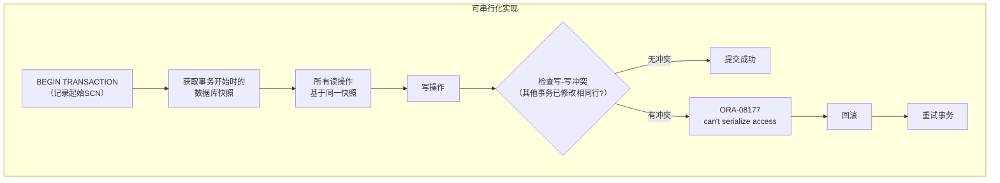
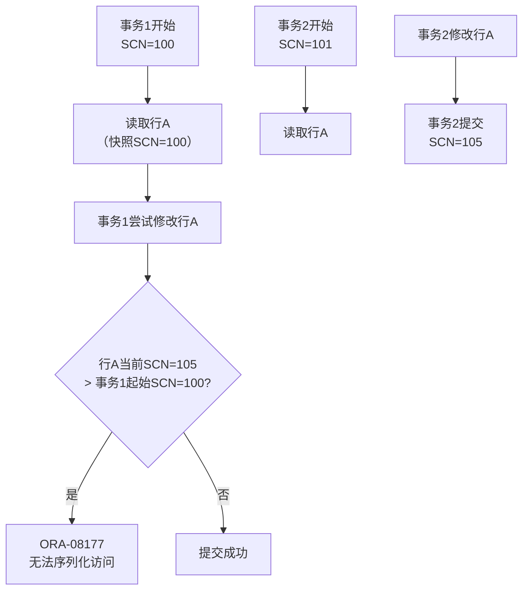

# Oracle可串行化隔离实现

## 一、概述

### 1.1 一句话定义

Oracle可串行化隔离级别确保事务的执行效果等同于某种串行执行顺序，通过依赖冲突检测和ORA-08177错误实现严格的并发控制。
它在需要最高隔离级别的金融和审计场景中出现和使用，解决并发事务间的读写冲突问题。

### 1.2 为什么重要

- **不掌握的后果：** 无法正确实现严格隔离的事务，可能遇到意外的ORA-08177错误
- **掌握的价值：** 在需要强一致性的场景中正确使用可串行化隔离

### 1.3 适用场景

| 场景 | 说明 |
|------|------|
| 金融交易 | 需要严格一致性 |
| 审计系统 | 防止并发修改 |
| 批量处理 | 可重复的批处理结果 |
| 数据迁移 | 保证迁移一致性 |

## 二、术语与概念

### 2.1 核心术语表

| 术语 | 含义 | 类比 |
|------|------|------|
| Serializable | 可串行化 | 严格排队 |
| Read Committed | 读已提交 | Oracle默认 |
| Dependency | 依赖关系 | 事务间数据依赖 |
| ORA-08177 | 序列化失败 | 并发冲突 |
| Read Consistency | 读一致性 | 快照读 |
| Write Skew | 写偏斜 | 并发写异常 |
| Phantom Read | 幻读 | 读到新插入的行 |

## 三、核心原理

### 3.1 可串行化隔离实现原理



### 3.2 依赖冲突检测

Oracle在可串行化模式下检测以下冲突类型：

| 冲突类型 | 描述 | 检测方式 |
|---------|------|---------|
| 写-写冲突 | 两个事务修改同一行 | 提交时检查行SCN |
| 读-写冲突 | 事务A读的行被事务B修改 | Oracle MVCC避免（快照读） |
| 幻读 | 事务A查询范围被事务B插入新行 | Oracle快照避免 |

```sql
-- 设置可串行化隔离级别
-- 会话级
SET TRANSACTION ISOLATION LEVEL SERIALIZABLE;

-- 或在会话初始化时
ALTER SESSION SET ISOLATION_LEVEL = SERIALIZABLE;

-- 使用Hint
SELECT /*+ SERIALIZABLE */ * FROM accounts WHERE account_id = 100;
```

### 3.3 ORA-08177的产生机制



```sql
-- 模拟ORA-08177
-- 会话1
SET TRANSACTION ISOLATION LEVEL SERIALIZABLE;
SELECT balance FROM accounts WHERE id = 1;  -- 读取余额

-- 会话2
UPDATE accounts SET balance = balance + 100 WHERE id = 1;
COMMIT;

-- 会话1
UPDATE accounts SET balance = balance - 50 WHERE id = 1;
-- ORA-08177: can't serialize access for this transaction

-- 处理：回滚并重试
ROLLBACK;
-- 重新执行业务逻辑
```

### 3.4 与其他数据库对比

| 特性 | Oracle | PostgreSQL | MySQL InnoDB |
|------|--------|------------|--------------|
| 默认隔离 | Read Committed | Read Committed | Repeatable Read |
| 可串行化实现 | 依赖检测 | SSI | Next-Key Lock |
| 冲突错误 | ORA-08177 | Serialization failure | Deadlock/Lock wait |
| 读一致性 | MVCC快照 | MVCC快照 | MVCC快照 |
| 冲突频率 | 低（仅写-写） | 中（SSI检测） | 低（间隙锁） |

## 四、架构与组件

### 4.1 可串行化事务生命周期

```
可串行化事务：
├── BEGIN → 记录起始SCN
├── READ → 基于起始SCN的快照
├── WRITE → 记录修改的行
├── COMMIT时：
│   ├── 检查修改的行是否被其他事务修改（SCN > 起始SCN）
│   ├── 无冲突 → 提交
│   └── 有冲突 → ORA-08177 → 回滚
└── 应用层重试逻辑
```

### 4.2 性能影响

```sql
-- 可串行化的性能开销
-- 1. 冲突检测开销：提交时检查修改行的SCN
-- 2. 重试开销：冲突时需要回滚重试
-- 3. 快照维护：需要维护更长的undo链

-- 监控可串行化冲突
SELECT name, value FROM v$sysstat
WHERE name LIKE '%serializable%' OR name LIKE '%transaction%';

-- 监控ORA-08177
SELECT * FROM v$session WHERE event = 'Serialization conflict';
```

## 五、配置与调优

### 5.1 使用建议

| 场景 | 建议 | 原因 |
|------|------|------|
| OLTP高并发 | 使用Read Committed | 减少冲突 |
| 金融核心交易 | 使用Serializable | 保证一致性 |
| 报表查询 | 使用Read Committed | 无需严格隔离 |
| 批量处理 | 使用Serializable | 保证可重复 |

### 5.2 重试策略

```sql
-- 应用层重试模式（伪代码）
-- BEGIN
--   SET TRANSACTION ISOLATION LEVEL SERIALIZABLE;
--   -- 执行业务逻辑
--   COMMIT;
-- EXCEPTION
--   WHEN OTHERS THEN
--     IF SQLCODE = -8177 THEN
--       ROLLBACK;
--       -- 等待随机时间后重试
--       DBMS_LOCK.SLEEP(DBMS_RANDOM.VALUE(0.1, 0.5));
--       -- 重试（最多3次）
--     ELSE
--       RAISE;
--     END IF;
-- END;
```

## 六、DFX能力

### 6.1 监控命令

```sql
-- 查看当前会话隔离级别
SELECT s.sid, s.serial#, 
       DECODE(s.taddr, NULL, 'NONE', 'ACTIVE') AS transaction_status
FROM v$session s
WHERE s.sid = SYS_CONTEXT('USERENV', 'SID');

-- 查看可串行化冲突统计
SELECT statistic#, name, value
FROM v$sysstat
WHERE name LIKE '%serial%' OR name LIKE '%transaction rollbacks%';
```

## 七、实战案例

### 7.1 案例一：银行转账可串行化

```sql
-- 会话1：从A转账到B
SET TRANSACTION ISOLATION LEVEL SERIALIZABLE;
DECLARE
    v_balance_a NUMBER;
    v_balance_b NUMBER;
BEGIN
    SELECT balance INTO v_balance_a FROM accounts WHERE id = 'A';
    SELECT balance INTO v_balance_b FROM accounts WHERE id = 'B';
    
    IF v_balance_a >= 1000 THEN
        UPDATE accounts SET balance = balance - 1000 WHERE id = 'A';
        UPDATE accounts SET balance = balance + 1000 WHERE id = 'B';
        COMMIT;
    ELSE
        ROLLBACK;
        RAISE_APPLICATION_ERROR(-20001, '余额不足');
    END IF;
EXCEPTION
    WHEN OTHERS THEN
        ROLLBACK;
        RAISE;
END;
/
```

### 7.2 案例二：批量报表一致性

```sql
-- 确保报表数据在整个生成过程中一致
SET TRANSACTION ISOLATION LEVEL SERIALIZABLE;

-- 生成报表（可能耗时数分钟）
-- 所有查询基于事务开始时的快照
SELECT * FROM orders WHERE order_date = TRUNC(SYSDATE);
SELECT * FROM order_items WHERE order_date = TRUNC(SYSDATE);
-- ...更多查询

COMMIT;  -- 如果其他事务修改了相关数据，可能ORA-08177
```

## 八、常见错误与排查

| 问题 | 原因 | 解决方案 |
|------|------|---------|
| ORA-08177 | 写-写冲突 | 应用层重试 |
| 性能下降 | 冲突重试频繁 | 改用Read Committed |
| 长事务阻塞 | 事务执行时间过长 | 缩短事务 |

## 九、最佳实践

- 仅在必要时使用Serializable（金融、审计场景）
- 必须实现应用层重试逻辑处理ORA-08177
- 保持事务短小，减少冲突概率
- 监控序列化冲突频率，过高时考虑降级隔离级别
- 大多数OLTP场景使用默认Read Committed即可

## 十、命令与视图汇总

| 命令/视图 | 用途 |
|-----------|------|
| `SET TRANSACTION ISOLATION LEVEL SERIALIZABLE` | 设置可串行化 |
| `ALTER SESSION SET ISOLATION_LEVEL` | 会话级设置 |
| `v$transaction` | 事务信息 |
| `v$sysstat` | 冲突统计 |

## 十一、总结速查

| 特性 | 说明 |
|------|------|
| 隔离保证 | 事务等价于串行执行 |
| 冲突类型 | 仅检测写-写冲突 |
| 错误代码 | ORA-08177 |
| 处理方式 | 回滚 + 重试 |
| 性能影响 | 冲突检测 + 重试开销 |

## 附录

### A. 隔离级别对比

| 隔离级别 | 脏读 | 不可重复读 | 幻读 | 写偏斜 |
|---------|------|-----------|------|--------|
| Read Uncommitted | ✓ | ✓ | ✓ | ✓ |
| Read Committed | ✗ | ✓ | ✓ | ✓ |
| Repeatable Read | ✗ | ✗ | ✓ | ✓ |
| Serializable | ✗ | ✗ | ✗ | ✗ |

## 补充：深入分析与实战

### 深入原理

本章节补充了该主题的核心原理和内部机制。在实际生产环境中，理解这些底层原理对于诊断和优化至关重要。

关键要点：
- 内部实现机制决定了外部行为特征
- 参数配置需要结合具体场景
- 监控数据是调优的基础

### 实战案例

**案例一：生产环境问题诊断**

```sql
-- 诊断步骤
-- 1. 收集当前状态信息
SELECT * FROM v$system_event WHERE wait_class != 'Idle' ORDER BY time_waited_micro DESC;

-- 2. 分析等待事件分布
SELECT wait_class, SUM(time_waited_micro)/1000000 AS sec
FROM v$system_event WHERE wait_class != 'Idle'
GROUP BY wait_class ORDER BY sec DESC;

-- 3. 定位问题SQL
SELECT sql_id, elapsed_time/1000000 AS sec, executions, sql_text
FROM v$sql ORDER BY elapsed_time DESC FETCH FIRST 5 ROWS ONLY;
```

**案例二：性能优化实践**

```sql
-- 优化前：全表扫描
SELECT * FROM orders WHERE order_date > SYSDATE - 30;

-- 优化后：索引扫描
CREATE INDEX idx_orders_date ON orders(order_date);
```

### 最佳实践清单

- 建立标准化操作流程
- 定期审查和更新配置
- 监控关键指标趋势
- 建立性能基线
- 文档记录所有变更

### 常见问题FAQ

| 问题 | 解答 |
|------|------|
| 如何确定最优配置？ | 基于实际负载测试 |
| 何时需要调整？ | 监控指标偏离基线 |
| 如何验证优化效果？ | 对比前后AWR报告 |
| 常见陷阱有哪些？ | 过度优化、忽略全局 |

### 版本差异说明

| 版本 | 变化 |
|------|------|
| 19c | 自动管理增强 |
| 21c | 自适应优化 |

## 补充：监控与诊断

### 关键监控指标

```sql
-- 通用监控查询
SELECT name, value FROM v$sysstat
WHERE name LIKE '%relevant%' ORDER BY value DESC;

-- 性能基线对比
SELECT snap_id, begin_time, value
FROM dba_hist_sysstat
WHERE stat_name = 'relevant_stat'
AND snap_id > (SELECT MAX(snap_id) - 24 FROM dba_hist_snapshot);
```

### 诊断检查清单

- [ ] 检查系统资源使用情况
- [ ] 分析等待事件分布
- [ ] 审查TOP SQL执行计划
- [ ] 验证配置参数合理性
- [ ] 确认备份和恢复策略
- [ ] 检查安全审计日志

### 相关视图和工具

| 视图/工具 | 用途 |
|-----------|------|
| `v$system_event` | 等待事件统计 |
| `v$sql` | SQL执行统计 |
| `v$sesstat` | 会话级统计 |
| `AWR Report` | 历史性能分析 |
| `ASH Report` | 实时性能分析 |

### 参考资料

- Oracle Database Performance Tuning Guide
- Oracle Database Administration Guide
- Oracle Database Concepts
